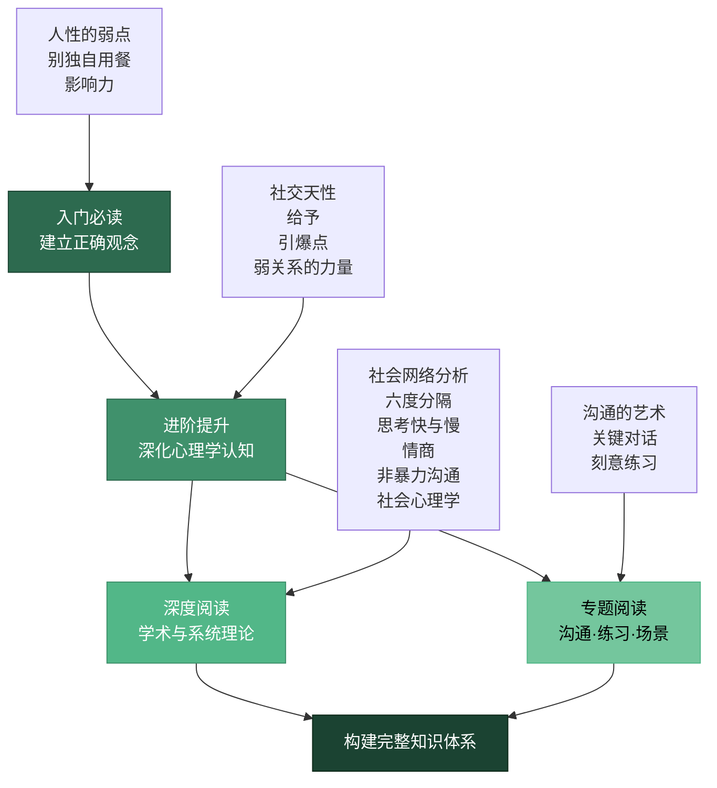
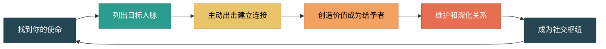
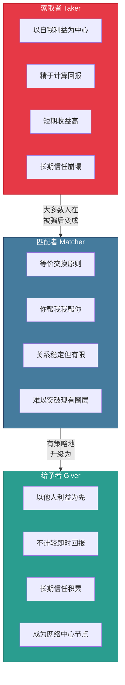
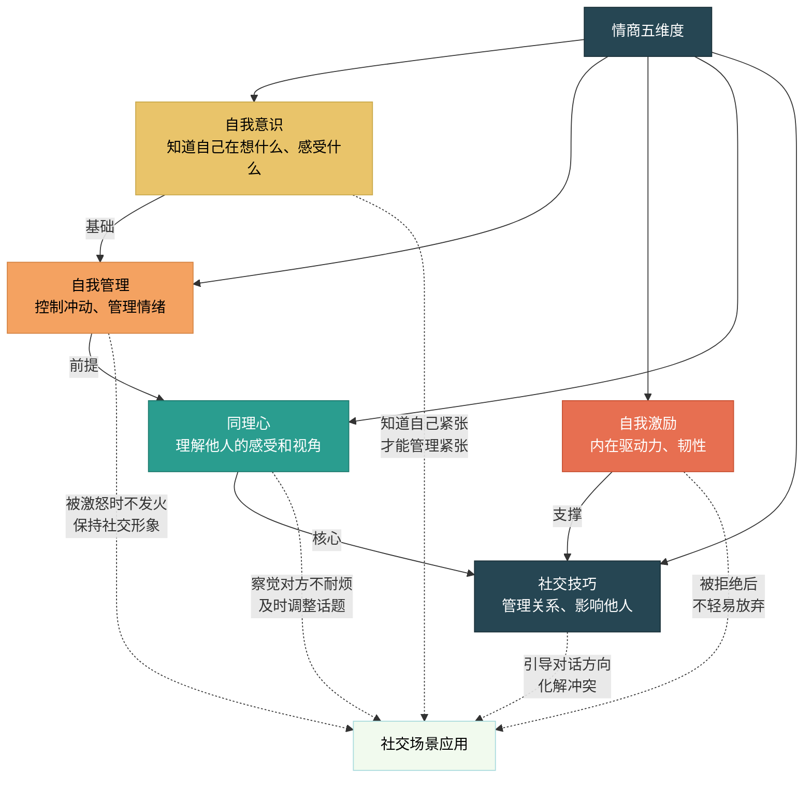
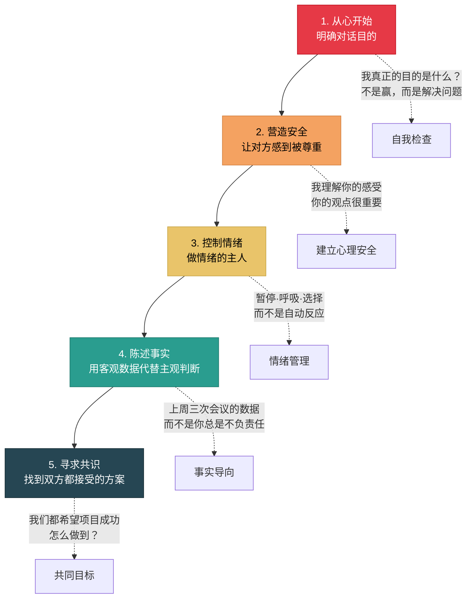
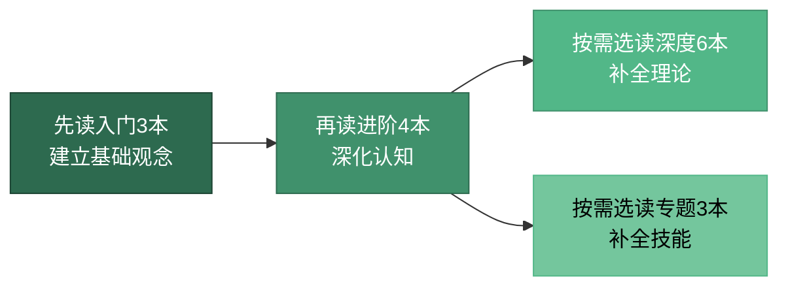

## 一、推荐书籍

人脉经营是一门融合心理学、社会学、沟通学和战略思维的综合学科。书籍是最系统、最深度的学习载体——一篇好的文章可以给你一个技巧，但一本好的书能帮你建立一套完整的认知框架。本节按照"入门→进阶→深度→专题"四个层级，为你梳理人脉经营领域的核心书单，每本书都给出详细的内容解析、适用场景、阅读策略和实践建议。

### 阅读路线总览

### 书单总览对比表

| 书名 | 作者 | 难度 | 核心关键词 | 最佳阅读时机 | 实操性 |
|------|------|------|-----------|-------------|--------|
| 《人性的弱点》 | 卡耐基 | ★☆☆ | 真诚·倾听·赞美 | 第1本，零基础入门 | ★★★★ |
| 《别独自用餐》 | 法拉奇 | ★★☆ | 系统·给予·品牌 | 有基础后系统化 | ★★★★★ |
| 《影响力》 | 西奥迪尼 | ★★☆ | 六原则·说服·防御 | 理解被影响机制 | ★★★★ |
| 《社交天性》 | 利伯曼 | ★★★ | 神经科学·共情·社交脑 | 想理解底层原理时 | ★★☆ |
| 《引爆点》 | 格拉德威尔 | ★★☆ | 传播·联系人·临界点 | 想扩大影响力时 | ★★★ |
| 《给予》 | 格兰特 | ★★☆ | 给予者·长期主义·边界 | 纠结社交策略时 | ★★★★ |
| 《弱关系的力量》 | 格兰诺维特 | ★★★ | 弱连接·信息桥·机会 | 拓展人脉遇到瓶颈时 | ★★★ |
| 《社会网络分析》 | 诺克 | ★★★★ | 网络结构·测量·演化 | 学术研究或深度学习 | ★★ |
| 《六度分隔》 | 瓦茨 | ★★★ | 小世界·网络·传播 | 理解网络本质 | ★★ |
| 《思考，快与慢》 | 卡尼曼 | ★★★★ | 认知偏差·决策·直觉 | 提升判断力时 | ★★★ |
| 《情商》 | 戈尔曼 | ★★★ | 自我管理·同理心·情绪 | 情绪管理有困难时 | ★★★★ |
| 《非暴力沟通》 | 卢森堡 | ★★☆ | 观察·感受·请求 | 冲突频发、沟通受阻时 | ★★★★★ |
| 《社会心理学》 | 迈尔斯 | ★★★★ | 认知·归因·群体·偏见 | 系统学习社会心理 | ★★ |
| 《沟通的艺术》 | 阿德勒 | ★★☆ | 语言·非语言·倾听 | 全面提升沟通能力 | ★★★★ |
| 《关键对话》 | 帕特森 | ★★☆ | 高压·安全·事实 | 面对艰难对话前 | ★★★★★ |
| 《刻意练习》 | 艾利克森 | ★★☆ | 反馈·突破·系统练习 | 能力提升遇到瓶颈时 | ★★★★★ |

---

### 1.1 入门必读：建立正确的人脉经营观念

入门阶段的核心目标不是学到多少技巧，而是建立正确的人脉认知框架。错误的观念会让你在社交中走弯路甚至走错路——比如把人脉经营等同于"攀关系"，或者认为社交就是"能说会道"。这三本书帮你从根上把观念摆正。

---

#### 📖《人性的弱点》— 戴尔·卡耐基

**一句话定位：** 人际关系领域的"圣经"，用最朴素的语言讲最深刻的社交真理。

**推荐理由：** 自1936年出版以来，这本书影响了全球超过5000万读者，被翻译成58种语言。它不是一本"技巧书"，而是一本"观念书"——卡耐基用数百个真实案例告诉你，社交的本质不是话术，而是真诚。近90年过去了，书中的原则依然是人际交往的基石。

**六大核心原则详解：**

| 原则 | 表面含义 | 深层逻辑 | 实操示例 |
|------|---------|---------|---------|
| 真诚地关心他人 | 关注别人的需要 | 人最关注的是自己，你关注他=满足他最深层的需求 | 见面时问"上次你提到的项目进展如何？"而非"我最近..." |
| 微笑是最好的名片 | 表情管理 | 微笑触发对方的镜像神经元，创造积极情绪感染 | 每天对3个陌生人微笑，观察对方反应变化 |
| 记住他人的名字 | 记忆技巧 | 名字是一个人身份认同的核心，记住=尊重 | 每次认识新人，在手机备忘录记下名字+特征+场景 |
| 做一个好的倾听者 | 少说多听 | 倾听是最高级的恭维，让对方感到被重视 | 对方说话时放下手机，用"然后呢？"引导深入 |
| 谈论对方感兴趣的话题 | 话题选择 | 每个人都有"心理热区"，触及就打开话匣子 | 提前了解对方的爱好/职业，准备2-3个相关话题 |
| 让对方感到自己很重要 | 赞美与认可 | 马斯洛需求层次中的"尊重需求"，仅次于自我实现 | 具体化赞美："你刚才的方案中对用户痛点的分析特别到位" |

**为什么这本书历久弥新：** 卡耐基的方法论有一个共同底层逻辑——**以对方为中心**。这不是"讨好"，而是理解人性：每个人内心最深层的需求是被看见、被理解、被重视。理解了这个底层逻辑，你就不会把社交技巧当作"套路"，而是发自内心的行为模式。

**常见误读与纠正：**

- ❌ 误读："这本书教的是圆滑世故" → ✅ 纠正：卡耐基反复强调"真诚"是一切的根基，技巧只是真诚的表达方式
- ❌ 误读："这些都是常识，没什么新东西" → ✅ 纠正：常识≠常做，90%的人知道但做不到
- ❌ 误读："这是老书了，过时了" → ✅ 纠正：人性不变，底层逻辑不过时；具体场景可以结合现代环境调整

**适合人群：** 所有人，尤其是社交新手、性格内向者、理工科背景者（逻辑化地理解社交）

**阅读建议：** 每读完一章，选择1-2个原则，在一周内刻意练习。建议准备一个"社交实验笔记本"，记录每次练习的场景、做法和结果。不要贪多，一个月吃透2-3个原则比泛读整本书有价值得多。

---

#### 📖《别独自用餐》— 基思·法拉奇

**一句话定位：** 从普通人到顶级人脉王的实战手册，把人脉经营从"天赋"变成"系统"。

**推荐理由：** 作者基思·法拉奇从宾州小镇的一个普通家庭孩子，成长为德勤咨询最年轻的高管之一，后来创办了多家公司。他把这一切归功于一套可复制的人脉经营系统。这本书最珍贵的地方在于：它不讲"大道理"，而是给你一套**具体的操作系统**——从如何建立人脉目标，到如何维护关系，到如何成为社交枢纽，每一步都有明确的行动指南。

**核心框架解析：**

法拉奇提出了一个完整的人脉经营闭环：

**关键策略深度解析：**

**"不要独自用餐"原则：** 一周5个工作日，每天至少和一个非同事共进午餐或咖啡。一年下来就是250+次深度社交机会。这不是"应酬"，而是把社交融入日常节奏。法拉奇的原话："你的午餐时间是你最有价值的社交资产。"

**"使命驱动型社交"：** 人脉不是"认识很多人"，而是"围绕你的核心目标建立有针对性的关系网"。先明确你的"人生使命"（职业目标、创业方向、个人成长方向），再据此筛选需要连接的人群。这避免了"社交疲劳"——你不会浪费时间在无关的社交活动上。

**"成为给予者"策略：** 在任何一段关系中，先问自己"我能为对方提供什么价值？"而不是"我能从对方那里得到什么？"价值可以是：信息、人脉介绍、专业建议、情感支持、甚至一个好故事。给予者最终会成为社交网络的中心节点，因为每个人都愿意围绕"有价值的人"建立连接。

**适合人群：** 职场人士、创业者、希望将人脉经营从"随缘"升级为"系统"的人

**阅读建议：** 这本书不是用来"读"的，是用来"做"的。边读边制定你自己的"人脉经营90天计划"：第一周盘点现有人脉，第二周确定使命和目标人群，第三周开始执行"每天一个社交行动"。每月底回顾一次关系网络的变化。

---

#### 📖《影响力》— 罗伯特·西奥迪尼

**一句话定位：** 理解"人为什么会说Yes"的社会心理学经典，社交中的攻防手册。

**推荐理由：** 西奥迪尼是全球最顶尖的影响力研究者之一，他在花了3年时间"卧底"各种销售、谈判、说服场景后，总结出了影响人类决策的六大心理原则。这本书的独特价值在于**双向应用**：你可以用这些原则来更有效地影响他人，也可以用它们来识别和抵御别人的影响力策略——在社交中，这两种能力同等重要。

**六大原则在社交场景中的应用：**

**原则一：互惠（Reciprocity）**

人类学家马塞尔·莫斯发现，所有人类社会都存在"互惠义务"——收到别人的馈赠会产生回报的心理压力。在人脉经营中，主动给予（哪怕是小忙、一条有用的信息、一个介绍）会为未来的关系铺路。西奥迪尼强调：**率先给予的人掌握关系的主动权**。

社交应用：第一次见面就分享一个对对方有价值的信息或资源，而不是上来就索取。记住"先存后取"原则——在需要帮助之前，先在关系银行里存够"信用"。

**原则二：承诺与一致（Commitment & Consistency）**

人们一旦做出承诺（哪怕是口头的、小的），就会倾向于后续行为与之一致。这是因为在心理上，人们需要维护"自我一致性"的内在形象。

社交应用：在对话中，先让对方做出小的承诺或认同（"你同意团队合作很重要对吧？"），再提出更大的请求，成功率会显著提高。这也是为什么"先请求小帮忙，再请求大帮忙"比直接请求大帮忙更有效。

**原则三：社会认同（Social Proof）**

人们在不确定时会参考他人的行为来决定自己的行为。"既然别人都这么做，那应该没问题"是最常见的决策捷径。

社交应用：展示你与共同人脉的关系，可以快速建立信任。"上次我和某某聊起你，他说你在这个领域特别专业"——这句话同时运用了社会认同和第三方背书。在社交场合中，有"社交证明"的人（被多人主动打招呼、被引荐给新人）会吸引更多人靠近。

**原则四：喜好（Liking）**

人们更容易被自己喜欢的人说服。而影响"喜好"的因素包括：相似性（我们喜欢和自己相似的人）、赞美（即使知道可能是恭维，我们仍然喜欢被赞美）、熟悉感（反复接触会增加好感）。

社交应用：寻找与对方的共同点（家乡、学校、爱好、经历），真诚地赞美对方的具体成就，保持稳定的接触频率。这些不是"技巧"，而是让对方从心底觉得"和你在一起很舒服"。

**原则五：权威（Authority）**

人们倾向于服从权威——这里的"权威"不仅指头衔和职位，还包括专业形象（穿着、谈吐）、自信程度、以及第三方背书。

社交应用：在社交场合中，不需要自吹自擂，但要通过专业话题的讨论、得体的着装、沉稳的表达来传递你的专业性。让别人感受到"这个人很专业"，自然会愿意与你建立更深入的连接。

**原则六：稀缺（Scarcity）**

稀缺性会增加事物的价值。"限时限额""独家信息""只告诉你一个人"——这些话术之所以有效，正是利用了人类对"失去"的恐惧远大于对"获得"的渴望（损失厌恶）。

社交应用：你的时间和精力是稀缺资源。不要表现得"随时有空"——适度展示你的忙碌（不是装，而是你确实有优先级），反而让别人更珍惜与你相处的机会。在社交中分享独家信息或稀缺资源，也能提升你在关系网络中的价值。

**适合人群：** 所有人，尤其是销售、营销、管理人员、创业者——以及任何想理解"人为什么会这样反应"的人

**阅读建议：** 每学完一个原则，花一天时间在生活中刻意观察这个原则的表现。准备一个"影响力日志"，记录你发现的真实案例（广告、谈判、日常对话中的应用）。一个月后再重读一遍，你会发现到处都是这些原则的影子。

---

### 1.2 进阶提升：深化社交心理学和影响力知识

当你已经掌握了社交的基本观念和原则后，进阶阶段的目标是**理解底层机制**——为什么人会这样社交？社交行为的科学基础是什么？如何在更高的维度上运用社交策略？

---

#### 📖《社交天性》— 马修·利伯曼

**一句话定位：** 用神经科学告诉你：人类为什么必须社交，社交如何改变大脑。

**推荐理由：** UCLA社会认知神经科学实验室主任马修·利伯曼，用20年的研究数据揭示了一个惊人事实：人类大脑有一个专用于社交的神经网络（默认模式网络，DMN），它在你不做任何事时自动启动——也就是说，**你的大脑天生就在不停"社交"**，即使你独处时也在模拟社交场景、回忆社交经历、预演社交对话。

**四大核心发现：**

| 发现 | 含义 | 对社交的启示 |
|------|------|------------|
| 大脑默认模式就是社交模式 | 不做事时，大脑自动进入社交思维 | 社交是人类的"出厂设置"，内向不是缺陷 |
| 社交需求和生理需求共享神经回路 | 被排斥激活的脑区和身体疼痛一致 | "心痛"不是比喻，是真实的神经反应 |
| 共情是自动化的神经过程 | 看到别人疼痛时，你的大脑也"疼" | 共情不需要刻意训练，但可以刻意强化 |
| 心智化能力决定社交深度 | 推测他人心理状态的能力是社交核心 | 理解"他怎么想的"比"他说了什么"更重要 |

**对人脉经营的深层启示：**

理解了社交的神经科学基础后，你会重新认识很多社交现象：

- **为什么孤独会"痛"：** 社交隔离激活的脑区和身体疼痛完全重叠。孤独不是"矫情"，是大脑在发出和饥饿、口渴一样的警报信号。这也解释了为什么人脉经营不只是"锦上添花"，而是心理健康的基本需求。

- **为什么"感觉对"比"逻辑对"重要：** 社交决策大多由"系统1"（快速直觉）做出，而非"系统2"（慢速理性）。第一印象在100毫秒内形成，而且极难改变。这告诉你：在社交场合中，**你的存在方式**（表情、姿态、能量场）比你说了什么重要得多。

- **为什么共情是可训练的：** 镜像神经元系统可以通过练习强化。多接触不同背景的人、多读小说（研究表明读文学小说能显著提升共情能力）、多进行深度对话——这些都能物理性地改变你的大脑结构。

**适合人群：** 对社交背后的科学原理感兴趣的人，想从"知道怎么做"升级到"理解为什么这样做"的进阶读者

**阅读建议：** 这本书偏学术，建议配合TED演讲《Why Do We Feel Social Pain》一起看。读完后，尝试用"神经科学视角"重新审视你最近的一次社交互动——你当时的大脑在做什么？

---

#### 📖《超级连接者》— 丹尼尔·布鲁斯

**一句话定位：** 在信息过载时代，连接不同群体的人才是真正的稀缺资源。

**推荐理由：** 信息时代最大的价值不是拥有信息，而是**连接信息孤岛**。布鲁斯通过大量案例研究揭示了一个规律：那些能够在不同行业、不同文化、不同圈层之间架起桥梁的"超级连接者"，往往拥有不成比例的影响力和资源调动能力。

**核心观点深度解析：**

**"结构洞"理论的实战版：** 社会学家罗纳德·伯特提出的"结构洞"（Structural Holes）理论指出，社交网络中最大的价值存在于那些互不连接的群体之间的空隙。超级连接者就是"填补结构洞"的人——他们连接了原本互相隔离的圈层，因此获得了独特的位置优势。

**如何成为超级连接者：**

1. **跨领域知识积累：** 只懂一个领域的人只能在同领域内连接。真正有价值的连接往往发生在"技术×商业""艺术×科技""学术×产业"的交叉地带。每个月至少花10%的时间了解一个与你主业无关的领域。

2. **双向翻译能力：** 超级连接者的核心能力是"翻译"——把A领域的话语翻译成B领域能理解的语言。比如你是技术人员，能把技术概念用商业语言讲给投资人听，你就是技术圈和资本圈的连接者。

3. **主动牵线搭桥：** 不要等别人来求你介绍，而是主动发现"这两个人如果认识一定会互相受益"的机会。每次成功的牵线都增加了你在两个圈子里的信任资本。

**适合人群：** 多领域背景者、跨界创业者、资源整合者、希望提升个人影响力的人

**阅读建议：** 列出你当前所在的3-5个不同社交圈层，画出它们之间的连接情况。找出"结构洞"——哪些圈层之间几乎没有连接？那里就是你的价值金矿。

---

#### 📖《引爆点》— 马尔科姆·格拉德威尔

**一句话定位：** 理解社会流行的传播规律，在社交网络中找到"杠杆支点"。

**推荐理由：** 格拉德威尔提出了一个颠覆性的观点：社会流行不是缓慢累积的，而是在某个临界点突然"引爆"的。理解引爆机制，能帮助你在人脉经营中识别关键人物、把握关键时机、放大社交影响力。

**三类关键人物理论：**

| 类型 | 特征 | 在社交网络中的角色 | 人脉经营策略 |
|------|------|-------------------|------------|
| 联系人（Connectors） | 认识的人跨越多个领域，社交半径极大 | 社交网络的枢纽节点，连接不同圈层 | 识别你网络中的联系人，维护好与他们的关系 |
| 内行（Mavens） | 掌握大量信息，热衷分享，是行走的信息库 | 信息的策展人和传播者 | 向内行请教、为内行提供传播渠道 |
| 推销员（Salesmen） | 天生具有说服力，能影响他人的决策 | 意见的放大器和推动者 | 让推销员认同你的价值主张，他们会帮你传播 |

**对人脉经营的启示：**

- **不要试图认识所有人，而要认识"对的人"：** 一个"联系人"朋友比100个普通朋友有价值得多，因为他们能把你引荐给完全不同的人群。
- **成为内行比成为推销员更可持续：** 当你成为一个领域的信息权威时，别人会主动来找你。你不需要"推销"自己，你的知识就是最好的名片。
- **找到你的"引爆点"：** 人脉网络存在临界质量效应——当你的关系网络达到一定规模和多样性后，机会开始"指数级"涌现。关键是前期耐心积累，不要过早放弃。

**适合人群：** 想理解社交网络传播规律的人、市场营销从业者、希望放大个人影响力的人

**阅读建议：** 用"联系人-内行-推销员"框架分析你现有的社交网络，给每个你认识的人分类。然后重点维护你识别出的"联系人"和"内行"型朋友。

---

#### 📖《给予》— 亚当·格兰特

**一句话定位：** 沃顿商学院教授用严谨研究证明：长期来看，真诚的给予者才是社交的最大赢家。

**推荐理由：** 这本书解决了一个困扰很多人的社交困惑："我在社交中应该做给予者还是保护自己？"格兰特用大量实证数据揭示了一个反直觉的结论：在成功的长期博弈中，给予者（Giver）在最成功和最失败的人群中都占多数。区别在于：**成功的给予者有明确的边界和策略，失败的给予者没有。**

**三种社交风格深度对比：**

**"成功给予者"的四大策略：**

1. **慷慨但有边界：** 无条件的给予会导致"给予者倦怠"。成功的给予者知道什么时候说"不"——他们的慷慨是有选择的，集中在自己擅长和有热情的领域。

2. **批量给予，减少碎片化：** 不是每天零散地帮小忙，而是集中时间做"高价值给予"——比如每月花一个下午为朋友做深度介绍、分享行业报告、提供专业建议。

3. **展示可信度：** 单纯的善良不够，你需要让别人知道你有能力。在社交中，先通过专业能力赢得尊重，再通过给予赢得信任。"有能力的给予者"比"好心的给予者"影响力大10倍。

4. **制度化给予：** 把给予变成习惯和系统，而非依赖意志力。比如：每周五固定花30分钟给3个人脉发送有价值的信息；每季度组织一次跨圈层聚会；每年帮5个新人做职业引荐。

**给予者防"燃尽"清单：**

- ✅ 给予集中在你的核心能力范围内
- ✅ 设定每周/每月的给予时间上限
- ✅ 远离"永久索取者"——识别并限制与他们的互动
- ✅ 记录你的给予行为和回报（不是为了等价交换，而是为了识别模式）
- ✅ 定期评估：这段关系是双向的吗？
- ❌ 不要因为"不好意思拒绝"而答应所有请求
- ❌ 不要在给予后立刻期待回报
- ❌ 不要牺牲自己的核心利益去帮助别人

**适合人群：** 所有人，尤其是容易在社交中"过度付出"的人、纠结于"社交到底要不要功利"的人

**阅读建议：** 做一个"社交风格自测"——回顾过去一个月的社交行为，你是哪种类型？如果发现自己是"燃尽型给予者"，重点学习边界设定；如果是"匹配者"，尝试在一个小范围内升级为"有策略的给予者"，观察关系的变化。

---

#### 📖《弱关系的力量》— 马克·格兰诺维特

**一句话定位：** 社会学经典论文，揭示了"不熟的人"为什么比"熟人"更能给你带来机会。

**推荐理由：** 1973年发表的这篇论文是社会网络研究的里程碑之作。格兰诺维特通过调查波士顿地区的求职者发现了一个惊人规律：**大多数好工作不是通过亲密朋友获得的，而是通过"点头之交"——那些你不太熟但偶尔联系的人——获得的。** 这个发现至今仍然是人脉经营领域最重要的理论基础。

**弱关系为什么更有价值：**

| 维度 | 强关系（亲密朋友） | 弱关系（点头之交） |
|------|-------------------|-------------------|
| 信息重叠度 | 高——你们知道的差不多 | 低——他们接触你接触不到的信息 |
| 圈层覆盖 | 同质——多在同一社交圈 | 异质——分布在完全不同的人群中 |
| 信息新颖度 | 低——重复信息 | 高——跨界信息 |
| 机会多样性 | 有限 | 极大 |
| 信任基础 | 强但范围窄 | 弱但范围广 |

**对人脉经营的核心启示：**

1. **不要只和"自己人"玩：** 舒适区社交（和相似背景的人混在一起）会让你的社交网络同质化，信息茧房化。刻意走出舒适区，参加不同领域的活动，认识不同背景的人。

2. **维护弱关系网络：** 弱关系需要"最小维护"——不需要深度交往，但需要保持存在感。一条节日问候、一个朋友圈点赞、一篇转发的好文章——这些"低成本接触"就能保持弱关系的活性。

3. **从弱关系中寻找机会：** 当你需要找工作、找合作方、找信息时，不要只问亲密朋友，更要激活你的弱关系网络。他们能提供你朋友圈中不存在的信息和资源。

4. **弱关系可以转化为强关系：** 当你发现某个弱关系特别有价值时，可以通过增加接触频率和深度来将其升级为强关系。但不是所有弱关系都需要升级——保持弱关系的"弱"本身就是价值。

**适合人群：** 拓展人脉遇到瓶颈的人、社交网络过于单一的人、正在求职或创业的人

**阅读建议：** 列出你手机通讯录中的50个"弱关系"——那些你认识但不常联系的人。评估他们的圈层多样性和信息独特性。挑选5个最有价值的，本周各发一条消息重建连接。

---

### 1.3 深度阅读：从学术和心理学角度深入理解

当你已经建立了实践经验和中级理论基础后，深度阅读帮你从学术层面理解社交的底层逻辑。这些书不一定直接教你"怎么做"，但它们会帮你理解"为什么这样做有效"——这种深层理解会让你的社交能力产生质的飞跃。

---

#### 📖《社会网络分析》— 戴维·诺克

**一句话定位：** 社会网络分析的权威教材，用数学和图论的方法解析社交网络的结构。

**推荐理由：** 如果你想从"感性理解"社交网络升级为"理性分析"社交网络，这本书是不二之选。诺克是社会网络分析领域的奠基人之一，他系统介绍了如何用网络分析的方法来理解社交结构、识别关键节点、预测信息传播路径。

**核心知识体系：**

| 概念 | 定义 | 在人脉经营中的应用 |
|------|------|-------------------|
| 中心性（Centrality） | 一个节点在网络中的重要程度 | 评估你在社交网络中的位置——中心性越高，影响力越大 |
| 度中心性 | 直接连接数量 | 你直接认识多少人 |
| 中介中心性 | 处于多少条最短路径上 | 你连接了多少"本来不相连"的人——超级连接者的核心指标 |
| 接近中心性 | 到达所有其他节点的平均距离 | 你的信息传播速度有多快 |
| 凝聚子群 | 网络中紧密连接的小群体 | 你的社交圈中有哪些"小圈子" |
| 结构洞 | 不同子群之间的空隙 | 跨越结构洞的人获得信息和控制优势 |

**实用价值：** 虽然这本书偏学术，但理解这些概念后，你可以用更科学的方法来分析和优化自己的社交网络。比如：用"中心性"来评估自己在团队中的社交地位，用"结构洞"来寻找拓展人脉的方向，用"凝聚子群"来识别自己社交网络的同质化问题。

**适合人群：** 对社交网络理论有深入兴趣的人、数据科学家、社会学研究者、希望用科学方法优化人脉网络的人

**阅读建议：** 可以先阅读前3章（基本概念和测量方法），有余力再深入后续章节。配合Gephi等网络可视化工具，尝试画出你自己的社交网络图——你会对自己的社交结构有全新的认识。

---

#### 📖《六度分隔》— 邓肯·瓦茨

**一句话定位：** 为什么世界上任意两个人之间只隔6步？这本书从网络科学的角度给出了解答。

**推荐理由：** 1967年，社会心理学家斯坦利·米尔格拉姆做了一个著名的实验：随机让内布拉斯加州的居民给波士顿的陌生人寄信，规则是只能通过认识的人转发。结果发现平均只需要6步就能送达——这就是"六度分隔"的由来。瓦茨用网络科学的方法深入研究了这个现象，揭示了社交网络的"小世界"结构。

**核心发现对人脉经营的启示：**

1. **世界比你想象的小：** 任何两个陌生人之间的连接距离都很短。这意味着你"不可能认识"的人，实际上通过2-3次引荐就能建立连接。不要被"我没有那个人脉"的思维限制住。

2. **弱关系是"捷径"：** 网络中的长程连接（弱关系）是缩短社交距离的关键。你的每个弱关系都可能是一条通往全新社交世界的捷径。

3. **网络位置比个人能力更重要：** 在小世界网络中，少数"集散节点"（hub）承担了大部分连接功能。如果你能成为某个领域的"集散节点"，你就能用最少的精力获得最大的连接覆盖。

4. **病毒式传播的条件：** 信息在网络中的传播需要"临界质量"——当连接密度达到某个阈值时，信息会突然从局部传播到全局。这解释了为什么有些人的社交影响力会"突然爆发"。

**适合人群：** 对网络科学感兴趣的人、想理解社交网络传播规律的人

**阅读建议：** 这本书相对通俗，适合一个周末读完。读完后尝试做一次"六度实验"——找一个你想认识但目前不认识的人，看看通过几层引荐可以建立连接。

---

#### 📖《思考，快与慢》— 丹尼尔·卡尼曼

**一句话定位：** 诺贝尔经济学奖得主揭示人类思维的两套系统，理解社交中的判断和决策偏差。

**推荐理由：** 虽然不是专门讲社交的书，但卡尼曼对人类认知偏差的研究对社交有着深刻的影响。我们的社交判断——第一印象、信任评估、关系决策——大部分由"系统1"（快速直觉思维）做出，而系统1充满了各种可预测的偏差。理解这些偏差，能帮你在社交中做出更明智的判断。

**社交中常见的认知偏差：**

| 偏差名称 | 含义 | 社交中的表现 | 应对策略 |
|----------|------|------------|---------|
| 光环效应 | 一个正面特征让你认为一切都好 | 觉得长得好看的人也更善良、更有能力 | 关注具体行为而非第一印象 |
| 确认偏差 | 只关注支持已有观点的信息 | 对某人第一印象不好后，只记住他的缺点 | 主动寻找反面证据 |
| 可得性偏差 | 用容易想到的信息做判断 | 最近一次社交失败就认为自己社交不行 | 用数据和全局视角替代记忆 |
| 锚定效应 | 被最初的信息"锚住" | 第一次听到的薪资数字影响后续判断 | 多方获取信息，主动重设参考点 |
| 框架效应 | 同样的信息不同的表达方式导致不同判断 | "80%成功率"和"20%失败率"说的是一回事 | 换个角度重新审视信息 |
| 损失厌恶 | 对损失的恐惧是获得快乐的2倍 | 不敢主动社交，怕被拒绝 | 重新定义"失败"——被拒绝的代价远比你想象的小 |

**对社交的核心启示：**

- **第一印象很强大但不一定准确：** 系统1在100毫秒内形成第一印象，且极难改变。但你要知道，这个印象可能被光环效应、刻板印象等偏差扭曲。对于重要的人脉，给自己"二次判断"的机会。
- **社交焦虑的认知解构：** "所有人都在看我""他们一定觉得我很尴尬"——这些都是系统1的自动思维，往往是错的。用系统2（慢速理性）来检验这些想法的证据。
- **决策疲劳影响社交质量：** 一天做太多决策后，系统1主导，社交判断力下降。重要的社交安排（面试、谈判、关键会面）放在精力最好的时段。

**适合人群：** 希望提升社交判断力的人、对认知科学感兴趣的人、想理解自己社交决策偏差的人

**阅读建议：** 这本书较厚（400+页），建议挑选与社交相关的章节精读，尤其是"启发法与偏差"和"两个自我"部分。每读到一个偏差，回忆自己在社交中是否中过招。

---

#### 📖《情商》— 丹尼尔·戈尔曼

**一句话定位：** 情商不是"会说话"，而是管理自己和理解他人的系统能力。

**推荐理由：** 戈尔曼将情商（EQ）从一个模糊概念发展成了一套科学框架。他提出情商包含五个维度，每个维度都直接影响社交质量。研究表明，情商对职业成功的预测力是智商的两倍——在人脉经营中，情商更是核心基础设施。

**情商五维度与社交的对应关系：**

**每个维度的社交实战应用：**

- **自我意识：** 在社交场合中，你能实时察觉自己的情绪状态吗？"我现在有点紧张""我在过度表现""我在防御模式"——这种自我觉察是一切社交改进的起点。方法：社交前后各花2分钟做情绪扫描。

- **自我管理：** 被人当众质疑时，你的第一反应是什么？暴怒、退缩还是冷静回应？自我管理不是压抑情绪，而是**选择回应方式**。方法：在情绪被触发时，给自己3秒钟缓冲——"我需要想一下再回答"。

- **自我激励：** 社交中最重要的品质不是"外向"，而是**韧性**——被拒绝后还能继续、关系没进展时不放弃、长期维护关系的耐心。方法：把社交看作"长期投资"而非"即时交易"。

- **同理心：** 这是社交的"超级武器"。真正的同理心不是"我理解你"这句话，而是能准确感知对方的情绪和需求。方法：练习"情绪标注"——在对话中把对方可能的情绪说出来："听起来这件事让你挺沮丧的？"

- **社交技巧：** 这是前四个维度的综合运用。包括：引导对话、化解冲突、建立共识、影响决策。这些技巧不是天生的，而是通过前四个维度的练习逐步积累的。

**适合人群：** 情绪管理有困难的人、想系统提升社交底层能力的人、管理者和领导者

**阅读建议：** 先做一次情商自测（书中附有测试），找到自己最弱的维度。接下来一个月，集中练习这个维度。比如同理心弱的人，每天练习一次"情绪标注"；自我管理弱的人，每天记录一次"情绪触发事件"和自己的反应。

---

#### 📖《非暴力沟通》— 马歇尔·卢森堡

**一句话定位：** 一套简单到只有四步的沟通方法，能化解90%的人际冲突。

**推荐理由：** 社交中最大的破坏力不是不会说话，而是**说错话**——尤其是在冲突和压力场景中。卢森堡博士在50多年的调解实践中（包括在巴以冲突地区的现场调解），发展出了"非暴力沟通"（NVC）四步法。这套方法简单得令人难以置信，但效果惊人。

**四步法详解及示例：**

| 步骤 | 含义 | 错误示范 | 正确示范 |
|------|------|---------|---------|
| **观察** | 客观描述事实，不加评判 | "你总是迟到" | "这周的三次会议你分别迟到了5分钟、10分钟和15分钟" |
| **感受** | 表达自己的真实感受 | "你让我很生气" | "我感到有些焦虑和不被尊重" |
| **需要** | 说出感受背后的核心需求 | "你不在乎这个项目" | "我需要感受到团队对这个项目的共同承诺" |
| **请求** | 提出具体、可行的请求 | "你能不能靠谱一点" | "你能在会议开始前5分钟到吗？如果会迟到，提前发个消息" |

**为什么四步法如此有效：**

- **"观察"分离了事实和评判：** 当你说"你总是迟到"时，对方的第一反应是反驳"我不是每次都迟到"——对话立刻变成争论。而描述事实时，对方无法反驳，只能面对。
- **"感受"替代了指责：** "你让我生气"隐含"都是你的错"；"我感到焦虑"是我自己的感受——对方不会进入防御模式。
- **"需要"暴露了根源：** 大多数冲突不是因为表面事件，而是因为底层需求未被满足。把需求说出来，就从"谁对谁错"转向"如何满足需求"。
- **"请求"而非"命令"：** 请求给对方选择权，命令激发抗拒。"你能在会议前到吗？"是请求；"你必须准时"是命令。

**NVC在人脉经营中的应用场景：**

1. **朋友间的价值观冲突：** "你最近每次见面都迟到（观察），我感到被忽视（感受），因为尊重对我来说很重要（需要），你能不能提前告诉我如果会晚到（请求）？"

2. **职场中的合作摩擦：** "我注意到这周的报告数据和上次不同（观察），我有些困惑（感受），因为数据准确性对我的判断很重要（需要），我们能一起核对一下吗（请求）？"

3. **拒绝别人的请求：** "我理解你希望我帮忙搬家（肯定对方），我这周末已经有安排（观察），我感到有些抱歉（感受），因为帮助朋友对我很重要（需要），下周六我可以帮你吗（请求的反向提出）？"

**适合人群：** 在人际冲突中经常感到无力的人、沟通中容易"说错话"的人、希望提升深层沟通能力的人

**阅读建议：** 先通读全书理解框架，然后选一个你最近的人际冲突，用四步法重新演练一遍当时的对话。你会发现，换一种说法，结果可能完全不同。建议配合"情绪词汇表"使用——很多人连自己的"感受"都说不清楚。

---

#### 📖《社会心理学》— 戴维·迈尔斯

**一句话定位：** 社会心理学领域的"百科全书"，系统理解人类社会行为的底层逻辑。

**推荐理由：** 这是全球使用最广泛的社会心理学教材，被数百所大学采用。迈尔斯用讲故事的方式讲解学术研究，既有严谨的科学性，又有极高的可读性。它覆盖了影响社交的所有核心心理机制，是理解"人为什么会这样行为"的终极参考书。

**对人脉经营最有价值的章节及核心知识点：**

| 章节 | 核心概念 | 人脉经营应用 |
|------|---------|------------|
| 社会认知 | 归因理论、刻板印象、自证预言 | 理解别人如何看你，以及你如何影响别人的看法 |
| 态度与说服 | 认知失调、说服的中心路径和外周路径 | 如何更有效地表达观点、影响他人 |
| 从众与服从 | 从众心理、少数派影响 | 理解群体社交中的行为模式 |
| 群体影响 | 社会懈怠、去个体化、群体极化 | 理解为什么"一群人"和"一个人"的行为不同 |
| 偏见与歧视 | 内群体偏好、外群体同质性 | 理解社交中的"圈子效应"和排外心理 |
| 人际吸引 | 接近性、相似性、互补性、外貌 | 理解"人为什么喜欢某些人"的科学规律 |
| 亲密关系 | 依恋理论、爱情三角理论 | 从学术角度理解亲密关系的形成和维持 |

**"人际吸引"核心规律深度解读：**

社会心理学研究发现了影响人际吸引的四大因素，按影响力排序：

1. **接近性（Proximity）：** 距离越近的人越容易成为朋友——不是因为"近水楼台"，而是因为反复接触会产生熟悉感（单纯曝光效应）。**启示：** 想和某人建立关系，先增加物理接触的频率。

2. **相似性（Similarity）：** 人们倾向于喜欢和自己相似的人——态度、价值观、背景、兴趣越相似，吸引力越大。**启示：** 在社交中主动寻找和展示共同点。

3. **互补性（Complementarity）：** 在某些情况下，差异也能产生吸引力——特别是当差异能满足对方的需求时。**启示：** 你独特的技能和视角本身就是社交资本。

4. **个人品质：** 最吸引人的品质包括：真诚、温暖、能力强。最不吸引人的品质包括：不真诚、冷漠、不忠诚。**启示：** 与其花时间学"社交技巧"，不如修炼这些核心品质。

**适合人群：** 想系统学习社会心理学的人、对人类社会行为有深层好奇心的人

**阅读建议：** 这本书很厚（600+页），建议分模块精读。优先读"人际吸引"和"态度与说服"两个模块，这两个对人脉经营的实用价值最高。每章后面的"实践社会心理学"专栏特别有价值，直接给出了研究结论的日常应用。

---

### 1.4 专题阅读：沟通能力与刻意练习

专题阅读针对社交中的具体能力模块——沟通和练习方法论。这些书不是"人脉经营"书，但它们提供了人脉经营最关键的支撑能力。

---

#### 📖《沟通的艺术》— 罗纳德·阿德勒

**一句话定位：** 人际沟通领域的"教科书"，从理论到技巧的全面覆盖。

**推荐理由：** 这本书被全球上千所大学用作沟通学课程教材，覆盖了人际沟通的所有核心维度：语言沟通、非语言沟通、倾听技巧、情感表达、冲突管理、关系维护。它的优势在于**全面且平衡**——既有学术深度，又有大量练习和案例。

**核心能力模块：**

| 模块 | 关键内容 | 社交中的重要性 |
|------|---------|--------------|
| 倾听 | 主动倾听、同理性倾听、倾听障碍 | 80%的社交问题源于"没在听" |
| 非语言沟通 | 表情、姿态、空间距离、触碰 | 55%的信息通过非语言传递（梅拉比安法则） |
| 语言表达 | 清晰度、"我"语言、描述性表达 | 减少误解和冲突 |
| 情感表达 | 情绪觉察、适当表达、脆弱的力量 | 真实的情感表达加深关系 |
| 冲冲管理 | 冲突类型、处理策略、双赢思维 | 人脉维护中最大的挑战 |

**"倾听"能力的三个层级：**

1. **听而不闻（Level 1）：** 身体在场，心思不在。表现：看手机、眼神飘忽、答非所问。社交中的影响：让对方觉得"你不尊重我"。

2. **选择性倾听（Level 2）：** 只听自己感兴趣的部分。表现：只在对方提到你关心的话题时才专注。社交中的影响：错过重要信息和情感信号。

3. **同理性倾听（Level 3）：** 全身心投入，理解对方的言语、情感和需求。表现：眼神接触、适时回应、情感标注、追问深入。社交中的影响：让对方感到"被真正理解"——这是最强大的社交粘合剂。

**适合人群：** 希望系统提升沟通能力的人、沟通学和心理学爱好者

**阅读建议：** 每章后都有"自我评估"和"实践练习"，一定要做。选一个沟通维度作为本月重点提升目标（推荐从"倾听"开始），用书中的练习方法进行刻意训练。

---

#### 📖《关键对话》— 科里·帕特森

**一句话定位：** 教你在高压、高风险、高情绪的场景中进行有效沟通——这些时刻决定了人脉关系的走向。

**推荐理由：** 很多重要的人脉关系不是毁于日常小事，而是毁于一两次"关键对话"的失败——一次晋升面谈、一次商业谈判、一次朋友间的坦诚交流、一次冲突后的和解。帕特森团队研究了数万个关键对话场景，总结出了一套在高压环境中保持有效沟通的方法。

**关键对话的三个特征：**

1. **高风险：** 对话的结果对你或对方有重要影响（升职、合作、关系存续）
2. **高情绪：** 双方情绪激动，容易失控（愤怒、恐惧、委屈）
3. **高分歧：** 双方观点不同，甚至完全对立

**应对关键对话的五步法：**

**"心理安全"是关键对话的核心：**

当对方感到不安全时（被攻击、被评判、被忽视），会进入"战斗或逃跑"模式——要么反击，要么沉默。两种结果都会破坏对话。创建心理安全的方法：

- **对比法：** "我不是想批评你，我是想讨论如何改进这个方案。"
- **共同目标：** "我们都希望这件事成功，对吧？"
- **道歉（如果需要）：** "我之前的表达方式可能让你不舒服，抱歉。"
- **适时暂停：** "我感觉我们都有些激动，休息10分钟再继续？"

**适合人群：** 面对艰难对话就紧张的人、管理者、需要处理冲突的任何人

**阅读建议：** 回忆你最近一次"关键对话"失败的场景，用五步法重新演练。想象如果你当时用了这些方法，结果会怎样不同。下次遇到关键对话前，花5分钟在纸上写下"我的目的是什么""对方可能的感受""我需要的事实"。

---

#### 📖《刻意练习》— 安德斯·艾利克森

**一句话定位：** 世界上没有"社交天赋"这回事——卓越的社交能力是练出来的。

**推荐理由：** 艾利克森用30年的研究证明了一个颠覆性观点：所谓的"天才"和"普通人"之间的差距，99%来自练习方法的差异，而非天赋。这个结论对社交领域意义重大——**社交能力不是天生的，是可以通过科学的练习方法系统提升的。**

**刻意练习四要素在社交中的应用：**

| 要素 | 原理 | 社交实操 |
|------|------|---------|
| 明确的改进目标 | 不是"多练习"，而是"练习什么" | "这周我要练习在30秒内做自我介绍"而非"多认识人" |
| 专注的练习区 | 练习区域在舒适区之外、恐慌区之内 | 选择比当前能力略高一点的社交场景练习 |
| 即时反馈 | 没有反馈的练习等于原地踏步 | 每次社交后自评或请信任的朋友给反馈 |
| 重复与修正 | 反复练习直到技能自动化 | 同一个场景练到自然，再进入下一个难度 |

**社交能力刻意练习示例——"自我介绍"的30天训练计划：**

| 周次 | 练习目标 | 练习方式 | 反馈来源 |
|------|---------|---------|---------|
| 第1周 | 30秒简洁自我介绍 | 每天对镜子练习5遍，录视频 | 自评：是否简洁、有记忆点 |
| 第2周 | 根据场景调整自我介绍 | 对不同人讲不同版本（同行/跨行/长辈） | 请朋友反馈哪个版本最好 |
| 第3周 | 在真实社交中使用 | 参加1-2次社交活动，实战使用 | 对方的反应和后续互动深度 |
| 第4周 | 加入故事元素 | 把"我是做什么的"变成"我为什么做这个" | 对方是否被故事打动、主动追问 |

**如何把社交变成"可练习"的技能：**

1. **拆解社交技能：** 社交不是单一技能，而是由众多子技能组成的——倾听、提问、自我介绍、讲故事、化解尴尬、表达不同意见、跟进维护……把"提高社交能力"这个模糊目标拆解成具体的子技能。

2. **设计微练习：** 每个子技能都可以设计成日常可执行的微练习。比如"倾听"的微练习：每天和一个人聊天时，全程不看手机，用3次"然后呢？"引导对方深入。

3. **建立反馈循环：** 社交反馈不像体育训练那样即时可见，但你可以自己创造反馈：社交后写3分钟反思日志（什么做得好、什么可以改进）、录视频复盘、请信任的人直言反馈。

4. **逐步提高难度：** 从低风险场景开始练习（家人、老朋友），逐步升级到中风险场景（同事、新朋友），最后到高风险场景（重要客户、上级领导）。

**适合人群：** 社交能力提升遇到瓶颈的人、相信"天赋论"而放弃社交提升的人、想用科学方法提高社交水平的人

**阅读建议：** 不要把这本书当"社交书"来读——把它当"学习方法论"来读。读完后，为你最想提升的社交子技能设计一个"30天刻意练习计划"，然后严格执行。

---

### 1.5 阅读策略：如何把书中的知识变成你的能力

读完书单只是第一步，真正的挑战是如何把知识转化为行动。以下是经过验证的"读-学-用"三层策略：

#### 第一层：读——建立知识框架

**顺序策略：**

**阅读节奏建议：**

| 阶段 | 时间规划 | 每周投入 | 方法 |
|------|---------|---------|------|
| 入门期 | 1-2个月 | 3-5小时/周 | 精读+笔记+实践 |
| 进阶期 | 2-3个月 | 3-5小时/周 | 主题阅读+交叉对比 |
| 深度期 | 持续 | 2-3小时/周 | 按需精读+学术兴趣驱动 |
| 专题期 | 按需 | 弹性 | 缺什么补什么 |

#### 第二层：学——内化知识体系

**费曼学习法应用于社交知识：**

1. **选择一个概念**（比如"弱关系理论"）
2. **用最简单的语言讲给别人听**（如果讲不清楚，说明你没真正理解）
3. **发现卡壳的地方，回去重读**
4. **简化再简化，直到任何人都能听懂**

**知识关联图：** 读完每本书后，花10分钟画出这本书的核心概念与你已知知识的关联——哪些概念相互印证？哪些存在矛盾？哪些可以组合使用？这种主动关联的过程比重复阅读有效10倍。

#### 第三层：用——从知识到能力

**"一本书一个行动"原则：** 每读完一本书，不要试图应用所有内容——选一个最打动你的点，设计一个可执行的30天行动计划。30天后评估效果，再进入下一本。

**社交实验日志模板：**

| 日期 | 实验内容 | 场景 | 做法 | 效果 | 下次改进 |
|------|---------|------|------|------|---------|
| 示例 | 练习"记住名字" | 公司新同事入职 | 见面时重复对方名字+关联记忆 | 一周后准确记住5人名字 | 用手机备忘录辅助 |
| | | | | | |

**"读-用-教"闭环：** 最高效的学习方式是"教给别人"。当你能把书中的方法教会别人时，你才算真正掌握了。可以在朋友间组织"社交学习小组"，每周分享一本书的核心收获和实践经验。

---

### 1.6 常见误区与纠正

**误区一："读完这些书我就能成为社交达人"**

纠正：读书是输入，实践才是输出。没有实践的阅读就像没有训练的健身——你知道所有动作，但肌肉不会增长。每读完一章，必须安排实践。

**误区二："社交技巧就是操控别人"**

纠正：卡耐基、西奥迪尼的书确实讲了影响他人的方法，但所有真正有效的社交策略都建立在**真诚**的基础上。操控可能短期有效，长期必然反噬。把技巧当作"真诚的更好表达方式"，而非"操控工具"。

**误区三："我是内向的人，这些书不适合我"**

纠正：内向和社交能力是两回事。苏珊·凯恩的《安静：内向性格的竞争力》证明，内向者在深度社交、一对一连接、倾听理解等方面往往比外向者更有优势。人脉经营不等于"成为社交蝴蝶"，而是找到适合自己的社交方式。

**误区四："社交就是认识更多人"**

纠正：人脉质量远比数量重要。10个真正信任你的朋友比1000个点赞之交有价值得多。《弱关系的力量》告诉我们，弱关系带来机会；但《给予》告诉我们，强关系带来深度支持。两者都需要，但不要混淆"扩大网络"和"深化关系"。

**误区五："社交是有钱有闲的人的事"**

纠正：社交不需要参加昂贵的活动或出入高端场所。最有效的社交往往发生在日常生活中——一次共进午餐、一次真诚的请教、一条有价值的信息分享。《别独自用餐》的核心就是把社交融入日常节奏，而不是"额外投入"。

---

### 1.7 延伸阅读与数字资源

除了以上推荐书籍，以下资源可以作为补充：

**播客推荐：**

| 播客 | 内容方向 | 适合场景 |
|------|---------|---------|
| 《得到·关系攻略》 | 中国语境下的社交策略 | 通勤路上碎片化学习 |
| Hidden Brain（隐藏的大脑） | NPR出品，社会心理学前沿研究 | 英语好且想了解最新研究 |
| The Art of Charm | 社交技巧和人际吸引力 | 英语学习+社交提升 |

**在线课程推荐：**

| 平台 | 课程 | 特色 |
|------|------|------|
| Coursera | Social Psychology（社会心理学） | 耶鲁大学，学术严谨 |
| edX | Empathy and Emotional Intelligence | 共情和情商的系统课程 |
| 中国大学MOOC | 社会心理学 | 中文授课，适合系统学习 |

**论文推荐：**

| 论文 | 作者 | 核心贡献 |
|------|------|---------|
| The Strength of Weak Ties | Granovetter (1973) | 弱关系理论的奠基之作 |
| Structural Holes and Good Ideas | Burt (2004) | 结构洞理论的实证研究 |
| The Spread of Behavior in an Online Social Network | Centola (2010) | 社交网络中行为传播的机制 |

**实用工具推荐：**

| 工具 | 用途 | 获取方式 |
|------|------|---------|
| Gephi | 社交网络可视化分析 | 开源免费，gephi.org |
| Notion / 飞书 | 人脉关系管理数据库 | 免费基础版即可 |
| Anki | 间隔记忆法记住人名和信息 | 开源免费，apps.ankiweb.net |
