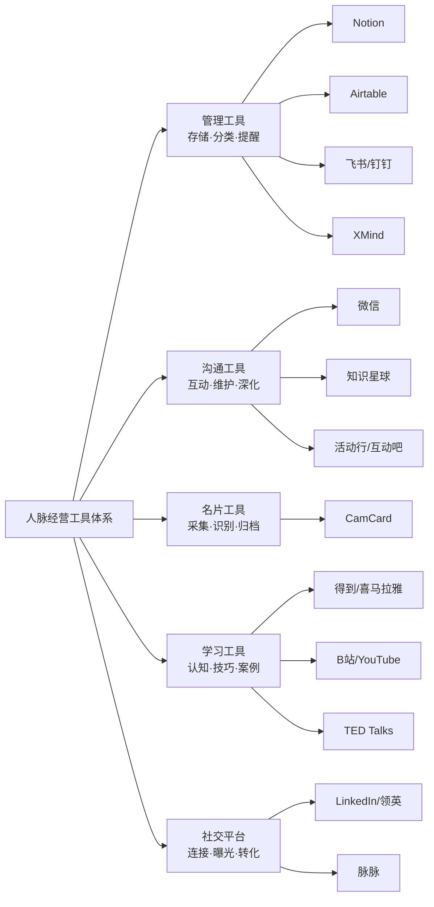
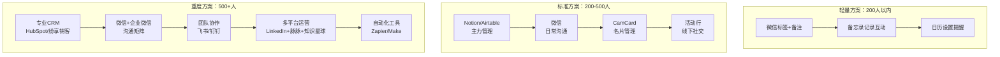

## 二、实用工具推荐

人脉经营是一项系统工程——信息采集、关系分类、定期维护、价值交换、复盘优化，每个环节都需要合适的工具支撑。好的工具不是让你"更忙"，而是帮你用最少的精力维持最大密度的关系网络。本节从**管理、沟通、名片、学习、专业社交**五大维度，逐一拆解每类工具的核心能力、适用场景、实操方法和选型建议。

### 2.0 工具选型总览

在深入每个工具之前，先建立一个选型框架。选工具的本质是匹配你的**人脉规模、经营阶段和使用习惯**：

| 维度 | 初级阶段（<200人） | 成长阶段（200-500人） | 成熟阶段（500+人） |
|------|-------------------|---------------------|-------------------|
| 管理工具 | 微信标签 + 备忘录 | Notion / Airtable | 专业CRM（HubSpot/Salesforce） |
| 沟通工具 | 微信一对一 | 微信群 + 知识星球 | 多平台矩阵运营 |
| 名片管理 | 手机通讯录 | CamCard扫描 | CRM批量导入 + 自动同步 |
| 学习方式 | 免费视频/播客 | 付费专栏 + 书籍 | 行业社群 + 线下闭门会 |
| 社交平台 | 微信朋友圈 | LinkedIn + 脉脉 | 多平台 + 个人品牌矩阵 |

### 2.1 人脉管理工具

人脉管理的核心需求是**信息结构化**和**行动可追踪**。你需要回答三个问题：这个人是谁？上次联系是什么时候？下一步该做什么？

#### 2.1.1 Notion——全能型人脉关系管理中心

**类型：** 全能型知识管理与协作平台

**核心能力：** Notion的本质是一个"可以自由组合的数据库+文档+日历"三位一体的工作空间。在人脉管理场景下，它的优势在于**高度自由的数据模型设计**——你可以根据自己的需求定义"人脉档案"包含哪些字段、哪些视图、哪些自动化规则，而不是被固定模板限制。

**适用场景：**
- 个人人脉档案的长期积累和结构化管理
- 需要将人脉信息与其他知识（读书笔记、项目记录、行业研究）打通
- 偏好"一个平台解决所有问题"的用户
- 团队协作场景下的客户关系管理

**实操方法——搭建人脉管理数据库：**

**第一步：创建主数据库**

新建一个Database，命名为"人脉管理"，包含以下属性（Property）：

| 属性名 | 类型 | 说明 | 示例 |
|--------|------|------|------|
| 姓名 | Title | 联系人姓名 | 张三 |
| 公司 | Text | 当前所在公司 | 某科技有限公司 |
| 职位 | Text | 当前职位 | 技术总监 |
| 城市 | Select | 所在城市 | 北京 |
| 认识渠道 | Multi-select | 如何认识的 | 行业会议、朋友介绍 |
| 关系等级 | Select | 核心/重要/普通/弱关系 | 重要 |
| 专业领域 | Multi-select | 擅长的技术或行业 | AI、云计算 |
| 上次联系 | Date | 最近一次互动时间 | 2025-12-01 |
| 下次行动 | Date | 计划下次联系的时间 | 2026-01-15 |
| 行动类型 | Select | 聊天/约饭/送礼/帮忙 | 约饭 |
| 备注 | Text | 个人特征、兴趣爱好、家庭情况 | 有一个女儿，喜欢钓鱼 |
| 互动记录 | Relation | 关联到互动记录表 | — |

**第二步：创建互动记录表**

单独建一个"互动记录"数据库，通过Relation属性与主表关联：

| 属性名 | 类型 | 说明 |
|--------|------|------|
| 日期 | Date | 互动发生的时间 |
| 关联人脉 | Relation | 关联到人脉主表 |
| 互动方式 | Select | 线上聊天/线下见面/电话/邮件 |
| 主题 | Text | 聊了什么 |
| 待办 | Text | 后续需要跟进的事项 |
| 情感温度 | Select | 1-5星，对方的反馈热情程度 |

**第三步：设计多视图**

同一个数据库可以创建多种视图，满足不同场景：
- **看板视图（按关系等级分组）**：一目了然看到核心人脉、重要人脉、普通人脉各有多少人
- **日历视图（按"下次行动"排列）**：每天该联系谁一目了然
- **表格视图（按"上次联系"排序）**：快速找到"失联"的人，优先维护
- **画廊视图（按城市分组）**：出差时快速找到当地可约的人

**第四步：设置提醒**

利用Notion的Reminder功能，在"下次行动"属性中设置提醒。当日期到达时，Notion会发送通知。也可以配合Notion Calendar（原日历应用）实现更精细的时间管理。

**进阶技巧：**
- 使用Notion API + Zapier/Make实现自动化：比如自动抓取LinkedIn更新、自动发送提醒到微信
- 创建"人脉地图"页面，用Gallery视图以画廊形式展示核心人脉的照片和关键信息
- 用Notion的Template按钮快速创建标准格式的互动记录

**局限性：**
- 移动端体验不如微信原生，不适合在社交场合快速记录
- 对于500+联系人，页面加载可能变慢，建议定期归档不活跃联系人
- 没有内置的邮件/短信集成，需要第三方工具配合

***

#### 2.1.2 Airtable——结构化人脉数据库

**类型：** 在线数据库工具，兼具电子表格的易用性和关系型数据库的结构化能力

**核心能力：** Airtable在数据结构化方面比Notion更强，特别是在**多表关联、自动化流程和API集成**方面。它更像是一个"零代码的轻量级CRM"。

**适用场景：**
- 联系人数量较大（200+），需要精细化的筛选和分析
- 需要将人脉管理与其他业务流程（项目管理、内容管理）打通
- 需要多人协作管理同一个联系人库
- 需要与其他工具（邮件、日历、Slack）深度集成

**实操方法——多表关联架构：**

建立三个核心表并设置关联关系：

联系人表 ←→ 互动记录表 ←→ 活动/事件表
    ↕
行业/领域标签表

**联系人表字段设计：**

姓名 | 公司 | 职位 | 邮箱 | 电话 | 微信 | 城市 | 行业标签 | 关系等级 | 
认识日期 | 认识场景 | 上次互动 | 下次计划 | 维护频率 | 备注 | 头像附件

**互动记录表字段设计：**

日期 | 关联联系人 | 互动类型 | 互动渠道 | 摘要 | 情感评分 | 后续待办 | 
待办截止日 | 是否完成

**Airtable的核心优势——自动化（Automations）：**
- 当"上次互动"距今超过设定天数（如30天），自动发送提醒邮件
- 当新增一条互动记录时，自动更新主表的"上次互动"字段
- 当"下次计划"日期到达时，自动创建一个待办任务
- 定期扫描"失联"联系人，生成周报发送给你

**视图配置建议：**
- **Grid视图**：全量数据浏览和编辑
- **Kanban视图**：按关系等级或维护状态分组，可视化管理
- **Calendar视图**：按"下次计划"展示维护日程
- **Gallery视图**：展示联系人照片和关键信息，适合快速浏览
- **Form视图**：创建一个表单，方便在社交场合快速录入新联系人信息

**Airtable vs Notion选型对比：**

| 对比维度 | Airtable | Notion |
|---------|----------|--------|
| 数据结构化 | 强，原生支持多表关联和公式 | 中，数据库功能较新，仍在迭代 |
| 自动化 | 内置Automations，无需第三方 | 需要Zapier/Make等第三方工具 |
| 文档能力 | 弱，主要是表格和表单 | 强，支持富文本、嵌入、wiki |
| 学习曲线 | 中等，需要理解数据库概念 | 低，所见即所得 |
| 移动端 | 良好，支持离线 | 良好，但复杂页面加载慢 |
| 免费额度 | 1200条记录/表，2GB附件 | 无限页面，5MB附件上限 |
| 最佳场景 | 结构化数据管理+自动化流程 | 知识管理+文档协作+轻量数据库 |

**建议：** 如果你的核心需求是"像管理客户一样管理人脉"，选Airtable；如果想把人脉管理融入一个更大的个人知识体系，选Notion。

***

#### 2.1.3 飞书/钉钉——团队场景下的社交管理

**类型：** 企业级协作平台

**核心能力：** 飞书和钉钉的优势在于**日历+文档+群组+审批**的深度集成，特别适合"团队化的人脉管理"——比如一个创业团队共同维护投资人关系、一个销售团队共享客户资源。

**飞书的核心功能在人脉经营中的应用：**

- **日历共享**：团队成员可以看到彼此的社交日程，避免重复约人或时间冲突
- **多维表格**：类似Airtable的结构化数据库，可以直接在飞书内搭建人脉管理表
- **文档协作**：多人共同编辑人脉分析报告、社交策略文档
- **机器人通知**：通过飞书机器人自动推送"今日需维护联系人"提醒
- **群组管理**：按项目、按行业、按兴趣创建不同的社交群

**钉钉的差异化优势：**

- **Ding功能**：确保重要消息被对方看到，适合需要确认回复的场景
- **智能人事**：如果是企业使用，可以关联员工的社交资源
- **钉钉文档**：支持在线协作编辑人脉相关的计划和策略

**使用建议：**
- 飞书适合"知识型团队"——如咨询公司、投资机构、研究团队的人脉管理
- 钉钉适合"执行型团队"——如销售团队、BD团队的客户关系管理
- 个人用户不建议把飞书/钉钉作为主工具，因为对方不一定在用，会增加沟通摩擦

***

#### 2.1.4 XMind/思维导图——人脉关系的可视化梳理

**类型：** 思维导图工具

**核心能力：** 思维导图不是"管理"工具，而是"梳理"和"规划"工具。它帮你回答"我认识谁"和"我的社交网络结构是什么样的"这两个根本问题。

**实操方法——绘制人脉关系图：**

**第一步：中心节点是你自己**

在中心放入你的名字，然后按以下维度向外延伸：

你的名字
├── 行业人脉
│   ├── 同事（当前公司）
│   ├── 前同事
│   ├── 同行（其他公司）
│   └── 行业前辈/导师
├── 学校人脉
│   ├── 本科同学
│   ├── 研究生同学
│   └── 校友会
├── 兴趣人脉
│   ├── 运动圈（跑步/健身/球类）
│   ├── 学习圈（读书会/课程同学）
│   └── 爱好圈（摄影/音乐/旅行）
├── 服务人脉
│   ├── 理财顾问
│   ├── 律师
│   ├── 医生
│   └── 其他专业人士
└── 弱关系
    ├── 朋友的朋友
    ├── 会议上认识的人
    └── 网络社群认识的人

**第二步：标注关键信息**

在每个节点上标注：
- 该分类下有多少人（数量）
- 哪些人是"关键节点"（连接你和其他圈子的桥梁）
- 哪些分类的人脉偏少，需要重点拓展

**第三步：制定优化策略**

基于关系图，识别以下问题：
- **孤岛**：你的某个人脉圈与其他圈子完全隔离，缺少桥梁人物
- **缺口**：某个重要领域（如投资人、媒体人）你完全没有人脉
- **集中度过高**：80%的人脉都来自同一个来源，多样性不足

**定期更新频率：** 建议每季度更新一次，或在人生/职业重大变动后立即更新（如换工作、搬城市、进入新行业）。

***

### 2.2 社交沟通工具

管理工具解决"记住了谁"，沟通工具解决"怎么保持联系"。社交沟通的关键不是频率，而是**质量**和**时机**。

#### 2.2.1 微信——人脉维护的核心阵地

**类型：** 社交通讯平台（中国用户的核心社交基础设施）

**核心能力：** 对于中国用户而言，微信是人脉维护的主战场。不是因为它功能最强，而是因为**所有人都在上面**。选择其他工具维护人脉的前提是对方也在用，而微信几乎不存在这个问题。

**微信人脉经营的六大核心功能：**

**① 标签管理——人脉分类的基础**

微信标签是"轻量级CRM"的基础。建议建立以下标签体系：

| 标签组 | 标签 | 说明 |
|--------|------|------|
| 关系等级 | 核心圈、重要圈、普通圈、弱关系 | 按亲密度和重要性分级 |
| 认识来源 | 工作、学校、行业、兴趣、朋友介绍 | 追溯人脉来源 |
| 行业领域 | 互联网、金融、教育、医疗、媒体 | 按专业领域分类 |
| 地理位置 | 北京、上海、深圳、广州、海外 | 出差/旅行时方便约见 |
| 维护状态 | 活跃、需维护、待激活、冷冻 | 动态跟踪关系状态 |

**操作方法：** 微信 → 通讯录 → 标签 → 新建标签。一个人可以打多个标签。建议每月花15分钟整理一次标签。

**② 朋友圈——被动展示价值的窗口**

朋友圈不是"秀生活"的地方，而是**让别人持续了解你**的窗口。经营策略：

- **内容配比**：专业内容（60%）+ 生活日常（25%）+ 互动转发（15%）
- **分组可见**：不同内容展示给不同分组。比如行业观点给同行看，生活感悟给亲近朋友看
- **评论互动**：当别人发朋友圈时，真诚评论比点赞更能加深印象。评论要具体，不要只写"不错"
- **避免事项**：不刷屏（每天不超过2条）、不发负能量、不转发未经验证的信息、不在朋友圈争论

**③ 收藏功能——高质量内容的中转站**

微信收藏不仅是给自己用的"备忘录"，更是社交工具：
- 收藏行业好文，在合适时机分享给对应的人脉，附上一句"这篇文章让我想到了你之前提到的XX"
- 收藏对方的生日、重要日期，在关键时刻发送祝福
- 收藏自己写过的有价值的文字，需要时直接转发

**④ 群聊管理——圈子经营的核心场景**

微信群不是"建了就行"，需要主动经营：
- **建群原则**：人数控制在50人以内，明确群定位和规则
- **群活跃维护**：定期发起话题讨论，而不是等人说话
- **价值输出**：在群里分享独家信息、资源、见解，成为群里的"价值节点"
- **一对多关系**：通过群聊可以同时维护多个人脉，效率远高于逐个聊天

**⑤ 消息管理——高效回复的策略**

- 重要联系人的消息优先回复，不超过2小时
- 长消息不要用语音，对方不方便听时会造成困扰
- 群发消息（如节日祝福）一定要个性化开头，不要明显的模板感
- 回复不要只用表情包，显得敷衍

**⑥ 微信备注名——被忽视的效率工具**

给每个重要联系人设置备注名，格式建议：
【行业-公司】姓名 | 关键特征
例如：`【AI-字节】张三 | 有投资资源` 或 `【医疗-协和】李四 | 心内科`

这样在搜索时可以按行业、公司快速定位，比记忆真实姓名高效得多。

***

#### 2.2.2 知识星球——付费社群的深度连接

**类型：** 付费社群平台

**核心能力：** 知识星球的本质是**用"付费门槛"筛选出高意愿度的连接者**。免费社群的最大问题是"搭便车"——大量人加入后潜水，互动质量低。知识星球通过付费机制确保成员至少有一定的投入意愿。

**两种使用模式：**

**模式一：加入别人的星球**

目的：进入特定领域的高质量社群，结识同频的人

选星策略：
- 查看星球主理人的背景和内容质量
- 查看星球成员数量和活跃度（不是人数越多越好，200-500人的中型星球互动质量最高）
- 查看精华帖和问答区的内容深度
- 看星球是否有线下活动或额外增值服务

加入后如何高效社交：
- **先输出，再连接**：在星球内持续写高质量帖子，让别人主动认识你
- **参与讨论**：在别人的帖子下写有价值的评论，展示你的专业度
- **私信连接**：看到志同道合的人，主动私信交流，但要先有互动基础，不要上来就加微信
- **参加线下活动**：很多星球主理人会组织线下聚会，这是深度连接的最佳机会

**模式二：创建自己的星球**

目的：通过输出内容建立个人品牌，吸引同频的人脉

运营策略：
- 定价建议：199-399元/年（太低没有筛选效果，太高影响转化）
- 内容节奏：每周至少3篇原创帖，保持活跃度
- 互动管理：回复每一条提问，让成员感受到被重视
- 增值服务：定期举办线上直播、问答、作业点评
- 线下连接：每季度组织一次线下活动，将线上关系转化为线下关系

**适合创建星球的场景：**
- 你有某个专业领域的深度知识，可以持续输出
- 你已经有一定的个人品牌和粉丝基础
- 你想建立一个"以你为中心"的高质量人脉圈

***

#### 2.2.3 活动行/互动吧——线下社交的入口

**类型：** 线下活动组织与报名平台

**核心能力：** 线下活动是建立深度信任的最快方式——一次面对面的1小时交流，抵得上线上3个月的互动。活动行和互动吧是发现和组织线下活动的主要平台。

**使用策略——参加活动：**

**选活动的标准：**
- 人数在20-50人之间（太大无法深度交流，太小缺少新鲜面孔）
- 有明确的主题和议程（而不是泛泛的"社交聚会"）
- 有互动环节（圆桌讨论、分组练习、自由交流时间）
- 参与者画像与你的目标人脉匹配

**参加活动前的准备：**
- 研究嘉宾和参与者名单，锁定3-5个想要认识的人
- 准备好30秒的自我介绍（包含你是谁、你做什么、你能提供什么价值）
- 带足名片或准备好微信二维码

**活动中的社交技巧：**
- 提前15分钟到场，此时人少，更容易开启深度对话
- 坐在陌生人旁边，而不是只和认识的人坐一起
- 主动提问和分享观点，让别人记住你
- 活动结束后不要立即离开，茶歇和散场后的15分钟是最佳交流时间

**活动后的跟进：**
- 24小时内添加微信，备注"昨天XX活动认识的"
- 发一条个性化的消息，提到活动中聊到的具体话题
- 如果承诺了什么（发资料、介绍人脉），当天兑现

**使用策略——组织活动：**

如果你有组织能力，可以自己举办小型活动：
- 主题沙龙（8-15人，深度讨论一个话题）
- 行业交流会（20-30人，邀请2-3位嘉宾分享）
- 饭局（6-10人，精心邀请不同背景的人，你做"连接者"角色）

在活动行上发布活动时，注意写清楚：目标参与者画像、活动流程、着装要求、费用说明。这些细节决定了参与者的质量和活动体验。

***

### 2.3 名片管理工具

名片是线下社交的"物理连接点"。一张名片如果不及时处理，三天后就变成废纸。名片管理的核心是**即时数字化 + 关联上下文**。

#### 2.3.1 CamCard（名片全能王）——名片数字化的标杆

**类型：** 名片扫描与管理工具

**核心能力：** 通过OCR（光学字符识别）技术，用手机摄像头扫描纸质名片，自动识别姓名、公司、职位、电话、邮箱等信息，并存储为结构化的联系人数据。

**实操流程：**

**第一步：即时扫描**

收到名片后，当场用CamCard扫描。不要想着"回去再弄"——你一定会忘。扫描时注意：
- 确保光线充足，名片平整
- 如果名片有双面，两面都要扫
- 如果名片上有手写内容（对方写的手机号、微信号），单独拍一张

**第二步：信息校对和补充**

OCR的准确率通常在90%左右，扫描后需要：
- 校对识别错误的字段（特别是中文姓名和公司名）
- 添加备注信息：认识的场合、聊天的要点、对方的特征、承诺的后续事项
- 添加标签：行业、关系等级、认识场景

**第三步：建立后续连接**

扫描只是第一步，关键的第二步是：
- 当天添加对方微信，备注名片上的信息
- 发一条消息："今天很高兴认识您，我是XX活动的XX"
- 将CamCard中的联系人信息同步到你的主力管理工具（Notion/Airtable/通讯录）

**CamCard的高级功能：**
- **批量扫描**：一次活动收到的名片可以连续扫描，提高效率
- **云端同步**：换手机不丢失数据
- **团队版**：适合销售团队共享客户名片信息
- **导出功能**：导出为vCard格式，导入到任何CRM或通讯录

**替代工具：**
- **微信扫一扫**：如果对方有微信名片二维码，直接扫码添加，跳过纸质名片环节
- **ABBYY Business Card Reader**：OCR精度更高，支持更多语言
- **Microsoft Lens**：免费，除了名片还可以扫描文档和白板

**名片管理的进阶策略：**

对于人脉活跃的人，建议建立"名片处理SOP"：

收到名片
  → 当场CamCard扫描
  → 添加备注（场合+要点+特征）
  → 当天添加微信
  → 当天同步到主力管理工具
  → 设置首次跟进提醒（3天后）
  → 纸质名片收纳到名片册（按行业分类），保留3个月后可丢弃

***

### 2.4 学习工具

人脉经营不仅是一种"行为"，更是一种"能力"。这种能力包括：沟通技巧、情商管理、影响力构建、冲突处理等。持续学习是提升这些能力的关键。

#### 2.4.1 得到/喜马拉雅——系统化知识获取

**类型：** 知识付费音频平台

**核心能力：** 碎片时间的系统化学习。通勤、运动、做家务时都可以听，把"垃圾时间"变成"学习时间"。

**推荐课程方向和具体推荐：**

| 学习方向 | 推荐内容 | 平台 | 说明 |
|---------|---------|------|------|
| 沟通表达 | 《好好说话》系列 | 得到/喜马拉雅 | 马东团队出品，覆盖说服、谈判、演讲等场景 |
| 人际关系 | 《关系攻略》 | 得到 | 熊太行，基于社会心理学拆解各类关系 |
| 情商管理 | 《蔡康永的201堂情商课》 | 喜马拉雅 | 台湾综艺教父的情商实战课 |
| 影响力 | 《影响力》精读 | 得到 | 罗伯特·西奥迪尼的六大影响力原则 |
| 社交心理学 | 《社会心理学》精读 | 得到 | 迈尔斯经典教材的精华提炼 |
| 商务社交 | 《宁向东的管理学课》 | 得到 | 其中涉及组织关系和人脉网络的部分 |

**高效学习方法：**
- 听课时做笔记，记录可以立即使用的技巧
- 每学完一个模块，找一个真实场景去练习
- 不要贪多，一个月深入学习一门课比浅尝五门课效果好
- 建立"学习-实践-复盘"的循环，每周末回顾本周学到的内容和实践情况

***

#### 2.4.2 B站/YouTube——免费视频学习宝库

**类型：** 视频平台

**核心能力：** 免费、内容丰富、形式生动。特别适合通过"看别人怎么做"来学习社交技巧。

**推荐搜索关键词和频道：**

**B站：**
- 搜索"社交技巧"、"人脉经营"、"职场社交"、"沟通表达"
- TED官方账号（中文翻译版）
- 心理学科普UP主的社交心理学分析
- 商务礼仪和社交礼仪教程
- 搜索具体场景：如"如何自我介绍"、"如何在饭局上社交"、"如何和领导相处"

**YouTube：**
- **Charisma on Command**：分析名人社交技巧的频道，极其推荐
- **Vanessa Van Edwards**：科学驱动的社交技巧教学
- **TED官方频道**：直接搜索social skills、networking、communication
- **Thomas Frank**：生产力和个人发展，涉及社交效率

**学习建议：**
- 看视频时不要只是"看热闹"，要记笔记并提取可执行的行动项
- 找到和自己性格相似的UP主/讲师，学习他们的方法更贴合自身情况
- 看完后立即练习——比如看完"如何自我介绍"的视频，马上写出自己的30秒介绍并练习

***

#### 2.4.3 TED Talks——社交领域的经典演讲

**类型：** 演讲视频平台

**核心能力：** TED演讲的特点是**每个演讲只讲一个核心观点，用18分钟讲透**。非常适合在碎片时间获得一个认知升级。

**精选推荐清单：**

| 演讲标题 | 演讲者 | 核心观点 | 与人脉经营的关联 |
|---------|--------|---------|----------------|
| 《脆弱的力量》 | 布琳·布朗 | 真实和脆弱是建立深度连接的基础 | 不要总展示"完美"的一面，适度展现真实自我 |
| 《内向者的力量》 | 苏珊·凯恩 | 内向不是缺陷，而是一种特质 | 内向者也有独特的人脉经营方式 |
| 《伟大的领袖如何激励行动》 | 西蒙·斯涅克 | 从"为什么"开始沟通 | 影响他人不是靠事实，而是靠价值观 |
| 《肢体语言塑造你自己》 | 艾米·卡迪 | 身体姿态影响自信和他人感知 | 2分钟的高能量姿势可以改变社交表现 |
| 《如何让压力成为你的朋友》 | 凯利·麦格尼格尔 | 压力本身不是问题，对压力的态度才是 | 社交焦虑可以通过重新定义压力来缓解 |
| 《怎样说话人们才愿意听》 | 朱利安·特雷泽 | 避免七种"沟通毒药" | 直接改善日常沟通质量 |
| 《为什么好的领导者要制造幽默》 | 詹妮弗·阿克 | 幽默是领导力和社交力的核心要素 | 适度幽默可以快速拉近距离 |

**观看方式建议：**
- 每周看2-3个，不要一次性刷完
- 看完后写一段100字的总结和行动项
- 和朋友讨论你学到的内容——"教是最好的学"

***

### 2.5 专业社交平台

专业社交平台的价值在于**精准连接**——你可以直接找到特定行业、特定职位、特定城市的人，而不是像微信那样需要"通过朋友介绍"。

#### 2.5.1 LinkedIn/领英——全球职业社交网络

**类型：** 全球最大的职业社交平台

**核心能力：** LinkedIn拥有超过10亿用户，是连接全球职场人士的核心平台。在中国，领英中国（LinkedIn China）虽然功能有所简化，但在连接跨国人脉和外企圈子方面仍然不可替代。

**Profile（个人资料）优化指南：**

个人资料是你的"社交名片"，需要精心打磨：

- **头像**：专业但不僵硬，面带微笑，背景简洁。不要用风景照、卡通头像或多人合影
- **标题（Headline）**：不要只写职位名称，要写你能提供的价值。例如，"技术总监"不如"帮助传统企业完成数字化转型的技术负责人"
- **简介（About）**：用第一人称写，包含三个要素——你是谁、你做过什么、你在寻找什么
- **经历（Experience）**：每段经历写2-3个可量化的成就，不要只列职责
- **技能（Skills）**：选择与目标人脉相关的技能，让人知道你的专业领域
- **推荐信（Recommendations）**：请3-5位同事或合作伙伴为你写推荐信，同时你也为他们写

**高效拓展人脉的策略：**

- **连接请求个性化**：发送连接请求时，一定写一段个性化说明，不要用默认的"I'd like to connect with you on LinkedIn"
- **二度人脉挖掘**：通过共同连接建立信任，先请共同朋友介绍，再发送连接请求
- **内容发布**：每周发布1-2篇行业见解或经验分享，吸引目标人脉主动连接你
- **群组参与**：加入行业群组，参与讨论，展示专业度
- **定期互动**：对重要人脉的动态点赞和评论，保持"存在感"

**连接请求模板：**

Hi [名字],

我是[你的名字]，[你的身份/公司]。我注意到您在[对方的专业领域]方面的深厚经验，
特别认同您最近分享的关于[具体内容]的观点。

我目前正在[你正在做的事情]，希望能与您建立连接，未来有机会交流[相关话题]。

期待与您连接！

[你的名字]

***

#### 2.5.2 脉脉——中国职场社交平台

**类型：** 中国本土的职场社交平台

**核心能力：** 脉脉在中国职场圈的渗透率很高，特别是互联网、金融、科技行业。它的匿名社区（"职言"）是了解公司内部信息和行业八卦的重要渠道。

**脉脉的三个核心功能在人脉经营中的应用：**

**① 职业资料完善**
- 完善工作经历、教育背景、技能标签
- 获得同事和前同事的"能力评价"背书
- 资料越完善，系统推荐的人脉越精准

**② 人脉拓展**
- 利用"人脉推荐"功能发现潜在连接
- 通过"共同好友"建立信任链
- 参加脉脉组织的线上/线下活动
- 在行业话题下互动，吸引同行业的人连接你

**③ 信息获取**
- "职言"匿名社区：了解公司内部情况、薪资水平、行业趋势
- 行业脉搏：跟踪行业热点事件和人物动态
- 职位信息：了解目标公司和目标岗位的最新情况

**使用注意事项：**
- 脉脉上的信息鱼龙混杂，匿名社区的内容需要甄别
- 不要在脉脉上发布敏感的公司信息或负面言论
- 脉脉的社交关系链较弱，建议把脉脉上认识的人尽快转到微信维护

***

### 2.6 工具组合策略

单个工具无法覆盖人脉经营的全部需求。最有效的方式是**选择一个主力管理工具 + 微信作为沟通主阵地 + 按需使用其他辅助工具**。

**推荐组合方案：**

**方案选择建议：**

| 阶段 | 信号 | 推荐方案 |
|------|------|---------|
| 刚开始经营人脉 | 维护人数<100，主要靠记忆和微信 | 轻量方案 |
| 人脉开始增多 | 经常忘记和谁约了什么、上次聊了什么 | 标准方案 |
| 人脉成为核心资产 | 人脉管理本身成为工作内容（如销售、BD、投资人） | 重度方案 |

### 2.7 常见误区与纠正

**误区一：工具越多越好**

错误做法：Notion、Airtable、飞书、CRM全部用上，信息散落在各处。

正确做法：选定一个主力工具，集中管理。工具的核心价值在于**信息的集中度**，分散等于没有管理。

**误区二：过度设计系统**

错误做法：花三天时间搭建一个"完美"的Notion模板，然后用了两周就废弃。

正确做法：从最简单的系统开始（比如微信标签+每月花30分钟整理），在使用中逐步迭代。系统的价值在于使用频率，不在于设计复杂度。

**误区三：只记录不行动**

错误做法：录入了500条联系人信息，但从不主动联系。

正确做法：工具是"行动触发器"，不是"数据仓库"。每周至少花30分钟回顾工具中的提醒，执行维护动作。

**误区四：忽视线下工具**

错误做法：所有管理都在手机/电脑上完成，见面时还在翻手机找信息。

正确做法：见面前5分钟，快速浏览对方在管理工具中的备注——上次聊了什么、有什么承诺、对方的近况。这个简单的准备动作可以大幅提升交流质量。

**误区五：用社交平台替代关系管理**

错误做法：觉得有了微信和LinkedIn就够了，不需要专门的管理工具。

正确做法：社交平台解决的是"连接"和"沟通"的问题，管理工具解决的是"记忆"和"计划"的问题。当你的人脉超过150人（邓巴数），大脑已经无法有效管理所有关系，必须借助工具。

