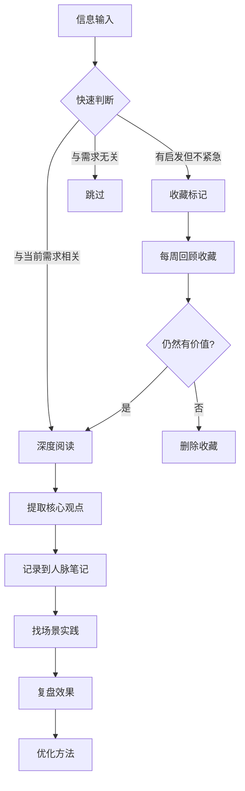

## 三、推荐关注的公众号/博主

在人脉经营的过程中，持续学习是保持社交能力精进的核心驱动力。公众号和博主作为中文互联网最高效的知识分发渠道，具有三个独特优势：**内容更新频率高**（日更或周更）、**场景贴近实际**（基于真实案例和时事）、**互动门槛低**（评论区即可与作者和其他读者交流）。选择正确的信息源，相当于给自己配置了一个"社交智囊团"，每天花15-30分钟阅读，一年下来等于完成了一门系统性的社交能力训练课程。

但信息过载是最大的陷阱。关注100个公众号，实际认真阅读的不超过10个。因此，本节的核心原则是：**少而精、分类管理、学以致用**。我们按功能将推荐的信息源分为六大类别，每个类别给出核心推荐和扩展推荐，并附上具体的学习方法和实践建议。

### 3.1 如何选择值得关注的信息源

在逐个介绍推荐之前，先建立一套评估标准，帮助你在未来发现新资源时做出判断。

#### 评估框架：四个维度

| 维度 | 权重 | 评估标准 | 低分表现 | 高分表现 |
|------|------|----------|----------|----------|
| 内容深度 | 30% | 是否有原创观点和深度分析 | 纯转载、标题党、鸡汤文 | 有方法论、有数据支撑、有独到见解 |
| 实用性 | 30% | 读后能否立即应用到社交场景 | 纯理论、空洞概念 | 有具体步骤、话术模板、场景示例 |
| 持续性 | 20% | 更新频率和内容质量的稳定性 | 断更频繁、质量波动大 | 稳定更新、质量一致性高 |
| 互动性 | 20% | 是否有社群、评论区讨论、答疑 | 关闭评论、无互动 | 活跃社群、作者亲自回复 |

**具体操作方法：**

1. **试读期观察**：新关注一个号后，连续阅读2周（约10-15篇文章），不做最终判断
2. **标记法**：用"有用/一般/无用"三档标记每篇文章，2周后统计比例
3. **转化率**：读完后实际应用了多少？如果连续5篇没有可执行的收获，考虑取关
4. **时间性价比**：单篇阅读时间超过15分钟但收获不大，说明效率太低

#### 关注数量的黄金法则

根据邓巴数理论和注意力管理研究，建议按以下配比关注：

- **核心关注**（每篇必读）：5-8个，每天投入20-30分钟
- **重点关注**（选择性阅读）：5-10个，每周投入1-2小时
- **浏览关注**（标题扫读）：不超过10个，碎片时间翻阅
- **总量上限**：不超过25个，超过则按季度清理

### 3.2 人际关系与社交策略类

这类信息源聚焦于社交行为本身——如何认识人、如何维护关系、如何在社交场合中表现得体。它们是人脉经营最直接的知识来源。

#### 核心推荐

**古典古少侠**

- **平台**：微信公众号、得到App
- **作者背景**：新精英创始人，职业生涯规划师，《拆掉思维里的墙》《跃迁》作者，深耕个人成长与职业发展领域超过15年
- **内容定位**：个人成长、职业发展、社交策略的交叉地带。古典的特色在于将社会学和心理学理论融入社交建议，不说空话，每篇文章都有可操作的框架
- **对人脉经营的价值**：他的"超级个体"理论直接解释了为什么有些人能持续积累高质量人脉——核心在于你必须先成为值得连接的节点。他关于"联机学习"的概念，本质上就是人脉经营的方法论：通过与不同领域的人交换认知，实现个人能力的跃迁
- **阅读建议**：重点关注他关于"个人品牌"和"社交货币"的系列文章，这些内容可以直接指导你如何在社交场合中展示自己的价值
- **实践方法**：读完每篇文章后，用一句话总结核心观点，写在自己的人脉经营笔记中，每月回顾一次，检验自己是否应用了这些观点

**刘润**

- **平台**：微信公众号"刘润"、得到App课程"5分钟商学院"
- **作者背景**：润米咨询创始人，前微软战略合作总监，商业顾问，著有《底层逻辑》《新零售》等畅销书
- **内容定位**：商业洞察与管理智慧，但其核心框架——"底层逻辑"思维——对人脉经营有极强的迁移价值。刘润擅长把复杂的商业关系拆解为可理解的模型
- **对人脉经营的价值**：刘润反复强调的"价值交换"思维，是人脉经营的第一性原理。他关于"信任账户"的比喻（每次互动都是存款或取款）可以作为日常社交的底层操作系统。此外，他的商业分析能力能帮助你理解人脉网络中的权力结构和利益格局
- **阅读建议**：重点关注"底层逻辑"系列文章，以及他关于谈判、合作、商业关系的分析。每天5分钟商学院的音频适合通勤收听
- **实践方法**：将他的"信任账户"模型应用于你的核心人脉关系，记录每次互动是"存款"还是"取款"，一个月后评估哪些关系需要"充值"

**Spenser**

- **平台**：微信公众号"Spenser"
- **作者背景**：前香港金融从业者，自媒体创业者，《写作是最好的自我投资》作者，从职场人转型为个人品牌经营者
- **内容定位**：职场社交、个人品牌、圈层突破。Spenser的特点是真实——他会分享自己的社交失败经历和反思，而不是只展示成功的一面
- **对人脉经营的价值**：他对"圈层社交"的分析特别有价值——如何识别不同圈层的社交规则，如何在不卑不亢中实现向上社交。他关于"社交货币"和"信息差"的讨论，帮助你理解在社交中你能提供什么价值
- **阅读建议**：重点关注关于职场社交和个人品牌的系列文章
- **实践方法**：学习他提出的"社交资产"概念，盘点自己目前拥有的社交资产清单（知识、技能、信息、资源），找到可以输出价值的切入点

#### 扩展推荐

**秋叶大叔**

- **平台**：微信公众号"秋叶大叔"
- **内容定位**：社交电商、个人品牌、社群运营。秋叶大叔是中文互联网社群运营的先驱之一，他的核心贡献在于把社交关系从"模糊的人情"变成了"可运营的系统"
- **对人脉经营的价值**：他的社群运营方法论可以迁移到人脉管理中——如何建立自己的社交群落，如何设计互动机制，如何让关系自然生长而不是刻意维护
- **适合人群**：希望建立个人品牌、运营社群的中高级社交者

**黄有璨**

- **平台**：微信公众号"黄有璨"、三节课联合创始人
- **内容定位**：运营思维与社交网络的交叉。黄有璨对互联网行业社交生态的理解深刻，适合互联网从业者学习圈内社交规则
- **适合人群**：互联网行业从业者，希望在行业内建立影响力的人

### 3.3 心理学与人性洞察类

人脉经营的底层是人心。不理解人的心理机制，再多的社交技巧都是空中楼阁。这类信息源帮助你建立对人性的深度理解。

#### 核心推荐

**武志红**

- **平台**：微信公众号"武志红"、得到App课程
- **作者背景**：北京大学心理学硕士，资深心理咨询师，《为何家会伤人》《身体知道答案》等多部畅销书作者，拥有20年以上临床经验
- **内容定位**：人际关系的心理动力学分析。武志红的特色在于他不回避人际关系中的阴暗面——控制、依赖、投射、边界侵犯——这些恰恰是大多数人社交失败的深层原因
- **对人脉经营的价值**：他关于"关系模式"的分析帮助你理解自己为什么在社交中反复陷入相同的困境。他关于"边界感"的讨论直接适用于人脉经营——如何在亲近和保持距离之间找到平衡。他关于"自恋与自卑"的分析，解释了很多人在社交中要么过度讨好、要么过度防御的根本原因
- **阅读建议**：重点关注"关系"分类下的文章，特别是关于"健康的关系边界"和"情感勒索"的系列。他的人格分析系列也有助于理解不同类型的人的社交模式
- **实践方法**：用他的"关系模式"框架回顾自己过去的重要社交关系，识别重复出现的模式（如总是被同类型的人吸引、总是犯同样的社交错误），然后有意识地打破这些模式

**KnowYourself**

- **平台**：微信公众号"KnowYourself"、知乎专栏
- **内容定位**：心理学科普，以学术研究为基础，用通俗语言解读人际关系的心理机制。KY的优势在于严谨——每个观点都引用了相关的心理学研究
- **对人脉经营的价值**：他们的文章涵盖社交焦虑、依恋类型、人际吸引、群体心理等主题，每一篇都能让你对自己的社交行为有更深的理解。特别是关于"依恋类型"的系列，直接解释了为什么有些人在亲密关系和社交关系中表现不同
- **阅读建议**：搜索"社交"、"人际关系"、"依恋"、"边界"等关键词，建立自己的学习路径
- **实践方法**：做他们提供的各类心理测试（依恋类型测试、人格测试等），了解自己的心理特征，然后针对性地调整社交策略

**壹心理**

- **平台**：微信公众号"壹心理"、壹心理App
- **内容定位**：心理学服务平台，内容覆盖面广，从理论科普到实操课程都有。壹心理的特点是系统性强，有完整的课程体系
- **对人脉经营的价值**：他们的"人际关系"专题汇集了大量关于社交心理的内容，从如何克服社交恐惧到如何处理人际冲突，覆盖了人脉经营的方方面面。此外，他们的在线课程质量较高，适合希望系统学习的人
- **阅读建议**：关注他们的"人际关系"专题，以及每周精选的心理学文章
- **实践方法**：如果发现自己的社交困难有深层心理原因（如社交恐惧、回避型人格），可以通过壹心理平台寻找专业心理咨询师

#### 扩展推荐

**丛非从**

- **平台**：微信公众号"丛非从"
- **内容定位**：实用心理学，擅长用简单的语言解释复杂的人际关系心理。他的"非暴力沟通"和"情绪管理"系列对社交场景特别实用
- **适合人群**：在社交中容易情绪化、难以控制情绪反应的人

**动机在杭州（陈海贤）**

- **平台**：微信公众号"动机在杭州"
- **作者背景**：浙江大学心理学博士，前浙大心理咨询师，著有《了不起的我》
- **内容定位**：自我发展心理学，关注人在关系中的成长。他关于"心理舒适区"和"改变"的分析，对理解社交行为模式很有帮助
- **适合人群**：希望从根本上改变社交模式、突破自我限制的人

### 3.4 商业社交与行业洞察类

高质量的社交需要高质量的谈资。对行业趋势和商业逻辑的理解，直接决定了你在社交场合中能否提供有价值的信息和见解。这类信息源帮助你成为一个"有料"的人。

#### 核心推荐

**36氪**

- **平台**：微信公众号"36氪"、36氪App、网站36kr.com
- **内容定位**：科技和商业资讯的头部媒体。36氪覆盖了中国科技和创业圈的核心动态，是商务社交中最重要的信息来源之一
- **对人脉经营的价值**：在商务社交场合，能否聊出有深度的行业观点，直接决定了别人对你的评价。36氪提供的不只是新闻，更有深度分析和趋势判断，帮助你在社交中提供有价值的"信息差"
- **阅读建议**：每天花10分钟扫读头条和深度分析文章。重点关注你所在行业和目标社交圈相关的领域
- **实践方法**：每周选1-2篇深度文章，提炼3个核心观点，作为下周社交场合的谈资储备

**虎嗅**

- **平台**：微信公众号"虎嗅"、虎嗅App、网站huxiu.com
- **内容定位**：商业深度分析和评论。与36氪相比，虎嗅更偏重观点和分析，而不是新闻速度。虎嗅的特色在于其辛辣的评论风格和对商业事件的深度解读
- **对人脉经营的价值**：虎嗅的文章经常提供"反直觉"的商业观点，这种独特视角在社交中特别有价值——当所有人都在说同一个观点时，你能提出不同的角度，立刻就能吸引注意力
- **阅读建议**：重点关注"深度"栏目的文章，以及关于商业模式和行业趋势的分析
- **实践方法**：读完深度文章后，尝试用自己的语言复述核心观点，练习在30秒内表达一个复杂的商业观点——这是社交场合中最实用的能力

**混沌学园（原混沌大学）**

- **平台**：微信公众号"混沌学园"、混沌App
- **内容定位**：商业思维和创新方法论。混沌学园的课程体系涵盖了战略、组织、创新、用户等多个维度，帮助你建立系统的商业思维框架
- **对人脉经营的价值**：当你拥有了系统的商业思维框架后，与商界人士的对话质量会显著提升。你不再只是信息的接收者，而是能够提供分析框架的对话参与者
- **阅读建议**：关注每周精选的课程笔记和学员分享，选择与自己行业相关的课程深入学习
- **实践方法**：学习一个思维模型后（如"第一性原理"、"非连续性创新"），在下一次社交场合中尝试用这个模型分析一个实际问题

#### 扩展推荐

**创业邦**

- **平台**：微信公众号"创业邦"
- **内容定位**：创业和商业社交。如果你在创业或投资圈社交，创业邦提供的行业活动信息和创业人物访谈是重要的社交话题来源
- **适合人群**：创业者、投资人、希望进入创业圈的人

**晚点LatePost**

- **平台**：微信公众号"晚点LatePost"
- **内容定位**：科技和商业的深度报道，以独家信源和深度采访著称。文章质量极高，适合高阶商务社交者
- **适合人群**：企业高管、投资人、高级管理者

### 3.5 沟通与表达技巧类

人脉经营的"最后一公里"是表达。你的想法再好、你的价值再大，如果无法有效表达，社交效果就会大打折扣。这类信息源帮助你提升语言的感染力和说服力。

#### 核心推荐

**好好说话**

- **平台**：微信公众号"好好说话"、喜马拉雅音频节目、得到App
- **作者团队**：马东领衔，马薇薇、黄执中、周玄毅、邱晨等华语辩论界顶尖选手组成的核心团队
- **内容定位**：沟通和表达技巧的实操训练。好好的特色在于场景化——他们不是教你抽象的沟通原则，而是在具体的社交场景中（如何拒绝、如何请求、如何谈判、如何化解尴尬）给出具体的话术和策略
- **对人脉经营的价值**：人脉经营中的每一个关键节点都需要精准的表达——初次见面的自我介绍、请求帮忙时的措辞、拒绝时不伤关系的表达、冲突中的沟通、感谢信的写法。好好说话覆盖了所有这些场景
- **阅读建议**：搜索与当前社交需求相关的场景关键词（如"拒绝"、"请求"、"赞美"、"化解冲突"），按需学习而非通读
- **实践方法**：选择一个本周会遇到的社交场景，提前练习他们推荐的话术，记录实际使用效果，不断迭代

**樊登读书**

- **平台**：微信公众号"樊登读书"、樊登读书App
- **作者背景**：樊登，前央视主持人、北京交通大学教师，创办了中国最大的读书社群之一
- **内容定位**：经典书籍的精华解读。樊登的优势在于选书眼光和解读能力——他能把一本300页的书浓缩成45分钟的精华，让你快速获取书中的核心思想
- **对人脉经营的价值**：樊登解读过大量关于社交、沟通、领导力、影响力的经典书籍（如《非暴力沟通》《关键对话》《影响力》《人性的弱点》），每一本书的解读都相当于一堂浓缩的社交能力课
- **阅读建议**：优先听以下书目的解读：《非暴力沟通》（沟通基础）、《关键对话》（高难度对话）、《影响力》（说服原理）、《人性的弱点》（社交基本功）、《他人的力量》（关系管理）
- **实践方法**：听完一本书的解读后，提炼3个核心观点，找一个社交场景实际应用，记录效果

**姜Dora**

- **平台**：B站、小红书、微信公众号
- **内容定位**：职场沟通和社交技巧的年轻化表达。姜Dora的特色在于她用年轻人熟悉的语言和场景讲解社交技巧，特别适合初入职场的年轻人
- **对人脉经营的价值**：她关于"职场社交"、"向上管理"、"同事关系"的内容直接对应了年轻人最常遇到的社交场景。她的表达方式亲切自然，降低了学习社交技巧的心理门槛
- **阅读建议**：B站视频适合深度学习，小红书适合碎片时间获取灵感
- **实践方法**：选择一个视频中提到的技巧，在一周内至少实践3次

#### 扩展推荐

**回形针PaperClip（已停更，但往期内容仍有价值）**

- **内容定位**：虽然已停更，但回形针的叙事方式和信息密度是学习"如何把复杂信息讲清楚"的极佳范本
- **适合人群**：需要提升专业领域表达能力的人

**半佛仙人**

- **平台**：微信公众号"半佛仙人"、B站
- **内容定位**：商业分析与讽刺幽默的结合。半佛的写作特点是信息密度极高、逻辑严密、表达犀利。学习他的表达方式，可以提升你在社交中的语言感染力
- **适合人群**：希望提升表达风格、增加语言魅力的人

### 3.6 思维提升与认知升级类

人脉经营的天花板不在技巧，而在认知。你的认知水平决定了你能吸引什么样的人、能在什么层次上与人交流。这类信息源帮助你突破认知的天花板。

#### 核心推荐

**罗辑思维（得到App）**

- **平台**：微信公众号"罗辑思维"、得到App
- **作者背景**：罗振宇，前央视制片人，得到App创始人
- **内容定位**：知识分享和思维启发。罗辑思维的早期节目（60秒语音+视频节目）开创了中文互联网知识付费的先河。得到App则发展为一个系统性的知识学习平台
- **对人脉经营的价值**：跨领域的知识储备是社交中最重要的"谈资库"。罗辑思维涵盖了历史、科学、商业、文化等多个领域，每天花15分钟就能积累一个新知识点。更重要的是，罗振宇的"知识焦虑"虽然被批评，但他展示了一种"终身学习"的态度——这种态度本身就是社交中的加分项
- **阅读建议**：得到App的"每天听本书"功能适合通勤收听，覆盖了商业、心理学、社会学等与社交直接相关的领域
- **实践方法**：每周选一个学到的新知识点，找机会在社交场合中分享，锻炼"知识输出"的能力

**张潇雨**

- **平台**：微信公众号"张潇雨"、播客"得意忘形"
- **内容定位**：商业、投资、心理学和哲学的交叉领域。张潇雨的特色在于他追求"底层理解"——不满足于表面现象，而是追问事物的本质
- **对人脉经营的价值**：他关于"第一性原理"思维的讨论，帮助你从根本上理解人脉经营的本质——不是技巧的堆砌，而是价值的创造和交换。他的播客"得意忘形"中有大量关于人际关系和自我认知的深度讨论
- **阅读建议**：播客中关于"社交"和"关系"的单集特别值得反复收听
- **实践方法**：用"第一性原理"审视自己的社交策略——你目前的社交行为，有哪些是基于真正的价值交换，哪些只是无效的社交表演？

**万维钢（精英日课）**

- **平台**：得到App"精英日课"系列课程
- **作者背景**：物理学家，科学作家，旅居美国，擅长用科学视角解读社会现象
- **内容定位**：用科学研究和数据解读社会行为、决策心理和人际关系。万维钢的特色在于严谨——每个观点都有学术论文支撑
- **对人脉经营的价值**：他关于"社交网络科学"、"信任机制"、"合作博弈"等内容，从科学角度解释了人脉经营的底层逻辑。理解这些原理后，你的社交策略会更有依据，而不是凭感觉行事
- **阅读建议**：搜索"社交"、"关系"、"信任"、"合作"等关键词，系统学习
- **实践方法**：将学到的科学原理转化为社交策略——例如，了解"互惠原则"的心理学研究后，在社交中更主动地提供帮助

#### 扩展推荐

**曹政（caoz的梦呓）**

- **平台**：微信公众号"caoz的梦呓"
- **内容定位**：互联网行业洞察和商业分析。曹政是互联网老兵，他的分析基于丰富的行业经验，对理解互联网行业的社交生态特别有帮助
- **适合人群**：互联网从业者，希望在行业内建立深度连接的人

**冯大辉（小道消息）**

- **平台**：微信公众号"小道消息"
- **内容定位**：互联网行业观察和个人思考。冯大辉以直言不讳著称，他的文章展示了如何在社交中保持真实的自我
- **适合人群**：希望在社交中保持个性和真实性的人

### 3.7 阅读方法与信息管理

关注了优质的信息源之后，如何高效地阅读和管理这些内容，决定了这些信息能否真正转化为你的社交能力。

#### 高效阅读框架

#### 每日阅读时间分配

| 时间段 | 时长 | 内容类型 | 工具 |
|--------|------|----------|------|
| 早晨通勤 | 15分钟 | 音频内容（得到、播客） | 手机App |
| 午休时间 | 10分钟 | 快速浏览行业资讯 | 微信公众号 |
| 晚间学习 | 20-30分钟 | 深度阅读和笔记 | 电脑/平板 |
| 碎片时间 | 随机 | 小红书/B站短内容 | 手机App |

#### 信息转化的"FIRE"模型

将阅读到的信息转化为社交能力，需要经过四个步骤：

1. **Filter（过滤）**：这个信息与我的社交需求相关吗？能直接应用吗？
2. **Internalize（内化）**：用自己的话复述这个观点，确保真正理解
3. **Relate（关联）**：这个观点如何与我已有的知识体系连接？与我认识的人有什么关联？
4. **Execute（执行）**：找一个具体的社交场景去实践，记录效果

#### 信息管理工具推荐

- **微信读书笔记功能**：阅读公众号长文时，用划线功能标记重点段落，导出后整理到笔记系统
- **Flomo浮墨笔记**：适合记录碎片化的社交灵感和阅读心得，支持微信输入
- **Notion知识库**：建立分类的阅读笔记数据库，用标签关联到具体的人脉关系

### 3.8 不同阶段的信息源配置方案

人脉经营的不同阶段，需要不同类型的信息输入。以下是针对不同阶段的个性化推荐配置：

#### 初级阶段（0-1年）：建立基础认知

| 类别 | 推荐数量 | 具体推荐 | 学习重点 |
|------|----------|----------|----------|
| 社交策略 | 2个 | 古典古少侠、Spenser | 学习基本社交框架和方法 |
| 心理学 | 2个 | 武志红、KnowYourself | 理解自己和他人的心理模式 |
| 沟通技巧 | 2个 | 好好说话、樊登读书 | 掌握基本沟通技巧 |
| 商业资讯 | 1个 | 36氪 | 积累行业谈资 |

**每日投入时间**：30-40分钟
**核心目标**：建立社交的基本认知框架，克服社交恐惧，学会基本的沟通技巧

#### 中级阶段（1-3年）：深化理解和实践

| 类别 | 推荐数量 | 具体推荐 | 学习重点 |
|------|----------|----------|----------|
| 社交策略 | 2个 | 刘润、秋叶大叔 | 从技巧到策略的升级 |
| 心理学 | 2个 | 丛非从、动机在杭州 | 深入理解关系动力学 |
| 商业资讯 | 2个 | 36氪、虎嗅 | 提升社交话题深度 |
| 沟通表达 | 2个 | 姜Dora、半佛仙人 | 提升表达的感染力 |
| 认知升级 | 1个 | 罗辑思维 | 拓宽知识面 |

**每日投入时间**：40-50分钟
**核心目标**：形成自己的社交风格，能够在不同场景中灵活应变，开始建立个人品牌

#### 高级阶段（3年以上）：输出与影响力

| 类别 | 推荐数量 | 具体推荐 | 学习重点 |
|------|----------|----------|----------|
| 认知升级 | 2个 | 张潇雨、万维钢 | 建立底层思维框架 |
| 商业深度 | 2个 | 晚点LatePost、混沌学园 | 保持行业前沿敏感度 |
| 表达输出 | 1个 | 开始自己输出内容 | 从输入者变为输出者 |

**每日投入时间**：30分钟输入 + 30分钟输出
**核心目标**：成为信息的生产者而非消费者，通过输出内容吸引人脉主动连接

### 3.9 常见误区与纠正

#### 误区一：关注越多越好

**错误做法**：关注50+个公众号，觉得这样就不会错过任何信息。

**问题分析**：信息过载导致注意力分散，每个号都看一点但都不深入，最终什么都没学到。

**正确做法**：遵循"少而精"原则，核心关注不超过8个，定期清理不常阅读的号。宁可把5个号的文章全部读透，也不要把50个号的文章各看标题。

#### 误区二：只输入不输出

**错误做法**：每天花大量时间阅读公众号文章，但从不在社交中应用。

**问题分析**：阅读是被动消费，不经过实践的知识无法转化为能力。你可能记住了100个社交技巧，但如果没有实际使用过，在关键时刻依然会手足无措。

**正确做法**：每读完一篇有价值的文章，立刻想一个可以应用的场景，本周内实践。记录实践效果，形成"输入-实践-反馈"的闭环。

#### 误区三：迷信权威

**错误做法**：把某个博主或公众号的话当作绝对真理，不加思考地全盘接受。

**问题分析**：每个内容创作者都有自己的局限性和立场。他们的建议可能在某些场景下有效，但在另一些场景下可能适得其反。盲目跟从会导致你失去自己的社交风格。

**正确做法**：用批判性思维对待每一条建议——"这个观点的适用条件是什么？在我的具体场景中是否成立？"把建议当作参考而非指令。

#### 误区四：忽视评论区和社群

**错误做法**：只看公众号正文，从不看评论区或加入社群。

**问题分析**：评论区和社群中经常有高质量的讨论，其他读者的真实案例和补充观点有时比正文更有价值。更重要的是，评论区和社群本身就是社交场景——你可以在其中练习社交技巧。

**正确做法**：定期浏览评论区，对有见地的评论给予回应。加入核心推荐号的读者社群，主动参与讨论。

#### 误区五：只关注"社交技巧"类内容

**错误做法**：只看关于"如何社交"的直接内容，忽视心理学、商业分析、思维提升等间接内容。

**问题分析**：社交能力是综合能力，不仅包括沟通技巧，还包括对人性的理解、对话题的储备、对世界的认知。只学技巧不修内功，社交会显得浮于表面。

**正确做法**：按本节推荐的六大类别均衡配置，特别关注心理学和商业资讯——前者让你理解人，后者让你有话可说。

### 3.10 内容创作者的评估与更新机制

信息源的质量会随时间变化。一个曾经优秀的公众号可能因为商业化过度而质量下降，一个新出现的博主可能因为专注某个细分领域而极具价值。因此，建立定期评估机制非常重要。

#### 季度评估流程

1. **回顾过去3个月的阅读记录**：每个关注的号，实际阅读了多少篇文章？
2. **应用率统计**：读完后实际应用了多少？哪些号的转化率最高？
3. **质量趋势判断**：最近3个月的文章质量是上升、持平还是下降？
4. **需求匹配度**：随着你人脉经营阶段的变化，这些信息源是否仍然匹配你的需求？
5. **执行取舍**：对于质量下降或不再匹配需求的号，果断取关；对于新发现的优质号，进入试读期

#### 信息源更新渠道

当你需要发现新的优质信息源时，可以通过以下渠道：

- **同行推荐**：向你社交圈中你尊敬的人请教他们关注的号
- **平台推荐**：微信读书、得到、知乎等平台的推荐算法可以帮助你发现新内容
- **行业榜单**：新榜、西瓜数据等平台有公众号排行，可以按领域筛选
- **社交平台挖掘**：小红书、B站、知乎等平台的创作者推荐机制

***