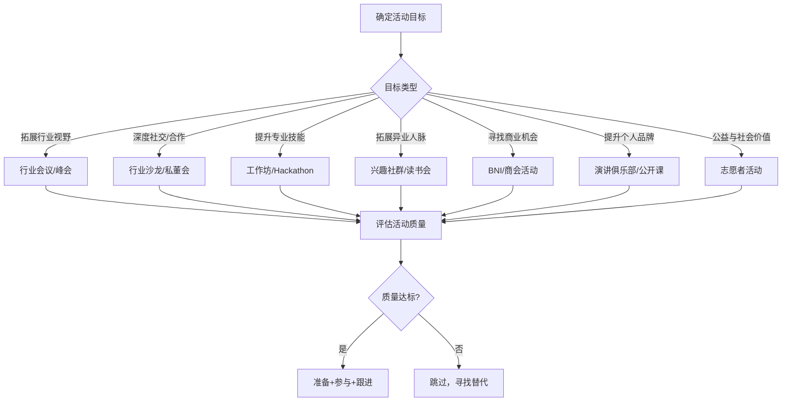
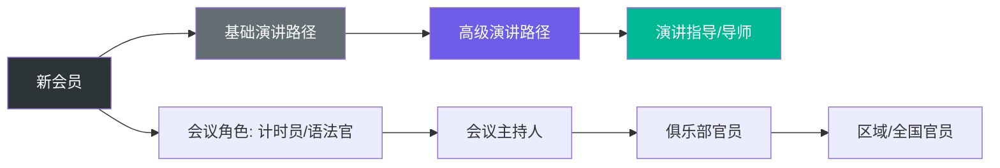

## 四、推荐参加的线下活动类型

线上社交解决了"找到人"的问题，但真正建立信任、深化关系，仍然依赖线下面对面的互动。神经科学研究表明，面对面交流时大脑会同步释放催产素（信任激素），这种化学反应是视频通话和文字聊天无法替代的。线下活动是人脉经营中"播种"的最佳场景——你在短时间内接触大量潜在连接对象，且共同参与活动本身就提供了天然的破冰话题。

但盲目参加活动会消耗大量时间和精力，最终收获寥寥。本章将系统介绍各类线下活动的特点、适用场景、参与策略和注意事项，帮助你根据自身目标精准选择、高效参与。

### 4.1 选择线下活动的核心框架

参加任何线下活动之前，先回答三个问题：

| 维度 | 核心问题 | 示例 |
|------|----------|------|
| **目标** | 我希望通过这次活动获得什么？ | 认识行业前辈 / 寻找合作伙伴 / 学习新技能 / 拓展客户 |
| **匹配度** | 参与者画像是否符合我的目标？ | 技术大会→开发者为主；创投沙龙→创业者和投资人 |
| **投入产出比** | 时间、金钱、精力投入 vs 预期收益 | 免费本地沙龙 vs 万元级全国峰会 |

**活动选择决策矩阵：**

**评估活动质量的五个指标：**

1. **嘉宾质量**：演讲者和参与者是否有你想要接触的人？查看往期嘉宾名单、参会企业列表
2. **组织方口碑**：主办方是否持续举办过高质量活动？搜索往期评价
3. **规模与形式**：大会适合广撒网，小沙龙适合深交流，工作坊适合技术切磋
4. **频率与持续性**：一次性活动 vs 周期性活动。周期性活动更容易建立长期关系
5. **参与门槛**：完全免费的开放活动 vs 收费或邀请制。适当门槛意味着参与者质量更高

### 4.2 行业会议与峰会

#### 特点与价值

行业会议和峰会是接触行业顶尖人物、了解最新趋势的高效渠道。参与者通常包括行业领袖、企业高管、技术专家、媒体人士。规模从几百人到数万人不等。

**核心价值：**
- 一站式接触大量行业人士，信息密度极高
- 主题演讲提供学习机会，同时提供社交话题
- 展会区域和茶歇时间是最佳社交窗口
- 带有媒体曝光效应，有助于建立个人品牌

#### 类型细分

| 类型 | 规模 | 典型代表 | 适合人群 | 费用范围 |
|------|------|----------|----------|----------|
| 大型行业峰会 | 1000-50000人 | 世界互联网大会、WAIC、GMIC | 企业高管、行业决策者 | 2000-10000元 |
| 技术大会 | 500-5000人 | QCon、GMTC、ArchSummit | 技术人员、架构师 | 1000-6000元 |
| 创业/投融资峰会 | 200-2000人 | DEMO China、创业邦峰会 | 创业者、投资人 | 500-5000元 |
| 垂直行业峰会 | 100-1000人 | 各细分领域专业峰会 | 垂直行业从业者 | 500-3000元 |
| 开发者大会 | 500-3000人 | 各大厂商开发者大会 | 开发者、技术决策者 | 免费-3000元 |

#### 参与策略

**会前准备（关键步骤，多数人忽略）：**

1. **研究议程**：标记3-5个必听演讲，不要试图全部参加，留出社交时间
2. **研究嘉宾**：列出你最想认识的5-10位参会者，提前在LinkedIn或社交媒体了解他们的背景、近况、关注点
3. **准备自我介绍**：30秒版本（姓名+公司+你在做什么+你对什么感兴趣），根据场合适当调整
4. **准备社交素材**：充足名片、手机充电宝、可分享的文章或观点
5. **主动预约**：如果能通过社交媒体提前联系目标对象，约好会场见面时间，效率远高于现场偶遇

**会中社交技巧：**

- **选择性参加**：不必每场演讲都听，留出至少30%的时间在社交区、茶歇区、展台区
- **善用茶歇**：茶歇和午餐是最佳社交窗口。不要独自坐着，主动走向正在聊天的小群体
- **提问社交法**：在Q&A环节提出一个好问题，会后会有人主动来找你交流
- **"带一带"策略**：如果你认识其中一些人，主动为不同圈子的人做介绍
- **避免销售式社交**：不要一上来就推销产品或递名片，先建立个人连接

**会后跟进（决定价值的关键环节）：**

- 24小时内添加微信或LinkedIn，附上"今天在XX活动聊到XX话题"的备注
- 分享活动中的有价值信息（演讲笔记、照片、总结）
- 对于深度交流过的人，约一次单独会面
- 整理名片和联系方式，建立联系人档案

#### 常见误区

- **误区一：追求数量**。参加100场大会不如深度参与10场。质量远比数量重要
- **误区二：只听不社交**。很多人全程坐在会场听演讲，结束后直接离开，完全浪费了社交机会
- **误区三：只带名片不加微信**。名片容易丢失，现场扫码加微信更可靠
- **误区四：不做会后跟进**。研究表明，活动后48小时内未跟进的联系，90%会在一周内失效

### 4.3 行业沙龙与小型分享会

#### 特点与价值

规模通常在20-50人，话题聚焦，互动性强，是建立深度专业联系的最佳场景。与大型会议相比，沙龙的社交效率更高——你有更大的机会与每个人交谈。

**与大型会议的对比：**

| 维度 | 行业沙龙 | 大型会议/峰会 |
|------|----------|--------------|
| 规模 | 20-50人 | 500-50000人 |
| 互动深度 | 深度交流，可讨论问题 | 浅层社交，难以深入 |
| 社交效率 | 几乎能认识每个人 | 只能接触少数人 |
| 信息密度 | 聚焦单一主题 | 覆盖广泛话题 |
| 后续关系 | 更容易发展为长期联系 | 容易变成一次性社交 |
| 费用 | 通常免费或低价 | 通常收费较高 |

#### 如何找到高质量沙龙

1. **垂直社区**：关注你所在行业的公众号、知识星球、社群，沙龙信息通常在这些渠道首发
2. **活动平台**：活动行、互动吧、百场汇等平台筛选行业沙龙
3. **技术社区**：SegmentFault、掘金、InfoQ等技术社区经常组织线下沙龙
4. **企业开放日**：头部科技公司定期举办技术开放日，质量通常较高
5. **自组织**：主动发起或参与小型技术交流圈，5-10人的私密沙龙效果最佳

#### 参与策略

- **提前了解参与者**：沙龙规模小，提前了解其他参与者的背景有助于找到交流切入点
- **准备一个分享主题**：即使不作为正式嘉宾，也要准备一个可以聊的话题或观点
- **主动发言**：小规模活动中的讨论环节要积极发言，这是展示专业能力的最佳机会
- **带走一个深度关系**：每次沙龙重点发展1-2个深度关系，而不是泛泛认识所有人
- **做组织者**：如果条件允许，自己组织沙龙是最强的人脉扩展方式。组织者天然处于网络中心位置

### 4.4 读书会与学习社群

#### 特点与价值

读书会的核心价值不在于"读书"本身，而在于筛选出有共同学习意愿和智识追求的人。参与者通常具备以下特征：持续学习的习惯、开放的心态、较强的表达能力、对某个领域的深度兴趣。这些都是高质量人脉的筛选标准。

**读书会的三重价值：**
1. **智识交流**：不同人对同一本书的解读不同，思想碰撞产生新的认知
2. **关系筛选**：能坚持参加读书会的人，通常自律、有追求、值得深交
3. **长期连接**：读书会是周期性活动，规律见面有助于关系自然深化

#### 类型与选择

| 类型 | 特点 | 适合人群 | 参考平台 |
|------|------|----------|----------|
| 经典商业书籍 | 管理、营销、创业类 | 商业人士、创业者 | 樊登读书会线下活动 |
| 技术书籍 | 编程、架构、AI类 | 技术人员 | 各城市技术读书会 |
| 人文社科 | 历史、哲学、心理学 | 跨界思考者 | 豆瓣同城读书会 |
| 专业认证 | 考证、技能提升 | 职业发展者 | 各培训机构社群 |
| 主题深读 | 单本书精读多期 | 深度学习者 | 各类自组织读书会 |

#### 参与策略

- **选择3个月内能读完的书**：节奏太慢容易失去兴趣，太快则压力过大
- **每章写读书笔记**：不是为了读书本身，而是为了在讨论时有话可说、有深度可讲
- **分享独特视角**：不要重复书中的内容，要结合自己的经历和行业背景给出独特解读
- **做主持人或领读人**：主动承担组织角色能快速建立影响力
- **坚持参加**：至少连续参加6期以上，才能真正融入圈子，建立稳定关系

#### 自建读书会指南

如果所在城市没有合适的读书会，可以自己创建：

1. **确定主题和书单**：选择一个有足够受众的领域
2. **从熟人开始**：先邀请5-8个朋友，控制规模
3. **固定时间地点**：每两周一次，形成节奏感
4. **设置讨论环节**：每人10分钟分享 + 自由讨论，避免变成一言堂
5. **记录与分享**：整理讨论要点发到群里，吸引新人加入

### 4.5 运动俱乐部与户外活动

#### 特点与价值

运动社交的独特优势在于"去功利化"。在运动场景中，人们放下职场面具，展现真实自我。一起流汗、一起竞争、一起庆祝，这些共同经历建立的情感连接远比名片交换深刻。

**运动社交的心理学基础：**
- **共同经历效应**：一起经历高强度活动会产生"战友"心理，加速信任建立
- **内啡肽效应**：运动释放的内啡肽会让人产生愉悦感，这种积极情绪会关联到一起运动的人
- **去身份化**：运动场上不看职级头衔，只看表现，更容易建立平等关系
- **规律性**：每周固定的运动时间，让关系维护变得自然而然

#### 运动类型推荐

| 运动类型 | 社交深度 | 入门门槛 | 人脉特点 | 代表组织 |
|----------|----------|----------|----------|----------|
| 羽毛球 | ★★★★ | 低 | 适合一对一深入交流 | 各城市羽毛球俱乐部 |
| 篮球/足球 | ★★★★ | 中 | 团队协作，快速建立默契 | 企业联赛、社区球队 |
| 跑步 | ★★★ | 低 | 健康自律人群，陪跑可深聊 | 各城市跑团 |
| 高尔夫 | ★★★★★ | 高 | 商务社交经典场景 | 高尔夫俱乐部 |
| 登山/徒步 | ★★★★ | 低 | 长时间相处，深度交流 | 户外社群、AA约伴 |
| 潜水/滑雪 | ★★★★ | 中高 | 小众圈子，黏性强 | 潜水/滑雪俱乐部 |
| 瑜伽/健身 | ★★ | 低 | 以女性为主，社区感强 | 健身房社群 |
| 棋牌/桥牌 | ★★★ | 中 | 策略性思维人群 | 各类棋牌俱乐部 |

#### 参与策略

- **选择团队运动**：羽毛球双打、篮球、足球等需要配合的运动更容易建立关系
- **固定时间参加**：每周一次，坚持3个月以上才能融入圈子
- **运动后聚餐**：运动后的聚餐是深度社交的最佳时机，主动提议
- **不要炫技**：运动水平不重要，态度和参与精神更重要
- **带新人加入**：为圈子注入新血液，同时扩大自己的网络

#### 注意事项

- 量力而行，不要为了社交而受伤
- 尊重运动规则和场地礼仪
- 费用AA，避免在运动场上谈生意
- 先建立运动友谊，再自然过渡到职业领域

### 4.6 志愿者活动与公益项目

#### 特点与价值

公益活动吸引的是有社会责任感、愿意付出的人群。在这个场景中结识的人，通常具备较强的同理心和行动力。更重要的是，公益活动中的关系建立在"共同做事"的基础上，而非利益交换，这种关系更加纯粹和持久。

**公益社交的独特价值：**
- **价值观筛选**：参加同一公益项目的人，通常有相似的价值观
- **去商业化**：没有商业利益的干扰，更容易建立真诚的关系
- **领导力展示**：在公益活动中主动承担组织协调角色，是展示领导力的好机会
- **正面形象塑造**：长期参与公益活动建立的正面形象，会为你吸引更多优质人脉

#### 公益活动类型

| 类型 | 活动形式 | 适合人群 | 人脉特点 |
|------|----------|----------|----------|
| 教育类 | 支教、读书捐赠、技能培训 | 教育从业者、热心人 | 教育界和公益圈人脉 |
| 环保类 | 植树、净滩、垃圾分类推广 | 环保关注者 | 政府和NGO人脉 |
| 社区服务 | 社区治理、老人关怀、儿童陪伴 | 社区活跃分子 | 本地社区人脉 |
| 专业技能公益 | 法律援助、IT支持、设计服务 | 专业技能拥有者 | 跨行业专业人士 |
| 行业协会 | 行业标准制定、行业培训 | 行业资深人士 | 行业核心人脉 |
| 慈善拍卖/晚宴 | 筹款活动 | 高净值人群 | 高端人脉 |

#### 参与策略

- **选择与专业相关的公益**：既能发挥专长，又能结识同行业的人。例如IT从业者参与科技支教
- **长期参与而非一次性**：深度参与1-2个公益项目比浅尝辄止10个更有价值
- **承担组织角色**：做协调人、项目负责人，获得更多展示机会
- **记录与分享**：公益活动的分享不会被视为炫耀，反而能树立正面形象
- **加入基金会或公益组织的理事会**：这是接触企业家和高净值人群的高端渠道

### 4.7 演讲俱乐部（Toastmasters）

#### 特点与价值

Toastmasters International是全球最大的演讲技能训练组织，在中国100多个城市设有分会。每周或每两周聚会一次，成员通过轮流演讲、即兴演讲、点评等方式提升表达和领导能力。

**为什么演讲俱乐部是高效的人脉场景：**

1. **能力提升有型**：你的演讲水平在几周内就能肉眼可见地提升，这种成长本身就是最好的社交资本
2. **高频互动**：每周见面，关系自然升温，不用刻意维护
3. **结构化社交**：俱乐部有固定的社交环节，内向者也能自然融入
4. **品质筛选**：愿意花时间提升表达能力的人，通常是上进心强、职业素养高的人
5. **领导力培养**：担任俱乐部官员（主席、教育副主席等）是锻炼管理能力的好机会

#### Toastmasters的角色与成长路径

#### 参与建议

- **选择合适的分会**：不同分会风格差异大，建议先作为嘉宾参加2-3个分会的活动，选择氛围最适合自己的
- **坚持至少6个月**：前2-3个月是适应期，3-6个月开始有明显提升
- **主动承担角色**：除了演讲，还要主动担任会议角色（主持人、点评人、语法官等）
- **准备万能演讲素材**：积累3-5个可以灵活复用的个人故事，适用于不同场景
- **参加区域比赛**：比赛是提升最快的方式，也是结识更多优秀会员的渠道

#### 其他值得参加的演讲/表达类组织

- **头马中文演讲俱乐部**：Toastmasters的中文版，在一线城市有很多分会
- **TEDx本地社区**：参与TEDx活动的策展和演讲，接触创新和创意人群
- **辩论俱乐部**：锻炼逻辑思维和快速反应能力，适合法务和咨询从业者

### 4.8 商业引荐组织（BNI与商会）

#### BNI（Business Network International）

BNI是全球最大的商业引荐组织，成立于1985年，在中国多个城市设有分会。其核心机制是"引荐经济"——成员之间互相推荐客户和业务机会。

**运作机制：**

- **严格筛选**：每个行业只允许一名成员加入，避免直接竞争
- **定期聚会**：每周一次早会（通常7:00-8:30），风雨无阻
- **引荐制度**：每次聚会汇报本周为其他成员带来了哪些引荐
- **1对1会面**：鼓励成员两两约见，深入了解对方业务
- **费用**：年费通常3000-8000元，不同城市有差异

**BNI适合谁：**
- B2B业务的从业者（律师、会计、设计师、培训师等）
- 依赖口碑和转介绍的服务类行业
- 愿意长期投入、主动为他人引荐的人

**不适合谁：**
- 期望立竿见影效果的人（通常需要3-6个月才能见到回报）
- 不愿为他人引荐、只想获益的人
- 产品单价极低的零售业务

#### 商会与行业协会

| 组织类型 | 特点 | 入门条件 | 人脉层次 |
|----------|------|----------|----------|
| 地方商会 | 同乡人脉，地缘纽带 | 户籍或企业注册地 | 中小企业主为主 |
| 行业协会 | 行业专业网络 | 从业资质或企业规模 | 行业内各层级 |
| 青年企业家协会 | 45岁以下企业家 | 企业规模或社会影响力 | 新生代企业家 |
| 高校校友会 | 校友网络 | 毕业于该校 | 各行业校友 |
| 海外华人商会 | 海外华人企业家 | 海外经历或企业背景 | 跨国企业主 |

#### 参与策略

- **选择一个主社群**：深度参与比广撒网更有效，选定一个组织深耕1-2年
- **了解规则再加入**：每个组织有不同的文化、规则和潜规则，先了解再投入
- **主动承担角色**：在商会或协会中担任委员、组织者，获得更多曝光
- **提供价值优先**：先为他人提供帮助和引荐，建立信任后再寻求回报
- **记录引荐成果**：建立引荐追踪表，量化你的社交投资回报

### 4.9 工作坊与Hackathon（黑客马拉松）

#### 特点与价值

工作坊和Hackathon是"边做边社交"的典型场景。参与者在完成实际任务的过程中建立关系，这种关系基于真实的协作和能力展示，含金量远高于单纯的社交活动。

**工作坊（Workshop）：**
- 通常半天到两天，围绕特定技能展开
- 动手实操为主，讲师讲解为辅
- 适合学习新技能、接触同行

**Hackathon（黑客马拉松）：**
- 通常24-48小时不间断编程/设计
- 组队完成一个项目原型
- 适合技术能力展示和团队协作

#### 参与策略

- **选对角色**：如果你技术强，做核心开发者；如果你善于沟通，做队长或展示者
- **组队时主动邀请陌生人**：不要只和熟人组队，这是拓展新关系的机会
- **展示过程比结果重要**：评委和观众看到的是你的思维过程和协作能力
- **赛后保持联系**：24-48小时的高强度协作会建立很强的情感纽带，赛后主动维护

### 4.10 校友活动与同学聚会

#### 特点与价值

校友关系是最天然、最持久的社会关系之一。同一所学校的背景提供了天然的信任基础和共同话题。很多重大商业合作和职业机会都来自校友网络。

**校友活动的分类：**
- **班级/年级聚会**：范围小，关系深，但人脉重叠度高
- **院系校友会**：同专业背景，行业相关性强
- **城市校友会**：同城校友，线下见面便利
- **行业校友会**：跨届、跨专业的行业聚合，最有拓展价值
- **EMBA/MBA校友会**：高端商业人脉，但入学门槛高

#### 参与策略

- **不要只参加同班聚会**：跨届、跨专业的校友活动更有拓展价值
- **主动组织小型聚会**：10人左右的深度交流比百人大聚会更有效
- **做校友会志愿者**：帮助组织活动能认识更多人，也能展示能力
- **保持活跃度**：在校友群中定期分享有价值的信息，保持存在感

### 4.11 如何从"参加者"变为"组织者"

所有线下活动类型中，有一个角色的社交效率远超普通参与者——那就是**组织者**。

**组织者的核心优势：**

| 维度 | 普通参与者 | 活动组织者 |
|------|-----------|-----------|
| 认识人数 | 有限（取决于社交能力） | 几乎认识所有人 |
| 被动 vs 主动 | 等待别人来社交 | 主动筛选和接触 |
| 品牌效应 | 弱 | 强（活动本身=个人品牌） |
| 关系质量 | 表面社交为主 | 可以主动安排深度交流 |
| 网络位置 | 边缘 | 中心 |

**如何起步：**
1. 从小做起：3-5人的咖啡聚会，不需要任何费用
2. 固定时间和地点：每月第一个周六下午，某咖啡馆，形成节奏
3. 选一个主题：每次活动围绕一个话题展开，避免变成闲聊
4. 邀请有影响力的人：一位有号召力的嘉宾能显著提升活动吸引力
5. 做好记录和传播：拍照、写总结、发朋友圈，吸引更多人关注

### 4.12 常见误区与纠正

#### 误区一：参加的活动越多越好

**现实**：人脉经营的质量远比数量重要。参加100场活动、每场认识10个人，不如参加10场活动、每场深度交流3个人。过频的社交活动会导致精力分散、关系浅薄。

**纠正**：每月精选2-4场活动，确保每次都有足够的时间深度参与和交流。

#### 误区二：只参加免费活动

**现实**：适当付费的活动通常参与者质量更高、组织更规范。免费活动的参与门槛低，可能导致社交效率低下。投资自己的社交网络是有回报的。

**纠正**：根据活动质量和目标匹配度决定是否付费，不以价格为唯一标准。

#### 误区三：只听不做、只看不聊

**现实**：很多人的"参加活动"就是坐在角落听完所有演讲，然后默默离开。这种行为的社交价值几乎为零。

**纠正**：提前设定社交目标（如"今天至少和3个陌生人深度交谈"），并执行。

#### 误区四：活动结束后不跟进

**现实**：研究表明，线下活动中的新认识，如果48小时内没有后续互动，70%会在两周内变成熟悉的陌生人——你知道这个人存在，但已经没有动力再联系。

**纠正**：活动结束后立即整理联系人，24小时内发送个性化跟进消息。

#### 误区五：只关注"有用的"人

**现实**：如果你只对看起来"有利用价值"的人热情，这种功利感会被对方敏锐感知。真正的人脉经营是基于真诚和互惠的。

**纠正**：对每个人保持友善和尊重，你永远不知道谁会在未来成为你的贵人。

### 4.13 线下活动的ROI评估框架

参加了这么多活动，如何衡量回报？建议建立一个简单的评估体系：

**量化指标：**
- 每月新增有效联系人数（交换联系方式 + 有过后续交流）
- 每月深度会面次数（1对1的深度交流）
- 每季度实际转化机会数（因人脉带来的业务、合作、工作机会）

**定性评估：**
- 这次活动让我学到了什么新知识或新视角？
- 我认识了哪些值得长期维护关系的人？
- 这次活动对我的职业发展或个人品牌有什么帮助？

**建议记录格式：**

活动名称：[名称]
日期：[日期]
类型：[行业会议/沙龙/读书会/...]
新增联系人：[数量]
重点关注对象：[姓名+背景]
关键收获：[1-3点]
后续行动：[需要跟进的事项]
评分：[1-5分]

每月回顾一次记录，逐步优化你的活动选择策略。连续3个月评分低于3分的活动类型，果断淘汰，把时间投入到回报更高的场景中。

### 4.14 本章小结

线下活动是人脉经营中最耗时但也最有价值的环节。核心原则是**精选、深参与、勤跟进**。

**行动清单：**

1. 根据自身目标和行业特点，选择2-3种活动类型作为主力
2. 每月参加2-4场活动，确保质量而非数量
3. 每次活动前做好准备（研究参与者、准备话题）
4. 活动中设定社交目标并执行
5. 活动后24小时内跟进新认识的人
6. 每季度评估活动ROI，调整策略
7. 长期目标：从参与者升级为组织者，占据社交网络的中心位置

记住：线下活动的本质不是"参加活动"，而是**在合适的场景中，与合适的人建立真实的连接**。活动只是载体，关系才是目的。
