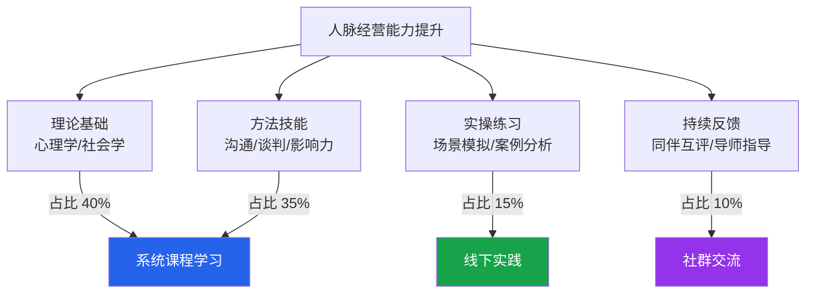
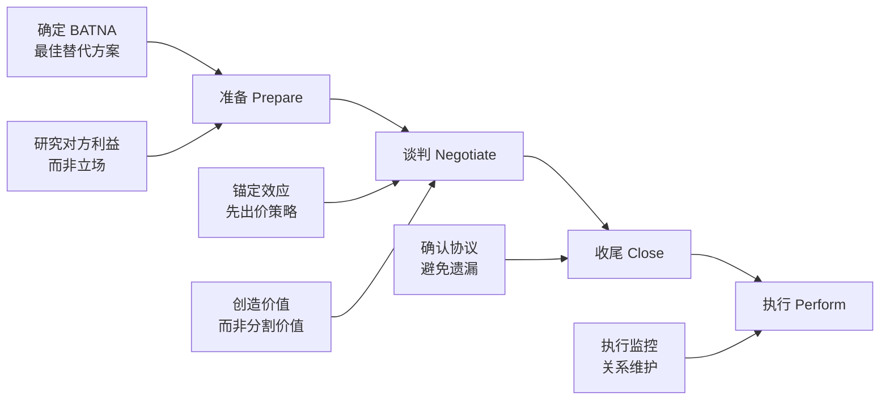

## 五、推荐在线课程

在线课程是系统学习人脉经营相关技能最高效的途径之一。与书籍相比，课程提供了结构化的学习路径、真实的案例演示、以及与讲师和其他学员互动的机会。本节按能力维度分类推荐，从底层心理学理论到上层实操技巧，帮助你构建完整的人脉经营知识体系。

### 5.1 为什么通过课程学习人脉经营

人脉经营看似是"靠天赋"的社交能力，实际上背后有严谨的心理学理论和可训练的行为模式。斯坦福大学的一项研究表明，社交能力的提升中，系统学习贡献了约 40% 的效果，而纯粹的"多参加活动"只贡献了 25%。这意味着，**方法论的学习比盲目实践更重要**。



选择在线课程的核心原则：

- **先理论后技巧**：不理解心理学原理，再多的社交技巧也只是"话术"
- **先通识后专项**：先建立整体认知框架，再针对具体场景深入学习
- **先输入后输出**：课程学习占 30% 时间，实践和复盘占 70%
- **选有数据支撑的课程**：优先选择有大样本研究支撑的学术型课程，而非纯经验分享

### 5.2 社交心理学：理解人际关系的底层逻辑

人脉经营的根基是理解人。这部分课程帮助你建立对社会认知、群体行为、影响力机制的系统理解，是所有后续技巧学习的理论地基。

#### 5.2.1 《社会心理学》（Social Psychology）—— Wesleyan 大学 · Coursera

这是全球最受欢迎的社会心理学入门课程，由 Scott Plous 教授主讲，截至 2025 年已有超过 73 万人注册，好评率高达 96%。

**课程结构与核心内容：**

| 模块 | 主题 | 与人脉经营的关联 |
|------|------|-----------------|
| 第 1 模块 | 社会认知与归因理论 | 理解别人如何判断你，你如何判断别人 |
| 第 2 模块 | 从众与服从 | 理解社交压力如何影响决策 |
| 第 3 模块 | 群体行为与决策 | 理解社交圈如何形成和运作 |
| 第 4 模块 | 偏见与歧视 | 理解社交中的"刻板印象"如何阻碍人脉拓展 |
| 第 5 模块 | 人际吸引 | 理解人们建立关系的心理机制 |
| 第 6 模块 | 亲社会行为 | 理解"利他"行为背后的社交逻辑 |

**学习建议：** 每周投入 10 小时，4 周可完成。建议配合经典教材《社会心理学》（戴维·迈尔斯）同步阅读，效果更佳。课程免费（证书付费），适合所有层次的读者作为第一门课程学习。

**核心收获：** 学完后，你会从"本能驱动"的社交模式转变为"认知驱动"的社交模式——你知道为什么某些社交策略有效，而不仅仅是在模仿动作。

#### 5.2.2 《社会心理学专题》（Social Psychology Specialization）—— Wesleyan 大学 · Coursera

这是上述课程的进阶版，由三门课程组成：

- **《社会心理学》**：基础理论（上文已介绍）
- **《吸引与关系》（Attraction and Relationships）**：深入研究亲密关系、友谊、社交网络形成的机制
- **《自我》（The Self）**：研究自我概念如何影响社交行为，包括自我监控、印象管理、社交焦虑

**适用人群：** 已完成基础课程，希望深入理解"人为什么建立关系"以及"如何管理自己在社交中的形象"的读者。第三门课程中关于"印象管理"的内容，直接对应人脉经营中的"个人品牌"建设。

#### 5.2.3 《情商：自我意识与自我管理》（Managing Emotions in Times of Stress）—— 耶鲁大学 · Coursera

由情商研究领域的开创者之一 Marc Brackett 主讲，基于耶鲁大学 RULER 情商模型。

**RULER 模型的五个维度：**

1. **Recognizing**（识别）：识别自己和他人的情绪信号
2. **Understanding**（理解）：理解情绪的起因和后果
3. **Labeling**（命名）：用精准的词汇描述情绪（不只是"不开心"，而是"失望""挫败""被忽视"）
4. **Expressing**（表达）：在社交场景中恰当地表达情绪
5. **Regulating**（调节）：在压力下管理情绪，避免社交失态

**与人脉经营的关系：** 在高端社交场景中，情绪管理能力是区分"社交高手"和"社交新手"的关键分水岭。一个能在高压谈判中保持冷静、在冲突中保持共情的人，天然拥有更强的人脉吸引力。

### 5.3 沟通技巧：从"会说话"到"会连接"

沟通是人脉经营的核心技能。很多人误以为沟通就是"嘴皮子利索"，实际上高效沟通包含倾听、表达、非语言信号管理、冲突处理等多个维度。

#### 5.3.1 《有效沟通》（Improving Communication Skills）—— 宾夕法尼亚大学沃顿商学院 · Coursera

由沃顿商学院教授 Maurice Schweitzer 主讲，是商业沟通领域的标杆课程。

**课程核心框架：**

- **信任的建立与维护**：如何在商业关系中快速建立信任，以及信任被破坏后如何修复
- **欺骗的识别与应对**：通过语言模式和非语言线索识别对方的不诚实
- **冲突管理**：从回避到协作的五种冲突处理风格，以及如何选择最合适的策略
- **影响力策略**：在不使用权力的情况下影响他人的决策

**实操亮点：** 课程包含大量真实商业场景的案例分析，学员需要在模拟场景中练习沟通技巧。这是少有的"重实操"而非"重理论"的沟通课程。

#### 5.3.2 《公众演讲》（Dynamic Public Speaking）—— 华盛顿大学 · Coursera

由 Matt McGarrity 教授主讲，包含四门课程的完整专项：

1. **公众演讲入门**：克服演讲恐惧，掌握基本演讲结构
2. **信息型演讲**：如何清晰传达复杂信息
3. **说服型演讲**：如何通过演讲影响他人的观点和决策
4. **演讲稿写作**：如何写出口语化但有逻辑的演讲稿

**与人脉经营的关系：** 在社交场合中，能够清晰、自信地表达自己想法的人，更容易获得他人的认可和信任。公众演讲能力不是"表演技能"，而是"社交基础设施"。一个能在 30 秒内讲清楚自己做什么、能给别人带来什么价值的人，在任何社交场合都会成为焦点。

#### 5.3.3 《非暴力沟通》相关课程 —— 多平台

非暴力沟通（NVC, Nonviolent Communication）由心理学家 Marshall Rosenberg 创立，是处理社交冲突、建立深层连接的核心方法论。

**NVC 的四步模型：**

观察 → 感受 → 需要 → 请求

示例：
❌ "你总是不回我消息，根本不在乎我。"（评判+指责）
✅ "你上次消息过了两天才回（观察），我感到被忽视（感受），
    因为我需要被重视（需要），下次能及时回复吗？（请求）"

**推荐学习资源：**

- **书籍**：《非暴力沟通》（Marshall Rosenberg 著，华夏出版社中文版）
- **得到 App**：搜"非暴力沟通"有多位讲师的精讲版本
- **喜马拉雅**：免费音频版本较多，适合通勤收听
- **网易公开课**：Marshall Rosenberg 的原版讲座视频（英文字幕）

**学习建议：** 非暴力沟通是一门"知易行难"的技能。光听课和读书远远不够，建议加入 NVC 实践社群（豆瓣、微信都有），每周进行至少一次刻意练习。

#### 5.3.4 MasterClass 平台沟通课

MasterClass 平台的课程以高质量制作和顶级讲师著称，适合有一定基础的学习者进行进阶提升：

- **Chris Voss《谈判的艺术》**：前 FBI 首席谈判专家教你如何在高压力场景中通过"战术共情"（Tactical Empathy）达成目标。核心技巧包括镜像法（Mirroring）、标注法（Labeling）、校准提问（Calibrated Questions）。这是最实用的"说服与影响"课程之一。
- **Robin Roberts《有效且真实的沟通》**：ABC 新闻主播教你如何通过真实的故事讲述建立人际连接。核心观点：**最好的沟通不是表演，而是展示真实的自己**。

### 5.4 谈判与影响力：高阶人脉经营的核心武器

当你的人脉从"泛泛之交"升级到"深度合作"时，谈判和影响力就成为必备技能。这不是"讨价还价"的技巧，而是在双方利益之间找到最优解的能力。

#### 5.4.1 《谈判：基本策略与技巧》（Successful Negotiation）—— 密歇根大学 · Coursera

由 George Siedel 教授主讲，超过 100 万人注册，是 Coursera 上最受欢迎的商业课程之一。

**四阶段谈判框架：**



**核心概念 BATNA：** BATNA（Best Alternative to Negotiated Agreement，最佳替代方案）是谈判中最重要的概念。它决定了你的谈判底线和议价能力。在人脉经营中，BATNA 对应的是"你有多少替代选择"——你的人脉网络越广，你在任何一段关系中的议价能力就越强。

**人脉经营启示：** 这门课教会你的不仅是谈判桌上的技巧，更重要的是"价值创造思维"——在任何社交关系中，思考"如何让双方都获得价值"比"如何从对方那里获得价值"更可持续。

#### 5.4.2 《影响力与说服》（Influence People and Persuade）—— Google · Coursera

Google 职业证书系列课程之一，基于 Robert Cialdini 的影响力六原则。

**Cialdini 影响力六大原则及其人脉应用：**

| 原则 | 含义 | 人脉经营中的应用 |
|------|------|-----------------|
| 互惠（Reciprocity） | 先给予，再索取 | 主动帮助他人，不求即时回报 |
| 承诺与一致（Commitment） | 人们会兑现自己的承诺 | 让对方做出小承诺，逐步升级 |
| 社会认同（Social Proof） | 人们参考他人行为做决策 | 展示你与他人的共同社交连接 |
| 喜好（Liking） | 人们更容易被喜欢的人影响 | 建立真实的个人魅力 |
| 权威（Authority） | 人们服从权威 | 建立专业领域的权威形象 |
| 稀缺（Scarcity） | 越稀缺越有价值 | 控制自己的社交"可见度" |

**特别说明：** Cialdini 在 2021 年出版了《影响力》的续作《Pre-Suasion》（先发影响力），补充了第七个原则——"统一性"（Unity），即人们更容易被"和自己属于同一群体"的人影响。这在人脉经营中对应的是"找到共同身份标签"——同校、同乡、同行业、同爱好。

### 5.5 个人品牌建设：让你的人脉主动来找你

人脉经营的最高境界不是"到处社交"，而是"让别人主动想认识你"。个人品牌建设就是实现这个目标的核心手段。

#### 5.5.1 《个人品牌建设》—— LinkedIn Learning

由 Goldie Chan 主讲，涵盖个人品牌的定义、策略和执行三个层面。

**个人品牌三要素模型：**

个人品牌 = 专业能力 × 传播能力 × 一致性

- 专业能力：你能解决什么问题？你的独特价值是什么？
- 传播能力：你的目标受众如何发现你？
- 一致性：你在不同渠道、不同场景中传递的信息是否统一？

**课程核心内容：**

1. **品牌定位**：找到你的"一句话定位"——在 30 秒内让别人知道你是谁、做什么、有什么独特价值
2. **内容策略**：如何通过 LinkedIn、微信公众号、知乎等平台持续输出专业内容
3. **社交形象管理**：从头像到签名档，从朋友圈到行业分享，系统管理你的社交形象
4. **网络关系维护**：如何在不打扰他人的前提下，持续维护弱连接

#### 5.5.2 中文平台个人品牌课程

**得到 App：**

- **古典《超级个体》**：从个人成长的角度切入个人品牌建设，核心观点是"在互联网时代，每个人都是一个'公司'，你就是自己的CEO"。课程涵盖职业发展、技能组合、个人 IP 打造等内容。
- **华杉《跟华杉学品牌营销》**：虽然面向企业品牌，但华与华的"超级符号"理论完全可以迁移到个人品牌——你的言行举止、穿着打扮、社交风格，都是你的"品牌符号"。

**混沌学园：**

混沌学园的课程更偏向创业者和企业高管，但其"认知升级"系列对个人品牌建设有深刻启发。核心理念是：**品牌不是包装出来的，是你认知水平的外化**。你看待世界的方式，决定了别人如何看待你。

### 5.6 情商与领导力：人脉经营的"内功"

情商是人脉经营的底层操作系统。技术再高超的社交技巧，如果没有情商支撑，都会显得"油腻"或"虚伪"。

#### 5.6.1 《情商与领导力》—— LinkedIn Learning

**Daniel Goleman 情商五维度：**

1. **自我认知**（Self-Awareness）：了解自己的情绪状态、优势、弱点和价值观
2. **自我管理**（Self-Regulation）：控制冲动、管理情绪、保持适应力
3. **内在驱动力**（Motivation）：出于热爱而非外部奖励去追求目标
4. **共情能力**（Empathy）：理解他人的感受和观点
5. **社交技能**（Social Skills）：管理关系、建立网络、领导团队

**关键洞察：** 研究表明，在高管层面，情商对工作绩效的贡献是智商的两倍。而在人脉经营中，情商的第 4 和第 5 项（共情和社交技能）直接决定了你能建立多深的人际关系。

#### 5.6.2 《情商课》—— 喜马拉雅

**蔡康永《201 堂情商课》**：台湾知名主持人蔡康永以轻松幽默的方式讲解情商修炼。课程不讲理论框架，而是用大量真实故事和场景来展示"高情商的人在社交中是什么样的"。

**适合人群：** 不喜欢学术化课程、希望通过故事和案例学习的读者。蔡康永的表达方式本身就是"高情商沟通"的示范——温和但有立场，幽默但不轻浮。

**学习建议：** 适合通勤、做家务等碎片时间收听。但注意：故事型课程容易让人产生"听懂了"的错觉。建议每听完一个故事，停下来思考："如果是我，我会怎么做？"并写下答案。

#### 5.6.3 《关系攻略》—— 得到 App

由熊太行主讲，是中文互联网上最系统的人际关系处理课程之一。

**课程核心价值：** 不同于西方的人际关系理论（强调"真诚""透明"），这门课深入中国社会的人情世故、面子文化、关系网络等本土社交场景，提供更接地气的社交策略。

**核心模块：**

- 中国式人情的底层逻辑：面子、关系、人情债
- 职场社交：向上管理、跨部门协作、如何应对"办公室政治"
- 社交冲突处理：如何拒绝、如何道歉、如何化解尴尬
- 弱连接经营：如何在不投入大量时间的前提下维护广泛的人脉网络

### 5.7 按学习阶段选择课程：从入门到精通的学习路径

不同阶段的学习者需要不同深度的课程。以下是推荐的分阶段学习路径：

```mermaid
graph TD
    subgraph 入门阶段（1-3个月）
        A1[社会心理学<br/>Coursera/Wesleyan]
        A2[非暴力沟通<br/>得到/喜马拉雅]
        A3[情商课<br/>蔡康永]
    end
    
    subgraph 进阶阶段（3-6个月）
        B1[有效沟通<br/>沃顿商学院]
        B2[影响力与说服<br/>Google]
        B3[关系攻略<br/>得到App]
    end
    
    subgraph 高阶阶段（6-12个月）
        C1[谈判技巧<br/>密歇根大学]
        C2[个人品牌建设<br/>LinkedIn Learning]
        C3[领导力<br/>LinkedIn Learning]
    end
    
    subgraph 实践整合
        D1[MasterClass进阶课<br/>Chris Voss/Robin Roberts]
        D2[混沌学园<br/>认知升级]
        D3[NVC实践社群<br/>线下刻意练习]
    end
    
    A1 --> B1
    A2 --> B2
    A3 --> B3
    B1 --> C1
    B2 --> C2
    B3 --> C3
    C1 --> D1
    C2 --> D2
    C3 --> D3
    
    style A1 fill:#059669,color:#fff
    style A2 fill:#059669,color:#fff
    style A3 fill:#059669,color:#fff
    style B1 fill:#2563eb,color:#fff
    style B2 fill:#2563eb,color:#fff
    style B3 fill:#2563eb,color:#fff
    style C1 fill:#7c3aed,color:#fff
    style C2 fill:#7c3aed,color:#fff
    style C3 fill:#7c3aed,color:#fff
    style D1 fill:#dc2626,color:#fff
    style D2 fill:#dc2626,color:#fff
    style D3 fill:#dc2626,color:#fff
```

### 5.8 各平台对比与选择建议

| 平台 | 特点 | 价格区间 | 语言 | 适合人群 |
|------|------|---------|------|---------|
| Coursera | 学术性强，大学背书，有证书 | 免费旁听 / 证书 $49-79 | 英文为主（有中文字幕） | 希望系统学习理论的读者 |
| edX | 与 Coursera 类似，哈佛/MIT 课程多 | 免费旁听 / 证书 $50-150 | 英文为主 | 追求顶级学术资源的读者 |
| LinkedIn Learning | 职场导向，实用性强 | 月费 ¥150-200 | 英文（有中文字幕） | 职场人士，注重实操 |
| MasterClass | 顶级讲师，制作精良 | 年费 $120-180 | 英文 | 有一定基础，追求灵感 |
| 得到 App | 中文原创，接地气 | 课程 ¥99-399 | 中文 | 不习惯英文课程的读者 |
| 喜马拉雅 | 音频为主，碎片化学习 | 免费 / 付费课程 ¥99-299 | 中文 | 通勤、碎片时间学习 |
| 混沌学园 | 偏商业思维，创业者导向 | 年费 ¥1000+ | 中文 | 创业者、企业高管 |
| 网易公开课 | 大量免费翻译课程 | 免费 | 中文字幕 | 预算有限的学习者 |

### 5.9 课程学习的正确方法

很多人"学了很多课程，但社交能力没有提升"，根本原因是学习方法不对。以下是经过验证的高效学习法：

**第一，输入-加工-输出三步法：**

输入：看课程视频，做笔记（占 30% 时间）
加工：用自己的话总结，画思维导图（占 30% 时间）
输出：在真实社交场景中练习，复盘（占 40% 时间）

**第二，费曼学习法应用：** 学完一个模块后，尝试用最简单的语言向一个完全不懂的朋友解释这个概念。如果你解释不清楚，说明你还没真正理解。建议在学习社群中找到"学习搭档"，互相讲解。

**第三，场景化练习清单：** 每学完一门课程，列出 3-5 个可以立刻应用的具体场景：

- 学完《非暴力沟通》→ 在下次和同事意见不合时，尝试用"观察-感受-需要-请求"四步法表达
- 学完《影响力》→ 在下周的一次社交活动中，有意识地使用"互惠"原则（先主动帮助一个人）
- 学完《谈判》→ 在下次采购或讨论方案时，提前准备好自己的 BATNA

**第四，建立"社交实验日志"：** 每次社交活动后，记录以下内容：

日期：____
场景：____
尝试的技巧：____
效果如何：____
如果重来，我会：____

持续记录 3 个月，你会清晰地看到自己的进步轨迹。

### 5.10 常见学习误区

**误区一："我要学完所有课程再开始社交"**
纠正：学完一门基础课程就可以开始实践。知识只有在应用中才能真正内化。建议边学边做，不要等到"准备好了"才行动——你永远不会"完全准备好"。

**误区二："英文课程太难，不如只看中文的"**
纠正：Coursera 和 edX 上的课程大多有中文字幕，且学术课程的语言通常比较规范。英文课程的学术深度和案例质量通常高于中文平台。建议入门用中文平台建立兴趣，进阶切换到英文平台提升深度。

**误区三："看完视频就等于学完了"**
纠正：视频学习只完成了知识输入的 30%。如果不做笔记、不总结、不实践，一周后你会忘记 90% 的内容。**没有输出的学习是无效学习**。

**误区四："免费课程质量不行"**
纠正：Coursera 上几乎所有课程都可以免费旁听（只是没有证书）。学术质量最高的课程往往是免费的，因为它们背后有大学的学术声誉支撑。付费证书更多是一种"自我承诺"机制，而非质量保证。

**误区五："只学一门课就够了"**
纠正：人脉经营是一个多维能力体系，涉及心理学、沟通、谈判、情商、个人品牌等多个维度。建议至少学完 3-5 门互补的课程，才能建立完整的知识框架。

### 5.11 免费学习资源补充

除了正式的在线课程平台，以下免费资源也是学习人脉经营的优质补充：

- **TED 演讲**（ted.com）：搜索 "social skills""communication""negotiation""empathy" 等关键词，每场 15-20 分钟，适合碎片化学习。推荐：Amy Cuddy《肢体语言塑造你自己》、Brené Brown《脆弱的力量》、Celeste Headlee《10 ways to have a better conversation》
- **哈佛公正课**（网易公开课免费）：Michael Sandel 教授主讲，虽然主题是伦理学，但课程中的辩论技巧和思维方式对提升社交深度有巨大帮助
- **樊登读书 App**：樊登对《非暴力沟通》《关键对话》《影响力》《高效能人士的七个习惯》等书籍的解读，适合快速获取核心观点
- **知乎/豆瓣相关话题**：搜索"社交恐惧""人际交往""沟通技巧"等话题，有大量高质量的个人经验分享

***

本节推荐的课程覆盖了从底层心理学理论到上层实操技巧的完整知识体系。记住：**课程只是起点，实践才是终点**。选择 1-2 门最符合你当前阶段的课程，用正确的方法学习，并在真实的社交场景中反复练习，才是提升人脉经营能力的正确路径。
