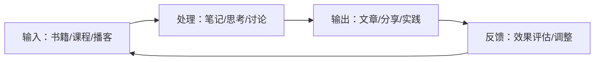

## 六、产品选择建议

市面上关于社交/人脉的书籍、工具、活动数以千计，但并非每一样都适合你。盲目跟风购买畅销书、注册各种App、参加所有社交活动，结果往往是书架吃灰、App积灰、活动白跑——时间精力投入不少，人脉质量纹丝不动。

**产品选择的本质是资源分配问题。** 你的时间、注意力、精力都是有限资源，必须投向ROI最高的方向。本节从三个维度给出系统性选择框架：按成长阶段、按社交目标、按可用时间。每个维度下附带具体执行方案和避坑指南。

---

### 6.1 根据阶段选择：从入门到精通的路径

人脉经营能力有明确的成长阶梯。不同阶段面对的核心挑战不同，需要的"武器"也不同。错误阶段使用高阶工具，就像小学生拿着博士论文——不仅学不会，还会打击信心。

#### 6.1.1 入门阶段（0-1年）：建立基础认知

**核心挑战：** 不知道怎么开口、害怕被拒绝、不了解社交的基本规则。

**书籍选择逻辑：**

| 书籍 | 解决什么问题 | 为什么选它 | 阅读方法 |
|------|-------------|-----------|---------|
| 《人性的弱点》 | 理解人际交往的基本心理 | 卡耐基的经典框架至今适用，用大量真实案例说明原理 | 每章读完立刻找1个场景练习，不要一次性读完 |
| 《别独自用餐》 | 建立"人脉是一种资产"的认知 | 作者从底层逆袭为顶级人脉王，方法论接地气 | 重点读前三章和"跟随计划"部分 |
| 《沟通的艺术》 | 基础沟通技巧 | 罗纳德·阿德勒的教材级著作，系统且可操作 | 当工具书翻，遇到沟通问题时查阅对应章节 |

**工具选择逻辑：**

入门阶段不需要复杂工具，一个微信就够了——但要用对。

- **微信标签管理：** 把新加的人立刻打标签（行业/关系强度/认识场景），花10秒省10分钟日后回忆"这人是谁"。具体操作：通讯录→标签→新建标签（如"行业-互联网""强度-强关系""场景-XX大会"），每加一人立刻归类。
- **手机备忘录：** 每次社交活动后用2分钟记录：谁、在哪认识的、聊了什么、对方关注什么。这是最低成本的"人脉档案"。

**活动选择逻辑：**

- **读书会/学习社群：** 门槛最低，有共同话题自然能聊起来，不需要社交技巧多高超。选人数20-50人的小规模活动，太大容易沦为观众。
- **行业沙龙：** 带着"学习+认识3个人"的目标去，不贪多。会后24小时内发一条消息给聊得来的人："今天聊的XX话题很有意思，这是相关链接/资料。"
- **志愿服务：** 被严重低估的社交场景。一起做事建立的信任比一起吃饭深3倍。

**入门阶段常见误区：**

1. **一上来就学"高级话术"：** 真诚比技巧重要100倍。入门阶段只需要做到"认真听、记住名字、事后跟进"三件事。
2. **参加太多活动：** 质量 > 数量。每周1次深度社交 > 每天1次浮于表面。
3. **不敢开口：** 99%的社交恐惧来自于想太多。对方也在想"怎么开口"，你先迈出一步就是帮了双方一个忙。

---

#### 6.1.2 进阶阶段（1-3年）：构建系统化体系

**核心挑战：** 认识了不少人但关系不深、不知道怎么维护大量关系、社交效率低下。

**书籍选择逻辑：**

| 书籍 | 解决什么问题 | 核心收获 | 阅读重点 |
|------|-------------|---------|---------|
| 《影响力》 | 理解说服和影响力的心理学原理 | 六大影响力法则（互惠、承诺、社会认同、喜好、权威、稀缺） | 每个法则对应一个实际社交场景做笔记 |
| 《社交天性》 | 理解人类社交行为的神经科学基础 | 大脑的社交网络是默认模式，理解底层机制才能高效社交 | 第3-5章（心智化系统、自我系统、镜像系统） |
| 《给予》(Give and Take) | 搞清楚"给予者"如何在社交中取得成功 | 给予者不等于"老好人"，策略性给予才能持续 | 重点读"给予者倦怠"的预防方案 |
| 《非暴力沟通》 | 解决冲突和深度连接 | 四步沟通法：观察→感受→需要→请求 | 每个步骤都找真实冲突场景练习 |

**工具选择逻辑：**

进阶阶段，手工记录已无法支撑日益增长的人脉数量。需要升级到结构化工具。

| 工具 | 适合人群 | 核心优势 | 学习成本 |
|------|---------|---------|---------|
| Notion | 喜欢自定义的人 | 高度灵活，可建立完整的CRM系统 | 中等，需1-2天上手 |
| 飞书多维表格 | 国内用户、团队协作 | 与飞书生态无缝集成，模板丰富 | 低，类似Excel |
| Obsidian | 喜欢知识管理的人 | 双向链接可建立人脉知识图谱 | 较高，需理解图谱思维 |
| 手机通讯录+备忘录 | 不想折腾工具的人 | 零学习成本，随时随地可用 | 零 |

**CRM系统搭建要点：**

无论选哪个工具，人脉档案至少包含以下字段：

基础信息：姓名、公司、职位、联系方式、认识日期
关系信息：认识场景、共同朋友、关系强度(1-5)、互动频率
个人信息：兴趣爱好、家庭情况、最近关注的话题
价值信息：我能帮他什么、他能帮我什么、最近互动摘要
标签：行业、地域、社交圈层

**活动选择逻辑：**

- **Toastmasters：** 公众演讲和领导力训练组织，全球性的，每周固定活动。是进阶社交能力的最佳训练场——既练表达又拓展人脉。选一个离家近的俱乐部，坚持3个月以上才有效果。
- **BNI（商务网络国际）：** 专门为商业人士设计的引荐制社交组织。每人只能加入一个行业类别，互相引荐客户。适合有明确商业目标的人，但需付费且有出勤要求。
- **行业社群（知识星球/微信群）：** 选1-2个高质量的深度参与，不要贪多。判断标准：群主是否持续输出、成员质量是否稳定、讨论是否有深度。

**进阶阶段关键动作：**

1. **建立人脉档案系统：** 不是记通讯录，而是记录"这个人和我的关系状态"。每周花30分钟更新。
2. **建立定期维护机制：** 按关系强度分级——强关系每月至少1次深度互动，弱关系每季度至少1次轻触达（点赞/评论/转发文章）。
3. **学会"策略性给予"：** 不是无差别地帮忙，而是识别高价值关系后主动提供对方需要的价值。

---

#### 6.1.3 高级阶段（3年+）：打造影响力网络

**核心挑战：** 如何从"维护关系"升级到"构建生态"、如何让人脉网络产生复利效应。

**书籍选择逻辑：**

| 书籍 | 解决什么问题 | 核心收获 | 阅读重点 |
|------|-------------|---------|---------|
| 《社会网络分析》 | 用科学方法理解和优化人脉结构 | 网络密度、中心性、结构洞等核心概念 | 学会画自己的人脉网络图并识别瓶颈 |
| 《引爆点》 | 理解信息和趋势如何在社交网络中传播 | 个别人物法则、附着力因素、环境威力法则 | 识别自己人脉网络中的"联系员""内行""推销员" |
| 《联盟》 | 建立长期互惠的深度关系框架 | 任期制思维：明确每个关系的互惠框架 | 重点理解"前同事关系"的维护策略 |
| 《弱关系的力量》 | 理解弱关系在信息获取和机会发现中的价值 | 格兰诺维特的经典理论：弱关系比强关系带来更多信息 | 结合自己的行业特点分析弱关系分布 |

**工具选择逻辑：**

高级阶段的工具核心诉求是**可视化网络结构**和**自动化维护提醒**。

- **LinkedIn Sales Navigator：** 适合做全球化人脉管理，强大的搜索和标签功能。
- **Clay / Dex：** 专门为人脉管理设计的CRM，自动整合邮件、日历、社交媒体信息。
- **自建系统（Airtable/Notion+自动化）：** 最灵活但需要技术投入，适合有编程能力的人。可用Zapier/Make连接邮件和日历，自动更新互动记录。

**活动选择逻辑：**

- **行业会议/峰会：** 带着明确目标去——要认识哪3个人、要了解什么趋势。提前研究参会者名单，会前邮件约咖啡。
- **高端社群/私董会：** 通过邀请制或申请制加入，成员质量有筛选保证。核心价值不在于"认识多少人"，而在于"和谁深度对话"。
- **跨界活动：** 刻意参加自己行业之外的活动，构建"结构洞"——连接不同社交圈的节点位置，这是最具信息优势的位置。

**高级阶段关键动作：**

1. **识别自己网络中的角色：** 你是联系员（连接不同圈子）、内行（专业知识输出者）、还是推销员（善于说服的人）？不同角色有不同的经营策略。
2. **构建"弱关系引擎"：** 有意识地保持一定比例的弱关系（建议30-40%），定期接触新领域的人。弱关系带来的是新信息和新机会。
3. **从个人到平台：** 从"我认识谁"升级到"谁通过我认识了谁"。成为信息和资源的枢纽节点，别人自然会主动找你。

---

### 6.2 根据目标选择：不同场景的最优组合

不同社交目标需要不同的"武器组合"。下面给出五大常见场景的完整方案，每个方案都是书+工具+活动的最优搭配。

#### 6.2.1 职场社交方案

**目标：** 在职场中建立影响力、获取晋升机会、拓展行业人脉。

**推荐组合：**

| 组件 | 具体选择 | 为什么 | 使用方式 |
|------|---------|-------|---------|
| 书籍 | 《别独自用餐》 | 职场人脉的经典方法论 | 重点读"人脉计划"和"饭局管理"章节 |
| 书籍 | 《向上管理》 | 学会和上级建立有效关系 | 结合自己的直属领导特点做分析 |
| 平台 | LinkedIn | 全球职场社交的标配 | 每周发布1条行业洞察，每月更新一次档案 |
| 平台 | 飞书/企业微信 | 国内职场的主阵地 | 善用"朋友圈"功能展示专业度 |
| 活动 | 行业会议 | 高密度接触行业内关键人物 | 每季度至少1次，提前做功课 |
| 活动 | Toastmasters | 提升公开表达和领导力 | 每周1次，坚持6个月以上 |
| 工具 | 飞书多维表格 | 记录职场人脉档案 | 建"职场人脉"表，字段包含公司/职位/互动记录 |

**执行节奏：**
- 每天：花10分钟浏览LinkedIn/飞书动态，点赞评论3条
- 每周：约1位同事或行业朋友喝咖啡/午餐
- 每月：参加1次行业活动，事后跟进至少3个人
- 每季度：做一次人脉盘点，淘汰无效关系，深化高价值关系

#### 6.2.2 创业社交方案

**目标：** 寻找合伙人、获取客户、建立商业生态。

**推荐组合：**

| 组件 | 具体选择 | 为什么 | 使用方式 |
|------|---------|-------|---------|
| 书籍 | 《影响力》 | 创业本质上是影响他人的游戏 | 六大法则逐一对照自己的商业场景 |
| 书籍 | 《精益创业》 | MVP思维适用于社交——快速试错低成本 | 用MVP思维测试不同社交策略的效果 |
| 平台 | 知识星球 | 国内创业者聚集最密集的地方 | 选2-3个高质量星球深度参与 |
| 平台 | 即刻 | 创业圈的"朋友圈"，信息密度高 | 每天发1条创业思考，吸引同频的人 |
| 活动 | BNI | 结构化的商业引荐网络 | 坚持出席，学习引荐的艺术 |
| 活动 | 创业路演/孵化器活动 | 接触投资人和潜在合伙人 | 每月参加1-2次，带好30秒电梯演讲 |
| 工具 | Notion CRM | 灵活管理商业人脉 | 区分"潜在合伙人""潜在客户""潜在投资人"三个视图 |

**创业社交的关键原则：**

1. **先给予再索取：** 创业圈最忌讳一上来就推销自己。先帮助别人解决问题，建立信任后再谈合作。
2. **弱关系比强关系更重要：** 创业者的机会往往来自弱关系（朋友的朋友），保持30%以上的弱关系比例。
3. **讲故事的能力：** 你的项目需要一个30秒能讲清楚的故事。练习电梯演讲直到自然流畅。

#### 6.2.3 兴趣社交方案

**目标：** 因共同爱好建立真实友谊，丰富社交生活。

**推荐组合：**

| 组件 | 具体选择 | 为什么 | 使用方式 |
|------|---------|-------|---------|
| 书籍 | 《人性的弱点》 | 兴趣社交的核心是"真诚关心他人" | 重点读"如何让别人喜欢你"章节 |
| 书籍 | 《社交天性》 | 理解为什么共同兴趣能快速建立连接 | 理解"镜像神经元"在社交中的作用 |
| 平台 | 微信群 | 兴趣社群最集中的地方 | 选1-2个高质量群深度参与，不要潜水 |
| 平台 | 豆瓣 | 文艺类兴趣爱好者的聚集地 | 加入小组，参加线下同城活动 |
| 活动 | 兴趣俱乐部 | 固定活动频率最容易建立深度关系 | 选一个坚持3个月以上，不要三天打鱼 |
| 工具 | 手机通讯录 | 兴趣社交不需要复杂工具 | 在备注里记下对方的兴趣和共同活动 |

**兴趣社交的注意事项：**

- **保持纯粹：** 兴趣社交的目的是建立真实友谊，不要带着功利心参加。
- **质量优先：** 3-5个志同道合的深度朋友 > 100个泛泛之交。
- **自然过渡：** 当兴趣朋友发展到一定深度后，可以自然地聊到工作和生活，但不要刻意。

#### 6.2.4 专业社交方案

**目标：** 在专业领域建立权威形象，获取行业资源和信息。

**推荐组合：**

| 组件 | 具体选择 | 为什么 | 使用方式 |
|------|---------|-------|---------|
| 书籍 | 《弱关系的力量》 | 专业社交的核心是信息网络 | 重点理解"结构洞"概念并应用 |
| 书籍 | 《知识的错觉》 | 理解专家思维和群体智慧 | 帮助你在专业社群中定位自己的角色 |
| 平台 | Notion/语雀 | 建立个人知识库并对外分享 | 每月发布1-2篇深度行业分析 |
| 平台 | Twitter/X | 全球技术/专业社区的主阵地 | 参与行业讨论，转发有价值的内容 |
| 活动 | 行业沙龙 | 小规模深度交流的最佳场景 | 每月1-2次，争取做1次分享嘉宾 |
| 活动 | 技术/专业社群 | 持续输出专业价值 | 选择1-2个深度参与，成为核心成员 |
| 工具 | Obsidian | 专业知识管理的瑞士军刀 | 建立"人脉+知识"双向链接图谱 |

**专业社交的核心策略：**

1. **输出驱动社交：** 写文章、做分享、出教程——专业内容是最好的社交货币。
2. **成为连接者：** 把不同专业圈子的人连接起来，你就是信息枢纽。
3. **维护专家形象：** 一致性很重要，你的线上和线下形象要统一。

#### 6.2.5 跨界社交方案

**目标：** 连接不同行业/领域的人，获取跨界创新的灵感和机会。

**推荐组合：**

| 组件 | 具体选择 | 为什么 | 使用方式 |
|------|---------|-------|---------|
| 书籍 | 《引爆点》 | 理解创新如何在不同圈子间传播 | 识别"联系员""内行""推销员"三种关键角色 |
| 书籍 | 《创新者的窘境》 | 理解为什么跨界视角能发现新机会 | 用"价值网络"框架分析不同行业的交叉点 |
| 平台 | 即刻/微博 | 信息流动最快的地方 | 关注不同行业的大V，看他们讨论什么 |
| 平台 | 线上社群 | 低成本接触不同领域的人 | 加入3-5个不同领域的社群 |
| 活动 | 跨行业论坛 | 刻意接触陌生领域的最佳场景 | TED、混沌学园、得到大学等 |
| 活动 | 播客/直播 | 低门槛的跨界交流方式 | 做客或主持一档跨领域对谈节目 |
| 工具 | LinkedIn | 跨国界、跨行业的人脉管理 | 利用"共同连接"功能发现跨界人脉 |

---

### 6.3 根据时间选择：用有限时间创造最大价值

时间是人脉经营最大的约束条件。不是每个人都能每天花2小时社交。下面按可用时间给出精确到分钟的执行方案，让每1分钟都花在刀刃上。

#### 6.3.1 每天30分钟方案（极简模式）

**适合人群：** 工作忙碌、社交时间极度有限、只想保持基本人脉活跃度的人。

**时间分配：**

07:30-07:40  阅读10页人脉/社交相关书籍（10分钟）
             → 选1本书放在床头，每天起床后翻10页
             → 不需要做笔记，只需记住1个关键点
             → 一周能读完约50页，一个月读完1-2本书

12:00-12:05  浏览朋友圈/LinkedIn动态（5分钟）
             → 不是漫无目的地刷，而是有意识地"看见"
             → 对重要人脉的动态点赞/评论1-2条
             → 评论要有实质内容，不要只发"👍"

20:00-20:15  微信维护（15分钟）
             → 联系1个近期没聊过的朋友，发一条有价值的消息
             → 内容可以是：分享文章/资讯、询问近况、回应朋友圈
             → 关键原则：不要只说"在吗"，要提供价值或制造话题

**每周额外投入：** 周末花30分钟整理本周新认识的人，更新人脉档案。

**30分钟方案的底线：** 即使再忙，也不要完全中断。人脉关系最大的敌人不是"不够努力"，而是"长期消失"。30分钟能维持基本的人脉活跃度，避免关系"生锈"。

#### 6.3.2 每周2小时方案（标准模式）

**适合人群：** 有一定社交意愿、希望稳步扩展人脉的人。

**时间分配：**

周一 20:00-20:30  深度阅读30分钟
                  → 读1章书籍，做3-5条笔记
                  → 重点标注可以立刻应用的方法
                  → 每月读完2-3本书

周三 20:00-20:30  线上社群互动30分钟
                  → 在1-2个高质量社群中发言/回答问题
                  → 分享最近学到的东西或遇到的问题
                  → 主动@你认为能帮上忙的人

周五 20:00-20:30  人脉维护30分钟
                  → 批量联系本周有互动但未深入的人
                  → 发送有价值的信息（文章/机会/介绍）
                  → 更新人脉档案

周六 10:00-10:30  参加线上活动30分钟
                  → 行业webinar/读书会/分享会
                  → 会后在群里加2-3个聊得来的人

**每周2小时的关键突破点：** 这个时间量足以建立"有意识的社交习惯"。重点不是做了多少，而是形成节奏感——固定时间、固定动作、持续执行。

#### 6.3.3 每月1天方案（深度模式）

**适合人群：** 对人脉经营有明确目标、愿意投入大块时间的人。

**执行方案（选一个周末）：**

上午 9:00-12:00（3小时）
  → 参加一场线下活动（行业沙龙/读书会/兴趣俱乐部）
  → 目标：深度交流3-5个人，交换联系方式
  → 关键动作：活动后立刻在通讯录添加备注

下午 13:00-15:00（2小时）
  → 整理人脉档案
  → 回顾上月新增的人脉，分类标记
  → 识别需要跟进的人，制定下周跟进计划
  → 检查本月互动频率，找出"失联"的人

下午 15:00-17:00（2小时）
  → 深度阅读或学习
  → 读1-2章专业书籍
  → 或者完成一门线上课程的一个模块
  → 做笔记并思考如何应用到社交场景

**每月1天的核心价值：** 大块时间让你能做"社交审计"——审视整体人脉网络的健康度，而不是零敲碎打地维护。这个习惯坚持半年，你会明显感觉到人脉网络的质变。

#### 6.3.4 每季度3天方案（战略模式）

**适合人群：** 高管/创业者/自由职业者，人脉质量直接影响收入和事业发展。

**执行方案：**

第1天：行业会议/峰会
  → 带着明确目标：要认识谁、要了解什么、要拿到什么信息
  → 提前研究参会者名单，准备3-5个"想认识"的人
  → 现场主动约咖啡/午餐
  → 当晚整理名片和联系方式，发送"很高兴认识你"的消息

第2天：人脉盘点与规划
  → 上午：绘制人脉网络图
    → 用思维导图或专业工具画出当前人脉网络
    → 标记关系强度（强/中/弱）
    → 识别"结构洞"（缺少连接的圈子）
  → 下午：制定下季度社交计划
    → 确定3-5个重点维护的关系
    → 确定2-3个需要拓展的新领域
    → 安排下季度的活动日历

第3天：深度连接
  → 约2-3个重要的人进行1对1深度交流
  → 选平时只能微信聊天的、需要面对面才能推进的关系
  → 交流内容不限于工作，也要聊个人成长和未来规划
  → 当天晚上写总结笔记，记录关键信息和后续行动

---

### 6.4 选择的底层逻辑：四维评估法

无论按哪个维度选择，所有产品（书/工具/活动）都可以用同一个框架评估。掌握这个框架，你就拥有了"自主选择"的能力，不再需要别人推荐。

#### 6.4.1 四维评估框架

对任何一项产品/活动/书籍，从以下四个维度打分（1-5分）：

| 维度 | 含义 | 评估标准 | 权重 |
|------|------|---------|------|
| **匹配度** | 与你当前阶段和目标的契合程度 | 是否解决你当前面临的具体问题 | 40% |
| **可操作性** | 读完/学完后能立刻应用的程度 | 是否有具体的步骤和方法，而非纯理论 | 30% |
| **时间成本** | 需要投入的时间与你可用时间的匹配 | 能否融入你现有的日程安排 | 20% |
| **口碑质量** | 已验证的实际效果 | 是否有大量真实用户反馈证明有效 | 10% |

**计算公式：** 综合分 = 匹配度×0.4 + 可操作性×0.3 + 时间成本×0.2 + 口碑质量×0.1

**使用方法：**
1. 列出你考虑的3-5个选项
2. 对每个选项的四个维度打分
3. 计算综合分，选最高分的那个
4. **执行至少1个月后再评估效果**，不要频繁切换

#### 6.4.2 常见选择误区

**误区一：迷信畅销书**

畅销书不一定适合你。《人性的弱点》销量超3000万册，但如果你已经是社交高手，它对你几乎没有新内容。选书的标准是"能解决我当前的问题"，不是"排行榜第几名"。

**误区二：工具越多越好**

见过有人同时用Notion、飞书、Obsidian、Excel管理人脉——结果哪个都没坚持下来。工具只需要一个，关键是你用它做什么。一个用得好的Excel，胜过十个半吊子的App。

**误区三：活动越大越好**

500人的行业大会 vs 30人的深度沙龙，后者的社交价值往往更高。大规模活动适合"曝光"（让别人知道你），小规模活动适合"连接"（真正认识一个人）。根据你的需求选择。

**误区四：只消费不输出**

读了10本书但从不分享读书笔记，参加了10次活动但从不主动介绍朋友互相认识——这是"社交消费者"而非"社交创造者"。输出（写文章、做分享、牵线搭桥）才是社交价值的放大器。

---

### 6.5 产品组合的进阶策略

当你已经掌握了基础的产品选择方法后，可以尝试更高级的组合策略。

#### 6.5.1 "书+工具+活动"三位一体法

最有效的产品组合是"书提供理论框架 + 工具提供执行系统 + 活动提供实践场景"。三者缺一不可：

- 只读书不用工具 → 知识停留在纸面
- 只用工具不参加活动 → 关系维护无从谈起
- 只参加活动不读书 → 只有经验没有方法论

**执行建议：** 同一时间段内，保持"1本正在读的书 + 1个在用的工具 + 1个固定参加的活动"。不要贪多，三个就足够。

#### 6.5.2 "输入-处理-输出"循环法

将人脉经营产品按信息流分类：

- **输入产品：** 书籍、播客（《得到》《樊登读书》等）、线上课程
- **处理产品：** Notion/Obsidian做笔记、社群讨论、与朋友交流
- **输出产品：** 写公众号/博客、做社群分享、在活动中实践

**关键原则：** 输入:处理:输出的时间比建议为 3:3:4。大多数人的问题是输入太多、输出太少。

#### 6.5.3 季节性调整策略

不同季节的社交场景不同，产品组合也应该动态调整：

| 季节 | 社交特点 | 推荐策略 |
|------|---------|---------|
| 春季（3-5月） | 年度计划启动期，各类活动密集 | 重点参加行业大会和新社群，拓展新人脉 |
| 夏季（6-8月） | 户外活动增多，社交场景多元 | 兴趣社交为主，参加户外/运动类活动 |
| 秋季（9-11月） | 年度冲刺期，商业活动高峰 | 专业社交为主，深化关键商业关系 |
| 冬季（12-2月） | 年终总结+节日聚会 | 人脉盘点为主，利用节日维护老关系 |

---

### 6.6 长期主义：产品选择的终极原则

所有产品选择建议最终归结为一个原则：**持续执行比完美选择重要100倍。**

一本被翻烂的《人性的弱点》，胜过书架上100本崭新的社交书籍。
一个坚持用了2年的Excel人脉表，胜过试用了10个CRM但哪个都没坚持。
一个每周都去的读书会，胜过一年参加50个活动但每次都蜻蜓点水。

**给你三个最终建议：**

1. **选择后至少坚持3个月。** 社交产品的效果不会立竿见影，给它足够的时间发酵。
2. **每季度做一次"产品审计"。** 检查当前在用的书/工具/活动是否还在发挥作用，淘汰无效的，但不要频繁更换。
3. **记住社交的本质。** 所有书、工具、活动都是手段，目的是建立真实、互惠、长期的人脉关系。不要让手段变成了目的。

