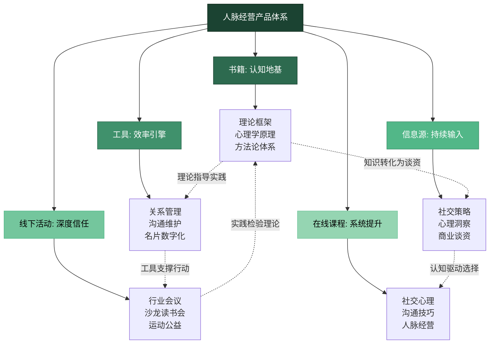
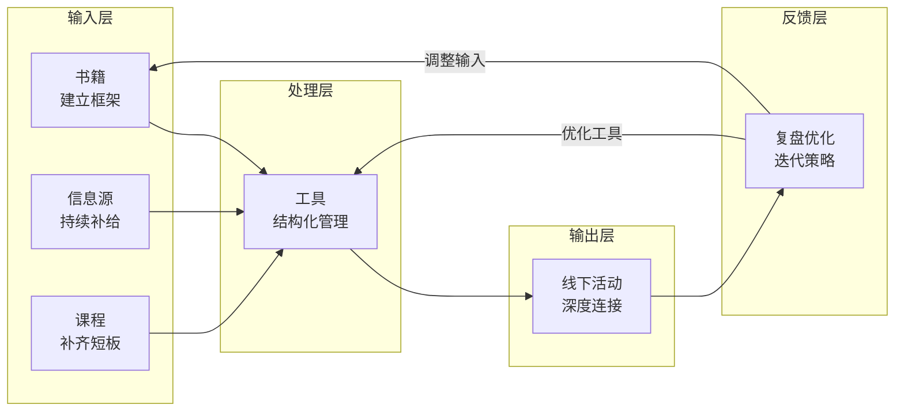
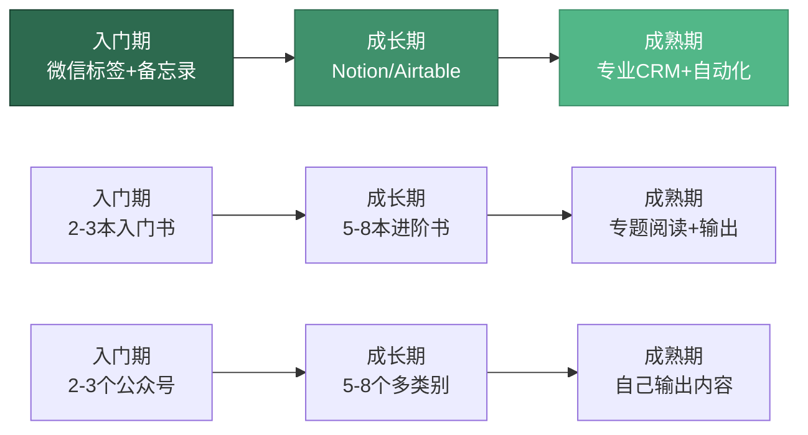

## 本节小结

产品推荐部分从书籍、工具、信息源、线下活动、在线课程五个维度，系统梳理了人脉经营的外部资源体系。本节不是简单的"要点重复"，而是一次跨维度的整合复盘——将前六节散布的知识点串联成一张可执行的资源地图，帮助你回答三个核心问题：**我现在最需要什么资源？这些资源之间如何配合使用？如何避免在资源选择上浪费时间？**

***

### 一、全节知识体系回顾

产品推荐（器）在人脉经营的"道→法→术→器→践"体系中扮演**加速器**角色——理论给你方向，方案给你路径，而产品和工具让你跑得更快、走得更稳。以下是六节内容的核心定位：

| 节次 | 内容 | 核心定位 | 解决的问题 |
|------|------|----------|-----------|
| 一、推荐书籍 | 16本书，按入门→进阶→深度→专题四层分级 | 认知基建 | 如何建立人脉经营的完整知识框架？ |
| 二、实用工具 | 管理、沟通、名片、学习、社交五大类工具 | 效率引擎 | 如何用最少精力维持最大密度的关系网络？ |
| 三、公众号/博主 | 六大类别，核心+扩展推荐，含评估框架 | 信息输入 | 如何持续获取高质量的社交认知和谈资？ |
| 四、线下活动 | 10种活动类型，含选型框架和ROI评估 | 信任建立 | 在哪些场景中能高效建立深度信任？ |
| 五、在线课程 | 心理学、沟通、人脉三大方向 | 系统提升 | 如何通过结构化学习补齐能力短板？ |
| 六、选择建议 | 按阶段、目标、时间三维匹配 | 决策辅助 | 面对海量资源，如何做出最适合自己的选择？ |

上图揭示了一个关键洞察：**五类资源不是独立并列的选项，而是一个相互咬合的系统**。书籍提供认知框架，工具将认知落地为可追踪的行为，信息源持续为你的社交"弹药库"补给，线下场景将线上积累的信任变现为真实关系，在线课程则帮你系统补齐能力短板。单独使用任何一类资源，效果都会大打折扣。

***

### 二、五类资源的协同模型

理解五类资源各自的角色之后，更重要的是理解它们如何协同运作。以下模型展示了从"认知输入"到"关系产出"的完整链路：

**协同运作的实际场景举例：**

假设你是一名刚转入AI行业的技术管理者，需要在3个月内建立行业人脉。以下是五类资源的协同使用方式：

**第1-2周（认知奠基期）：**
- 书籍：精读《别独自用餐》建立系统化人脉经营认知，同时翻阅《影响力》理解社交心理学基础
- 信息源：关注36氪、虎嗅获取行业动态，关注刘润公众号建立商业分析框架
- 工具：用Notion搭建人脉管理数据库，设置基本字段和视图

**第3-4周（信息储备期）：**
- 信息源：每天花20分钟阅读AI领域资讯，提炼3个社交场合可用的观点
- 课程：在得到App学习一门与AI行业相关的课程，补齐行业认知短板
- 工具：用CamCard整理过往收到的名片，同步到Notion数据库

**第5-8周（实战出击期）：**
- 线下活动：参加2-3场AI行业沙龙，每次带着"至少深度交流3人"的目标
- 工具：活动后24小时内用Notion记录新认识的人，设置跟进提醒
- 信息源：持续阅读，确保每次社交都有新鲜的"社交货币"可分享

**第9-12周（系统运转期）：**
- 工具：根据Notion中的维护提醒，系统化地跟进已建立的关系
- 线下活动：从参与者升级为组织者，发起一次小型行业交流会
- 书籍：根据实践中遇到的问题，针对性阅读《情商》或《非暴力沟通》

这个例子说明：**资源的价值不在于拥有，而在于组合使用**。单独读10本书不如"读2本+用1个工具+参加3次活动"的效果好。

***

### 三、跨维度对比：同一目标的不同资源路径

人脉经营中的每个核心目标，都可以通过多种资源路径达成。理解这些路径的优劣，能帮你做出更高效的资源选择：

#### 3.1 提升社交认知

| 资源路径 | 投入时间 | 深度 | 实操性 | 适合阶段 | 具体推荐 |
|---------|---------|------|--------|---------|---------|
| 读书 | 2-4周/本 | ★★★★★ | ★★★☆ | 任何阶段 | 《人性的弱点》《影响力》《给予》 |
| 公众号/博主 | 15-30分钟/天 | ★★★☆ | ★★★★ | 日常积累 | 武志红、KnowYourself、刘润 |
| 在线课程 | 2-4小时/周 | ★★★★ | ★★★☆ | 系统学习 | Coursera社会心理学、得到App |
| 线下沙龙 | 2-3小时/次 | ★★★★ | ★★★★★ | 实践检验 | 行业交流会、读书会 |

**选择策略：** 入门阶段以读书为主（建立框架），日常以公众号为辅（持续补给），遇到具体短板时用课程针对性提升，在沙龙中检验和修正认知。

#### 3.2 建立深度信任

| 资源路径 | 信任建立速度 | 信任深度 | 效率 | 门槛 | 具体推荐 |
|---------|-------------|---------|------|------|---------|
| 线下行业会议 | 中 | 浅-中 | 中 | 低 | QCon、创业邦峰会 |
| 线下沙龙/读书会 | 快 | 深 | 高 | 低 | 垂直社群沙龙、自建读书会 |
| 运动俱乐部 | 慢 | 极深 | 中 | 低-中 | 跑团、羽毛球队、登山群 |
| Toastmasters | 中 | 深 | 高 | 低 | 本地头马俱乐部 |
| BNI/商会 | 慢 | 深 | 中 | 中-高 | 本地BNI分会、行业协会 |
| 志愿者活动 | 中 | 深 | 低 | 低 | 专业技能公益、社区服务 |

**选择策略：** 根据你的性格和时间选择。内向者适合沙龙和读书会（小规模、有主题），外向者适合行业会议和BNI（大规模、高曝光）。无论选择哪种，核心原则不变——**深度参与1-2种 > 浅尝辄止5-6种**。

#### 3.3 维护现有人脉

| 资源路径 | 适合关系类型 | 频率 | 成本 | 效果 |
|---------|------------|------|------|------|
| 微信一对一聊天 | 核心层、同情层 | 每周-每月 | 低 | 中 |
| 朋友圈互动 | 所有层级 | 每天 | 极低 | 低-中 |
| 知识星球/社群 | 同好层 | 每周 | 低 | 中 |
| 线下约饭/咖啡 | 核心层、同情层 | 每月 | 中 | 高 |
| 转发有价值的文章 | 所有层级 | 随时 | 极低 | 中 |
| Notion/Airtable提醒 | 系统化管理 | 按设定 | 低 | 高（系统性） |

**选择策略：** 工具负责"不忘记"，沟通工具负责"执行"，线下场景负责"加深"。三者缺一不可——只有工具提醒但不执行等于零，只有执行但没有系统管理容易遗漏。

***

### 四、常见资源选择误区

在海量的人脉经营资源面前，很多人会犯以下错误。这些误区不仅浪费时间，还可能让你偏离正确的人脉经营方向：

#### 误区一：贪多求全，什么都要

**典型表现：** 同时关注30个公众号、下载10个App、报名5门课程、加入3个社群，结果每个都浅尝辄止，什么都没学透。

**深层原因：** 对"资源=能力"的误解。拥有资源不等于拥有能力，只有深度使用才能转化为能力。

**纠正方法：** 遵循"2-3法则"——同时深入使用的书籍不超过3本，核心工具不超过2个，重点关注的公众号不超过8个。宁可把少量资源用透，也不要大量资源浅尝。

#### 误区二：只读书不实践

**典型表现：** 读完了《人性的弱点》《影响力》《给予》等经典书籍，笔记做了一大堆，但社交行为没有任何改变。

**深层原因：** 把"阅读"等同于"学习"，把"知道"等同于"会做"。知识如果没有经过实践的转化，就只是存储在大脑中的信息，而非能力。

**纠正方法：** 每读完一章，立刻选择1-2个原则在本周内实践。准备一个"社交实验笔记本"，记录：做了什么、效果如何、下次如何改进。一个月后回顾，你会发现自己真正内化的知识比泛读10本书多得多。

#### 误区三：迷信工具，忽视行动

**典型表现：** 花大量时间搭建精美的Notion人脉管理系统，设计了复杂的字段、视图和自动化规则，但实际录入的联系人不超过20个，系统大部分时间处于闲置状态。

**深层原因：** 用"搭建系统"的快感替代了"实际社交"的不适感。搭建系统是舒适区内的行为，而主动联系陌生人、参加活动、维护关系才是真正的挑战。

**纠正方法：** 工具应该服务于行动，而不是替代行动。先从最简单的工具开始（微信标签+备忘录），在行动中逐步发现需求，再升级工具。记住：一个被频繁使用的简单系统，远胜于一个设计精美但闲置的复杂系统。

#### 误区四：只输入不输出

**典型表现：** 每天阅读大量公众号文章、听播客、看视频，但从不在社交场合分享这些内容，也不在朋友圈输出自己的观点。

**深层原因：** 输入是被动的、舒适的；输出是主动的、需要勇气的。很多人害怕"说错"或"被认为炫耀"，所以选择只听不说。

**纠正方法：** 输出是社交货币的铸造过程。你分享的每一条有价值的信息、每一个独到的见解，都在为你积累"社交货币"。从小处开始：每周在朋友圈分享1篇带个人评论的文章，每月在社群中做1次主题分享。

#### 误区五：忽视线下活动的价值

**典型表现：** 认为线上社交已经足够，不需要花时间参加线下活动。或者参加了线下活动，但全程坐在角落听演讲，不做任何社交。

**深层原因：** 低估了面对面交流的信任建立效率。神经科学研究表明，面对面交流时大脑会同步释放催产素（信任激素），这种化学反应是视频通话和文字聊天无法替代的。一次1小时的面对面深度交流，信任建立效果约等于3个月的线上互动。

**纠正方法：** 每月至少参加1-2次线下活动。如果社交焦虑较重，从小型活动开始（8-15人的沙龙比500人的大会更容易突破），提前准备话题和自我介绍，给自己设定"至少和3个人交流"的具体目标。

#### 误区六：选择资源时从众而非从需

**典型表现：** 别人推荐什么就用什么，看到某个公众号很火就关注，看到某个工具很酷就下载，但从不问自己"我现在最需要什么"。

**深层原因：** 缺乏自我评估和目标设定。不知道自己的人脉经营处于什么阶段，不知道自己最需要补齐哪方面的能力，所以只能跟着别人的选择走。

**纠正方法：** 在选择任何资源之前，先完成两个评估：（1）我当前的人脉经营处于哪个阶段？（入门/成长/成熟）（2）我当前最大的短板是什么？（认知不足/工具缺失/实践不够/信息匮乏）然后根据评估结果，有针对性地选择资源。

***

### 五、资源使用的阶段性策略

人脉经营的不同阶段，需要不同的资源配置。以下是经过整合的阶段性策略建议，将书籍、工具、信息源、活动、课程五类资源统一纳入规划：

#### 5.1 入门期（第1-3个月）：建立认知 + 走出第一步

**核心目标：** 建立正确的人脉认知框架，完成第一次主动社交行动。

| 资源类型 | 推荐配置 | 投入时间 | 具体行动 |
|---------|---------|---------|---------|
| 书籍 | 《人性的弱点》+《别独自用餐》 | 每天30分钟 | 每读完一章，选1个原则本周实践 |
| 工具 | 微信标签 + 手机备忘录 | 一次性设置 | 给微信联系人分层打标签 |
| 信息源 | 2-3个核心公众号 | 每天15分钟 | 每周选1篇文章提炼观点用于社交 |
| 活动 | 行业沙龙、读书会 | 每月1-2次 | 每次至少深度交流2人 |
| 课程 | 暂不需要 | — | 优先通过书籍和实践学习 |

**阶段检验标准：** 能用社会资本理论和弱关系理论解释人脉经营的基本逻辑；微信联系人已完成分层标签；至少参加了2次线下活动并完成了会后跟进。

#### 5.2 成长期（第4-8个月）：深化实践 + 构建系统

**核心目标：** 形成自己的社交风格，建立系统化的人脉管理机制。

| 资源类型 | 推荐配置 | 投入时间 | 具体行动 |
|---------|---------|---------|---------|
| 书籍 | 《影响力》+《给予》+《情商》 | 每天20分钟 | 深化心理学认知，学习情绪管理 |
| 工具 | Notion/Airtable人脉数据库 | 每周30分钟维护 | 建立联系人档案，设置维护提醒 |
| 信息源 | 扩展到5-8个，涵盖心理学+商业 | 每天20-30分钟 | 开始在社交场合输出观点 |
| 活动 | Toastmasters/BNI + 行业会议 | 每月2-4次 | 从参与者向组织者过渡 |
| 课程 | 1门沟通/情商相关课程 | 每周1-2小时 | 针对性补齐能力短板 |

**阶段检验标准：** 能根据不同场景灵活调整社交策略；人脉管理数据库稳定运行3个月以上；至少成功完成3次人脉引荐。

#### 5.3 成熟期（第9个月以后）：输出价值 + 成为枢纽

**核心目标：** 从信息的消费者变为生产者，从社交网络的节点变为枢纽。

| 资源类型 | 推荐配置 | 投入时间 | 具体行动 |
|---------|---------|---------|---------|
| 书籍 | 《社会网络分析》+ 专题阅读 | 按需 | 从学术角度深化理解，或针对特定场景深入 |
| 工具 | CRM + 自动化流程 | 系统化运行 | 人脉管理进入自动化阶段，定期复盘优化 |
| 信息源 | 高级阶段配置，开始自己输出 | 30分钟输入+30分钟输出 | 创建自己的内容渠道或社群 |
| 活动 | 组织自己的活动/社群 | 按计划 | 成为活动组织者，占据网络中心位置 |
| 课程 | 跨领域学习 | 按兴趣 | 拓宽知识面，积累跨界社交货币 |

**阶段检验标准：** 被多个圈子认可为"有价值的人"；有人主动找你做引荐或合作；你组织的活动能吸引人自发参加。

***

### 六、资源投入的时间预算管理

人脉经营是长期投资，不可能一次性投入大量时间然后"等着回报"。合理的时间预算是可持续经营的关键。以下是三种时间预算方案，你可以根据自己的实际情况选择或调整：

#### 方案一：轻量级（每天30分钟）

适合工作繁忙、人脉经营刚刚起步的人。

| 时间段 | 投入 | 具体内容 |
|--------|------|---------|
| 早晨通勤 | 10分钟 | 听音频内容（得到/播客），积累社交谈资 |
| 午休时间 | 5分钟 | 浏览朋友圈，对重要联系人的动态互动 |
| 晚间 | 15分钟 | 阅读10页书籍 + 处理1-2条人脉维护消息 |
| 周末（选做） | 1小时 | 参加1次线上社群讨论或整理人脉档案 |

**月度活动：** 参加1次线下活动（2-3小时）

#### 方案二：标准级（每天60分钟）

适合有一定人脉经营基础、希望系统化提升的人。

| 时间段 | 投入 | 具体内容 |
|--------|------|---------|
| 早晨通勤 | 15分钟 | 听音频课程或播客 |
| 午休时间 | 10分钟 | 阅读公众号文章 + 朋友圈互动 |
| 晚间 | 30分钟 | 阅读书籍20分钟 + 人脉维护10分钟 |
| 周末 | 2小时 | 参加社群活动或整理人脉系统 |

**月度活动：** 参加2-3次线下活动 + 1次人脉网络复盘

#### 方案三：深耕级（每天90分钟+）

适合人脉经营是核心竞争力、或正处于快速拓展期的人。

| 时间段 | 投入 | 具体内容 |
|--------|------|---------|
| 早晨 | 20分钟 | 系统阅读（书籍/课程） |
| 午休 | 15分钟 | 行业资讯 + 社交互动 |
| 晚间 | 40分钟 | 深度阅读25分钟 + 人脉维护和跟进15分钟 |
| 周末 | 4小时+ | 线下活动 + 人脉复盘 + 内容输出 |

**月度活动：** 参加3-4次线下活动 + 组织1次自己的小型活动

**关键原则：** 无论选择哪种方案，**持续性远比单次投入量重要**。每天30分钟坚持一年的效果，远好于每天3小时坚持两周然后放弃。选择一个你能长期维持的节奏，然后严格执行。

***

### 七、产品和工具的迭代升级路径

随着人脉经营阶段的变化，你需要的工具和产品也会变化。以下是典型的升级路径：

**升级的触发信号：**

| 当前工具 | 升级信号 | 升级目标 |
|---------|---------|---------|
| 微信标签 | 联系人超过200人，难以系统管理 | Notion/Airtable |
| Notion/Airtable | 需要多人协作或自动化提醒 | 专业CRM（HubSpot等） |
| 手机通讯录 | 名片积累超过50张 | CamCard + CRM同步 |
| 免费音频 | 需要系统化学习某个领域 | 得到App付费课程 |
| 参加活动 | 每月参加3次以上且有组织能力 | 自己发起和组织活动 |

**关键提醒：** 工具升级应该由需求驱动，而不是由"别人在用"驱动。如果你用Excel管理100个联系人绰绰有余，就不需要上Salesforce。工具的价值在于解决你实际遇到的问题，而不是制造"我应该用更高级的工具"的焦虑。

***

### 八、核心行动清单

将本节的核心建议转化为可立即执行的行动：

**今天就能完成的（30分钟内）：**

- [ ] 自我评估：我当前处于人脉经营的哪个阶段？最大的短板是什么？
- [ ] 资源审计：我目前在用的书籍/工具/信息源有哪些？哪些在真正发挥作用，哪些只是"占着位置"？
- [ ] 清理行动：取关3个月没阅读的公众号，卸载2个月没打开的App

**本周内完成的：**

- [ ] 根据阶段选择1-2本书籍，制定阅读计划
- [ ] 选择1个管理工具（微信标签/Notion/Airtable），完成基础设置
- [ ] 选择1个线下活动，完成报名

**本月内完成的：**

- [ ] 完成一本书的精读，并在社交中实践至少3个原则
- [ ] 人脉管理工具稳定运行，完成至少30个联系人的录入
- [ ] 参加至少2次线下活动，完成会后跟进
- [ ] 月底复盘：哪些资源投入产出了实际效果？哪些需要调整？

***

### 九、写在最后

产品和工具只是手段，关键在于持续的实践和投入。在人脉经营中，最容易犯的错误不是"选错了工具"，而是"花了太多时间选工具而没有去社交"。

四个核心原则，贯穿你整个人脉经营旅程：

1. **先行动，后优化**：不要等到"找到完美工具"才开始行动。用微信标签+备忘录就可以开始，在行动中发现真实需求，再有针对性地升级工具
2. **少而精，深而透**：2本读透的书 > 20本翻过的书；3个深度维护的关系 > 300个点赞之交；1种坚持使用的工具 > 5个同时试用的App
3. **输入服务于输出**：你读的每一页书、听的每一节课、关注的每一篇文章，最终都应该转化为社交场合中的价值输出——一个独到的观点、一次精准的引荐、一段有深度的对话
4. **系统大于意志**：不要依赖"记住要联系谁"，而是建立系统（工具提醒+固定习惯+社交仪式），让关系维护变成自动运转的机制

记住，**最好的工具是你的真诚和行动力**。再好的书籍、再精致的管理系统、再优质的公众号，如果不付诸实践，都只是数字和纸面上的装饰品。从本节小结中选择一项行动，在今天就完成它——哪怕只是给一个久未联系的朋友发一条真诚的消息。

***
