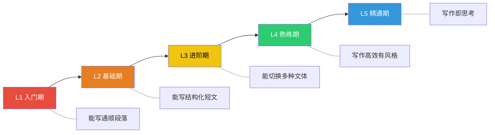
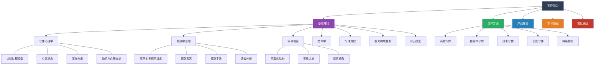

# 第二十二章 写作能力

## 章节概览

### 为什么写作能力如此重要？

在信息爆炸的时代，写作能力已经不再是作家和记者的专属技能，而是每一个现代人都需要掌握的核心能力。无论你是职场人士、创业者、技术人员还是自由职业者，优秀的写作能力都能为你带来巨大的竞争优势。

#### 写作是思考的外化

当你试图将模糊的想法转化为清晰的文字时，你的思维会变得更加严谨和系统。正如威廉·津瑟（William Zinsser）所说："写作是思考的纸上演练。"许多人发现，当他们开始写作时，原本以为已经想清楚的问题，实际上还有很多模糊和矛盾之处。写作迫使你理清思路，发现逻辑漏洞，深化对问题的理解。

这种"思考外化"的过程有坚实的神经科学基础。脑成像研究表明，写作时大脑的布洛卡区（语言产出）、韦尼克区（语言理解）、前额叶皮层（逻辑推理）和海马体（记忆提取）同时激活，形成一个高强度的认知协作网络。这意味着**写作不仅仅是"记录想法"，而是在写作过程中"生成想法"**——很多深刻的洞见，只有在你坐下来写的过程中才会浮现。

认知心理学家将这种现象称为"知识的诅咒"（Curse of Knowledge）的反面：当你口头表达时，很容易陷入"我以为我说清楚了"的错觉；但当你写下文字并反复阅读时，那些含混的逻辑、跳跃的推理、缺失的前提会暴露无遗。这就是为什么很多企业家和科学家坚持用写作来思考——埃隆·马斯克要求工程师用6页备忘录而非PPT汇报，就是因为写作迫使思考走向深入。

#### 写作是影响力的放大器

在这个内容为王的时代，能够用文字清晰、有力地表达观点的人，往往拥有更大的影响力。无论是撰写商业计划书、发布行业报告、还是在社交媒体上分享见解，写作能力都直接决定了你的观点能否被理解和接受。

写作的影响力有一个其他媒介难以比拟的优势：**可复制性和可传播性**。一次演讲最多影响在场的几百人，一篇优秀的文章可以触达数百万人。更重要的是，文字可以跨越时间和空间的限制——一篇写于十年前的文章，今天仍然可以被搜索、引用和传播。这就是为什么很多行业领袖依然坚持写博客、写书、写深度文章，因为文字是最高效的思想载体。

从数据上看，LinkedIn的调查显示，定期发布专业文章的职场人士获得的工作机会比不发布的同行高出5倍。内容营销协会的数据表明，B2B企业中，内容营销获客成本比传统营销低62%，而产生的潜在客户数量多3倍。这些数字背后的核心能力，就是写作。

#### 写作是职业发展的加速器

在职场中，能够写出清晰的邮件、有说服力的报告、专业的方案文档的人，往往更容易获得晋升和认可。相反，写作能力不足可能会成为职业发展的瓶颈——即使你有很好的想法，如果无法有效地用文字表达出来，你的价值就会大打折扣。

职场写作能力的影响体现在多个层面：

- **日常沟通层**：一封结构清晰、重点突出的邮件，比一封杂乱无章的邮件节省收件人50%以上的阅读时间。在高频沟通的环境中，这种效率差异会不断累积。
- **项目协作层**：一份好的技术方案文档、项目周报或会议纪要，能显著减少沟通误解和返工成本。亚马逊要求所有重要决策以6页叙事备忘录的形式提出，正是因为这种格式迫使写作者想清楚每个细节。
- **职业展示层**：年终述职报告、晋升答辩材料、个人简历——这些关键文档的质量直接决定了你的职业上升通道。很多人能力很强，但在述职时无法有条理地呈现自己的成果，导致晋升被延迟。
- **行业影响层**：通过撰写行业分析、技术博客、思想领导力文章，你可以从"一个有能力的执行者"跃升为"行业意见领袖"，这种转变带来的职业回报是指数级的。

#### 写作是知识管理的工具

通过写作，你可以将零散的知识和经验系统化，形成自己的知识体系。博客、笔记、文档等写作形式，都是知识管理的重要工具。

知识管理领域有一个经典公式：**知识 = 信息 + 经验 + 反思**。写作恰恰是将这三者融合的最佳实践。当你把一个技术方案的实现过程写成博客时，你不只是在记录步骤——你被迫整理信息的逻辑顺序（结构化），融入你踩过的坑和解决方案（经验），并反思为什么这样做而不是那样做（反思）。

物理学家理查德·费曼（Richard Feynman）有一句名言："如果你不能用简单的语言向别人解释清楚，说明你自己还没有真正理解。"费曼学习法的核心就是"用写作来检验理解"——通过写出通俗易懂的解释，你可以快速发现自己知识体系中的盲点。

在个人知识管理（PKM）领域，写作还具有"知识复利"效应。今天写的一篇技术笔记，可能在半年后成为解决另一个问题的关键参考。随着时间的推移，你的个人知识库会越来越厚实，检索和复用的效率也会越来越高。

#### 写作是终身受益的技能

与某些可能会被技术替代的技能不同，写作能力是一种"元能力"，它能够增强你几乎所有的其他能力。而且，写作能力一旦建立，就会随着时间的推移不断增值。

在AI时代，写作能力的价值不降反升。大语言模型可以辅助生成初稿，但**判断力、品味、深度思考和独特视角**——这些高质量写作的核心要素——仍然牢牢掌握在人类手中。能够熟练使用AI工具并具备优秀写作能力的人，其生产力是只具备其中一项的人的数倍。写作能力决定了你是否能给AI下好的指令（提示工程本身就是一种写作能力）、是否能判断AI输出的质量、是否能在AI生成的内容基础上进行高质量的修改和提升。

### 写作能力自测：你在哪个阶段？

在开始系统学习之前，了解自己当前的写作水平至关重要。以下是一个简化的自测框架，帮助你定位自己的起点：

| 层级 | 阶段名称 | 典型特征 | 代表能力 |
|------|----------|----------|----------|
| L1 | 入门期 | 能写出语句通顺的段落，但结构松散、逻辑不清 | 基本语法正确，能表达简单观点 |
| L2 | 基础期 | 能写出结构完整的短文，有基本的论点和论据 | 掌握总分总结构，能写合格的工作邮件 |
| L3 | 进阶期 | 能针对不同场景调整写作风格和结构 | 商务写作/技术文档/自媒体各有章法 |
| L4 | 熟练期 | 写作流畅高效，能驾驭复杂主题和长篇内容 | 有个人风格，能写深度分析文章 |
| L5 | 精通期 | 写作成为思维的自然延伸，作品有感染力和影响力 | 形成独特写作风格，能影响行业话语 |

**快速自测方法**：尝试用30分钟写一篇800字的文章，主题为"为什么我推荐某个工具/方法"。写完后自评：

- L1：写完了但不知道自己在说什么 → 从基础理论开始
- L2：有观点但论证单薄，结构可以更清晰 → 重点学习结构化写作
- L3：结构合理但语言平淡，缺乏感染力 → 学习修辞和叙事技巧
- L4：各方面都不错但效率不够高 → 优化写作流程和工具
- L5：已经很好了 → 直接进入创意写作和风格打磨

### 不同职业的写作能力需求矩阵

不同职业对写作能力的需求维度和优先级有显著差异。下表帮助你快速识别自己最需要提升的方向：

| 职业类型 | 最高频文体 | 核心能力要求 | 常见痛点 | 本章重点章节 |
|----------|------------|-------------|----------|-------------|
| 产品经理 | PRD文档、需求分析 | 结构化表达、逻辑严密 | 需求描述模糊、边界不清 | 基础理论→技术写作 |
| 软件工程师 | 技术文档、代码注释、设计文档 | 精确性、简洁性 | 文档不写或写得没人看 | 技术写作 |
| 市场/运营 | 文案、推文、活动方案 | 吸引力、传播力 | 内容同质化、缺乏记忆点 | 自媒体写作 |
| 管理者 | 邮件、报告、战略文档 | 清晰决策、推动行动 | 沟通效率低、会议纪要乱 | 商务写作 |
| 自由职业者 | 作品集文案、提案、内容 | 个人品牌、说服力 | 报价提案缺乏说服力 | 商务写作→自媒体写作 |
| 研究/学术 | 论文、研究报告 | 严谨论证、规范引用 | 语言不够学术/过于晦涩 | 基础理论→技术写作 |
| 创业者 | 商业计划书、融资PPT文案 | 故事性、可信度 | BP写得像说明书 | 叙事理论→商务写作 |

### 写作能力的知识地图

本章涵盖的完整知识体系可以用以下结构来理解：

这张知识地图揭示了写作能力培养的三个关键路径：

1. **理论→实践路径**：先理解写作心理学和认知科学（为什么我们会卡壳、如何进入心流），再学习具体的文体写作方法。理论不是空中楼阁，它直接指导你"怎么写"和"为什么写不好"。
2. **通用→专用路径**：修辞学和叙事理论是所有文体的通用基础，商务写作、技术写作、自媒体写作等是特定场景的应用。打好通用基础后，切换文体只需要学习场景差异。
3. **单点→系统路径**：单篇文章的质量取决于结构、语言、论证等多个要素的协同。冰山模型揭示了表面文字之下，支撑写作能力的深层素养。

### 本章的核心框架

本章将从理论基础、实践方案、工具推荐、学习路径和常见误区五个维度，系统地阐述写作能力的培养方法：

#### 一、基础理论部分

深入探讨写作的核心原理，共7个小节：

- **写作心理学**（第一节）：理解写作的本质、Hayes-Flower认知过程模型、心流状态的进入条件、写作焦虑的成因与应对策略、内在动机的培养方法、自我效能感的建立。这一节解决"为什么我写不出来"的根本问题。
- **修辞学基础**（第二节）：亚里士多德的三诉求（逻辑/情感/人格）、古典修辞五艺（发明/安排/风格/记忆/表达）、12种常用修辞手法的详解与应用、基于读者分析的修辞策略选择。这一节解决"怎么写才有说服力"的问题。
- **叙事理论**（第三节）：叙事的认知功能与社会功能、三幕式结构、英雄之旅12阶段、弗莱塔格金字塔、叙事视角（第一人称/第三人称有限/全知/第二人称）、叙事时间处理（顺序/倒叙/插叙/预叙）、不可靠叙述者。这一节解决"怎么讲故事才吸引人"的问题。
- **文体学**（第四节）：四大文体分类（叙述/描写/说明/议论）、正式度光谱、语域理论、文体选择与匹配原则。这一节解决"不同场合用什么风格"的问题。
- **写作流程**（第五节）：从选题到发布的完整流程——选题→调研→大纲→初稿→修改→定稿→排版→发布，每个环节的具体操作方法和检查清单。这一节解决"具体怎么写一篇文章"的问题。
- **写作能力的构成要素**（第六节）：词汇量、语法、结构、逻辑、修辞、风格六个维度的详解与提升方法。这一节解决"写作能力到底由什么组成"的问题。
- **写作的冰山模型**（第七节）：水面之上是文字技巧，水面之下是知识储备、思维能力、审美品味、人生阅历。这一节揭示"为什么读了很多写作书还是写不好"的深层原因。

#### 二、具体方案部分

针对四种常见写作场景和一个通用提升方法，提供详细的实操指南：

- **商务写作**（第一节）：邮件写作的7个原则、报告结构模板、方案文档框架、提案写作的说服逻辑、会议纪要的标准化格式、商务写作的30个高频错误及纠正。
- **自媒体写作**（第二节）：选题的5种方法论、标题的10种公式、开头的6种钩子、正文的结构化写法、结尾的4种升华方式、公众号/知乎/小红书/短视频脚本的平台差异化策略、内容日历的规划方法。
- **技术写作**（第三节）：技术文档的受众分析、API文档的规范写法（OpenAPI/Swagger）、README的黄金结构、教程文档的分层策略、文档即代码（Docs as Code）工作流、文档的可维护性设计。
- **创意写作**（第四节）：短篇小说的结构技巧、散文的意境营造、诗歌的节奏与意象、创意写作的10种练习方法、如何建立个人写作风格。
- **写作能力的持续提升**（第五节）：精读与泛读的平衡策略、刻意练习的写作训练法、反馈系统的建立、写作习惯的养成（从200字/天到2000字/天的渐进计划）、写作素材库的搭建。

#### 三、产品推荐部分

精选经典书籍和实用工具，帮助高效学习和实践写作。包含四个子版块：必读书籍（从入门到高阶的分级推荐）、推荐工具（写作软件、语法检查、排版工具等）、推荐课程与社群（线上课程、线下工作坊、写作社群）、工具选择建议（根据需求场景匹配工具）。

#### 四、学习路径部分

规划从写作新手到写作高手的完整成长路线图，包含分阶段目标、时间投入建议、里程碑检查点，以及不同起点的差异化学习路径。

#### 五、常见误区部分

揭示写作中最常犯的错误，每个误区包含：错误表现、错误原因、正确做法、对比示例。帮助读者在提升过程中避免走弯路。

### 本章适合谁？

本章适合以下人群，不同人群可以有不同的阅读策略：

| 人群 | 核心需求 | 推荐阅读策略 |
|------|----------|-------------|
| **职场人士** | 提升邮件、报告、方案的写作质量 | 跳过创意写作，重点学商务写作+基础理论中的结构化方法 |
| **自媒体人** | 通过内容创作建立个人品牌，提升传播力 | 重点学自媒体写作+叙事理论+修辞手法 |
| **技术人员** | 写出清晰、规范、易维护的技术文档 | 重点学技术写作+写作流程中的"简洁性"原则 |
| **文学爱好者** | 提升创意写作能力，找到个人风格 | 重点学创意写作+叙事理论+文体学 |
| **学习者** | 通过写作整理思路、管理知识 | 重点学写作心理学+写作流程+持续提升方法 |
| **"有想法写不出来"的人** | 突破写作瓶颈，将想法转化为文字 | 从写作心理学开始，解决焦虑和卡壳问题，再学具体方法 |
| **管理者** | 提高团队沟通效率，写出有推动力的文档 | 重点学商务写作+修辞学中的说服策略 |
| **创业者** | 写出打动投资人的BP、吸引客户的内容 | 重点学叙事理论+商务写作+自媒体写作 |

### 阅读建议

建议按顺序阅读本章内容。先理解基础理论，建立对写作的科学认知；再学习具体方案，针对自己的需求重点学习相关部分；然后参考产品推荐选择合适的学习资源；最后通过常见误区部分进行自我检查。

**时间规划建议**：

- **快速浏览**（2小时）：只读章节概览、每个小节的开头和总结，建立整体认知
- **重点学习**（1-2天）：选择与自己最相关的2-3个小节深入学习，完成其中的练习
- **系统精读**（1周）：按顺序通读全章，完成所有练习，建立完整的写作知识体系
- **持续实践**（长期）：按照学习路径制定每日写作计划，结合实际工作场景反复练习

**阅读过程中的三个关键提醒**：

1. **边读边写**。写作能力只能通过写来提升，光读不写等于没读。每读完一个小节，立即找一个场景去练习。
2. **从自己的痛点出发**。不需要按顺序逐字阅读，先找到最困扰你的问题（"我写邮件总被误解""我的文章没人看""我一写东西就焦虑"），直接跳到对应的章节。
3. **建立自己的写作检查清单**。读完每个章节后，把关键要点整理成一份个人检查清单，在每次写作时对照使用。清单比知识更有用，因为它直接指导行动。

写作能力的提升没有捷径，唯一的秘诀就是"多读、多写、多改"。但掌握了正确的方法，可以让你的提升之路更加高效。接下来，让我们从写作心理学开始，深入理解写作的本质，为后续的实践打下坚实的基础。
