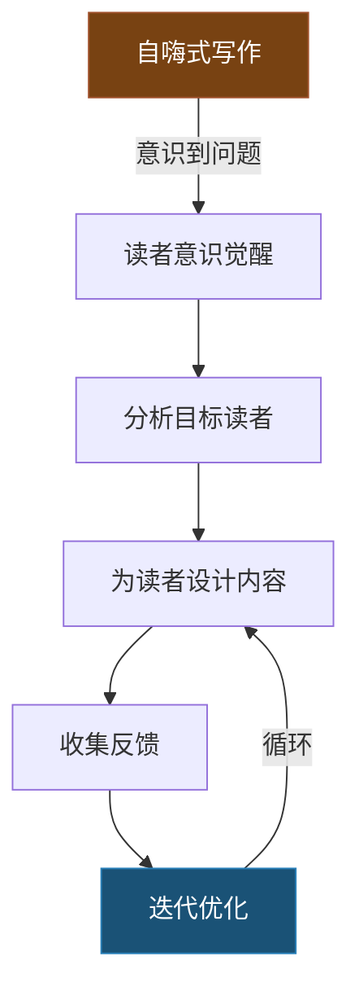
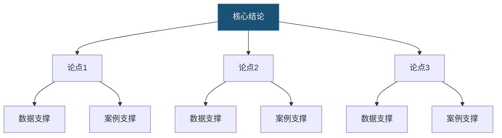
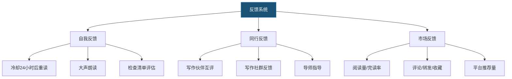
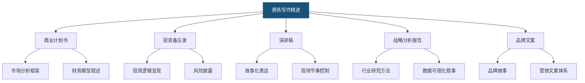
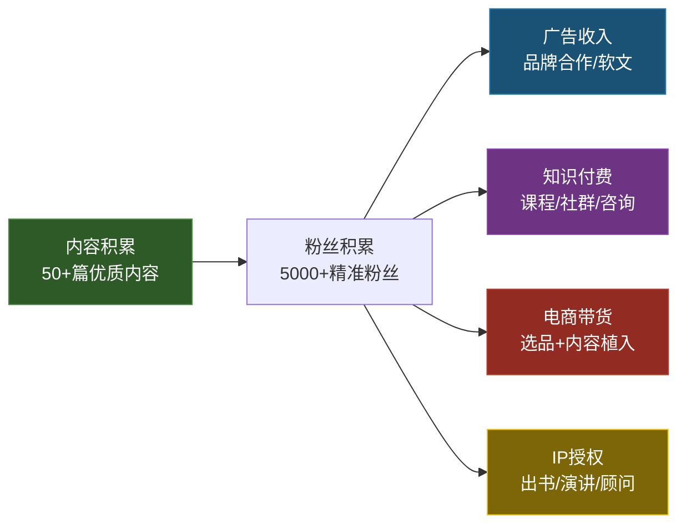
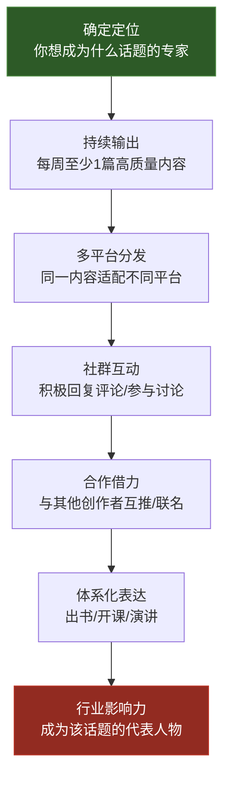

# 写作能力：学习路径

## 一、为什么需要一条结构化的学习路径

很多写作者长期困在"写了但没进步"的状态——每天写日记、断断续续写博客，三年过去写作水平和半年前相差无几。问题不在于不够努力，而在于缺乏结构化的训练体系。

**学习路径的核心价值**在于三点：

1. **明确当前所处的位置**——知道自己是"基础入门"还是"技能提升"，避免盲目练习
2. **知道下一步该学什么**——每个阶段有清晰的目标和任务，不会迷失在海量写作教程中
3. **建立可衡量的进步标准**——用具体产出（字数、篇数、反馈指标）而非模糊感觉来判断自己是否在进步


### 学习路径总览

| 阶段 | 时间 | 核心目标 | 关键产出 | 每日投入 | 验收标准 |
|------|------|---------|---------|---------|---------|
| 基础入门期 | 第1-3个月 | 建立习惯，克服恐惧 | 30+篇练习文，掌握基本结构 | 30-60分钟 | 能写出1000字结构化文章 |
| 技能提升期 | 第4-9个月 | 掌握多类型写作，获取反馈 | 商务/自媒体/创意写作各5+篇 | 60-90分钟 | 能独立完成各类写作任务 |
| 专项精进期 | 第10-18个月 | 在一个方向达到专业水平 | 5-10篇高质量代表作品 | 90-120分钟 | 获得外部认可（阅读量/奖项/稿费） |
| 高阶创作期 | 第19-24个月 | 建立影响力，形成体系 | 完整长篇作品，个人品牌 | 120+分钟 | 行业影响力，写作变现 |

---

## 二、第一阶段：基础入门期（第1-3个月）

### 2.1 本阶段的核心目标

这个阶段要解决的不是"写得好不好"，而是"写不写得出来"和"能不能坚持写"。

**三个核心障碍及其破解方法：**

| 障碍 | 表现 | 破解策略 |
|------|------|---------|
| 空白页恐惧 | 面对光标不知道写什么，大脑一片空白 | 自由写作法：设定计时器，不停笔地写，不允许删除和修改 |
| 完美主义 | 每句话都要反复推敲，写了删删了写 | 先完成再完美：初稿阶段禁止回头看，一口气写完再修改 |
| 拖延症 | 总觉得"明天再写"，永远在等"灵感来了" | 习惯绑定：把写作绑定到一个固定行为之后（如早饭后立刻写） |

### 2.2 逐月训练计划

#### 第一个月：建立写作习惯

**每日任务清单：**

1. **晨间自由写作（15分钟）**——起床后第一件事，不设定主题，想到什么写什么。目标是让手和脑建立"坐下来就能写"的条件反射。前两周可能写出的全是废话，这完全正常。神经科学研究表明，重复的行为模式会在21-66天内形成自动化习惯（Phillippa Lally, 2009, 伦敦大学学院）。
2. **字数记录**——每天结束前记录今日总写作字数。不要评判好坏，只记录数字。这个简单的追踪动作本身就能形成正反馈循环。
3. **素材随手记**——白天遇到任何有趣的观察、对话、想法，立刻用手机记录。写作最大的敌人不是不会写，而是没有东西可写。

**推荐精读书目及阅读方法：**

| 书名 | 作者 | 阅读重点 | 阅读方法 |
|------|------|---------|---------|
| 《写作法宝：非虚构写作指南》 | 威廉·津瑟 | 第一部分"原则"——简洁、清晰、诚恳 | 读一章，用该章原则改写自己的一篇文章 |
| 《成为作家》 | 多萝西娅·布兰德 | 前5章——关于"作家气质"和写作习惯 | 标记触动你的句子，写200字感想 |
| 《写出我心》 | 娜塔莉·戈德堡 | 自由写作和禅修式写作的理念 | 边读边做书中的练习 |

**本月里程碑：**
- 第7天：能坐下来就写出200字，不感到恐惧
- 第14天：自由写作时偶尔出现"心流"状态，写到停不下来
- 第21天：写作习惯初步建立，不需要消耗太多意志力
- 第30天：累计写作1万字以上

#### 第二个月：学习基础结构

**核心知识点：四大基础文章结构**

**结构一：总-分-总**
开头：提出核心观点（1-2段）
主体：分论点1 + 论据/案例
     分论点2 + 论据/案例
     分论点3 + 论据/案例
结尾：总结升华（1-2段）
适用场景：议论文、观点文、说明文。这是最万能的结构，80%的非虚构写作都可以用这个框架打底。

**结构二：问题-分析-解决方案**
开头：描述一个具体问题/痛点
分析：为什么会出现这个问题（原因1、2、3）
方案：如何解决这个问题（具体步骤）
结尾：行动呼吁
适用场景：职场报告、自媒体干货文、提案。

**结构三：时间线/流程结构**
按时间顺序或操作步骤依次展开
步骤1 → 步骤2 → 步骤3 → 总结
适用场景：教程、操作指南、项目复盘。

**结构四：对比结构**
引入话题
A方案的优势和劣势
B方案的优势和劣势
结论/推荐
适用场景：产品对比、方案选择、观点辩论。

**每日练习设计：**

- 早晨：用15分钟写5个不同类型的标题（悬念型、数字型、疑问型、对比型、故事型）
- 中午：用10分钟给同一个主题写3种不同的开头（提问式、故事式、数据式）
- 晚上：用30分钟写一篇800字的结构化文章，必须先列提纲再动笔

**提纲模板示例：**

```markdown
## 文章提纲

主题：为什么远程办公需要异步沟通

结构：问题-分析-解决方案

开头：[具体场景] 上午10点，你正在深度写代码，一条消息弹出来……
分析：
  - 即时通讯的隐性成本（上下文切换的代价：每次被打断需要23分钟恢复专注，UC Irvine研究）
  - 同步沟通的文化根源（工业时代的"在场=在工作"思维惯性）
  - 时区差异让同步沟通不可行（全球化团队的现实）
方案：
  - 核心工作时间段不打扰（设定"勿扰"时段）
  - 重要事项用文档而非消息（写清楚背景、目的、期望反馈时间）
  - 建立沟通协议（什么用消息、什么用文档、什么用会议）
结尾：从今天开始，试试把下一条长消息换成一份300字的文档
```

#### 第三个月：提升表达质量

**表达升级的四个维度：**

**维度一：词汇精准化**
不要写"这个东西很好"，要写"这个方案在成本控制上比现有方案节省30%"。词汇精准化的训练方法——每天找3个模糊词（如"好""多""快"），用具体数据或描述替换：

| 原始表达 | 精准表达 |
|---------|---------|
| 销量增长了很多 | 销量环比增长47% |
| 用户反馈很好 | 用户满意度评分从3.6提升到4.3（满分5） |
| 系统响应很快 | P99延迟从800ms降到120ms |

**维度二：句子简洁化**
威廉·津瑟在《写作法宝》中的核心原则——"删掉所有不必要的字"。

| 冗长表达 | 简洁表达 | 删减逻辑 |
|---------|---------|---------|
| 在目前的这个阶段 | 目前 | "在""的""这个"都是虚词 |
| 进行了一次全面的调查 | 调查了一遍 | "进行了""全面的"是废话修饰 |
| 基于以上原因，我认为 | 因此 | 无需铺垫，直接结论 |

**维度三：段落节奏化**
好文章的段落像音乐——长短交替，有急有缓。长段落（4-5句）用于深入分析，短段落（1-2句）用于强调和转折。

**练习方法**：找一篇你喜欢的文章，标记每个段落的句子数，观察作者如何控制节奏。然后模仿其节奏写一篇同主题的文章。

**维度四：细节具象化**
抽象的概念要用具体的画面来传达。

- 抽象："他很紧张" → 具象："他的手在桌下不停地搓着裤缝，额头的汗擦了又冒出来"
- 抽象："这个功能很实用" → 具象："上次我用这个功能，把3小时的整理工作压缩到了15分钟"

### 2.3 常见误区与纠正

**误区一："我需要先读完10本写作书再开始写"**
纠正：写作是技能，不是知识。读100本游泳教程不下水，永远不会游泳。正确的做法是读一章、练一周，边学边写。

**误区二："我写的太烂了，不配发出来"**
纠正：所有人的初稿都很烂。海明威说过"一切初稿都是狗屎"。初稿的意义不是"好"，而是"存在"。修改才是让文章变好的环节。

**误区三："每天必须写满1000字才有用"**
纠正：习惯的建立优先于数量。每天写100字坚持30天，远胜于一天写3000字然后停三周。起步阶段，300字/天就够了。

**误区四："自由写作没有意义，产出的都是垃圾"**
纠正：自由写作的价值不在于产出，而在于训练"不停笔"的能力。就像跑步训练不是为了跑到某个地方，而是为了锻炼心肺。

### 2.4 阶段验收清单

- [ ] 连续30天每天写作不断（允许少量中断，但不超过3天）
- [ ] 累计写作量达到1万字以上
- [ ] 能在30分钟内写出一篇800字的结构化文章
- [ ] 掌握4种基础文章结构，每种至少写过2篇
- [ ] 建立了自己的素材记录系统（手机笔记/备忘录/Notion等）
- [ ] 阅读了至少2本写作类书籍并做了笔记

---

## 三、第二阶段：技能提升期（第4-9个月）

### 3.1 本阶段的核心目标

基础入门期建立了"能写"的能力，这个阶段要解决"写得好"和"写得多样"的问题。你需要掌握至少三个不同场景的写作技能，并且开始通过外部反馈来校准自己的水平。

**从"自嗨式写作"到"读者导向写作"的转变：**



### 3.2 商务写作训练（第4-5个月）

商务写作的本质是**降低沟通成本**。一封好的商务邮件应该让收件人在30秒内知道三件事：你要什么、为什么、我该怎么做。

#### 商务邮件写作公式

主题行：[动作词] + 具体事项 + 时间节点
正文第一行：核心诉求（一句话说清楚目的）
正文中间：背景/原因（最多3句话）
正文结尾：明确的行动呼吁（谁、做什么、什么时候完成）

**实际案例对比：**

**差的邮件：**
主题：关于项目的事情

领导你好，我想跟你汇报一下最近项目的情况，
目前遇到了一些问题，想跟你讨论一下，看什么时候方便？

**好的邮件：**
主题：[需要决策] 用户系统迁移方案选择——本周五前回复

张总，

用户系统需要在3月15日前完成迁移，现有两套方案：
- 方案A：自研，成本12万，周期6周，可控性强
- 方案B：采购第三方，成本8万，周期3周，但后续定制受限

建议选方案A。详细对比见附件。

请周五前确认方案，以便下周启动开发。

李明

**练习任务：**
1. 从自己最近的工作邮件中选5封，用上面的公式重写
2. 每周练习写一种商务文档：周报、会议纪要、项目提案、需求文档、复盘报告
3. 请同事或领导给出反馈，重点问"看完知道该做什么了吗"

#### 报告和提案写作

**金字塔原理在商务写作中的应用：**

金字塔原理（Barbara Minto）的核心思想——**结论先行，自上而下展开**。



**报告结构模板：**
1. 执行摘要（1页，写给只看结论的人）
   - 核心发现/建议
   - 关键数据
   - 行动建议

2. 正文
   - 背景与目标
   - 分析过程与发现
   - 方案对比
   - 推荐方案与理由

3. 附录（详细数据、补充材料）

### 3.3 自媒体写作训练（第6-7个月）

自媒体写作和传统写作最大的区别——**前3秒决定生死**。读者在信息流中看到你的标题，平均只有1.5秒决定是否点击。

#### 标题写作的六种模型

| 模型 | 公式 | 示例 |
|------|------|------|
| 数字型 | N个方法/技巧/秘诀 | 7个让你早起不痛苦的方法 |
| 悬念型 | 设置信息缺口 | 那个从不加班的同事，到底做对了什么？ |
| 对比型 | A vs B / 前 vs 后 | 月薪3千和月薪3万的人，差的不只是钱 |
| 故事型 | 人物+冲突+转折 | 我辞职创业3个月，差点把房子卖了 |
| 痛点型 | 直击读者焦虑 | 30岁还没找到方向，你可能缺的不是努力 |
| 权威型 | 背书+结论 | 斯坦福研究发现：高效能人士都有这个习惯 |

**练习方法**：每天选一个主题，用6种模型各写一个标题，然后评估哪个最吸引自己点击。

#### 开头的"钩子"技术

自媒体文章的开头只有两个任务——**让读者继续读第二段**。

**四种高效开头模板：**

**模板一：痛点共鸣法**
> 你有没有过这样的经历——花了两个小时写一篇文章，发出去阅读量只有个位数？不是你的内容不好，而是开头就劝退了读者。

**模板二：颠覆认知法**
> 很多人以为写作靠天赋。但神经科学研究表明，写作能力跟智商的相关性只有0.3，跟练习时长的相关性高达0.75。换句话说，写作是一项可以后天训练的技能。

**模板三：故事悬念法**
> 2019年，一个在工厂流水线上班的年轻人，开始在手机上写短篇小说。两年后，他的作品被改编成电影，版税收入超过800万。他的名字叫……

**模板四：场景代入法**
> 周一早上8:55，你冲进办公室，打开邮箱，看到47封未读邮件。你的第一反应是什么？如果有一封邮件的标题是"关于明天会议的紧急变更"，你会先点开它吗？

#### 不同平台的写作策略差异

| 平台 | 内容特点 | 最佳长度 | 标题风格 | 发布时间 |
|------|---------|---------|---------|---------|
| 微信公众号 | 深度长文，观点输出 | 2000-5000字 | 含蓄有深度 | 晚8-10点 |
| 知乎 | 专业回答，知识分享 | 1000-3000字 | 直接回答问题 | 工作日午间 |
| 小红书 | 图文笔记，生活方式 | 300-800字 | 口语化+emoji | 晚7-9点 |
| 今日头条 | 资讯+观点 | 1500-3000字 | 强吸引力 | 早7-9点 |
| 即刻 | 短观点+互动 | 100-300字 | 随性真实 | 全天 |

**实践任务：**
1. 选择1-2个平台开通账号
2. 每周发布2篇原创内容，持续8周
3. 每篇文章发布后记录数据：阅读量、点赞、评论、转发
4. 每两周做一次数据复盘，找出数据最好的文章的共同特征

### 3.4 创意写作入门（第8-9个月）

创意写作训练的是**画面感和情感共鸣**的能力——即使你将来不写小说，这两种能力也会让你的所有写作更具感染力。

#### 故事叙述的基本结构：三幕式


**示例——用三幕式讲一个真实故事：**

> **第一幕（建置）**：小王是一个在三线城市做会计的普通上班族，每天朝九晚五，生活平淡但安稳。
>
> **触发事件**：公司突然裁员，小王在名单上。
>
> **第二幕（对抗）**：小王投了50份简历，面试10次，全部被拒。他开始怀疑自己的能力，焦虑到失眠。在最低谷时，他想起自己大学时写过几篇阅读量不错的公众号文章。
>
> **最低谷**：他决定全职做自媒体，但连续3个月，每篇文章阅读量不超过200。
>
> **第三幕（解决）**：他调整策略，开始写自己最擅长的"用大白话讲财务知识"，一篇文章意外爆了，10万+阅读。6个月后，他的公众号粉丝超过10万，收入超过了之前的工资。

#### 人物塑造的三个层次

**层次一：外在特征**——外貌、穿着、习惯动作。这是最浅层但最直观的。
> "他总是穿着同一件洗得发白的格子衬衫，手指不停地敲桌面。"

**层次二：内在动机**——这个人想要什么、害怕什么、为什么这样行动。
> "他不停地敲桌面，因为他在等一个等了三年的电话——那个电话决定他能不能拿到博士学位。"

**层次三：矛盾与成长**——人物的内在冲突和变化轨迹。
> "他想要博士学位来证明自己配得上父亲的期望，但他内心真正热爱的是音乐。整篇故事就是他在这两者之间撕裂和选择的过程。"

**练习任务：**
1. 写3个1000字的短篇故事，每个至少有一个转折点
2. 用"外在特征+内在动机+矛盾"的三层次法塑造一个完整人物
3. 写一段500字的纯对话，不加任何描述，仅通过对话展现人物性格和冲突
4. 改写一个新闻事件，用三幕式结构讲成故事

### 3.5 反馈系统的建立

没有反馈的写作就像没有镜子的化妆——你永远不知道效果如何。

#### 三层反馈机制



**自我反馈检查清单：**
- [ ] 标题是否让人想点击？（10分）
- [ ] 开头3句话是否抓住了注意力？（10分）
- [ ] 文章结构是否清晰，读者能快速定位重点？（10分）
- [ ] 每个论点是否有具体案例或数据支撑？（10分）
- [ ] 是否有废话可以删掉？（10分）
- [ ] 结尾是否有行动呼吁或思考延伸？（10分）
- [ ] 大声朗读是否流畅，有没有拗口的地方？（10分）
- [ ] 如果是别人写的，我会读完吗？（10分）

**同行反馈的关键是问对问题：**
- 不要问"你觉得怎么样"——太笼统，对方只能说"挺好的"
- 要问"读到哪里你想放弃""哪一段最打动你""有没有哪里看不懂"

**市场反馈的追踪指标：**

| 指标 | 含义 | 改进方向 |
|------|------|---------|
| 点击率（阅读量/曝光量） | 标题和封面的吸引力 | 优化标题、封面图 |
| 完读率（读完人数/点击人数） | 内容质量和节奏 | 优化开头、段落长度、排版 |
| 互动率（评论+点赞/阅读量） | 内容引发共鸣的程度 | 增加互动设计、争议性观点 |
| 转发率（转发/阅读量） | 内容的社交价值 | 增加"社交货币"——让人转发显得有见识 |

### 3.6 阶段验收清单

- [ ] 能独立完成商务邮件、报告、会议纪要的写作
- [ ] 能独立完成自媒体文章的选题、写作、排版、发布全流程
- [ ] 能写出有完整结构的短篇故事（1000-3000字）
- [ ] 在自媒体平台累计发布10篇以上内容
- [ ] 建立了自我反馈和外部反馈的机制
- [ ] 阅读了至少4本写作类书籍
- [ ] 能用数据（阅读量、互动率）评估文章效果

---

## 四、第三阶段：专项精进期（第10-18个月）

### 4.1 本阶段的核心目标

经过前两个阶段，你已经具备了多种写作场景的基本能力。这个阶段要做的是**选择一个方向深入，达到专业水平**。

选择方向的三个考量因素：
1. **兴趣**——你最享受写哪类内容？写作需要大量练习，没有兴趣撑不下来
2. **需求**——你的职业或生活场景中最需要哪种写作能力？
3. **优势**——你在哪个方向的写作反馈最好？数据和口碑可以告诉你

### 4.2 四大精进方向

#### 方向一：商务写作精进

**适合人群**：职场中层以上、管理者、咨询顾问、创业者

**进阶技能树：**



**商业计划书写作要点：**
- 执行摘要控制在1页，投资人平均只花3.5分钟看一份BP
- 市场规模用"自上而下"和"自下而上"两种方法交叉验证
- 财务预测不要只做乐观场景，必须包含基准和悲观场景
- 竞争分析不要说"没有竞争对手"——投资人会直接划掉你的BP

**演讲稿写作方法论：**
1. **核心信息**：整场演讲只有1个核心观点，不超过3个支撑论点
2. **故事开头**：用一个30秒的个人故事开场，比任何数据都有效
3. **节奏设计**：每10-15分钟插入一个故事、数据或互动，保持注意力
4. **金句收尾**：最后一句话要能被观众记住并复述

#### 方向二：自媒体写作精进

**适合人群**：自媒体人、内容创业者、营销人员、想建立个人IP的人

**从"写文章"到"做内容"的升级：**

这个阶段的自媒体写作不再只是"写一篇好文章"，而是要建立一套**可持续的内容生产系统**。

**选题系统的建立：**

| 选题来源 | 方法 | 频率 |
|---------|------|------|
| 热点追踪 | 关注微博热搜/知乎热榜/行业资讯 | 每天15分钟 |
| 读者需求 | 从评论区、私信、问答平台收集真实问题 | 每周整理一次 |
| 竞品分析 | 分析同领域头部账号的爆款文章 | 每周拆解2-3篇 |
| 个人经历 | 把自己的真实经历转化为内容素材 | 随时记录 |
| 知识重组 | 把旧内容用新角度、新案例重新包装 | 每月1-2篇 |

**爆款文章的结构公式：**
标题（6种模型之一）→ 钩子开头（前3句抓住注意力）
→ 冲突/痛点（让读者产生共鸣）
→ 转折/新知（提供超出预期的信息）
→ 详细展开（案例+数据+逻辑链条）
→ 金句总结（方便读者截图/转发）
→ 行动呼吁（引导互动或下一步行动）

**内容日历模板：**

| 日期 | 平台 | 主题 | 类型 | 状态 | 数据 |
|------|------|------|------|------|------|
| 周一 | 公众号 | 深度长文 | 观点/干货 | 已发布 | 阅读3200 |
| 周三 | 知乎 | 问答 | 经验分享 | 已发布 | 赞同156 |
| 周五 | 小红书 | 图文笔记 | 工具推荐 | 草稿中 | - |

**商业变现路径：**



#### 方向三：技术写作精进

**适合人群**：开发者、技术管理者、产品经理、技术布道师

**技术写作的核心原则——准确、清晰、可操作：**

准确：技术文档中的每一句话都必须是可验证的事实，不能有模糊表达。"通常""大概""可能"在技术文档中是禁词。

清晰：读者按照文档操作，不需要额外思考就能完成。假设读者对你的系统一无所知。

可操作：每个步骤都可以直接执行，不需要猜测"下一步该做什么"。

**API文档写作模板：**
```markdown
## 创建用户

创建一个新用户账户。

### 请求

`POST /api/v1/users`

### 请求参数

| 参数 | 类型 | 必填 | 说明 |
|------|------|------|------|
| name | string | 是 | 用户名称，2-50个字符 |
| email | string | 是 | 邮箱地址，必须唯一 |
| role | string | 否 | 角色，默认"user"，可选"admin" |

### 请求示例

curl -X POST https://api.example.com/v1/users \
  -H "Authorization: Bearer YOUR_TOKEN" \
  -d '{"name":"张三","email":"zhangsan@example.com"}'

### 响应

201 Created

{"id":"usr_abc123","name":"张三","email":"zhangsan@example.com","role":"user","created_at":"2024-01-15T10:30:00Z"}

### 错误码

| 状态码 | 说明 |
|--------|------|
| 400 | 参数校验失败（name缺失或email格式错误） |
| 409 | email已被注册 |
| 401 | 未认证或token过期 |
```

**技术博客写作框架：**
1. 一句话说清楚这篇文章解决什么问题
2. 问题场景描述（谁会遇到、什么时候遇到）
3. 解决方案（原理→实现→验证）
4. 完整的代码示例（可直接运行）
5. 注意事项和常见坑
6. 延伸阅读/参考链接

#### 方向四：创意写作精进

**适合人群**：文学爱好者、自由撰稿人、编剧、想出书的人

**短篇小说创作的核心技术：**

1. **有限视角**——选择一个叙述视角（第一人称或第三人称有限），严格限制信息量。读者只知道叙述者知道的事，信息差产生悬念。
2. **冰山理论**——海明威的名言"冰山运动之雄伟壮观，是因为它只有八分之一在水面上"。你的故事表面讲的是一回事，水面下暗示的是另一回事。
3. **开头即冲突**——短篇没有空间铺垫，第一段就要让读者感到"有什么不对劲"。

**长篇小说的创作方法论：**

| 阶段 | 核心任务 | 时间占比 |
|------|---------|---------|
| 构思期 | 世界观设定、人物小传、故事大纲 | 20% |
| 初稿期 | 快速写完，不回头修改 | 40% |
| 修改期 | 结构调整→情节修补→文字打磨 | 30% |
| 润色期 | 校对、格式、排版 | 10% |

**投稿和发表渠道：**
- 文学期刊：《收获》《人民文学》《十月》《花城》（纯文学方向）
- 网络平台：豆瓣阅读、起点中文网、晋江文学城（类型文学方向）
- 写作比赛：豆瓣征文、各种文学奖的新人奖
- 自出版：亚马逊Kindle、微信读书、得到

### 4.3 深度精进的方法论

**方法一：拆解式精读**

不要泛读，要像外科手术一样精确地拆解优秀作品：

1. 选一篇你所在领域的经典文章/作品
2. 第一遍正常阅读，记录感受和打动你的地方
3. 第二遍画出结构图——每个部分在做什么、为什么这样排列
4. 第三遍标注具体技巧——转折词、修辞手法、节奏变化
5. 用学到的技巧写一篇同类型的文章

**方法二：刻意练习的"3F"模型**

心理学家Anders Ericsson提出的刻意练习三要素：
- **Focus（专注）**——练习时只练一个技能点，不要什么都练
- **Feedback（反馈）**——每次练习后立刻获取反馈（自我或他人）
- **Fix（纠正）**——根据反馈调整，下次练习时专门修正上次的弱点

**具体做法**：每周选一个写作技能点（如"标题"或"开头"或"过渡句"），集中练习这一周，收集反馈，下周换另一个技能点。

**方法三：模仿-变式-创新三步法**

| 步骤 | 做法 | 示例 |
|------|------|------|
| 模仿 | 逐句模仿一篇优秀作品的结构和句式 | 用鲁迅的句式写一段现代城市描写 |
| 变式 | 保持结构，替换内容 | 用同样的叙事结构讲一个完全不同的故事 |
| 创新 | 在模仿和变式的基础上发展出自己的风格 | 融合多种影响源，形成独特的表达方式 |

### 4.4 阶段验收清单

- [ ] 在选定方向上完成了系统性的知识学习
- [ ] 创作了5-10篇高质量的代表作品
- [ ] 获得了外部认可（阅读量破万/获奖/稿费收入/同行认可）
- [ ] 形成了可辨识的个人写作风格
- [ ] 建立了该方向的知识体系和素材库
- [ ] 能够指导入门级写作者

---

## 五、第四阶段：高阶创作期（第19-24个月）

### 5.1 本阶段的核心目标

前三个阶段解决了"能写"和"写得好"的问题。这个阶段要解决的是"写得有影响力"和"形成体系"。

高阶写作者和中阶写作者的核心区别不在于文笔——而在于**思考深度和系统性**。中阶写作者写的是"一篇文章"，高阶写作者写的是"一个思想体系的局部表达"。

### 5.2 四大高阶能力

#### 能力一：深度思考与洞察力

**什么是洞察力？** 看到别人看不到的联系和规律。

**训练方法——"5个为什么"追问法：**

遇到一个现象，连续追问5层"为什么"，直到触及底层逻辑。

现象：很多人收藏了很多文章但从不看
为什么？→ 因为收藏的那一刻已经有了"我学过了"的满足感
为什么会产生这种满足感？→ 因为大脑把"保存信息"等同于"掌握知识"
为什么大脑会这样？→ 进化机制——在信息稀缺的远古，获取信息本身就是生存优势
为什么在现代社会这会成为问题？→ 信息过载让"获取"变得廉价，但"消化"的能力没跟上
根本洞察：信息时代的学习瓶颈不在输入，而在消化——需要的是"少收藏，多重读"

**训练方法——跨领域类比法：**

把两个看似不相关的领域连接起来，产生新的洞察。

| A领域 | B领域 | 类比洞察 |
|------|------|---------|
| 生态系统 | 创业公司 | 物种多样性=业务多元化，过度依赖单一物种=单点故障 |
| 围棋 | 产品策略 | 先手优势=市场先发，官子=细节优化，弃子=战略性亏损 |
| 烹饪 | 写作 | 火候=节奏感，调味=修辞，摆盘=排版，食材新鲜度=素材时效性 |

#### 能力二：跨界融合与创新表达

不要只读本领域的书。最优秀的写作者往往是杂学家——他们从哲学、科学、历史、艺术等多个领域汲取灵感。

**实践建议：**
- 每月阅读1本与自己领域完全无关的书
- 每篇重要文章至少引用1个跨领域的案例或理论
- 尝试用非传统形式表达——对话体、日记体、多视角叙事、图文混排

#### 能力三：影响力建设与个人品牌

**个人品牌的本质**——当别人想到某个话题时，第一个想到你。

**建设路径：**



**关键指标追踪：**

| 指标 | 初期目标 | 中期目标 | 成熟期目标 |
|------|---------|---------|-----------|
| 全平台粉丝 | 1,000 | 10,000 | 100,000+ |
| 单篇平均阅读 | 500 | 3,000 | 10,000+ |
| 被引用/转载次数 | 月均1次 | 周均1次 | 每天都有 |
| 写作相关收入 | 0 | 占总收入10% | 占总收入30%+ |

#### 能力四：教学与传承

"教是最好的学"——当你能把写作技巧教给别人时，说明你真正理解了。

**从写作者到写作导师的路径：**
1. 先在评论区和社群中免费解答写作问题
2. 整理常见问题，写成系列教程
3. 开设写作训练营或工作坊
4. 出版写作方法论书籍

### 5.3 实践任务

**任务一：创作一部长篇作品**
可以是一本书、一个系列课程、一个完整的自媒体内容体系。关键是"从头到尾完成一个大项目"——这和写单篇文章是完全不同的能力。

**任务二：做一次公开分享**
在行业活动、线上社群或自己的平台上做一次关于写作的分享。准备30分钟的演讲，包含你最核心的写作方法论。

**任务三：建立写作复盘体系**
每月做一次深度复盘，用以下框架：

```markdown
## 本月写作复盘

### 数据
- 本月总字数：
- 发布篇数：
- 最高阅读量：
- 平均阅读量：

### 最满意的一篇
- 标题：
- 为什么满意：
- 数据表现：

### 最不满意的一篇
- 标题：
- 问题在哪：
- 如何改进：

### 本月最大的收获/发现

### 下个月的目标和重点
```

### 5.4 阶段验收清单

- [ ] 创作了一部完整的长篇作品（书籍/课程/系列文章）
- [ ] 在行业内建立了显著的写作影响力
- [ ] 能够系统地教授写作方法论
- [ ] 通过写作实现了可衡量的个人价值（职业发展/收入/影响力）
- [ ] 建立了可持续的内容创作系统
- [ ] 形成了成熟的个人写作风格和思想体系

---

## 六、贯穿全程的底层要素

无论处于哪个阶段，以下要素贯穿整个写作学习过程。

### 6.1 阅读习惯：写作者的燃料库

**输入与输出的黄金比例**——阅读量应该是写作量的3-5倍。一个每天写1000字的写作者，每天至少应该阅读3000-5000字的高质量内容。

**阅读的三个层次：**

| 层次 | 目的 | 方法 | 适用阶段 |
|------|------|------|---------|
| 消遣式阅读 | 放松、积累语感 | 不带目的地读，享受文字 | 全程 |
| 分析式阅读 | 学习技巧、理解结构 | 标记好句、画结构图、做笔记 | 第二阶段起 |
| 批判式阅读 | 评估观点、形成独立判断 | 质疑作者的论据和逻辑 | 第三阶段起 |

**建立个人素材库：**

| 分类 | 内容 | 工具推荐 |
|------|------|---------|
| 金句库 | 触动你的句子、名言、数据 | Notion/飞书文档/备忘录 |
| 案例库 | 真实故事、行业案例、历史事件 | 同上，按标签分类 |
| 结构库 | 好的文章结构、叙事框架 | 截图+标注 |
| 灵感库 | 随时冒出的想法、观察 | 手机备忘录/语音记录 |

### 6.2 写作工具链

**文本编辑工具：**

| 工具 | 适用场景 | 优势 |
|------|---------|------|
| Typora/Mark Text | Markdown写作 | 简洁、专注、格式标准化 |
| 飞书文档/Notion | 团队协作、知识管理 | 多人编辑、模板丰富 |
| Scrivener | 长篇创作（小说/书籍） | 章节管理、大纲视图 |
| VS Code + 写作插件 | 技术文档 | 与代码仓库集成 |

**AI辅助写作工具（2024年后的新常态）：**

| 工具 | 用途 | 使用建议 |
|------|------|---------|
| ChatGPT/Claude | 头脑风暴、大纲生成、文字润色 | 用于初稿加速，但核心观点必须自己写 |
| Grammarly/秘塔写作猫 | 语法检查、表达优化 | 作为最后一步的校对工具 |
| Notion AI | 笔记整理、内容扩展 | 用于素材整理阶段 |

**AI写作的正确姿势：**
- 用AI做80%的体力活（搜集资料、生成初稿、检查语法），自己做20%的脑力活（核心观点、独特洞察、情感表达）
- 永远不要直接发布AI生成的内容——AI写的文字缺乏个人经验和真实感受，读者能感觉到
- 把AI当作"写作助手"而非"代笔人"——你负责思想，AI负责执行

### 6.3 写作心理建设

**写作焦虑的来源和应对：**

| 焦虑类型 | 表现 | 应对策略 |
|---------|------|---------|
| 比较焦虑 | "别人写得那么好，我永远比不上" | 只和昨天的自己比，不和别人的巅峰比 |
| 评价恐惧 | "发出去被嘲笑怎么办" | 想一想：你上次嘲笑别人的文章是什么时候？ |
| 灵感枯竭 | "脑子里空空的，什么都写不出来" | 灵感不是等来的，是"写"出来的——坐下来写，灵感会来 |
| 完美主义 | "还不够好，再改改" | 设定截止时间，到了时间就发布，不完美才是常态 |

**长期写作的内在动力来源：**

1. **表达欲**——你有话想说，不说出来不舒服。这是最强大的动力。
2. **成长感**——你能明显感觉到自己在进步，每篇文章都比上一篇好一点。
3. **连接感**——通过文字认识志同道合的人，获得读者的真诚反馈。
4. **影响力**——你的文字真的改变了某些人的想法或行为。
5. **经济回报**——写作带来的稿费、课程收入、品牌合作收入。

### 6.4 定期复盘机制

**每周复盘（15分钟）：**
- 本周写了多少字？发布了几篇？
- 哪篇写得最好？为什么？
- 下周的写作计划是什么？

**每月复盘（1小时）：**
- 本月数据汇总（字数、篇数、阅读量）
- 内容分析（哪些主题/类型的数据最好）
- 技能自评（本月在哪方面有进步？哪方面需要加强？）
- 下月目标调整

**每季度复盘（2小时）：**
- 整体进度是否符合学习路径的预期？
- 是否需要调整精进方向？
- 阅读和写作的比例是否健康？
- 是否建立了有效的反馈机制？
- 下一季度的重点目标

---

## 七、学习资源推荐（按阶段排列）

### 阶段一推荐书目

| 书名 | 作者 | 核心价值 | 阅读优先级 |
|------|------|---------|-----------|
| 《写作法宝》 | 威廉·津瑟 | 非虚构写作的原则——简洁、清晰 | 必读 |
| 《成为作家》 | 多萝西娅·布兰德 | 写作习惯和心态建设 | 必读 |
| 《写出我心》 | 娜塔莉·戈德堡 | 自由写作和写作禅修 | 推荐 |
| 《一本小小的红色写作书》 | 布兰登·罗伊尔 | 20条写作规则，简洁实用 | 推荐 |

### 阶段二推荐书目

| 书名 | 作者 | 核心价值 | 阅读优先级 |
|------|------|---------|-----------|
| 《金字塔原理》 | 芭芭拉·明托 | 结构化思维和表达 | 必读 |
| 《学会写作》 | 粥左罗 | 自媒体写作方法论 | 推荐 |
| 《写作这回事》 | 斯蒂芬·金 | 创意写作的方法和态度 | 推荐 |
| 《风格的要素》 | 斯特伦克&怀特 | 英文写作经典（中文译本同样有价值） | 推荐 |
| 《故事》 | 罗伯特·麦基 | 叙事理论的经典之作 | 选读 |

### 阶段三/四推荐书目

| 书名 | 作者 | 核心价值 | 阅读优先级 |
|------|------|---------|-----------|
| 《刻意练习》 | 安德斯·艾利克森 | 科学练习方法论 | 必读 |
| 《思考，快与慢》 | 丹尼尔·卡尼曼 | 理解读者的认知模式 | 推荐 |
| 《影响力》 | 罗伯特·西奥迪尼 | 说服力的六大原则 | 推荐 |
| 《风格感觉》 | 史蒂芬·平克 | 认知科学视角下的写作 | 进阶 |
| 《On Writing Well》 | 威廉·津瑟 | 英文非虚构写作的圣经 | 进阶（英文阅读者） |

### 在线学习资源

| 资源 | 类型 | 适合阶段 |
|------|------|---------|
| 蒲公英书院（三明治写作课） | 中文写作课程 | 阶段1-2 |
| MasterClass（写作大师课） | 英文视频课程 | 阶段2-3 |
| 知乎写作话题 | 社群交流 | 全程 |
| 豆瓣读书（写作类书单） | 阅读指引 | 全程 |

---

## 八、一张图看完整条路径

```mermaid
graph TB
    subgraph 第一阶段：基础入门
        A1[建立写作习惯] --> A2[学习基础结构]
        A2 --> A3[提升表达质量]
    end

    subgraph 第二阶段：技能提升
        B1[商务写作] --> B2[自媒体写作]
        B2 --> B3[创意写作入门]
        B3 --> B4[建立反馈系统]
    end

    subgraph 第三阶段：专项精进
        C1{选择方向}
        C1 --> C2[商务写作精进]
        C1 --> C3[自媒体写作精进]
        C1 --> C4[技术写作精进]
        C1 --> C5[创意写作精进]
    end

    subgraph 第四阶段：高阶创作
        D1[深度思考] --> D2[跨界融合]
        D2 --> D3[影响力建设]
        D3 --> D4[教学传承]
    end

    A3 --> B1
    B4 --> C1
    C2 --> D1
    C3 --> D1
    C4 --> D1
    C5 --> D1

    style A1 fill:#2d5a27,stroke:#4a8a3f,color:#fff
    style D4 fill:#922b21,stroke:#c0392b,color:#fff
```

最后记住一件事：**学习路径是地图，不是枷锁**。每个人的起点不同、节奏不同、目标不同。你可以根据自己的实际情况调整每个阶段的时间和重点。但路径的价值在于——当你迷失方向时，知道自己在哪个阶段、下一步该去哪里。

从今天开始，打开一个空白文档，写下第一句话。
