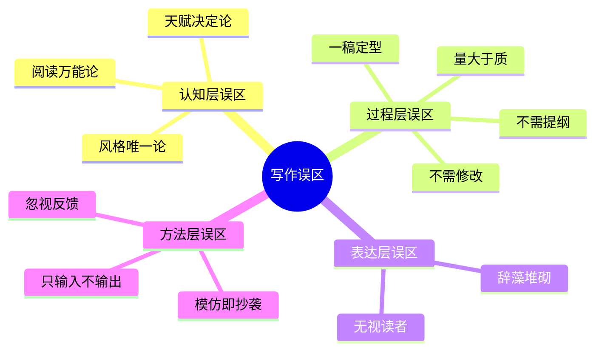
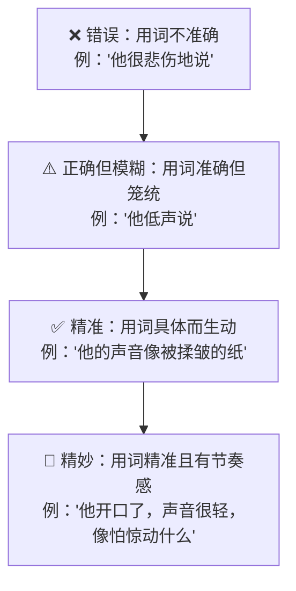
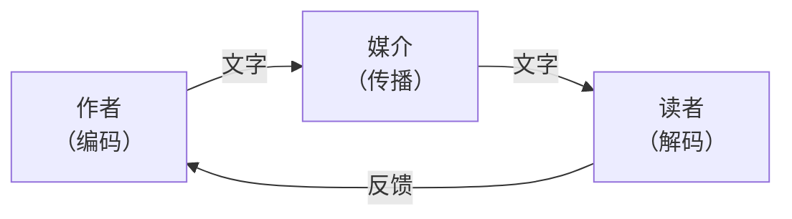
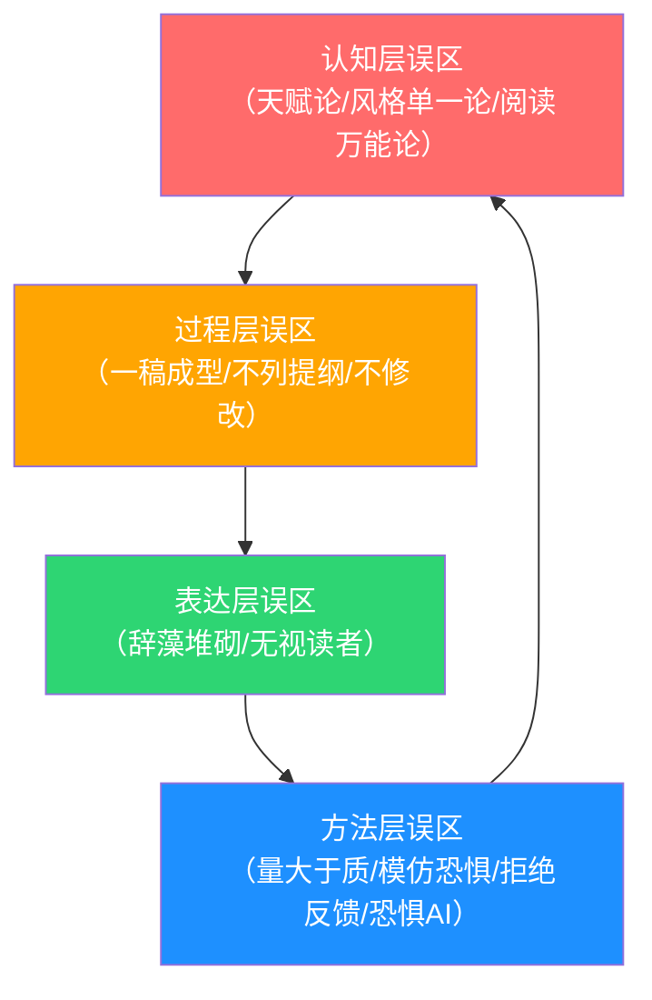

# 写作能力：常见误区

> "最危险的不是不知道，而是你以为自己知道的东西其实是错的。"

写作是一项可以通过学习和练习掌握的技能，但许多人在提升写作能力的道路上，被一些根深蒂固的错误观念所阻碍。这些误区之所以危险，是因为它们往往**披着"常识"的外衣**，让你在不知不觉中偏离正确的方向，甚至越努力越倒退。

本章将系统剖析写作中最常见的十二个误区。每个误区不仅告诉你"错在哪里"，更会解释"为什么会错"、"正确的做法是什么"，以及"如何通过具体行动纠正"。章末还提供了自我诊断工具，帮助你精准识别自己正在踩的坑。

---

## 误区一：写作靠天赋，没有天赋就写不好

### 误区表现

"我没有写作天赋"、"我不是写作的料"、"好文章都是天才写出来的"——这些想法让很多人在真正尝试之前就选择了放弃。天赋论是写作领域最普遍、最具杀伤力的误区，它直接切断了你进步的可能性。

### 误区分析：为什么天赋论站不住脚

**神经科学的证据。** 2014年伦敦大学学院的研究发现，写作能力的提升与大脑左侧颞叶和额叶区域的灰质密度变化显著相关——这意味着写作能力是可以通过训练**物理性地改变大脑结构**的。天赋可能影响你的起点，但**练习决定你的终点**。

**一万小时定律的修正。** 安德斯·艾利克森（Anders Ericsson）在提出刻意练习理论时明确指出：专业能力的核心不在于天赋，而在于**有目的、有反馈、有挑战的练习**。写作能力同样遵循这一规律。但这不意味着你需要写一万小时才能入门——研究表明，持续6个月、每天30分钟的刻意练习，就能让大多数人的写作水平提升1-2个等级（以标准化写作评分衡量）。

**历史上的"逆袭者"：**

| 作家 | 背景 | 关键转折 |
|------|------|----------|
| 村上春树 | 29岁前经营爵士酒吧，零文学背景 | 观看棒球赛时突然决定写小说，处女作《且听风吟》获群像新人奖 |
| 余华 | 牙医，5年拔牙生涯 | 因羡慕文化馆工作人员"不用上班"而开始投稿，最终成为国际知名作家 |
| 刘慈欣 | 电厂工程师 | 利用工作间隙写作，最终凭《三体》获得雨果奖 |
| 王小波 | 人民大学讲师 | 40岁才开始全职写作，此前一直在理工科领域工作 |

### 纠正方案

**从"天赋思维"转向"成长思维"。** 心理学家卡罗尔·德韦克（Carol Dweck）的研究表明，持有"能力可以通过努力提升"信念的人，比持有"能力是天生固定"信念的人，在长期发展中表现显著更好。

**具体行动：**

1. **记录写作日志。** 每次写作后记录：写了什么、用了什么技巧、哪里做得好、下次可以改进什么。每两周回看一次，你会清晰地看到自己的进步轨迹。
2. **设置阶段性目标。** 不要笼统地"想写得更好"，而是设定具体目标：这个月练习描写、下个月练习对话、再下个月练习结构。具体目标让进步可衡量。
3. **找到自己的"启动杠杆"。** 每个人进入写作状态的方式不同。有人通过阅读好作品激发灵感，有人通过散步整理思路，有人通过速写（stream of consciousness）热身。找到你的启动方式，降低每次写作的心理门槛。

> **核心认知：** 天赋决定的是你的起跑线，练习决定的是你的天花板。而大多数人的天花板，远比他们以为的要高。

---

## 误区二：好文章是一次性写出来的

### 误区表现

很多人追求"一气呵成"的写作体验，认为好文章应该灵感涌现、一稿成型。他们或者因为写不出完美的初稿而反复推翻重来，或者因为不愿修改而让粗糙的文字直接面世。

### 误区分析：写作的真实过程

**海明威说："一切初稿都是狗屎。"** 这不是自谦，而是对写作过程的精准描述。写作包含两个本质上不同的阶段：

| 阶段 | 核心任务 | 调用的能力 | 大脑状态 |
|------|----------|------------|----------|
| 初稿 | 把想法"倾倒"出来 | 发散思维、联想、想象力 | 创造模式，低批判 |
| 修改 | 把文章"打磨"成型 | 分析、判断、逻辑推理 | 批判模式，高精准 |

初稿阶段的大忌是**边写边改**——这相当于同时踩油门和刹车，效率极低。认知心理学研究证实，创造性思维和批判性思维很难同时高效运转。

**经典案例：修改的力量**

- 托尔斯泰的《战争与和平》修改了**七次**，手稿堆起来超过一人高
- 海明威的《永别了，武器》结尾重写了**39次**
- 鲁迅的《藤野先生》从初稿到定稿，删去了近三分之一的篇幅
- 钱钟书的《围城》出版后仍在修改，前后修订超过200处

### 三轮修改法

将修改分为三个明确的阶段，每轮只关注一个维度：

**第一轮：结构修改（宏观层面）**
- 文章的核心论点是否清晰？
- 各部分的逻辑关系是否合理？
- 是否有重复或遗漏的段落？
- 开头是否能抓住读者？结尾是否有力？
- 信息的呈现顺序是否最优化？

**第二轮：内容修改（中观层面）**
- 每个论点是否有充分的论据支撑？
- 案例是否具体、有说服力？
- 是否有逻辑漏洞或自相矛盾之处？
- 是否有冗余的内容需要删减？
- 关键概念是否解释清楚了？

**第三轮：语言修改（微观层面）**
- 是否有错别字和语法错误？
- 句子是否通顺、简洁？
- 用词是否准确、得体？
- 标点符号是否正确？
- 排版格式是否统一？

### 纠正方案

1. **强制分离"写"和"改"。** 写初稿时关闭所有拼写检查和格式调整功能，专注于把想法倒出来。设定专门的修改时间，至少与初稿创作间隔2小时（最好隔夜），让你以"读者"而非"作者"的视角重新审视。
2. **建立修改检查清单。** 根据你常犯的错误制作一份清单，每次修改时逐项检查。清单示例见下表。
3. **学会"砍掉"好句子。** 威廉·津瑟说："杀死你的宝贝（Kill your darlings）。"如果一个句子写得很漂亮但对文章主旨没有贡献，果断删除。

| 修改检查清单 | ✓ |
|:---|:---:|
| 核心论点在前100字内是否明确？ | |
| 每个段落是否有明确的主题句？ | |
| 段落之间是否有逻辑过渡？ | |
| 是否有至少3个具体案例/数据支撑论点？ | |
| 是否删掉了所有"实际上""基本上""可能"等填充词？ | |
| 朗读全文，是否有拗口的句子？ | |
| 标题是否准确反映内容且具有吸引力？ | |
| 结尾是否给读者留下思考空间或行动指引？ | |

---

## 误区三：写作就是堆砌华丽的辞藻

### 误区表现

有些写作者痴迷于成语、排比、引用名言，认为辞藻越华丽、句式越复杂，文章就越好。他们把"文采飞扬"等同于"好文章"，把"朴实无华"等同于"没水平"。

### 误区分析：华丽为什么常常是反效果

**认知负荷理论**告诉我们，读者的脑力资源是有限的。当你使用过多的修饰语、复杂的句式、生僻的词汇时，读者的大脑需要花费额外的认知资源来处理这些"包装"，反而削弱了对核心信息的理解和记忆。

**清晰才是写作的最高境界。** 威廉·津瑟在《写作法宝》中反复强调："好的写作是清晰的写作。每一个句子都应该清楚地表达一个意思，每一个词都应该为这个意思服务。"

**对比分析：华丽 vs 清晰**

| 维度 | 华丽风格 | 清晰风格 |
|------|----------|----------|
| 读者体验 | "哇，写得真美"然后忘记内容 | "原来如此"然后记住要点 |
| 认知负担 | 高——需要解码修辞 | 低——直接理解含义 |
| 适用场景 | 文学作品、抒情散文 | 说明文、议论文、技术文档、商业写作 |
| 常见问题 | 空洞、浮夸、言之无物 | 可能显得平淡（但这是可以克服的） |

**朴素的力量——经典案例：**

汪曾祺的文字几乎没有华丽的修辞，但读起来如清泉流淌："如果你来访我，我不在，请和我门外的花坐一会儿，它们很温暖。"短短一句，画面感、温度感、人情味全都有了。

阿城的《棋王》全书语言极其克制，但描写王一生下棋时的那段，用最朴素的词汇写出了最震撼人心的力量。好文采不是辞藻的堆砌，而是**精准地找到那个唯一恰当的词**。

### 准确性阶梯

好的写作语言追求的是**精准**，而非华丽。可以参考"准确性阶梯"来评估和提升自己的用词：

### 纠正方案

1. **练习"一句话概括"。** 读完一篇文章后，用一句话概括核心观点。如果概括不出来，说明原文要么逻辑混乱，要么华而不实。
2. **执行"减法写作"。** 写完一段话后，尝试删掉30%的文字而不改变原意。这个练习能帮你识别哪些词是"冗余的装饰"。
3. **读优秀的信息类写作。** 推荐阅读《经济学人》、科塔克的《人类学》、万维钢的《万万没想到》——它们证明了信息密度和可读性可以兼得。

> **核心认知：** 好文采是精准，不是华丽。马克·吐温说得好："用对的词和差不多对的词，区别就像闪电和萤火虫。"

---

## 误区四：写作不需要列提纲，想到哪写到哪

### 误区表现

"我不喜欢被框架束缚"、"列提纲扼杀灵感"、"我习惯自由发挥"——这些理由让很多人跳过了写作中最关键的规划环节。他们直接动笔，想到哪写到哪，结果常常写到一半发现方向跑偏，或者写完发现逻辑混乱。

### 误区分析：为什么提纲不是束缚，而是解放

**认知心理学的解释。** 人的工作记忆容量有限（著名的"米勒定律"指出是7±2个信息块）。写一篇长文时，你需要同时记住：要表达什么观点、用了什么论据、接下来写什么、前面写了什么不能重复……这些信息会迅速耗尽你的工作记忆，导致思维混乱、效率低下。提纲的作用就是**将这些信息外化到纸上**，释放你的工作记忆用于创造性思考。

**提纲的四重价值：**

| 价值 | 说明 | 不列提纲的代价 |
|------|------|----------------|
| 理清思路 | 在动笔前先想清楚要写什么、怎么写 | 写到一半发现方向不对 |
| 节省时间 | 避免大面积返工 | 平均浪费30%-50%的写作时间 |
| 保证逻辑 | 确保结构清晰、逻辑连贯 | 文章跳跃、重复、遗漏 |
| 减少焦虑 | 有了路线图，"写不出来"的焦虑大幅降低 | 卡在某个段落无法继续 |

### 不同写作类型的提纲策略

提纲不是只有一种形式，不同写作类型需要不同程度的规划：

**轻量级提纲（适合：日记、随笔、短文）**

主题：____
开头：一句话引入
要点1：____
要点2：____
要点3：____
结尾：____

**标准提纲（适合：文章、报告、方案）**

标题：____
核心论点：____

一、引言
   - 钩子（引发兴趣）
   - 背景（必要信息）
   - 论点（核心观点）

二、主体
   A. 论点1
      - 论据/案例
      - 分析/解释
   B. 论点2
      - 论据/案例
      - 分析/解释
   C. 论点3
      - 论据/案例
      - 分析/解释

三、结论
   - 总结要点
   - 升华/呼吁

**详细提纲（适合：长文、书籍章节、论文）**

在标准提纲的基础上，增加每个小节的：
- 关键词和核心句子
- 引用的案例/数据来源
- 各部分的预期字数
- 与其他部分的逻辑关联

### 纠正方案

1. **从"5分钟大纲"开始。** 不需要写复杂的提纲，花5分钟列出3-5个要点就够了。这个习惯养成后再逐步精细化。
2. **选择适合自己的提纲工具。** 线性写作者用Word大纲模式，视觉型写作者用思维导图（XMind、MindNode），结构化写作者用卡片法（每个论点一张卡片，排列组合找最佳顺序）。
3. **允许提纲变化。** 提纲是路线图，不是牢笼。写作过程中发现新的思路，随时可以修改提纲。有路线图的"变道"比没有路线图的"乱跑"高效得多。

---

## 误区五：写得越多，能力提升越快

### 误区表现

"每天写3000字"、"一个月完成10万字"——很多写作者给自己设定高产量目标，认为写得多就进步快。他们每天机械地完成字数任务，却很少回顾自己的作品，也很少思考"我写的东西到底好不好"。

### 误区分析：重复≠进步

安德斯·艾利克森通过几十年的研究发现了一个关键区别：

- **天真练习（Naive Practice）**：重复做已经会的事，没有目标，没有反馈。结果：水平停滞，甚至退化。
- **刻意练习（Deliberate Practice）**：设定明确的改进目标，获得即时反馈，专注于薄弱环节。结果：持续进步。

如果你每天用同样的方式写同样水平的文章，你只是在**巩固现有水平**，而不是在提升。就像一个网球运动员每天和比自己弱的对手打球，打了十年也不会进步。

**刻意练习的四个核心要素：**

| 要素 | 说明 | 写作中的应用 |
|------|------|--------------|
| 明确目标 | 每次练习要提升什么具体能力 | "这次练习重点改善段落过渡"而非"写得更好" |
| 即时反馈 | 完成后获得反馈 | 请人阅读、与范文对比、使用工具检查 |
| 针对性练习 | 根据反馈改进薄弱环节 | 发现自己叙述冗长→练习200字微型小说 |
| 舒适区挑战 | 尝试超出当前能力的任务 | 习惯写议论文→尝试写人物特稿 |

### 纠正方案

1. **设定"质量目标"而非"数量目标"。** 把"每天写3000字"改成"今天练习用白描手法写一个场景，不超过200字"。质量目标比数量目标更能驱动进步。
2. **建立"写作-复盘"循环。** 每写完一篇，用5分钟回顾：哪里写得顺畅？哪里卡壳了？卡壳的原因是什么？下次怎么改进？这个复盘过程本身比多写1000字更有价值。
3. **设置"主题练习日"。** 每周安排1-2天专门练习特定技巧，而非通篇写作。比如：
   - 周一：描写练习（用50字描写一个场景）
   - 周三：对话练习（写一段500字的对话，不使用"说"字）
   - 周五：开头练习（为同一个主题写3种不同的开头）
4. **定期"温故知新"。** 每月重读自己一个月前的作品，标注满意和不满意的地方。如果发现一个月前的文章现在看来问题很多，说明你在进步。

---

## 误区六：模仿别人就是抄袭

### 误区表现

"我要有自己的风格，不能学别人"、"模仿是抄袭，不道德"——有些人对模仿有一种本能的抗拒，坚持"完全原创"，拒绝学习和借鉴优秀作品的技巧。结果是他们一直在用自己的方式写，水平始终在原地打转。

### 误区分析：模仿与抄袭的本质区别

**模仿（Learning by Modeling）** 和 **抄袭（Plagiarism）** 有根本性的不同：

| 维度 | 模仿 | 抄袭 |
|------|------|------|
| 目的 | 学习技巧和方法 | 据为己有 |
| 对象 | 技巧、结构、风格 | 具体内容、原文表达 |
| 结果 | 内化后形成自己的风格 | 简单复制，没有成长 |
| 法律/伦理 | 完全合法合规 | 侵犯知识产权 |

**所有大师都从模仿开始：**

- 毕加索早期作品明显受塞尚和非洲艺术影响，他名言："好的艺术家模仿，伟大的艺术家偷窃"（意为彻底内化）
- 金庸借鉴大仲马的叙事结构（《基督山伯爵》的复仇模式在金庸作品中反复出现），但创造了完全不同的武侠世界
- 莫言承认受马尔克斯《百年孤独》影响巨大，但写出的是扎根中国乡土的独特作品

### 四阶段模仿法

模仿不是终点，而是通往原创的桥梁。真正的模仿经历四个阶段：

**具体操作方法：**

1. **选一篇你认为写得很好的文章**，逐段分析：作者用了什么技巧？为什么这样写有效？结构是怎么安排的？
2. **用相同的结构和技巧，写一个完全不同主题的文章。** 比如，你分析了一篇科技评论的论证结构，就用同样的结构写一篇关于教育的评论。
3. **对比自己的文章和原文。** 找出差距，分析原因，继续练习。
4. **逐步加入自己的变化。** 当一种技巧已经熟练后，开始尝试修改和组合，发展出自己的变体。

### 纠正方案

1. **建立"范文库"。** 收集你觉得写得好的文章，分类整理（开头、论证、描写、对话等），每次写作前参考相关范文。
2. **练习"结构复用"。** 读完一篇好文章后，只保留其结构骨架，填入自己的内容。这是最高效的模仿方式。
3. **给自己"毕业时间"。** 设定一个期限（比如3个月），在期限内系统模仿一位作家，到期后转向另一位，最终融合多种风格形成自己的特点。

---

## 误区七：只写自己想写的，不需要考虑读者

### 误区表现

"写作是自我表达，不需要迎合任何人"、"我手写我心"、"看不懂是他们的问题"——这种观点将写作视为纯粹的个人行为，完全忽视了写作的沟通本质。

### 误区分析：写作是双向的

写作是一种**沟通行为**，而不是单向的自我倾诉。除了私人日记，所有写作都有目标读者，忽视读者就等于放弃沟通效果。

**沟通模型中的写作：**

如果你的编码方式（写作风格、用词、结构）与读者的解码能力（知识背景、阅读习惯、兴趣点）不匹配，信息就会"传输失败"——读者看不懂、记不住、不想读。

**这不是"迎合"，而是"连接"。** 了解读者不是让你放弃自己的观点去讨好别人，而是用读者能够理解和接受的方式表达自己的观点。爱因斯坦如果用量子力学论文的方式给普通人讲相对论，没人能听懂——但他的《物理学的进化》用通俗的语言解释深奥的理论，成为经典科普著作。

### 读者画像四维度

在动笔之前，从四个维度构建你的读者画像：

| 维度 | 需要回答的问题 | 影响的写作决策 |
|------|----------------|----------------|
| 知识水平 | 读者对这个主题了解多少？ | 决定是否需要解释基础概念 |
| 阅读目的 | 读者为什么读这篇文章？ | 决定内容的侧重点和深度 |
| 阅读场景 | 读者在什么场景下阅读？ | 决定文章的长度和风格 |
| 关注点 | 读者最关心什么问题？ | 决定信息的优先级 |

**实例说明：** 同样是写"Python入门"这个主题——

| 读者类型 | 知识水平 | 阅读目的 | 你应该怎么写 |
|----------|----------|----------|--------------|
| 完全零基础的职场人 | 不知道什么是编程 | 想用Python自动化Excel报表 | 避免术语，多用类比，从安装软件开始讲 |
| 有其他语言基础的程序员 | 精通Java/C++ | 想快速上手Python | 直接对比语法差异，跳过编程基础概念 |
| 计算机专业学生 | 学过C语言 | 课程作业需要 | 可以使用专业术语，强调Python的特性 |

### 纠正方案

1. **写"读者摘要"。** 在提纲阶段，用3句话描述你的目标读者：他们是谁？他们知道什么？他们需要什么？写作过程中经常回顾这个摘要。
2. **找一个"模拟读者"。** 想象一个具体的人（你的朋友、同事、家人）正在读你的文章。如果你想象中的这个朋友读到某段话时会皱眉，那就需要改。
3. **请目标读者试读。** 写完后找一个接近目标读者的人阅读，观察他们在哪里停下来、在哪里困惑、在哪里失去兴趣。这些是最真实的反馈。
4. **练习"读者视角"转换。** 写完一段话后，假装自己是第一次接触这个主题的人，重新读一遍。如果自己都觉得晦涩，读者一定更觉得难懂。

---

## 误区八：写作不需要修改，直接发布就好

### 误区表现

在"内容为王"、"日更不断"的自媒体时代，很多人追求发布速度，写完就发，不做修改。他们用"完成比完美更重要"作为跳过修改的理由。

### 误区分析：速度与质量的真相

**"完成比完美更重要"这句话本身没有错，但它不应该成为偷懒的借口。** 这句话的真正含义是：不要因为追求完美而迟迟不发布，而不是说可以发布粗制滥造的内容。

**不修改的代价——数据说话：**

根据Grammarly对100万篇商业文章的分析，语法和拼写错误会降低文章可信度约**25%**。在求职场景中，简历上的一个拼写错误就可能让HR淘汰你的申请。在学术领域，审稿人对有明显语法错误的论文，拒稿率比同等质量但无错误的论文高出**40%**。

**"快速发布"也不等于"不修改"：**

| 场景 | 最低修改标准 | 时间投入 |
|------|------------|----------|
| 社交媒体帖子 | 检查错别字、确认核心观点清晰 | 2分钟 |
| 博客文章 | 结构检查 + 语言润色 + 标题优化 | 15-30分钟 |
| 商业报告 | 逻辑验证 + 数据核实 + 全文校对 | 1-2小时 |
| 出版物 | 多轮修改 + 外部审读 + 专业校对 | 数天到数周 |

### 最低修改清单（快速发布适用）

即使时间紧迫，以下五项检查也应该在发布前完成：

1. **错别字和语法。** 使用工具（如Grammarly、秘塔写作猫、微软Word的拼写检查）快速扫描，30秒内完成。
2. **核心观点检查。** 重新读一遍标题和开头，确认它们准确反映了文章的核心内容。
3. **逻辑快速扫描。** 快速浏览每个段落的第一句话（主题句），确认它们之间有逻辑连贯性。
4. **删除废话。** 删掉"实际上"、"基本上"、"总之"、"其实"等填充词，以及任何可以删掉而不改变原意的句子。
5. **朗读标题和开头。** 朗读能帮你发现默读时忽略的拗口之处。

### 纠正方案

1. **设定"发布冷却期"。** 写完后至少等30分钟（理想情况是隔夜）再发布。这段间隔能让你从"作者视角"切换到"读者视角"。
2. **将修改纳入写作流程。** 把修改视为写作的一个步骤，而不是可选的附加项。在你的写作时间规划中，为修改留出至少20%的时间。
3. **建立"修改最小化"标准。** 如果时间确实紧张，至少完成上述"最低修改清单"的5项检查。这只需要5-10分钟，但能避免80%的低级错误。

---

## 误区九：好的写作风格只有一种

### 误区表现

"好文章就应该像XX那样写"、"简洁才是王道"、"必须有文采"——有些人推崇某一种风格，认为只有符合这个标准的写作才是好写作。这导致两种结果：要么强行模仿不适合自己的风格，写得别扭；要么因为自己的风格"不合标准"而自我怀疑。

### 误区分析：风格多元才是生态健康的表现

**文学史的证据：** 所有被公认的"好作家"，风格差异巨大：

| 作家 | 风格特征 | 核心魅力 |
|------|----------|----------|
| 汪曾祺 | 朴素淡雅，如水墨画 | 于平淡中见真味 |
| 莫言 | 浓烈狂放，魔幻色彩 | 感官冲击力极强 |
| 余华 | 冷峻克制，不动声色 | 悲剧力量在平静中爆发 |
| 王小波 | 幽默机智，理性中带荒诞 | 智识上的愉悦感 |
| 鲁迅 | 犀利尖锐，一针见血 | 思想的穿透力 |
| 沈从文 | 温柔细腻，田园牧歌 | 情感的细腻度 |
| 海明威 | 简洁有力，冰山理论 | 言外之意的张力 |
| 福克纳 | 繁复绵密，意识流 | 叙事的复杂美感 |

这些风格**没有高下之分**，只有适不适合你和你的写作目标之分。

**风格选择的决策矩阵：**

你的写作风格应该根据**三个变量**来决定：

| 变量 | 偏简洁清晰 | 偏丰富细腻 |
|------|-----------|-----------|
| **写作类型** | 说明文、报告、技术文档、商业文案 | 散文、小说、人物特稿、文学评论 |
| **读者特征** | 时间紧张、追求效率、需要行动指南 | 享受阅读、追求体验、愿意沉浸 |
| **表达目标** | 传达信息、说服决策、指导操作 | 传递情感、营造氛围、引发思考 |

### 如何找到自己的风格

风格不是"选择"出来的，而是**在大量阅读和写作中自然生长出来的**。但你可以通过以下方法加速这个过程：

1. **广泛阅读，记录"心动时刻"。** 读到让你觉得"写得真好"的段落时，停下来分析：到底是什么打动了你？是用词、节奏、画面感，还是思想深度？
2. **尝试多种风格。** 用海明威的简洁风格写一段，再用汪曾祺的平淡风格写同一段，再用莫言的浓烈风格写。体验不同风格的感觉，看哪种最让你舒适。
3. **找到"舒适区+1"。** 你的自然写作风格就是你的舒适区。在这个基础上增加一点挑战——如果你自然偏向简洁，尝试加入一些感官描写；如果你自然偏向华丽，练习删减。这个"微调"的过程就是风格成长的过程。

### 纠正方案

1. **停止用别人的标准衡量自己。** 你的风格不需要像任何已知的作家。风格的独特性本身就是价值。
2. **根据写作目标选择风格，而非个人偏好。** 写技术文档时追求清晰，写散文时可以追求美感，写营销文案时追求说服力。一个成熟的写作者应该能在不同场景间灵活切换。
3. **风格是"长"出来的，不是"装"出来的。** 不要刻意追求某种风格的标签，专注于准确地表达你的想法和感受，风格会自然浮现。

---

## 误区十：写作能力不需要刻意培养，多读书自然就会写

### 误区表现

"我读了几百本书了，写作应该没问题吧"——有些人把大量时间花在阅读上，却很少动笔，认为足够的"输入"自然会转化为"输出"。

### 误区分析：阅读≠写作，输入≠输出

**阅读和写作是两种完全不同的认知过程：**

| 维度 | 阅读（解码） | 写作（编码） |
|------|------------|------------|
| 方向 | 文字→意义 | 意义→文字 |
| 认知过程 | 识别、理解、联想、评价 | 构思、组织、表达、修改 |
| 大脑活动 | 被动接受为主 | 主动创造为主 |
| 类比 | 看别人游泳 | 自己下水游泳 |

**科学研究的证据。** 教育心理学研究表明，阅读能力与写作能力之间的相关系数约为**0.4-0.6**——这意味着阅读能解释写作能力的16%-36%的变异，但还有64%-84%的变异需要通过**写作实践**来提升。

**阅读能提供的：**
- 词汇和表达方式的积累
- 写作技巧的观察和学习
- 素材和灵感的获取
- 语感和审美能力的培养

**阅读无法替代的：**
- 把想法组织成文字的实践
- 结构化思维的训练
- 面对空白页面的心理调适
- 修改和自我评估的经验
- 在压力下表达清晰的能力

### 纠正方案

1. **建立"读写联动"机制。** 每读完一本书或一篇好文章，写一篇至少300字的读后笔记。笔记不求全面，只写一个最触动你的点，以及你为什么觉得它好。
2. **"拆解式阅读"替代"浏览式阅读"。** 不要只是"读完"一本书，而是选择其中一个章节，逐段分析作者的写作技巧：这段为什么有效？用了什么手法？结构是怎么安排的？然后尝试用同样的手法写一段自己的内容。
3. **设定"输入输出比"。** 建议阅读与写作的时间比为**6:4**或**7:3**（而非9:1或10:0）。如果每天有2小时用于写作相关活动，至少留40-50分钟给实际写作练习。
4. **从"读者"变"作者"。** 下次读到一篇你觉得写得好的文章时，不要只是赞叹，而是问自己：如果我来写这个主题，我会怎么写？然后真的动手写一写。

---

## 误区十一：反馈不重要，自己写得开心就行

### 误区表现

"我写作是为了自我表达，不需要别人评价"、"别人的反馈会影响我的风格"——有些人拒绝获取外部反馈，沉浸在自己的写作世界里，自我感觉良好但实际水平停滞不前。

### 误区分析：为什么反馈是进步的加速器

**达克效应（Dunning-Kruger Effect）** 告诉我们：能力不足的人往往高估自己的水平，因为他们缺乏"知道自己不知道什么"的能力。写作领域尤其如此——**你很难自己发现自己看不到的问题**，因为你写的时候就是按自己的思维方式写的，你的盲区恰好是你看不到的地方。

**反馈的价值不在于告诉你"好不好"，而在于告诉你"读者是如何理解你的文字的"。** 你以为表达清楚的地方，读者可能完全误解；你觉得精彩的地方，读者可能觉得冗长；你忽略的细节，读者可能觉得至关重要。

**反馈的类型与价值：**

| 反馈类型 | 来源 | 价值 | 局限性 |
|----------|------|------|--------|
| 专业反馈 | 编辑、写作导师 | 最有深度，能指出结构性问题 | 成本高，获取不便 |
| 同行反馈 | 写作社群、同事 | 实用性强，视角多元 | 质量参差不齐 |
| 读者反馈 | 评论、阅读数据 | 最真实的市场反应 | 可能碎片化、情绪化 |
| 工具反馈 | Grammarly、可读性测试 | 快速、客观、低成本 | 只能检查表层问题 |
| 自我反馈 | 朗读、冷却后重读 | 随时可用 | 受限于自身认知盲区 |

### 纠正方案

1. **加入写作社群。** 寻找一个有质量的写作交流群体（线上如豆瓣写作小组、知乎专栏交流群，线下如写作工作坊），定期互相点评作品。
2. **建立"反馈三友"。** 找3个你信任且有不同背景的朋友作为固定反馈者：一个擅长逻辑的朋友检查论证，一个文笔好的朋友检查表达，一个了解你目标读者的朋友检查效果。
3. **学会"请求反馈"的方式。** 不要泛泛地问"写得怎么样"，而要问具体问题："第三段的论点是否清楚？""读完后你记住了什么？""哪里让你觉得无聊或困惑？"具体的提问才能获得有价值的反馈。
4. **建立反馈处理机制。** 收到反馈后不要立即反驳，也不要全盘接受。先记录下来，冷静思考后决定哪些采纳、哪些保留。一般来说，如果3个独立的读者都在同一个地方反馈了问题，那这个地方大概率确实需要改。

---

## 误区十二：AI写作工具会让人丧失写作能力

### 误区表现

"用AI写东西就是作弊"、"依赖AI会退化自己的写作能力"——有些人完全拒绝使用AI辅助写作工具，认为它们会让人变懒、变笨。

### 误区分析：工具与能力的关系

**历史上的类似争论：**

每一次新工具的出现，都伴随着"会让人类退化"的担忧：
- 计算器出现时，有人说会让人丧失计算能力
- 搜索引擎出现时，有人说会让人丧失记忆能力
- GPS出现时，有人说会让人丧失方向感

**事实是：工具改变的是能力的"形态"，而非能力的"本质"。** 使用计算器的人确实不需要心算大数了，但他们把精力用在了更高级的数学思维上。使用搜索引擎的人确实不需要背诵大量知识了，但他们把精力用在了分析和整合信息上。

**AI写作工具的正确使用方式：**

| 使用方式 | 是否可取 | 说明 |
|----------|----------|------|
| 让AI生成初稿，自己修改润色 | ⚠️ 谨慎 | 可能导致思维惰性 |
| 用AI检查语法和错别字 | ✅ 推荐 | 提高效率，类似拼写检查 |
| 用AI获取写作灵感和大纲建议 | ✅ 推荐 | 相当于与一个知识渊博的朋友讨论 |
| 用AI分析自己的写作风格和问题 | ✅ 推荐 | 获取客观反馈的有效方式 |
| 完全依赖AI写作，署自己的名 | ❌ 避免 | 丧失写作能力，也有伦理问题 |

**关键原则：AI是"副驾驶"，不是"代驾"。** 让AI帮你导航、检查仪表、提供建议，但方向盘必须在你自己手里。

### 纠正方案

1. **明确AI工具的边界。** 把AI定位为"助手"而非"替代者"。AI适合做的事：查资料、检查语法、提供结构建议、生成标题候选、改写拗口的句子。AI不适合替你做的事：形成核心观点、决定文章结构、选择表达方式、判断内容价值。
2. **保持"先写后查"的习惯。** 先用自己的能力写完初稿，再用AI辅助修改和优化。这样既保持了写作能力的锻炼，又利用了AI的效率优势。
3. **用AI作为练习伙伴。** 让AI给你出写作题目、批改你的练习、推荐范文、分析你的风格特点。这种用法是在增强而非替代你的能力。

---

## 自我诊断：你踩了几个坑？

阅读完上述十二个误区后，用下面的诊断清单评估自己的情况。对每个误区，诚实地给自己打分（1=完全不是我的问题，5=我严重犯了这个错误）：

| 序号 | 误区 | 你的评分(1-5) | 优先级 |
|------|------|:---:|--------|
| 1 | 天赋决定论 | ___ | 如果≥4，立即开始每天写作习惯 |
| 2 | 一稿成型 | ___ | 如果≥4，建立三轮修改流程 |
| 3 | 辞藻堆砌 | ___ | 如果≥4，练习"减法写作" |
| 4 | 不列提纲 | ___ | 如果≥4，从5分钟大纲开始 |
| 5 | 量大于质 | ___ | 如果≥4，转向刻意练习模式 |
| 6 | 模仿恐惧 | ___ | 如果≥4，开始四阶段模仿法 |
| 7 | 无视读者 | ___ | 如果≥4，写读者画像 |
| 8 | 不修改就发 | ___ | 如果≥4，执行最低修改清单 |
| 9 | 风格单一 | ___ | 如果≥4，尝试模仿不同风格 |
| 10 | 只读不写 | ___ | 如果≥4，建立读写联动机制 |
| 11 | 拒绝反馈 | ___ | 如果≥4，找到3个反馈伙伴 |
| 12 | 恐惧AI工具 | ___ | 如果≥4，尝试用AI做语法检查 |

**优先级规则：** 选择评分最高的1-2个误区优先纠正。不要试图同时解决所有问题——一次专注一个，每两周切换到下一个。

---

## 误区间的关联：系统性认知框架

这十二个误区不是孤立存在的，它们之间有着深层的关联。理解这些关联，能帮助你系统性地改变认知，而非头痛医头：

- **认知层**（误区1、9、10）决定了你的"写作世界观"——你相信什么决定了你怎么行动
- **过程层**（误区2、4、8）影响你的"写作工作流"——你怎么做决定了产出质量
- **表达层**（误区3、7）决定你的"读者体验"——读者能否理解并记住你的信息
- **方法层**（误区5、6、11、12）决定你的"成长速度"——你用什么方法练习决定进步快慢

**最高效的纠正策略：从认知层入手。** 如果你真正相信写作是可以习得的技能（纠正误区1），你自然会更愿意列提纲（纠正误区4）、认真修改（纠正误区2、8）、寻求反馈（纠正误区11）。

---

## 常见场景中的误区组合

在实际写作中，误区往往不会单独出现，而是以"组合拳"的方式打击你。以下是最常见的误区组合及其对应的场景：

### 场景一：职场报告写作

**常见误区组合：** 误区8（不修改）+ 误区7（无视读者）+ 误区3（堆砌辞藻）

**典型症状：** 写完就发、报告用了很多专业术语和华丽的形容词，但领导看完后问"所以结论是什么？"

**纠正方案：**
- 写前：明确报告的读者是谁，他们最关心什么问题
- 写中：先写结论，再展开论述（金字塔原理）
- 写后：至少修改一轮，检查核心观点是否在前3句话内出现

### 场景二：自媒体内容创作

**常见误区组合：** 误区5（量大于质）+ 误区8（不修改）+ 误区10（只读不写竞品分析）

**典型症状：** 日更不断但阅读量停滞不前，内容质量参差不齐，缺乏自己的风格

**纠正方案：**
- 降低更新频率，提升单篇质量（宁可周更一篇精品，不要日更三篇水文）
- 分析同领域头部创作者的写作技巧（模仿→变奏→原创）
- 建立内容反馈机制，根据数据调整方向

### 场景三：学习笔记/技术文档

**常见误区组合：** 误区4（不列提纲）+ 误区7（无视读者）+ 误区10（只输入不输出）

**典型症状：** 笔记写得很长但自己回头看也看不懂，技术文档只有自己能看懂，同事问"这个步骤在哪里？"你翻了半天也找不到

**纠正方案：**
- 写前确定笔记/文档的目标读者（未来的自己也算读者）
- 使用标准的提纲模板组织内容
- 写完后假装自己一个月后第一次看这份笔记，检查是否能快速找到需要的信息

---

## 本节小结

写作路上的误区并不可怕，可怕的是**陷入误区而不自知**。回顾本章的核心要点：

**三个最重要的认知转变：**

1. **写作是技能，不是天赋。** 任何愿意投入时间和精力的人，都可以显著提升写作水平。
2. **好文章是改出来的。** 接受"糟糕的初稿"，把修改视为写作的核心环节。
3. **清晰是最高境界。** 不要追求华丽，追求读者能准确理解你的意思。

**一个行动框架：**

从今天开始，拿起笔（或键盘），带着正确的认知，开始你的写作练习。不要害怕犯错，不要害怕不完美。**重要的不是你踩了几个坑，而是你从每个坑里爬出来后，走得更稳了。**

> **"写作不是为了成为作家，而是为了成为更好的思考者。"**

当你能把一件事写清楚，说明你真正理解了它。写作能力的提升，本质上是思维能力的提升。这条路值得你走下去。
