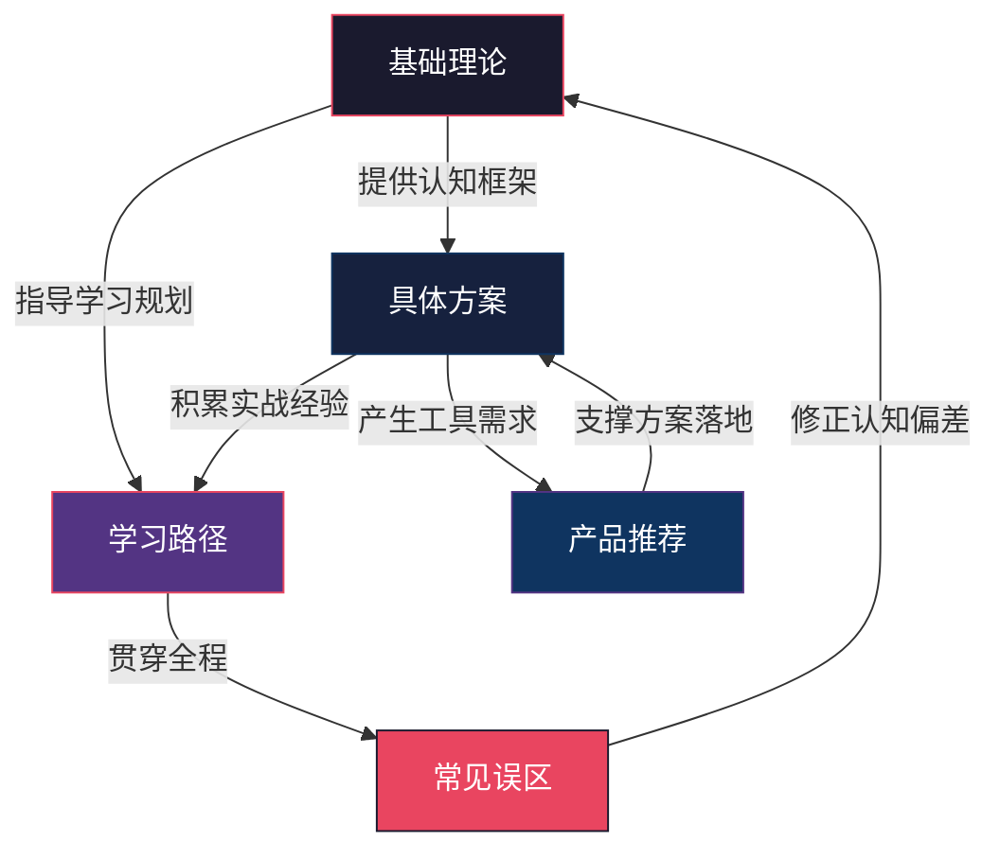
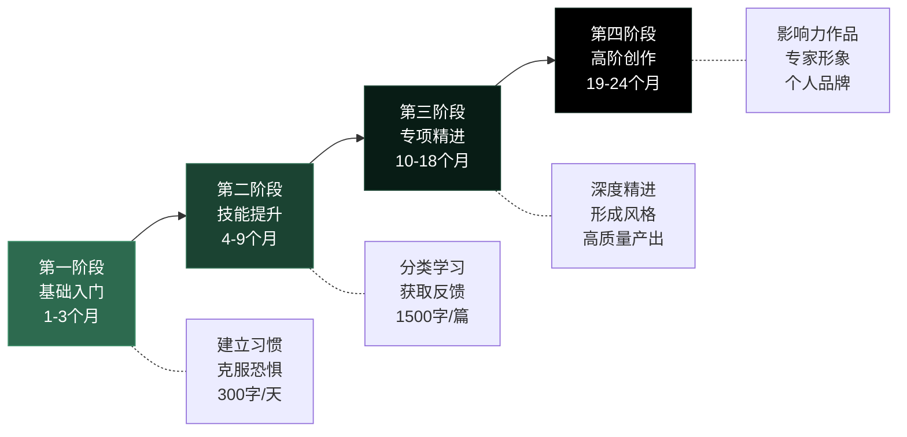

# 写作能力：本章小结

***

## 一、知识体系全景回顾

本章从**基础理论、具体方案、产品推荐、学习路径、常见误区**五个维度，构建了写作能力培养的完整知识体系。下图展示了这五个维度之间的逻辑关系：

**理论是地基，方案是骨架，工具是杠杆，路径是导航，误区纠偏是护栏。** 五个维度缺一不可——没有理论指导的练习是盲目练习，没有方案落地的理论是空中楼阁，没有路径规划的努力容易半途而废，而不了解误区则可能在错误的方向上越走越远。

***

## 二、各模块核心要点提炼

### 2.1 基础理论：理解写作的底层逻辑

基础理论部分涵盖了七个子模块，构建了写作认知的完整框架：

| 子模块 | 核心观点 | 关键收获 |
|--------|---------|---------|
| 写作心理学 | 写作是将非线性思维编码为线性文字的过程 | 理解写作的认知机制，消除"写不出来"的心理障碍 |
| 修辞学基础 | 修辞是增强表达效果的语言策略 | 掌握比喻、排比、对比等修辞手法的使用场景 |
| 叙事理论 | 故事有可复用的结构模型 | 理解三幕结构、英雄之旅、起承转合等叙事框架 |
| 文体学 | 不同文体有不同的规范和读者期待 | 能够根据场景选择合适的文体和表达方式 |
| 写作流程 | 写作是"选题→构思→初稿→修改→定稿"的流程 | 建立系统化的写作流程，避免"想到哪写到哪" |
| 能力构成要素 | 写作能力由语言、结构、思维、受众意识、修改能力五维构成 | 明确能力短板，有针对性地练习提升 |
| 冰山模型 | 水面上的文字质量取决于水面下的知识储备和思维深度 | 认识到提升写作能力需要同步提升阅读量和思考深度 |

**理论层面最关键的三个认知突破：**

1. **写作是技能，不是天赋。** 一万小时定律的基本逻辑同样适用于写作——通过持续、有目的的练习，任何人都能显著提升写作水平。村上春树29岁才开始写作，余华从牙医转行成为作家，这些例子证明写作能力完全可以通过后天培养获得。

2. **好文章是改出来的。** 海明威说"一切初稿都是狗屎"，托尔斯泰的《战争与和平》修改了七次，鲁迅要求"写完后至少看两遍"。修改不是对写作能力的否定，而是写作过程的核心环节。初稿负责"倒出来"，修改负责"打磨好"。

3. **清晰和准确比华丽更重要。** 威廉·津瑟在《写作法宝》中反复强调"简洁是写作的美德"。汪曾祺的文字朴素平实却韵味无穷，海明威用最少的文字传达最多的信息——好的文采是自然流露的，不是刻意堆砌的。

***

### 2.2 具体方案：四种场景的实操指南

具体方案部分针对四种最常见的写作场景提供了从原则到技巧的完整指南：

| 写作类型 | 核心目标 | 关键原则 | 典型文档 |
|---------|---------|---------|---------|
| 商务写作 | 高效沟通，推动行动 | 读者导向、结论先行、简洁明了、数据支撑 | 邮件、报告、提案、会议纪要 |
| 自媒体写作 | 吸引注意力，传递价值 | 标题吸睛、开头抓人、正文有料、结尾有力 | 公众号文章、知乎回答、小红书笔记 |
| 技术写作 | 清晰、准确、完整 | 准确性、清晰性、完整性和一致性 | API文档、用户手册、技术博客 |
| 创意写作 | 创造性表达 | 培养创意思维、掌握叙事技巧、发展个人风格 | 短篇小说、散文、诗歌、剧本 |

**四种写作的核心差异在于"写给谁"和"为了什么"：**

- **商务写作**面向特定读者（领导、客户、同事），目的是推动决策或行动。所以必须结论先行——读者没有时间猜你想说什么。
- **自媒体写作**面向不确定的大众读者，目的是获取注意力和传播。所以标题和开头决定了80%的成败——用户在信息流中只给你0.5秒的注意力。
- **技术写作**面向需要精确信息的用户，目的是让读者能够正确操作或理解。所以准确性是第一要务——一个错误的参数说明可能导致整个系统崩溃。
- **创意写作**面向寻求审美体验的读者，目的是引发情感共鸣或思想启发。所以个人风格比规范更重要——读者期待的是独特的视角和表达。

此外，本节还单独讨论了**写作能力的持续提升**，强调写作能力不是一次性习得的，需要通过建立反馈循环、定期复盘、拓展写作场景来持续精进。

***

### 2.3 产品推荐：书籍、工具与社群

产品推荐部分从三个维度提供了学习资源：

**必读书籍精选（按用途分类）：**

| 用途 | 书名 | 核心价值 |
|------|------|---------|
| 写作基础 | 《写作法宝》（威廉·津瑟） | 写作原则的圣经，强调简洁和清晰 |
| 结构思维 | 《金字塔原理》（芭芭拉·明托） | 结构化思考和表达的方法论 |
| 创意激发 | 《成为作家》（多萝西娅·布兰德） | 打破写作恐惧，建立创作习惯 |
| 作家经验 | 《写作这回事》（斯蒂芬·金） | 一线作家的实战经验和写作哲学 |
| 叙事技巧 | 《故事》（罗伯特·麦基） | 故事创作的底层原理和结构模型 |
| 风格修炼 | 《风格的要素》（斯特伦克&怀特） | 英文写作风格的经典指南 |

**实用工具矩阵：**

| 功能类别 | 推荐工具 | 适用场景 |
|---------|---------|---------|
| 写作编辑 | Notion、Typora、Obsidian | 日常写作、知识管理、长文创作 |
| 语法检查 | Grammarly、写作猫 | 消除语法错误、优化表达 |
| 排版发布 | Markdown Nice、135编辑器 | 公众号排版、图文发布 |
| 素材管理 | Pocket、Flomo | 碎片化素材收集和整理 |
| AI辅助 | ChatGPT等 | 辅助构思、润色、翻译（不能替代写作练习） |

**关于AI写作辅助的清醒认知：** AI工具可以帮你快速生成初稿、润色表达、提供灵感，但它不能替代你的写作练习和独立思考。过度依赖AI写作会导致三个问题：思维能力退化、个人风格消失、内容同质化。正确的使用方式是把AI当作"写作助手"而非"写作替身"——用它来辅助构思和修改，但核心思考和表达必须由你自己完成。

***

### 2.4 学习路径：从新手到高手的24个月路线图

学习路径规划了四个阶段，每个阶段都有明确的目标、任务和检验标准：

**各阶段的关键转折点：**

- **入门→提升（第3-4个月）：** 从"写给自己看"转向"写给别人看"。开始关注读者需求，学习不同文体的规范。这个阶段最大的挑战是接受外部批评。
- **提升→精进（第9-10个月）：** 从"什么都写"转向"选择一个方向深耕"。开始形成个人风格，在特定领域建立专业度。这个阶段最大的挑战是抵抗"什么都想学"的诱惑。
- **精进→高阶（第18-19个月）：** 从"写得不错"转向"写得有影响力"。开始关注作品的传播力和社会价值。这个阶段最大的挑战是从技术层面突破到思想层面。

***

### 2.5 常见误区：十大认知陷阱与纠正方法

本章揭示了十个最常犯的写作错误，以下是速查对照表：

| # | 误区 | 纠正认知 | 一句话记忆 |
|---|------|---------|-----------|
| 1 | 写作靠天赋 | 写作是技能，可以通过学习和练习提升 | 村上春树29岁才开始写 |
| 2 | 好文章一次写成 | 好文章是改出来的 | 海明威：一切初稿都是狗屎 |
| 3 | 堆砌华丽辞藻 | 清晰和准确比华丽更重要 | 简洁是写作的美德 |
| 4 | 不需要列提纲 | 提纲是写作的路线图 | 没有提纲等于没有地图 |
| 5 | 写得越多提升越快 | 刻意练习比盲目练习更有效 | 方向错了，跑得越快偏得越远 |
| 6 | 模仿就是抄袭 | 模仿是学习写作的必经之路 | 所有大师都是从模仿开始的 |
| 7 | 只写自己想写的 | 写作是沟通，不是独白 | 没有读者的写作是自言自语 |
| 8 | 不需要修改 | 修改是写作的基本环节 | 修改能力=写作能力的一半 |
| 9 | 好风格只有一种 | 好的写作风格是多元的 | 鲁迅和汪曾祺都很好 |
| 10 | 多读书自然会写 | 阅读和写作缺一不可 | 看100场球赛不等于会踢球 |

**误区5值得特别强调：** "刻意练习"和"盲目练习"的区别在于是否有明确的目标和反馈。每天写300字日记如果从不修改、不复盘、不学习新技巧，写了三年可能还不如认真练习三个月的人进步大。刻意练习的核心是：设定具体目标→专注练习→获取反馈→修正改进。

***

## 三、知识内化：从"知道"到"做到"的转化框架

阅读本章只是第一步，真正的价值在于将知识转化为能力。以下是将本章内容内化为写作能力的四层转化框架：

### 第一层：认知重建（第1周）

**目标：** 修正对写作的错误认知，建立正确的写作观念。

**行动清单：**
- [ ] 对照十大误区进行自我诊断，标记自己中了哪几条
- [ ] 写下自己对写作的最大恐惧或障碍，逐一用本章的理论进行反驳
- [ ] 确定自己最需要提升的写作能力维度（语言、结构、思维、受众意识、修改能力）

### 第二层：习惯建立（第2-4周）

**目标：** 建立每天写作的习惯，消除"写不出来"的心理障碍。

**行动清单：**
- [ ] 选定固定的写作时间和地点（建议早晨或睡前，每天至少15分钟）
- [ ] 选择一个写作工具（Notion/Obsidian/纸质笔记本均可）
- [ ] 开始"自由写作"练习：不修改、不停顿、不评判，每天写300字
- [ ] 建立素材收集系统：每天至少记录1条有价值的信息或想法

### 第三层：技能训练（第2-3个月）

**目标：** 针对自己的写作场景，系统学习和练习特定写作技能。

**行动清单：**
- [ ] 确定自己的主要写作场景（商务/自媒体/技术/创意）
- [ ] 阅读对应场景的推荐书籍（至少精读1本）
- [ ] 每周完成1篇完整的写作作品（800-1500字）
- [ ] 开始修改练习：同一主题写两遍，对比差异

### 第四层：反馈循环（第3个月起持续）

**目标：** 建立外部反馈机制，通过他人视角发现自己的盲点。

**行动清单：**
- [ ] 加入一个写作社群或找到写作伙伴
- [ ] 在自媒体平台发布作品，观察读者反馈
- [ ] 每月回顾自己的写作，对比上月的进步
- [ ] 建立个人写作标准清单，用于自查

***

## 四、核心能力自测清单

在完成本章学习后，用以下清单检验自己的掌握程度。如果某一项打不了勾，说明需要回到对应章节重新学习：

| 能力项 | 自测标准 | 对应章节 |
|--------|---------|---------|
| 认知层 | 能够清晰解释"写作是编码过程"的含义 | 基础理论·写作心理学 |
| 认知层 | 能够说出写作能力的五个构成维度 | 基础理论·能力构成要素 |
| 方法层 | 能够用金字塔原理组织一篇短文的结构 | 基础理论·写作心理学 |
| 方法层 | 能够说出至少三种叙事结构 | 基础理论·叙事理论 |
| 技能层 | 能够在30分钟内写一封结构清晰的商务邮件 | 具体方案·商务写作 |
| 技能层 | 能够写出一个有吸引力的标题（5个备选） | 具体方案·自媒体写作 |
| 技能层 | 能够为一个简单功能撰写准确的技术说明 | 具体方案·技术写作 |
| 工具层 | 能够熟练使用至少一个写作工具 | 产品推荐 |
| 规划层 | 能够制定自己的写作学习计划 | 学习路径 |
| 避坑层 | 能够说出并避免至少五个常见误区 | 常见误区 |

***

## 五、跨章节知识连接

写作能力不是一个孤立的技能，它与本书其他章节的知识有着密切的联系：

- **与「思维能力」的关系：** 写作是思维的外化。思维能力决定了写作的深度和逻辑性。反过来，写作练习也能倒逼思维能力的提升——当你试图把模糊的想法写清楚时，你会发现自己的思维漏洞。
- **与「沟通表达」的关系：** 写作是一种单向沟通。理解沟通的基本原理（受众分析、信息编码、反馈机制）能够直接提升写作的针对性和有效性。
- **与「知识管理」的关系：** 写作是知识管理的核心工具。通过写读书笔记、学习总结、工作复盘，你可以将碎片化的知识系统化，形成自己的知识体系。
- **与「时间管理」的关系：** 写作需要专注的时间块。掌握时间管理方法（如番茄工作法、时间块规划）能够帮助你为写作腾出稳定的时间。
- **与「个人品牌」的关系：** 在内容为王的时代，持续的高质量写作是建立个人品牌的最有效途径之一。

***

## 六、最后的话

写作能力的提升没有捷径，但有方法。回顾本章的全部内容，核心可以浓缩为三句话：

> **"多读"是输入——没有大量的阅读积累，写作就是无源之水。**
> **"多写"是练习——没有持续的写作实践，理论永远停留在纸面上。**
> **"多改"是精进——没有反复的修改打磨，文章永远停留在粗糙的初稿阶段。**

这三个字看似简单，但真正做到的人不多。大多数人的问题不是不知道方法，而是没有坚持执行。本章给了你完整的知识框架和行动指南，剩下的就是行动。

记住以下几点：

- **完成比完美更重要。** 不要等到"准备好了"才开始写——你永远不会"准备好"。现在就打开一个空白文档，写下第一个字。
- **刻意练习比盲目练习更有效。** 每次写作都设定一个具体目标（这次重点练习标题、这次重点练习结构），有针对性地练习才能快速进步。
- **享受写作的过程。** 当你真正热爱写作时，能力的提升就会变得自然而持续。写作不仅是工具，更是一种生活方式——它帮助你整理思绪、记录成长、连接世界。

> **"写作是最好的思考工具。当你能够清晰地写出来时，你就真正理解了。"**

从现在开始，用写作来记录你的思考、分享你的知识、表达你的观点。写作不仅会提升你的职业竞争力，更会丰富你的人生体验，帮助你成为更好的自己。

***

*本章内容到此结束。下一章，我们将探讨「法律常识」的相关内容。*
