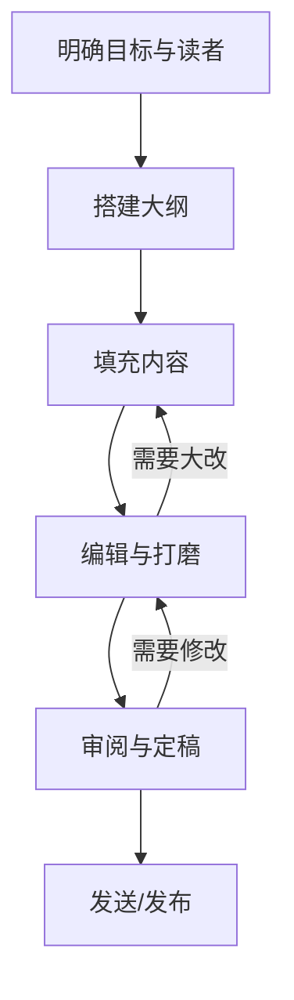
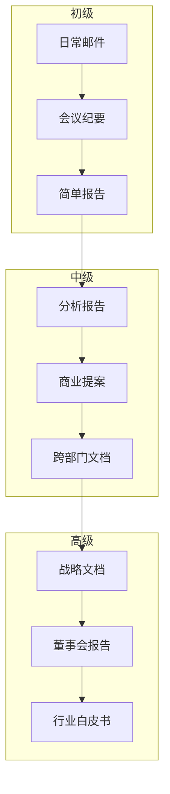

## 一、商务写作

商务写作是职场中最核心的可迁移技能之一。麦肯锡的一项调研显示，知识工作者平均每天花费 28% 的工作时间处理书面沟通——邮件、报告、提案、文档。而《哈佛商业评论》的研究进一步指出，因沟通不清导致的返工和误解，每年给企业造成的隐性成本占人力支出的 15%-25%。换言之，写作能力的差距，直接映射为职业效率和影响力的差距。

本章从商务写作的认知底层出发，系统覆盖六大核心文体（邮件、报告、提案、会议纪要、备忘录、即时消息），并深入讲解写作流程、风格调控、跨文化场景和数字时代的 AI 辅助写作，帮助你从"能写"跃迁到"写得专业、写得高效"。

---

### 1.1 商务写作的认知基础

#### 1.1.1 商务写作与文学写作的本质区别

很多人写作能力的瓶颈不在于"不会写"，而在于用错了写作模式。文学写作追求审美体验、情感共鸣和多义性，读者愿意反复品味；商务写作追求信息传递效率和行动驱动，读者期望在最短时间内获得最明确的答案。

| 维度 | 文学写作 | 商务写作 |
|------|----------|----------|
| 核心目标 | 审美体验、情感共鸣 | 信息传递、推动行动 |
| 读者心态 | 主动沉浸、耐心阅读 | 被动扫描、时间紧迫 |
| 结构逻辑 | 铺垫→高潮→留白 | 结论→论据→行动项 |
| 语言风格 | 丰富多变、修辞密集 | 简洁精准、术语规范 |
| 成功标准 | 读者被打动 | 读者做出决策 |
| 容错空间 | 模糊可以是美 | 模糊就是事故 |

理解这个区别后，商务写作的全部技巧都可以归纳为一句话：**用最少的认知负荷，让读者获得足够的信息并采取正确的行动。**

#### 1.1.2 读者认知负荷理论

认知心理学家 John Sweller 提出的认知负荷理论（Cognitive Load Theory）解释了为什么商务写作必须简洁：

- **内在负荷**（Intrinsic Load）：信息本身的复杂度，无法消除
- **外在负荷**（Extraneous Load）：由表达方式不当造成的额外负担，**必须消除**
- **关联负荷**（Germane Load）：帮助读者建立理解框架的认知投入，**应该增加**

商务写作的优化方向就是：降低外在负荷（砍掉废话、简化句式），释放认知资源给关联负荷（用类比、框架、图表帮助理解）。

实际操作层面，这意味着：
1. 每句话只传递一个信息点，复合句拆成短句
2. 专业术语首次出现时给出解释或括号注释
3. 用数字列表替代大段叙述
4. 关键结论加粗或放在段首

#### 1.1.3 金字塔原理：商务写作的底层框架

Barbara Minto 在麦肯锡工作期间开发的金字塔原理（The Minto Pyramid Principle），是商务写作最重要的思维框架。其核心规则：

1. **结论先行**：任何书面沟通都以结论开头，不铺垫不绕弯
2. **以上统下**：每个层级的内容是下一层级的概括
3. **归类分组**：同一层级的内容按逻辑归类（MECE 原则——相互独立、完全穷尽）
4. **逻辑递进**：同一组内的内容按时间顺序、结构顺序或重要性排序

                    ┌─────────────────┐
                    │   核心结论/建议   │
                    └────────┬────────┘
               ┌─────────────┼─────────────┐
          ┌────┴────┐   ┌────┴────┐   ┌────┴────┐
          │ 论据 A  │   │ 论据 B  │   │ 论据 C  │
          └────┬────┘   └────┬────┘   └────┬────┘
         ┌─────┼─────┐  ┌────┼────┐  ┌─────┼─────┐
        支撑   支撑   支撑 支撑 支撑  支撑  支撑  支撑
        数据   案例   数据 案例 数据  案例  数据  案例

**实战示例**：假设你要向 CEO 汇报"建议将客服外包"。

错误写法（演绎式）：
> 我们目前的客服团队有 50 人，月均成本 80 万元。行业平均客服满意度为 85%，而我们只有 72%。市场上有多家成熟的外包服务商……因此建议外包。

正确写法（金字塔式）：
> **建议将客服业务外包给 A 公司，预计年节省 320 万元，满意度提升 13 个百分点。** 理由如下：（1）成本优势：外包后月均成本降至 53 万；（2）质量优势：A 公司行业满意度 89%，高于我司 17 个百分点；（3）风险可控：合同设定了 SLA 保障条款和退出机制。

---

### 1.2 商务邮件写作

商务邮件是使用频率最高的商务文体。Radicati Group 的统计显示，职场人平均每天收到 121 封邮件，但只有 38% 会被打开，不到 20% 会被完整阅读。这意味着你的邮件必须在标题阶段就赢下注意力，在正文前三行就传递核心信息。

#### 1.2.1 邮件标题的黄金公式

标题决定邮件的命运。好的标题遵循公式：

**[动作标签] + 核心事项 + 时间约束（可选）**

| 标签类型 | 适用场景 | 示例 |
|----------|----------|------|
| [需审批] | 需要对方签字/批准 | [需审批] Q3 营销预算方案 - 请于 6/20 前反馈 |
| [请知悉] | 仅告知信息，无需回复 | [请知悉] 服务器迁移计划已确认 |
| [需协助] | 需要对方提供支持 | [需协助] 请提供上季度销售数据 |
| [决议] | 会议/讨论后的结论 | [决议] 产品定价方案确定为 99 元/月 |
| [紧急] | 需要立即处理 | [紧急] 生产环境数据库连接异常 |

绝对不要用的标题："你好""关于XX的事""请看一下""一些想法"——这些标题等于没有标题。

#### 1.2.2 邮件正文的 BLT 结构

BLT（Bottom Line on Top）结构是邮件写作的黄金法则：

第一段：核心信息（你要什么？为什么写这封邮件？）
第二段：支撑细节（背景、数据、原因——只在必要时展开）
第三段：行动指引（谁、做什么、什么时候）

**完整模板：**

[收件人姓名] 您好，

[一句话说清邮件目的和核心结论。]

[如果需要背景，2-3 句话交代清楚。]

[核心内容分点列出，每点一个独立信息：]
1. [要点一——包含具体数据或事实]
2. [要点二——包含具体数据或事实]
3. [要点三——包含具体数据或事实]

[明确的行动指引：]
- 请您在 [具体日期] 前 [具体动作]
- 如有疑问，可联系 [联系人] 或回复本邮件

[你的姓名]
[职位 | 部门 | 联系方式]

#### 1.2.3 邮件的语气调控

商务邮件的语气需要根据关系亲疏和场景正式度调整：

| 场景 | 称呼 | 开场 | 语气 |
|------|------|------|------|
| 初次联系客户 | 尊敬的 X 总 | 感谢您的关注… | 正式、礼貌 |
| 日常协作同事 | 名字 + 你好 | 直接说事 | 专业但亲切 |
| 上级汇报 | X 总/X 经理 | 简要概括 | 尊重、简洁 |
| 跨部门协调 | 名字 + 你好 | 说明来意 | 合作、务实 |
| 供应商/合作伙伴 | X 总/X 经理 | 感谢合作… | 正式、明确 |

**语气雷区**：
- 全文感叹号过多显得不专业（"务必！！！"）
- 用"请尽快"代替具体时间——"尽快"是主观判断，对方的"尽快"可能是一周后
- 在邮件中使用讽刺、反问等情绪化表达——文字没有语气，容易被误读
- 回复全部时不小心暴露私下评价

#### 1.2.4 抄送（CC）和密送（BCC）的使用规则

抄送不是"让大家知道"的随意行为，它传递的是组织信号：

- **TO（收件人）**：需要采取行动或做出决策的人
- **CC（抄送）**：需要知情但不需行动的人，通常是双方的上级或相关方
- **BCC（密送）**：需要知情但不应被其他人看到的收件人——用于保护隐私或避免回复风暴

**最佳实践**：
1. 抄送上级时，确保邮件内容已经过充分校对
2. 不要滥用"全部回复"——如果只需回复发件人，就只回复发件人
3. 超过 5 人的讨论应转移到会议或协作文档，而不是用邮件来回拉扯
4. 发送前检查：附件是否已添加、收件人是否正确、是否有敏感信息

#### 1.2.5 邮件的跟进策略

发了邮件没收到回复怎么办？跟进是专业行为，不是打扰：

- **首次跟进**：发送后 48 小时未回复，简短提醒："想确认您是否有机会审阅上封邮件中的方案，如有任何问题欢迎随时沟通。"
- **二次跟进**：首次跟进后 3-5 天，换个沟通方式（电话、即时消息）
- **最终跟进**：明确表达"如果本月底前无法推进，我将视为该事项暂缓处理"

---

### 1.3 商务报告写作

商务报告是向决策者呈现分析和建议的专业文档。一份好的报告能让决策者在 5 分钟内抓住核心，在 30 分钟内做出决策。

#### 1.3.1 报告的类型与适用场景

| 报告类型 | 目的 | 典型长度 | 读者 |
|----------|------|----------|------|
| 信息型报告 | 汇报现状、传递事实 | 2-5 页 | 直属上级 |
| 分析型报告 | 深入分析问题原因 | 5-15 页 | 管理层 |
| 建议型报告 | 提出解决方案和建议 | 5-20 页 | 决策者 |
| 研究型报告 | 全面调研某领域 | 15-50 页 | 高管/董事会 |
| 进度报告 | 汇报项目进展 | 1-3 页 | 项目干系人 |

#### 1.3.2 报告的标准结构

**执行摘要**是报告中最重要的部分——70% 的高管只读执行摘要。它不是"摘要"，而是"压缩版完整报告"：

执行摘要结构（1-2 页）：
├── 背景与目的：1-2 句话说明为什么写这份报告
├── 核心发现：3-5 条关键发现，每条一句话
├── 关键建议：2-3 条具体建议
└── 预期影响：实施建议后的预期收益（最好有数据）

**完整报告结构：**

1. 执行摘要
2. 背景与目的
   2.1 项目背景
   2.2 报告目的与范围
   2.3 方法论说明
3. 核心发现
   3.1 发现一（数据支撑 + 图表）
   3.2 发现二
   3.3 发现三
4. 分析与讨论
   4.1 原因分析
   4.2 影响评估
   4.3 风险与不确定性
5. 建议与方案
   5.1 方案对比（表格）
   5.2 推荐方案详述
   5.3 实施路线图
6. 结论
7. 附录
   A. 详细数据
   B. 参考资料
   C. 术语表

#### 1.3.3 数据可视化选择指南

报告中图表的选择不是随意的——不同类型的数据适合不同的图表：

| 你想展示什么 | 推荐图表 | 避免使用 |
|-------------|----------|----------|
| 数值比较 | 柱状图、条形图 | 饼图（人眼不擅长比较角度） |
| 趋势变化 | 折线图 | 饼图、散点图 |
| 占比构成 | 堆叠柱状图、饼图（≤5 项） | 折线图 |
| 相关关系 | 散点图 | 柱状图 |
| 地理分布 | 地图热力图 | 表格 |
| 流程/流向 | 桑基图、流程图 | 任何统计图表 |
| 多维对比 | 雷达图 | 3D 图表 |

**图表设计原则**：
1. 标题应包含结论而非描述——"Q3 收入增长 23%"而非"Q3 收入数据"
2. 坐标轴从零开始，除非有充分理由
3. 颜色不超过 5 种，重要数据用高对比色突出
4. 数据来源标注在图表下方
5. 3D 图表、过度装饰的图表一律不要——它们只增加认知负荷

#### 1.3.4 报告写作的完整流程


关键提示：**执行摘要最后写**——它需要概括全文，先写正文再提炼摘要，逻辑才完整。

---

### 1.4 商业提案写作

商业提案（Business Proposal）的目标只有一个：让对方选择你。它不是产品说明书，而是一份"解决方案销售文档"。

#### 1.4.1 提案的心理学原理

客户做决策时，心理过程遵循以下路径：

1. **问题确认**："你理解我的问题吗？"
2. **方案匹配**："你的方案能解决我的问题吗？"
3. **信任验证**："你有能力执行这个方案吗？"
4. **价值评估**："投入产出比划算吗？"
5. **风险感知**："失败的可能性和后果是什么？"

一份优秀的提案必须逐一回应这五个心理关卡。

#### 1.4.2 提案的完整结构

1. 封面页
   - 项目名称、提案方 Logo、日期、保密声明
2. 目录
3. 执行概述（1-2 页）
   - 问题陈述 → 方案概述 → 预期价值 → 行动呼吁
4. 需求理解（1-2 页）
   - 展示你对客户问题的深度理解
   - 引用客户自己的数据和痛点描述
   - 这一部分是打动客户的关键——证明你"懂他"
5. 解决方案（3-5 页）
   - 方案总体架构
   - 核心模块/服务详述
   - 技术/方法论说明
   - 与竞品方案的差异化优势
6. 实施计划（1-2 页）
   - 甘特图或时间线
   - 里程碑和交付物
   - 资源配置
7. 团队介绍（1 页）
   - 核心成员的背景和相关经验
   - 不是简历罗列，而是证明"我们做过类似的事"
8. 案例与参考（1-2 页）
   - 2-3 个成功案例
   - 每个案例：背景→方案→成果（最好有数据）
   - 客户推荐信或评价（如有）
9. 投资回报分析（1 页）
   - 费用明细
   - 预期 ROI 计算
   - 与不做任何事的成本对比
10. 条款与条件
11. 附录

#### 1.4.3 提案中的致命错误

**错误一：以自我为中心**
> 错误："我们公司成立于 2010 年，拥有 500 名员工，服务过 200+ 客户……"
> 正确："基于贵公司在 XX 领域面临的 XX 挑战，我们建议采用 XX 方案，预计在 3 个月内实现 XX 效果。"

**错误二：方案千篇一律**
客户能一眼看出模板提案。解决方案部分必须体现对客户具体情况的定制化思考——至少 30% 的内容应该是针对该客户独有的。

**错误三：报价不透明**
不要只给一个总价。拆解费用结构，让客户看到每一分钱花在哪里。透明建立信任。

**错误四：没有差异化**
如果你的提案把公司名字换成竞争对手也完全成立，那它就不是一份好提案。每一页都应该回答："为什么选我们而不是别人？"

#### 1.4.4 不同类型提案的侧重点

| 提案类型 | 核心侧重点 | 典型页数 |
|----------|-----------|----------|
| 销售提案 | 客户痛点匹配、ROI、案例 | 10-20 页 |
| 投标书（RFP 响应） | 严格对标招标要求、合规性 | 30-100 页 |
| 融资提案 | 市场规模、商业模式、团队 | 15-25 页（BP） |
| 内部立项提案 | 业务价值、资源需求、风险 | 5-15 页 |
| 合作提案 | 双方利益、合作模式、互补性 | 5-10 页 |

---

### 1.5 会议纪要写作

会议纪要不是逐字记录，而是**决策与行动的书面契约**。写得好的会议纪要能防止"会上说好了、会后不认账"的组织病。

#### 1.5.1 会议纪要 vs 会议记录

| 维度 | 会议记录 | 会议纪要 |
|------|----------|----------|
| 详细程度 | 逐字或近逐字 | 精炼概括 |
| 内容重点 | 全部讨论过程 | 决策、行动项、分歧 |
| 篇幅 | 长（5-20 页） | 短（1-3 页） |
| 适用场景 | 法律、合规、审计 | 日常工作会议 |
| 撰写难度 | 低（记录为主） | 高（需要提炼能力） |

#### 1.5.2 会议纪要的标准模板

```markdown
# [会议主题] 会议纪要

**日期**：2025 年 X 月 X 日（周X）14:00-15:30
**地点**：XX 会议室 / 线上会议（腾讯会议号：XXX）
**主持人**：XXX
**记录人**：XXX
**出席人员**：XXX、XXX、XXX（共 X 人）
**缺席人员**：XXX（已请假）

---

## 一、会议目标
[本次会议要解决的 1-2 个核心问题]

## 二、关键决策
| 序号 | 决策内容 | 决策依据 | 异议/保留意见 |
|------|----------|----------|--------------|
| 1 | 采用方案 B | 成本低 30%，工期短 2 周 | 无 |
| 2 | 推迟 XX 功能上线至 Q4 | 资源不足 | 张三认为应优先 |

## 三、行动项（Action Items）
| 序号 | 任务描述 | 负责人 | 截止日期 | 优先级 | 状态 |
|------|----------|--------|----------|--------|------|
| 1 | 完成方案 B 详细设计 | 李四 | 6/30 | 高 | 待开始 |
| 2 | 与供应商确认报价 | 王五 | 6/25 | 高 | 进行中 |
| 3 | 更新项目排期表 | 赵六 | 6/28 | 中 | 待开始 |

## 四、未决事项
[本次会议未能达成共识、需要后续跟进的事项]
1. XX 方案的预算上限——需财务部确认后下次会议讨论
2. XX 合作方的资质审查——待法务部反馈

## 五、下次会议
- 时间：2025 年 X 月 X 日 XX:XX
- 议题：XX 方案详细评审
- 需准备材料：XXX
```

#### 1.5.3 会议纪要的高效撰写技巧

**会前准备**：
- 提前拿到会议议程，预建纪要框架
- 了解参会人员和议题背景
- 准备好模板，会上只需填充内容

**会中记录**：
- 不要试图记录每句话——专注记录结论、分歧和行动项
- 用统一的标记区分：`[结论]`、`[行动]`、`[分歧]`、`[数据]`
- 不确定的内容当场确认："我确认一下，刚才的决议是……对吗？"

**会后整理**：
- 24 小时内发出——拖延会遗忘细节
- 发给所有参会人确认，设置回复截止时间
- 行动项必须有明确的负责人和截止日期，模糊的"相关部门负责"等于无人负责

---

### 1.6 商务备忘录（Memo）

备忘录是组织内部正式沟通的传统形式，虽然在部分企业被邮件替代，但在需要留档、需要正式感、或需要向多人同步重要信息时，备忘录仍然不可替代。

#### 1.6.1 适用场景

- 公司政策变更通知
- 组织架构调整
- 重要流程更新
- 跨部门事项通报
- 正式警告或表扬

#### 1.6.2 备忘录的标准格式

备忘录

TO：      [收件人/部门]
FROM：    [发件人]
DATE：    [日期]
SUBJECT： [主题]

一、目的
[1-2 句话说明备忘录的目的]

二、背景
[必要的情况说明]

三、主要内容
[分点阐述，每点包含具体事实和数据]

四、要求/建议
[明确需要收件人做什么，包括截止时间]

五、联系方式
[如有疑问，联系谁]

#### 1.6.3 备忘录 vs 邮件的选择

| 条件 | 选备忘录 | 选邮件 |
|------|----------|--------|
| 是否需要留档正式记录 | ✓ | |
| 是否涉及政策/制度变更 | ✓ | |
| 收件人是否为多人/部门 | ✓ | |
| 是否需要快速来回沟通 | | ✓ |
| 是否为日常事务性通知 | | ✓ |
| 是否需要附件/转发 | | ✓ |

---

### 1.7 即时消息与数字商务沟通

在飞书、钉钉、企业微信、Slack 等即时通讯工具主导日常沟通的今天，"即时消息中的商务写作"已成为一种被严重低估的能力。

#### 1.7.1 即时消息的写作原则

**原则一：一条消息一个主题**
不要在一条消息里塞进三件事。拆成三条独立消息，方便对方逐条回复和引用。

**原则二：信息自足**
不要发"在吗？"然后等回复。直接说事：
> 错误："在吗？想问个事。"
> 正确："李经理好，关于 Q3 预算方案，想确认一下营销部门的分配比例是否有调整？方便时回复，谢谢。"

**原则三：长消息不如文档**
超过 5 行的消息应该转为文档链接。在消息中写长段文字强迫对方在小屏幕上滚动阅读，是一种认知暴力。

**原则四：善用格式化**
- 用粗体标记关键词
- 用编号列表整理多条信息
- 用引用块区分回复和新增内容

#### 1.7.2 群聊中的沟通礼仪

1. **@ 功能只用于必要情况**——频繁 @ 全员会让通知失效
2. **回复特定消息用引用**——不要让上下文断裂
3. **讨论结论要沉淀**——群聊信息很快被冲走，重要结论需要转存到文档
4. **敏感话题私聊**——薪资、人事、争议性话题不要在群里讨论

#### 1.7.3 远程协作中的异步沟通

远程工作场景下，异步沟通的质量直接决定团队效率：

- **写清楚时间线**："需要在今天 18:00 前得到回复"比"尽快回复"好一百倍
- **提供足够上下文**：异步沟通无法即时追问，信息不完整就等于没有信息
- **状态同步**：定期在协作文档或看板更新进度，减少"这个事情进展到哪了"的追问

---

### 1.8 商务写作的完整流程

很多人写商务文档是"坐下来就开始写"——这是效率最低的方式。专业写作遵循五步流程：

#### 1.8.1 第一步：明确目标与读者

在写第一个字之前，回答以下问题：

| 问题 | 为什么重要 |
|------|-----------|
| 我写这份文档的目的是什么？ | 决定内容取舍和篇幅 |
| 读者是谁？他们的知识水平如何？ | 决定术语深度和背景信息量 |
| 读者最关心什么？ | 决定内容优先级 |
| 读完后我希望他们做什么？ | 决定行动指引的写法 |
| 他们会通过什么设备阅读？ | 决定排版和图表形式 |
| 有没有潜在的反对者？ | 决定需要预先回应的异议 |

#### 1.8.2 第二步：搭建大纲

不要从开头写起——先搭骨架，再填肉。大纲的质量决定了最终文档的质量。

1. 列出所有需要涵盖的信息点
2. 按逻辑关系分组（时间顺序、因果关系、问题-方案、总-分-总）
3. 为每组确定一个核心主题句
4. 检查是否有遗漏或重复
5. 确认层级不超过 3 层（H2→H3→H4）

#### 1.8.3 第三步：填充内容

- 从你最有把握的部分开始写，不必按顺序
- 第一稿追求完整，不要追求完美
- 遇到需要查证的地方标记 `[待确认]`，继续往下写
- 数据和案例先用占位符，后续补充

#### 1.8.4 第四步：编辑与打磨

好的写作是改出来的。编辑时按以下顺序检查：

1. **结构检查**：逻辑是否通顺？是否遗漏关键信息？
2. **内容检查**：每个论点是否有论据支撑？数据是否准确？
3. **语言检查**：是否有冗余句子？用词是否精准？
4. **格式检查**：标题层级、列表、表格、图表是否规范？
5. **语气检查**：是否适合目标读者？是否有冒犯或歧义？
6. **细节检查**：拼写、标点、日期、金额、人名是否正确？

#### 1.8.5 第五步：审阅与定稿

- 发给至少一位信任的同事审阅——自己写的自己很难发现错误
- 如果是重要文档，隔天再看一遍——新鲜的眼睛能看到更多问题
- 确认所有 `[待确认]` 标记已处理



---

### 1.9 商务写作的常见误区

#### 误区一：用复杂词汇显得专业

> 错误："鉴于上述情况，经审慎评估后，我们认为有必要对该方案的可行性进行进一步的论证。"
> 正确："我们建议再评估一下这个方案。"

专业不等于复杂。真正的专家能用简单的语言解释复杂的问题。

#### 误区二：篇幅越长越有价值

冗长的文档是思维混乱的表现。爱因斯坦说："如果你不能简单地解释它，说明你理解得不够好。" 长文档不等于好文档，但短文档也不能靠删减实现——它需要更高的信息密度。

#### 误区三：只写自己想说的，不写读者想看的

这是最常见的错误。写作者从自己的角度组织信息，而不是从读者的需求出发。自检方法：写完后逐段问"读者为什么要关心这一段？"——如果答不上来，就删掉它。

#### 误区四：忽视排版和格式

排版混乱的文档会传递一个信号："这份文档不重要，写的人也不认真。" 即使内容优秀，糟糕的排版也会削弱说服力。基本要求：统一字体字号、段间距一致、标题层级清晰、图表有编号和标题。

#### 误区五：不做同行审阅

自己写的东西自己很难发现问题——因为你已经知道你想表达什么，大脑会自动补全缺失的信息。重要文档务必请至少一人审阅。

#### 误区六：数据和案例缺乏来源

> 错误："研究表明，良好的沟通能提升 30% 的工作效率。"
> 正确："McKinsey 2023 年的研究显示，沟通效率高的团队比低效团队的生产力高出 25%。"

没有来源的数据等于没有数据。

---

### 1.10 跨文化商务写作

在全球化商务环境中，跨文化写作能力日益重要。不同文化背景的读者对商务沟通有不同的期望。

#### 1.10.1 高语境文化 vs 低语境文化

| 维度 | 高语境文化（中国、日本、韩国） | 低语境文化（美国、德国、北欧） |
|------|-------------------------------|-------------------------------|
| 沟通风格 | 委婉含蓄，重暗示 | 直接明确，重说明 |
| 结论位置 | 先铺垫后结论 | 先结论后铺垫 |
| 拒绝方式 | "我考虑一下""比较困难" | "No""That won't work" |
| 书面语气 | 谦逊、客气、留有余地 | 简洁、专业、不留模糊 |
| 关系建立 | 先建立关系再谈业务 | 直接进入正题 |

#### 1.10.2 跨文化邮件的适配策略

写给不同文化背景的客户或同事时：

- **写给欧美客户**：开门见山，第一句话就说目的。礼貌用语点到为止，不要过度寒暄。明确说明你需要什么、什么时候需要。
- **写给东亚客户**：适当的寒暄和关系维护是必要的。请求不要太直接，给对方留出回旋空间。对上级或年长者使用更正式的称呼。
- **写给中东/南亚客户**：关系和信任比效率更重要。开头表达尊重，提及对方的成就或公司的声誉。

---

### 1.11 AI 辅助商务写作

2024 年以来，AI 写作工具（ChatGPT、Copilot、文心一言等）已深度嵌入商务写作流程。善用 AI 可以显著提升效率，但盲目依赖会带来风险。

#### 1.11.1 AI 适合做什么

| 任务 | AI 适合度 | 说明 |
|------|----------|------|
| 初稿生成 | ★★★★ | 给定结构和要点，AI 能快速生成框架 |
| 语言润色 | ★★★★★ | 语法修正、语气调整、简洁化改写 |
| 翻译与本地化 | ★★★★ | 初译质量高，但专业术语需人工审核 |
| 摘要提取 | ★★★★★ | 从长文档提取关键信息 |
| 模板套用 | ★★★★ | 基于模板快速生成特定格式文档 |

#### 1.11.2 AI 不适合做什么

| 任务 | 风险 | 说明 |
|------|------|------|
| 数据和案例引用 | 高 | AI 会编造不存在的研究和数据 |
| 行业专业判断 | 中高 | 缺乏行业 context，建议可能不切实际 |
| 语气微妙调控 | 中 | 可能过度正式或不恰当 |
| 敏感信息处理 | 极高 | 不要将公司机密输入公共 AI |
| 最终决策建议 | 高 | AI 不承担决策责任，人类必须把关 |

#### 1.11.3 AI 辅助写作的最佳实践

1. **AI 出框架，人类出判断**：让 AI 生成初稿结构和内容，由人类审核事实准确性、补充行业洞察、调整语气
2. **提供详细 Prompt**：给 AI 越多上下文（读者是谁、语气要求、字数限制、关键要点），输出质量越高
3. **逐段审校**：AI 生成的每一段都需要人工检查——特别是数据、引用和专业判断
4. **不要直接发送 AI 原文**：至少做一轮修改，加入你的个人风格和专业经验
5. **敏感文档离线处理**：涉及商业机密、财务数据、人事信息的内容，不要使用公共 AI 工具

---

### 1.12 商务写作能力的进阶路径

商务写作能力的提升不是一蹴而就的，它需要刻意练习。以下是一条清晰的进阶路径：

#### 1.12.1 初级：写出合格的商务文档

**目标**：能独立完成日常邮件、会议纪要、简单报告
**练习方法**：
1. 收集公司内部的优秀文档范例，分析其结构和用词
2. 每次写完邮件后自检：标题是否清晰？目的是否在前三行？有没有明确的行动指引？
3. 建立自己的模板库——常用的邮件模板、会议纪要模板、报告模板

#### 1.12.2 中级：写出有说服力的商务文档

**目标**：能独立完成商业提案、分析报告、跨部门沟通文档
**练习方法**：
1. 学习金字塔原理和 MECE 原则，应用到每一份文档中
2. 练习"一页纸概括"——把任何文档压缩到一页，训练信息提炼能力
3. 主动请同事审阅你的文档，并收集具体反馈
4. 阅读优秀商业报告（麦肯锡、BCG 等咨询公司的公开报告），分析其写作技巧

#### 1.12.3 高级：影响决策的商务写作

**目标**：能写出影响高层决策的战略文档、董事会报告
**练习方法**：
1. 培养商业思维——写作能力的天花板不在于文字，而在于思维深度
2. 学习数据叙事——不只是展示数据，而是通过数据讲一个令人信服的故事
3. 掌握不同文体的"游戏规则"——每种文体都有隐含的期望和评判标准
4. 建立个人写作 SOP——从接到写作任务到交付终稿的标准化流程



---

### 1.13 本章小结

商务写作的本质是**用书面形式推动组织运转**。它不是文学创作，不需要天赋，它需要的是：

1. **正确的思维框架**——金字塔原理、MECE 原则、读者导向
2. **标准化的文体模板**——邮件、报告、提案、纪要各有其规范
3. **严格的写作流程**——目标→大纲→初稿→编辑→审阅
4. **持续的刻意练习**——从模仿优秀范例到形成个人风格

最后一条建议：**写作能力的提升是复利型的**——今天多花 10 分钟把一封邮件写好，明天就会少收到 3 封追问邮件；今天多花 1 小时把报告写清楚，明天就会少开 1 小时的澄清会。时间的复利，会让你成为团队中最值得信赖的沟通者。
