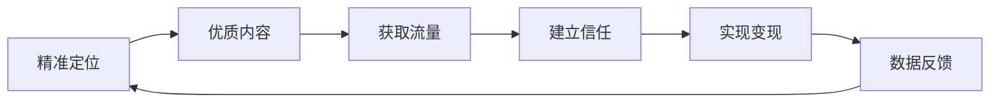
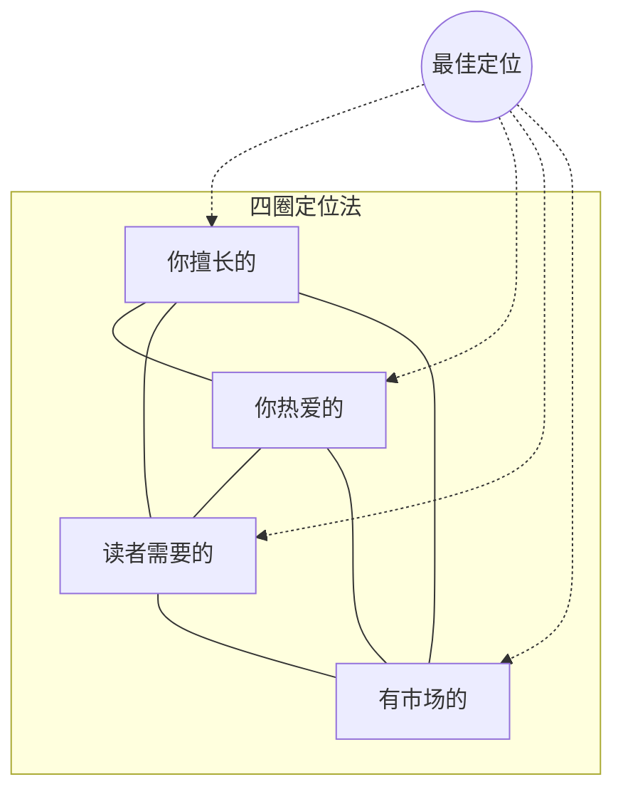

## 二、自媒体写作

自媒体写作的本质是**在注意力稀缺的环境中，通过持续输出有价值的内容，建立个人影响力并实现商业回报**。它与传统写作最大的区别在于：作者不仅是内容创作者，更是产品经理、运营人员和品牌管理者的综合体。一篇自媒体文章的成败，30%取决于写作本身，70%取决于选题、定位、分发和运营。

本节将从底层逻辑出发，系统讲解自媒体写作的完整方法论——从账号定位到内容规划，从标题开头的钩子设计到正文的结构化表达，从单平台深耕到多平台矩阵运营，从内容创作到数据优化，帮助你建立一套可复制、可迭代的自媒体写作体系。

### 2.1 自媒体写作的底层逻辑

#### 2.1.1 注意力经济的本质

赫伯特·西蒙在1971年就预言："信息的丰富意味着注意力的匮乏。"半个世纪后的今天，这个判断已经成为现实。根据QuestMobile的数据，2024年中国移动互联网用户日均使用时长约6.7小时，但被分配到数十个应用中，每个应用平均不到20分钟。在这20分钟里，用户要刷过数百条内容——你的文章只是其中一条。

这意味着自媒体写作的第一要务不是"写得好"，而是**"被看到"**。被看到需要满足三个条件：

| 条件 | 说明 | 影响环节 |
|------|------|----------|
| 曝光机会 | 平台算法推荐或粉丝触达 | 标题、封面、发布时间 |
| 点击意愿 | 用户在0.5秒内决定是否点击 | 标题、封面、账号权重 |
| 阅读完成 | 用户愿意花2-5分钟读完 | 开头、正文节奏、价值密度 |

很多写作者只关注第二个环节（写好标题），却忽略了第一个（算法是否推你）和第三个（内容是否撑得住）。这就是为什么"标题党"能获得点击却无法持续——它只解决了第二环，却透支了第三环的信任。

#### 2.1.2 自媒体写作与传统写作的核心差异

| 维度 | 传统写作 | 自媒体写作 |
|------|----------|------------|
| 读者关系 | 读者主动寻找内容 | 内容主动触达读者 |
| 反馈周期 | 出版后数月才能获得反馈 | 发布后数分钟即可看到数据 |
| 迭代速度 | 一次定稿，难以修改 | 可随时根据数据调整 |
| 成功标准 | 文学性、思想深度 | 阅读量、互动率、转化率 |
| 语言风格 | 正式、严谨、书面化 | 口语化、场景化、有个性 |
| 内容结构 | 长篇连续、层层递进 | 模块化、碎片化、可跳读 |
| 生产节奏 | 数月或数年磨一剑 | 周更甚至日更 |

理解这些差异至关重要。许多从传统写作转型的创作者失败的原因，不是写得不好，而是**用传统写作的思维做自媒体**——追求完美主义导致更新频率低，使用书面语导致读者疏远，忽视数据反馈导致方向偏离。

#### 2.1.3 自媒体写作的价值闭环

成功的自媒体写作遵循一个价值闭环：**定位→内容→流量→信任→变现→反馈→优化定位**。这个闭环每转一圈，你的账号价值就提升一层。

很多自媒体写作者在B→C环节卡住（内容不错但没有流量），或者在D→E环节卡住（有粉丝但无法变现）。这两个卡点分别对应内容分发能力和商业模式设计能力，后文将详细拆解。

### 2.2 账号定位：自媒体写作的地基

定位是自媒体写作中最重要的一步，它决定了你写什么、给谁写、怎么写。定位不清是90%自媒体账号失败的根本原因——不是因为写得差，而是因为不知道该写给谁。

#### 2.2.1 定位三要素

一个清晰的定位需要回答三个问题：

**你是谁？（人设定位）**
- 你的专业背景是什么？
- 你的独特经历是什么？
- 你想展示什么样的人格特质？

**写给谁？（受众定位）**
- 目标读者的年龄、职业、收入水平是什么？
- 他们有什么痛点和需求？
- 他们在哪些平台活跃？

**写什么？（内容定位）**
- 你能持续输出什么领域的内容？
- 这个领域是否有足够的受众？
- 你与同类创作者的差异化在哪里？

#### 2.2.2 定位的实操方法：四圈定位法

用四个圆圈取交集，找到你的最佳定位：

- **你擅长的**：你的专业技能、工作经历、知识积累
- **你热爱的**：你愿意持续投入时间精力的领域
- **读者需要的**：目标读者的痛点、困惑、成长需求
- **有市场的**：有人愿意为这个领域付费（课程、咨询、产品）

四个圈的交集就是你的最佳定位。如果某个圈不在交集中，就需要调整：擅长但不爱，容易放弃；爱但不擅长，需要学习；擅长且爱但没市场，只能当爱好；有市场但不擅长，需要先积累。

#### 2.2.3 垂直度与扩展策略

新手常见错误是"什么都写"——今天写职场，明天写美食，后天写情感。这会导致算法无法给你打标签，推荐流量极其分散。

**正确的做法是**：先垂直，后扩展。

| 阶段 | 策略 | 示例 |
|------|------|------|
| 冷启动期（0-1000粉） | 极度垂直，只写一个细分领域 | 只写"Excel数据透视表" |
| 成长期（1000-1万粉） | 适度扩展到相关子领域 | 扩展到"Excel数据分析" |
| 成熟期（1万粉以上） | 跨领域扩展，打造个人IP | 扩展到"职场效率工具" |

### 2.3 选题：决定80%流量的关键

自媒体行业有一句话："选题定生死。"同一个作者，好选题和差选题的阅读量可以相差100倍。选题能力是自媒体写作者最核心的竞争力。

#### 2.3.1 好选题的四个标准

| 标准 | 说明 | 判断方法 |
|------|------|----------|
| 受众广 | 关注这个话题的人足够多 | 搜索指数>1000，相关话题阅读量>10万 |
| 痛点强 | 读者有迫切的需求或困惑 | 评论区是否有人问类似问题 |
| 时效性 | 话题正在被关注和讨论 | 是否有热点事件关联 |
| 差异化 | 你能提供不同的角度或更深的见解 | 同类文章是否存在明显的认知空白 |

四个标准不需要全部满足，但至少要占两个。如果只有一个，除非那个维度特别强（比如超级热点的时效性），否则不值得写。

#### 2.3.2 选题的六大来源

**1. 热点事件**
- 工具：微博热搜、知乎热榜、百度指数、新榜
- 关键：不是追热点本身，而是从热点中提取与你定位相关的角度
- 时效：热点的黄金窗口通常是24-72小时

**2. 读者反馈**
- 评论区的提问和困惑
- 私信中的高频问题
- 同类账号评论区的热门讨论

**3. 搜索数据**
- 工具：5118、百度指数、站长工具、各平台搜索联想
- 方法：输入你的领域关键词，找到搜索量大但优质内容少的长尾词

**4. 竞品分析**
- 找到你的领域头部账号，分析他们阅读量最高的文章
- 不是抄袭，而是找到他们没覆盖的角度，或者用更好的方式重新诠释

**5. 个人经历**
- 你在工作生活中遇到的真实问题和解决方案
- 真实经历自带说服力，且不会与他人雷同

**6. 跨领域迁移**
- 将其他领域的方法论迁移到你的领域
- 例如：用"产品思维"写职场文章，用"游戏化思维"写学习方法

#### 2.3.3 选题矩阵：系统化管理选题

不要靠灵感写作，要建立选题矩阵。用一张表格管理你的选题库：

| 选题 | 来源 | 受众广度 | 痛点强度 | 时效性 | 差异化 | 总分 | 状态 |
|------|------|----------|----------|--------|--------|------|------|
| 示例选题A | 热点 | 9 | 7 | 10 | 6 | 32 | 本周发 |
| 示例选题B | 搜索 | 6 | 9 | 3 | 8 | 26 | 下周发 |
| 示例选题C | 读者 | 5 | 10 | 2 | 7 | 24 | 备用 |

每个维度1-10分，总分越高优先级越高。保持选题库中有至少20个备选选题，这样你永远不用担心"今天写什么"。

### 2.4 标题写作：0.5秒的生死之战

用户在信息流中决定是否点击一篇文章，平均只用0.5秒。这0.5秒里，标题承担了90%的决策权重。标题写作不是文学创作，而是一门**注意力工程**。

#### 2.4.1 标题的心理学原理

好的标题之所以有效，是因为它触发了人类大脑的特定心理机制：

**好奇心缺口（Curiosity Gap）**
当人们感知到"已知"和"未知"之间的差距时，会产生强烈的填补欲望。标题的任务就是制造这个缺口。

- 差："如何提高写作能力"（没有缺口，读者觉得已经知道答案）
- 好："为什么你的文章阅读量总是不超过500？答案不是你想的那样"（制造缺口，暗示常见认知是错的）

**损失厌恶（Loss Aversion）**
人们对"失去"的敏感度是"获得"的2倍。标题中暗示"不看会损失什么"比"看了会得到什么"更有效。

- 差："学会这5个技巧提升写作"（获得框架）
- 好："你的文章正在犯这5个错误，第3个90%的人都在犯"（损失框架）

**社会认同（Social Proof）**
人们倾向于跟随大多数人的行为。标题中暗示"很多人在这样做/关注"会增加点击率。

- 差："高效写作的方法"（无社会认同）
- 好："10万+作者都在用的写作框架，今天免费分享"（社会认同）

**具体性偏好（Concreteness）**
具体的信息比笼统的信息更可信、更有吸引力。

- 差："大幅提升你的写作水平"（笼统）
- 好："用这个方法，我一个月内把文章阅读量从200提升到8000"（具体）

#### 2.4.2 高点击率标题的12种公式

以下公式经过大量实践验证，按适用场景分类：

**数字型**
1. 数字+关键词+利益："7个写作技巧，让你的文章阅读量翻10倍"
2. 数字+对比+时间："从月入3000到年入50万，我只靠写作做对了这3件事"

**疑问型**
3. 直击痛点的反问："为什么你写了100篇文章，粉丝还是不到1000？"
4. 颠覆认知的设问："写作真的需要天赋吗？研究说不是这样的"

**对比型**
5. 人与人对比："写作高手和新手的区别，不在文笔，在这3个思维"
6. 前后对比："我换了写作方法后，同样内容阅读量从200涨到了2万"

**故事型**
7. 个人逆袭故事："辞职后靠写作月入3万，我的真实经历分享"
8. 他人故事启发："一个普通宝妈，靠公众号写作实现了财务自由"

**命令型**
9. 行动警告："停止这样写文章！你正在浪费90%的时间"
10. 行动号召："立即试试这个写作框架，你的下一篇文章就会不一样"

**好奇心型**
11. 悬念式："我花了3年才明白的写作真相，今天一次性说清楚"
12. 反常识式："写得越多，写作能力越差？这个观点有道理"

#### 2.4.3 标题优化的检查清单

写完标题后，用以下清单逐项检查：

- [ ] 字数是否在15-25字之间？（太短信息不足，太长在信息流中会被截断）
- [ ] 是否包含至少一个具体元素（数字、人名、场景）？
- [ ] 是否触发了至少一种心理机制（好奇心、损失厌恶、社会认同）？
- [ ] 是否与目标读者的痛点或利益直接相关？
- [ ] 标题承诺的内容，正文是否能兑现？（标题党的本质是承诺不兑现）
- [ ] 是否包含1-2个领域关键词？（利于搜索和算法推荐）
- [ ] 在手机屏幕上能否完整显示？（以微信公众号为例，标题超过约30个字会被截断）

#### 2.4.4 封面图与标题的协同

标题不是独立存在的，它与封面图共同构成用户的"第一印象"。两者需要协同设计：

- **互补而非重复**：封面图不要简单重复标题文字，而是提供标题未传达的信息
- **情绪一致性**：如果标题制造焦虑，封面图也应传递紧迫感；如果标题是轻松的，封面图也应明快
- **高对比度**：在手机小屏幕上，色彩对比度高的封面图更容易吸引注意力
- **人脸效应**：含有人脸的封面图点击率平均高出30-40%，因为人类大脑天生对人脸敏感

### 2.5 开头写作：3秒决定读者去留

即使标题成功吸引了点击，用户在开头的3秒内仍会决定是否继续阅读。数据显示，自媒体文章的平均跳出率高达60-70%，意味着超过一半的点击者只看了开头就离开了。

#### 2.5.1 开头的核心任务

开头只有一个任务：**让读者觉得"这篇文章跟我有关，我需要继续看下去"**。

实现这个任务的路径有两条：

- **制造共鸣**："这说的就是我！" → 读者觉得你理解他的处境
- **制造好奇**："这是怎么回事？" → 读者想知道答案

#### 2.5.2 七种经过验证的开头模板

**模板一：痛点场景法**

直接描绘读者正在经历的痛苦场景，让他产生"这就是在说我"的感觉。

> 你花了整整一个周末写了3000字的文章，精心配图、反复修改，满怀期待地点击发布。结果呢？24小时过去了，阅读量87，点赞3个，其中一个是你的小号。

**使用场景**：解决类、干货类文章
**效果**：共鸣感强，跳出率低

**模板二：反常识数据法**

用一个违反直觉的数据或事实开场，瞬间抓住注意力。

> 根据新榜的统计，2024年微信公众号的平均打开率已经跌到了1.2%。也就是说，你有1万粉丝，能有120人打开你的文章，就算及格了。

**使用场景**：行业分析、深度思考类文章
**效果**：权威感强，引发思考

**模板三：故事悬念法**

讲一个故事的开头，但不给结局，用悬念吊住读者。

> 三个月前，我的一个学员给我发了一条消息："老师，我按照你说的方法写了30篇文章，粉丝从200涨到了2万，今天有一家品牌找我投广告，给了我5000块。"我当时回了她四个字，她后来告诉我，这四个字比30篇文章加起来都重要。

**使用场景**：经验分享、方法论类文章
**效果**：完读率高，读者想知道那四个字是什么

**模板四：权威背书法**

引用权威人物、研究或机构的观点，快速建立可信度。

> 硅谷知名孵化器YC的创始人保罗·格雷厄姆说过一句话："写作就是思考。"他在一篇文章中解释，那些能清晰写作的创始人，获得投资的概率是其他人的3倍。

**使用场景**：观点类、认知升级类文章
**效果**：快速建立专业感

**模板五：直接提问法**

用一个直击痛点的问题开场，让读者不自觉地在脑中回答。

> 你有没有想过一个问题：为什么同样一个话题，有人写出来阅读量10万+，有人写出来只有两位数？差距到底在哪里？

**使用场景**：几乎适用所有类型
**效果**：参与感强，但用多了会显得套路化

**模板六：时间紧迫法**

制造时间压力，暗示"现在不看就来不及了"。

> 2024年下半年开始，各大平台的算法都在向"原创深度内容"倾斜。如果你还在用两年前的套路做自媒体，现在不调整，明年你会发现自己越来越难获得流量。

**使用场景**：趋势分析、策略调整类文章
**效果**：紧迫感强，适合引导行动

**模板七：对话体开场**

像跟朋友聊天一样自然地开始，降低读者的心理防线。

> 说实话，今天这篇文章我犹豫了很久要不要写。因为它会得罪一些人——特别是那些靠"教你写作"赚钱的课程贩子。但想了想，还是决定把真相说出来。

**使用场景**：观点类、揭秘类文章
**效果**：真实感强，容易建立信任

#### 2.5.3 开头的红线

以下开头方式会直接导致读者流失：

- **"大家好，我是XXX"**——读者不在乎你是谁，他们在乎你能给他们什么
- **冗长的背景铺垫**——"随着互联网的发展，自媒体行业日趋成熟……"这种开头在第10个字就已经流失了80%的读者
- **自我感动式的抒情**——"秋风起，落叶飘，又到了一年中最适合思考的季节"——这不是散文比赛
- **复制粘贴式的定义**——"自媒体是指普通大众通过网络发布自己事实和新闻的传播方式"——百度百科不需要你再写一遍

### 2.6 正文写作：让读者一路读到底

吸引读者点击并让他们读完开头只是开始。正文的任务是**持续提供价值，保持阅读节奏，最终传递核心信息**。自媒体文章的完读率直接影响平台的推荐算法——完读率越高，推荐越多。

#### 2.6.1 短段落原则：适应手机阅读的必然选择

超过85%的自媒体内容在手机上被阅读。手机屏幕的宽度只有约5-7厘米，大段文字在手机上会形成密不透风的"文字墙"，给读者造成强烈的压迫感。

**具体规则**：
- 每段不超过4行（手机屏幕上约4行）
- 一个段落只表达一个观点
- 段落之间留白，给读者"呼吸"的空间
- 关键句子单独成段，增强冲击力

对比示例：

❌ 反面：
> 自媒体写作需要关注内容质量，因为只有高质量的内容才能留住读者。同时，标题也很重要，因为标题决定了读者是否点击。另外，排版也不能忽视，好的排版能提升阅读体验。最后，互动也是关键，与读者互动能增加粉丝粘性。

✅ 正面：
> 自媒体写作有四个关键点。
>
> **第一是内容质量。** 没有质量，一切都是空中楼阁。
>
> **第二是标题。** 标题决定了那0.5秒的生死。
>
> **第三是排版。** 好的排版让读者愿意多停留30秒。
>
> **第四是互动。** 互动让粉丝变成朋友，让朋友变成铁粉。

#### 2.6.2 小标题系统：给读者一张导航地图

小标题的作用远不止"分割段落"。它是读者的导航系统——80%的读者会先扫描小标题，然后决定是否细读某个部分。

**小标题的写作原则**：

- **信息量>装饰性**：每个小标题都应传递实质信息，而不是"第一步""第二步"这种无意义的标记
- **逻辑连贯**：小标题之间应有递进或并列关系，让读者一眼看出文章的逻辑线
- **长度适中**：5-15个字为宜，太短没有信息量，太长影响扫描效率
- **统一风格**：全文的小标题应保持风格一致——要么都是陈述句，要么都是疑问句，不要混搭

对比示例：

❌ 差的小标题系统：
> 一、内容
> 二、标题
> 三、排版
> 四、推广

✅ 好的小标题系统：
> - 内容质量：决定读者是否愿意关注你的根本
> - 标题设计：0.5秒内决定生死的注意力博弈
> - 排版优化：让阅读体验从"痛苦"变成"享受"
> - 分发策略：好内容也需要对的渠道才能被看见

#### 2.6.3 价值密度：每一段都要让读者觉得"值"

自媒体读者的耐心极其有限。如果连续两段没有给读者任何新信息、新观点或新方法，他们就会离开。

**提升价值密度的方法**：

- **用数据替代形容词**：不说"效果很好"，说"转化率提升了47%"
- **用案例替代理论**：不说"这个方法很有效"，说"张三用了这个方法，一个月涨粉5000"
- **用工具替代泛泛而谈**：不说"可以用一些工具辅助"，说"推荐用5118查关键词热度，用新榜看竞品数据，用Canva做封面图"
- **用对比替代描述**：不说"这个方法比较好"，说"A方法需要3小时，效果60分；B方法只需30分钟，效果85分"

#### 2.6.4 内容结构的五种经典框架

**框架一：清单体（Listicle）**

结构：总论点 → 10个并列的分论点 → 总结

适用场景：技巧分享、工具推荐、经验总结
优点：结构清晰，阅读压力小，容易写出高阅读量
缺点：深度有限，容易流于表面

示例结构：
标题：10个让文章阅读量翻倍的写作技巧
├── 技巧1：XXX
├── 技巧2：XXX
├── ...
├── 技巧10：XXX
└── 总结：最重要的是哪3个

**框架二：问题-方案体（PAS）**

结构：痛点描述 → 分析原因 → 给出方案 → 行动指南

适用场景：解决具体问题的干货文章
优点：针对性强，读者获得感高
缺点：受众较窄，需要精准匹配痛点

**框架三：故事-道理体**

结构：引入故事 → 展开故事 → 揭示道理 → 延伸应用

适用场景：认知升级、思维启发类文章
优点：可读性强，完读率高
缺点：需要较强的叙事能力

**框架四：对比分析体**

结构：提出对比 → 逐维度分析 → 给出结论 → 行动建议

适用场景：选择困难型话题（A vs B）
优点：实用性强，容易引发讨论
缺点：可能得罪其中一方的支持者

**框架五：层层递进体**

结构：现象 → 原因 → 根本原因 → 解决方案 → 更深层的思考

适用场景：深度分析、行业洞察
优点：深度足够，容易建立专业形象
缺点：写作难度大，读者需要耐心

#### 2.6.5 视觉元素的运用

纯文字的自媒体文章在2024年已经很难获得好的数据表现。视觉元素不是"锦上添花"，而是"必要组成"。

**图片的使用原则**：
- 每300-500字至少配一张图
- 信息型图片（图表、对比图、流程图）比装饰型图片更有价值
- 图片风格要统一，不要一篇文章里用5种不同风格的配图
- 图片上不要加太多文字水印，会影响阅读体验

**表格的使用场景**：
- 对比两个或多个事物的优劣
- 呈现结构化的数据
- 整理清单和要点

**代码块/引用框的使用场景**：
- 引用他人的话或文章
- 展示具体的操作步骤
- 突出关键信息

### 2.7 结尾写作：让读者带走行动

结尾不是文章的"收尾工作"，而是你影响读者的最后机会。一个好的结尾应该让读者感到"这篇文章没有白读"，并愿意采取某个行动。

#### 2.7.1 结尾的四个核心功能

| 功能 | 说明 | 适用场景 |
|------|------|----------|
| 强化记忆 | 用一句话概括全文核心观点 | 干货类文章 |
| 引导行动 | 告诉读者看完文章后具体该做什么 | 教程类文章 |
| 引发互动 | 提出问题或话题，引导评论 | 观点类文章 |
| 引导关注 | 自然地引导读者关注或转发 | 涨粉导向的文章 |

#### 2.7.2 高效结尾的五种模式

**模式一：金句总结+行动号召**

> 写作这件事，天赋决定上限，但方法决定下限。与其等待灵感降临，不如现在就打开电脑，用今天分享的框架写下你的第一段。记住：完成永远比完美更重要。

**模式二：回顾清单**

> 今天我们讲了5个关键点：
> 1. 选题要用数据而非直觉
> 2. 标题要制造好奇心缺口
> 3. 开头要在3秒内建立关联
> 4. 正文要保持每段都有价值
> 5. 结尾要引导读者行动
>
> 建议收藏这篇文章，下次写作时对照检查。

**模式三：开放性问题**

> 这些方法不一定适合所有人，写作终究是个人的事。你在写作中遇到的最大困难是什么？欢迎在评论区告诉我，我会选择高频问题写一篇专门的解答。

**模式四：预告**

> 今天我们讲了文章的结构和写法，下一篇文章我会分享一个完整的写作工作流——从选题到发布，从数据复盘到内容迭代，全程可复制。关注我，不要错过。

**模式五：情感共鸣**

> 写作是一条孤独的路。你可能会写了很多篇却没有人看，可能会收到恶意的评论，可能会怀疑自己到底行不行。但请相信：每一个持续写作的人，最终都会被看见。你只需要坚持。

#### 2.7.3 结尾的常见错误

- **突然结束**：没有任何收尾，观点说到一半就停了——读者会感觉被抛弃
- **重复啰嗦**：把正文的内容换个说法又讲一遍——浪费读者时间
- **强行升华**：本来是一篇实用文章，结尾突然变成"让我们一起为梦想奋斗"——文不对题
- **过度推销**：结尾变成广告——"快来买我的课程！"——读者会觉得被利用

### 2.8 不同平台的深度写作策略

每个自媒体平台都有独特的内容生态、用户群体和推荐算法。用同一套内容策略打所有平台，效果必然大打折扣。以下是主流平台的深度写作策略。

#### 2.8.1 微信公众号

**平台特征**：
- 用户画像：25-45岁为主，职场人士占比高，消费能力强
- 内容偏好：深度长文、行业分析、实用干货
- 分发机制：社交推荐（朋友圈转发、在看）为主，搜一搜为辅
- 变现路径：广告、课程、社群、知识付费

**写作策略**：

- **文章长度**：2000-5000字为最佳区间，太短没有深度，太长完读率下降
- **标题技巧**：公众号标题在朋友圈和聊天中的显示最多约30个字，关键信息要放在前20个字
- **开头设计**：公众号的"折叠线"（即需要点击"展开全文"的位置）是关键节点，折叠线之前的内容要足够吸引人
- **排版规范**：正文16px，注释14px，行间距1.75-2倍，段间距留空一行，颜色不超过3种
- **引导关注**：在文章中间和末尾设置关注引导，不要只在文末放一次
- **原创声明**：一定要开原创，这影响搜一搜的排名和赞赏功能

#### 2.8.2 知乎

**平台特征**：
- 用户画像：大学生和高学历职场人为主，理性、求知欲强
- 内容偏好：深度分析、专业知识、真实经验
- 分发机制：问答排名（赞同数、专业度）+ 推荐流
- 变现路径：知+（付费推广）、好物推荐、盐选专栏

**写作策略**：

- **选题策略**：知乎的核心是"问答"，找到高浏览量、低质量回答的问题去回答，是最高效的流量获取方式
- **开头设计**：知乎回答没有"折叠线"，但回答列表只显示前两行，这两行决定了是否被展开
- **专业感**：知乎用户厌恶浅薄的内容，喜欢有理有据的分析。多用数据、引用、逻辑推理
- **格式规范**：善用加粗、引用框、分割线，但不要过度花哨
- **长尾效应**：知乎回答的长尾流量非常强，一个好回答可以持续获得流量数月甚至数年
- **避免营销感**：知乎用户对广告极度敏感，任何营销痕迹都会被举报和攻击

#### 2.8.3 小红书

**平台特征**：
- 用户画像：18-35岁女性为主，消费决策入口
- 内容偏好：生活方式、美妆、穿搭、学习、职场
- 分发机制：双列信息流+搜索推荐
- 变现路径：品牌合作、商品橱窗、薯店

**写作策略**：

- **封面图是王**：小红书是"封面图决定一切"的平台，封面图的好坏直接决定点击率。封面图上要有大字标题，色彩鲜明，信息明确
- **标题写法**：小红书标题上限20个字，要善用emoji（📱✨💡）增加视觉吸引力。标题公式："数字+情绪词+关键词"，例如"5个神器💡让你的学习效率翻3倍"
- **正文风格**：口语化、亲切、有个人感。不要用长段落，多用emoji分隔内容。开头用一句话总结核心价值
- **标签策略**：每篇笔记带5-10个标签，包含大标签（#学习方法，百万级）和小标签（#考研英语学习法，万级），大标签获得曝光，小标签降低竞争
- **搜索优化**：小红书的搜索流量占比高达30-40%，标题和正文中要自然包含用户可能搜索的关键词

#### 2.8.4 B站专栏

**平台特征**：
- 用户画像：18-30岁为主，二次元文化浓厚，Z世代聚集地
- 内容偏好：科技、游戏、动画、知识科普、生活分享
- 分发机制：推荐流+搜索+动态
- 变现路径：创作激励、充电、花火商单

**写作策略**：

- **语言风格**：B站用户喜欢有个性的表达，可以使用网络梗、弹幕文化用语，但不要刻意，自然就好
- **图文并茂**：B站专栏支持插入图片、视频引用、表情包，充分利用这些功能增加趣味性
- **与视频联动**：如果你同时做视频，可以在专栏中嵌入视频，或者为视频出文字版专栏，互相引流
- **专栏标题**：B站专栏在推荐流中显示为卡片，标题+封面图决定了点击
- **互动引导**：B站用户互动意愿强，在文末设置讨论话题，能获得大量评论

#### 2.8.5 今日头条/百家号

**平台特征**：
- 用户画像：30-50岁为主，下沉市场用户比例高
- 内容偏好：时事热点、生活实用、情感故事、历史军事
- 分发机制：纯算法推荐（社交关系弱）
- 变现路径：广告分成、青云计划、付费专栏

**写作策略**：

- **标题最重要**：头条系是纯算法推荐，标题中关键词决定了推荐给谁
- **内容通俗**：不要用太多专业术语和书面语，像跟邻居聊天一样写
- **适当"标题党"**：头条用户对标题党的容忍度相对较高，但不能过度，否则会被限流
- **高频更新**：头条算法偏爱高频更新的账号，日更效果明显优于周更
- **首发优势**：头条对原创内容有明显的流量倾斜，一定要声明原创

### 2.9 内容规划：从随机写作到系统运营

随机写作是自媒体最大的陷阱——今天想到什么写什么，没有节奏，没有规划，没有积累。成功的自媒体账号都需要一套系统化的内容规划。

#### 2.9.1 内容日历

内容日历是自媒体运营的基本工具。它帮助你提前规划一周甚至一个月的内容，避免临时抱佛脚。

**周更节奏示例**（适合兼职自媒体人）：

| 日期 | 内容类型 | 说明 |
|------|----------|------|
| 周一 | 确定选题 | 确定本周选题，开始收集素材 |
| 周二-周三 | 撰写初稿 | 完成初稿 |
| 周四 | 修改润色 | 修改排版、配图、校对 |
| 周五 | 发布+互动 | 发布文章，回复评论 |
| 周六 | 数据复盘 | 分析上周文章数据 |
| 周日 | 储备选题 | 为下周储备3-5个备选选题 |

**内容类型配比建议**：

| 内容类型 | 占比 | 目的 |
|----------|------|------|
| 干货教程 | 40% | 建立专业度，吸引精准粉丝 |
| 观点评论 | 20% | 展示思考深度，引发讨论 |
| 故事案例 | 20% | 提高可读性和传播力 |
| 热点追踪 | 10% | 蹭流量，提高曝光 |
| 个人分享 | 10% | 建立人设，增加信任感 |

#### 2.9.2 内容复利：一篇文章的七种用法

高质量的内容创作成本很高，但可以通过"内容复利"最大化每篇文章的回报：

1. **原文发布**到主平台（如公众号）
2. **改写为短文**发布到小红书/微博
3. **提炼要点**发布到知乎回答
4. **录制音频**发布到播客平台
5. **制作短视频**发布到B站/抖音
6. **整理合集**做成电子书或课程素材
7. **沉淀为知识库**用于内部学习和团队共享

一篇3000字的深度文章，经过以上七种转化，可以覆盖7个不同的平台和受众群体。这就是"一次创作，多次分发"的内容矩阵思维。

### 2.10 数据分析与持续优化

自媒体写作不是"写了发了就完了"，每一次发布都是一次实验，数据就是实验结果。通过分析数据，你可以不断优化写作策略。

#### 2.10.1 核心数据指标

| 指标 | 含义 | 健康值（参考） |
|------|------|----------------|
| 打开率 | 看到标题后点击的比例 | 公众号>3%，头条>5% |
| 完读率 | 点击后读完全文的比例 | >30% |
| 互动率 | 点赞+评论+转发/阅读量 | >3% |
| 转发率 | 转发数/阅读量 | >1% |
| 关注转化率 | 新增关注/阅读量 | >2% |
| 取关率 | 取消关注/总粉丝数 | <1%/篇 |

#### 2.10.2 数据复盘方法

每篇文章发布后24小时、72小时、7天各做一次数据记录，然后按以下维度分析：

**标题维度**：
- 对比不同标题公式的打开率
- 找出你的受众对哪种标题类型最敏感

**内容维度**：
- 对比不同内容结构的完读率
- 找出读者流失最多的段落，分析原因

**发布时间维度**：
- 对比不同时间段发布的数据表现
- 找到你的受众最活跃的时间窗口

**平台维度**：
- 同一内容在不同平台的数据差异
- 识别每个平台的最优内容类型

#### 2.10.3 AB测试：用实验代替猜测

AB测试是优化内容的最科学方法。每次只改变一个变量，其他保持不变，观察数据变化：

- **标题AB测试**：同一内容，两个不同标题，看哪个打开率更高
- **开头AB测试**：同一主题，两种不同开头方式，看哪个完读率更高
- **发布时间AB测试**：同一类型内容，不同时间发布，看哪个数据更好
- **内容长度AB测试**：同一主题，长短两个版本，看哪个互动率更高

需要注意的是，AB测试需要足够的样本量。至少需要10-20组对比数据才能得出可靠结论，不要因为一两次的结果就下定论。

### 2.11 自媒体写作的变现路径

自媒体写作最终需要落地到变现，否则只能是"为爱发电"。以下是主流的变现方式，按难度从低到高排列：

#### 2.11.1 平台分成

| 平台 | 分成方式 | 门槛 | 收益参考 |
|------|----------|------|----------|
| 今日头条 | 广告分成 | 无 | 千次阅读1-5元 |
| 百家号 | 广告分成 | 百家号指数>500 | 千次阅读2-8元 |
| 公众号 | 流量主 | 500粉丝 | 千次阅读1-3元 |
| B站 | 创作激励 | 1000粉丝+ | 千次播放3-10元 |

平台分成是最基础的变现方式，收入与阅读量直接挂钩，但单位收益较低。适合以量取胜的策略。

#### 2.11.2 广告合作

当你的账号有了一定的粉丝基础和影响力，品牌方会主动找你投放广告。

- **报价参考**：公众号头条广告 ≈ 粉丝数×0.5-2元（取决于领域和互动率）
- **关键原则**：只接与你定位相关的广告，不要为了钱接任何广告——这会伤害粉丝信任
- **内容融合**：好的广告不是"硬广"，而是将产品自然融入到有价值的内容中

#### 2.11.3 知识付费

当你在某个领域建立了足够的专业信任，就可以推出付费产品：

- **付费专栏/课程**：将你的系列文章系统化为课程，定价99-999元
- **付费社群**：建立微信群或知识星球，提供持续的内容和互动服务
- **一对一咨询**：提供个性化的写作指导或行业建议

知识付费的关键是：**免费内容证明你有能力，付费内容提供更深的价值**。免费文章是"展示肌肉"，付费内容是"手把手教"。

#### 2.11.4 电商带货

通过推荐商品获取佣金，适合有"种草"能力的创作者：

- **小红书好物推荐**：直接在笔记中推荐商品
- **公众号返佣商品**：在文章中插入返佣商品链接
- **抖音/快手橱窗**：短视频/直播带货

### 2.12 自媒体写作的常见误区

#### 误区一：追求完美才发布

很多写作者一篇文章改了又改，总觉得"还不够好"，结果一个月也发不了一篇。在自媒体领域，**完成比完美重要100倍**。发布后的数据反馈比你自己的反复修改更有价值——因为只有用户才能告诉你什么是对的。

**纠正方法**：设定硬性发布截止时间。如果文章达到了80分，就发布出去。10篇80分的文章带来的成长，远大于1篇100分的文章。

#### 误区二：只管写，不管数据

"我是创作者，不是运营。"这种想法会让你的努力付诸东流。数据是读者用行为给你的反馈，忽视数据就是忽视读者。

**纠正方法**：每篇文章发布后记录核心数据（打开率、完读率、互动率），每周做一次数据复盘，每月做一次内容策略调整。

#### 误区三：盲目追热点

热点确实能带来流量，但盲目追热点会导致三个问题：一是内容与定位不匹配，吸引来不精准的粉丝；二是为了赶时效而牺牲内容质量；三是热点过后流量断崖式下降。

**纠正方法**：只追与你定位相关的热点，并且用你的专业角度解读热点，而不是简单复述热点事件。

#### 误区四：抄袭或洗稿

有些人为了快速产出内容，直接复制他人的文章做简单修改。短期看似省时省力，长期一定会翻车——平台的查重机制越来越严格，一旦被标记为抄袭，账号权重会大幅下降。

**纠正方法**：学习和借鉴是允许的，但核心观点必须是你自己的，案例必须是你自己经历或调研的，表达必须是你自己的语言。

#### 误区五：忽视评论区运营

很多人发完文章就不管了，评论区从来不回复。这是巨大的浪费——评论区是建立粉丝关系、了解读者需求的最直接渠道。

**纠正方法**：发布后的前2小时内，认真回复每一条评论。这不仅增加互动数据（有利于算法推荐），还能让读者感到被重视，从而提升粉丝粘性。

### 2.13 自媒体写作工具箱

| 类别 | 工具 | 用途 |
|------|------|------|
| 选题调研 | 5118、新榜、百度指数、微信指数 | 关键词热度分析、竞品分析 |
| 写作工具 | Notion、语雀、飞书文档、Typora | 内容创作和管理 |
| 排版工具 | 135编辑器、秀米、壹伴 | 公众号排版美化 |
| 封面设计 | Canva、稿定设计、创客贴 | 封面图和配图制作 |
| 图片素材 | Unsplash、Pexels、Pixabay | 免费商用图片 |
| 数据分析 | 公众号后台、知乎创作者中心、新榜 | 内容数据分析 |
| AI辅助 | ChatGPT、文心一言、Kimi | 辅助选题、大纲生成、文案润色 |
| 多平台分发 | 蚁小二、简媒 | 一键多平台发布 |

### 2.14 进阶：从写作者到内容品牌

当你的自媒体写作已经形成稳定的输出节奏和读者基础后，下一步是**从"写作者"进化为"内容品牌"**。

#### 2.14.1 内容品牌的标志

- 读者看到标题就知道是你写的（风格辨识度）
- 有人因为你的名字而点击文章（品牌信任度）
- 其他创作者引用你的观点（行业影响力）
- 品牌方主动找你合作（商业价值）

#### 2.14.2 从个人到品牌的三个跃迁

**跃迁一：从"写文章"到"输出方法论"**

不要只写"怎么做"，要总结出"为什么这样做"背后的原理，形成自己的方法论体系。有了方法论，你写的内容才有"根"，读者才能从你的内容中看到一个完整的知识体系，而不是散落的知识点。

**跃迁二：从"一个人写"到"团队化运营"**

当内容需求超过个人产能时，需要建立团队。核心写手负责关键内容，助理负责排版、配图、分发、数据记录等辅助工作。

**跃迁三：从"内容输出"到"生态构建"**

最终目标是围绕你的内容品牌构建一个生态：免费文章引流→付费课程深度服务→社群持续互动→线下活动建立真实连接。这个生态让"自媒体写作"从一个副业变成一门可持续的事业。

***

> 自媒体写作的终极竞争不是文笔的竞争，而是**认知的竞争**。你对读者需求的理解深度、对平台规则的把握精度、对内容策略的执行力度，决定了你能走多远。写作技巧可以学，但对用户的洞察只能靠持续的实践和思考来培养。从今天开始，写第一篇，然后是第二篇，然后是第一百篇——量变终会带来质变。
