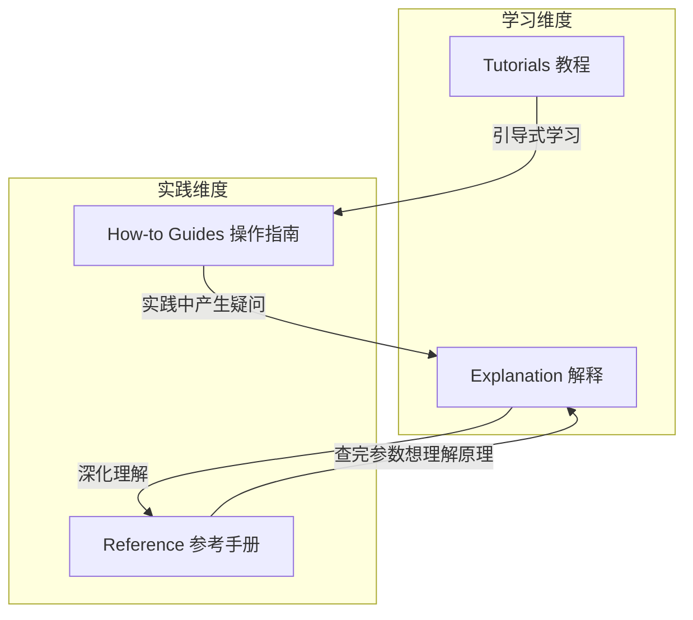
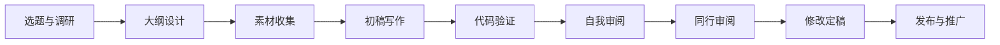
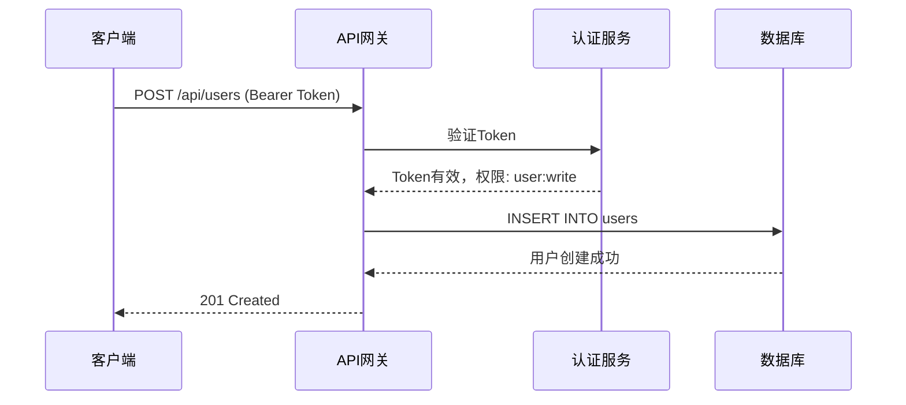
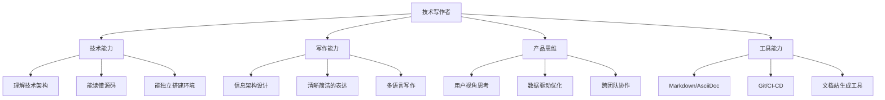
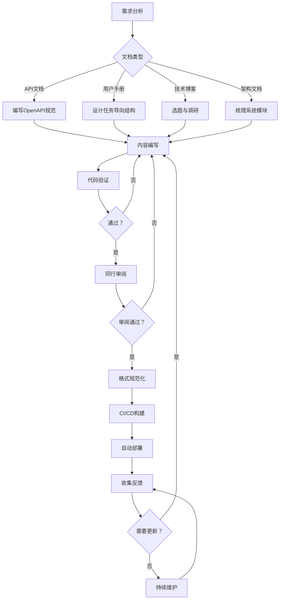

## 三、技术写作

技术写作（Technical Writing）是将复杂的技术知识转化为目标读者可理解、可执行的文档的专业活动。它不是"把技术翻译成人话"这么简单——技术写作的核心挑战在于：**在信息的准确性与可理解性之间找到精确的平衡点**。

一个常见的误解是把技术写作等同于"写说明书"。事实上，技术写作覆盖的范围远比这广：从一份只有3行的API错误码说明，到长达数百页的系统架构设计文档；从面向初中生的编程入门教程，到面向资深工程师的内核模块开发指南——它们都属于技术写作的范畴，但写作策略完全不同。

本章将从底层原理出发，系统覆盖技术写作的核心方法论、主要文档类型、写作流程、工具链和进阶技巧。

### 3.1 技术写作的本质与认知框架

#### 3.1.1 技术写作的定义

技术写作是**以解决用户特定技术问题为目标**的写作活动。它与普通写作的核心区别在于：

| 维度 | 普通写作 | 技术写作 |
|------|----------|----------|
| 目标 | 传达观点、引发情感共鸣 | 帮助读者完成任务或理解概念 |
| 评判标准 | 读者觉得好 | 读者能用它解决问题 |
| 语言风格 | 允许模糊、留白、隐喻 | 要求精确、无歧义、可验证 |
| 信息密度 | 可以铺垫、起承转合 | 直奔主题，每一句都有用 |
| 更新频率 | 通常定稿后不再修改 | 需要随产品迭代持续更新 |

一个简单的检验标准：**如果读者按照你的文档操作，能否在不求助任何人的情况下完成任务？** 如果能，就是好的技术写作；如果不能，就需要改进。

#### 3.1.2 技术写作的受众分析

技术写作最重要的第一步不是动笔，而是搞清楚"写给谁看"。同一个功能的文档，面向不同读者需要完全不同的写法。

**受众分层模型**：

Level 0：非技术用户
  特征：不懂编程，不知道什么是API
  需求：操作步骤、截图、术语解释
  语言：避免一切技术术语，用类比解释

Level 1：初级开发者
  特征：会基础编程，不熟悉你的产品
  需要：快速入门、Hello World、基本概念
  语言：简化术语+内联解释

Level 2：中级开发者
  特征：熟悉你的产品，需要深入使用
  需要：完整API参考、最佳实践、性能指南
  语言：标准技术语言，术语不解释

Level 3：高级开发者/架构师
  特征：深度使用者，可能贡献代码
  需要：架构设计、扩展机制、源码级文档
  语言：专业术语+内部概念

**实操建议**：在写每一节内容之前，先明确目标读者是哪个Level。一个常见错误是在同一篇文档里混杂多个Level的内容——要么让初级读者看不懂，要么让高级读者觉得啰嗦。

解决方法是**分层文档结构**（Progressive Disclosure）：

- 入门篇（Quickstart）：面向 Level 0-1，5分钟能跑通
- 指南篇（Guides）：面向 Level 1-2，按任务组织
- 参考篇（Reference）：面向 Level 2-3，按功能模块组织
- 深度篇（Deep Dive）：面向 Level 3，架构与设计决策

#### 3.1.3 技术写作的核心原则

**原则一：准确性——宁可不写，不可写错**

技术文档中的一个错误可能导致：用户在生产环境执行错误操作、开发者集成错误的参数格式、安全漏洞因错误的配置指导而暴露。准确性是技术文档的生命线。

确保准确性的具体方法：

1. **实操验证**：文档中的每一步操作都要亲手执行一遍。不是"应该能跑通"，而是"我刚刚跑通了"
2. **版本锁定**：明确标注文档适用的产品版本、操作系统版本、依赖库版本
3. **代码即文档**：能用代码示例说明的，不要只用文字描述
4. **同行审阅**：让其他工程师审阅技术细节的正确性
5. **持续更新**：产品更新时，文档必须同步更新。建立"代码变更必须附带文档更新"的机制

**原则二：清晰性——让读者不用猜**

清晰性不是"写得简单"，而是**让读者在阅读时不需要做任何多余的推理**。

❌ 不清晰：
  "配置服务器参数以优化性能。"

✅ 清晰：
  "编辑 /etc/app/config.yaml，将 max_workers 从默认值 4 修改为 CPU 核心数。
   例如，8核服务器设置为：
   max_workers: 8
   修改后执行 systemctl restart app 使配置生效。"

实现清晰性的关键方法：

- **一个段落只说一件事**。如果一个段落里有两个独立的信息点，拆成两段
- **先说结论，再解释原因**。技术文档不是悬疑小说
- **使用具体数字而非模糊描述**。"响应时间应低于200ms"优于"响应时间应较短"
- **避免双重否定**。"不设置此参数不会导致错误"→"此参数为可选参数，省略不影响功能"
- **代词要明确**。不要出现"它会将其发送给它"这种句子

**原则三：完整性——不遗漏任何必要信息**

完整性的标准是：读者按照文档操作，不需要在其他地方查找补充信息。

一个完整的操作步骤应包含：

```markdown
## 前提条件
- 操作系统：Ubuntu 22.04 LTS
- 已安装 Docker 24.0+
- 至少 4GB 可用内存

## 操作步骤

### 步骤1：拉取镜像
docker pull myapp:2.1.0

预期输出：
2.1.0: Pulling from myapp
Digest: sha256:abc123...
Status: Downloaded newer image for myapp:2.1.0

### 步骤2：启动容器
docker run -d -p 8080:8080 --name myapp myapp:2.1.0

参数说明：
  -d：后台运行
  -p 8080:8080：端口映射（主机端口:容器端口）
  --name myapp：容器名称

预期输出：
f7a8b9c0d1e2...

## 验证
curl http://localhost:8080/health
预期返回：{"status":"ok"}

## 常见问题
问题：端口被占用
解决：执行 lsof -i :8080 查看占用进程，停止后重试

问题：镜像拉取失败
解决：检查网络连接，或配置镜像仓库地址（参见3.2节）
```

注意上面这个例子包含了**前提条件、步骤、参数说明、预期输出、验证方法、常见问题**——这就是完整性。

**原则四：一致性——同一个东西只用一个名字**

不一致是技术文档的隐形杀手。如果同一个功能在文档A里叫"工作流"，在文档B里叫"流程"，在文档C里叫"Pipeline"，读者会以为它们是三个不同的东西。

确保一致性的方法：

1. **建立术语表（Glossary）**：团队共享的术语权威来源
2. **命名规范**：参数名大小写、文件路径格式、命令格式统一
3. **结构模板**：同类文档使用相同结构，降低认知负担
4. **代码示例风格**：变量命名、注释风格、错误处理方式一致

```markdown
<!-- 术语表示例 -->
| 术语 | 英文 | 定义 | 不可接受的替代用法 |
|------|------|------|-------------------|
| 工作流 | Workflow | 由多个任务节点组成的自动化执行序列 | 流程、Pipeline、任务链 |
| 任务节点 | Task Node | 工作流中的单个执行步骤 | 步骤、Stage、Action |
| 触发器 | Trigger | 启动工作流执行的条件或事件 | 钩子、Hook、Event |
```

### 3.2 技术文档的信息架构

信息架构（Information Architecture, IA）决定了文档的组织方式。好的信息架构让用户能快速找到需要的信息；差的信息架构让用户的每一次查找都像在迷宫里摸索。

#### 3.2.1 Diátaxis文档框架

Diátaxis 是由 Daniele Procida 提出的技术文档信息架构模型，被 Django、Read the Docs 等众多项目采用。它将所有技术文档划分为四种类型：



**四种文档类型详解**：

| 类型 | 目的 | 特征 | 类比 |
|------|------|------|------|
| **Tutorial（教程）** | 教会新手 | 有明确起点和终点，手把手引导 | 课堂实验 |
| **How-to Guide（操作指南）** | 解决具体问题 | 步骤清晰，假设读者已有基础 | 烹饪食谱 |
| **Reference（参考手册）** | 查阅信息 | 结构化、无遗漏、无废话 | 字典 |
| **Explanation（解释）** | 增进理解 | 讨论背景、原理、设计决策 | 教科书章节 |

**为什么这个框架重要？** 因为它解决了一个极其常见的问题：**混合文档**。很多技术文档把教程写成了参考手册（干巴巴的参数列表），或者把参考手册写成了教程（混入大量引导性语言）。当你清楚自己在写哪种类型的文档时，写作目标和风格就有了明确的指引。

#### 3.2.2 文档导航设计

用户到达你的文档后，需要在3秒内知道"我要找的东西在哪里"。

**有效的导航结构**：

```yaml
文档站结构:
  快速入门:           # Tutorial - 30分钟跑通
    - 安装部署
    - 第一个应用
    - 核心概念速览

  使用指南:           # How-to - 按任务组织
    - 数据接入
      - 从MySQL导入
      - 从Kafka消费
      - 从API推送
    - 数据查询
      - 基础查询语法
      - 聚合查询
      - 联表查询
    - 运维管理
      - 备份恢复
      - 监控告警
      - 升级迁移

  API参考:            # Reference - 按模块组织
    - REST API
    - SDK
    - CLI命令
    - 配置参数

  架构与设计:          # Explanation - 按主题组织
    - 整体架构
    - 存储引擎原理
    - 查询优化器
    - 分布式一致性
```

**导航设计原则**：

1. **面包屑导航**：让用户随时知道自己在哪里，以及如何返回上一级
2. **搜索优先**：超过20个页面的文档站必须有搜索功能
3. **交叉引用**：相关文档之间建立链接，形成知识网络
4. **固定入口**：快速入门、API参考等高频页面放在最显眼位置
5. **不超过3层深度**：用户到达任何页面的点击次数不超过3次

### 3.3 API文档写作

API文档是开发者最常使用的技术文档类型。根据 Postman 的调查，约 60% 的开发者将"糟糕的API文档"列为集成第三方API时的最大痛点。

#### 3.3.1 API文档的结构

一份完整的API文档应包含以下层次：

```yaml
API文档结构:
  概述:
    - API的定位和核心能力
    - 适用场景
    - 技术架构概览

  认证与授权:
    - 支持的认证方式（API Key / OAuth2.0 / JWT）
    - 获取凭证的步骤
    - Token刷新机制
    - 权限范围说明

  快速入门:
    - 最简请求示例（cURL + 3种SDK）
    - 5分钟跑通第一个API调用

  端点参考:
    - 每个端点包含:
      - HTTP方法 + URL
      - 功能说明
      - 请求头（Headers）
      - 路径参数（Path Parameters）
      - 查询参数（Query Parameters）
      - 请求体（Request Body）- 含Schema
      - 响应体（Response Body）- 含Schema
      - 状态码 + 错误码
      - 请求/响应示例
      - 限流说明

  错误处理:
    - 错误码对照表
    - 常见错误排查
    - 重试策略建议

  SDK与工具:
    - 各语言SDK安装和使用
    - CLI工具
    - Postman集合

  变更日志:
    - 版本更新记录
    - 破坏性变更说明
    - 废弃API时间表
```

#### 3.3.2 OpenAPI规范实战

OpenAPI Specification（OAS）是描述REST API的标准格式，已成为行业事实标准。以下是一个完整的示例：

```yaml
openapi: 3.1.0
info:
  title: 用户管理API
  description: |
    提供用户的增删改查功能。
    所有接口需要通过 Bearer Token 认证。
  version: "2.0.0"
  contact:
    name: API支持团队
    email: api-support@example.com

servers:
  - url: https://api.example.com/v2
    description: 生产环境
  - url: https://staging-api.example.com/v2
    description: 测试环境

paths:
  /users/{user_id}:
    get:
      summary: 获取用户详情
      description: |
        根据用户ID获取用户的详细信息。
        需要 `user:read` 权限。
      operationId: getUser
      tags:
        - 用户管理
      parameters:
        - name: user_id
          in: path
          required: true
          description: 用户唯一标识
          schema:
            type: string
            format: uuid
          example: "a1b2c3d4-e5f6-7890-abcd-ef1234567890"
        - name: fields
          in: query
          required: false
          description: 指定返回的字段，逗号分隔
          schema:
            type: string
          example: "name,email,created_at"
      responses:
        "200":
          description: 查询成功
          content:
            application/json:
              schema:
                $ref: "#/components/schemas/User"
              example:
                id: "a1b2c3d4-e5f6-7890-abcd-ef1234567890"
                name: "张三"
                email: "zhangsan@example.com"
                created_at: "2024-01-15T08:30:00Z"
        "401":
          $ref: "#/components/responses/Unauthorized"
        "404":
          $ref: "#/components/responses/NotFound"

components:
  securitySchemes:
    bearerAuth:
      type: http
      scheme: bearer
      bearerFormat: JWT

  schemas:
    User:
      type: object
      required: [id, name, email]
      properties:
        id:
          type: string
          format: uuid
          description: 用户唯一标识
        name:
          type: string
          description: 用户姓名
          minLength: 1
          maxLength: 100
        email:
          type: string
          format: email
          description: 用户邮箱
        created_at:
          type: string
          format: date-time
          description: 创建时间（UTC）

  responses:
    Unauthorized:
      description: 未认证或Token无效
      content:
        application/json:
          example:
            error: "unauthorized"
            message: "缺少有效的认证凭证"
    NotFound:
      description: 资源不存在
      content:
        application/json:
          example:
            error: "not_found"
            message: "用户不存在"

security:
  - bearerAuth: []
```

写好OpenAPI规范后，可以自动生成交互式文档（Swagger UI / Redoc）、SDK代码、Mock服务器、自动化测试——这就是"规范即文档"的威力。

#### 3.3.3 API文档的可运行示例

"可运行"是好API文档和差API文档的分水岭。用户不应该在读完文档后还需要猜测"这段代码到底怎么跑"。

**多语言示例模板**：

以"创建用户"为例，应至少覆盖3种语言：

````markdown
=== "cURL"

    ```bash
    curl -X POST https://api.example.com/v2/users \
      -H "Authorization: Bearer YOUR_API_KEY" \
      -H "Content-Type: application/json" \
      -d '{
        "name": "张三",
        "email": "zhangsan@example.com"
      }'
    ```

=== "Python"

    ```python
    import requests

    response = requests.post(
        "https://api.example.com/v2/users",
        headers={"Authorization": "Bearer YOUR_API_KEY"},
        json={
            "name": "张三",
            "email": "zhangsan@example.com"
        }
    )
    print(response.json())
    ```

=== "JavaScript"

    ```javascript
    const response = await fetch("https://api.example.com/v2/users", {
      method: "POST",
      headers: {
        "Authorization": "Bearer YOUR_API_KEY",
        "Content-Type": "application/json"
      },
      body: JSON.stringify({
        name: "张三",
        email: "zhangsan@example.com"
      })
    });
    const data = await response.json();
    console.log(data);
    ```
````

每个示例必须满足三个条件：**可复制粘贴即用**（不需要读者自己填参数）、**有预期输出**（读者知道成功长什么样）、**包含错误处理**（读者知道失败长什么样）。

### 3.4 用户手册写作

#### 3.4.1 任务导向 vs 功能导向

用户手册最常见的错误是**按功能组织**——"功能A说明"、"功能B说明"。但用户的心理模型是**按任务组织**——"我怎么创建一个新项目"、"我怎么导出报表"。

❌ 功能导向（开发者视角）：
  第1章：用户管理模块
    1.1 用户列表
    1.2 用户详情
    1.3 用户权限
  第2章：项目管理模块
    2.1 项目创建
    2.2 项目设置

✅ 任务导向（用户视角）：
  快速开始
    创建你的第一个项目
    邀请团队成员
    设置项目权限
  日常操作
    管理项目成员
    查看和导出报表
    处理项目通知
  管理员指南
    配置组织权限
    管理团队和角色
    审计日志

#### 3.4.2 操作步骤的写作规范

每一步操作都要遵循这个模板：

```markdown
## 如何 [完成某项任务]

### 前提条件
- 条件1
- 条件2

### 操作步骤

1. [动词] + [对象]

   例如：点击左侧菜单的 **项目管理** > **新建项目**

   [截图：标注点击位置]

2. 在弹出的对话框中填写以下信息：
   - **项目名称**：输入项目名称（不超过50个字符）
   - **项目描述**：简要描述项目目的（可选）
   - **可见范围**：选择"仅团队"或"全部可见"

   [截图：填写完成的表单]

3. 点击 **创建** 按钮。

   如果创建成功，系统会自动跳转到项目详情页。
   如果提示"项目名称已存在"，请修改名称后重试。

### 结果验证
创建完成后，你应该能在项目列表中看到新项目。
项目状态显示为"活跃"表示创建成功。

### 相关操作
- [配置项目成员](链接)
- [设置项目权限](链接)
- [删除项目](链接)
```

**写作要点**：

- 每一步**只包含一个操作**。"点击保存并关闭"是两步操作，要拆开
- 使用**精确的界面元素名称**。"点击右侧的按钮"→"点击 **确认提交** 按钮"
- 标注**前置条件和后置结果**。读者在执行前知道需要什么，在执行后知道该看到什么
- 提供**操作截图**并标注关键位置。特别适用于GUI操作密集的产品

### 3.5 技术博客写作

技术博客是技术写作者建立个人影响力的重要形式，也是技术团队对外输出的主要途径。与API文档或用户手册不同，技术博客的写作需要兼顾技术深度与阅读体验。

#### 3.5.1 技术博客的选题框架

好的选题决定了文章80%的价值。以下是经过验证的选题类型：

| 类型 | 示例 | 价值 | 难度 |
|------|------|------|------|
| **问题解决型** | "如何用Nginx实现零停机部署" | 直接帮人解决问题 | 中 |
| **深度原理型** | "Linux内核的内存管理机制" | 建立专业权威 | 高 |
| **对比评测型** | "2024年5款主流消息队列横评" | 帮人做决策 | 中 |
| **实战复盘型** | "我们如何将API延迟降低80%" | 真实经验，可复制 | 中 |
| **教程型** | "从零搭建一个GraphQL服务" | 吸引初学者流量 | 低 |
| **观点型** | "为什么我认为微服务被过度使用" | 引发讨论，展示思考深度 | 高 |

**选题验证清单**（写之前过一遍）：

1. 这个话题有人搜吗？（用 Google Trends / 百度指数验证）
2. 现有内容质量如何？你能写得比前3个搜索结果好吗？
3. 你有第一手经验吗？（转述别人的经验不如不写）
4. 读者读完能获得什么？（可执行的知识/方法/工具）
5. 这篇文章在6个月后还有参考价值吗？

#### 3.5.2 技术博客的写作流程



**每个环节的具体要求**：

**选题与调研**（1-2小时）：搜索你要写的话题，阅读已有的前10篇文章。记下它们的优点（值得学习）和缺点（你可以做得更好）。这不是抄袭——这是市场调研。

**大纲设计**（30分钟）：列出所有要覆盖的要点，排列成逻辑顺序。好的大纲让写作变成"填充内容"而非"边写边想"。

**素材收集**（1-3小时）：收集代码片段、数据、图表、引用来源。技术博客需要硬素材——不是你想怎么说，而是数据怎么说。

**初稿写作**（3-6小时）：按照大纲快速写完。这个阶段不要追求完美，先把内容铺完。完美主义是写作的敌人。

**代码验证**（1-2小时）：文中的每一段代码都要实际运行一遍。技术博客因代码错误被骂是最尴尬的事。

**同行审阅**（1-2天）：找一位目标读者水平的人审阅。他看不懂的地方就是需要修改的地方。

#### 3.5.3 技术博客的结构模板

一篇高质量技术博客的典型结构：

```markdown
# [标题] —— 要包含关键词，要在1秒内让读者知道文章讲什么

## 引言（200-300字）
- 一句话说清楚文章要解决什么问题
- 为什么这个问题值得你花时间读这篇文章
- 你有什么资格写这篇文章（可选，但增加可信度）

## 背景/问题定义（300-500字）
- 问题的上下文和场景
- 为什么这个问题重要
- 传统解决方案有什么不足

## 核心内容（2000-4000字）
- 分3-5个小节，每节解决一个子问题
- 每个小节：问题→分析→解决方案→代码/示例→验证结果
- 用 mermaid/表格/代码块增强可读性

## 实际效果/性能数据（300-500字）
- 用数据说话：优化前 vs 优化后
- 基准测试结果
- 生产环境的实际表现

## 常见问题与注意事项（300-500字）
- 踩过的坑
- 适用边界和限制
- 读者可能遇到的问题

## 总结与展望（200字）
- 一句话总结核心要点
- 未来可以进一步探索的方向
- 相关资源链接

## 参考资料
- 引用的所有来源，用标准格式列出
```

#### 3.5.4 技术博客的平台选择

| 平台 | 优势 | 劣势 | 适合 |
|------|------|------|------|
| **掘金** | 中文开发者社区，流量大 | SEO一般 | 中文技术博客 |
| **SegmentFault** | 问答+博客，社区活跃 | 内容质量参差 | 中文深度技术文 |
| **Medium** | 全球流量，SEO好 | 需要英文，付费墙 | 英文博客 |
| **Dev.to** | 开发者社区，互动多 | 英文为主 | 英文博客 |
| **GitHub Pages** | 完全自主，Markdown友好 | 需要自己引流 | 技术文档站 |
| **知乎专栏** | 百度收录好，流量大 | 技术氛围一般 | 泛技术内容 |
| **个人博客** | 完全掌控，品牌积累 | 初期无流量 | 长期品牌建设 |

**建议策略**：同时在2-3个平台发布（首发个人博客，同步到掘金/知乎），形成多渠道分发。注意首发平台优先——搜索引擎会更看重原创来源。

### 3.6 文档即代码（Docs as Code）

"文档即代码"是现代技术写作的核心理念——用写代码的方式写文档，用软件工程的工具管理文档。

#### 3.6.1 Docs as Code 的核心理念

传统文档流程：
  Word/WPS 编辑 → 邮件/即时通讯审阅 → PDF/打印分发
  问题：版本混乱、无法diff、审阅效率低、更新困难

Docs as Code 流程：
  Markdown/AsciiDoc 编辑 → Git版本管理 → CI/CD自动构建发布
  优势：版本可控、可追溯、可协作、自动化

**六个核心实践**：

1. **用轻量标记语言写作**：Markdown / AsciiDoc / reStructuredText
2. **用Git管理版本**：文档和代码放在同一个仓库
3. **用分支管理变更**：文档修改走PR流程
4. **用Review审阅质量**：文档PR需要至少一人审阅
5. **用CI/CD自动发布**：push后自动构建部署文档站
6. **用Issue跟踪问题**：读者反馈文档问题，创建Issue跟进

#### 3.6.2 文档站生成工具对比

| 工具 | 语言 | 特点 | 适合场景 |
|------|------|------|----------|
| **VitePress** | Vue/Markdown | 快速、Vue组件支持 | Vue技术栈项目文档 |
| **Docusaurus** | React/MDX | Meta出品，React生态 | React技术栈、社区型文档 |
| **MkDocs + Material** | Python/Markdown | 配置简单，主题美观 | 中小型项目文档 |
| **Hugo** | Go/Markdown | 极速构建，灵活 | 大型文档站、博客 |
| **Sphinx** | Python/rST | 跨引用强大，学术风格 | Python项目、API文档 |
| **Antora** | AsciiDoc | 多仓库聚合，企业级 | 大型企业级文档 |
| **GitBook** | Markdown | SaaS托管，协作友好 | 团队协作文档 |
| **Redocly** | OpenAPI | API文档专用 | REST API文档 |

#### 3.6.3 Markdown写作规范

技术团队应建立统一的Markdown写作规范：

```markdown
# 一级标题（每篇文档只用一个，通常是文档标题）

## 二级标题（主要章节）

### 三级标题（子章节）

#### 四级标题（小节，尽量不超过四级）

<!-- 列表 -->
- 无序列表使用 `-` 号，不用 `*` 或 `+`
- 列表项首字母小写（除非是专有名词）
- 列表末尾不加句号（除非列表项包含完整句子）

<!-- 代码 -->
行内代码使用 `反引号`，如 `variable_name`、`command`

代码块标注语言类型：
```python
def hello():
    print("Hello, World!")
```

<!-- 链接 -->
使用有意义的链接文本：
✅ [安装Docker的详细步骤](链接)
❌ [点击这里](链接)

<!-- 图片 -->
图片必须有alt文本：


<!-- 表格 -->
| 列标题 | 列标题 | 列标题 |
|--------|--------|--------|
| 内容   | 内容   | 内容   |

### 3.7 技术写作的工具链

#### 3.7.1 写作与编辑

| 工具 | 类型 | 特点 | 适合 |
|------|------|------|------|
| **VS Code** + 扩展 | 代码编辑器 | Markdown预览、拼写检查、lint | 日常写作 |
| **Typora** | Markdown编辑器 | 所见即所得，轻量 | 快速写作 |
| **Obsidian** | 知识管理 | 双向链接，图谱视图 | 知识库建设 |
| **Notion** | 协作工具 | 团队协作，模板丰富 | 团队文档 |
| **Confluence** | 企业Wiki | 功能全面，插件丰富 | 企业内部文档 |

**VS Code 推荐扩展**：

```yaml
写作增强:
  - markdownlint: Markdown格式检查
  - Code Spell Checker: 拼写检查
  - markdown-all-in-one: 快捷键、目录生成
  - Mermaid Preview: Mermaid图表预览

协作工具:
  - GitDoc: 自动Git提交
  - GitLens: Git历史查看

API文档:
  - OpenAPI (Swagger) Editor: OpenAPI规范编辑
  - Swagger Viewer: Swagger文档预览
```

#### 3.7.2 图表与可视化

技术文档中的图表不是装饰——它是信息传达的关键载体。以下是常用工具：

| 需求 | 工具 | 输出格式 |
|------|------|----------|
| 流程图、架构图 | Mermaid / draw.io / Excalidraw | SVG / PNG |
| API交互序列 | Mermaid Sequence / PlantUML | SVG / PNG |
| 数据可视化 | ECharts / matplotlib / Plotly | SVG / PNG / HTML |
| 界面原型 | Figma / Excalidraw | PNG / SVG |
| 截图标注 | Snipaste / Flameshot | PNG |

**Mermaid在技术文档中的高频用法**：

````markdown

````

### 3.8 技术写作的进阶技巧

#### 3.8.1 面向搜索引擎的技术写作

技术文档需要被搜索引擎发现。SEO不是营销术语——它是让你的文档被需要它的人找到的手段。

**技术SEO要点**：

1. **标题包含关键词**：用户搜什么，标题里就有什么
   - ❌ "快速上手指南"
   - ✅ "Docker Compose 快速入门：5分钟部署多容器应用"

2. **H2/H3层级包含关键词**：搜索引擎通过标题理解文章结构

3. **代码块添加语言标注**：` ```python ` 比 ` ``` ` 更容易被技术搜索引擎索引

4. **内部链接网络**：相关文档之间互相链接，提升整体权重

5. **保持更新**：搜索引擎偏好"新鲜"的内容，定期更新旧文档

#### 3.8.2 多语言文档的技术方案

当产品面向国际市场时，文档需要支持多语言：

```yaml
多语言文档架构:
  docs/
    en/              # 英文（默认语言）
      guides/
      reference/
    zh-CN/           # 简体中文
      guides/
      reference/
    ja/              # 日文
      guides/
      reference/

翻译流程:
  1. 英文文档为源语言（source of truth）
  2. 修改只在英文文档上进行
  3. 翻译通过以下方式：
     - 人工翻译（质量最高，成本最高）
     - AI翻译 + 人工校对（推荐方案）
     - 社区翻译（开源项目常用）
  4. 翻译版本标注"翻译自英文版本 vX.Y.Z"
  5. 超过N天未同步翻译的页面显示过期警告
```

**i18n注意事项**：

- URL路径使用语言代码前缀：`/zh-CN/guides/` 而非 `?lang=zh-CN`
- 图片中的文字也要翻译（或使用无文字的设计）
- 日期格式要本地化：`2024-01-15`（国际）vs `2024年1月15日`（中文）
- 代码示例中的注释是否翻译取决于目标读者

#### 3.8.3 文档质量度量

"文档好不好"不能靠感觉——需要可量化的指标：

| 指标 | 衡量方法 | 目标 |
|------|----------|------|
| **覆盖度** | 功能点有文档覆盖的比例 | >95% |
| **准确性** | 审阅中发现的错误数/审阅次数 | 每次审阅 <2个错误 |
| **时效性** | 文档最后更新时间 vs 产品版本 | 版本发布后7天内更新 |
| **可发现性** | 用户搜索失败率 | <10% |
| **满意度** | 文档页面的"有用"投票比例 | >80%正面 |
| **任务完成率** | 用户按文档操作的成功率 | >90% |

**反馈收集机制**：

```markdown
在每个文档页面底部添加：

---
这篇文档对你有帮助吗？
👍 有帮助 | 👎 需要改进

<!-- 点击"需要改进"后弹出反馈表单 -->
- 内容不准确
- 步骤不完整
- 难以理解
- 内容过期
- 其他：______
```

#### 3.8.4 技术写作的常见误区

**误区一：假设读者和你一样了解背景**

写作者很容易陷入"知识的诅咒"——你知道什么是Kubernetes、什么是CRD、什么是Operator，但你的读者可能连Docker都没用过。每引入一个概念都要问：我的目标读者知道这个吗？如果不确定，就加一句简短的解释。

**误区二：只写"是什么"，不写"为什么"**

❌ 只有"是什么"：
  "使用 --memory=512m 参数限制容器内存。"

✅ 加上"为什么"：
  "使用 --memory=512m 参数限制容器内存。
   在生产环境中，不设内存限制的容器可能会消耗宿主机所有内存，
   导致其他服务被OOM Killer终止。
   512MB是该服务的典型内存使用量的1.5倍，留有足够的余量。"

**误区三：用截图代替文字说明**

截图是辅助工具，不是替代品。截图可能因产品更新而过时，且搜索引擎无法索引图片中的文字。正确做法是**文字说明为主，截图辅助**——即使截图过时，文字仍然能指导操作。

**误区四：不考虑文档的维护成本**

每多写一句话，就多一句需要维护的话。如果你写了一个复杂的配置示例，每次产品更新你都要检查它是否还有效。维护不起的文档不如不写。优先写**容易维护**的文档：使用文档生成工具自动从代码注释生成API文档、用CI测试验证代码示例能否运行、用短生命周期的示例代替长生命周期的教程。

**误区五：忽视错误场景**

很多技术文档只写了"happy path"——一切顺利时的操作流程。但现实是，用户在使用你的产品时，50%以上的时间会遇到各种错误。好的技术文档必须覆盖错误场景：

```markdown
## 启动服务

### 正常启动
```bash
systemctl start myapp
```
预期输出：服务状态显示 `active (running)`

### 启动失败排查

**错误：端口被占用**
```bash
systemctl start myapp
Job for myapp.service failed because the control process exited with error code.
```
排查步骤：
1. 检查端口占用：`lsof -i :8080`
2. 停止占用进程或修改配置文件中的端口号
3. 重新启动：`systemctl start myapp`

**错误：配置文件语法错误**
```bash
systemctl start myapp
Error: invalid YAML syntax in /etc/app/config.yaml, line 15
```
排查步骤：
1. 检查第15行的YAML语法（缩进、冒号后空格、引号配对）
2. 使用 `python -c "import yaml; yaml.safe_load(open('/etc/app/config.yaml'))"` 验证语法
3. 修复后重新启动

### 3.9 技术写作的职业发展

#### 3.9.1 技术写作者的能力模型



#### 3.9.2 技术写作者的收入参考

| 角色 | 工作内容 | 薪资范围（国内） |
|------|----------|-----------------|
| 初级技术写作 | API文档、用户手册编写 | 8K-15K/月 |
| 中级技术写作 | 文档体系设计、信息架构 | 15K-30K/月 |
| 高级技术写作/文档工程师 | 文档工具链建设、DX优化 | 30K-50K/月 |
| 技术内容负责人 | 内容策略、团队管理 | 50K-80K/月 |
| 自由技术写作 | 独立接稿、技术博客变现 | 按项目计费 |

### 3.10 技术写作的完整工作流

将本章所有内容整合为一个可执行的工作流：



**最后总结**：技术写作不是附属工作，而是产品体验的核心组成部分。一份好的技术文档能让开发者在5分钟内完成集成，一份差的文档能让开发者在5天后选择你的竞品。投入技术写作，本质上是投入产品的用户体验——这是最高ROI的投入之一。
