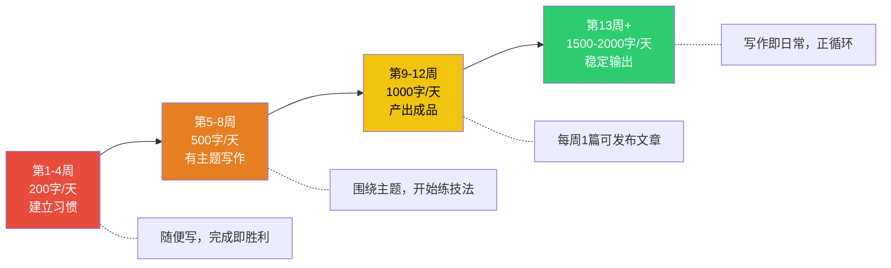
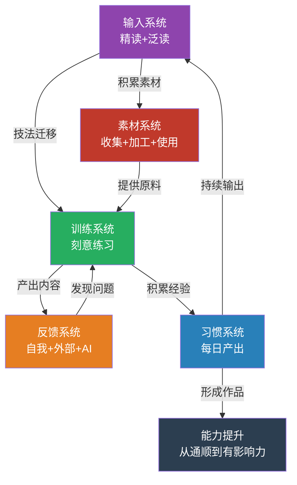

## 五、写作能力的持续提升

写作能力不是一次性习得的技能，而是一条持续攀升的曲线。很多人的写作水平在达到"能用"的程度后就停滞了——他们能写出没有语法错误的邮件和报告，但永远停留在"通顺"的层面，无法突破到"有力""优美""有影响力"的层次。瓶颈不在于天赋，而在于缺乏一套科学的持续提升系统。

本节将从五个维度构建你的写作能力持续提升引擎：**输入系统**（读什么、怎么读）、**训练系统**（刻意练习）、**反馈系统**（如何知道自己的问题在哪）、**习惯系统**（如何从200字/天到2000字/天）、**素材系统**（如何搭建永不枯竭的素材库）。这五个系统相互咬合，形成一个自驱动的飞轮——读得越多写得越好，写得越好越想读，反馈越及时进步越快，习惯越稳固产出越稳定，素材越丰富写作越轻松。

### 5.1 阅读与写作的关系：构建高质量输入系统

"读书破万卷，下笔如有神"——杜甫这句话流传千年，但它只说对了一半。关键不在于"破万卷"的数量，而在于你用什么方式读、读了之后怎么处理。一个囫囵吞枣读了一万本书的人，写作水平可能还不如一个精读了一百本书并做了深度拆解的人。

#### 5.1.1 精读与泛读的平衡策略

精读和泛读不是二选一的关系，而是写作输入系统的两个支柱，各自承担不同的功能：

**精读**的功能是"拆解机制"——像钟表匠拆解一块瑞士手表那样，逐零件地分析一篇文章为什么写得好。精读的目标不是获取信息，而是理解**写作技术**：作者为什么在这里用短句？这个转折为什么让人意外又觉得合理？开头的钩子是怎么设计的？结尾为什么让人回味？

**泛读**的功能是"扩展视野"——快速接触大量的观点、素材、风格和表达方式。泛读的目标不是深度理解，而是**积累密度**——让你的知识库和语料库有足够的广度，避免写作时"巧妇难为无米之炊"。

**推荐比例**：对大多数人来说，精读与泛读的时间比例建议为 **3:7**。精读消耗大量认知资源，不可能长时间维持；泛读则可以在碎片时间进行，是素材积累的主要来源。

**精读的具体操作方法**：

1. **选材**：选择公认的优秀作品，或是你所在领域的标杆文章。一篇好文章胜过十篇平庸文章。
2. **第一遍：正常阅读**。不带分析地通读一遍，感受整体的阅读体验。读完后记录你的第一反应：哪里让你印象深刻？哪里让你觉得"写得真好"？
3. **第二遍：结构拆解**。画出文章的结构图——开头用了什么策略？正文分了几个层次？每个层次的论点是什么？论据是什么？层次之间怎么过渡的？结尾用了什么手法？
4. **第三遍：语言分析**。标注出你觉得精彩的句子，分析它为什么好——是因为节奏感？修辞手法？用词精准？还是因为意象生动？同时标注出你觉得不好的地方，想想如果让你改会怎么改。
5. **第四遍：技法提取**。从文章中提取3-5个可以"偷"过来用在自己写作中的技法。比如"用反常识的开头制造悬念""用具体数字替代模糊描述""用类比让抽象概念具象化"。
6. **输出**：写一篇精读笔记，包含以上四个层次的分析。这本身就是一次极好的写作练习。

**泛读的具体操作方法**：

1. **建立信息源**：RSS订阅、Newsletter、优质公众号、行业博客、播客。目标是每天有50-100条新内容可以浏览。
2. **快速筛选**：用标题和前两段判断文章质量。80%的文章可以快速略过，只读标题和加粗文字。15%的文章值得通读。5%的文章值得精读。
3. **标记和收集**：读到好的表达、好的案例、好的观点，立即标记并归档到素材库（详见5.5节）。不要相信你的记忆力——今天觉得"这个太好了我肯定忘不了"的东西，三天后就想不起来了。
4. **定期回顾**：每周花30分钟浏览本周收集的素材，做一次"素材消化"——思考这些素材可以用在什么主题的写作中。

#### 5.1.2 不同类型阅读材料对写作能力的差异化影响

不是所有阅读对写作的提升效果都一样。不同类型的材料训练不同的写作能力：

| 阅读类型 | 训练的核心能力 | 推荐频次 | 典型材料 |
|----------|--------------|---------|---------|
| 经典文学 | 语言美感、叙事技巧、修辞手法 | 每周2-3次 | 鲁迅、汪曾祺、余华、海明威、契诃夫 |
| 优秀非虚构 | 结构设计、论证逻辑、信息密度 | 每周3-5次 | 《经济学人》、长篇深度报道、优质行业分析 |
| 同行优秀作品 | 行业语感、场景化表达、案例积累 | 每天 | 行业博客、技术文档、竞品内容 |
| 跨领域读物 | 类比能力、创新视角、思维开阔度 | 每周1-2次 | 科学、哲学、心理学、历史 |
| 烂文章 | 反面教材——识别"什么是不好的" | 不定期 | 学术八股、低质公众号、套话连篇的公文 |

**关键洞察**：阅读烂文章的价值常常被忽视。当你能清晰地指出一篇文章"烂在哪里"时，你对"好文章"的理解就更深了一层。这就是为什么编辑的成长速度往往比纯作者快——他们每天都在做"识别问题"的训练。

#### 5.1.3 从"读"到"写"的转化机制

很多人读了很多书但写作没有进步，根本原因是**阅读和写作之间缺少转化机制**。以下四种方法可以帮你打通"读"与"写"的通道：

**方法一：读后写"微评论"**

每读完一篇文章或一个章节，用100-200字写下你的评论。不是"读后感"那种抒情散文，而是结构化的评价：

- 这篇文章的核心观点是什么？（提炼能力）
- 作者用了什么方法来论证？（分析能力）
- 我同意还是不同意？为什么？（批判性思维）
- 这篇文章对我的写作有什么启发？（迁移能力）

**方法二：仿写练习**

看到一个让你赞叹的写作技法，不要只停留在"欣赏"层面，立即用这个技法写一段自己的内容。比如：

- 看到一个精彩的类比 → 自己写一个类比来解释某个概念
- 看到一个有力的排比句 → 自己写一组排比句表达某个观点
- 看到一个结构精巧的开头 → 用同样的结构改写自己一篇文章的开头

仿写不是抄袭，而是**技法的内化**。就像学书法要先临帖、学画画要先临摹，写作中的仿写是最高效的技法学习方式。

**方法三：主题阅读+写作闭环**

围绕一个主题进行集中阅读（5-10篇），然后写一篇关于这个主题的文章。这种"主题阅读→主题写作"的闭环，能让你在短时间内对某个领域形成自己的观点和表达方式。

操作流程：
1. 确定写作主题（比如"如何做好时间管理"）
2. 用3-5天时间集中阅读该主题的10篇优质文章
3. 记录每篇文章的核心观点、独特论据、精彩表达
4. 整理出自己的观点框架——你同意什么？反对什么？要补充什么？
5. 写一篇完整的文章，引用和整合你读到的内容，但用自己的逻辑和风格重新组织

**方法四：建立"技法清单"**

把你在阅读中发现的好技法整理成一份清单，每次写作前浏览一遍，有意识地运用其中2-3个。清单示例：

写作技法清单（持续更新）
─────────────────────────
□ 开头用具体场景代替抽象论述
□ 用"你"而非"人们"来拉近距离
□ 一个论点配一个具体案例
□ 长句和短句交替使用，短句制造冲击力
□ 转折处用"但是""然而"不如用具体事实对比
□ 结尾回扣开头，形成闭环
□ 用数字代替"很多""一些""大量"
□ 类比是解释抽象概念的最佳武器
□ 每段不超过5行，保持视觉呼吸感

### 5.2 刻意练习：写作训练的科学方法

"多写就能写好"是关于写作最大的谎言之一。如果你每天写2000字但没有明确的训练目标和反馈机制，你可能只是在重复自己的错误一万次。真正有效的写作提升遵循**刻意练习**（Deliberate Practice）的原则——心理学家安德斯·埃里克森提出的"专家绩效"理论的核心。

#### 5.2.1 刻意练习的四个核心要素

**要素一：明确的训练目标**

每次写作练习都要有一个聚焦的训练目标，而不是笼统地"写一篇文章"。比如：

| 模糊目标（无效） | 聚焦目标（有效） |
|-----------------|-----------------|
| 写一篇博客 | 这篇博客专门练习"用类比解释抽象概念" |
| 练习写作 | 今天的练习目标是"把开头控制在3句话以内" |
| 写点东西 | 用200字写一个场景，练习五感描写（视觉、听觉、嗅觉、触觉、味觉） |

**要素二：超出舒适区**

刻意练习的核心特征是在"学习区"操作——不是你已经会的东西（舒适区），也不是完全超出能力的东西（恐慌区），而是"够一够能做到"的区间。具体到写作：

- 如果你总是写长句 → 今天的练习专门写短句
- 如果你擅长议论 → 今天的练习写叙事
- 如果你习惯用书面语 → 今天的练习尝试口语化表达
- 如果你总写严肃话题 → 今天的练习写轻松幽默的内容

**要素三：即时反馈**

练习之后必须有反馈。反馈可以来自：自我对照（对照优秀范文检查）、工具辅助（语法检查、可读性评分）、他人评价（写作伙伴、社群）。详见5.3节。

**要素四：大量重复**

一个技法至少要在不同场景下练习10-20次，才能真正内化为自己的能力。不要指望"知道"就等于"会用"——你知道"开头要用钩子"和你能自然地写出好的开头之间，差着20次刻意练习。

#### 5.2.2 六种高效的写作刻意练习法

**练习一：限字写作**

给自己一个严格的字数限制，然后在限制内表达完整的内容。这训练的是**信息密度**和**精炼表达**的能力。

| 练习 | 目标 | 训练能力 |
|------|------|---------|
| 用50字概括一篇3000字的文章 | 信息压缩 | 提炼核心信息的能力 |
| 用200字写一个完整的故事 | 叙事精炼 | 在有限篇幅内讲好故事 |
| 用300字说服读者接受一个观点 | 论证密度 | 每句话都要有说服力 |
| 用100字写一个产品描述 | 表达精准 | 一词不多、一词不少 |

**练习二：风格模仿**

选择一位你欣赏的作家，用他的风格写一段完全不同的内容。这训练的是**风格感知**和**表达灵活性**。

操作步骤：
1. 精读目标作家的3-5篇文章，标注其语言特征（句式长短、用词偏好、节奏特点、修辞习惯）
2. 整理出该作家的"风格要素表"
3. 用这个风格写一段300-500字的内容（主题自选）
4. 对比你的仿写和原文，找出差距
5. 调整后重写一遍

示例——模仿鲁迅的杂文风格：
- 特征要素：短句为主、讽刺辛辣、善用反语、结尾突然转折
- 练习主题：写一段关于"职场内卷"的文字
- 目标：不是写得"像鲁迅"，而是理解"鲁迅为什么这样写"

**练习三：同一主题多角度写作**

同一个主题，分别从以下角度各写一段：
- 给5岁小孩解释（用最简单的语言）
- 给专业人士看（用行业术语和数据）
- 用故事来说明（讲一个相关的案例）
- 用类比来解释（找一个生活中的对应物）
- 反面论证（为什么这个观点可能是错的）

这个练习的核心价值是训练你**跳出自己的舒适表达模式**。大多数人写作时会固守一种表达习惯——要么总是抽象论述，要么总是讲故事。多角度练习强迫你掌握多种表达武器。

**练习四：改写练习**

找到一段你觉得"写得不好但意思不错"的文字，改写它。这是训练**编辑能力**的最佳方式。

改写的具体维度：
- 把长句拆成短句，提高可读性
- 把抽象描述替换为具体细节
- 把被动语态改为主动语态
- 把陈词滥调替换为新鲜表达
- 把松散的结构重新组织为逻辑清晰的框架

**练习五：定时速写（Speed Writing）**

设定15分钟的闹钟，给定一个主题，快速写出尽可能多的内容。不修改、不删除、不停顿。这个练习的目的是**突破写作焦虑和完美主义**，让你习惯"先写出来再说"的工作模式。

速写之后的处理：
1. 通读一遍，标出有价值的部分（通常只有20-30%）
2. 把有价值的部分提取出来，作为正式文章的素材
3. 分析自己速写时的思维模式——哪些地方流畅？哪些地方卡壳？卡壳的原因是什么？

**练习六：读者视角切换**

写完一段文字后，假装自己是以下三类读者，分别评价：
- **目标读者**：这篇文章解决我的问题了吗？我能看懂吗？
- **挑剔的批评者**：论证有漏洞吗？案例有说服力吗？结构有缺陷吗？
- **随便刷到的路人**：第一段能不能抓住我？有没有继续读下去的欲望？

这个练习训练的是**读者意识**——写作最大的盲区就是"我以为读者和我想的一样"。

#### 5.2.3 刻意练习的进阶训练模块

当你掌握了基础练习方法后，可以进入以下进阶模块：

**模块一：结构设计训练**

每周选择一个主题，分别用以下五种结构各写一份大纲（不写正文，只写大纲+每个部分的核心句）：

1. **总分总结构**：观点→分论点1→分论点2→分论点3→总结
2. **时间线结构**：按时间顺序推进
3. **问题-方案结构**：问题描述→原因分析→解决方案→实施步骤
4. **对比结构**：A方案 vs B方案，逐维度对比
5. **递进结构**：是什么→为什么→怎么办→做到什么程度

对比五种大纲，选择最适合这个主题的结构。这种训练能让你在正式写作时快速选对结构，避免"写着写着不知道怎么收尾"的困境。

**模块二：开头专项训练**

开头是文章最重要的5%——如果开头抓不住读者，后面写得再好也没人看。专项训练方法：

收集20个优秀开头，分析其策略并分类：

| 开头类型 | 策略描述 | 示例 |
|----------|---------|------|
| 场景切入 | 用一个具体的画面把读者拉进情境 | "凌晨三点，张伟盯着屏幕上那段红色的报错信息，第47次按下了运行键。" |
| 反常识 | 提出一个违反直觉的观点引发好奇 | "你可能不知道，每天坚持写作30分钟，三个月后你的逻辑思维能力会超过90%的人。" |
| 数据冲击 | 用震撼的数据制造紧迫感 | "在所有创业失败的案例中，有42%是因为没人需要他们的产品——这个数字比资金断裂高出一倍。" |
| 提问 | 用一个读者也想知道答案的问题开头 | "为什么有些人的文章读完就忘，而有些人的文章能改变你的一生？" |
| 故事 | 用一个简短的故事引入主题 | "2019年，一个叫李佳琦的人在直播间喊出了'买它'两个字，从此改变了中国电商的格局。" |
| 引用 | 用名人名言或经典语句建立权威 | "海明威说：'一切初稿都是垃圾。'这句话救了无数被完美主义困住的写作者。" |

用以上每种策略各写3个开头，主题自选。写完后对比，选出每种类型中最好的一个。

**模块三：结尾专项训练**

好的结尾让读者在读完后继续思考。训练方法同上，收集20个优秀结尾并分类练习：

- **回扣开头**：形成首尾呼应的闭环感
- **行动号召**：给读者一个明确的下一步
- **升华主题**：从具体案例上升到普遍道理
- **余韵留白**：用一个未完成的画面或问题留给读者想象空间
- **金句收束**：用一句精炼有力的话概括全文

### 5.3 反馈系统：让问题无所遁形

没有反馈的练习是盲目的。你需要一套多层次的反馈系统，从自我检测到外部评价，覆盖不同维度的写作质量。

#### 5.3.1 自我反馈：做自己的编辑

自我反馈是最基础也最重要的反馈形式，因为外部反馈不可能覆盖你写的每一个字。学会"切换视角"——写完之后，从"作者模式"切换到"编辑模式"。

**自我反馈的四步流程**：

**第一步：冷却期（必做）**

写完初稿后，至少放置2小时（理想情况是隔夜），然后再回来修改。心理学中的"蔡格尼克效应"（Zeigarnik Effect）会让你在写完的瞬间对文章产生情感依恋，无法客观评判。冷却期让你与文章"拉开距离"，重新看到问题。

**第二步：宏观检查（结构层）**

用以下清单检查文章的整体结构：

结构自检清单
────────────
□ 一句话能说清这篇文章讲什么吗？（核心主题）
□ 每个小节都在为核心主题服务吗？（相关性）
□ 各部分之间的逻辑关系清晰吗？（连贯性）
□ 信息的呈现顺序合理吗？（递进性）
□ 删掉任何一段，文章会不会垮？（必要性——如果不会垮，考虑删掉）
□ 读者读完后能获得什么？（价值感）

**第三步：中观检查（段落层）**

逐段检查每个段落的质量：

段落自检清单
────────────
□ 每段有没有明确的主题句？（通常在段首）
□ 论点有论据支撑吗？（不说空话）
□ 段落长度合适吗？（过长则拆，过短则合并）
□ 段落之间有过渡吗？（不突兀跳转）
□ 有没有重复表达同一个意思的段落？（去重）

**第四步：微观检查（句子层）**

逐句检查语言质量：

句子自检清单
────────────
□ 有没有超过40字的长句？（拆短）
□ 有没有被动语态可以改为主动？（"被"字句消灭计划）
□ 有没有陈词滥调？（"众所周知""不言而喻""意义深远"等）
□ 有没有模糊表达？（"一些""很多""相关"→替换成具体数字或描述）
□ 有没有多余的修饰词？（"非常""十分""极其"→删掉或换成具体描述）
□ 大声读出来，有没有拗口的地方？（节奏感）

**进阶工具：可读性评分**

使用可读性公式对自己的文章进行量化评估。常用的英文可读性指标是Flesch-Kincaid（弗莱士-金凯德）可读性指数，中文写作可以用以下简化标准：

| 指标 | 标准 | 检测方法 |
|------|------|---------|
| 平均句长 | 15-25字为宜 | 字数÷句数 |
| 段落长度 | 3-6句为宜 | 统计每段句数 |
| 生僻词比例 | 不超过5% | 非日常用语÷总词数 |
| 被动语态占比 | 不超过10% | "被"字句÷总句数 |

#### 5.3.2 外部反馈：他人的视角

自我反馈有天然的盲区——你永远无法完全跳出自己的思维框架。外部反馈的作用是让你看到"自己看不到的问题"。

**渠道一：写作伙伴（Writing Buddy）**

找一个写作水平相当（或略高）的人，建立互相评改的关系。这是成本最低、效果最好的外部反馈方式。

写作伙伴的运作规则：
1. 每周各自提交1-2篇文章给对方
2. 评改时遵循"三明治法则"：先说优点→再说问题→最后给建议
3. 评改时要具体——"第三段的论证逻辑有漏洞，因为你的前提假设是A，但实际应该是B"，而非"第三段写得不好"
4. 每月做一次复盘：哪些反馈被反复提到？这就是你最需要提升的方向

**渠道二：写作社群**

加入一个高质量的写作社群，定期参与互评和讨论。社群的价值不仅在于反馈，还在于**氛围激励**——看到别人在持续产出，你也会被带动。

选择社群的标准：
- 有活跃的互评机制（不是只发不看）
- 成员水平参差不齐（有比你强的人可以学习，也有比你弱的人可以通过点评他们来提升自己）
- 有定期的主题写作活动（降低"不知道写什么"的决策成本）

**渠道三：专业编辑/写作教练**

如果你的写作需要达到专业水准（出书、发表、商业用途），请一位专业编辑或写作教练是最高效的路径。一个好编辑能在一个月内帮你发现并纠正你自己可能花三年才能意识到的问题。

**渠道四：读者数据反馈**

如果你有公开的写作平台（公众号、博客、知乎），数据分析是最好的冷反馈——读者用脚投票，不需要他们开口告诉你"好"或"不好"。

核心指标：

| 指标 | 反映的问题 | 优化方向 |
|------|----------|---------|
| 打开率 | 标题吸引力 | 优化标题公式 |
| 完读率 | 内容是否抓人 | 优化开头和节奏 |
| 分享率 | 内容是否有价值感 | 增加"值得分享"的元素（干货、观点、情绪） |
| 评论量 | 内容是否引发思考 | 增加开放性问题和争议性观点 |
| 收藏率 | 内容是否有实用价值 | 增加工具性内容（模板、清单、步骤） |

**关键原则**：数据是参考，不是标准。不要为了追求数据而牺牲内容质量。数据告诉你的只是"什么更受欢迎"，不是"什么是好文章"。

#### 5.3.3 AI辅助反馈：新时代的写作教练

在AI时代，你可以利用大语言模型作为"第一轮编辑"。AI的优势是即时、无情绪、覆盖面广；劣势是缺乏真正的审美判断和领域深度。

**AI辅助反馈的有效用法**：

1. **语法和表达检查**：把文章丢给AI，让它指出语法错误、拗口表达、冗余词句。AI在这方面比大多数人更可靠。
2. **结构分析**：让AI画出你的文章结构图，检查逻辑是否连贯。
3. **可读性评估**：让AI从目标读者的视角评估文章的可理解度。
4. **多角度改写**：让AI用不同的风格重写同一段话，对比学习。

**AI辅助反馈的无效用法（需要注意）**：

1. 不要让AI直接替你写——这会剥夺你练习的机会。
2. 不要完全信任AI的"夸奖"——AI倾向于说"写得很好"，你需要追问"具体哪里好？有没有可以改进的地方？"
3. 不要用AI的输出作为"好文章"的标准——AI生成的文字往往是"正确但平庸"的。

**推荐提示词模板**：

你是一位资深的文字编辑。请从以下维度审阅我的文章，并给出具体的修改建议：

1. 结构：逻辑是否清晰？各部分是否连贯？
2. 论证：论点是否有充分的论据支撑？有没有逻辑漏洞？
3. 语言：有没有冗余、拗口、模糊的表达？请逐句指出。
4. 读者体验：目标读者是[XXX]，文章是否对他们有吸引力？
5. 可改进的亮点：哪些地方稍微修改就能变得更好？请给出修改后的版本。

不要笼统地说"写得好"，只指出具体问题和改进方案。

### 5.4 习惯系统：从200字/天到2000字/天

写作能力的持续提升，最终要落实到一个稳定、可持续的写作习惯上。很多人的问题不是"不会写"，而是"不写"——他们等灵感、等状态、等有空，结果一等就是几个月。

#### 5.4.1 习惯养成的科学原理

查尔斯·杜希格在《习惯的力量》中提出的"习惯回路"模型——暗示→惯常行为→奖赏——同样适用于写作习惯的建立：

**暗示（Cue）**：一个触发你开始写作的信号。可以是时间（每天早上7点）、地点（坐在书桌前）、行为（喝完第一杯咖啡后）、或者工具（打开写作软件）。

**惯常行为（Routine）**：坐下来写。关键原则——**无论状态好坏，都要写**。灵感来了写2000字，没灵感也要写200字。重要的不是每次写多少，而是每天都写。

**奖赏（Reward）**：写完后的满足感。可以在写作完成后给自己一个小奖励（一杯好咖啡、10分钟刷手机、在日历上画一个X）。关键是让大脑把"写作"和"愉悦"关联起来。

#### 5.4.2 渐进式写作量提升计划

不要一开始就要求自己每天写2000字——这就像一个从来不运动的人突然决定每天跑10公里，大概率三天后就放弃了。以下是经过验证的渐进式计划：

**第一阶段：建立习惯（第1-4周）——每天200字**

- 目标：不是写出好文章，而是**每天都写**
- 内容：日记、读书笔记、朋友圈文案、一段感悟、一个观察——什么都行
- 时间：固定在每天同一时段，15分钟
- 关键：完成比质量重要。哪怕只写一句话"今天没什么想法"，也算完成

**第二阶段：扩大规模（第5-8周）——每天500字**

- 目标：从"随便写"过渡到"有主题地写"
- 内容：围绕一个主题写一段完整的文字（300-500字），不要求是成品文章
- 时间：20-30分钟
- 关键：开始有意识地运用学到的技法，但不要给自己太大压力

**第三阶段：形成产出（第9-12周）——每天1000字**

- 目标：每周至少产出1篇可以发布的文章
- 内容：3天写草稿，2天修改，1天发布，1天休息
- 时间：40-60分钟
- 关键：开始关注读者反馈，但不被数据绑架

**第四阶段：稳定输出（第13周+）——每天1500-2000字**

- 目标：写作成为像吃饭睡觉一样的日常习惯
- 内容：根据自己的定位，稳定产出某个领域的内容
- 时间：60-90分钟
- 关键：进入正循环——写得越多越熟练，越熟练写得越快，越快越有时间打磨质量

#### 5.4.3 克服"写不出来"的七种急救方法

即使建立了习惯，也会遇到"坐在电脑前一个字也写不出来"的时刻。以下是七种经过验证的急救方法：

**方法一：降级写作**

如果你写不出"一篇文章"，就降级为"写一段话"。如果一段话也写不出，就降级为"写一句话"。如果一句话也写不出，就写"我今天不知道写什么，因为……"——然后把"因为"后面的内容写完。你会惊讶地发现，一旦开始写了，文字就会自然流淌出来。

**方法二：对话式写作**

假装你在和一个朋友聊天，他问你："你最近在忙什么？"然后用对话的方式写下来。口语化的写作比正式写作容易得多，写完后再修改为正式语言。

**方法三：从中间开始写**

不必从开头写起。很多人卡在开头是因为他们对文章的全貌还没有想清楚。先写你最有把握的部分——可能是中间的某个论据，可能是结尾的总结，可能是你最想讲的那个案例。写完一个部分后，其他部分的思路往往会自然浮现。

**方法四：5分钟自由写作**

设定5分钟闹钟，不管脑子里出现什么，全部写下来。不修改、不删减、不评判。5分钟结束后，你手上会有300-500字的"原材料"，从中筛选有价值的部分继续展开。

**方法五：换个环境**

如果你在书桌前卡住了，试试换到沙发、咖啡厅、公园。环境的改变能激活大脑的不同区域。有研究表明，在略微嘈杂的环境中（约70分贝，相当于咖啡厅的背景噪音），人的创造性思维反而比安静环境中更强。

**方法六：先列清单再写**

把你想说的每一个点列成清单（不管顺序），然后围绕清单展开。清单给了你"骨架"，血肉可以在后续填充。

示例：
想写的主题：为什么应该学写作
──────────────────────────
- 写作是思考的工具
- 职场中写作能力=晋升速度
- AI时代写作能力更重要
- 写作能建立个人品牌
- 我自己写作前后的变化
- 好的写作是可学习的，不是天赋
- 从每天200字开始就行

**方法七：降低标准**

"今天只要写出500字的垃圾就行"——给自己这样的许可。完美主义是写作最大的敌人。初稿本来就应该粗糙，修改才是让文字变好的环节。海明威说"一切初稿都是垃圾"，这不是自我安慰，是所有作家的共识。

#### 5.4.4 写作环境与仪式感的设计

环境和仪式感对写作习惯的影响被严重低估了。一个好的写作环境能显著降低"开始写"的心理门槛。

**物理环境**：
- **固定地点**：尽量在同一个地方写作（书桌、咖啡厅的固定座位）。大脑会把地点和行为关联起来——当你坐在"那个位置"时，写作模式会自动激活。
- **减少干扰**：手机静音放在视线之外，关闭所有非必要的通知和网页。研究表明，仅仅是手机放在桌上（即使没在用），就会降低你的认知能力和专注度。
- **必要的工具触手可及**：写作软件、参考材料、笔记本、一杯水。减少起身找东西的次数。

**数字环境**：
- **专注写作工具**：使用全屏写作软件（如Typora、iA Writer、Obsidian的专注模式），隐藏一切多余的界面元素。
- **断网或限网**：如果不需要在线查资料，断开Wi-Fi。如果需要，使用网站屏蔽工具（如Cold Turkey、Focus）限制社交媒体的访问。
- **模板预设**：提前设置好文章模板（标题、大纲框架、元信息），打开就能开始写，省去"新建文件"时的决策消耗。

**仪式感**：
- **固定时间**：每天在同一个时间段写作，让身体形成生物钟。很多作家选择清晨（凌晨5-7点），因为那个时间段干扰最少，意志力最强。
- **启动仪式**：一个简单的启动动作——泡一杯特定的茶、戴上耳机播放固定的音乐、打开特定的写作软件。这个仪式告诉大脑"现在要开始写作了"。
- **结束仪式**：写完后做一个标记（日历画X、打卡App、记录字数）。视觉化的"完成记录"会形成强大的正反馈——看着连续打卡的记录，你不想在第47天中断。

### 5.5 素材系统：搭建永不枯竭的写作素材库

"巧妇难为无米之炊"——很多写作困难不是因为"不会写"，而是因为"没东西可写"或"想写但缺少论据和案例"。一套高效的素材管理系统，能确保你随时有充足的"食材"可用。

#### 5.5.1 素材的类型与来源

写作素材可以分为以下几类：

| 素材类型 | 具体内容 | 主要来源 |
|----------|---------|---------|
| 事实与数据 | 统计数字、研究结论、行业报告、历史事件 | 学术论文、行业白皮书、政府统计数据 |
| 案例与故事 | 真实事件、人物经历、商业案例、个人经验 | 新闻报道、传记、纪录片、自身经历 |
| 观点与洞见 | 专家观点、名家论述、哲学思考、新颖角度 | 书籍、播客、演讲、深度访谈 |
| 金句与表达 | 精彩的句子、有力的修辞、优美的描写 | 文学作品、名人演讲、歌词、广告语 |
| 类比与隐喻 | 将抽象概念具象化的表达方式 | 科普文章、TED演讲、优秀的解释性文章 |
| 框架与模型 | 思考框架、分析模型、方法论 | 商业书籍、学术研究、咨询报告 |

#### 5.5.2 素材收集的工作流

**原则：随手记，分类存，定期理。**

**第一步：捕捉（Capture）**

看到任何可能有用的素材，立即记录。不要想着"以后再记"——你不会的。推荐的捕捉方式：

- **手机端**：用微信"文件传输助手"、备忘录、或专用App（如Flomo、Notion）快速记录。看到一段好文字，截图+复制文字，3秒钟搞定。
- **电脑端**：浏览器插件（如Notion Web Clipper、Raindrop.io）一键保存网页内容。
- **阅读时**：在Kindle/微信读书中标注+笔记，定期导出。

**第二步：加工（Process）**

定期（建议每周一次，30分钟）对收集的素材进行加工：

1. **添加标签**：给每条素材打上2-3个标签，方便后续检索。标签体系示例：
   - 按主题：#效率 #思维 #沟通 #写作 #技术 #商业
   - 按类型：#数据 #案例 #金句 #类比 #框架
   - 按用途：#开头素材 #论证素材 #结尾素材 #灵感
   
2. **添加使用场景备注**：这条素材可以用在什么地方？比如"这个数据可以用在讨论'AI对就业影响'的文章开头"。

3. **去重和淘汰**：删除重复的、过时的、质量低的素材。保持素材库的"信噪比"。

**第三步：组织（Organize）**

选择一个适合自己的工具建立素材库。推荐方案：

| 工具 | 优势 | 劣势 | 适合人群 |
|------|------|------|---------|
| Notion | 灵活的数据库视图、支持多维度筛选 | 需要一定学习成本 | 重度写作者、需要精细管理 |
| Obsidian | 本地存储、双向链接、Markdown原生 | 界面不够美观 | 注重隐私、喜欢文本操作 |
| 飞书/语雀 | 多人协作、云端同步 | 依赖平台 | 团队写作者 |
| 便签+文件夹 | 最简单、零学习成本 | 检索困难 | 偶尔写作的人 |
| Flomo | 极简设计、微信输入、标签系统 | 功能有限 | 追求极简的人 |

**无论选择哪个工具，关键原则是：录入成本要足够低（3秒内能完成一次记录），检索要足够快（3秒内能找到想要的素材）。**

#### 5.5.3 素材库的使用方法

建了素材库不用等于没建。以下是几种高效的素材使用方法：

**方法一：写作前的素材预检索**

在确定文章主题后，先在素材库中搜索相关素材（按主题标签或关键词），把可能用到的素材提取出来放在一个临时文件中。这样在正式写作时就不会因为"找素材"而中断思路。

**方法二：素材触发写作**

有时你不知道写什么，但素材库里有一条让你特别有感触的内容。那就从这条素材出发——引用它、评论它、延伸它。一条好的素材可以成为一个3000字文章的种子。

**方法三：素材交叉组合**

把来自不同领域的素材放在一起，往往能产生意想不到的化学反应。比如把一个生物学的进化论案例和一个商业竞争的案例放在一起做类比，可能会产生一个非常有说服力的论证。

**方法四：定期素材复盘**

每月花1小时浏览素材库，思考：
- 哪些素材还没用过？有没有适合写成文章的主题？
- 哪些素材已经过时了？需要更新或删除吗？
- 素材库中哪个类型的素材最充足？哪个最欠缺？下个月重点补充什么？

### 5.6 写作能力提升的里程碑与自我评估

持续提升需要阶段性的自我评估，以确认你在正确的方向上进步。以下是一个可操作的里程碑框架：

#### 5.6.1 三个月里程碑

| 检查项 | 达标标准 | 自评 |
|--------|---------|------|
| 写作习惯 | 能连续30天每天写500字以上 | □ |
| 阅读输入 | 每周精读1篇文章并写拆解笔记 | □ |
| 素材积累 | 素材库中有100条以上带标签的素材 | □ |
| 完成作品 | 至少发布了5篇公开文章 | □ |
| 反馈循环 | 有至少1个稳定的反馈渠道 | □ |

#### 5.6.2 六个月里程碑

| 检查项 | 达标标准 | 自评 |
|--------|---------|------|
| 写作习惯 | 能连续30天每天写1000字以上 | □ |
| 文体切换 | 能在3种以上文体间自如切换 | □ |
| 结构能力 | 能为复杂主题设计清晰的文章结构 | □ |
| 读者反馈 | 文章平均阅读量/互动量有明显增长 | □ |
| 刻意练习 | 完成了20次以上的聚焦练习 | □ |

#### 5.6.3 一年里程碑

| 检查项 | 达标标准 | 自评 |
|--------|---------|------|
| 写作习惯 | 写作已成为像吃饭一样的日常 | □ |
| 产出质量 | 能独立完成6000字以上的深度文章 | □ |
| 个人风格 | 形成了可辨识的个人写作风格 | □ |
| 影响力 | 有一定的读者群体和内容影响力 | □ |
| 变现能力 | 写作能力开始产生实际的回报（职业/收入/人脉） | □ |

### 5.7 常见的持续提升陷阱

在写作能力持续提升的路上，有五个常见的陷阱需要警惕：

**陷阱一：只输入不输出**

读了100本书但一篇文章都不写，就像看了100场游泳比赛但从不下水。阅读是必要的，但不能替代写作练习。**输入与输出的合理比例是3:7**——30%的时间用于阅读学习，70%的时间用于写作实践。

**陷阱二：完美主义导致产出为零**

"等我准备好了再写""这篇文章还不够好不能发"——完美主义是写作习惯的头号杀手。接受一个事实：你的第一稿一定是不好的，你的第100篇文章一定比第1篇好得多。但你必须先写出那99篇"不够好的"文章。

**陷阱三：缺乏反馈的自我感动**

没有反馈的写作很容易变成"自嗨"——你觉得写得很好，但读者看了两段就关掉了。建立反馈渠道不是可选项，是必选项。哪怕只是让一个朋友帮你看看，也比完全封闭写作强一百倍。

**陷阱四：追求技巧而忽略深度**

学了一堆标题公式、开头技巧、结构模板，但文章缺乏真正的深度和独特见解。技巧是锦上添花，深度才是雪中送炭。不要本末倒置——先有值得说的话，再说怎么说。

**陷阱五：三天打鱼两天晒网**

写作能力的提升遵循复利效应——每天写一点，累积起来的效果是惊人的；但如果中断一周不写，手感的退步比你想象的快得多。维持习惯的关键不是"有空就写"，而是"每天都写，写多写少都行"。

### 5.8 本节小结

写作能力的持续提升不是一个线性过程，而是一个螺旋上升的飞轮。输入（阅读）、练习（刻意训练）、反馈（自我+外部）、习惯（每日产出）、素材（积累管理）五个系统相互驱动，形成正循环。

最后，记住三个核心信念：

1. **写作能力是可习得的技能，不是天赋**。所有优秀的作家都是从糟糕的初稿开始的，区别只在于他们写了多少、改了多少。
2. **系统大于意志力**。不要依赖"坚持"——依赖系统。当阅读、练习、反馈、素材管理都变成了自动化的习惯，写作能力的提升就不再需要意志力来维持。
3. **起步永远不晚，中断永远可惜**。今天开始写200字，比下周开始写2000字更有价值。因为习惯的建立需要连续性，而连续性比数量重要十倍。
