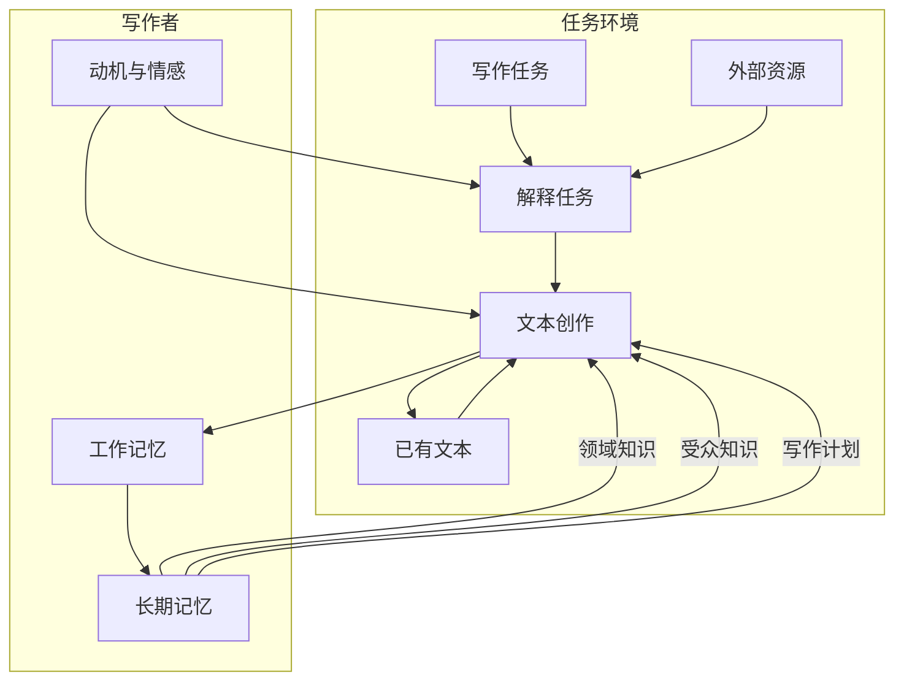
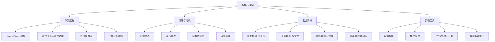

## 一、写作心理学

写作不仅是一项技能，更是一种复杂的心理活动。理解写作背后的心理机制，能帮助我们从根本上提升写作能力，而非仅仅停留在技巧层面。本章从认知科学、发展心理学和社会心理学三个维度，系统剖析写作的心理本质。

### 1.1 写作的本质与定义

写作的本质是什么？从最基础的层面来看，写作是**将思想转化为文字的过程**。但这个看似简单的定义背后，隐藏着复杂的认知机制和技能要求。要真正理解写作，我们需要从多个维度来审视它。

#### 1.1.1 写作是一种编码过程

人类的思维是以意象、情感、直觉等非线性的方式运作的，而写作要求我们将这些非线性的思维"编码"为线性的文字符号序列。在这个编码过程中，不可避免地会丢失一些信息，也会增加一些原本没有的信息。优秀的写作者能够最大限度地减少信息损失，同时利用文字的特性增加表达的深度和美感。

这个编码过程涉及多个认知子系统的协同工作：

- **工作记忆**：负责暂时存储和处理信息，是写作的"操作台"。工作记忆的容量有限（Miller的7±2法则），这意味着写作者在任何一个时刻能同时处理的信息量是有限的。
- **长期记忆**：提供词汇、语法、世界知识和写作策略。写作时，我们需要从长期记忆中提取大量信息，提取的效率直接影响写作的流畅度。
- **执行功能**：负责监控和调节整个过程，包括注意力分配、任务切换、错误检测和抑制控制。执行功能强的写作者能更好地在"生成"和"评估"之间切换。

当我们写作时，大脑并不是简单地"把想法写下来"，而是在进行一场复杂的认知舞蹈。Baddeley的工作记忆模型为理解这场舞蹈提供了重要框架：中央执行系统协调语音回路（处理语言信息）和视空间画板（处理图像信息），而情景缓冲区则将不同来源的信息整合为连贯的文本。

#### 1.1.2 写作是一种沟通行为

与其他沟通方式（如面对面交流、电话、视频）相比，写作有其独特的特点：

| 特征 | 写作 | 口头交流 | 影响 |
|------|------|----------|------|
| **方向性** | 单向为主 | 双向互动 | 写作者必须预判读者反应，提前回答可能的疑问 |
| **持久性** | 文字持久保存 | 转瞬即逝 | 每个字都可能被反复审视，需要更高的责任心 |
| **精确性** | 需要高度精确 | 可借助语气表情 | 没有非语言线索辅助，一切通过文字表达 |
| **可修改性** | 可反复修改 | 即时即逝 | 有无限机会打磨表达，但也可能导致过度修改 |
| **时间延迟** | 写作与阅读有时间差 | 即时反馈 | 无法根据读者即时反应调整表达 |

这些特征对写作者提出了特殊的心理要求：你需要在没有即时反馈的情况下，预设读者的认知状态、知识水平和情感需求，然后选择最合适的表达方式。这种"心智理论"（Theory of Mind）能力是写作的核心心理能力之一。

#### 1.1.3 写作是一种思维训练

写作不仅是一种表达工具，更是一种思维训练方式。认知心理学研究表明，写作能够促进深度学习和知识整合。通过写作，你可以：

- **梳理混乱的思路**：当想法在脑中是模糊的"云团"时，写作迫使你将其结构化，这个过程本身就是深度思考。
- **发现逻辑漏洞**：写下来之后，原本在脑中"自洽"的想法往往会暴露出矛盾——因为文字的线性排列让逻辑关系变得显性。
- **深化理解**：Elaboration效应表明，用自己的话解释一个概念，比反复阅读更能促进理解和记忆。
- **系统化知识**：写作要求你将零散的知识点组织成体系，这个过程促进了知识的整合和结构化。
- **激发创意**：写作过程中的"意外联想"是创意的重要来源——当你在写A的时候，可能会突然想到B和C之间的联系。

弗朗西斯·培根曾说："写作使人精确。"（Writing makes an exact man.）这句话深刻地揭示了写作与思维的关系。当我们试图将模糊的想法转化为精确的文字时，我们被迫去澄清那些原本含混不清的概念，去填补那些原本被忽略的逻辑空白。

### 1.2 写作的认知过程模型

#### 1.2.1 Hayes-Flower写作认知模型

认知心理学家约翰·海斯（John Hayes）和琳达·弗劳尔（Linda Flower）在1980年提出了影响深远的写作认知模型，后来海斯在1996年对其进行了修订。这个模型是写作心理学研究的里程碑，至今仍是理解写作认知机制的基础框架。

**1980年原始模型**将写作过程分解为三个核心要素：

**任务环境（Task Environment）**

任务环境是写作发生的外部条件：

- **写作任务**：主题、受众、目的的明确程度直接影响写作效率。一个模糊的写作任务会导致反复犹豫和方向迷失。研究发现，当写作者对任务要求不清楚时，他们会花更多时间在"计划"阶段，但产出的质量反而更低——因为他们把认知资源用在了"猜任务"而非"写内容"上。
- **已有文本**：已写的内容会成为新的"任务环境"，影响后续写作方向。这就是为什么开头往往最难——你没有任何"已有文本"可以依托。
- **外部资源**：可参考资料的丰富程度影响写作深度。但资源过多也可能造成"信息过载"，反而阻碍写作。

**作者的长时记忆（Writer's Long-term Memory）**

- **领域知识**：关于写作主题的知识储备。领域知识越丰富，写作时可调用的素材越多，表达越有深度。研究表明，专家写作者和新手写作者的核心差异之一就是领域知识的丰富程度。
- **受众知识**：关于读者的需求、偏好、知识水平、文化背景等。受众知识帮助写作者选择合适的内容和表达方式。缺乏受众意识是初学者最常见的问题之一。
- **写作计划**：关于如何组织和表达内容的策略，来自过去的学习和实践。

**写作过程（Writing Processes）**

写作过程包括三个相互交织的子过程：

- **计划（Planning）**：设定目标、生成想法、组织内容。计划包括目标设定（确定写作目的和受众）、内容生成（头脑风暴、联想等）、和组织（按逻辑排列想法）。
- **翻译（Translating）**：将想法转化为文字。"翻译"这个词暗示了从思维语言到书面语言的转化并非直接的，而需要一个转化过程。
- **检查（Reviewing）**：评估和修改已写内容，包括阅读、评估和修改三个子步骤。

**关键洞察**：这三个过程**不是严格按顺序进行的，而是相互交织、反复迭代的**。写作者可能在写第三段时回到第一段修改，在修改中产生新想法，然后重新调整整体结构。这种非线性的递归特征是写作过程的本质。

**1996年Hayes修订模型**做出了几项重要更新：

- **工作记忆的核心地位**：写作时需要在工作记忆中同时保持多个信息——正在写的句子、整体写作计划、读者需求等。工作记忆容量的限制是写作困难的根本原因之一。
- **动机与情感的纳入**：焦虑、自信、兴趣等情感因素会显著影响写作表现。这解释了为什么同一个写作者在不同心理状态下，写作质量会有巨大差异。
- **认知过程的简化**：将写作过程简化为"解释任务"和"文本创作"两个主要过程。

#### 1.2.2 Bereiter和Scardamalia的知识讲述与知识转换模型

Bereiter和Scardamalia（1987）提出了两种根本不同的写作策略，揭示了新手与专家写作者之间的本质差异：

**知识讲述（Knowledge-Telling）策略**

这是新手写作者最常用的策略。其特征是：

- 写作者从长期记忆中提取与主题相关的信息，直接"告诉"读者
- 不考虑文本的整体结构，只是按照信息在记忆中出现的顺序逐条列出
- 很少进行计划和修改，因为写作者认为"想到什么写什么"就可以了
- 文本结构往往是线性的、列表式的

典型的例子：一个学生写"我的假期"，会按照时间顺序列出做了什么——"第一天去了公园，第二天看了电影，第三天……"没有重点，没有取舍，也没有深层思考。

**知识转换（Knowledge-Transforming）策略**

这是成熟写作者使用的策略。其特征是：

- 写作者不仅从记忆中提取信息，还对信息进行重新组织和深层加工
- 有明确的修辞目标——知道要达到什么效果，并据此选择和组织内容
- 在"内容空间"和"修辞空间"之间反复切换，用一个空间的问题驱动另一个空间的思考
- 经常进行修改，修改不仅涉及语言层面，还涉及内容和结构层面

典型的例子：同样是写"我的假期"，成熟写作者可能会选择一个主题（如"学会独处"），然后从假期经历中选取最能支撑这个主题的素材，通过具体的场景描写来传达更深层的感悟。

**从知识讲述到知识转换的跃迁**是写作能力发展的关键转折点。这个跃迁不是自动发生的，需要有意的训练和引导。具体的方法包括：

1. 学习文本结构知识（如议论文的论点-论据-结论结构）
2. 练习"换视角写作"（同一个话题，为不同受众写）
3. 培养修改习惯，特别是结构层面的修改
4. 大量阅读优秀作品，内化知识转换的模式

#### 1.2.3 写作的双过程理论

认知心理学的双过程理论（Kahneman, 2011）同样适用于写作：

| 维度 | 系统1（快思考） | 系统2（慢思考） |
|------|-----------------|-----------------|
| **运作方式** | 自动化、无意识 | 刻意、有意识 |
| **写作中的表现** | 词汇选择、语法判断、语感 | 结构规划、逻辑推敲、深度修改 |
| **优势** | 速度快、不消耗认知资源 | 精确、能处理复杂问题 |
| **劣势** | 容易出错、受偏见影响 | 消耗认知资源、速度慢 |
| **训练方式** | 大量阅读和写作练习 | 学习写作理论和策略 |

高效的写作需要两个系统的良好协作：

- **初稿阶段**：更多依赖系统1，让文字自然流淌，不过多纠结于细节
- **修改阶段**：更多依赖系统2，仔细检查逻辑、结构和表达的精确性
- **专家写作**：通过大量练习，许多原本需要系统2处理的任务被"自动化"为系统1处理，从而释放认知资源用于更高层次的思考

### 1.3 写作中的心流状态

米哈里·契克森米哈赖（Mihaly Csikszentmihalyi）提出的"心流"（Flow）概念，对理解高效写作状态非常有帮助。心流是一种完全沉浸在某项活动中的状态，在这种状态下，人们会感到高度的专注、愉悦和满足，时间仿佛停止了流逝。

#### 1.3.1 写作中心流的七个特征

1. **清晰的目标**：知道自己要写什么，要达到什么效果。模糊的目标是心流的最大敌人——如果你不知道要去哪里，你永远无法进入"自动驾驶"状态。
2. **即时的反馈**：能够感受到写作的进展。这种反馈可以是内在的（感觉句子写得好），也可以是外在的（读者的反应）。
3. **挑战与技能的平衡**：写作任务的难度与技能水平匹配。太简单会无聊，太难会焦虑——只有在"刚好够难"的区间，心流才会出现。
4. **高度的专注**：完全沉浸在写作中，忘记了时间和周围环境。
5. **自我意识的消失**：不再担心别人怎么看自己的文章，完全投入写作本身。
6. **时间感的扭曲**：感觉时间过得很快或很慢。很多写作者都有"写了三小时以为只过了半小时"的经历。
7. **内在的愉悦感**：写作本身就带来满足感，不需要外部奖励。

#### 1.3.2 写作心流的触发条件与维持策略

**环境准备**

- **减少干扰源**：手机静音、关闭通知、使用专注模式软件（如Forest、番茄钟）。研究表明，即使只是看到手机通知，也会占用认知资源，降低写作深度。
- **选择合适的物理环境**：有些人需要完全安静，有些人偏好适度的背景噪音（如咖啡馆的环境音）。适度的环境噪音（约70分贝）被研究证明能促进创造性思维。
- **温度与光线**：略微偏暖的环境（约22-24°C）和自然光有助于保持警觉和舒适。

**心理准备**

- **明确写作目标**：开始前用30秒回答"今天要写什么？写到什么程度算完成？"具体、可衡量的目标比模糊的"写一会儿"更有效。
- **建立启动仪式**：固定的启动仪式（泡一杯茶、播放特定音乐、进行2分钟深呼吸）能帮助大脑切换到"写作模式"。这是经典条件反射的应用——通过反复将仪式与写作配对，仪式本身就成为心流的触发信号。
- **降低启动门槛**：如果难以开始，承诺"只写5分钟"。心理学上的"蔡加尼克效应"表明，一旦开始一项未完成的任务，大脑会自动产生完成它的驱动力。

**心流中断的应对**

心流一旦被打断，通常需要15-25分钟才能恢复。应对策略包括：

- 在心流状态被打断时，快速记下当前的思路（一个关键词或一句话），作为恢复的"锚点"
- 如果必须中断，选择在一个段落或章节的自然断点处暂停
- 使用"离开前写一句"技巧——在暂停前写下下一段的第一句话，降低重新启动的难度

### 1.4 写作焦虑与心理障碍

写作焦虑（Writing Anxiety）是一种常见的心理现象，表现为面对写作任务时的紧张、恐惧和回避行为。研究表明，约有15-20%的人存在不同程度的写作焦虑，而在学术写作场景中这一比例可能更高。

#### 1.4.1 写作焦虑的三维表现

**生理层面**

- 心跳加速、手心出汗、肌肉紧张
- 胃部不适、头痛
- 长期写作焦虑可能导致慢性疲劳和失眠

**认知层面**

- 消极自我对话："我写不好"、"别人会笑话我"、"我不配写这个话题"
- 灾难化思维："如果这篇文章写砸了，我的职业生涯就完了"
- 注意力难以集中，脑中一片空白
- 完美主义倾向：认为每篇文章都必须完美，否则就不值得写

**行为层面**

- 拖延：总有"更重要的事"要先做
- 过度准备但不动笔：收集了大量资料，但总觉得"还没准备好"
- 写完后反复检查但不敢发布
- 回避写作任务，找借口不做

#### 1.4.2 写作焦虑的深层成因

| 成因类型 | 具体表现 | 心理机制 |
|----------|----------|----------|
| **创伤经历** | 曾因写作被批评、嘲笑或否定 | 经典条件反射：写作与负面情绪建立了联结 |
| **完美主义** | 对自己期望过高，认为"不完美=失败" | 全或无思维（All-or-nothing thinking） |
| **社会比较** | 总拿自己与优秀作者比较 | 向上社会比较导致自我贬低 |
| **评价恐惧** | 害怕文章被公开评价 | 公开自我意识过高（Public self-consciousness） |
| **冒名顶替综合征** | 认为自己的能力被高估，迟早会被"揭穿" | 自我效能感与实际成就不匹配 |
| **技能不足** | 缺乏写作基本技能 | 客观困难引发习得性无助 |

#### 1.4.3 系统性克服写作焦虑的方法

**认知层面的干预**

1. **认知重构**：识别并挑战消极的自动化思维。例如：
   - "我必须写出完美的文章" → "先完成初稿，修改阶段再打磨"
   - "别人会笑话我" → "大多数人忙于自己的事，不会花时间嘲笑别人"
   - "我不够格写这个话题" → "我比不写的人多了一份独特的视角"
2. **成长型思维**（Dweck, 2006）：将写作能力视为可发展的技能，而非固定的天赋。把"我写不好"改为"我还没写好，但我可以通过练习变好"。

**行为层面的干预**

3. **自由写作**（Free Writing）：设定10-15分钟的计时器，不停笔、不修改、不评判。Peter Elbow在《Writing Without Teachers》中提出的方法，已被大量研究证明能有效降低写作焦虑。
4. **渐进暴露**：从低风险的写作任务开始（日记、私人笔记），逐步过渡到中风险（给朋友分享），最后到高风险（公开发表）。每一步都在积累成功经验，重建信心。
5. **分解任务**：将"写一篇5000字的文章"分解为"今天写大纲"、"明天写第一部分"等小任务。小任务的心理压力远低于大任务。
6. **设置"糟糕初稿"目标**：故意给自己许可写出糟糕的初稿。Anne Lamott在《Bird by Bird》中说："几乎所有好东西都是从糟糕的初稿开始的。"

**环境层面的干预**

7. **建立写作社群**：找到志同道合的伙伴，定期分享作品和心得。社会支持是应对焦虑的重要资源。
8. **寻求专业帮助**：如果写作焦虑严重影响了工作和生活，考虑寻求心理咨询师的帮助。认知行为疗法（CBT）对写作焦虑有良好的治疗效果。

### 1.5 写作的动机系统

#### 1.5.1 内在动机与外在动机

写作的动机可以分为内在动机和外在动机两大类：

**内在动机**

- **表达欲望**：有话想说，有想法想要分享。这是最原始、最强大的写作动力。
- **创造乐趣**：享受创造的过程，享受文字在笔下流淌的感觉。
- **自我探索**：通过写作认识自己，整理思想和情感。许多写作者发现，写作帮助他们理解了自己原本不清楚的想法。
- **好奇心**：对某个话题充满好奇，想要深入研究和表达。
- **审美追求**：追求语言的美感，享受打磨文字的过程。

**外在动机**

- **职业需求**：工作需要撰写报告、邮件、方案等。
- **经济回报**：通过写作获得稿费、版税或商业收入。
- **社会认可**：获得读者赞赏、同行认可。
- **建立影响力**：通过写作建立个人品牌和行业影响力。
- **学术要求**：完成论文、研究报告等学术写作任务。

#### 1.5.2 自我决定理论与写作动机

Deci和Ryan的自我决定理论（Self-Determination Theory, SDT）为理解写作动机提供了更精细的框架。SDT认为，人类有三种基本心理需求：

1. **自主性（Autonomy）**：感觉自己的行为是自己选择的，而非被强迫的。在写作中，选择自己感兴趣的话题、用自己的方式表达，能增强自主性。
2. **胜任感（Competence）**：感觉自己有能力完成任务。在写作中，获得积极反馈、看到自己的进步，能增强胜任感。
3. **归属感（Relatedness）**：感觉自己与他人有联结。在写作中，知道有人在读你的文字、与读者产生共鸣，能满足归属感。

当这三种需求得到满足时，内在动机会自然涌现；当这些需求被阻挠时，写作就会变成一种负担。

**实践建议**：

- **增强自主性**：尽可能选择自己真正关心的话题写；即使在工作中必须写指定主题，也尝试找到自己真正感兴趣的角度。
- **培养胜任感**：设定可达成的小目标，定期回顾自己的进步；不要只和最好的作者比，也要看到自己的成长。
- **建立归属感**：加入写作社群，与读者互动，知道你的文字在影响别人。

研究表明，内在动机比外在动机更能持久地驱动写作行为，也更能产出高质量的作品。但外在动机也有其价值——它可以提供启动的动力和持续的约束。理想的写作状态是内在动机和外在动机的结合：既享受写作的过程，又有明确的外在目标。

### 1.6 写作中的自我效能感

自我效能感（Self-efficacy）是Albert Bandura提出的概念，指个体对自己能否成功完成某项任务的信念。在写作领域，写作自我效能感是指写作者对自己写作能力的信念和信心。

#### 1.6.1 自我效能感的四个来源

Bandura指出，自我效能感有四个来源，按影响力从大到小排列：

1. **亲身成功经验（Mastery Experiences）**：这是最强大的来源。每一次成功的写作都会增强信心。关键是"成功"——不是写得完美，而是完成了自己设定的目标。
2. **替代经验（Vicarious Experiences）**：看到与自己水平相似的人通过努力提升写作能力，会增强自己的信心。这也是为什么"写作教程"和"成功故事"有效。
3. **言语说服（Verbal Persuasion）**：来自他人的积极反馈和鼓励。教师、编辑、读者的正面评价能显著提升自我效能感。
4. **情绪和生理状态（Emotional and Physiological States）**：积极的情绪状态（如兴奋、自信）会提升自我效能感，而焦虑和紧张会降低它。

#### 1.6.2 自我效能感对写作的影响

| 维度 | 高自我效能感 | 低自我效能感 |
|------|-------------|-------------|
| **任务选择** | 愿意接受挑战性写作任务 | 回避困难的写作任务 |
| **努力程度** | 面对困难时更加努力 | 遇到困难容易放弃 |
| **坚持性** | 持续写作，不轻易放弃 | 容易半途而废 |
| **焦虑水平** | 焦虑较低，心态放松 | 焦虑较高，容易紧张 |
| **写作质量** | 往往更高 | 往往更低 |
| **修改意愿** | 愿意大幅修改，不把修改视为"失败" | 回避修改，因为修改意味着"之前写得不好" |

#### 1.6.3 系统性提升写作自我效能感

1. **建立"成功日志"**：记录每一次写作的成功——完成了初稿、收到了正面反馈、发表了一篇文章。在自我怀疑时翻阅日志，提醒自己"我能做到"。
2. **设定阶梯式目标**：从容易的任务开始，逐步增加难度。每完成一个阶梯，信心就会增加一分。
3. **寻找"相似他人"的榜样**：找与自己背景相似但写作能力更强的人，研究他们是如何提升的。
4. **主动寻求反馈**：不要等待别人评价你，主动把作品分享给信任的人，获取建设性反馈。
5. **重新定义"成功"**：成功不是"写出完美的文章"，而是"持续写作、不断进步"。

### 1.7 写作中的认知偏差

写作者和所有人类一样，容易受到各种认知偏差的影响。了解这些偏差，能帮助我们写出更客观、更有说服力的文字。

#### 1.7.1 影响写作质量的认知偏差

**确认偏差（Confirmation Bias）**

只关注支持自己观点的证据，忽视反面证据。这会导致文章论据片面、论证不充分。

应对策略：在写作前，故意寻找反对自己观点的材料；在文章中主动回应反面观点，展示全面的思考。

**可得性偏差（Availability Heuristic）**

倾向于使用最容易想到的信息，而非最相关的信息。例如，写"创业"时只想到那些广为人知的成功案例，忽略了更有代表性的统计数据。

应对策略：在选材时问自己"这个例子是因为它最合适，还是因为它最容易想到？"

**知识的诅咒（Curse of Knowledge）**

当你对一个主题了解很深时，很难想象不知道这些知识是什么感觉。这会导致文章中出现大量未解释的专业术语和未交代的背景知识。

应对策略：让不了解这个领域的人试读你的文章；在文中假设读者知道什么、不知道什么，并据此调整表达。

**锚定效应（Anchoring Effect）**

写作时过度依赖最先获得的信息。例如，第一稿的结构会"锚定"后续所有修改，即使更好的结构是可能的。

应对策略：在修改时，尝试完全不同的结构方案，而不是只在现有结构上修补。

#### 1.7.2 影响自我评估的认知偏差

**达克效应（Dunning-Kruger Effect）**

能力较低的写作者倾向于高估自己的水平，而能力较高的写作者倾向于低估自己。

应对策略：定期寻求外部反馈，不要只依赖自我评估。

**聚光灯效应（Spotlight Effect）**

高估别人对自己文章的关注度和评价程度。实际上，大多数人没有你想象的那么关注你的作品。

应对策略：记住"没人在乎"——这不是贬低自己，而是解放自己。

### 1.8 写作能力的发展阶段

写作能力的发展遵循可预测的阶段模式。了解自己处于哪个阶段，能帮助你采取最适合的提升策略。

#### 1.8.1 四阶段发展模型

**阶段一：知识讲述期（新手）**

- 特征：想到什么写什么，缺乏结构意识，很少修改
- 核心任务：建立基本的写作习惯，克服"不敢写"的心理障碍
- 训练重点：自由写作、日记、短文练习
- 典型困难：不知道写什么、写出来的东西"不像样"

**阶段二：结构意识期（进阶）**

- 特征：开始关注文章结构，学习使用模板和框架，能识别好文章和差文章的区别
- 核心任务：掌握基本的文体规范和结构模式
- 训练重点：模仿优秀作品、学习文体规范、练习提纲写作
- 典型困难：容易生搬硬套模板，写出"正确但无趣"的文章

**阶段三：知识转换期（熟练）**

- 特征：能根据目的和受众灵活调整表达，有自己的写作风格，善于深度修改
- 核心任务：发展个人风格，提升修改能力
- 训练重点：跨文体写作、深度修改练习、分析自己的写作习惯
- 典型困难：可能陷入"舒适区"，重复自己擅长的模式

**阶段四：风格自觉期（精通）**

- 特征：对写作有深刻的理解，能自如地在不同风格间切换，写作成为一种自然的思维方式
- 核心任务：持续精进，探索写作的边界
- 训练重点：挑战新的写作形式、教学相长、跨领域写作
- 典型困难：可能对写作产生倦怠，需要寻找新的动力来源

#### 1.8.2 不同阶段的心理特征与应对

| 阶段 | 主要心理障碍 | 关键心理需求 | 核心策略 |
|------|-------------|-------------|----------|
| 新手期 | 写作焦虑、自我怀疑 | 安全感、鼓励 | 自由写作、降低标准、建立习惯 |
| 进阶期 | 模板依赖、比较心理 | 掌控感、方向指引 | 系统学习、定向模仿、结构训练 |
| 熟练期 | 舒适区陷阱、倦怠 | 新挑战、自我突破 | 跨界尝试、深度修改、风格实验 |
| 精通期 | 创作瓶颈、意义危机 | 内在驱动、使命感 | 教学相长、新形式探索、回归初心 |

### 1.9 写作与情绪调节

写作不仅是认知活动，也是情绪活动。理解和管理写作过程中的情绪，是提升写作质量的重要维度。

#### 1.9.1 写作过程中的典型情绪模式

研究发现，写作者在写作过程中会经历可预测的情绪波动：

1. **启动阶段**：焦虑、犹豫、不确定——"我该从哪里开始？"
2. **初稿阶段**：挫败感、自我怀疑——"写得真烂"
3. **突破阶段**：兴奋、愉悦——"终于写通了"
4. **修改阶段**：批判性审视、偶尔沮丧——"还需要改很多"
5. **完成阶段**：满足感、如释重负——"终于写完了"

了解这个模式有助于正常化你的情绪反应："我现在觉得写得很烂，这很正常，这是初稿阶段的典型感受，继续写就好。"

#### 1.9.2 表达性写作的心理疗愈效果

James Pennebaker的研究发现，每天花15-20分钟写下自己最深层的想法和感受，能够显著改善心理健康。这种"表达性写作"（Expressive Writing）有以下效果：

- 降低焦虑和抑郁水平
- 增强免疫功能
- 改善睡眠质量
- 提升工作和学习表现

表达性写作的要点：

1. 连续写3-4天，每天15-20分钟
2. 写你最深层的想法和感受，不要在意文法和拼写
3. 只写给自己看，不需要分享
4. 如果某个话题让你过于痛苦，可以换一个话题

这种写作方式之所以有效，是因为它帮助我们整理和消化情绪体验。将模糊的情绪转化为具体的文字，本身就是一种认知加工——它让情绪变得可理解、可管理。

### 1.10 写作的心理学实操工具箱

#### 1.10.1 写前心理准备清单

在开始写作之前，花5分钟完成以下准备：

□ 明确目标：今天要写什么？写到什么程度？
□ 明确受众：这篇文章是写给谁看的？
□ 清空干扰：手机静音、关闭无关标签页
□ 准备环境：水、合适的位置、需要的参考资料
□ 设定时间：计划写多长时间？设置计时器
□ 启动仪式：进行你的固定启动仪式（泡茶/深呼吸/听音乐）
□ 心态调整：提醒自己"初稿允许不完美"

#### 1.10.2 自由写作练习模板

自由写作是降低写作焦虑、提升写作流畅度的基础练习。

**基本规则**：
- 设定10-15分钟的计时器
- 从你想到的第一句话开始写
- 不停笔，不回看，不修改
- 如果不知道写什么，就写"我不知道写什么"直到新想法出现
- 时间到之后停下来，不需要重读

**进阶变体**：

| 变体 | 方法 | 适用场景 |
|------|------|----------|
| **聚焦自由写作** | 围绕一个特定主题自由写作 | 为某个话题搜集素材 |
| **对话式自由写作** | 以问答形式写作（自问自答） | 探索复杂问题 |
| **视角切换写作** | 从不同角色的视角写同一个话题 | 培养多角度思考能力 |
| **反向自由写作** | 故意写与自己观点相反的内容 | 挑战确认偏差 |

#### 1.10.3 写作焦虑应对卡片

当写作焦虑来袭时，翻开这张卡片：

【紧急应对】
1. 深呼吸3次（4秒吸气-7秒屏息-8秒呼气）
2. 提醒自己："焦虑是正常的，它不代表我写不好"
3. 承诺"只写5分钟"——往往开始之后就能继续

【认知调整】
- "我必须写完美" → "先完成，再完美"
- "别人会笑话我" → "大多数人不会关注我的错误"
- "我不够格" → "我有自己的独特视角"

【行为调整】
- 降低任务难度：先写最容易的部分
- 换个环境：去咖啡馆、换张桌子
- 换个方式：先口述再整理、先画思维导图

#### 1.10.4 写作自我效能感提升计划

**第一周：建立基础**

- 每天写10分钟日记（不限主题，自由书写）
- 记录每次写作的感受
- 目标：建立"我每天都在写"的身份认同

**第二周：积累成功**

- 完成一篇500字的短文（选择自己最熟悉的话题）
- 分享给一个信任的朋友，获取反馈
- 目标：体验"完成一篇文章"的成就感

**第三周：挑战升级**

- 完成一篇1000字的文章（尝试新的文体或话题）
- 发布到一个低风险的平台（如个人博客）
- 目标：体验"公开发表"的感觉

**第四周：巩固与反思**

- 回顾过去三周的作品和感受
- 总结自己的进步和仍需改进的地方
- 设定下一阶段的写作目标
- 目标：建立可持续的写作习惯

### 1.11 常见误区与纠正

| 误区 | 真相 | 纠正方法 |
|------|------|----------|
| "写作靠天赋，没天赋就写不好" | 写作是可以通过训练提升的技能，天赋只决定起点不决定终点 | 用成长型思维看待写作，关注进步而非天赋 |
| "好文章是一气呵成的" | 好文章是反复修改出来的，初稿质量差是正常的 | 允许自己写糟糕的初稿，把精力放在修改上 |
| "写之前必须想清楚所有内容" | 写作本身就是思考的过程，许多想法是在写作中产生的 | 使用自由写作和提纲结合的方式启动 |
| "写得越多越好" | 没有反馈和反思的大量写作只能提升速度，不能提升质量 | 写作+反思+修改，比单纯堆量更有效 |
| "要等到灵感来了才能写" | 灵感来自于写作，而非先于写作。坐下来写，灵感会来 | 建立固定写作习惯，不依赖灵感 |
| "写作是孤独的事" | 写作社群和反馈机制能显著提升写作质量和动机 | 加入写作社群，定期分享和获取反馈 |
| "模仿别人就是没有原创性" | 模仿是学习写作的必经之路，所有大师都从模仿开始 | 大胆模仿，在模仿中逐渐形成自己的风格 |
| "好的写作者不需要修改" | 恰恰相反，好的写作者修改得更多。海明威说《永别了武器》的结尾改了39遍 | 把修改视为写作的核心部分，而非额外的负担 |

### 1.12 写作心理学核心概念总览

理解写作心理学不是为了成为心理学家，而是为了成为更好的写作者。当你理解了写作焦虑的成因，你就能更有效地应对它；当你理解了心流的触发条件，你就能更频繁地进入高效状态；当你理解了写作能力的发展阶段，你就能更有耐心地走在正确的道路上。

写作是一场与自己的对话，也是一场与读者的对话。理解这场对话的心理机制，是写好每一个字的前提。

***
