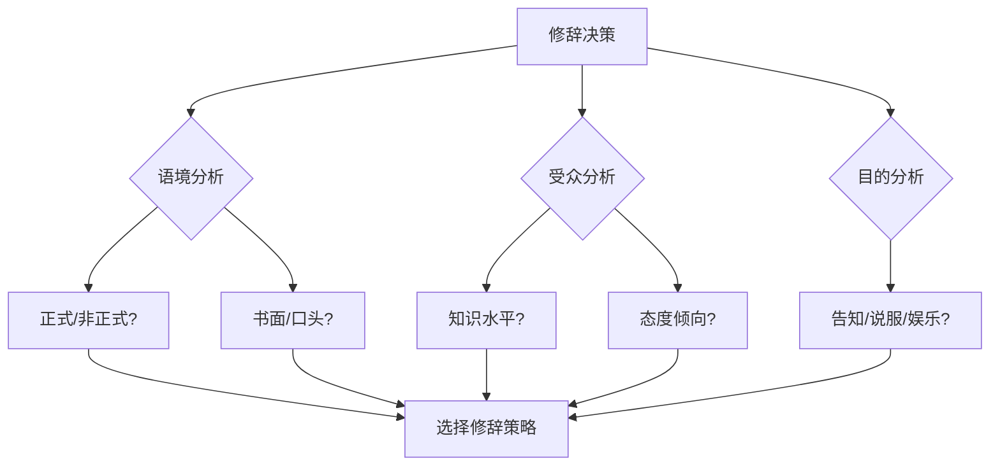

## 二、修辞学基础

修辞不是堆砌华丽辞藻，而是"在正确的场合，用正确的方式，说正确的话"。亚里士多德将其定义为"在每一事例中发现可用的说服方式的能力"——这个定义两千多年来从未过时。本节从修辞学的源流讲起，拆解古典五艺、系统梳理修辞手法、建立读者分析框架，并给出可落地的训练方法。

### 2.1 修辞学的源流与定义

#### 2.1.1 西方修辞学的起源

公元前5世纪，古希腊城邦叙拉古的公民需要在法庭上为自己辩护，由此催生了对修辞术的系统需求。科拉克斯（Corax）和提西亚斯（Tisias）被认为是最早的修辞学教师，他们编写的《修辞术》是已知最早的修辞学教材。随后，普罗泰戈拉（Protagoras）、高尔吉亚（Gorgias）等智者学派将修辞学发展为一门独立学科。

亚里士多德的《修辞学》是西方修辞学的奠基之作。他将修辞学从"说服技巧"提升为"推理科学"，建立了三个核心概念：

- **逻辑诉求（Logos）**：通过逻辑推理和证据说服听众
- **情感诉求（Pathos）**：通过触动情感激发共鸣
- **人格诉求（Ethos）**：通过建立可信度赢得信任

这三个概念构成了修辞学的基本框架，至今仍是所有说服性写作的核心要素。

罗马时期，西塞罗（Cicero）和昆体良（Quintilian）将修辞学推向高峰。西塞罗在《论演说家》中提出，完美的演说家应当是"能就任何主题进行优雅、有说服力的演说的人"。昆体良则更进一步，强调修辞与道德的统一——"好的演说家首先是好人"（vir bonus dicendi peritus）。

中世纪修辞学被纳入"三艺"（语法、修辞、逻辑），成为西方教育的基础学科。文艺复兴后修辞学一度衰落，但20世纪的"新修辞学"运动使其重获生机——修辞学从演讲术扩展为研究一切符号传播行为的学科。

#### 2.1.2 中国修辞学传统

中国的修辞传统同样源远流长，但走了一条不同的路——不追求形式化的理论体系，而是将修辞融入文论、诗话、词话之中。

**先秦时期**：孔子提出"辞达而已矣"（《论语·卫灵公》），强调修辞以达意为本，反对过度修饰。同时又说"言之无文，行而不远"（《左传·襄公二十五年》），承认文采对传播的重要性。这一辩证思想奠定了中国修辞学"质文并重"的基调。

**魏晋南北朝**：刘勰《文心雕龙》是中国古代最系统的修辞学著作。全书50篇，系统论述了文体、风格、修辞手法、创作心理等方面。其中"情采"篇论述内容与形式的关系，"比兴"篇论述比喻和联想的修辞功能，"夸饰"篇论述夸张的运用原则，"隐秀"篇论述含蓄与显豁的平衡。

**宋元明清**：诗话、词话、曲话成为修辞学的主要载体。严羽《沧浪诗话》提出"以禅喻诗"，王国维《人间词话》提出"境界说"，都是对修辞美学的深刻阐释。

**现代奠基**：1932年陈望道出版《修辞学发凡》，这是中国第一部系统的现代修辞学著作。他将修辞分为"消极修辞"（求通顺明白）和"积极修辞"（求生动有力）两大分野，并系统整理了38种辞格。

#### 2.1.3 修辞学的现代定义

综合中西传统，修辞学可以定义为：**研究如何根据特定的语境、受众和目的，选择最有效的语言策略来达成沟通目标的学科。**

这个定义包含三个关键要素：

| 要素 | 含义 | 对应的写作问题 |
|------|------|----------------|
| 语境（Context） | 说话的时间、地点、场合、社会文化背景 | 在什么场合写？ |
| 受众（Audience） | 接收信息的人群的特征和需求 | 写给谁看？ |
| 目的（Purpose） | 说话者想要达成的效果 | 想达到什么效果？ |



### 2.2 亚里士多德的三种说服诉求

三种说服诉求是修辞学的核心模型。理解它们不仅有助于写作，也有助于分析别人的文本——无论是一篇公众号文章、一份商业计划书还是一段政治演说，都在自觉或不自觉地运用这三种诉求。

#### 2.2.1 逻辑诉求（Logos）

逻辑诉诸通过推理和证据来说服受众。它是最"理性"的诉求方式，核心是让受众认为"你说的是对的"。

**逻辑诉求的两种推理形式**：

**演绎推理**：从一般原则推导出具体结论。

> "所有成功的创业者都具备强大的执行力（大前提）。张伟是一位成功的创业者（小前提）。因此，张伟具备强大的执行力（结论）。"

演绎推理的优势是逻辑严密，但前提是大前提必须成立。如果大前提有争议，整个论证就会崩塌。

**归纳推理**：从多个具体案例中归纳出一般规律。

> "在我们调查的500家企业中，采用OKR管理的企业平均增长率达到35%，而未采用的企业仅为12%。这表明OKR管理对企业发展有显著的正向影响。"

归纳推理的优势是有说服力，但样本量、样本代表性和因果关系都需要经得起检验。

**逻辑诉求的常用手段**：

| 手段 | 说明 | 适用场景 |
|------|------|----------|
| 数据引用 | 引用统计数字、调查结果 | 学术论文、商业报告、政策建议 |
| 案例论证 | 用具体事例支持论点 | 演讲、评论、提案 |
| 类比推理 | 用已知事物推论未知事物 | 解释新概念、说服决策 |
| 因果分析 | 揭示事件之间的因果关系 | 分析报告、诊断问题 |
| 历史类比 | 用历史事件类比当前情境 | 政治评论、战略分析 |

**逻辑诉求的常见陷阱**（必须避免）：

- **以偏概全**：用个别案例代表整体趋势。"我认识的三个程序员都不善社交，所以程序员都不善社交。"
- **虚假因果**：先后发生不代表因果关系。"我喝了这杯咖啡后就头疼了，所以咖啡导致头疼。"
- **稻草人谬误**：歪曲对方观点后进行反驳。"你说应该少吃肉？难道你要让大家全部吃素吗？"
- **滑坡谬误**：不合理的连锁推论。"如果允许学生在课堂上使用手机，他们就会沉迷游戏，然后成绩下降，最终一事无成。"
- **诉诸权威**：不相关的权威意见。"这位著名物理学家说这款保健品效果好，所以一定好。"

#### 2.2.2 情感诉求（Pathos）

情感诉诸通过激发受众的情感反应来说服他们。人不是纯理性的机器——亚里士多德早就认识到，情感会影响人的判断。

**情感诉求的核心机制**：

情感诉求之所以有效，是因为情感系统和认知系统在大脑中紧密关联。神经科学研究表明，杏仁核（负责情感处理）与前额叶皮层（负责理性决策）之间存在大量神经连接。当人处于强烈情感状态时，理性判断能力会受到影响——这正是情感诉求的生物学基础。

**常用的情感维度**：

| 情感类型 | 触发方式 | 适用场景 |
|----------|----------|----------|
| 恐惧 | 描述威胁和风险 | 安全教育、保险营销、政策倡导 |
| 希望 | 描绘美好愿景 | 创业融资、政治演说、公益倡导 |
| 愤怒 | 揭示不公正现象 | 社会评论、消费者维权、调查报道 |
| 同情 | 讲述弱势群体的故事 | 公益募捐、政策倡导 |
| 归属感 | 建立"我们"的群体认同 | 品牌营销、社区建设、政治动员 |
| 怀旧 | 唤起共同的记忆和情感 | 品牌传播、节日营销、文化评论 |
| 幽默 | 制造轻松愉快的氛围 | 内容营销、日常沟通、教学 |

**情感诉求的运用示例**：

> 弱："贫困地区的孩子缺乏教育资源。"
>
> 强："在贵州某个海拔2000米的山村里，8岁的小梅每天要走两个小时的山路去上学。她的书包里只有两本翻烂了的课本，和一个用橡皮筋绑着的铅笔头。她在作文里写道：'我想看看大海。'——而她从未离开过自己的县城。"

后者通过具体细节（8岁、两小时山路、铅笔头、"我想看看大海"）激活读者的同情心，远比抽象陈述有效。

**情感诉求的伦理边界**：

情感诉求是一把双刃剑。滥用情感诉求——刻意煽情、操纵恐惧、制造焦虑——不仅不道德，而且会适得其反。长期来看，受众会识破操纵，信任一旦崩塌就难以恢复。

使用情感诉求的原则：
1. **真诚**：情感应该基于真实的情况，而非虚构或夸大
2. **适度**：情感强度应该与事态的严重程度相匹配
3. **有据**：情感诉求应该与逻辑诉求配合使用，而非单独使用
4. **尊重**：不利用受众的弱点进行操纵

#### 2.2.3 人格诉求（Ethos）

人格诉诸通过建立说话者的可信度和权威性来说服受众。本质上，受众是在回答一个问题："我为什么要相信这个人？"

**人格诉求的三个来源**：

1. **先验可信度（Pre-existing Ethos）**：说话者在开口之前就已拥有的声誉和权威。比如一位诺贝尔奖得主谈论物理学，或一位20年经验的医生谈论治疗方案。

2. **现场可信度（Situated Ethos）**：说话者在演讲或写作过程中建立的可信度。比如展示专业知识、引用权威来源、承认自己的局限性。

3. **衍生可信度（Derived Ethos）**：说话者通过与可信的事物关联而获得的可信度。比如"哈佛大学研究表明……"或"据世界卫生组织报告……"。

**建立人格诉求的具体方法**：

- **展示专业背景**：不吹嘘，但让读者知道你有资格谈论这个话题
- **引用权威来源**：引用同行评审的学术论文、官方数据、行业报告
- **承认不确定性**：说"目前的研究还不确定"比假装什么都知道更可信
- **展示思维过程**：让读者看到你是如何得出结论的，而非只给结论
- **保持一致性**：前后观点矛盾会严重损害可信度
- **承认对方立场的合理性**：公平对待反对意见，而非只攻击稻草人

#### 2.2.4 三种诉求的协同运用

有效的说服从来不是只依赖某一种诉求，而是三种诉求的有机组合。

```mermaid
graph LR
    A[最优说服] --> B[Logos 逻辑]
    A --> C[Pathos 情感]
    A --> D[Ethos 人格]
    B --> E[让读者觉得"说得对"]
    C --> F[让读者觉得"说得好"]
    D --> G[让读者觉得"说得可信"]
    E --> H[有效说服]
    F --> H
    G --> H
```

**不同文体的诉求侧重**：

| 文体类型 | Logos权重 | Pathos权重 | Ethos权重 | 说明 |
|----------|-----------|------------|-----------|------|
| 学术论文 | ★★★★★ | ★ | ★★★★ | 证据为王，可信度是基本门槛 |
| 商业计划书 | ★★★★ | ★★★ | ★★★ | 逻辑+愿景+团队可信度 |
| 公益倡导 | ★★★ | ★★★★★ | ★★★ | 情感驱动，辅以数据和权威 |
| 新闻评论 | ★★★★ | ★★ | ★★★★ | 逻辑分析+作者公信力 |
| 品牌故事 | ★★ | ★★★★★ | ★★★ | 情感共鸣+品牌可信度 |
| 技术文档 | ★★★★★ | ★ | ★★★ | 纯逻辑，可信度来自准确性 |

### 2.3 古典修辞的五艺

古典修辞学将修辞的技艺分为五个环节，称为"修辞五艺"（Five Canons of Rhetoric）。这套框架虽然诞生于古希腊罗马时期，但对现代写作依然有极强的指导意义——它本质上是一个完整的写作工作流。


#### 2.3.1 发明（Inventio）——发现与组织素材

发明的核心问题是：**我应该说什么？用什么来支持我的观点？**

这是写作中最关键的阶段。一篇结构清晰、语言优美但缺乏实质性内容的文章，远不如一篇结构粗糙但论据扎实的文章有价值。

**发明的四层策略**：

**第一层：头脑风暴——发散思维**

不加评判地产生尽可能多的想法。关键原则是"数量优先于质量"——先追求数量，再进行筛选。

实用技法：
- **自由写作（Freewriting）**：设定10分钟计时器，不间断地写，不修改、不停顿、不回头看。
- **思维导图（Mind Mapping）**：以核心主题为中心，向外发散关联概念。
- **SCAMPER法**：从替代（Substitute）、合并（Combine）、调整（Adapt）、修改（Modify）、另作他用（Put to other uses）、消除（Eliminate）、重排（Reverse）七个角度审视主题。

**第二层：问题分析——结构化思考**

使用经典分析框架将散乱的想法系统化：

- **5W1H**：何人（Who）、何事（What）、何时（When）、何地（Where）、为何（Why）、如何（How）
- **STAR法**：情境（Situation）、任务（Task）、行动（Action）、结果（Result）
- **问题树**：将核心问题分解为子问题，再将子问题分解为更细的问题

**第三层：论据收集——为观点建立支撑**

每一条论据都应该是可以验证的。论据的层级如下：

| 论据层级 | 类型 | 可信度 | 示例 |
|----------|------|--------|------|
| 第一层 | 同行评审的学术研究 | ★★★★★ | Nature、Science期刊论文 |
| 第二层 | 官方数据和统计 | ★★★★ | 国家统计局、世界银行数据 |
| 第三层 | 行业报告和专业分析 | ★★★★ | 麦肯锡报告、Gartner分析 |
| 第四层 | 专家访谈和权威观点 | ★★★ | 行业领袖公开演讲、专业书籍 |
| 第五层 | 案例和实例 | ★★★ | 成功/失败案例、个人经历 |
| 第六层 | 常识和公理 | ★★ | 广为人知的事实和规律 |

**第四层：反驳预判——消除潜在反对**

提前预测读者可能的反对意见，并准备应对策略。这一步至关重要——如果你不主动处理反对意见，读者就会在心里替你处理，而且往往是以对你不利的方式。

操作方法：
1. 列出所有可能的反对意见（至少5条）
2. 按照严重程度排序
3. 对每条反对意见准备回应（承认、反驳、或调和）
4. 在文章中主动提出最严重的反对意见并加以回应

#### 2.3.2 安排（Dispositio）——组织文章结构

安排的核心问题是：**我应该按照什么顺序来说？**

古典修辞学将演讲（文章）分为六个部分：

| 部分 | 拉丁名 | 功能 | 现代对应 |
|------|--------|------|----------|
| 引言 | Exordium | 吸引注意力，建立可信度，预告主题 | 开头段、导语 |
| 叙述 | Narratio | 陈述背景和事实 | 背景介绍 |
| 划分 | Partitio | 概述主要论点 | 论点陈述、目录 |
| 确认 | Confirmatio | 提供支持论点的证据和论证 | 正文论证 |
| 反驳 | Refutatio | 回应反对意见 | 反驳段落、FAQ |
| 结论 | Peroratio | 总结观点，呼吁行动 | 结尾、行动号召 |

**现代写作中常用的结构模式**：

**金字塔结构（Minto Pyramid）**：结论先行，自上而下展开。
- 先给出核心结论
- 再展开支撑结论的论点
- 最后提供每个论点的证据
- 适用于：商业报告、决策文档、邮件

**SCQA结构**：情境（Situation）→ 冲突（Complication）→ 问题（Question）→ 答案（Answer）
- 适用于：提案、咨询报告、问题分析

**时间线结构**：按时间顺序组织内容。
- 适用于：传记、历史叙事、项目复盘

**问题-解决方案结构**：先描述问题，再给出解决方案。
- 适用于：技术文档、产品说明、政策建议

#### 2.3.3 风格（Elocutio）——选择恰当的语言

风格的核心问题是：**我应该怎样说？**

古典修辞学将风格分为四个品质层次：

| 品质 | 含义 | 反面 |
|------|------|------|
| 正确（Correctness） | 使用规范的语法和词汇 | 错别字、病句、用词不当 |
| 清晰（Clarity） | 让读者容易理解 | 晦涩、歧义、逻辑跳跃 |
| 得体（Appropriateness） | 符合场合和受众 | 大词小用、庄词谐用、语域错位 |
| 优美（Ornateness） | 使用修辞手法增强效果 | 干瘪无味、辞藻堆砌 |

**风格选择的决策框架**：

写作时需要在"正式—非正式"和"简洁—详尽"两个维度上找到合适的定位：

              正式
               |
    学术论文   |   商业报告
               |
简洁 —————————+——————————— 详尽
               |
    社交媒体   |   深度长文
               |
             非正式

#### 2.3.4 记忆（Memoria）——知识管理与素材积累

记忆在古典修辞学中指记住演讲内容的技艺。古希腊演说家发展出"记忆宫殿"（Method of Loci）等记忆术——将需要记忆的内容与想象中的空间位置关联。

在现代写作中，记忆对应的是**知识管理和素材积累**。你需要建立自己的"素材库"：

- **案例库**：收集有说服力的真实案例，按领域分类
- **数据库**：收藏权威数据来源，定期更新
- **金句库**：积累精辟的表述、引言、类比
- **模板库**：保存优秀文章的结构模板
- **错题库**：记录自己写作中的常见错误和改进方法

#### 2.3.5 表达（Pronuntiatio）——视觉呈现与排版

表达在古典修辞学中指演讲时的声音、语调、肢体语言。在写作中，对应的是**排版、格式和视觉呈现**。

研究表明，网页文本的阅读模式是"F型扫描"——读者先水平扫描顶部，再水平扫描中部，最后垂直扫描左侧。这意味着：

- 标题和前几段决定了读者是否继续阅读
- 每段开头的几个词承担了最多的注意力
- 长篇纯文本会导致阅读疲劳

视觉呈现的关键原则：
- **段落长度**：每段3-5句话，超过6句就该考虑分段
- **标题层级**：最多使用H2/H3/H4三级，标题应该能独立构成文章大纲
- **留白**：段落之间、图文之间留出足够的空白
- **视觉锚点**：用加粗、列表、表格、图示打破纯文本的单调
- **信息密度**：每屏至少有一个视觉元素（图、表、列表、引用框）

### 2.4 修辞手法系统分类

修辞手法是修辞学的"工具箱"。掌握它们不是为了炫耀学识，而是为了在需要时有合适的选择。下面按照功能将修辞手法分为七大类，每一类都给出定义、示例、分析和写作应用。

#### 2.4.1 比喻类——化抽象为具象

比喻是人类认知的基本方式。认知语言学家乔治·莱考夫（George Lakoff）在《我们赖以生存的隐喻》中指出，人类的抽象思维在很大程度上依赖于隐喻——我们用身体经验来理解抽象概念（如"价格走高"、"情绪低落"）。

**明喻（Simile）**

用"像"、"如"、"仿佛"、"好比"等词将两个不同事物进行显式比较。

> 示例："程序中的Bug就像杂草——你以为拔掉了最后一棵，回头一看又冒出来一片。"

分析：将Bug比作杂草，利用读者对杂草"除之不尽"的生活经验，传达Bug的顽固性。好的明喻应该让读者产生"确实如此"的共鸣。

写作应用：在解释抽象概念、技术原理或复杂关系时使用。选择喻体时，优先选择读者熟悉的事物。

**隐喻（Metaphor）**

不使用比较词，直接将一个事物说成另一个事物，建立更深层的认知映射。

> 示例："信息就是新时代的石油。"

分析：这个隐喻暗示信息像石油一样——有价值的原材料，需要开采和提炼才能产生价值。隐喻比明喻更有力，因为它不是"像"，而是"就是"，建立的是等同关系而非比较关系。

写作应用：隐喻适合用来建立框架性的认知。一旦读者接受了"信息是石油"这个隐喻，后续一系列推理（采集、提炼、交易、垄断）都变得自然。

**拟人（Personification）**

将非人的事物赋予人的特征、行为或情感。

> 示例："这家公司在创始人离开后就失去了灵魂，像一个没有方向的流浪者。"

写作应用：拟人能让抽象概念或组织变得生动可感。品牌营销中大量使用拟人（"品牌人格化"），在描述组织行为、市场趋势、技术特性时也非常有效。

**借代（Metonymy）**

用一个与本体有密切关联的事物来代替本体。

> 示例："五角大楼对此表示关注。"（用"五角大楼"代指美国国防部）
>
> 示例："他读了很多莎士比亚。"（用作者名代指作品）

写作应用：借代能让表达更简洁、更有文化内涵。在新闻写作和评论写作中极为常用。使用借代时需要确保读者能理解代指关系。

**提喻（Synecdoche）**

用部分代整体或整体代部分，是借代的一种特殊形式。

> 示例："我们需要新鲜血液加入团队。"（用"血液"代指"人才"）
>
> 示例："中国拿下了38枚金牌。"（用国名代指该国运动员）

**类比（Analogy）**

通过比较两个事物在多个方面的相似性来进行推理。

> 示例："防火墙就像大楼的保安——它检查每一个进出的人，只有持有效证件的才放行。"

分析：类比不仅仅是修辞手段，更是一种推理方式。好的类比能帮助读者用已知领域的知识来理解未知领域。

写作应用：在技术写作、科普写作、教学材料中，类比是最强大的工具之一。选择类比时要注意：两个事物应该在关键属性上相似，在非关键属性上可以不同。

#### 2.4.2 强调类——增强表达力度

**排比（Parallelism）**

使用相同或相似的句式结构来表达相关内容。

> 示例："我们为创新而来，为突破而来，为改变世界而来。"

分析：排比通过句式的重复建立节奏感和仪式感。三个元素的排比尤其有效——三段式在认知上感觉最完整、最有力。

写作应用：排比适合用于文章的高潮处、总结处、呼吁行动处。注意排比的各元素之间应该有逻辑递进关系，而不是简单罗列。

**反复（Repetition）**

有意地重复某些词语或句子，强化核心信息。

> 示例："我有一个梦想——有一天，这个国家会站立起来，真正实现其信条的真谛……我有一个梦想——有一天，在佐治亚的红色山丘上，昔日奴隶的儿子将能够和昔日奴隶主的儿子同坐在兄弟的桌旁……"（马丁·路德·金）

分析：马丁·路德·金重复"我有一个梦想"共9次，每次后面接不同的愿景。反复的力量在于建立期待——听众知道还会再来一次，每一次都在积蓄力量。

写作应用：反复最适合在演讲稿、宣言、品牌口号中使用。反复的频率要适度——太少不起作用，太多会让人厌烦。

**夸张（Hyperbole）**

故意夸大或缩小事物的特征，以增强表达的情感力度。

> 示例："我已经看了一万遍这份报告了。"
>
> 示例："他跑得比闪电还快。"

写作应用：夸张是一种高风险高回报的修辞手法。用得好能增加幽默感和表达力度，用得不好会显得浮夸不实。在正式写作和数据相关的内容中应避免使用夸张。

**反问（Rhetorical Question）**

不需要回答的问题，答案隐含在问题本身中。

> 示例："难道我们愿意看到自己的孩子生活在一个充满污染的世界里吗？"

分析：反问的力量在于让读者自己得出结论。自己得出的结论比别人告诉你的更有说服力——这就是反问的心理机制。

写作应用：反问适合在论证的关键转折处使用。但不宜过多——一篇文章中2-3个反问就足够了。过多的反问会让文章显得咄咄逼人。

**层递（Climax / Gradatio）**

按照意义的轻重、范围的大小、程度的深浅，层层递进地排列语句。

> 示例："一个人的努力是加法，一个团队的努力是乘法，一个平台的努力是指数。"

分析：层递与排比类似，但强调的是递进关系而非平行关系。每一层都比前一层更进一步，最终达到高潮。

**设问（Hypophora）**

先提出问题，然后自己回答。与反问不同，设问需要给出明确答案。

> 示例："什么是好的写作？好的写作是让读者在读完之后，觉得这个世界比读之前清晰了一点点。"

写作应用：设问适合在文章开头或段落开头使用，用来引出要讨论的问题并给出自己的答案。

#### 2.4.3 对比类——制造张力与反差

**对比（Antithesis）**

将相反或相对的事物并列，形成鲜明对照。

> 示例："不在沉默中爆发，就在沉默中灭亡。"（鲁迅）
>
> 示例："有的人活着，他已经死了；有的人死了，他还活着。"（臧克家）

分析：对比通过二元对立来突出观点。它利用了人类认知中的"对比效应"——当我们同时面对两个相反的事物时，每个事物的特征都会被放大。

写作应用：对比适合在论证关键分歧、展示事物的两面性时使用。

**悖论（Paradox）**

表面上自相矛盾，实际上蕴含深刻真理的表述。

> 示例："少即是多。"（Less is more.）
>
> 示例："我知道我什么都不知道。"（苏格拉底）

写作应用：悖论能引发读者的深度思考。好的悖论在第一次读时让人困惑，理解后让人豁然开朗。

**矛盾修辞（Oxymoron）**

将两个互相矛盾的词放在一起。

> 示例："残酷的仁慈"、"清醒的疯狂"、"甜蜜的负担"

写作应用：矛盾修辞能在一个极短的表达中制造张力，适合在标题、金句、文学描写中使用。

**反语（Irony）**

说的和真实意思相反。

> 示例："真是太好了，我又加班到了凌晨两点。"

写作应用：反语能制造幽默效果或尖锐的批评。但反语有风险——如果读者没有意识到你在说反话，就会产生误解。在书面文字中缺少语调的辅助，反语更容易被误解。

#### 2.4.4 声音类——增强语言的音乐性

语言不仅传递意义，还通过声音影响感受。声音类修辞在诗歌、歌词、广告语和演讲中尤为重要。

**头韵（Alliteration）**

连续的词语以相同的辅音开头。

> 英文示例："Peter Piper picked a peck of pickled peppers."
>
> 中文示例："纷纷扬扬"（f开头叠词）、"叽叽喳喳"

**叠韵与押韵**

叠韵指韵母相同的词语组合，押韵指句子末尾的韵母相同。

> 叠韵示例："彷徨"（ang-ang）、"逍遥"（iao-iao）、"从容"（ong-ong）
>
> 押韵示例："床前明月光，疑是地上霜。"（光-霜，ang韵）

**拟声（Onomatopoeia）**

用模仿自然界声音的词语来描述事物。

> 示例："泉水叮咚"、"雷声隆隆"、"树叶沙沙作响"

**对偶（Antithetical Parallelism）**

中文特有的修辞手法，用字数相等、结构相同、意义对称的两个语句来表达相关或相反的意思。

> 示例："海内存知己，天涯若比邻。"（王勃）
>
> 示例："横眉冷对千夫指，俯首甘为孺子牛。"（鲁迅）

分析：对偶是中文修辞的精髓。它不仅是形式美——对仗的工整本身就传达了一种秩序感和力量感。英语中的对偶（antithesis）更注重意义的对立，中文的对偶则同时追求字数、词性、平仄的对称。

写作应用：对偶在中文写作中有广泛的应用——标题、金句、对联、口号、歌词。掌握对偶能让中文写作更有韵味。

#### 2.4.5 转换类——改变表达视角

**换位（Enallage）**

故意改变词性或语法关系来创造新鲜感。

> 示例："他很阳光。"（名词作形容词）

**夸张降格（Bathos / Anti-climax）**

从庄重严肃突然转为平庸琐碎，制造喜剧效果。

> 示例："这次战争的胜负关系到国家的存亡、民族的命运，以及食堂的午餐供应。"

**转品（Conversion）**

在中文中将一个词从一种词性临时转用为另一种词性。

> 示例："春风又绿江南岸"（王安石）——"绿"本是形容词，这里用作动词。

#### 2.4.6 含蓄类——言外之意

**双关（Pun / Paronomasia）**

利用词语的多义性或同音现象，使一句话同时有两层含义。

> 示例（谐音双关）："东边日出西边雨，道是无晴却有晴。"（刘禹锡）——"晴"与"情"谐音。
>
> 示例（语义双关）："我们是一家'专注'的公司——因为什么都做不好，只能专注了。"

写作应用：双关能增加语言的趣味性和层次感。在广告语、品牌名、标题中特别有效。但双关不宜过深过隐——如果读者get不到，就失去了意义。

**暗示（Insinuation / Innuendo）**

不直接说出，而是通过暗示让读者自己理解。

> 示例："他的简历写得很精彩。"（暗示实际能力与简历不符）

**委婉语（Euphemism）**

用温和的说法替代直接或令人不快的表达。

> 示例："他去世了"→"他离开了我们"
>
> 示例："被解雇了"→"被优化了"、"毕业了"

写作应用：委婉语能体现对读者和当事人的尊重。但过度使用委婉语会造成信息模糊、降低沟通效率。在需要明确传达信息时，应该使用直接的语言。

**留白（Aposiopesis）**

说到一半突然中断，让读者自行补全。

> 示例："如果你再这样下去的话……算了，不说了。"

写作应用：留白的力量在于"不说的比说的更有分量"。在文学创作和情感表达中，适当的留白能激发读者的想象力。

#### 2.4.7 中文特有修辞手法

中文有几千年文学传统，形成了一些独特的修辞手法：

**顶针（Anadiplosis）**

前一句的结尾词语作为后一句的开头。

> 示例："大肚能容，容天下难容之事；开口便笑，笑世间可笑之人。"

**回环（Chiasmus / Epanodos）**

将前一句的词语在后一句中逆序排列，形成回环往复的效果。

> 示例："信言不美，美言不信。"（《道德经》）
>
> 示例："我们因相信而看见，非因看见而相信。"

**互文（Intertextuality in Classical Chinese）**

上下文各举一个事物，实际是合在一起表达完整意思。

> 示例："将军百战死，壮士十年归。"——不是说将军都死了、壮士都回来了，而是将军和壮士都有百战死、十年归的。

**通感（Synaesthesia）**

将不同感官的感觉互相转移。

> 示例："微风过处，送来缕缕清香，仿佛远处高楼上渺茫的歌声似的。"（朱自清）——嗅觉转化为听觉。

**仿拟（Parody / Imitation）**

模仿已有的名句、成语、俗语的格式，填入新的内容。

> 示例："人生若只如初见，何事秋风悲画扇" → "人生若只如初见，何事WiFi总断连"

写作应用：仿拟能利用读者对原作的认知，快速建立趣味性。在自媒体写作和社交媒体内容中非常有效。

### 2.5 修辞策略与受众分析

修辞的本质是"受众导向"的沟通。同样一个观点，面对不同的受众，需要使用完全不同的修辞策略。

#### 2.5.1 受众分析的五个维度

| 维度 | 核心问题 | 分析方法 |
|------|----------|----------|
| 知识水平 | 读者对主题了解多少？ | 确定专业术语的使用程度，判断是否需要解释基本概念 |
| 态度倾向 | 读者对你的观点是支持、中立还是反对？ | 决定论证的力度和策略——强化、引导还是转化 |
| 情感状态 | 读者在阅读时可能处于什么情感状态？ | 决定情感诉求的方向和力度 |
| 文化背景 | 读者的文化背景如何影响理解？ | 决定比喻、典故、例子的选择 |
| 阅读目的 | 读者为什么要读这篇文章？ | 决定内容的侧重和深度 |

#### 2.5.2 针对不同受众的修辞策略

**对支持者（已有倾向的受众）**：
- 核心策略：强化信念，激发行动
- 修辞重点：更多Pathos（激发热情），适度Logos（提供新的论据）
- 注意事项：不要低估支持者的智商——即使是支持者也不喜欢被当傻子

**对中立者（尚无明确立场的受众）**：
- 核心策略：提供充分信息，引导形成判断
- 修辞重点：平衡Logos（数据和事实）和Pathos（情感共鸣），建立Ethos（可信度）
- 注意事项：中立者最怕偏颇——要公平呈现各方观点，再引导到你的结论

**对反对者（持不同意见的受众）**：
- 核心策略：寻找共同立场，逐步推进
- 修辞重点：大量Ethos（展示理解和善意），强Logos（事实和逻辑），弱Pathos（避免激发对立情绪）
- 注意事项：首先承认对方观点的合理性（"钢铁人策略"——先把对方的观点说得比他自己还好，再提出自己的看法）

**对专家（具备深厚专业知识的受众）**：
- 核心策略：展示深度，提供新视角
- 修辞重点：精准Logos（高质量数据和严密推理），强Ethos（展示专业背景）
- 注意事项：专家最讨厌被说教。不要解释他们已经知道的东西，直奔新信息。

**对普通读者（非专业背景的受众）**：
- 核心策略：通俗易懂，引人入胜
- 修辞重点：强Pathos（故事和情感），类比和比喻（将专业概念翻译为生活经验），适度Logos
- 注意事项：专业术语是最大的障碍。每引入一个术语都必须解释，能用日常语言替代就替代。

#### 2.5.3 受众分析的实操模板

在开始写作之前，花5分钟回答以下问题：

```markdown
## 受众画像

1. **他们是谁？**
   - 年龄段：
   - 职业/身份：
   - 教育水平：
   - 阅读习惯：

2. **他们对这个话题知道多少？**
   - 完全不懂 / 了解基础 / 比较熟悉 / 行业专家
   - 需要解释的概念：
   - 可以直接使用的术语：

3. **他们对我的观点是什么态度？**
   - 支持 / 中立 / 反对 / 不确定
   - 可能的反对意见：

4. **他们读这篇文章想得到什么？**
   - 获取信息 / 解决问题 / 寻求娱乐 / 确认观点

5. **我需要在哪些方面做出调整？**
   - 语言风格：正式 / 半正式 / 轻松
   - 信息密度：高 / 中 / 低
   - 论证方式：数据驱动 / 故事驱动 / 逻辑驱动
```

### 2.6 不同文体的修辞适配

修辞不是一成不变的——不同文体有不同的修辞规范和读者期待。

#### 2.6.1 学术写作的修辞

学术写作的修辞特征：客观、精确、谨慎。

- **避免主观判断**：不说"我认为"，说"数据表明"、"研究显示"
- **限定表述范围**：使用"在一定条件下"、"本研究的样本范围内"等限定语
- **引用规范**：每一条事实性声明都需要可验证的来源
- **避免修辞手法**：明喻、夸张、反问在学术写作中通常不合适
- **逻辑严密**：论证链条中不允许跳步

> 差："这个方法明显比传统方法好得多。"
>
> 好："在A/B测试中，实验组的转化率为12.3%，对照组为8.7%，差异在p<0.01水平上具有统计显著性（n=2000）。"

#### 2.6.2 商业写作的修辞

商业写作的修辞特征：简洁、明确、行动导向。

- **结论先行**：先说"做什么"，再说"为什么"
- **数据说话**：用数字替代形容词——"增长了23%"而不是"增长了很多"
- **行动导向**：每一段都应该指向一个具体的行动或决策
- **留白有力**：商业读者时间宝贵，不要用废话填充

#### 2.6.3 自媒体写作的修辞

自媒体写作的修辞特征：口语化、情感化、互动性强。

- **标题为王**：标题决定了80%的打开率，善用疑问句、数字、悬念
- **口语化表达**：像和朋友聊天一样写，避免书面语
- **高频情感刺激**：每300字左右需要一个情感触发点（故事、金句、反问）
- **互动设计**：在文中设计互动点（提问、投票、评论引导）

#### 2.6.4 技术写作的修辞

技术写作的修辞特征：精确、结构化、用户导向。

- **术语一致**：同一概念始终使用同一个术语
- **步骤清晰**：操作步骤用编号列表，每步一个动作
- **示例驱动**：每个概念至少配一个可执行的示例
- **错误处理**：预见用户可能犯的错误，给出解决方案

### 2.7 常见修辞误区与纠正

#### 误区一：把修辞等同于华丽辞藻

**错误认知**：修辞就是用优美的、华丽的语言来装饰文章。

**纠正**：修辞的本质是有效沟通，而非语言装饰。最好的修辞往往是朴素而精确的。海明威的风格简洁到了极致，但没有人会说他的写作缺乏修辞技巧——他只是选择了"简洁"这种修辞策略。

> 过度修饰："在那个璀璨如银河般洒满金色光辉的、令人心旷神怡的傍晚时分……"
>
> 简洁有力："那天傍晚，落日把整条河染成了金色。"

#### 误区二：堆砌修辞手法

**错误认知**：文章中用的修辞手法越多越好。

**纠正**：修辞手法是调味料，不是主菜。一篇文章中几种恰当的修辞手法就足够了。过多的修辞会让读者疲惫，也会分散对核心信息的注意力。原则是"少而精"——每个修辞手法都应该为论证服务，而非为了展示技巧。

#### 误区三：忽略受众，自说自话

**错误认知**：只要我写得好，读者就应该能理解。

**纠正**：沟通的效果取决于接收方而非发送方。如果读者没看懂，问题在于你而非读者。在动笔之前，先明确你的目标受众是谁，他们的知识水平、阅读习惯和期待是什么。

#### 误区四：滥用情感诉求

**错误认知**：文章越感人越好，越能打动人越有效。

**纠正**：情感诉求必须建立在事实基础上。没有事实支撑的情感诉求就是煽情，不仅不道德，而且会适得其反——读者会感到被操纵，进而怀疑你的可信度。

#### 误区五：在需要直接表达时使用修辞

**错误认知**：所有地方都可以用修辞手法来美化。

**纠正**：有些场景需要直接、清晰的表达，不适合使用修辞手法：
- 法律文件和合同
- 安全警告和操作指南
- 科学数据和实验结果
- 紧急通知

在这些场景中，任何可能引起歧义的修辞手法都是危险的。

#### 误区六：文化错配

**错误认知**：一种文化中的优秀修辞在另一种文化中也一定有效。

**纠正**：修辞具有强烈的文化依赖性。中文中的"引经据典"在英文中可能变成"卖弄学问"；英文中的"understatement（低调陈述）"在中文中可能被理解为"不够自信"。在跨文化写作中，需要了解目标文化的修辞规范。

### 2.8 修辞能力的训练路径

修辞能力不是天赋，是可以通过系统训练获得的技能。

#### 第一阶段：建立意识（1-2周）

- **目标**：能够识别文本中使用的修辞手法
- **训练方法**：
  - 每天精读一篇优质文章，标记出所有修辞手法
  - 分析每个修辞手法的作用：它为什么在这里出现？它起了什么效果？
  - 建立一个修辞手法笔记本，记录好的示例

#### 第二阶段：模仿练习（2-4周）

- **目标**：能够有意识地使用修辞手法
- **训练方法**：
  - 每天用一种修辞手法写一个句子
  - 对同一个意思尝试用3种不同的修辞手法来表达
  - 模仿优秀作者的修辞风格写一段话

#### 第三阶段：策略应用（4-8周）

- **目标**：能够根据受众和目的选择合适的修辞策略
- **训练方法**：
  - 同一个主题，分别写给专家和普通读者
  - 写一篇说服性文章，刻意融合三种诉求
  - 改写一篇自己之前的文章，优化其修辞效果

#### 第四阶段：风格形成（持续）

- **目标**：形成自己独特的修辞风格
- **训练方法**：
  - 大量阅读不同风格的作者，找到自己的偏好
  - 写作时有意识地选择修辞策略，直到变成本能
  - 定期回顾自己的文章，分析修辞效果，持续改进

**每日修辞训练清单**：

□ 精读一篇优质文章（15分钟）
□ 标记修辞手法，分析其效果（5分钟）
□ 用今天学到的修辞手法写3个句子（10分钟）
□ 改写自己之前写的一段话，提升修辞效果（10分钟）
□ 记录一个优秀的修辞案例到笔记本（5分钟）

每天35分钟，坚持3个月，你的写作能力会有质的飞跃。
