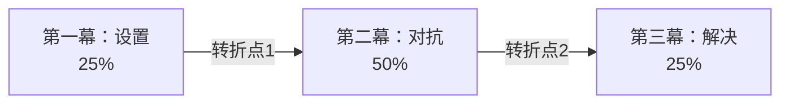
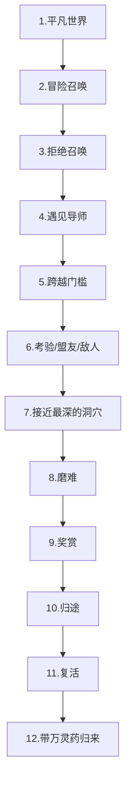
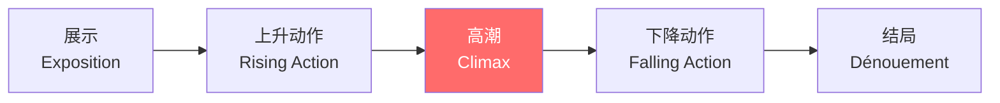

## 三、叙事理论

叙事（Narrative）是人类最古老的思维工具。从洞穴壁画到短视频，从荷马史诗到商业计划书，叙事始终是人类组织经验、传递意义的核心方式。认知科学家罗杰·尚克（Roger Schank）指出："人类的大脑本质上是一台故事处理器——我们用故事来理解世界，用故事来记忆，用故事来说服。"掌握叙事理论，就是掌握一套可以迁移到任何写作场景的底层能力。

### 3.1 叙事的本质与功能

#### 3.1.1 什么是叙事

叙事是对一系列事件的有组织呈现。它不仅仅是"讲故事"，更是一种认知框架。当我们把散乱的事件组织成一个有开头、中间和结尾的序列时，我们就赋予了这些事件因果关系和意义。

叙事与"描述"和"论证"的根本区别在于：叙事关注的是**发生了什么**以及**为什么发生**，而描述关注"是什么样的"，论证关注"为什么是对的"。三者常常交织，但叙事的核心引擎是**时间+因果+变化**。

一个最小叙事单元包含三个要素：
- **事件**：发生了什么（一个动作或状态变化）
- **角色**：谁经历了这个事件
- **变化**：事件导致了什么不同

缺少任何一个要素，都只是信息罗列，而非叙事。

#### 3.1.2 叙事的四大功能

| 功能 | 机制 | 典型场景 |
|------|------|----------|
| **认知功能** | 故事将抽象信息嵌入具体的因果链条，利用大脑的情节记忆系统，使信息的记忆提取效率提高6-7倍（斯坦福大学研究） | 教学、培训、知识传播 |
| **情感功能** | 故事触发"神经耦合"效应——听故事时，听众的大脑活动模式会与讲述者同步（普林斯顿大学fMRI研究），产生深度共鸣 | 文学、影视、品牌营销 |
| **社会功能** | 共同的故事构建群体认同。神话、传说、历史叙事是文化凝聚力的基石 | 组织文化、民族叙事、社区建设 |
| **说服功能** | 故事绕过读者的"说服防御机制"。当读者沉浸于情节时，批判性思维暂时降低，更容易接受故事中隐含的观点和价值观 | 广告、演讲、政治传播、商业提案 |

#### 3.1.3 叙事认知：为什么人类离不开故事

心理学家丹尼尔·卡尼曼在《思考，快与慢》中区分了"系统1"（快速直觉思维）和"系统2"（慢速理性思维）。叙事之所以强大，是因为它同时激活两个系统：

- **系统1被激活**：情节的悬念、角色的命运引发直觉性的情感反应
- **系统2被激活**：因果推理、意义建构引发理性的思考

这种双系统激活是数据、图表和纯逻辑论证难以实现的。这也是为什么乔布斯的发布会总是从一个故事开始，而不是从参数表开始。

### 3.2 经典叙事结构

叙事结构是故事的骨架。不同的结构模型适用于不同的写作场景。以下是四种经过时间检验的经典结构。

#### 3.2.1 三幕式结构

三幕式结构是西方戏剧和电影中最经典的叙事结构，起源于亚里士多德的《诗学》，在好莱坞被系统化为工业标准。

**第一幕：设置（Setup）——约占全文25%**

核心任务：建立世界、引入角色、触发事件。

- **建立"正常世界"**：展示主角的日常生活、性格特征、内心渴望。读者需要在前几页就对主角产生关注（不一定是喜欢，但必须感兴趣）。
- **引入触发事件（Inciting Incident）**：一个打破平衡的事件——可以是一个机会、一个威胁、一个意外发现。这个事件将主角推向不得不行动的境地。
- **第一个转折点**：主角做出决定、踏上旅程的时刻。这是"过河拆桥"的时刻——从此无法回到原来的生活中。

关键原则：第一幕不是"背景介绍"，而是"承诺"——你向读者承诺了什么类型的冲突、什么量级的风险、什么样的情感体验。

**第二幕：对抗（Confrontation）——约占全文50%**

核心任务：冲突升级、角色成长、信息揭示。

这是故事中最长也最容易写崩的部分。许多新手作者在第二幕陷入"游荡"——角色在做各种事情，但没有明确的方向感。

- **冲突不断升级**：每一个行动都应该面临更大的阻力。如果第二幕中段的难度和第一幕结尾一样，读者会觉得故事在原地踏步。
- **中点事件**：故事的"虚假胜利"或"虚假失败"——角色以为问题解决了（其实没有），或者陷入最低谷（但还有转机）。中点将第二幕分为前后两个半场。
- **B故事线**：通常是一条情感关系线或主题深化线，为主线叙事提供对比和补充。
- **"最黑暗的时刻"**：在第二个转折点之前，角色面临最大的失败和绝望。这是高潮前的"黎明前的黑暗"。

**第三幕：解决（Resolution）——约占全文25%**

核心任务：冲突爆发、意义呈现、情感释放。

- **高潮**：主角直面核心冲突。高潮的本质是"选择"——主角必须做出一个体现其成长和价值观的决定性选择。
- **结局**：展示选择的后果，解决所有悬而未决的情节线。
- **新的平衡**：世界和角色都发生了变化。这个变化应该与第一幕形成对比——如果开头是"普通人过着普通生活"，结尾应该是"这个人已经不是原来的那个人了"。

#### 3.2.2 英雄之旅模型

约瑟夫·坎贝尔（Joseph Campbell）在《千面英雄》中通过比较全世界数百个神话，发现了一个惊人的一致性——所有文化中的英雄故事都共享同一个深层结构。克里斯托弗·沃格勒（Christopher Vogler）将其简化为12个阶段，写入《作家之旅》，成为好莱坞编剧的标准工具。

12个阶段详解：

| 阶段 | 核心事件 | 写作要点 |
|------|----------|----------|
| 1. 平凡世界 | 英雄的日常生活 | 必须展示英雄的"缺陷"或"未满足的渴望"，为后续成长埋下种子 |
| 2. 冒险召唤 | 收到改变的信号 | 可以是一封信、一个人、一个事件、一个发现——必须打破平衡 |
| 3. 拒绝召唤 | 犹豫和恐惧 | 体现人性的真实。没有犹豫的英雄是空洞的 |
| 4. 遇见导师 | 获得指引或工具 | 导师不必是人——可以是一本书、一次经历、一个顿悟时刻 |
| 5. 跨越门槛 | 正式进入新世界 | 第一幕结束的标志。英雄做出不可逆的决定 |
| 6. 考验/盟友/敌人 | 在新世界中学习规则 | 展示新世界的运行法则，英雄开始适应和成长 |
| 7. 接近最深的洞穴 | 准备面对最大挑战 | 内心的恐惧和外部的压力同时加大 |
| 8. 磨难 | 经历最严峻的考验 | 故事的最高潮。英雄可能"死而复生"——象征性的或字面意义上的 |
| 9. 奖赏 | 获得宝物或知识 | 英雄带着战利品准备返回 |
| 10. 归途 | 开始返回 | 返回途中可能面临新的追击或挑战 |
| 11. 复活 | 最终的蜕变 | 英雄用在旅程中获得的新能力面对最后的考验 |
| 12. 带万灵药归来 | 回到平凡世界 | 英雄带回的"万灵药"可以是知识、能力、价值观——改变了原来的世界 |

**英雄之旅在非虚构写作中的应用**：

英雄之旅不仅仅适用于神话和小说。在商业写作和个人品牌建设中，它是极其有效的框架：

- **个人品牌故事**：将你的职业成长经历套入英雄之旅——你的"平凡世界"是什么？你的"冒险召唤"是什么事件？你的"磨难"是什么？你带回来的"万灵药"是什么独特的经验或视角？
- **商业案例写作**：客户是英雄，他们的业务问题是"冒险召唤"，你的产品/服务是"导师"提供的工具，最终的成功是"奖赏"。
- **演讲结构**：用英雄之旅的12个阶段组织演讲，比传统的"开头-中间-结尾"更有感染力。

#### 3.2.3 弗莱塔格金字塔

德国剧作家古斯塔夫·弗莱塔格（Gustav Freytag）在1863年提出的五阶段结构，最初用于分析古典悲剧，但同样适用于现代叙事。

- **展示**：介绍背景、人物、关系、初始状态。与三幕式的"第一幕"对应，但更强调信息的铺陈。
- **上升动作**：一系列递增的事件推动冲突升级。每一个事件都应该比前一个更紧迫、更危险。
- **高潮**：故事的最高点——冲突达到最大张力，角色做出关键选择。弗莱塔格认为高潮应该在故事的正中间或略偏前。
- **下降动作**：高潮之后的后果展开。新的信息被揭示，意外的角色加入，次要冲突开始解决。
- **结局**：所有冲突的最终解决，新的平衡建立。"Dénouement"在法语中的意思是"解开"——就像解开一个绳结。

弗莱塔格金字塔特别适合短篇叙事和单一主线的故事。对于多线并行的长篇作品，每一条线都可以有自己的金字塔，多个金字塔交织形成更复杂的结构。

#### 3.2.4 其他重要叙事结构

**起承转合（东方叙事传统）**

中国古典叙事的核心结构，源于诗歌和戏曲：

- **起**：开篇，引入背景和人物
- **承**：承接，发展情节，深化冲突
- **转**：转折，出现意外变化，引入新的矛盾
- **合**：收束，冲突解决，意义升华

与三幕式相比，"转"是起承转合的灵魂——它不是简单的冲突升级，而是一个方向性的突变，将故事推向意想不到的方向。唐诗中的绝句结构（如"床前明月光，疑是地上霜，举头望明月，低头思故乡"）就是起承转合的微型范本。

**丹·哈蒙的故事圈（Story Circle）**

《瑞克和莫蒂》编剧丹·哈蒙简化英雄之旅为8个步骤：

1. 你（角色处于舒适区）
2. 需要（角色渴望某物）
3. 去（角色进入新环境）
4. 搜索（角色寻找目标）
5. 找到（角色获得所需）
6. 付出代价（获得的代价）
7. 回来（角色返回）
8. 改变（角色已经不同）

故事圈的优势在于它更简洁，更容易实际操作，特别适合连续剧集和短篇写作。

**雪花分形结构**

作家兰迪·英格尔曼提出的方法——从一个句子开始，每次将故事扩展一层：

1. 一句话概括整个故事
2. 将这句话扩展为一段（5句话）
3. 将每句话扩展为一段
4. 为每个主要角色写一页简介
5. 逐章扩展大纲

这种方法适合长篇小说和复杂叙事的规划阶段，帮助作者在动笔之前就确保结构的完整性。

### 3.3 叙事视角与叙述者

叙事视角决定了读者"站在哪里"看故事。视角的选择不是技术细节，而是战略决策——它直接影响读者与角色的距离、信息的获取方式、情感的投入程度。

#### 3.3.1 四种基本视角

**第一人称视角（"我"）**

叙述者是故事中的一个角色，用"我"讲述自己的经历。

- **优势**：极强的亲密感和真实感。读者直接进入叙述者的内心世界，感受其思维过程、情感波动和偏见。
- **局限**：视角受限——叙述者只能讲述自己看到和经历的事情。如果需要展示叙述者不在场的场景，必须通过其他角色转述或信件等"合法"途径。
- **高级技巧：不可靠叙述者**：叙述者的叙述本身可能是有偏差的、不完整的甚至故意误导的。这是第一人称最强大的工具之一——读者逐渐发现叙述者在撒谎或自我欺骗，产生"叙事之外还有一个真实的故事"的效果。经典案例：《消失的爱人》中的尼克和艾米、《房间》中的五岁男孩杰克。

**第三人称有限视角（"他/她"，聚焦一人）**

叙述者用第三人称讲述故事，但只深入一个角色的内心。

- **优势**：兼顾亲密感和灵活性。可以描述主角不在场的场景（通过外部观察），同时保持与主角的心理距离很近。
- **局限**：不能随意跳入其他角色的内心。如果突然切换到另一个角色的视角，会破坏叙事的一致性（"视角跳跃"是常见错误）。
- **最佳实践**：每章或每个场景只锁定一个视角人物。如果需要展示另一个角色的内心，在下一章切换视角，但要有明确的分隔（章节标题、分节符）。

**第三人称全知视角（"上帝视角"）**

叙述者知道所有角色的想法和感受，可以从任何角度讲述故事。

- **优势**：最大的叙事自由度。可以展示任何角色的内心，可以提供角色自己都不知道的信息，可以创造"戏剧性反讽"（读者知道角色不知道的危险）。
- **局限**：容易产生距离感。如果处理不当，读者会觉得在看一群木偶，而不是活生生的人。现代读者对"上帝视角"的接受度在下降——他们更喜欢"通过某个角色的眼睛看世界"。
- **最佳实践**：即使用全知视角，也要在每个场景中有一个"锚定人物"——聚焦于这个角色的感官和心理，而不是对所有角色平均用力。

**第二人称视角（"你"）**

叙述者用"你"讲述故事，将读者直接代入角色。

- **优势**：极强的代入感和参与感。读者不再是旁观者，而是故事的主角。
- **局限**：长时间使用容易产生不适感（因为读者可能不认同"你"的行为和决定）。叙事灵活性受限。
- **适用场景**：互动小说、游戏叙事、指导性文章、实验性文学。在非虚构写作中，第二人称常用于直接与读者对话的部分。

#### 3.3.2 叙事距离

叙事距离是指读者与角色内心之间的心理距离。它是比"人称"更精细的概念——同样是第三人称，可以写得像第一人称一样亲密（贴近角色的感官和思维），也可以写得像纪录片一样客观。

调节叙事距离的手段：

| 距离 | 手段 | 效果 |
|------|------|------|
| 最近 | 直接内心独白（角色的原始思维流） | 读者完全沉浸在角色的意识中 |
| 近 | 自由间接引语（叙述者用角色的语气描述） | 读者感觉在角色的肩膀后面看 |
| 中等 | 带情感色彩的客观描述 | 读者理解角色的感受但保持一定距离 |
| 远 | 纯粹的外部行为描写 | 读者像摄像机一样观察，需要自己推断角色内心 |
| 最远 | 概述性叙述（"他在那里住了三年"） | 快速推进时间，跳过不重要的阶段 |

熟练的作者会在叙事距离之间自如切换——用近距离描写关键的情感时刻，用远距离跳过过渡期。

#### 3.3.3 叙事声音与叙事视角的区别

初学者常将"视角"和"声音"混为一谈，但它们是两个独立的维度：

- **视角（Point of View）**：信息的来源——从谁的角度看故事？
- **声音（Voice）**：叙述的风格——用什么语气、用词、节奏来讲述？

同样是第三人称有限视角，可以有截然不同的声音：
- 冷峻克制的声音（海明威式）
- 幽默讽刺的声音（毛姆式）
- 诗意抒情的声音（迟子建式）
- 紧凑有力的声音（斯蒂芬·金式）

声音是作者个人风格的核心体现。建立自己独特的声音，比掌握任何技术都更重要。

### 3.4 叙事时间与节奏

时间是叙事的隐形维度。作者可以通过操控时间来控制信息流、情感强度和阅读体验。

#### 3.4.1 叙事时序

叙事时序是指讲述顺序与事件顺序之间的关系。

**顺叙（线性叙事）**

按照事件发生的时间顺序叙述。

- **优点**：清晰、直觉、读者认知负担低。
- **缺点**：如果开头不够精彩，读者可能不会继续阅读。
- **适用**：冒险故事、成长故事、大多数商业叙事。

**倒叙（从结果开始）**

从故事的某个中间点或结尾开始叙述，然后回溯到起点。

- **优点**：开场即高潮，立即抓住注意力。读者会带着"事情是怎么发展到这一步的"好奇心阅读。
- **缺点**：如果倒叙的起点不够震撼，效果会大打折扣。回溯过程容易显得冗长。
- **经典案例**：《了不起的盖茨比》——尼克从结局开始回忆盖茨比的故事。《泰坦尼克号》——从老年露丝的回忆开始。
- **实操要点**：倒叙的起点必须是真正的高光时刻，而不是"假装精彩"的普通场景。

**插叙（在主线中插入片段）**

在主线叙事中插入相关的回忆、背景信息或支线故事。

- **优点**：丰富叙事层次，揭示角色的过去，为当前冲突提供深层原因。
- **缺点**：频繁插叙会打断主线节奏，读者可能迷失在时间线中。
- **实操要点**：每次插叙都应该有明确的"触发点"——一个当前场景中的感官细节（一个气味、一首歌、一个物件）自然引出回忆。插叙结束后，要回到触发点，完成与当前叙事的衔接。

**预叙（提前剧透）**

提前透露将要发生的事情。

- **优点**：制造"命运感"和"戏剧性反讽"——读者知道角色即将遭遇什么，但角色自己不知道。
- **缺点**：降低了事件发生时的冲击力。
- **经典案例**：《百年孤独》的开篇——"多年以后，面对行刑队，奥雷里亚诺·布恩迪亚上校将会回想起父亲带他去见识冰块的那个遥远的下午。"一句话同时包含过去、现在和未来。

#### 3.4.2 节奏控制

节奏是叙事的速度感——它决定了读者的阅读体验是"快感"还是"沉浸感"。

**场景（Scene）与概述（Summary）**

这是控制节奏的两个基本工具：

- **场景**：实时展开的事件，包含对话、动作、感官描写。读者感觉"正在现场"。节奏慢，细节多。
- **概述**：压缩时间的叙述，快速推进故事。"他在那个小镇住了三个月，交了几个朋友，学会了当地方言。"节奏快，信息密度高。

**放慢节奏的手段**：
- 展开详细的场景描写（感官细节越丰富，节奏越慢）
- 加入人物的内心独白或自由联想
- 用长句和复合句创造"绵延"感
- 对话的逐字展开（每一句对话都写出来）

**加快节奏的手段**：
- 用简短的句子和段落（短句 = 快速）
- 概括性叙述，跳过不重要的时间段
- 使用短促有力的动词，减少形容词和修饰语
- 删掉场景中的过渡动作（"他站起来，走到门口，打开门，走了出去" → "他走了"）

**节奏变化的黄金法则**：

关键事件 → 慢（场景展开，细节丰富）
过渡内容 → 快（概述，一笔带过）
紧张场景 → 短句为主（制造呼吸急促感）
舒缓场景 → 长句为主（制造安逸感）
高潮前 → 适当放慢（制造张力蓄积）
高潮后 → 适当放慢（给读者喘息和消化的空间）

节奏对比最经典的范本是海明威的短篇——在大量简洁的短句叙述中突然插入一段详细到极致的感官描写，就像电影中的慢镜头。

#### 3.4.3 叙事密度

叙事密度是指单位篇幅内信息的含量。密度太高，读者读得累；密度太低，读者觉得拖沓。

调节密度的维度：
- **情节密度**：每个场景包含多少有意义的事件？
- **情感密度**：每个场景涉及多少情感层次？
- **信息密度**：每个段落传递多少新信息？
- **主题密度**：每个场景关联多少主题/隐喻？

入门作品通常只有一个维度的密度较高（如情节密度高但其他维度低）。大师作品可以在多个维度上同时保持高密度而不显拥挤——因为它们将多层信息编织在同一个场景中。

### 3.5 冲突与张力

冲突是叙事的心脏。没有冲突就没有张力，没有张力就没有读者的注意力。

#### 3.5.1 冲突的五种类型

| 类型 | 核心矛盾 | 示例 | 适用场景 |
|------|----------|------|----------|
| **人与人** | 角色之间的目标、价值观或利益对立 | 英雄与反派、夫妻矛盾、竞争对手 | 最通用的冲突类型，适用于几乎所有叙事 |
| **人与自我** | 角色内心的矛盾——欲望与道德、恐惧与责任、旧我与新我 | 哈姆雷特的犹豫、安娜·卡列尼娜的内心挣扎 | 增加角色深度和复杂性，适合心理描写丰富的作品 |
| **人与环境** | 角色与自然、社会制度、技术系统的对抗 | 荒野求生、反抗极权社会、与疾病斗争 | 创造外部压力，推动情节，适合冒险和社会批判题材 |
| **人与命运** | 角色与不可抗力——时间、死亡、宿命——的对抗 | 俄狄甫斯、《老人与海》、癌症患者的故事 | 探索人类存在的深层主题，适合严肃文学和哲学叙事 |
| **人与科技** | 角色与技术产物——AI、算法、监控系统——的对抗 | 《1984》、《黑镜》、数据隐私故事 | 现代叙事的重要类型，探讨技术伦理和人类未来 |

实际写作中，优秀的叙事通常同时包含多种冲突类型，它们互相交织，形成立体的张力网。

#### 3.5.2 制造张力的六种技巧

**悬念（Suspense）**

让读者知道危险存在，但不知道结果如何。悬念的本质是"不确定性+关切"——读者必须同时关心角色的命运和不知道结局。

- **延宕**：在揭示结果之前插入其他内容（另一条情节线、环境描写、回忆），让读者的等待更煎熬。
- **定时炸弹**：设置截止日期或倒计时（"日落之前必须完成"），将抽象的压力具象化。

**两难选择（Dilemma）**

让角色面临两个都不理想的选择。两难选择的叙事价值在于：没有"正确答案"，读者必须思考"如果是我会怎么选"。这比"英雄打败坏人"的简单冲突深刻得多。

**信息不对称（Dramatic Irony）**

让读者知道角色不知道的事情。经典的例子：观众知道杀手藏在衣柜里，但主角不知道。这种技巧让读者处于持续的紧张状态——他们想喊"不要打开那个门！"

**提高赌注（Raising the Stakes）**

让失败的后果越来越严重。从"可能会丢工作"升级到"可能会失去家庭"，再升级到"可能会有生命危险"。赌注越高，读者的投入越深。

**承诺与兑现（Promise and Payoff）**

在故事早期埋下一个线索、一个承诺、一个伏笔，在后面兑现它。每一次成功的兑现都会增强读者对作者的信任——"这个作者不会浪费任何一个细节"。这种信任本身就是一种张力：读者会带着"这个伏笔什么时候会兑现"的期待继续阅读。

**节奏对比（Pacing Contrast）**

在极度紧张的场景之后突然切换到一个安静的场景，或者在平静中突然插入一个冲击性事件。这种对比本身就是张力的来源——就像音乐中的休止符。

#### 3.5.3 冲突的层次与升级

单一冲突容易单调。优秀的叙事在多个层次上同时运作冲突：

- **外部冲突**：角色与外部力量的对抗（可看见的行动）
- **内部冲突**：角色内心的矛盾（心理层面）
- **关系冲突**：角色与亲密关系的张力（人际层面）
- **主题冲突**：故事探讨的核心议题（哲学层面）

每一层冲突都应该在叙事推进中不断升级。一个实用的升级公式：

想要 → 受阻 → 换方法 → 更大阻碍 → 孤注一掷 → 最终对决

### 3.6 角色弧线与主题表达

#### 3.6.1 角色弧线

角色弧线是角色在故事中经历的内在变化。没有角色弧线的叙事是空洞的——事件发生了，但没有人因此改变。

三种基本角色弧线：

| 弧线类型 | 变化方向 | 结构 | 代表案例 |
|----------|----------|------|----------|
| **正向弧线** | 从缺陷/谎言 → 成长/真相 | 角色克服了自身的弱点或错误认知 | 《圣诞颂歌》中的斯克鲁奇 |
| **负向弧线** | 从希望 → 堕落 | 角色被自身的缺陷或外部压力吞噬 | 《绝命毒师》中的沃尔特·怀特 |
| **平坦弧线** | 角色不变，改变世界 | 角色始终坚守自己的信念，成为他人改变的催化剂 | 《杀死一只知更鸟》中的阿提克斯·芬奇 |

设计角色弧线的核心问题：
1. 角色在故事开始时相信什么"谎言"（错误认知）？
2. 故事中发生了什么迫使角色面对这个谎言？
3. 角色最终选择接受"真相"还是坚持"谎言"？

#### 3.6.2 主题的叙事化

主题是故事的"真正要说的话"——表面情节之下隐含的意义。主题不应被直白地说出，而应通过情节、角色选择和象征自然呈现。

主题表达的三原则：

1. **不要说，要展示**：不要让角色发表关于主题的长篇大论。让事件本身说明一切。
2. **通过冲突呈现**：主题的价值在于它被质疑和挑战。如果主题是"诚实是最优策略"，那就让一个角色因为说谎获得巨大利益，最终再通过另一个事件展示代价。
3. **多角度验证**：通过不同角色对同一主题的不同态度和经历，展示主题的复杂性。

### 3.7 叙事实操工具箱

#### 3.7.1 五种叙事模式的切换

成熟的叙事者能够在以下模式之间自如切换：

| 模式 | 功能 | 特征 | 何时使用 |
|------|------|------|----------|
| **叙述** | 推进情节 | 动作性句子，时间在流动 | 需要推进故事时 |
| **描写** | 呈现场景 | 感官细节丰富，时间静止 | 需要读者"看到"场景时 |
| **对话** | 揭示角色关系和性格 | 语言风格体现人物特征 | 需要展示角色互动时 |
| **内心独白** | 揭示角色内心 | 意识流，跳跃性思维 | 需要展示角色心理时 |
| **议论** | 提供背景或观点 | 作者的声音最明显 | 需要解释背景信息或表达观点时 |

新手常见错误是过度依赖某一种模式（通常是叙述），导致叙事单调。练习方法：同一个场景分别用五种模式各写一遍，感受每种模式的效果差异。

#### 3.7.2 叙事结构选择指南

| 你的写作目标 | 推荐结构 | 原因 |
|-------------|----------|------|
| 短篇故事（<5000字） | 三幕式或弗莱塔格金字塔 | 结构紧凑，适合短篇的起承转合 |
| 长篇小说 | 英雄之旅 + 多线交织 | 有足够的篇幅展开复杂的角色成长 |
| 个人经历/自传 | 英雄之旅或故事圈 | 将个人经历赋予"英雄"的叙事力量 |
| 商业案例/客户故事 | 三幕式 | 清晰的问题-挑战-解决方案结构 |
| 演讲/演示 | 英雄之旅或故事圈 | 情感驱动，适合口头表达 |
| 新闻特稿 | 倒叙 + 三幕式 | 开头抓人，结构清晰 |
| 学术/知识传播 | 起承转合 | 逻辑清晰，适合论证性叙事 |
| 连续剧集/系列文章 | 故事圈（单集）+ 英雄之旅（全季） | 单集完整，整体有成长弧线 |

#### 3.7.3 叙事质量检查清单

完成初稿后，用以下清单逐一检查：

- [ ] **开头钩子**：前三段是否包含足够的张力让读者继续阅读？
- [ ] **触发事件**：故事是否在前15%篇幅内引入了打破平衡的事件？
- [ ] **冲突递进**：冲突是否在不断升级，而非原地踏步？
- [ ] **角色弧线**：主角在故事结束时是否与开头不同？
- [ ] **视角一致性**：是否有无意的视角跳跃？
- [ ] **节奏变化**：是否有"快-慢-快"的节奏交替，而非匀速推进？
- [ ] **场景vs概述比例**：关键场景是否展开充分？过渡是否简洁？
- [ ] **对话真实性**：对话是否像真人会说的话？每个角色是否有独特的说话方式？
- [ ] **信息释放时机**：关键信息是否在最能产生影响的时机揭示？
- [ ] **伏笔回收**：前期埋下的伏笔是否在后期得到回应？
- [ ] **主题一致性**：所有情节是否服务于同一个核心主题？
- [ ] **结尾力量**：最后一段是否给读者一个值得回味的情感冲击？

### 3.8 叙事理论的常见误区

#### 误区一："三幕式太老套了"

三幕式不是一种风格，而是一种深层结构。几乎所有成功的故事都遵循三幕式的基本逻辑（设置-对抗-解决），即使作者自己没有意识到。问题不在于是否用三幕式，而在于如何在三幕式的基础上创造独特性。毕加索先学会了写实绘画，然后才开创了立体主义。

#### 误区二："叙事结构限制了创造力"

结构不是牢笼，而是地基。建筑师不会抱怨"重力限制了我的设计自由"——重力是前提，创意是在重力约束下的突破。叙事结构也是如此。完全抛弃结构的"自由写作"通常产生的是混乱，而非创新。

#### 误区三："好的叙事不需要计划"

有些作者声称自己"从不列大纲"，但他们的初稿通常需要大幅修改。大多数职业作家都有某种形式的规划——无论是详细的大纲、角色卡片，还是模糊的方向感。规划和即兴创作不是对立的，而是互补的。一个有方向感的即兴远比漫无目的的即兴有效。

#### 误区四："冲突越多越好"

冲突需要有意义。堆砌冲突而没有角色的内在成长，会产生"动作片疲劳"——观众看到了很多爆炸和追逐，但没有情感投入。最好的冲突是那些揭示角色内心、推进主题的冲突。

#### 误区五："叙事只适用于文学创作"

叙事是通用能力。商业计划书（"我们的客户面临这样的困境，我们找到了这样的方案"）、技术文档（"当系统遇到X错误时，它会执行Y流程"）、简历（"我在A环境下面对B挑战，采取了C行动，取得了D成果"）、甚至一条朋友圈（"今天发生了一件搞笑的事……"）——都是叙事。掌握叙事理论，就是掌握一种可以在任何场景中使用的结构化表达能力。
