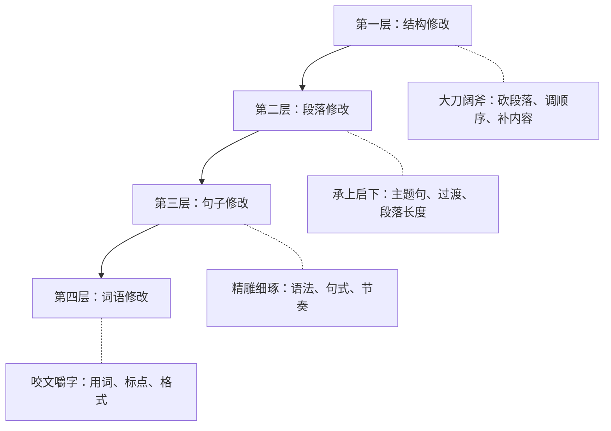

## 五、写作流程

写作不是灵感乍现后一气呵成的魔法，而是一套可拆解、可训练、可优化的工程流程。正如软件开发有需求分析→设计→编码→测试→部署，写作也有从构思到发布的完整流水线。理解这条流水线的每个环节，你就能把"写不出来"变成"按步骤推进"。

### 5.1 写作流程概述：四阶段迭代模型

一个完整的写作流程由四个阶段组成，它们并非严格线性，而是可以反复迭代：

| 阶段 | 核心任务 | 时间占比（建议） | 心态关键词 |
|------|----------|------------------|------------|
| 准备阶段 | 明确目标、收集素材、设计大纲 | 20-30% | 发散、探索 |
| 初稿阶段 | 快速输出，将想法转化为文字 | 30-40% | 放下完美主义 |
| 修改阶段 | 结构调整、语言打磨、逻辑验证 | 25-35% | 批判、精炼 |
| 定稿阶段 | 最终校对、格式规范、发布 | 5-10% | 严谨、细致 |

**为什么需要流程化？** 因为写作中的常见困境——"不知道从哪开始""写到一半卡住了""改来改去不满意"——本质上都是流程混乱导致的。把"写"和"改"混在一起，把"构思"和"表达"搅成一团，自然会陷入焦虑。流程化的价值在于：**每个阶段只解决一个问题，降低认知负担。**

不同类型的写作，流程的侧重点不同：

| 写作类型 | 准备阶段 | 初稿阶段 | 修改阶段 | 典型周期 |
|----------|----------|----------|----------|----------|
| 自媒体文章 | 轻（热点追踪快） | 快（1-2小时） | 中（主要改标题和开头） | 1天 |
| 技术文档 | 重（调研充分） | 中（结构先行） | 重（准确性校验） | 3-7天 |
| 学术论文 | 极重（文献综述） | 慢（逐节推进） | 极重（多轮修改） | 数周至数月 |
| 商业报告 | 重（数据收集） | 中（模板驱动） | 重（多方审核） | 1-2周 |
| 小说/故事 | 中（世界观设定） | 慢（沉浸式写作） | 重（情节打磨） | 数月 |

### 5.2 准备阶段：磨刀不误砍柴工

准备阶段决定了文章的上限。准备不充分的初稿，修改时要推倒重来；准备充分的初稿，修改只是锦上添花。

#### 5.2.1 明确写作目标：回答五个核心问题

在写下第一个字之前，用这张清单锁定方向：

**① 目的（Why）——我为什么要写？**

写作目的决定了文章的基调、结构和论证方式。常见目的及其对应的写作策略：

| 写作目的 | 核心策略 | 文章特征 |
|----------|----------|----------|
| 传达信息 | 清晰、准确、有条理 | 定义→分类→示例→总结 |
| 说服读者 | 论点→论据→反驳→结论 | 数据支撑、逻辑严密 |
| 讲述故事 | 冲突→发展→高潮→解决 | 情感共鸣、细节丰富 |
| 教学指导 | 概念→步骤→练习→反馈 | 由浅入深、举例充分 |
| 娱乐消遣 | 节奏快、语言生动 | 悬念、反转、幽默 |

**② 读者（Who）——写给谁看？**

读者画像决定了你的语言风格、信息深度和举例方式。具体需要了解：

- **知识水平**：是初学者还是专家？这决定了你是否需要解释基础概念。
- **阅读场景**：是通勤时快速浏览，还是坐在书桌前深度阅读？这影响段落长度和信息密度。
- **核心需求**：他们想解决什么问题？想获得什么价值？这决定了你的内容重心。
- **潜在顾虑**：他们可能对哪些观点持怀疑态度？这决定了你需要在哪里加强论证。

**实操方法**：在文档顶部写一段"读者画像描述"，例如：

> 本文读者：25-35岁职场人士，有1-3年工作经验，日常工作需要写邮件和报告，写作水平中等，希望提升商务写作能力以获得更多晋升机会。他们时间有限，偏好实用技巧而非理论。

**③ 主题（What）——核心观点是什么？**

用一句话概括你要表达的核心观点。如果你无法用一句话说清楚，说明你还没想清楚。

- 好的核心观点："远程办公需要比坐班更严格的沟通规范，否则团队效率会下降30%以上。"
- 差的核心观点："聊聊远程办公。"（太模糊，没有立场）

**④ 范围（How Much）——写多深、写多长？**

根据平台和目的确定篇幅：

| 平台/场景 | 建议篇幅 | 深度要求 |
|-----------|----------|----------|
| 微信公众号 | 1500-3000字 | 一个核心观点讲透 |
| 知乎回答 | 800-2000字 | 观点+论据+案例 |
| 技术博客 | 2000-5000字 | 原理+实操+踩坑经验 |
| 企业内部文档 | 1000-3000字 | 可执行、无歧义 |
| 书籍章节 | 3000-8000字 | 体系化、有深度 |

**⑤ 平台（Where）——在哪发布？**

不同平台有不同的内容偏好和格式要求。微信公众号适合图文混排、段落短小；知乎适合深度分析、引用数据；技术博客适合代码块、架构图。提前了解平台特性，能避免"写完发现格式不对"的返工。

#### 5.2.2 素材收集与整理：建立你的军火库

素材是写作的弹药。没有素材的写作就像没有食材的厨师——再好的刀工也做不出菜。

**素材的五种来源：**

1. **个人经验**：你自己的经历、观察和感悟。这是最有说服力的素材，因为它是独一无二的。养成"经验日志"的习惯——每天记录一件值得写的事，哪怕只是一句话。
2. **阅读积累**：书籍、论文、行业报告、优质公众号文章。阅读时不是"看完就完"，而是带着"这个能用在哪篇文章里"的意识去读。
3. **数据与研究**：统计数据、调查报告、实验结果。数据是说服力的基石。"人们平均每6.5分钟看一次手机"比"人们经常看手机"有力十倍。
4. **他人故事**：访谈、播客、纪录片中的真实案例。他人的故事能让你的文章更有温度和可信度。
5. **网络资源**：社交媒体讨论、论坛帖子、评论区。这些是了解读者真实困惑和痛点的窗口。

**素材收集的实操方法：**

**随手记录系统**：灵感转瞬即逝，必须有即时捕获的工具和习惯。

| 工具 | 适用场景 | 优势 | 劣势 |
|------|----------|------|------|
| 手机备忘录 | 随时随地的灵感 | 零门槛、即时可用 | 难以整理和检索 |
| 微信"文件传输给自己" | 看到好内容随手转发 | 操作最自然 | 容易被聊天记录淹没 |
| Flomo 浮墨笔记 | 轻量级灵感卡片 | 极简、支持标签 | 免费版功能有限 |
| Notion | 系统化素材库 | 强大的数据库功能 | 上手门槛稍高 |
| Obsidian | 深度知识管理 | 双向链接、本地存储 | 需要时间建立体系 |
| 纸质笔记本 | 深度思考、头脑风暴 | 书写促进思考 | 无法检索 |

**主题阅读法**：围绕写作主题进行集中阅读，而不是随机浏览。

步骤：
1. 列出主题相关的5-10个关键词
2. 用每个关键词搜索3-5篇高质量文章
3. 快速浏览，标记有价值的段落
4. 精读标记内容，提取核心观点和数据
5. 将提取的内容整理到素材库中，标注来源

**素材库的组织结构**：

素材库/
├── 按主题分类/
│   ├── 写作技巧/
│   ├── 职场沟通/
│   └── 个人成长/
├── 按类型分类/
│   ├── 金句/
│   ├── 数据/
│   ├── 案例/
│   └── 模板/
└── 待整理/

每条素材应包含：内容摘要、来源出处、适用场景标签、收集日期。这样在写作时，你可以通过标签快速检索到需要的素材。

#### 5.2.3 大纲设计：文章的骨架

大纲是文章的蓝图。没有大纲就开始写作，就像没有图纸就开始盖房子——大概率会返工。

**大纲设计的四种方法：**

**方法一：自由联想法（适合创意型写作）**

不加限制地写下所有与主题相关的要点，然后进行分类和排序。

操作步骤：
1. 设定10分钟计时器
2. 在纸上或白板上写下所有想到的要点（不要判断好坏）
3. 计时结束后，将所有要点归类分组
4. 为每组确定一个主题
5. 按逻辑顺序排列各组

**方法二：逻辑推演法（适合论证型写作）**

从核心观点出发，逐层推演支撑论点和论据。

核心观点：远程办公需要更严格的沟通规范
├── 论点1：远程办公缺乏非正式沟通渠道
│   ├── 论据：办公室的茶水间闲聊传递了大量隐性信息
│   ├── 论据：斯坦福研究显示远程办公减少40%的非正式交流
│   └── 论据：案例：某公司取消远程后信息传递效率提升25%
├── 论点2：异步沟通容易产生误解
│   ├── 论据：文字缺乏语气和表情信息
│   ├── 论据：时区差异导致反馈延迟
│   └── 论据：案例：某团队因邮件误解导致项目延期2周
└── 论点3：规范化的沟通流程能解决问题
    ├── 论据：每日站会制度的实践效果
    ├── 论据：文档化决策的必要性
    └── 论据：工具选型（Slack vs 邮件 vs 飞书）

**方法三：模板法（适合结构化写作）**

常用的万能结构模板：

| 结构模板 | 适用场景 | 框架 |
|----------|----------|------|
| 总-分-总 | 观点阐述 | 观点→分论点1→分论点2→分论点3→总结 |
| 问题-分析-方案 | 解决方案类 | 现状问题→原因分析→解决方案→实施步骤 |
| STAR | 案例分析 | 情境→任务→行动→结果 |
| 时间线 | 教程/流程 | 步骤1→步骤2→步骤3→注意事项 |
| 对比结构 | 评测/选择 | A方案→B方案→对比表格→推荐 |
| 递进结构 | 深度分析 | 表象→本质→根源→启示 |

**方法四：反向工程法（适合学习型写作）**

找到你想写的文章类型的3-5篇优秀范文，拆解它们的结构：

1. 列出每篇文章的标题层级
2. 分析每部分的篇幅占比
3. 找出共同的结构模式
4. 用这个模式作为自己大纲的参考

**大纲的详略程度**：初学者建议写详细大纲（每个段落的主题句都写出来），这样初稿阶段几乎只是"扩写"。随着经验积累，可以逐渐简化——有些高手只需要几个关键词就能写出好文章，但这是熟练之后的结果，不是起步时应该追求的。

**大纲自检清单**：

- [ ] 每个部分是否都能支撑核心观点？
- [ ] 各部分之间的逻辑关系是否清晰（并列/递进/因果）？
- [ ] 篇幅分配是否合理（重点部分是否给予了足够篇幅）？
- [ ] 开头是否能吸引读者？结尾是否有力？
- [ ] 是否有"断层"——相邻部分之间缺少过渡？

### 5.3 初稿阶段：先完成，再完美

初稿阶段只有一个目标：**把脑子里的想法变成纸上的文字**。这个阶段最大的敌人是完美主义。

#### 5.3.1 初稿写作的四条铁律

**铁律一：不要追求完美**

初稿的价值在于"倒出来"，不在于"写得好"。海明威说过："所有初稿都是垃圾。"这不是自我贬低，而是对写作规律的尊重。初稿粗糙是正常的，不粗糙才奇怪。

**铁律二：不要边写边改**

边写边改是最常见的效率杀手。写一句改一句，就像走路时不断回头看脚印——你永远走不远。初稿阶段的唯一任务是往前推进。

**铁律三：遇到困难先跳过**

某个段落写不下去？用 `[TODO: 这里展开论述XXX]` 标记，继续往下写。很多时候，写完后面的段落，前面卡住的地方自然就想通了——因为写作本身就是一个思考的过程。

**铁律四：保持连续性**

初稿尽量在集中的时间段内完成。中断太久（超过一天），你会失去写作的"手感"和思路的连贯性。如果必须中断，在停下来的地方写几句话提示自己"接下来要写什么"，方便下次续写。

#### 5.3.2 提升初稿速度的实战技巧

**技巧一：从最热的部分开始写**

不需要从开头写起。哪个部分你最有想法、最想表达，就先写哪个。开头往往是最后写的——因为只有写完全文，你才知道最合适的开头是什么。

**技巧二：使用占位符**

遇到需要补充的数据、引用或细节，不要停下来搜索，直接用占位符标记：

根据[机构名]在[年份]的调查，[具体数据]%的受访者表示[结论]。

这些占位符在修改阶段统一补充，不会打断写作的节奏。

**技巧三：设定时间压力**

给自己设定一个有挑战性的时间限制。例如，一篇2000字的文章，给自己90分钟写完初稿。时间压力能减少犹豫和自我审查，让你进入"只管输出"的状态。

推荐使用番茄工作法：25分钟专注写作 + 5分钟休息，循环进行。

**技巧四：善用语音输入**

如果你的打字速度跟不上思维速度，语音输入是利器。现代语音识别的准确率已经很高（讯飞、搜狗等中文输入法准确率超过95%），说出来的文字稍作整理就是初稿。语音输入特别适合叙事性强的内容——你只需要"讲故事"，不需要想怎么打字。

**技巧五：用模板降低启动成本**

对于经常写的文体（周报、会议纪要、技术方案），建立固定的写作模板。有了模板，你不需要从零开始，只需要往框架里填充内容。这能显著降低"开始写"的心理门槛。

#### 5.3.3 初稿阶段的常见问题与应对

| 问题 | 表现 | 解决方案 |
|------|------|----------|
| 完美主义瘫痪 | 反复修改第一段，写不下去 | 强制自己不回头，用"不允许按退格键"规则 |
| 跑题 | 写着写着偏离了大纲 | 每写完一段，对照大纲检查；跑题的内容移到"素材区" |
| 信息不足 | 需要数据或案例但手头没有 | 用占位符标记，继续写；修改阶段再补充 |
| 速度太慢 | 一个小时只写了200字 | 切换到语音输入；或用"自由写作"练习提升速度 |
| 中断后续写困难 | 隔了一天不知道从哪接 | 中断前写3句"续写提示"；重新阅读前面的内容找回节奏 |

### 5.4 修改阶段：好文章是改出来的

修改是写作中最重要的环节，也是区分业余和专业的分水岭。业余写作者写完初稿就觉得"差不多了"；专业写作者知道，初稿只是原材料，修改才是加工成型的过程。

#### 5.4.1 修改的四个层次：从宏观到微观

修改必须按照从大到小的顺序进行。先改结构，再改段落，再改句子，最后改词语。如果你先改词语再改结构，很可能改了半天发现整个段落要删掉——之前改词语的时间全浪费了。

**第一层：结构修改——砍、移、补**

这一层要像建筑师审视蓝图一样审视文章的整体结构。问自己：

- 核心观点是否贯穿全文？有没有哪部分与核心观点无关？
- 各部分的逻辑顺序是否合理？是否需要调换位置？
- 各部分的篇幅是否均衡？重点部分是否给予了足够的篇幅？
- 开头是否能抓住读者？结尾是否有力？
- 是否有遗漏的重要内容？是否有不必要的冗余？

**关键动作**：如果某个段落或章节对核心观点没有贡献，**果断删除**。不要因为"写了很多字"就舍不得删——沉没成本不是保留差内容的理由。

**第二层：段落修改——每个段落都是一个小论证**

一个好的段落应该：
- **有明确的主题句**：通常在段首，告诉读者这个段落要说什么。
- **有充分的展开**：论据、例子、数据、分析。
- **有自然的过渡**：与上一段和下一段之间有逻辑衔接。
- **长度适中**：一般来说，一个段落300-500字为宜。太短则论述不充分，太长则读者容易走神。

**段落质量检查**：把每个段落的第一句话单独抽出来连在一起读。如果这些主题句能构成一个逻辑通顺的简短版本，说明文章结构是清晰的。

**第三层：句子修改——让每一句都站得住**

- 句子是否通顺？读出来是否顺口？
- 句式是否多样？连续多个长句会让读者疲惫，连续多个短句会显得碎片化。
- 是否有冗余？"他快速地奔跑"不如"他飞奔"。
- 主语是否明确？避免"有关部门""相关人士"之类的模糊主语。

**句式多样化的技巧**：

| 技巧 | 示例 |
|------|------|
| 长短交替 | "他停了下来。四周一片寂静，只有远处偶尔传来的狗叫声打破这片沉寂，让人心生不安。" |
| 主动被动交替 | "团队完成了项目。项目被客户高度评价。" |
| 陈述疑问交替 | "这个方案看起来可行。但它真的能解决问题吗？" |
| 倒装强调 | "正是这种坚持，让他最终获得了成功。" |

**第四层：词语修改——用对每一个字**

- 用词是否准确？"他很高兴"不如"他喜出望外"或"他如释重负"——不同的词表达不同类型的"高兴"。
- 是否有更好的选择？口语化的"搞"可以根据语境替换为"实施""推进""解决"。
- 是否有错别字和标点错误？这是最低级但也最容易被忽视的问题。
- 术语是否一致？全文对同一概念的用词是否统一？

#### 5.4.2 五种高效修改方法

**方法一：冷却法（最推荐）**

写完初稿后，放置至少几个小时，最好过一夜。时间距离能让你从"作者视角"切换到"读者视角"——你会更容易发现逻辑漏洞、表达不清和冗余内容。

操作建议：初稿写完后去做别的事，第二天再回来修改。如果时间紧迫，至少休息30分钟。

**方法二：朗读法**

大声朗读自己的文章。朗读时，你的大脑会同时处理视觉和听觉信息，很多默读时忽略的问题——句子不通顺、节奏不好、重复用词——在朗读时会变得明显。

如果你不方便出声朗读，可以用文字转语音工具（如Edge浏览器的"大声朗读"功能）让机器读给你听。

**方法三：换位法**

假装你是第一次看到这篇文章的读者。你对这个话题了解多少？你能理解作者在说什么吗？你觉得这篇文章有价值吗？

更具体的做法：找一个符合你目标读者画像的真实人物（朋友、同事），想象ta读这篇文章时的反应。甚至可以直接把文章发给ta，请ta指出看不懂的地方。

**方法四：清单法**

建立一份标准化的修改检查清单，每次修改时逐项对照。这能确保你不会遗漏重要的检查项。

**修改检查清单（可直接复制使用）：**

结构层面：
- [ ] 核心观点是否用一句话就能概括？
- [ ] 文章结构是否符合选定的模板？
- [ ] 各部分之间的逻辑关系是否清晰？
- [ ] 开头是否在30秒内抓住读者注意力？
- [ ] 结尾是否有力（总结/呼吁/留下思考）？
- [ ] 是否有与核心观点无关的内容需要删除？

内容层面：
- [ ] 每个论点是否有至少一个论据支撑？
- [ ] 数据和案例是否准确？来源是否可靠？
- [ ] 占位符是否已全部替换为真实内容？
- [ ] 是否有遗漏的重要信息？
- [ ] 专业术语是否有必要解释？

语言层面：
- [ ] 句子是否通顺？朗读是否顺畅？
- [ ] 用词是否准确？是否有更好的表达？
- [ ] 是否有错别字和语法错误？
- [ ] 语言风格是否全文统一？
- [ ] 句式是否有变化，避免单调？

读者体验层面：
- [ ] 段落长度是否适中（手机屏幕上不超过5行）？
- [ ] 是否有足够的过渡和衔接？
- [ ] 标题和小标题是否清晰、有信息量？
- [ ] 是否使用了图表、列表等增强可读性的元素？
- [ ] 信息密度是否合适——既不太浅也不太密？

**方法五：他人反馈**

自己改自己的文章有天然的盲区——你太熟悉自己的思路，所以发现不了逻辑漏洞。请他人阅读是最有效的修改方法之一。

如何获取有效的反馈：
- 不要问"写得怎么样？"（太笼统），要问"第三段的论证你觉得充分吗？""读到哪里开始走神？"
- 选择符合目标读者特征的反馈者
- 至少找2-3人反馈，寻找共性问题
- 对反馈保持开放心态，但不必全部采纳——最终决定权在你

#### 5.4.3 修改的常见陷阱

| 陷阱 | 表现 | 解决方法 |
|------|------|----------|
| 无限修改 | 总觉得"还能更好"，改了十遍还不满意 | 设定修改轮数上限（一般2-3轮足够） |
| 越改越差 | 修改后反而不如初稿 | 保留初稿版本，用版本控制对比 |
| 只改细节 | 纠结于某个词的选择，忽略了结构问题 | 严格遵守"从宏观到微观"的顺序 |
| 情感依恋 | 舍不得删除写了很多但无关的内容 | 把删除的内容移到"素材回收站"而非直接删除 |
| 修改疲劳 | 改到后面已经麻木，看不出问题 | 分多次修改，每次只关注一个层面 |

### 5.5 定稿阶段：最后的质检

定稿阶段是发布前的最后一道关卡。这个阶段不需要大改，但需要仔细检查细节。

#### 5.5.1 最终校对

校对不是"再读一遍"，而是有针对性地检查特定项目：

**校对的四个维度：**

1. **准确性校对**：数据是否正确？引用是否准确？人名、地名、日期是否无误？链接是否有效？
2. **一致性校对**：术语是否全文统一？格式是否一致（标题层级、列表样式、标点用法）？
3. **完整性校对**：占位符是否全部替换？图表是否都有说明？参考文献是否齐全？
4. **规范性校对**：是否符合发布平台的格式要求？排版是否美观？

**校对技巧**：

- **倒序校对**：从文章末尾往前逐段检查。打乱阅读顺序能让你更容易发现错别字和语法错误。
- **打印校对**：把文章打印出来在纸上检查。纸质阅读和屏幕阅读的注意力模式不同，纸上更容易发现问题。
- **专项校对**：每次只检查一个维度（这次只查错别字，下次只查标点），避免"什么都查等于什么都没查"。

#### 5.5.2 格式调整

根据发布平台的要求进行最终的格式调整：

- **标题层级**：确保H2/H3/H4层级清晰，不超过4层
- **段落间距**：手机阅读场景下，段落之间留足空白
- **列表和表格**：能用列表的不用长段落，能用表格的不用纯文字
- **图片和图表**：确保清晰度足够，标注了图注和来源
- **代码块**：标注语言类型，确保格式正确
- **引用格式**：统一引用标注方式（脚注/尾注/行内引用）

#### 5.5.3 发布前最终检查清单

- [ ] 全文通读最后一遍（最好朗读）
- [ ] 标题是否吸引人？是否准确反映了内容？
- [ ] 所有链接是否有效？
- [ ] 图片是否正常显示？
- [ ] 在手机上的阅读体验如何？（超过60%的读者用手机阅读）
- [ ] 是否设置了合适的SEO关键词？（如适用）
- [ ] 发布时间是否合适？（如适用）

### 5.6 写作习惯的养成：从偶尔写到每天写

写作能力的提升没有捷径，只有持续练习。而持续练习的前提是建立稳定的写作习惯。

#### 5.6.1 为什么每天写作如此重要

把写作比作运动训练：

| 维度 | 运动员 | 写作者 |
|------|--------|--------|
| 基本功 | 每天训练体能 | 每天练习表达 |
| 手感 | 肌肉记忆 | 语感和节奏感 |
| 启动成本 | 热身后才能高强度 | "进入状态"需要时间 |
| 退步速度 | 停训一周体能明显下降 | 停写一周再提笔会生疏 |
| 突破方式 | 量变引起质变 | 写够一定量后自然开窍 |

每天写作（哪怕只有15分钟、300字）的核心价值：

1. **降低启动成本**：每天写的人不需要"酝酿情绪"才能开始写——坐下来就能写。偶尔写的人每次都要克服巨大的心理阻力。
2. **保持语感**：语言是一种肌肉记忆。每天使用，语感敏锐；长期不用，表达会变得生硬。
3. **积累素材**：每天的写作本身就是素材的积累。你今天写的300字，可能成为三个月后一篇长文的核心段落。
4. **培养洞察力**：为了每天有东西可写，你会不自觉地对周围的事物保持观察和思考。

#### 5.6.2 建立写作习惯的五步法

**第一步：固定时间**

选择一个每天都能保证的时间段，把写作变成和刷牙一样的日常习惯。

| 时间段 | 优势 | 劣势 | 适合人群 |
|--------|------|------|----------|
| 早晨6:00-7:00 | 大脑清醒、干扰最少 | 需要早起 | 早起型人 |
| 通勤时间 | 利用碎片时间 | 环境嘈杂 | 通勤时间长的人 |
| 午休时间 | 工作间隙的创造性休息 | 时间有限 | 午休时间充裕的人 |
| 晚间21:00-22:00 | 不影响白天工作 | 容易因疲劳而放弃 | 夜猫子型人 |

**关键原则**：时间不重要，稳定性重要。每天晚上9点写和每天早上6点写，效果是一样的。但"有空就写"和"每天固定时间写"，效果天差地别。

**第二步：设定最低目标**

最低目标要足够低——低到你没有理由不做。

- 每天写100字（约3-4句话）
- 或每天写10分钟
- 或每天写一个段落

为什么目标要这么低？因为习惯的建立靠的是"不断链"——连续做到30天比某一天写3000字重要得多。当你完成了最低目标，你往往会继续写下去——但即使不继续，你也完成了当天的任务。

**第三步：固定地点**

大脑会把环境和行为关联起来。如果你总是在书桌前写作，坐到书桌前就会自动进入"写作模式"。如果你总是在咖啡馆写作，闻到咖啡香就会有写作的冲动。

选择一个固定的写作地点，让它成为你的"写作触发器"。

**第四步：记录进展**

用一个简单的表格追踪每天的写作情况：

| 日期 | 字数 | 写了什么 | 感受 |
|------|------|----------|------|
| 6/1 | 350 | 职场沟通的开头 | 顺畅 |
| 6/2 | 200 | 只写了一段，有点卡 | 一般 |
| 6/3 | 500 | 一口气写完了第二部分 | 爽 |

记录的目的不是给自己压力，而是让你看到自己的积累——当你回看"已经连续写了30天"时，那种成就感会成为继续写的动力。

**第五步：建立奖励机制**

完成写作目标后给自己一个小奖励。奖励不需要很大——一杯喜欢的饮料、15分钟的休闲时间、一集喜欢的剧。关键是让大脑把"写作"和"愉悦"关联起来。

#### 5.6.3 写作环境的优化

**物理环境**：

- **减少干扰**：手机静音、关闭社交媒体通知、使用"专注模式"App（如Forest、番茄ToDo）
- **舒适度**：合适的椅子和桌子高度、充足的光线、适宜的温度
- **工具就绪**：写作软件打开、参考资料在手边、水杯倒满水

**心理环境**：

- **仪式感**：固定的开场动作能帮助大脑快速进入状态。例如：泡一杯茶→打开写作软件→深呼吸三次→开始写。
- **背景音**：有些人需要安静，有些人喜欢白噪音或轻音乐。找到适合自己的背景音，能显著提升专注力。推荐：雨声、咖啡馆环境音、Lo-fi音乐。
- **心理暗示**：在写作区域放一些能激发创造力的物品——喜欢的书、一句座右铭、一张激励性的图片。

### 5.7 克服写作障碍：与内心的阻力共处

写作障碍不是能力问题，而是心理问题。几乎所有的专业写作者都经历过写作障碍——区别在于他们学会了与之共处。

#### 5.7.1 写作拖延症：明天再说的心理

**症状**：明明有写作任务，却总是找借口推迟——先刷会手机、先整理下桌面、先喝杯咖啡……等回过神来，时间已经过去了。

**根源分析**：

写作拖延的本质是"任务太大→产生畏难情绪→逃避"。大脑倾向于回避不确定性高的任务——"写一篇3000字的文章"听起来很吓人，但"写一段100字的开头"就容易多了。

**六种应对策略**：

1. **任务切片法**：把大任务切成小块。"写一篇文章"变成"列大纲→写开头→写第一部分→写第二部分……"。每个小任务都足够小，小到不会引发畏难情绪。

2. **两分钟启动法**：告诉自己"我只写两分钟"。两分钟后，你往往已经进入状态，会自然而然地继续写下去。启动是最难的部分——一旦动起来，惯性会推着你往前走。

3. **最差初稿法**：给自己许可写出"世界上最差的初稿"。这不是自暴自弃，而是巧妙地绕过完美主义的阻力。当你允许自己写得差，你就没有理由不写了。

4. **外部截止日期**：告诉一个朋友"我明天给你看初稿"，或者在社交媒体上公开宣布写作计划。外部压力比自我约束有效得多。

5. **惩罚机制**：如果没完成当天的写作任务，就做一些你不喜欢的事（如打扫卫生、做俯卧撑）。人类对损失的厌恶远大于对收益的追求。

6. **找到写作伙伴**：与他人一起写作，互相监督和鼓励。线上可以参加"写作打卡群"，线下可以约朋友一起在咖啡馆写作。

#### 5.7.2 写作焦虑：面对空白页的恐惧

**症状**：面对写作任务时感到紧张、恐惧、自我怀疑。担心写不好、担心被批评、担心不够好。

**根源分析**：

写作焦虑通常源于三种认知扭曲：
- **全或无思维**："要么写出杰作，要么就是垃圾。"
- **读心术**："别人会觉得我写得很蠢。"
- **灾难化**："如果这篇文章写不好，我的职业生涯就完了。"

**五种应对策略**：

1. **认知重构**：挑战那些不合理的信念。"没有人要求初稿必须完美""即使是最好的作家也需要修改""一篇文章写不好不会毁掉一切"。

2. **自由写作练习**：设定10分钟计时器，不停地写，不修改，不删除，不评判。想到什么写什么。这个练习的目的是让你习惯"无压力输出"，打破"每个字都要完美"的枷锁。

3. **从最容易的部分开始**：如果你对开头感到焦虑，就跳过开头，先写你最有把握的部分。建立信心后再挑战困难的部分。

4. **分离写作和评价**：写的时候不做评价，评价的时候不做写作。这两个过程调用的是不同的心理模式——混在一起会互相干扰。

5. **正常化焦虑**：几乎所有写作者都有焦虑感。村上春树每天写作前都会感到不安。焦虑不是你的敌人，它只是表明你在乎这件事。

#### 5.7.3 灵感枯竭：写不出来怎么办

**症状**：感觉脑袋空空，没有东西可写；或者写出来的内容连自己都不满意。

**关键认知**：灵感不是等来的，是创造出来的。专业写作者不依赖灵感——他们依赖系统和流程。

**七种应对策略**：

1. **输入不足→增加阅读**：如果你觉得没什么可写，说明你的输入不够。每天保持至少30分钟的阅读量，读与你写作领域相关的优质内容。

2. **视角单一→换个角度看**：同一个话题，从不同角度切入会有完全不同的文章。例如"远程办公"，可以从员工视角、管理者视角、公司文化视角、技术工具视角分别写。

3. **形式固化→尝试新形式**：如果你一直在写分析文，试试写故事；如果一直在写长文，试试写对话体。形式的变化能激发新的思路。

4. **信息过载→停止输入，开始输出**：有时候灵感枯竭不是因为输入不够，而是因为输入太多——你的大脑塞满了别人的观点，却没有空间产生自己的想法。这时候应该停止阅读，拿出纸笔，写下自己的真实想法。

5. **环境固化→换个地方**：到不同的地方写作——咖啡馆、图书馆、公园、公交车上。环境的变化能激活大脑的不同区域。

6. **身体状态→运动或休息**：大脑的创造力与身体状态密切相关。如果写不出来，去做20分钟运动（散步、跑步、拉伸），回来后往往会豁然开朗。

7. **素材库检索→翻翻旧笔记**：打开你的素材库，翻翻过去的笔记和收藏。你往往会发现一些当时记录的灵感，现在正好可以用上。

#### 5.7.4 写作瓶颈：突破高原期

**症状**：持续写作了一段时间，但感觉水平停滞不前，甚至觉得越写越差。

**关键认知**：这是正常的"高原期"现象——任何技能的学习都会经历"快速进步→停滞→突破"的循环。停滞不是退步，而是大脑在整合之前学到的东西。

**突破方法**：

1. **刻意练习**：不要只是"多写"，而是有针对性地练习薄弱环节。如果开头写不好，就集中练习写10个不同文章的开头。
2. **模仿高手**：选择一位你欣赏的作者，逐段分析ta的文章，然后尝试用ta的风格写一段。通过模仿来学习高手的技巧。
3. **接受反馈**：主动寻求专业反馈，了解自己的盲区在哪里。
4. **换一种写作类型**：如果你一直在写技术文章，试试写散文或故事。跨类型的练习能拓展你的表达能力。
5. **回顾进步**：对比三个月前和现在的文章，你会发现自己其实进步了很多——只是在高原期时感受不到而已。

### 5.8 进阶：不同场景的写作流程适配

#### 5.8.1 快节奏写作流程（自媒体/社交媒体）

当热点事件发生时，你需要在几小时内完成一篇文章。此时的流程需要极度压缩：

15分钟：确定角度 + 列简单大纲
30-45分钟：快速写完初稿（不回头改）
15分钟：修改开头和标题（这是决定点击率的关键）
5分钟：格式调整 + 发布

关键要点：快节奏写作中，"快"优先于"好"。一个70分的文章在2小时内发布，价值远高于一个90分的文章在2天后发布——因为热点已经过去了。

#### 5.8.2 深度写作流程（长文/报告/论文）

深度写作需要更长的周期和更严格的流程：

第1-2天：主题调研 + 素材收集（阅读至少10篇相关文章）
第3天：大纲设计 + 专家审阅大纲
第4-6天：分章节写初稿（每天一个章节）
第7天：休息（冷却法）
第8-9天：第一轮修改（结构和内容层面）
第10天：他人反馈 + 收集意见
第11天：第二轮修改（根据反馈调整）
第12天：最终校对 + 格式调整 + 发布

#### 5.8.3 团队协作写作流程

当多人协作写一篇文档时，流程需要增加协调环节：

1. **统一认识**：所有参与者对主题、目标读者、核心观点达成共识
2. **分工大纲**：确定大纲后，将不同部分分配给不同人
3. **各自初稿**：每人在规定时间内完成自己的部分
4. **交叉审阅**：每人的稿件由另一人审阅，检查风格一致性
5. **统一修改**：由一人负责统一全文的语言风格和格式
6. **集体定稿**：所有人一起通读最终版本，确认无误后发布

团队协作中最大的挑战是风格一致性——每个人的写作习惯不同。解决方案是制定"写作规范文档"，统一术语、句式、格式等细节。

### 5.9 写作流程的持续优化

写作流程不是一成不变的。随着经验的积累，你应该持续观察和优化自己的流程：

**流程复盘**：每完成一篇文章，花5分钟回顾：
- 哪个阶段花了最多时间？是否合理？
- 哪个阶段最痛苦？有什么方法能改善？
- 最终成品的质量与预期是否一致？差距在哪？
- 下次写作，我会做哪些调整？

**建立个人写作SOP**：当你找到适合自己的流程后，把它标准化为一份个人SOP（标准操作流程），每次写作时按照SOP执行。这能减少决策疲劳——你不需要每次思考"我该怎么开始"，只需要按照流程一步步推进。

写作流程的终极目标不是变成流水线上的工人，而是**让流程自动化处理低层决策，释放你的创造力去处理高层思考**。当"怎么组织结构""怎么修改""怎么校对"这些技术问题变成肌肉记忆后，你就能把全部精力投入到"怎么表达得更有力""怎么让读者产生共鸣"这些真正重要的问题上。
