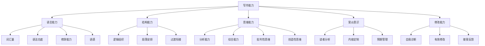
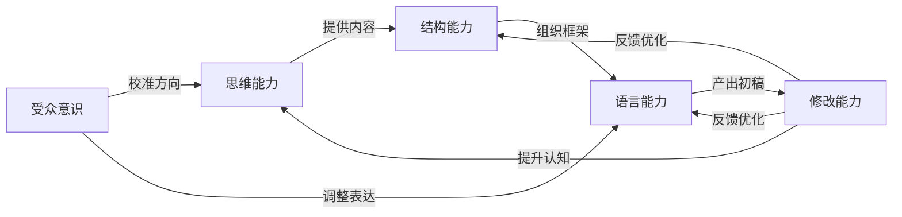

## 六、写作能力的构成要素

写作能力不是一项单一技能，而是多种能力的复合体。如同一辆汽车需要发动机、变速箱、底盘、悬挂、转向系统协同工作才能行驶，写作也需要语言能力、结构能力、思维能力、受众意识和修改能力五大核心要素相互配合，才能产出高质量的文字。

理解写作能力的构成要素，意义在于**精准诊断**——当你写出的文章不理想时，你能定位到底是哪个环节出了问题，而不是笼统地觉得"我写得不好"。这就像医生看病，只有明确病因才能对症下药。



五大要素的关系不是并列的——思维能力是根基，语言能力和结构能力是表达层，受众意识是校准器，修改能力是质量保障。一个思维深刻但语言粗糙的文章，经过修改仍能成为好文章；而一个语言华丽但思维空洞的文章，再怎么修改也救不回来。

### 6.1 语言能力

语言能力是写作的基础操作系统。它决定了你的思想能否被准确、生动、有力地传递给读者。语言能力包含四个维度：词汇量、语法功底、修辞能力和语感。

#### 6.1.1 词汇量

词汇量不是指你认识多少个词，而是指你能在写作时**主动调用**多少个词。很多人认识"旖旎""缱绻""氤氲"这些词，但写文章时永远只用"美丽""缠绕""弥漫"——这不是词汇量不够，而是词汇的**提取能力**不足。

**词汇量的三个层次：**

| 层次 | 说明 | 示例 |
|------|------|------|
| 认知词汇 | 看到能理解意思 | 认识"踔厉奋发"但写作时不会用 |
| 理解词汇 | 能准确理解含义和用法 | 知道"釜底抽薪"和"扬汤止沸"的区别 |
| 产出词汇 | 写作时能主动调用 | 能在合适的语境中自然使用 |

**提升词汇量的系统方法：**

**方法一：主题词汇图谱法**

不要孤立地记单词，而是围绕主题建立词汇网络。比如你要写一篇关于"城市规划"的文章，你需要的不仅仅是"城市规划"这四个字，而是一整套相关词汇：

- 核心词：城市规划、城市设计、城市更新、城市治理
- 上位概念：空间规划、国土规划、区域发展
- 专业术语：容积率、建筑密度、绿地率、TOD模式、城市天际线
- 评价词汇：宜居、可持续、韧性、以人为本、产城融合
- 问题词汇：城市病、摊大饼、千城一面、职住分离

具体做法：准备一个主题为"城市规划"的笔记页，每次阅读相关文章时把遇到的新词、好表达加进去。积累到50-100个词时，你写这个主题的文章就不会词穷。

**方法二：精准词替换训练**

同一个意思，用不同的词表达，效果截然不同。练习方法是：写下一句话，然后尝试用5种不同精确度的词替换其中的关键词。

原始句：「他很生气地走了。」

- 一般：他很生气地走了。
- 较好：他怒气冲冲地走了。
- 精准：他铁青着脸摔门而去。
- 文学：他像一头被激怒的困兽，拂袖而去。
- 冷峻：他没有再说一个字，转身离开了。

每种表达传递的情绪强度、画面感、作者态度都不同。词汇量的本质不是"知道更多词"，而是"在正确的场景选最精准的词"。

**方法三：词汇笔记本体系**

建立一个系统化的词汇积累体系，而不是零散地记录。推荐的记录格式：

【词汇】氤氲
【拼音】yīn yūn
【释义】形容烟气、雾气弥漫的样子
【例句】晨雾氤氲中，远山如水墨画般若隐若现。
【适用场景】描写自然景色、营造氛围
【近义词】弥漫、缭绕、朦胧
【搭配】烟雾氤氲、水汽氤氲、氤氲之气
【注意】多用于书面语，口语中几乎不用

工具推荐：纸质笔记本适合慢积累（手写加深记忆），Obsidian/Notion 适合数字化管理（可搜索、可关联），微信读书/Kindle 的高亮笔记适合从阅读中提取。

#### 6.1.2 语法功底

语法是语言的骨架。很多人觉得语法是上学时学的东西，成年后不需要再关注。这是一个危险的误解——语法问题在日常对话中可以被容忍（因为有语境和语气辅助理解），但在书面表达中会被放大，因为读者只能通过文字获取信息。

**中文写作中最常见的语法问题：**

**问题一：主语偷换**

> ❌ 我走进会议室，大家都在等他，气氛很紧张。
> ✅ 我走进会议室，发现大家都在等他，会议室里的气氛很紧张。

第一句的主语从"我"悄悄换成了"大家"再换成"气氛"，读者需要不断重新理解。修改后用"我发现"统领全局，逻辑更清晰。

**问题二：句子过长，缺乏断句**

> ❌ 在经过了长达三个月的反复测试和优化之后我们的产品终于在性能指标上达到了竞争对手的水平并且在某些关键指标上甚至实现了超越这让我们团队所有人都感到非常振奋。

这个句子有78个字，读者读到中间就已经忘了开头在说什么。应该拆分成2-3个短句：

> ✅ 经过三个月的反复测试和优化，我们的产品终于在性能指标上追平了竞争对手。在某些关键指标上，甚至实现了超越。整个团队都为此振奋。

**问题三：缺少成分**

> ❌ 通过这次培训，使我的写作能力得到了提升。
> ✅ 这次培训使我的写作能力得到了提升。

"通过……使……"是经典的主语缺失句式——"通过这次培训"是介词短语不能做主语，"使"又需要主语，结果整句话没有主语。

**问题四：关联词搭配错误**

> ❌ 不仅他的文笔好，而且内容也深刻。（"不仅"位置不对）
> ✅ 他的文笔不仅好，内容也深刻。

常见关联词搭配：虽然……但是、不仅……而且、既然……就、即使……也、无论……都、不是……而是。

**系统提升语法功底的路径：**

1. **补基础**（1-2周）：通读一本现代汉语语法教材，推荐朱德熙《语法讲义》或吕叔湘《现代汉语八百词》，重点掌握句子成分、词性、常见句式
2. **做标注**（持续）：阅读优秀文章时，分析其句子结构——主谓宾是什么、用了什么句式、为什么这样写
3. **写长句变短句练习**（2-3周）：找一段长句密集的文字，练习把每个长句拆成2-3个短句
4. **自查清单化**：每次写完文章，专门检查一遍主语是否一致、关联词是否搭配、成分是否完整

#### 6.1.3 修辞能力

修辞不是文学的专利。一篇技术文档、一份商业报告、一封求职邮件，都离不开修辞。修辞的本质是**让信息更高效地被接收和记住**。

**常用修辞手法及其在非文学写作中的应用：**

| 修辞手法 | 文学示例 | 非文学应用 | 效果 |
|----------|---------|-----------|------|
| 比喻 | 月光如水 | "我们的API就像一个万能翻译官，连接不同系统" | 化抽象为具体 |
| 对比 | 朱门酒肉臭，路有冻死骨 | "传统方案需要3天，我们只需30分钟" | 突出差异 |
| 排比 | 横眉冷对千夫指，俯首甘为孺子牛 | "我们需要的是速度，是质量，是用户体验" | 增强气势 |
| 设问 | 问君能有几多愁？ | "什么是好的代码？三个字：可维护。" | 引起注意 |
| 类比 | — | "Git的分支就像平行宇宙" | 降低理解门槛 |
| 具象化 | — | "这个bug导致每秒丢失2000条数据" vs "这个bug很严重" | 增强说服力 |

**修辞的三个使用原则：**

1. **适度原则**：修辞是调味料，不是主菜。一篇文章中，关键论点用修辞强化即可，满篇修辞会让读者疲劳。经验法则：每500字使用1-2次有效修辞。

2. **匹配原则**：修辞风格要匹配文体和场景。技术文档适合类比和具象化，商业报告适合对比和数据修辞，散文适合比喻和通感。在技术博客里写"代码如诗"不如写"这段代码像流水线一样高效"。

3. **原创原则**：用烂了的修辞不如不用。"时间如白驹过隙""人生如戏"这类表达已经失去了感染力，因为读者的大脑会自动跳过它们。好的修辞是让读者停下来重读一遍的那个句子。

**修辞能力的刻意练习方法：**

- **改写练习**：找一段平淡的文字，尝试用3种不同的修辞手法改写，对比效果
- **摘抄本**：阅读时专门摘抄让你"停下来重读"的句子，分析它用了什么修辞
- **限制练习**：给自己设定约束，比如"用一个比喻解释量子计算"，约束激发创造力

#### 6.1.4 语感

语感是一种"说不清道不明但就是知道对不对"的能力。它不是玄学，而是大量语言输入和输出后形成的一种**模式识别能力**——你的大脑在无意识层面已经建立了对"好语言"的判断标准。

语感的核心表现：

- 写出一个句子后，能直觉感知"这里不对劲"
- 在两个表达之间犹豫时，能快速判断哪个更好
- 读到别人的文字时，能准确指出"哪里别扭"
- 写作时不需要刻意想语法，句子自然就通顺

**语感的培养没有捷径，但有高效路径：**

**第一层：输入（阅读）**

大量阅读是语感的地基。但"大量"不是指泛读，而是要有**质量的输入**。推荐的阅读策略：

- **精读+朗读**：每周精读1-2篇公认的好文章，大声朗读3遍以上。朗读时你的嘴巴、耳朵和大脑同时参与，语感吸收效率是默读的3-5倍
- **跨体裁阅读**：不要只读一种类型。小说、散文、新闻、论文、演讲稿，每种体裁的语言节奏不同，跨体裁阅读能建立更丰富的语感图谱
- **抄写经典**：用纸笔抄写经典段落，这是最古老的语感训练法，但极其有效——手写的速度迫使你逐字理解，大脑被迫深度处理每一个字

**第二层：输出（写作）**

语感必须通过写作实践来固化。每天写500字以上的文字（日记、笔记、评论、文章都算），坚持3个月，你会明显感觉到自己对语言的敏感度提升。

**第三层：反馈（修改）**

语感的进阶来自**对比**——写完初稿后修改，对比修改前后的差异。每次修改都是在训练大脑："这种表达比那种好"。修改次数越多，这种判断越精准。

语感成熟期参考：持续的高质量阅读+写作+修改，通常需要6-12个月的密集训练才能建立起可靠的语感。这不意味着6个月后就完美了，而是6个月后你能明显感知到自己的进步。

### 6.2 结构能力

结构能力决定了读者能否顺畅地理解你的内容。再好的语言，如果放在一个混乱的结构里，也会让读者迷失方向。结构之于文章，正如骨架之于人体——看不见，但支撑一切。

#### 6.2.1 逻辑组织能力

逻辑组织是结构能力的核心。它解决的是"先说什么、后说什么、什么和什么放在一起"的问题。

**五种基本逻辑组织模式：**

| 模式 | 适用场景 | 结构示例 |
|------|---------|---------|
| 时间顺序 | 叙事文、教程、流程说明 | 起因→经过→高潮→结局 |
| 空间顺序 | 场景描写、产品介绍 | 从上到下/从外到内/从左到右 |
| 递进顺序 | 议论文、深度分析 | 是什么→为什么→怎么办 |
| 并列顺序 | 清单文、对比分析 | 观点A、观点B、观点C并列展开 |
| 问题-方案 | 技术文档、商业方案 | 问题→原因分析→解决方案→效果验证 |

**逻辑组织的实操方法——大纲先行法：**

不要直接动笔写正文。先用10-15分钟写一个结构化大纲，能节省你50%的写作时间。大纲的层级：

```text
主题：如何提升写作能力
├── 1. 为什么写作能力重要（引子，300字）
│   ├── 职场场景的需要
│   └── 个人成长的价值
├── 2. 写作能力的五大构成（主体，3000字）
│   ├── 语言能力
│   ├── 结构能力
│   ├── 思维能力
│   ├── 受众意识
│   └── 修改能力
├── 3. 如何系统提升（实操，2000字）
│   ├── 短期：技巧层面
│   ├── 中期：习惯层面
│   └── 长期：积累层面
└── 4. 总结与行动建议（收尾，300字）
```

大纲的关键是**每个节点控制在3-5个子项**——少于3个说明思考不够深入，多于5个说明需要合并或分层。

**逻辑自检的三个问题：**

1. **因果检验**：每一部分的内容，是否和前后部分有明确的因果或递进关系？如果删掉某一部分，文章是否仍然完整？如果是，说明这部分可能是多余的。
2. **顺序检验**：调换任意两个部分的顺序，文章是否仍然通顺？如果调换后更通顺，说明原来的顺序有问题。
3. **读者检验**：读者读完第一部分后，能否自然地预判到第二部分会讲什么？如果读者总是感到意外（不是惊喜的那种意外），说明逻辑链条有断裂。

#### 6.2.2 段落安排能力

段落是文章的基本呼吸单位。好的段落安排让读者能够轻松地"一口气读下去"；差的段落安排让读者读着读着就走神了。

**好段落的五个标准：**

1. **单一主题**：一个段落只讲一个核心观点。如果你发现自己在一个段落里讲了两件事，就把它拆成两段。
2. **主题句清晰**：段落的第一句话（偶尔是第二句）应该让读者知道这段要讲什么。主题句不是"接下来我要讲XXX"，而是用一句话概括核心观点。
3. **论证充分**：观点之后必须有支撑——数据、案例、推理、引用，至少有一种。空洞的段落是读者流失的重灾区。
4. **长度适中**：中文写作中，一个段落的理想长度是150-300字（约5-10行）。超过300字读者会感到压迫感，少于50字则显得碎片化。当然，关键论点可以写长段以示重要性，但全文不应有超过20%的段落超过400字。
5. **收束有力**：段落的最后一句话应该是总结、过渡或留有余味的句子，而不是戛然而止。

**段落长度的节奏控制：**

好的文章像音乐，有节奏变化。不要所有段落都一样长——这会让读者产生视觉疲劳。策略是：

- **开头段**：简短有力（50-100字），快速引入主题
- **展开段**：中等长度（150-250字），充分展开论点
- **重点段**：可以适当加长（250-400字），深入论述核心观点
- **过渡段**：简短（50-100字），完成衔接后迅速进入下一部分
- **结尾段**：简短有力（100-150字），总结或升华

#### 6.2.3 过渡衔接能力

过渡是文章的黏合剂。没有过渡的文章，就像一堆积木——每一块都很好，但没有连成一个整体。

**六种过渡技术及其使用场景：**

**一、过渡词（最基础）**

适用于简单的内容衔接。常用过渡词分类：

| 逻辑关系 | 过渡词 |
|---------|--------|
| 递进 | 此外、而且、不仅如此、更重要的是、更进一步 |
| 转折 | 然而、但是、不过、尽管如此、话虽如此 |
| 因果 | 因此、所以、正因如此、由此看来、由此可见 |
| 举例 | 例如、比如、以……为例、具体而言 |
| 总结 | 总之、综上所述、归根结底、一言以蔽之 |
| 对比 | 相比之下、与此相反、另一方面、反观 |

**注意**：过渡词不要堆砌。一个段落的开头用一个过渡词即可，不要写"然而，此外，因此"连着来。

**二、过渡句（进阶）**

在两个段落之间插入一个承上启下的句子：

> 上一段讲了"写作需要大量阅读"。
> 过渡句：「阅读解决了输入的问题，但光有输入不够——你还需要把输入转化为输出。」
> 下一段讲"写作需要大量练习"。

过渡句比过渡词好在：它不仅是连接，还能解释**为什么**要过渡到下一个话题。

**三、过渡段（高级）**

在文章的大的章节之间，用一个完整的段落来完成过渡。常见于长文和书籍：

> 「以上我们讨论了写作的语言层面，但语言只是容器，真正决定文章质量的是容器里装的东西——思维能力。接下来，让我们深入探讨写作中最容易被忽视但最重要的底层能力。」

**四、关键词回环**

在新段落的开头重复上一段落的关键词，建立语义连接：

> 上一段结尾：「……这种精准的表达能力，是区分业余和专业的关键标志。」
> 下一段开头：「精准的表达并非天生，而是可以通过系统训练获得的。具体来说……」

**五、提问过渡**

用一个问题引导读者进入下一个话题：

> 「那么，有了语言能力和结构能力，是否就能写出好文章了？答案是否定的。还有一项更深层的能力——思维能力——才是决定文章天花板的关键。」

**六、场景锚定**

用一个具体场景作为上下文的桥梁：

> 「想象你正在读一篇文章，读了三段仍然不知道作者要说什么。你大概率会关掉页面。这就是为什么结构能力如此重要……」

### 6.3 思维能力

思维能力是写作的深层地基。如果语言能力和结构能力是"怎么说"的问题，那么思维能力就是"说什么"的问题。一个思维浅薄的人，即使语言再华美、结构再精巧，写出来的也只是精致的空壳。

#### 6.3.1 分析能力

分析能力是将复杂事物拆解为更小的组成部分，并理解它们之间关系的能力。在写作中，分析能力决定了你能否把一个复杂话题讲清楚。

**分析的四个层次：**

| 层次 | 说明 | 示例（以"短视频成瘾"为例） |
|------|------|--------------------------|
| 表面描述 | 描述现象 | "很多人刷短视频停不下来" |
| 原因拆解 | 分析成因 | "算法推荐+多巴胺机制+时间碎片化" |
| 结构分析 | 找到模式 | "所有成瘾产品的共同特征：低门槛+高反馈+无终止点" |
| 本质洞察 | 抽象规律 | "短视频满足的是人类对'新奇刺激'的本能需求，这与社交媒体的'社交认同'需求是两种不同的成瘾机制" |

**提升分析能力的实操练习——"五层追问法"：**

面对任何一个现象或观点，连续追问五次"为什么"或"这背后的机制是什么"：

1. 为什么很多人写不出好文章？→ 因为缺乏练习
2. 为什么缺乏练习？→ 因为没有养成写作习惯
3. 为什么没有养成写作习惯？→ 因为觉得写作很难，有畏难情绪
4. 为什么有畏难情绪？→ 因为对写作的认知停留在"文学创作"，觉得需要天赋
5. 为什么会有这种认知？→ 因为学校教育把写作窄化为"作文"，缺乏实用写作训练

五层追问之后，你已经从"写不出好文章"这个表面问题，挖掘到了"教育认知偏差"这个深层原因——这才是有价值的文章应该触及的深度。

#### 6.3.2 综合能力

综合能力是分析能力的逆运算——将零散的信息、观点和证据整合为一个系统的、有逻辑的整体。

**综合能力的三种核心操作：**

**一、归纳**：从多个具体案例中提炼出共同模式。

> 原始素材：
> - 案例A：某公司通过扁平化管理提升了效率
> - 案例B：某创业团队用自组织模式实现了高速增长
> - 案例C：某开源社区通过去中心化协作产出了优秀项目
>
> 归纳结论：当任务需要快速响应和创新时，减少层级、增加自主权的组织模式往往优于传统科层制。

**二、建模**：为复杂现象建立一个简洁的解释框架。

写作中的常用思维模型：

- **金字塔原理**：结论先行，然后分层论证（适用于报告和议论文）
- **5W1H**：Who/What/When/Where/Why/How（适用于新闻和事件描述）
- **PREP法则**：Point观点→Reason理由→Example例子→Point重申观点（适用于说服性写作）
- **STAR法则**：Situation情境→Task任务→Action行动→Result结果（适用于案例叙述）

**三、跨域迁移**：将一个领域的知识或方法应用到另一个领域。

> 生物学中的"共生关系"可以迁移到商业分析："平台和开发者的关系本质上是一种数字共生——平台提供基础设施和流量，开发者提供内容和服务，双方相互依赖、共同进化。"

跨域迁移能力需要广泛的阅读和好奇心。你读的领域越多，你的"概念工具箱"就越丰富，写作时能找到的类比和框架就越多。

#### 6.3.3 批判性思维

批判性思维是写作者的免疫系统——它能帮你避免传播错误信息、陷入逻辑陷阱、或被情绪裹挟。

**批判性思维在写作中的七个检查点：**

1. **来源检查**：你引用的信息来源是否可靠？一手资料还是二手转述？是否有利益冲突？
2. **证据检查**：你的论点是否有足够的证据支撑？是数据、案例还是仅仅是个人感受？
3. **逻辑检查**：你的推理是否严密？是否存在以偏概全、滑坡论证、诉诸权威等逻辑谬误？
4. **反面检查**：如果你的观点是错的，反面的证据是什么？你能否诚实地评估反面观点的合理性？
5. **前提检查**：你的论点建立在哪些隐含前提上？这些前提是否成立？
6. **框架检查**：你选择的分析框架是否合适？是否存在"拿着锤子看什么都是钉子"的问题？
7. **自身偏见检查**：你是否因为个人立场而选择了性地引用证据？

**常见逻辑谬误速查表：**

| 谬误名称 | 含义 | 错误示例 | 纠正方法 |
|---------|------|---------|---------|
| 以偏概全 | 用个例代表整体 | "我认识的程序员都内向，所以程序员都内向" | 需要统计样本量 |
| 滑坡论证 | A必然导致极端的Z | "允许AI写作业→学生不会思考→人类文明毁灭" | 证明每一步的因果必然性 |
| 诉诸权威 | 因为名人说了所以对 | "马斯克说了，所以这个技术一定可行" | 评估权威的专业领域是否对口 |
| 虚假二分 | 只给两个选项 | "不支持A就是支持B" | 列出所有可能的选项 |
| 稻草人 | 歪曲对方观点再反驳 | 对方说"应该减少加班"，你反驳"难道要公司倒闭吗" | 准确复述对方观点后再反驳 |
| 循环论证 | 用结论证明前提 | "这个方法有效因为它很高效，它高效因为这个方法好" | 找到独立于结论的证据 |

**练习批判性思维的日常习惯：**

- 读到任何观点时，先问"证据是什么"再决定是否接受
- 对自己写下的论点，尝试写一段反驳——如果连你自己都说服不了自己，更说服不了读者
- 定期复盘自己过去文章中的逻辑错误（这需要勇气，但进步最快）

#### 6.3.4 创造性思维

创造性思维让你的文章与众不同。在一个信息过载的时代，"正确但平庸"的内容淹没在信息海洋中，只有"正确且独特"的内容才能被记住。

**创造性思维的四个实用技术：**

**一、视角切换**

同一个话题，换一个视角来讲，就可能产生全新的洞见。

以"远程办公"为例：
- 员工视角：更灵活但容易孤独
- 管理者视角：效率难监控但成本更低
- 城市规划视角：可能改变城市形态和房价分布
- 社会学视角：正在重新定义"工作场所"和"社区"的概念
- 历史视角：人类在家工作了几千年，"去办公室"只是工业革命后的200年

大多数文章只从最显而易见的视角切入。你能想到的第5个、第6个视角，往往才是最有新意的。

**二、约束激发**

给自己的写作设定看似不合理的约束，反而能激发创造力：

- "用300字解释量子力学"→ 迫使你找到最本质的核心
- "不使用任何专业术语写一篇技术博客"→ 迫使你用类比和故事来表达
- "从反对者的角度写一篇推荐文"→ 迫使你理解对立面
- "用一封信的格式写产品文档"→ 迫使你用更人性化的语言

**三、随机刺激**

当思维陷入死胡同时，引入一个完全不相关的元素来打破定式：

1. 随机打开一本书的第37页，用第一个名词作为联想起点
2. 看一张随机图片，尝试把它和你的写作主题建立联系
3. 问自己"如果这个话题发生在100年前/100年后会怎样"

这些看似荒谬的方法，能绕过大脑的"常规路径"，激活新的思维连接。

**四、逆向思维**

不问"怎么做好X"，而问"怎么把X做到最糟"——然后避免那些做法。

比如：怎么写一篇糟糕的文章？
→ 开头就用大段背景铺垫，不告诉读者为什么要读
→ 通篇没有具体案例，只有抽象观点
→ 每段都很长，没有留白
→ 结尾突然结束，没有总结

反转过来就是：开头直接给出核心价值，通篇有案例支撑，段落节奏有变化，结尾有清晰总结。逆向思维往往比正向思考更快找到答案。

### 6.4 受众意识

受众意识是很多写作者最欠缺的能力。它不是"讨好读者"，而是"尊重读者的时间和认知规律"。有受众意识的写作者，能让读者在最短时间内获得最大价值；没有受众意识的写作者，往往写了一大堆自己觉得重要的东西，读者却读不下去。

#### 6.4.1 读者分析

动笔之前，你必须回答一个核心问题：**谁在读这篇东西？**

**读者画像的五个维度：**

| 维度 | 需要了解的内容 | 对写作的影响 |
|------|--------------|-------------|
| 知识水平 | 对主题了解多少？专业术语能用到什么程度？ | 决定语言的难易度和需要解释的概念量 |
| 阅读目的 | 是学习、娱乐、决策还是获取信息？ | 决定内容的深度和呈现方式 |
| 时间预算 | 读者有多少时间阅读？是碎片时间还是专注阅读？ | 决定文章长度和信息密度 |
| 态度立场 | 读者对你的观点是认同、中立还是反对？ | 决定论证策略——是需要说服还是需要告知 |
| 阅读场景 | 在手机上刷到？在电脑前搜索？在会议上讨论？ | 决定排版、标题风格和段落长度 |

**快速建立读者画像的方法：**

如果你不确定读者是谁，用这个三步法快速定位：

1. **想一个具体的人**：不要想"读者"这个抽象概念，想一个你认识的具体的人。"如果我的同事小王来读这篇文章，他会关心什么？他已经知道什么？"
2. **写出三个假设**：写下你对读者的三个核心假设。例如："假设读者有Python基础，了解Web开发，想学习如何写技术博客"
3. **验证假设**：在文章开头明确告诉读者"本文适合谁"，既帮助对的读者进入，也让不对的读者早离开——这不浪费双方时间

#### 6.4.2 内容定制

知道了读者是谁，下一步是根据读者特征来定制内容。这不意味着"降低标准"，而是"选择最有效的传递方式"。

**语言定制的三个梯度：**

| 读者类型 | 语言风格 | 示例（解释"缓存"） |
|---------|---------|-------------------|
| 完全外行 | 生活化类比，零术语 | "缓存就像你把常用的东西放在桌面上，不用每次都去抽屉里找" |
| 有基础的从业者 | 适度使用术语，必要时解释 | "缓存是将热点数据存储在高速存储层（如Redis）中，减少对数据库的直接访问" |
| 领域专家 | 可以直接使用专业术语和缩写 | "采用LRU淘汰策略的本地缓存，配合Redis作为二级缓存，解决缓存一致性问题" |

**深度定制的策略：**

- **给入门者写**：从"是什么"开始，用大量类比和实例，避免抽象定义，先建立直觉再讲原理
- **给中级者写**：从"怎么做"开始，直接给方法和步骤，但解释为什么这样做的原理
- **给专家写**：从"为什么这样更好"开始，直接对比不同方案的优劣，不需要解释基础概念

**内容取舍的艺术：**

有受众意识的写作者，最重要的能力是**敢于删掉读者不需要的内容**。你的知识库里有100个相关的知识点，但读者只需要其中30个就能理解和行动——把另外70个删掉或放到附录。这不是降低质量，恰恰是对读者时间的最大尊重。

判断标准：如果一个信息对读者理解核心观点不是必要的，就删掉它。你可以在括号里写一句"详见XX"链接到更深入的内容，但不要在正文中展开。

#### 6.4.3 预期管理

预期管理是受众意识的高级形态——你不仅要考虑读者现在的需求，还要预判他们接下来会产生的疑问和反应，并提前做好应对。

**预期管理的四个层次：**

**第一层：预判疑问**

在写作过程中，时刻切换到读者视角："读到这里，读者会产生什么疑问？"然后在文中提前回答。

> 写到"推荐使用Redis作为缓存"时，读者会想："Redis会不会丢数据？"
> → 立刻跟上："Redis支持AOF和RDB两种持久化方式，根据业务的数据安全要求选择合适的策略。"

**第二层：管理期望**

在文章开头就告诉读者：这篇文章会讲什么，不会讲什么，读完你能获得什么。

> "本文将介绍Docker的基本概念和常用命令，适合零基础的开发者。读完后你能独立完成容器的创建、运行和管理。高级编排和集群管理不在本文范围内，将在后续文章中讨论。"

这样做的好处是：读者不会因为期望不匹配而失望。一篇"深度分析"如果实际上只是入门介绍，会比一篇坦诚标注为"入门指南"的文章收到更多差评。

**第三层：情绪管理**

读者不只是理性的信息接收器，他们有情绪。好的写作者会管理读者的情绪曲线：

- **开头**：制造好奇心或共鸣（"你是不是也遇到过这种情况？"）
- **中段**：保持节奏感，不要让读者在枯燥的数据中沉没——适时插入案例、故事或转折
- **难点处**：给读者鼓励（"这部分可能有些复杂，但理解了它你就打通了整个体系"）
- **结尾**：给读者成就感（"读到这里，你已经掌握了……"）

**第四层：行动指引**

读者读完之后应该做什么？如果你的文章是教程，给一个明确的"下一步行动"。如果是分析文，给一个清晰的"核心 takeaway"。不要让读者读完后想："所以呢？我该干嘛？"

### 6.5 修改能力

修改能力是写作能力中被严重低估的一环。很多人的写作流程是"写完就发"，这就像厨师炒完菜不尝味道就端上桌。真正的好文章几乎都是改出来的——海明威说《永别了，武器》的结尾重写了39遍，托尔斯泰的《战争与和平》前后修改了7次。

修改不是"写完了再润色一下"，而是写作流程中独立的、需要专门训练的核心能力。

#### 6.5.1 自我诊断能力

修改的前提是**你得知道哪里有问题**。很多人改文章只是"再读一遍看看有没有错别字"，这是最低层次的修改。系统的自我诊断需要从多个维度逐一检查。

**修改检查清单（从宏观到微观）：**

```markdown
## 第一轮：结构与逻辑（最重要）
- [ ] 核心观点是否明确？能否用一句话概括？
- [ ] 各部分的逻辑关系是否清晰？顺序是否合理？
- [ ] 是否有重复或冗余的部分？
- [ ] 是否有缺失的部分？读者的理解链条是否完整？
- [ ] 开头是否足够吸引人？是否说明了"为什么要读"？
- [ ] 结尾是否有力？是否给出了核心结论或行动建议？

## 第二轮：段落与论证
- [ ] 每个段落是否只有一个主题？
- [ ] 每个论点是否有足够的证据支撑？
- [ ] 段落之间的过渡是否自然？
- [ ] 段落长度是否有节奏变化？
- [ ] 是否有"只有观点没有例子"的空洞段落？

## 第三轮：语言与表达
- [ ] 是否有病句？主语是否一致？成分是否完整？
- [ ] 是否有过于啰嗦的句子可以精简？
- [ ] 是否有过于抽象的表述需要具体化？
- [ ] 用词是否准确？是否有更好的替代词？
- [ ] 语气和风格是否一致？

## 第四轮：细节与格式
- [ ] 标点符号是否正确？
- [ ] 数字和数据是否准确？
- [ ] 人名、公司名、专业术语是否拼写正确？
- [ ] 标题层级是否合理？
- [ ] 排版是否整洁？
```

**冷却法则：**

写完初稿后，至少放置4小时（最好隔夜），然后再回来修改。冷却期的作用是让你的大脑从"创作者模式"切换到"审读者模式"——创作者对自己写的东西有天然的认同感（心理学上叫"宜家效应"），冷却后这种认同感减弱，你能更客观地看待自己的文字。

**朗读法：**

大声朗读自己的文章，是发现语病和不自然表达最有效的方法。朗读时你的嘴巴会"卡壳"——凡是读起来拗口的地方，就是需要修改的地方。这是因为口语比书面语更敏感——书面表达中被容忍的别扭句式，在朗读时会暴露无遗。

**换位朗读法（进阶）：**

想象你是这篇文章的目标读者，正在第一次读这篇文章。每读一段就问自己：我能理解吗？我有兴趣继续读吗？我有什么疑问？这种角色扮演需要练习，但一旦掌握，它的诊断效率比任何检查清单都高。

#### 6.5.2 有效修改能力

知道哪里有问题之后，你需要有能力做出**有效的修改**——而不是把一个问题换成另一个问题。

**修改的黄金顺序：从大到小**

修改必须遵循"从宏观到微观"的顺序。如果你先改措辞，然后发现整段需要删除，前面的措辞修改就白费了。正确的修改顺序：

1. **结构级修改**：调整文章的整体框架，移动、合并或删除大的部分
2. **段落级修改**：重写不合理的段落，调整段落顺序，增加或删除段落
3. **句子级修改**：修改不通顺的句子，精简冗余表达，替换不准确的用词
4. **字词级修改**：修正错别字、标点符号、格式问题

**常见修改操作及技巧：**

**操作一：删减**

删减是修改中最难但最有效的操作。心理障碍在于"我好不容易写出来的，删掉太可惜了"——这叫"沉没成本谬误"。判断标准只有一个：这段内容对读者理解核心观点是否有帮助？如果没有，无论你写得多精彩，都要删掉。

具体删减策略：
- **删重复**：同一个观点在不同段落说了两三遍，保留最精彩的一处
- **删铺垫**：开头用了三段铺垫才进入正题，直接砍到一段
- **删注释**：用括号补充说明的内容，如果不是必要的就删掉
- **删副词/形容词**："非常""极其""特别"这些程度副词在90%的情况下可以删除，保留核心动词和名词

**操作二：精简**

把啰嗦的表达压缩为简洁的表达，同时不损失信息量：

> ❌ "在当前这个阶段，我们需要做的是集中精力把我们的注意力放在最核心的最关键的问题上面。"
> ✅ "现阶段，我们要聚焦核心问题。"

> ❌ "关于这个方面的问题，我个人认为从我的角度来看的话，可能需要进一步的讨论。"
> ✅ "这个问题值得进一步讨论。"

**操作三：具象化**

把抽象的表述替换为具体的、可感知的表述：

> ❌ "这个功能大大提升了用户体验。"
> ✅ "这个功能让页面加载时间从3秒降到了0.5秒，用户跳出率下降了40%。"

> ❌ "他付出了很多努力。"
> ✅ "他连续三个月每天凌晨两点才离开办公室。"

**操作四：结构调整**

有时候，段落本身写得没问题，但位置不对。结构调整的操作包括：
- 把结论从文章末尾移到开头（倒金字塔结构）
- 把最有力的论据放在第二位（首因效应+近因效应的最优组合）
- 把相关但分散在不同段落的内容合并到一起

#### 6.5.3 接受反馈能力

自我修改有上限——你的大脑会自动补全你自己知道但没写出来的信息（心理学上叫"知识的诅咒"）。外部反馈是突破这个上限的唯一方式。

**获取有效反馈的渠道和方法：**

| 渠道 | 优势 | 劣势 | 适合场景 |
|------|------|------|---------|
| 写作伙伴 | 深度反馈，互相了解 | 数量有限 | 长期写作习惯养成 |
| 编辑/导师 | 专业水平高 | 可能需要付费 | 重要文章或出版物 |
| 读者社群 | 真实的读者反应 | 反馈质量参差不齐 | 自媒体写作 |
| AI工具 | 即时反馈，不讲情面 | 缺乏人类直觉 | 日常修改和校对 |
| 朗读给非专业的人听 | 可以测试通俗性 | 缺乏专业视角 | 面向大众的文章 |

**处理反馈的四项原则：**

**原则一：先听，再想，最后决定**

收到批评性反馈时，第一反应通常是防御——"我没有这个意思""你理解错了"。克制这个冲动。先完整听完，记下来，然后过24小时再重新评估。很多当时觉得"不合理"的反馈，冷静之后会发现确实有道理。

**原则二：区分"反馈的类型"**

反馈分两种：
- **事实性反馈**："这段数据有误""这句话语法有问题"→ 直接修改
- **偏好性反馈**："我觉得这里应该用更正式的语气""我不喜欢这个例子"→ 认真考虑，但不必全部接受

对偏好性反馈，你需要评估：这个反馈者是否代表你的目标读者？如果一个专业人士对你面向新手的文章说"太浅了"，你不需要加深——你的目标就是浅。如果目标读者说"太浅了"，你才需要调整。

**原则三：追踪反馈模式**

单个人的反馈是样本，多个人提到同一个问题才是信号。如果三个不同的人说"你的开头太长了"，那你的开头大概率真的太长了。建立一个反馈记录表：

文章：《如何提升写作能力》
反馈1（小王）：开头的背景介绍太长，建议直接进入正题
反馈2（编辑）：前三段可以压缩为一段
反馈3（读者评论）：开头读了半天不知道要说什么
→ 结论：开头需要大幅精简，这是共识

**原则四：保持自我判断**

接受反馈不等于盲从。你的文章有你自己的意图和风格。如果一个反馈和你的核心意图冲突，你有权不采纳。但你需要能清楚地说出"我为什么不采纳这个反馈"——如果你说不出理由，只是本能地抗拒，那可能正是你需要修改的地方。

### 6.6 五大要素的协同与进阶

理解了五大要素的各自内涵之后，更重要的是理解它们如何协同工作。

**写作能力的协作模型：**



思维能力产出内容和洞见 → 结构能力把内容组织成有逻辑的框架 → 语言能力用文字把框架填充为完整的文章 → 受众意识全程校准方向和表达方式 → 修改能力回过头来审视和优化整个过程。

**不同阶段的侧重：**

| 写作阶段 | 重点发展的要素 | 训练方法 |
|---------|--------------|---------|
| 入门期（0-3个月） | 语言能力+结构能力 | 每天写作500字，模仿优秀文章的结构 |
| 进阶期（3-6个月） | 思维能力+受众意识 | 针对不同读者写同一个话题，练习深度分析 |
| 熟练期（6-12个月） | 修改能力+协同运用 | 建立修改清单体系，每篇文章至少修改3遍 |
| 精通期（1年以上） | 风格形成+创造性表达 | 发展个人风格，尝试跨体裁写作 |

**日常训练的最小可行方案：**

如果每天只能做一件事来提升写作能力，做这件事：**写500字+改一遍**。

- 写500字：锻炼语言能力和思维能力
- 改一遍：锻炼修改能力和结构能力
- 发给一个朋友看：锻炼受众意识

这个方案每天只需要30-45分钟，坚持90天后你的写作能力会有质的飞跃。关键不在于每天写多少，而在于**持续性**——连续写作90天比断断续续写一年效果好得多。

***

