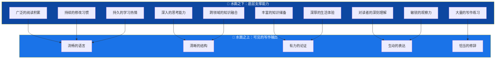
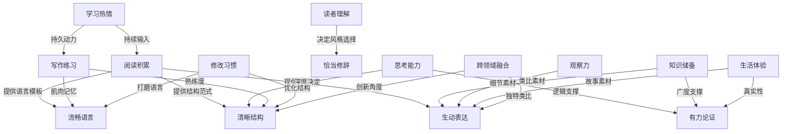

## 七、写作的"冰山模型"

### 7.1 为什么用冰山来比喻写作能力

海明威在《午后之死》中提出了著名的"冰山理论"：冰山之所以庄严宏伟，是因为它只有八分之一露出水面，而八分之七藏在水面之下。写作也是如此——读者在文章中看到的流畅表达、严密逻辑和动人叙事，只是表面的八分之一；真正支撑这一切的，是写作者在水面之下长期积累的阅读量、思考深度、知识结构和生活阅历。

这个比喻揭示了一个关键认知：**写作能力的提升不能只练"水上功夫"，必须同步建设"水下根基"。** 很多人学了一堆写作技巧却写不出好文章，根本原因就是水下部分太薄弱——技巧是浮在水面上的冰尖，没有深厚的水下结构支撑，冰尖根本立不住。

### 7.2 水面之上：读者看到的五重表现

水面之上的五个维度，是读者直接感知到的写作质量。它们是"结果"而非"原因"。

#### 7.2.1 流畅的语言

流畅意味着读者在阅读时不需要停下来"翻译"你的句子。它包括：

- **句法通顺**：主谓宾完整，修饰语位置正确，不存在歧义。例："他背着沉重的书包走到了学校门口"比"他走到了学校门口背着沉重的书包"更流畅，因为后者的动作顺序让人困惑。
- **节奏自然**：长短句交替，避免连续长句导致读者窒息，也避免连续短句显得碎片化。一个有效的节奏模式是"短-中-短-长"：用短句抓住注意力，中句展开，短句强调，长句铺陈细节。
- **衔接无缝**：段落之间有逻辑连接词或语义桥接，读者不需要猜测两段之间的关系。"然而""因此""不仅如此"这些连接词是文章的路标。

**诊断方法**：朗读自己的文章。凡是读到需要换气、重读或回读的地方，就是语言不够流畅的地方。

#### 7.2.2 清晰的结构

结构是文章的骨架。清晰的结构让读者随时知道自己在哪里、要去哪里。

- **宏观结构**：文章整体的组织方式——总分总、时间线、问题-方案、因果链等。选择哪种结构取决于写作目的和内容性质。
- **中观结构**：段落内部的组织。每个段落应该有一个明确的主题句（通常在段首），后续句子围绕主题句展开，最后一句总结或过渡。
- **微观结构**：句子之间的逻辑关系。相邻句子之间应该有明确的逻辑连接——并列、递进、转折、因果、举例。

**关键原则**：一个段落只说一件事。如果你发现一个段落涵盖了两个以上的观点，就应该拆分。

#### 7.2.3 有力的论证

论证是说服力的来源。有力的论证需要三个要素：

- **明确的论点**：你的核心主张是什么？用一句话概括。
- **充分的论据**：数据、案例、权威引用、逻辑推理——至少提供两种不同类型的论据。
- **严密的论证链**：论据和论点之间有清晰的推理过程，不存在逻辑跳跃。

**常见论证缺陷**：

| 缺陷类型 | 具体表现 | 纠正方法 |
|---------|---------|---------|
| 论据不足 | 只有一个案例就下结论 | 至少补充2-3个不同来源的论据 |
| 逻辑跳跃 | 从A直接跳到C，缺少B的推理过程 | 补充中间推理步骤 |
| 以偏概全 | 用个别案例推断整体规律 | 加入统计数据或限定范围 |
| 循环论证 | 用结论证明前提 | 换用独立的第三方证据 |
| 诉诸权威 | "某专家说的所以一定对" | 提供专家论据背后的逻辑 |

#### 7.2.4 生动的表达

生动的表达让抽象概念变得可感知，让平淡叙述变得有画面感。

- **具象化**：把抽象概念转化为具体的画面。"时间过得很快"不如"三年就像翻书一样翻过去了"。
- **动词优先**：用精准的动词代替"是""有""做"等万能动词。"他很快地走过去"不如"他三步并作两步冲过去"。
- **感官细节**：调动视觉、听觉、触觉、嗅觉、味觉中的至少两种。"咖啡馆里弥漫着烘焙豆子的焦香，窗外雨滴敲打着铁皮雨棚，节奏忽快忽慢"——这样的描写比"在咖啡馆等朋友"生动得多。
- **类比与隐喻**：用读者熟悉的事物解释陌生的概念。"区块链就像一本所有人都能翻阅但没有人能涂改的账本"——一个类比胜过一段定义。

#### 7.2.5 恰当的修辞

修辞不是装饰，是精确传达思想的工具。恰当意味着修辞手法与写作目的、读者对象和文体风格匹配。

- **比喻**：让抽象变具体，让陌生变熟悉。但要避免混用比喻（"他在刀尖上跳舞的同时也在火中取栗"——两个比喻打架了）。
- **排比**：增强气势和节奏感，适合用于强调和总结。
- **反问**：比直接陈述更有冲击力。"难道我们真的要等到失去了才懂得珍惜吗？"比"我们应该珍惜现在"更有力。
- **对比**：通过反差突出重点。"他们花了三年才做到的事，她只用了三个月"——对比立即制造了悬念。

**修辞的禁忌**：过度使用。一篇文章如果每一句都在用修辞，读者会感到疲劳。修辞应该像调味料——恰到好处提升风味，过多则毁掉整道菜。

### 7.3 水面之下：支撑写作的十重根基

水面之下的十个维度，才是写作能力的真正"引擎"。它们不直接可见，但决定了水面之上的一切表现。

#### 7.3.1 广泛的阅读积累

阅读是写作的"原材料供应链"。没有大量阅读，写作就是无米之炊。

**阅读对写作的四重作用**：

1. **语言输入**：在阅读中自然习得词汇、句式和表达方式。研究表明，阅读量与词汇量之间存在高度正相关（r=0.78），而词汇量直接影响表达的精确性。
2. **结构感知**：通过阅读优秀文章，内化各种结构模式。当你读过100篇优秀的议论文，你就自然知道"论点-论据-论证"的结构该怎么组织。
3. **思维训练**：阅读不同作者的论证过程，训练自己的逻辑思维和批判性思维。
4. **素材积累**：阅读中遇到的故事、数据、案例、金句，都是未来写作的素材库。

**高效阅读的方法**：

- **主题阅读法**：围绕一个主题集中阅读5-10本书，快速建立该领域的知识框架。
- **拆解式阅读**：阅读时不仅关注"说了什么"，更关注"怎么说的"——分析作者的结构安排、论证方式和修辞技巧。
- **输出式阅读**：读完一个章节后用自己的话总结核心观点，或者写读书笔记。输出是最好的内化方式。

#### 7.3.2 深入的思考能力

写作是思考的外化。思考的深度直接决定文章的深度。

**写作中最关键的三种思维能力**：

- **逻辑思维**：区分事实与观点，识别因果关系与相关关系，发现论证中的漏洞。逻辑思维的核心训练方法是学习形式逻辑基础——掌握三段论、归纳推理、演绎推理、类比推理的基本规则。
- **批判性思维**：对任何观点都追问"证据是什么？""有没有反例？""隐含的前提是什么？"批判性思维让你的文章不只是"有观点"，而是"有深度的观点"。
- **系统思维**：看到事物之间的关联和反馈回路，而不是孤立地分析问题。系统思维让你的文章能够揭示复杂问题背后的结构性原因。

**训练方法**：每天花15分钟对一个新闻事件进行多角度分析——从经济、社会、技术、伦理等不同维度思考其影响和原因。坚持三个月，思考的深度和广度会有显著提升。

#### 7.3.3 丰富的知识储备

知识储备决定了你能写什么，以及你能写多深。

**知识储备的三个层次**：

| 层次 | 内容 | 作用 |
|-----|------|------|
| 通识层 | 历史、哲学、科学、艺术等基础常识 | 提供跨领域的类比和联想素材 |
| 专业层 | 你所在领域的深度知识 | 保证专业文章的权威性和准确性 |
| 工具层 | 逻辑学、统计学、心理学等方法论 | 提供分析问题和论证的工具 |

知识储备不是"知道很多东西"，而是"知道这些东西之间有什么联系"。一个拥有结构化知识体系的人，能够从一个领域的知识迁移到另一个领域——这就是创意写作中"远距联想"的能力基础。

#### 7.3.4 对读者的深刻理解

写作不是自言自语，是与读者的对话。对读者的理解程度决定了文章的"落地效果"。

**理解读者的三个维度**：

- **认知水平**：读者对该主题了解多少？决定了你是否需要解释基础概念，以及能用多专业的术语。
- **阅读动机**：读者为什么读你的文章？是为了解决问题、获取信息、还是消遣娱乐？动机决定了内容的组织方式——解决问题型文章应该把答案放在前面，信息型文章应该把结论放在前面。
- **心理预期**：读者期望得到什么？如果你的文章标题承诺了"5个方法"，正文就必须给出5个具体可执行的方法，否则就是辜负读者预期。

**实操方法**：在动笔之前，用一句话写下"这篇文章的目标读者是谁，他们读完后应该能做什么"。这个简单的练习能帮你精准定位内容的深度和方向。

#### 7.3.5 大量的写作练习

写作是一种技能，而技能只能通过练习获得。没有人能通过只读游泳教材学会游泳。

**刻意练习的要点**：

- **写够量**：写作能力的"一万小时定律"虽然不是精确数字，但方向是对的——没有足够的练习量，不可能达到精通。建议每天至少写500字，不限体裁，日记、评论、分析都算。
- **有针对性**：如果你的弱点是论证，就专门练习写议论文；如果你的弱点是描写，就专门练习写场景描写。泛泛地写不如针对弱点刻意练习。
- **获取反馈**：写完之后请他人阅读并给出具体反馈。自己看自己的文章很难发现问题——因为你脑中知道"想说什么"，会下意识地忽略"实际说了什么"。

#### 7.3.6 持续的修改习惯

好文章是改出来的。海明威说《永别了，武器》的结尾改了39遍。修改不是写作的附属品，而是写作的核心环节。

**修改的三个层次**：

1. **结构修改**（全局）：文章的整体逻辑是否通顺？各部分比例是否合理？有没有跑题的段落？
2. **段落修改**（局部）：每个段落的主题句是否明确？论据是否充分？段落之间的衔接是否自然？
3. **句子修改**（微观）：有没有病句？有没有冗余？用词是否精准？节奏是否舒服？

**实用的修改策略**：

- **冷却法**：写完后至少搁置一天再修改。刚写完时你对文章有"亲缘偏见"，冷却后才能客观审视。
- **朗读法**：大声朗读文章，凡是读起来别扭的地方都需要修改。
- **删减法**：修改时优先考虑"能删掉什么"而非"能加上什么"。好文章的特征之一是"没有一个多余的字"。
- **换位法**：假装自己是第一次读这篇文章的读者，检查哪些地方看不懂、哪些地方觉得啰嗦。

#### 7.3.7 敏锐的观察力

观察力是写作素材的"采集器"。优秀的写作者往往对生活中的细节有着超乎常人的敏感度。

**观察力训练方法**：

- **五感日记**：每天记录一个让你印象深刻的场景，要求至少用到三种感官描写。坚持一个月，你的描写能力会有质的飞跃。
- **细节捕捉**：在公共场所观察一个人的行为细节——他的穿着、动作、表情、说话方式——然后在脑中构建这个人的故事。这个训练能显著提升人物描写能力。
- **模式识别**：注意观察事物之间的规律和联系。为什么某些餐厅总是排队？为什么某些文章总是高赞？识别模式的能力让你的文章更有洞察力。

#### 7.3.8 深厚的生活体验

生活体验是写作的"矿藏"。没有真实体验的写作，再好的技巧也只是空壳。

- **经历的广度**：尝试不同的生活方式、接触不同的人群、体验不同的文化。广度提供类比和联想的素材。
- **经历的深度**：深入体验一件事情比浅尝辄止十件事情更有价值。深度体验能让你写出"内行话"——那些只有真正经历过的人才知道的细节。
- **经历的反思**：经历本身不会自动变成写作素材。你需要对经历进行反思和提炼——这段经历教会了我什么？它揭示了什么规律？它与其他经历有什么联系？

#### 7.3.9 跨领域的知识融合

创新往往发生在学科的交叉地带。写作中的"神来之笔"，很多来自于跨领域的知识融合。

- **查理·芒格的多元思维模型**：掌握来自不同学科的100个核心模型（如经济学的边际效用递减、物理学的熵增定律、生物学的进化论），在分析问题时调用多个模型交叉验证。
- **迁移练习**：定期尝试把一个领域的概念应用到另一个领域。例如："如果用物理学的'惯性'来分析消费行为会怎样？""如果用设计思维来写一篇学术论文会怎样？"
- **跨界阅读**：每个月至少读一本你专业领域之外的书。心理学家去读建筑设计，程序员去读人类学，营销人去读神经科学——跨界碰撞最容易产生洞见。

#### 7.3.10 持久的学习热情

写作能力的提升是一个漫长的过程，没有热情支撑很难坚持。

**维持写作热情的方法**：

- **找到写作的"为什么"**：你写作是为了记录思考？影响他人？职业发展？清晰的目的感是持久动力的来源。
- **建立正反馈循环**：发表文章→获得反馈→改进→发表更好的文章。不要等到"写得足够好"才发表，先发表、再改进。
- **加入写作社群**：与志同道合的人一起写作，互相激励和反馈。孤独的写作者容易放弃，社群提供情感支持和责任约束。
- **设定里程碑**：不要只设定"每天写"这样的过程目标，也要设定"一个月写完一篇长文""三个月发布10篇文章"这样的成果目标。里程碑让你看到进步。

### 7.4 冰山各层之间的因果关系

冰山模型不是简单的"上面对下面"的对应关系，而是一个复杂的因果网络。理解这些因果关系，才能制定有效的提升策略。

**关键洞察**：水面之上的五种表现，每一种都不是由单一的底层能力支撑的，而是多种底层能力的综合产物。例如，"有力的论证"同时需要思考能力（逻辑推理）、知识储备（论据来源）、生活体验（真实性）和写作练习（论证技巧的熟练度）。这就是为什么单靠学技巧无法真正提升写作——技巧只影响水面之上最表层的部分，而决定性的力量在水面之下。

### 7.5 冰山模型的诊断与应用

#### 7.5.1 自我诊断清单

用以下清单评估自己的冰山各维度（每项1-5分），找出最薄弱的环节：

| 维度 | 自评指标 | 得分 |
|------|---------|------|
| 流畅语言 | 朗读自己的文章是否通顺？ | \_ |
| 清晰结构 | 读者能否快速抓住你的核心论点？ | \_ |
| 有力论证 | 你的论据是否充分且多样？ | \_ |
| 生动表达 | 你的文章是否有画面感？ | \_ |
| 恰当修辞 | 修辞是否服务于内容而非炫技？ | \_ |
| 阅读积累 | 每年读多少本书？涵盖几个领域？ | \_ |
| 思考能力 | 能否对复杂问题进行多角度分析？ | \_ |
| 知识储备 | 是否有跨领域的知识基础？ | \_ |
| 读者理解 | 是否清楚目标读者的需求和水平？ | \_ |
| 写作练习 | 每周实际写多少字？ | \_ |
| 修改习惯 | 是否有系统性的修改流程？ | \_ |
| 观察力 | 能否捕捉到他人忽略的细节？ | \_ |
| 生活体验 | 是否有丰富的真实经历作为素材？ | \_ |
| 跨领域融合 | 能否将不同领域的知识关联起来？ | \_ |
| 学习热情 | 写作对你来说是负担还是享受？ | \_ |

**分析方法**：得分最低的3项就是你当前最需要优先提升的维度。

#### 7.5.2 针对性提升策略

根据诊断结果，制定针对性的提升计划：

**如果水面之上（输出）薄弱，但水下（根基）扎实**：

说明你有内功但缺少外化训练。策略是：
- 大量模仿优秀文章的结构和表达方式
- 每篇文章至少修改三遍
- 找一位写作导师或编辑给你具体反馈

**如果水下（根基）薄弱，但水面之上（输出）尚可**：

说明你有一些技巧但根基不稳，写到一定程度就会遇到瓶颈。策略是：
- 制定系统的阅读计划，每年至少读30本书
- 开始写读书笔记和思考日记
- 主动积累跨领域的知识和经历

**如果水面之上和水面之下都薄弱**：

从基础开始，双管齐下：
- 每天读30分钟 + 每天写300字
- 先求"通顺"再求"精彩"
- 从写自己最熟悉的内容开始

### 7.6 常见误区

**误区一：只练技巧，忽视积累**

很多人沉迷于"写作公式""爆款模板"，却不愿意花时间阅读和思考。技巧是表面的，没有底层积累的技巧就像没有地基的楼——看起来像那么回事，但经不起推敲。

**误区二：只输入，不输出**

有些人读了很多书，积累了大量知识，但从不动笔写。他们误以为"读够了自然就会写"。实际上，阅读和写作是两种不同的能力——阅读是被动接收，写作是主动建构。只有通过持续的写作练习，阅读中积累的输入才能转化为写作能力。

**误区三：追求完美，不敢发表**

完美主义是写作的最大敌人之一。很多人写了删、删了写，永远觉得"还不够好"而不敢发表。事实上，"完成"比"完美"更重要。先发表，再根据反馈改进，比在私人笔记本里追求完美有效得多。

**误区四：忽视修改环节**

很多人认为写完初稿就算完成了，不愿意花时间修改。事实上，一篇好文章的修改时间往往超过初稿写作时间。初稿是"把想法倒出来"，修改是"把想法理清楚"——两者缺一不可。

**误区五：模仿风格，忽视内功**

有人模仿村上春树的句式，有人模仿余华的叙事，以为学会了风格就学会了写作。但风格是底层能力的自然流露——村上春树的简洁来自于他对细节的敏锐观察和对语言的精确控制，而不是因为他"喜欢用短句"。模仿表面风格而忽视底层能力，就像穿上了运动员的衣服却不去训练。

### 7.7 进阶：从冰山模型到写作能力的系统建设

理解了冰山模型之后，你需要将它转化为一个可执行的系统建设方案。

**1. 建立"输入-处理-输出"的写作飞轮**

这个飞轮的核心是：输入驱动思考，思考驱动输出，输出产生反馈，反馈指导下一步输入。当你把这个飞轮转动起来，写作能力的提升就从"刻意努力"变成了"自然增长"。

**2. 制定分层提升计划**

- **第一阶段（0-3个月）**：聚焦基础——每天阅读30分钟 + 每天写300字。目标是建立习惯。
- **第二阶段（3-6个月）**：聚焦结构——学习文章结构模式，练习不同类型的文章。目标是写出来的文章"有骨架"。
- **第三阶段（6-12个月）**：聚焦深度——加强思考训练和知识积累，提升论证能力。目标是文章"有深度"。
- **第四阶段（12个月以上）**：聚焦风格——在前三个阶段的基础上，逐渐形成自己的写作风格。目标是文章"有辨识度"。

**3. 建立个人写作素材库**

用笔记软件建立一个结构化的素材库，分类积累：

- **金句库**：记录阅读中遇到的精彩句子和表达方式
- **案例库**：积累故事、数据、研究案例
- **模板库**：收集不同类型文章的优秀结构模板
- **灵感库**：随时记录闪过的想法和观察

素材库的价值在于：当你需要写一篇文章时，不需要从零开始，而是从素材库中选取合适的材料进行组装和加工。

### 7.8 小结

写作的冰山模型告诉我们一个深刻的道理：**表面的写作技巧只是冰山一角，真正决定写作水平的是水面之下长期积累的阅读、思考、知识、体验和练习。** 想要真正提升写作能力，不能只学技巧，必须同步建设底层能力体系。

这并不意味着技巧不重要——技巧是将底层能力转化为优秀输出的"转化器"。没有技巧，深厚的积累可能无法有效表达；但没有积累，再好的技巧也只是空中楼阁。

最有效的提升策略是：**以输入驱动思考，以思考驱动输出，以输出产生反馈，以反馈指导新的输入**——让冰山的水上和水下部分形成正向循环，共同成长。

> **"写作不是天才的专利，而是系统工程。冰山的每一层都值得你认真建设。"**

***
