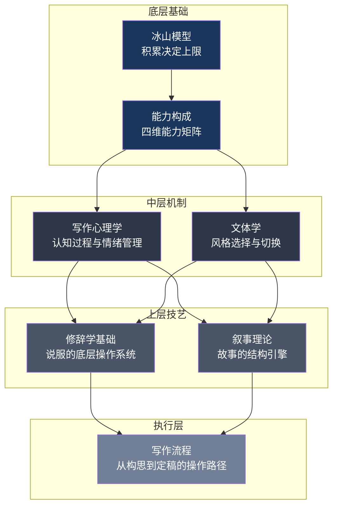

## 本节小结

基础理论是写作能力的地基。本节从七个维度——写作心理学、修辞学基础、叙事理论、文体学、写作流程、写作能力构成要素和冰山模型——构建了写作的完整理论框架。下面将这七个维度串联起来，帮你建立一张可导航的知识地图，并提炼出每个维度最核心的可操作收获。

### 8.1 七维知识地图：一张图看懂基础理论全景

```mermaid
graph TD
    A[写作基础理论] --> B[写作心理学<br/>为什么写]
    A --> C[修辞学基础<br/>怎样说服]
    A --> D[叙事理论<br/>怎样讲故事]
    A --> E[文体学<br/>怎样选风格]
    A --> F[写作流程<br/>怎样执行]
    A --> G[能力构成<br/>需要哪些能力]
    A --> H[冰山模型<br/>水面下有什么]

    B --> B1[认知过程模型]
    B --> B2[心流与焦虑管理]
    B --> B3[动机与自我效能]

    C --> C1[Logos/Pathos/Ethos]
    C --> C2[修辞五艺]
    C --> C3[修辞手法工具箱]

    D --> D1[三幕式/英雄之旅]
    D --> D2[视角与时间操控]
    D --> D3[冲突与张力]

    E --> E1[正式度/语气/节奏/密度]
    E --> E2[四大基础文体]
    E --> E3[个人风格形成]

    F --> F1[准备→初稿→修改→定稿]
    F --> F2[各阶段核心技巧]

    G --> G1[语言能力]
    G --> G2[结构能力]
    G --> G3[思维能力]
    G --> G4[观察能力]

    H --> H1[可见：语言/结构/论证]
    H --> H2[不可见：阅读/思考/经验]

    style A fill:#1a365d,color:#fff
    style B fill:#2d3748,color:#fff
    style C fill:#2d3748,color:#fff
    style D fill:#2d3748,color:#fff
    style E fill:#2d3748,color:#fff
    style F fill:#2d3748,color:#fff
    style G fill:#2d3748,color:#fff
    style H fill:#2d3748,color:#fff
```

这七个维度不是孤立的知识模块，而是相互嵌套、彼此支撑的系统：

- **心理学**回答"写作的底层机制是什么"——理解了认知过程和情绪管理，你才知道怎样高效写作、怎样克服障碍
- **修辞学**回答"怎样让读者信服"——Logos/Pathos/Ethos三诉求是一切说服性写作的底层操作系统
- **叙事理论**回答"怎样让读者投入"——故事结构、视角选择、张力制造是吸引注意力的核心引擎
- **文体学**回答"什么场合用什么风格"——四大维度（正式度、语气、节奏、密度）决定了文字的认知效果
- **写作流程**回答"具体怎么做"——准备、初稿、修改、定稿四阶段提供了可执行的操作路径
- **能力构成**回答"我还缺什么"——语言、结构、思维、观察四维能力帮你定位短板
- **冰山模型**回答"最终靠什么"——水面之下的阅读积累、思考深度、生活体验才是持久的竞争力

### 8.2 七个维度的核心收获提炼

#### 8.2.1 写作心理学：写作是一场认知舞蹈

本节最重要的认知转变：**写作不是"把想法写下来"，而是工作记忆、长期记忆和执行功能三方协同的复杂认知过程。**

Hayes-Flower模型揭示了写作的三个子过程——计划、翻译、检查——不是线性推进的，而是反复迭代、相互交织的。这意味着"写不出来"不是你笨，而是你的工作记忆在同时处理太多信息。解决方案不是"更努力"，而是通过大纲降低认知负荷、通过修改分离生成与评估、通过大量练习把低层操作自动化为系统1处理。

Bereiter和Scardamalia的知识讲述→知识转换模型是最实用的自评工具。问自己：我写这篇文章时，是在"想到什么写什么"（知识讲述），还是在"根据目的重新组织信息"（知识转换）？从讲述到转换的跃迁，是写作能力发展最关键的转折点。

**三个可立即应用的心理学工具**：

| 工具 | 用途 | 操作方法 |
|------|------|----------|
| 自由写作 | 降低启动焦虑 | 设定10分钟计时器，不停笔、不修改、不回头看。写不出来就写"我不知道写什么"直到新想法出现 |
| 蔡加尼克效应 | 对抗拖延 | 承诺"只写5分钟"——一旦开始未完成的任务，大脑会自动产生完成它的驱动力 |
| 认知重构 | 克服完美主义 | 把"我必须写出完美的文章"替换为"先完成初稿，修改阶段再打磨" |

#### 8.2.2 修辞学基础：说服是一门可习得的技艺

本节最重要的认知转变：**修辞不是堆砌辞藻，而是"在正确的场合，用正确的方式，说正确的话"。**

亚里士多德的三种诉求（Logos/Pathos/Ethos）是理解一切说服性文本的万能框架。读一篇公众号文章，问自己：作者在用逻辑说服我（数据、案例、推理），还是在用情感打动我（恐惧、希望、同情），还是在用身份背书（专家、机构、经验）？看清诉求结构，你就不会被轻易说服；运用诉求结构，你就能写出有说服力的文字。

古典修辞五艺——发明、安排、风格、记忆、表达——本质上就是一套完整的写作工作流。"发明"对应素材收集和构思，"安排"对应大纲设计，"风格"对应语言选择，"记忆"对应知识管理，"表达"对应排版呈现。两千年前的框架，今天依然适用。

**三个可立即应用的修辞工具**：

| 工具 | 用途 | 操作方法 |
|------|------|----------|
| SCQA结构 | 组织商业/提案类文章 | 情境（Situation）→冲突（Complication）→问题（Question）→答案（Answer） |
| 反驳预判 | 增强论证力度 | 列出至少5条可能的反对意见，按严重程度排序，在文章中主动回应最严重的1-2条 |
| 情感具象化 | 让抽象问题打动人心 | 不说"贫困地区缺乏教育资源"，而说"8岁的小梅每天走两小时山路去上学，书包里只有两本翻烂的课本" |

#### 8.2.3 叙事理论：人类的大脑是一台故事处理器

本节最重要的认知转变：**叙事不是文学的专利，而是人类组织经验、传递意义的核心方式。数据+故事=最强说服力。**

三幕式（设置25%→对抗50%→解决25%）是所有成功故事的深层结构。英雄之旅的12个阶段不仅适用于神话和小说，也适用于个人品牌故事和商业案例写作——客户是英雄，业务问题是"冒险召唤"，你的产品是"导师提供的工具"，成功案例是"带万灵药归来"。

叙事视角的选择是战略决策而非技术细节。第一人称制造亲密感但限制信息量，第三人称有限视角兼顾两者，全知视角自由度最大但容易产生距离感。选择视角时，先回答"我需要读者离角色多近"。

**三个可立即应用的叙事工具**：

| 工具 | 用途 | 操作方法 |
|------|------|----------|
| STORY模型 | 非虚构叙事的结构检查 | 场景（Setting）→张力（Tension）→结果（Outcome）→反思（Reflection）→读者关联（You） |
| 节奏对比 | 制造阅读体验的呼吸感 | 关键事件用场景展开（慢），过渡内容用概述带过（快）；紧张场景用短句，舒缓场景用长句 |
| 冲突升级公式 | 驱动叙事前进 | 想要→受阻→换方法→更大阻碍→孤注一掷→最终对决 |

#### 8.2.4 文体学：文体是思想的容器，不是装饰品

本节最重要的认知转变：**好的文体不是"写得漂亮"，而是"写得有效"。技术文档写得华丽是失败的，散文写得像操作手册同样是失败的。**

文体有四个可调控的维度：正式程度、语气基调、句法节奏、词汇密度。成熟的写作者能够在这四个维度上灵活调节——给投资人写报告用正式+理性+中长句+高密度，给用户写教程用半正式+亲切+短句+低密度。

中文写作有独特的美学资源：四字格的音韵压缩、对仗的结构之美、文言融合的凝练力量、量词的精准画面感。这些不是"锦上添花"，而是中文写作者独有的表达工具箱。

**三个可立即应用的文体工具**：

| 工具 | 用途 | 操作方法 |
|------|------|----------|
| 文体分析五步法 | 分析任何文本的文体 | 定类型→测正式度→辨语气→看节奏→析用词 |
| 长短句交替 | 改善阅读节奏 | 用短句制造冲击（"互联网浪潮席卷一切"），用长句展开论述，形成"呼吸感" |
| 风格模仿三步法 | 形成个人风格 | 抄写（感受节奏）→改写（保留结构替换内容）→独立创作（只保留感觉） |

#### 8.2.5 写作流程：先完成，再完美

本节最重要的认知转变：**写作流程不是线性的，而是迭代的。准备→初稿→修改→定稿四个阶段可以反复循环。但初稿阶段必须和修改阶段分离——同时生成和评估是写作效率的最大杀手。**

准备阶段的核心是回答五个问题：为什么写（目的）、写给谁（读者）、写什么（主题）、写多深（范围）、在哪发（平台）。初稿阶段的核心原则是"允许不完美"——快速把想法倒出来，不纠结措辞和逻辑。修改阶段分为结构调整、段落优化、句子打磨和校对四个层次，从大到小依次进行。定稿阶段做最终校对和格式调整。

**三个可立即应用的流程工具**：

| 工具 | 用途 | 操作方法 |
|------|------|----------|
| 写前五问 | 明确写作方向 | 为什么写？写给谁？写什么？写多深？在哪发？ |
| 大纲四法 | 设计文章骨架 | 自由联想法→逻辑推演法→参考模板法→反向工程法 |
| 四层修改法 | 系统化修改 | 结构调整（大局）→段落优化（中局）→句子打磨（小局）→校对（细节） |

#### 8.2.6 写作能力构成：四维能力矩阵

本节最重要的认知转变：**写作能力不是单一技能，而是语言、结构、思维、观察四种能力的复合体。只提升其中一种，效果有限；四维同步提升，才能实现质的飞跃。**

| 能力维度 | 核心内涵 | 关键训练方法 | 自评问题 |
|----------|----------|-------------|----------|
| 语言能力 | 词汇量、语法、修辞、语感 | 广泛阅读、朗读练习、同义词积累、反复修改 | 我能精确表达每一个细微的感受吗？ |
| 结构能力 | 逻辑组织、段落安排、过渡衔接 | 大纲写作、逻辑树分析、优秀文章结构拆解 | 读者能不看第二遍就抓住我的文章骨架吗？ |
| 思维能力 | 批判性思维、创造性思维、系统思维 | 逻辑学基础、SCAMPER法、跨领域阅读 | 我的文章有独到的见解还是在重复别人的观点？ |
| 观察能力 | 感官敏锐、细节捕捉、模式识别 | 感官日记、人物速写、对比观察 | 我的文章有"只有我才能写出"的细节吗？ |

这四种能力的提升路径不同：语言能力靠大量输入+反复练习，结构能力靠拆解+重构，思维能力靠跨领域阅读+刻意训练，观察能力靠日常生活中的"刻意注意"。

#### 8.2.7 冰山模型：水面之下决定一切

本节最重要的认知转变：**读者看到的流畅语言、清晰结构、有力论证只是冰山一角。真正支撑写作能力的是水面之下的阅读积累、思考深度、知识储备、生活体验和大量练习。**

这意味着两件事：

**第一，没有捷径。** 你无法绕过大量阅读和持续练习来提升写作。任何"7天写出爆款文章"的承诺都是骗人的。写作能力的提升以年为单位——模仿期0-1年、探索期1-3年、融合期3-5年、成熟期5年以上。

**第二，写作训练不能只练写作。** 提升写作能力的最佳方式之一是"不写作"——去阅读、去观察、去体验、去思考、去和不同领域的人交流。水面之下的积累越厚，水面上的表现越稳。

### 8.3 七个维度的协同关系

这七个维度不是并列的，而是有层次的：

- **底层基础**（冰山模型+能力构成）决定你的上限——没有积累和底层能力，技巧都是空中楼阁
- **中层机制**（心理学+文体学）决定你的效率——理解认知过程和风格选择，你才能用对力气
- **上层技艺**（修辞学+叙事理论）决定你的表达力——掌握说服和叙事的工具，你才能打动读者
- **执行层**（写作流程）决定你的产出——有再好的理念，不落地到具体的写作流程中，都是空谈

### 8.4 从理论到实践：行动路线图

理论的价值在于指导实践。以下是基于本节内容提炼的分阶段行动路线图：

#### 第一阶段：建立基础（第1-4周）

| 周次 | 重点 | 具体行动 | 预期收获 |
|------|------|----------|----------|
| 第1周 | 心理准备 | 每天10分钟自由写作；记录写作焦虑触发点；建立写作启动仪式 | 降低启动焦虑，建立写作习惯 |
| 第2周 | 修辞意识 | 随手分析3篇公众号文章的Logos/Pathos/Ethos比例；积累5个好用的修辞手法 | 建立修辞分析的"眼睛" |
| 第3周 | 叙事感觉 | 用三幕式拆解一部电影或一篇特稿；用STORY模型改写一段平淡的经历 | 理解叙事结构的运作方式 |
| 第4周 | 文体敏感度 | 同一主题分别用正式、半正式、非正式三种文体各写300字；分析差异 | 体验文体切换的感觉 |

#### 第二阶段：深化训练（第5-12周）

| 月份 | 重点 | 具体行动 | 预期收获 |
|------|------|----------|----------|
| 第2月 | 流程内化 | 严格执行准备→初稿→修改→定稿四阶段写3篇完整文章；练习四层修改法 | 建立完整的写作工作流 |
| 第3月 | 能力补短板 | 自评四维能力（语言/结构/思维/观察），针对最弱的一项进行专项训练 | 弥补关键短板 |

#### 第三阶段：持续精进（长期）

| 维度 | 持续行动 | 频率 |
|------|----------|------|
| 阅读积累 | 每月精读1本写作/修辞/叙事相关的书 | 每月 |
| 写作练习 | 每周至少写2000字（任何形式） | 每周 |
| 文体实验 | 每季度挑战一种不擅长的文体 | 每季度 |
| 反馈循环 | 每篇文章至少让1个人读后给反馈 | 每篇 |
| 素材管理 | 随手记录灵感和案例，维护素材库 | 每天 |

### 8.5 常见误区与纠正

在学习基础理论的过程中，以下误区最容易让人走弯路：

| 误区 | 为什么是错的 | 正确做法 |
|------|-------------|----------|
| "理论无用，多写就行" | 不理解原理的练习是低效重复。写了十年和写了一年可能没有本质区别 | 理论+实践并行。每学一个概念，立即在下一篇写作中尝试运用 |
| "文采就是好文章" | 好文章的标准是"有效"而非"华丽"。技术文档追求精确，新闻报道追求简洁 | 根据目的、读者、场合选择合适的文体，而非一味追求文采 |
| "模仿就是抄袭" | 每个伟大作家都从模仿开始。巴尔扎克模仿司汤达，海明威模仿斯泰因 | 模仿→改写→独立创作。在模仿中逐渐加入自己的元素 |
| "结构限制创造力" | 结构是地基而非牢笼。完全抛弃结构通常产生混乱，而非创新 | 先掌握经典结构，在此基础上创新。毕加索先学写实，再创立体主义 |
| "只练自己擅长的文体" | 只擅长一种文体是严重的短板。真正的写作能力是"文体弹性" | 定期挑战不擅长的文体，扩展写作的舒适区 |
| "写得慢就是写得好" | 慢工不一定出细活。初稿追求速度，修改追求质量 | 初稿阶段用系统1快速生成，修改阶段用系统2仔细打磨。两个阶段必须分离 |
| "冲突越多故事越好" | 堆砌冲突而没有角色成长会产生"动作片疲劳" | 冲突必须服务于角色弧线和主题表达。最好的冲突是揭示内心的冲突 |

### 8.6 核心原则速查

将本节七个维度浓缩为12条核心原则，可在写作前快速回顾：

┌─────────────────────────────────────────────────────┐
│              写作基础理论 · 12条核心原则               │
├─────────────────────────────────────────────────────┤
│                                                     │
│  心理学                                             │
│  1. 写作是认知舞蹈，不是简单记录                     │
│  2. 先完成，再完美——初稿允许不完美                   │
│  3. 焦虑是正常的，它不代表你写不好                   │
│                                                     │
│  修辞学                                             │
│  4. 说服 = 逻辑(说得对) + 情感(说得好) + 人格(可信)  │
│  5. 修辞五艺 = 完整写作工作流                        │
│  6. 主动回应反对意见，比只证明自己对更有力            │
│                                                     │
│  叙事                                               │
│  7. 数据+故事 = 最强说服力                           │
│  8. 冲突是叙事的心脏，没有冲突就没有张力              │
│  9. 视角选择是战略决策，不是技术细节                  │
│                                                     │
│  文体                                               │
│  10. 好的文体是"得体"，不是"华丽"                   │
│  11. 文体四维：正式度×语气×节奏×密度                 │
│                                                     │
│  冰山                                               │
│  12. 水面之下的积累决定水面之上的表现                 │
│                                                     │
└─────────────────────────────────────────────────────┘

### 8.7 推荐延伸阅读

每个维度都值得深入学习。以下书目按本节七个维度分类推荐：

| 维度 | 书名 | 作者 | 推荐理由 |
|------|------|------|----------|
| 写作心理学 | 《写作心理学》 | Hayes & Flower | 写作认知过程模型的源头文献 |
| 写作心理学 | 《心流》 | Csikszentmihalyi | 理解最优体验状态的经典之作 |
| 修辞学 | 《修辞学》 | 亚里士多德 | 西方修辞学的奠基之作，两千年来从未过时 |
| 修辞学 | 《修辞学发凡》 | 陈望道 | 中国第一部系统的现代修辞学著作 |
| 修辞学 | 《我们赖以生存的隐喻》 | Lakoff | 理解隐喻如何塑造思维 |
| 叙事理论 | 《千面英雄》 | Campbell | 英雄之旅模型的源头 |
| 叙事理论 | 《作家之旅》 | Vogler | 英雄之旅在写作中的实操指南 |
| 叙事理论 | 《故事》 | Robert McKee | 叙事结构的圣经级教材 |
| 文体学 | 《风格感觉》 | Steven Pinker | 现代文体学的最佳入门读物 |
| 文体学 | 《文心雕龙》 | 刘勰 | 中国古代最系统的修辞学著作 |
| 写作流程 | 《写作这回事》 | Stephen King | 大师级作家的写作方法论 |
| 写作流程 | 《Bird by Bird》 | Anne Lamott | 克服写作焦虑、拥抱"糟糕初稿"的经典 |
| 综合 | 《On Writing Well》 | William Zinsser | 非虚构写作的圣经级教材 |
| 综合 | 《金字塔原理》 | Barbara Minto | 结构化写作和思考的经典框架 |

> **"写作是思考的纸上演练。"**——威廉·津瑟

理解这些理论，不是为了成为学者，而是为了成为更好的写作者。理论是工具，不是目的——不要让理论束缚你的创造力，而是让它成为你创造力的翅膀。从现在开始，带着对写作理论的理解，开始你的写作实践吧。
