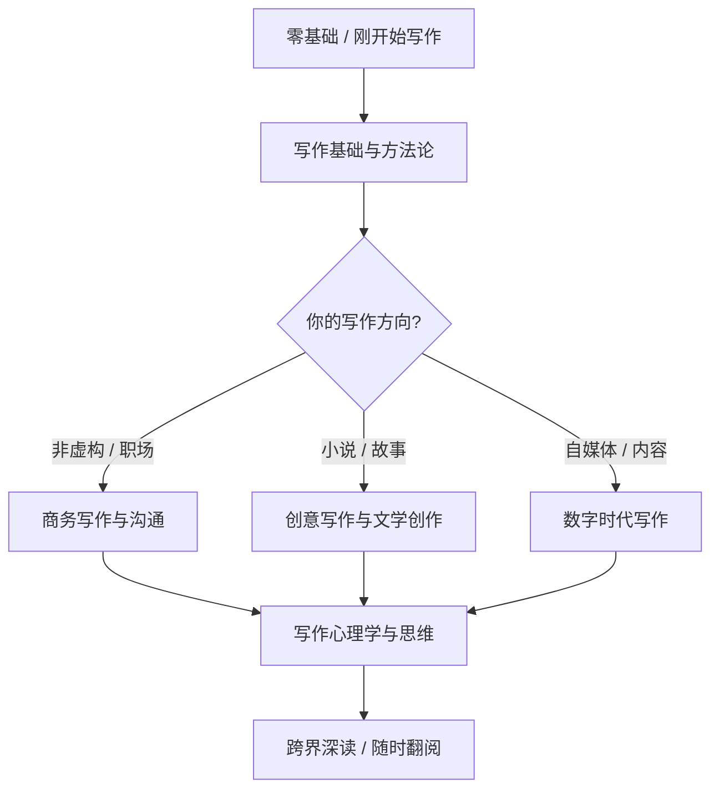

## 一、必读书籍

读书是写作能力提升的底层操作系统。一篇好文章的骨架来自结构思维，血肉来自素材积累，灵魂来自审美品味——而这三者都可以通过系统阅读获得。本节不是简单地列一份书单，而是按照「写作能力成长路径」编排，从基础技法到高阶心法，从非虚构到虚构，从西方经典到中文语境，帮助你建立完整的阅读地图。

### 阅读路径总览

不同阶段的写作者需要不同的营养。下面的路线图帮你快速定位自己当前应该优先读哪些书：

| 阶段 | 目标 | 推荐起始书 | 阅读周期 |
|------|------|-----------|---------|
| 入门期 | 学会清晰表达 | 《写作法宝》+《一本小小的红色写作书》 | 2-4周 |
| 成长期 | 掌握结构与逻辑 | 《金字塔原理》+《学会写作》 | 3-6周 |
| 精进期 | 建立个人风格 | 《风格的要素》+《写作这回事》 | 持续翻阅 |
| 突破期 | 写出有深度的作品 | 《故事》+《千面英雄》+《心流》 | 按需深读 |

---

### 1.1 写作基础与方法论

这五本书解决的核心问题是：「我写的东西别人看不懂 / 不想看 / 看了没收获怎么办？」。它们从不同角度回答这个入门者最迫切的问题。

#### 《写作法宝：非虚构写作指南》（On Writing Well）——威廉·津瑟

**为什么它排在第一位：** 这本书自1976年首版以来持续再版，全球销量超百万册，被无数新闻学院和写作课列为必读。津瑟用40年时间打磨一本书，本身就是一个「好文章是改出来的」的最佳范例。

**你将获得的核心能力：**

- **简洁表达的能力。** 津瑟反复强调「删掉所有不必要的词」。他举了一个例子：原句「Due to the fact that it was raining, the game was canceled」改为「Because it was raining, the game was canceled」，少了四个词，意思完全不变。这种训练贯穿全书，读完之后你会对自己的冗余用词变得高度敏感。
- **非虚构写作的全景认知。** 全书分四个部分：原则（Principles）、方法（Methods）、形式（Forms）、心态（Attitudes）。从遣词造句到人物写作、地方描写、科技报道、商务文档、体育写作、回忆录——几乎覆盖了非虚构写作的所有类型。
- **修改意识的建立。** 津瑟认为写作的本质是修改，而不是一次成型。他展示了大量「修改前后」的对比段落，让你直观感受到好文章是如何从粗糙初稿中打磨出来的。

**怎么读最有效：**

- 第一遍通读第一部分「原则」（约60页），这是全书精华，包含简洁、清晰、风格、用词四个核心章节。
- 第二遍按照你自己的写作类型，选读对应的章节。写公众号就读「非虚构写作的方法」部分，写工作汇报就读「商务写作」部分。
- 每读完一章，用该章的方法改写自己最近的一篇文章，效果远超只读不练。

**版本建议：** 读英文原版最佳，津瑟本人就是简洁英语的标杆。中文译本可选30周年纪念版，翻译质量尚可。

#### 《风格的要素》（The Elementary of Style）——斯特伦克 & 怀特

**为什么不到100页的书能成为经典：** 1918年由康奈尔大学教授斯特伦克编写，后由其学生怀特（《夏洛的网》作者）扩充再版。全书只有85页，却浓缩了英语写作最核心的规则。它不教你「怎么写得好」，而是教你「怎么不写得差」——这两件事是不一样的。

**核心内容拆解：**

- **11条用词规则：** 比如「用名词和动词，少用形容词和副词」。这不是说形容词没用，而是说新手倾向于用形容词来补偿名词的不够精确。与其说「a very large building」，不如说「a warehouse」或「a cathedral」——具体名词自带画面感。
- **11条风格准则：** 其中最重要的一条是「Omit needless words」（删掉多余的词）。这一条与津瑟的观点高度一致，可见简洁是非虚构写作的第一公理。
- **常见的拼写和格式错误：** 虽然针对英文，但其中的逻辑——「规则先于风格」——对中文写作同样适用。

**中文写作者怎么用：** 不必逐字阅读英文用词规则部分，重点阅读「风格准则」章节。把它当作一个「写作检查清单」——每次修改文章时对照这些准则逐条检查，可以过滤掉80%的低级问题。

#### 《金字塔原理》（The Minto Pyramid Principle）——芭芭拉·明托

**为什么职场写作者必读：** 这本书原本是麦肯锡咨询顾问的内部培训教材，后来成为全球商学院和管理咨询行业的标准参考。它的核心主张是：任何复杂的思考和表达，都应该组织成金字塔结构——先结论，后论据，层层展开。

**金字塔原理的四大核心规则：**

| 规则 | 含义 | 写作应用 |
|------|------|---------|
| 结论先行 | 先说答案，再说原因 | 文章第一段亮出核心观点 |
| 以上统下 | 上层是下层的总结 | 每个小标题概括该段内容 |
| 归类分组 | 同一层级的内容属于同一类别 | 并列论点之间保持逻辑平行 |
| 逻辑递进 | 同一组内容按逻辑顺序排列 | 时间顺序、重要性顺序、结构顺序 |

**怎么读：** 这本书的缺点是写得比较枯燥（讽刺的是，一本教写作的书写得不好读）。建议的方法是：先读第一章了解全貌，然后直接跳到第三部分「解决问题的逻辑」和第四部分「演示的逻辑」——这两部分与日常写作关系最直接。第一部分「写作的逻辑」和第二部分「思考的逻辑」可以在需要时回查。

**适用场景：** 工作汇报、项目提案、分析报告、年终总结、述职PPT——凡是需要「说服别人」的文字，都可以用金字塔原理来组织。

#### 《学会写作》——粥左罗

**为什么中国读者需要这本书：** 前面三本都是西方经典，它们的原则是普世的，但语境是西方的。粥左罗的这本书则完全扎根在中国互联网内容生态中——他从2015年开始写公众号，从零起步做到百万粉丝，用的是微信公众号、知乎、头条号这些你每天都在用的平台。

**最有价值的部分：**

- **选题方法论。** 粥左罗提出了「选题四问」：这个话题有多少人关心？关心的程度有多深？这个话题有没有被写过？我有没有独特的角度？这个框架可以直接套用到你每次选题的决策中。
- **标题的7个公式。** 不是教你做标题党，而是帮你理解「为什么有些标题让人想点，有些标题让人想划走」。比如「痛点+解决方案」型（「月薪5000的人，是怎么存下10万的」）比干巴巴的陈述型（「如何存钱」）有效得多。
- **从零到一的成长路径。** 他详细记录了自己从第一个1000粉丝到第一个10万粉丝的过程，包括涨粉策略、内容规划、变现方式——这些是西方写作书不会涉及的中国特色内容。

**局限性：** 这本书更侧重「自媒体运营」而非纯粹的「写作技艺」。如果你的目标是写出文学性强的作品，它不是首选；但如果你的目标是通过写作建立个人品牌、获得流量、实现变现，它是目前中文市面上最接地气的一本。

#### 《一本小小的红色写作书》（The Little Red Writing Book）——布兰登·罗伊尔

**定位：** 如果说《写作法宝》是一本系统的教科书，这本就是一个速查手册。全书20个写作原则，每个原则用2-3页讲清楚，配大量实例和练习。适合没时间读大部头但又想快速提升的人。

**最实用的三个原则：**

- **用支撑性内容充实文章。** 很多新手的文章给人「空」的感觉，原因是只有观点没有支撑。解决方法是：每个论点后面至少跟一个具体例子、一组数据、或一个类比。
- **使用转折词维持连贯。** 「然而」「此外」「因此」「具体来说」——这些词是文章的路标，告诉读者你正在转向、递进、还是总结。新手文章读起来散，往往就是因为缺少这些路标。
- **保持段落简洁。** 一个段落只表达一个意思。如果一个段落超过5行，检查一下是否混入了第二个意思。

---

### 1.2 创意写作与文学创作

如果你想写小说、散文、剧本、回忆录，或者任何需要「讲故事」的文本，这一节的书是你的核心弹药库。

#### 《成为作家》（Becoming a Writer）——多萝西娅·布兰德

**独特价值：** 1934年出版，是创意写作教学的开山之作。与大部分教你「怎么写」的书不同，这本书关注的是「怎么成为一个写作者」——它解决的是身份认同和心理建设的问题。

**三个关键练习：**

- **晨间写作。** 每天起床后第一件事，不假思索地写30分钟。不修改、不评判、不停顿，只是把脑子里的东西倒出来。这个练习的目的是绕过你的「内心批评家」，让你学会自由输出。坚持一个月，你会发现自己的写作流畅度有质的飞跃。
- **艺术家之约。** 每周给自己安排一次独处的「艺术家约会」——去博物馆、逛菜市场、坐一趟没坐过的公交线路。目的是训练观察力，让感官保持敏锐。好的写作者首先是好的观察者。
- **两面自我训练。** 布兰德提出每个写作者都有「艺术家自我」（创意、直觉、冲动）和「批评家自我」（逻辑、判断、修改）。关键是要让两者各司其职——创作时不批评，修改时不创作。

**什么时候读：** 如果你经常觉得「我有很多想法但写不出来」或者「写了开头就写不下去」，先读这本。它比任何技法书都重要。

#### 《写作这回事》（On Writing: A Memoir of the Craft）——斯蒂芬·金

**为什么恐怖小说之王的写作书值得所有人读：** 这本书的前半部分是自传——金讲述了自己从酗酒、吸毒、车祸濒死中恢复的经历；后半部分是写作方法论。两条线交织在一起，让你理解「写作」这件事是如何嵌入一个真实的人的一生中的。

**斯蒂芬·金的核心写作哲学：**

- **「第一稿关门写，第二稿开门改。」** 第一稿是给自己写的，不要考虑任何读者，不要自我审查，只管把故事讲完。第二稿才是给读者写的——删掉10%的篇幅（金自己说的公式），打磨语言，调整结构。
- **「用名词和动词写作，而不是用副词和形容词。」** 这与《风格的要素》的观点完全一致。金特别反感「-ly」副词（中文对应的是「地」字短语），认为它是作者对自己动词不自信的表现。
- **「多读多写，没有捷径。」** 金每年读70-80本书，他的原话是「如果你没有时间读书，你就没有时间（或工具）来写作。就这么简单。」
- **「把门关上。」** 写作是孤独的，不要在初稿阶段就寻求反馈。过早分享会杀死一个还没成形的作品。

**必读章节：** 第三部分「论写作」（On Writing），约100页，是全书的方法论精华。如果你时间有限，直接读这部分。

#### 《故事》（Story）——罗伯特·麦基

**地位：** 这是全球编剧和叙事作家的「圣经」，麦基的「故事研讨会」票价高达数百美元，好莱坞超过60%的编剧参加过。这本书就是那个研讨会的文字版。

**你将学到的核心框架：**

- **故事三角：** 极简主义（Minimalism）、反情节（Anti-plot）、经典叙事（Classical Design）。大多数商业写作——无论是小说、剧本还是品牌故事——都在经典叙事的框架内运作。理解这个三角，你就理解了「为什么有些故事好看，有些故事无聊」。
- **鸿沟理论（The Gap）：** 角色采取行动，期望得到某个结果，但实际得到的是另一个结果——这个落差就是「鸿沟」。鸿沟制造冲突，冲突推动故事。麦基认为，故事的动力来源就是角色期望与现实之间的不断错位。
- **场景设计的五步法：** 每个场景都要有：价值负荷转变（正→负或负→正）、转折点、鸿沟打开。如果一个场景没有改变任何东西，它就不应该存在。

**怎么读：** 这本书非常厚（约500页），信息密度很高。建议按需查阅：先通读目录了解框架，然后针对你当前的写作问题（比如「怎么写好开头」「怎么制造高潮」）选读对应章节。不需要从头读到尾。

#### 《千面英雄》（The Hero with a Thousand Faces）——约瑟夫·坎贝尔

**为什么一本比较神话学的书会出现在写作书单里：** 坎贝尔通过研究全世界的神话，发现了一个共通的叙事结构——「英雄之旅」（Hero's Journey）。这个结构后来被乔治·卢卡斯用于创作《星球大战》，被迪士尼用于几乎所有的动画电影，被无数小说和游戏采用。

**英雄之旅的12个阶段：**

**写作者怎么用：** 不是让你机械套用这12步，而是理解它背后的逻辑——人类天然被「从已知到未知再回到已知」的叙事吸引。无论是写品牌故事、产品文案、还是个人经历，这个模式都可以作为骨架使用。

#### 《写作课》（Bird by Bird）——安妮·拉莫特

**书名的来历：** 拉莫特的哥哥10岁时要写一篇关于鸟类的报告，拖到最后一晚还没动笔，急得快哭了。父亲对他说：「一只一只地写，孩子。Bird by bird。」这个故事是全书的核心隐喻——不要被庞大的写作任务吓倒，把它拆成小块，一块一块来。

**最实用的三个概念：**

- **「糟糕的初稿」（Shitty First Drafts）。** 这可能是整本书最有名的概念。拉莫特说所有好作家都写糟糕的初稿，这是写作过程中不可或缺的一步。你必须先允许自己写烂，才能最终写好。如果你每次写文章都卡在开头，大概率就是「内心批评家」太强了——先关掉它。
- **「一英寸相框」。** 如果你不知道从哪里开始写，就描写一个一英寸相框那么大的场景——一个房间的角落、一个路人的手、一道菜的颜色。小的切入点往往能打开大的世界。
- **「广播站KFKD」。** 拉莫特把内心那个不断说「你写得不好」「没人想看」「别人比你强多了」的声音比作一个骚扰广播站。写作课的一个重要内容就是学会关掉这个广播站。

---

### 1.3 商务写作与沟通

职场写作不同于文学创作——它不追求文采，追求的是效率、说服力和行动力。下面这些书专门解决「怎么让人看完你的邮件 / 报告 / 方案后做出你想要的反应」这个问题。

#### 《高效写作》（Everybody Writes）——安·汉德利

**核心主张：** 在数字时代，每个人都是内容创作者——你写的每一封邮件、每一条朋友圈、每一份工作文档，都在塑造别人对你的专业印象。汉德利是MarketingProfs的首席内容官，她用62个实操法则教你怎么写出更好的数字内容。

**最实用的法则：**

- **写作公式：** 好内容 = 实用 × 情感 × 灵感。三者不必面面俱到，但至少要有两个。
- **「1-2-3 写作法」：** 写初稿时用1个小时，然后用2倍的时间修改，最后用3倍的时间打磨标题和开头。大多数人的错误是把90%的时间花在写初稿上，只花10%在修改上——这个比例应该反过来。
- **「换椅子」：** 写完之后，想象自己是读者，坐在另一把椅子上重新读一遍。问自己：「如果我收到这封邮件 / 看到这篇文章，我会怎么做？」如果答案不是你期望的反应，就需要修改。

**适用人群：** 运营、市场、产品、公关——任何需要经常写对外内容的岗位。

#### 《金字塔原理2》（The Minto Pyramid Principle 2）——芭芭拉·明托

**定位：** 第一版的续篇和补充，进一步深入思考与解决问题的逻辑。如果你已经读完第一版并且在实践中遇到了「知道结论先行但不知道怎么提炼结论」的问题，第二版会帮你解决。核心新增内容是MECE原则（Mutually Exclusive, Collectively Exhaustive，相互独立、完全穷尽）的详细应用，以及如何从混乱的信息中提炼出金字塔结构的实际操作步骤。

**建议：** 如果你只读一本金字塔，读第一版就够了。第二版适合在实践中遇到瓶颈时翻阅。

#### 《麦肯锡教我的写作武器》——高杉尚孝

**推荐理由：** 日本麦肯锡顾问写的商务写作书，比《金字塔原理》更贴近亚洲职场语境。他提出了「信息设计」的概念——在写作之前先做信息设计，确定你想要传达的主信息和支撑信息，然后再动笔。

**核心工具：**

- **主信息 + 子信息的树状结构：** 每篇文章只有一个主信息（类似金字塔的顶点），下面挂着3-5个子信息作为支撑。
- **理由 + 事实的说服模型：** 你的主张需要两种支撑——理由（为什么）和事实（证据）。只有理由没有事实是空洞的说教；只有事实没有理由是杂乱的数据堆砌。

---

### 1.4 写作心理学与思维

写作不只是技巧问题，更是心理问题。很多人不是不会写，而是不敢写、不想写、写不下去。这一节的书解决的是「心」的问题。

#### 《心流》（Flow）——米哈里·契克森米哈赖

**与写作的关系：** 契克森米哈赖是积极心理学的奠基人之一，他通过大量研究发现，人在进入「心流」状态时，会体验到深度的满足感和高效能。心流状态的触发条件包括：明确的目标、即时的反馈、挑战与能力的匹配。这恰好解释了为什么有些时候你写得又快又好（进入了心流），而另一些时候你坐在电脑前半天写不出一个字（没有进入心流）。

**写作者如何创造心流条件：**

| 心流条件 | 写作中的对应操作 |
|---------|----------------|
| 明确的目标 | 写之前先列提纲，知道要写什么 |
| 即时的反馈 | 写完一段就回头读一遍，感受流畅度 |
| 挑战与能力匹配 | 选择略高于当前水平的写作任务 |
| 全神贯注 | 关掉手机通知，使用专注模式（如Forest、番茄钟） |
| 控制感 | 用自己熟悉的写作工具和环境 |

**什么时候读：** 当你觉得自己「写不进去」但又不知道为什么的时候，这本书会帮你理解问题的根源。

#### 《写作的禅机》（Zen in the Art of Writing）——雷·布拉德伯里

**定位：** 这不是一本方法论书，而是一本能量书。布拉德伯里是科幻黄金时代的代表作家（《华氏451度》《火星编年史》），他在书中反复强调的是：写作的动力来自热爱，而不是自律。

**最有启发的观点：**

- **「每天写1000字，坚持写，不要停。」** 布拉德伯里认为写作是一种肌肉，用进废退。他建议每天固定时间写作，不管写得好不好，先把字数凑够。质量是量变引起质变的结果。
- **「列名词清单」：** 布布拉德伯里有一个习惯——每天晚上睡前列一个名词清单，写下当天触发他情绪的词。比如「地下室」「雷声」「旧洋娃娃」「消毒水」。这些词后来变成他小说的灵感来源。这是一个极其简单但有效的创意训练法。
- **「写你热爱的东西。」** 如果你对一个话题没有热情，读者读出来的时候也不会有热情。写作的第一步不是找到好技巧，而是找到你真正关心的东西。

**什么时候读：** 写作动力低谷期。当你觉得写作是一种负担而不是一种享受时，翻翻这本书，它会提醒你为什么当初开始写。

#### 《创意自信》（Creative Confidence）——汤姆·凯利 & 大卫·凯利

**核心问题：** 太多人相信「创意是一种天赋，不是每个人都有的」。这本书用大量研究和案例证明，创意是一种可以培养的能力——就像肌肉一样，越练越强。

**写作者可以立刻使用的三个方法：**

- **头脑风暴的四条规则：** 不批评（先别判断好坏）、追求数量（100个烂主意里可能有1个好主意）、自由联想（在别人的基础上延伸）、鼓励疯狂想法（越离谱越可能触发突破）。很多人写作时过早进入「编辑模式」，在创意阶段就开始自我审查——这是写作卡壳的主要原因之一。
- **原型思维：** 不要等到想出完美的方案才动手。先写一个粗糙的版本（原型），然后不断迭代改进。这与斯蒂芬·金「糟糕的初稿」理论完全一致。
- **共情训练：** 好的写作建立在对读者的深刻理解之上。花时间去观察、倾听、理解你的目标读者——他们的困惑、恐惧、渴望是什么？这些洞察会直接转化为文章的说服力。

#### 《写作心理学》（The Psychology of Writing）——罗纳德·T·凯洛格

**进阶读物：** 这是一本学术性较强的作品，从认知心理学的角度研究写作过程。凯洛格将写作分为三个认知阶段：制定计划（planning）、句子生成（generating）、修改（editing）。他的研究发现，新手倾向于按顺序执行这三个阶段，而专家写作者会在三者之间频繁切换——写几句话，回头修改，调整计划，再继续写。

**实用价值：** 如果你总觉得「我的写作流程不对劲」或者「为什么别人写得又快又好而我这么慢」，这本书会给你一个科学的解释。专家和新手的区别不是天赋，而是写作过程中三个认知子系统的协调能力——而这种协调能力只能通过大量练习来获得。

---

### 1.5 中文写作特别推荐

以上推荐的大多是翻译作品或西方经典。对于中文写作者，还有一些母语写作的独特问题需要中文语境下的书籍来解答。

#### 《文心》——夏丏尊 & 叶圣陶

**定位：** 两位语文教育大师在1930年代合写的写作教学书，用故事体裁讲述了32个写作主题。虽然年代久远，但其中关于「怎么把话说清楚」「怎么用好标点符号」「怎么写好一个段落」的讲解，至今没有任何中文写作书超越。

**最值得反复读的章节：** 「题目与内容」（先有内容再有题目，还是先有题目再有内容）、「触发」（从日常生活中捕捉写作灵感的方法）、「书声」（朗读与写作的关系——好的文章读出来一定好听）。

#### 《写作指引》——史蒂芬·平克（The Sense of Style）

**为什么推荐这本：** 平克是认知科学家和语言学家，他从「人类大脑如何理解语言」的角度来讲解写作。他认为好的写作之所以好，是因为它契合了人类认知的运作方式——比如，人们更容易理解「具体的事物」而非「抽象的概念」，更容易记住「故事」而非「论点」，更容易被「对比」而非「类比」说服。

**核心贡献：** 「经典风格」（Classic Style）的概念。平克认为好的写作应该像「看东西」——作者看到了一些东西，然后邀请读者一起看。这与「知识诅咒」相反——很多写作者的问题是他们知道得太多了，以为读者也知道，结果写出的文章对新手来说完全看不懂。经典风格的核心就是：假设读者聪明但不了解这个话题，用清晰、具体、有画面感的语言把事情说清楚。

---

### 如何最大化阅读的写作回报

仅仅「读完」一本书是不够的。下面这些方法可以帮你把读到的东西转化为写作能力：

**1. 读书时做「写作笔记」。** 不是摘抄金句，而是记录「这个技巧我可以用在哪里」。比如读到「糟糕的初稿」概念，就在笔记里写：「下周写那篇项目总结时，先花20分钟不修改地写完初稿，然后再精修。」

**2. 读完一本书后写一篇书评。** 500字就够了。这是最有效的「以写促读」方法——你必须用自己的话重新组织书中的内容，这个过程本身就是深度加工。

**3. 建立「写作原则清单」。** 把每本书中你认为最重要的1-2条原则提炼出来，汇成一份清单。每次写文章前花2分钟浏览一遍，相当于给自己做一次快速校准。

**4. 模仿练习。** 找到你最喜欢的作者的一段文字，先抄写一遍（感受节奏和结构），然后用自己的话改写一遍（内化技巧），最后用同样的技巧写一段全新的内容（从模仿到创造）。

| 阅读层次 | 行为 | 产出 |
|---------|------|------|
| 第一层：信息层 | 读完知道了什么 | 书摘、笔记 |
| 第二层：理解层 | 能用自己的话解释 | 书评、读后感 |
| 第三层：应用层 | 实际用在写作中 | 改写的文章、模仿练习 |
| 第四层：内化层 | 不用刻意就能运用 | 形成个人风格 |

大多数人的阅读停留在第一层，这就是为什么他们读了很多写作书却没有明显进步。把至少30%的阅读时间花在第三层和第四层，写作能力的提升会快得多。

---

### 常见误区

**误区一：读书越多写作越好。** 不是的。读10本书每本只读一遍，不如读3本书每本读三遍并且每遍都做练习。写作能力的提升靠的是深度加工，不是数量堆积。

**误区二：只读写作书就够了。** 写作书教你方法，但素材和视野来自广泛阅读——历史、科学、哲学、小说、传记。一个只读写作书的写作者，写出来的东西一定是干巴巴的。

**误区三：中文写作读中文书，英文写作读英文书。** 写作原则是跨语言的。《写作法宝》里关于简洁的原则，《风格的要素》里关于用词的规则，《故事》里关于叙事结构的框架——这些对中文写作完全适用。真正有区别的只是「用词」和「文化语境」层面，但那只是最表层的东西。

**误区四：读完就算数。** 如果你读了一本写作书但没有改变自己的任何写作习惯，那这本书等于没读。每读完一本，至少提取一个可以立即实践的行动点，然后真的去实践。
