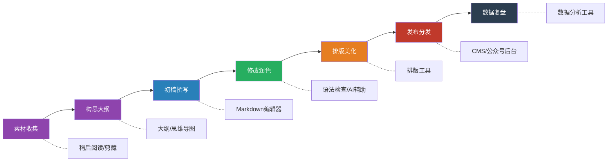
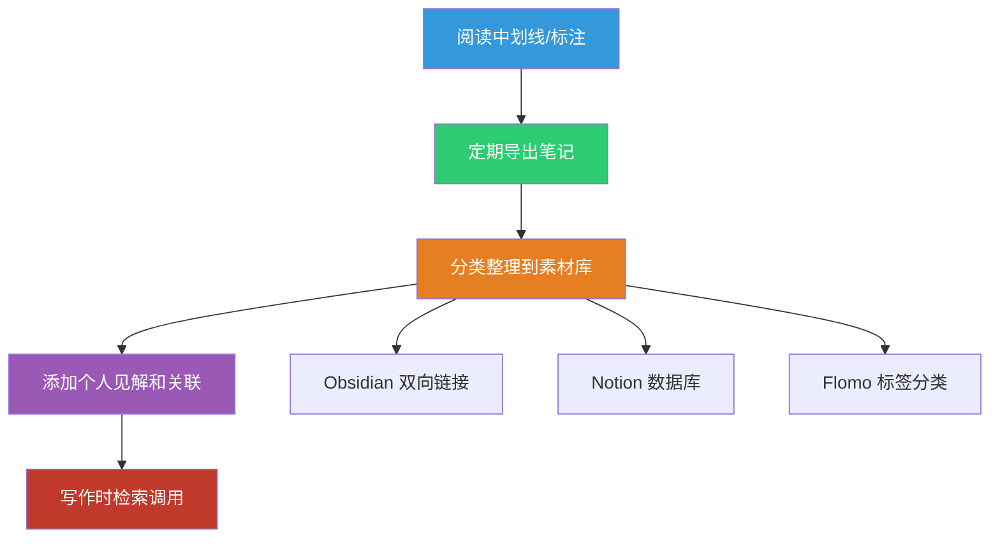
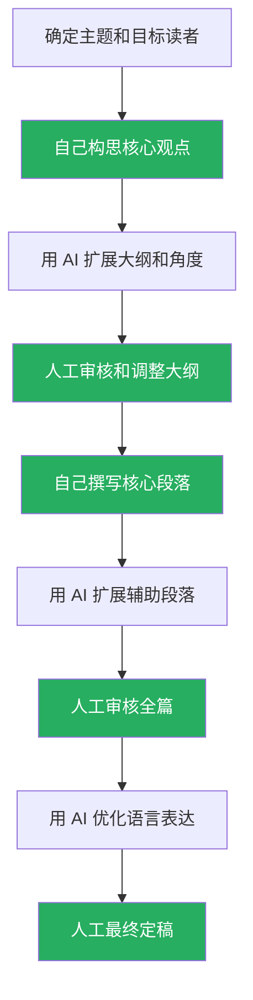

## 二、推荐工具

工欲善其事，必先利其器。写作工具不仅仅是"打字的软件"，它直接影响你的写作流程、思维效率和产出质量。选对工具，可以让写作从"痛苦地挤牙膏"变成"流畅地输出"；选错工具，则可能在格式排版、素材管理、版本控制上浪费大量时间，消耗本该用于思考的精力。

本节按照写作全流程——从素材收集、初稿撰写、语法检查、排版美化到发布分发——系统推荐各类工具，每个工具都包含核心功能解析、适用场景、实操建议和对比分析，帮助你根据自身需求做出最优选择。

### 2.1 写作全流程与工具链概览

在逐一介绍工具之前，先理解写作的完整流程以及每个环节对应的工具需求：



**核心原则：不要追求"一个工具解决所有问题"**。写作工具链应该像流水线一样，每个环节用最擅长该环节的工具，通过标准化的格式（通常是Markdown）串联起来。试图用一个全能工具覆盖所有环节，往往每个环节都做得不够好。

### 2.2 写作与编辑工具

写作编辑器是整个工具链的核心，选择标准包括：编辑体验、格式兼容性、专注度、跨平台支持、文件管理能力。

#### 2.2.1 Notion——全能型知识管理与写作平台

Notion 是一款融合了笔记、数据库、项目管理和协作功能的全能型工具，近年来已成为全球知识工作者的标配。

**核心功能详解：**

- **块编辑器（Block Editor）**：Notion 的编辑器基于"块"的概念，每个段落、标题、列表项、图片都是一个独立的块，可以自由拖拽排序、转换类型。这种设计让内容重组变得极其灵活——你可以先把想法随意堆叠，再像搭积木一样调整结构。
- **数据库与视图**：这是 Notion 区别于普通笔记工具的核心能力。你可以创建一个"写作项目"数据库，用看板视图管理写作进度（待写→写作中→修改中→已完成），用日历视图规划发布计划，用表格视图管理素材库。
- **模板系统**：Notion 的模板功能非常适合写作。你可以创建"文章模板"（包含标题、大纲、正文、参考文献等预设结构），每次新建文章时一键套用，避免从空白页开始的焦虑。
- **多媒体嵌入**：支持嵌入图片、视频、音频、代码块、数学公式、书签、文件等 50+ 种内容类型，特别适合需要图文混排的写作场景。
- **协作功能**：多人实时编辑、评论、@提及、权限管理，适合团队协作写作和编辑审核流程。
- **API 与集成**：通过 Notion API 可以与 Zapier、Make 等自动化工具集成，实现"微信收藏自动同步到 Notion""RSS 订阅自动入库"等自动化工作流。

**最佳使用场景：**

- 作为个人写作的"中枢系统"，统一管理素材、大纲、草稿和发布计划
- 建立可复用的写作模板库（如"公众号文章模板""技术博客模板""周报模板"）
- 团队内容运营：编辑分配任务、作者提交草稿、编辑审核、发布追踪
- 建立个人知识库，将阅读笔记、灵感碎片系统化为写作素材

**实操建议：**

1. 建立一个"写作项目"数据库，包含字段：标题、状态（看板属性）、类型（单选）、目标字数、截止日期、关联素材（关联到素材库）
2. 为不同类型的文章创建模板页面，模板中预设好大纲框架和写作提示
3. 利用 Notion Web Clipper 浏览器插件随时保存网页素材，再通过标签分类整理
4. 使用 Notion 的"Toggle"（折叠块）功能隐藏初稿中的不确定段落，保持视觉整洁

**局限性：**

- 纯 Markdown 导出质量一般，对需要精确 Markdown 输出的场景（如技术博客）不够友好
- 离线功能较弱，在无网络环境下无法正常使用
- 页面加载速度受内容量影响，超长文档（5000+ 字）编辑体验会下降
- 国内访问速度不稳定，偶尔需要科学上网

#### 2.2.2 Typora——极致简洁的 Markdown 编辑器

Typora 是一款"所见即所得"的 Markdown 编辑器，它的核心理念是：**让你忘记你在用 Markdown**。

**核心功能详解：**

- **即时渲染（Live Rendering）**：与传统 Markdown 编辑器的"左边源码、右边预览"不同，Typora 在你输入 Markdown 语法后立即渲染为最终效果。输入 `**粗体**` 后，星号消失，文字直接显示为粗体。这种体验让写作更加沉浸。
- **主题与样式**：内置多款主题（GitHub、Newsprint、Pixyll 等），支持自定义 CSS。你可以为不同的写作场景配置不同的视觉风格。
- **数学公式**：支持 LaTeX 数学公式渲染，适合学术写作和技术文档。行内公式 `$E=mc^2$` 和独立公式块都能完美渲染。
- **代码块**：支持 100+ 种编程语言的语法高亮，带行号显示，适合技术写作。
- **图表支持**：内置支持 Mermaid 流程图、序列图、甘特图，以及 Flowchart.js 流程图。
- **导出能力**：支持导出为 PDF、HTML、Word、EPUB、LaTeX、OpenDocument 等格式，通过 Pandoc 还能导出更多格式。
- **文件树与大纲**：左侧文件树管理文档目录，右侧大纲面板快速跳转到任意章节。

**最佳使用场景：**

- 纯文字创作：博客文章、小说、散文、日记
- 技术写作：文档、README、技术博客
- 学术写作：论文草稿（配合 LaTeX 公式和参考文献）
- 需要快速输出干净 Markdown 文件的任何场景

**高效使用技巧：**

1. 使用 `/` 命令快速插入各种元素（表格、代码块、公式、图片等）
2. 利用 `#` 快速创建标题层级，配合大纲面板实现快速导航
3. 使用 `> [!note]` 语法创建提示框（Callout），增强文档可读性
4. 配合 PicGo + 图床实现图片自动上传，解决本地图片路径问题
5. 使用文件树功能将整个写作项目组织在一个文件夹中，Typora 自动识别为项目

**与其他编辑器的对比：**

| 特性 | Typora | VS Code + Markdown插件 | Obsidian |
|------|--------|----------------------|----------|
| 编辑体验 | 所见即所得，最沉浸 | 源码编辑+侧边预览 | 源码编辑为主 |
| 上手难度 | 极低 | 中等（需配置） | 低 |
| 知识图谱 | 无 | 无 | 核心功能 |
| 插件生态 | 无 | 极其丰富 | 丰富 |
| 价格 | 一次性买断（约$15） | 免费 | 个人免费 |
| 适合场景 | 纯写作 | 编程+写作 | 知识管理+写作 |

#### 2.2.3 Obsidian——基于双向链接的个人知识管理写作系统

Obsidian 的核心理念是：**你的笔记不是一篇篇孤立的文档，而是一个相互连接的知识网络**。对于写作者来说，这意味着你的所有素材、灵感、笔记都可以通过双向链接编织成一张网，写作时能够快速找到关联内容。

**核心功能详解：**

- **双向链接（Bi-directional Linking）**：使用 `[[页面名称]]` 语法创建链接。当你在文章A中链接到笔记B时，笔记B会自动显示"被文章A引用"。这种双向关系让你发现笔记之间意想不到的关联——这正是创意写作和深度分析所需要的。
- **知识图谱（Graph View）**：以可视化网络图的形式展示所有笔记之间的链接关系。你可以一眼看出哪些主题是你的知识网络中的"中心节点"（素材丰富），哪些是"孤岛"（需要补充）。
- **插件生态系统**：社区插件超过 1000 个，覆盖写作辅助（Outliner、Calendar、Kanban）、格式增强（Admonition、Callout）、数据管理（Dataview、Templater）、发布（Publish）等各个方面。
- **本地存储**：所有文件以纯 Markdown 格式存储在本地文件夹中，你可以用任何编辑器打开、用 Git 版本控制、用其他工具处理。数据完全在你手中，不受任何平台控制。
- **模板引擎（Templater）**：通过模板变量和脚本，实现高度自动化的写作模板。例如，创建一个"博客文章"模板，自动插入日期、标题占位符、大纲框架、标签字段。
- **每日笔记（Daily Notes）**：每天自动生成一个以日期命名的笔记页面，适合记录日常灵感、写作碎片和待办事项。

**构建写作素材库的最佳实践：**

📂 我的写作库/
├── 📂 00-Inbox/          # 未经处理的灵感碎片
├── 📂 01-素材/            # 分类整理的写作素材
│   ├── 📂 人物故事/
│   ├── 📂 数据统计/
│   ├── 📂 名言金句/
│   └── 📂 案例分析/
├── 📂 02-笔记/            # 阅读笔记和学习笔记
├── 📂 03-草稿/            # 写作中的文章
├── 📂 04-已发布/          # 完成的文章
├── 📂 05-模板/            # 各类写作模板
└── 📂 06-附件/            # 图片、文件等附件

**使用场景深度分析：**

- **长期知识积累型写作**：如果你需要持续输出某个领域的深度内容（如技术博客、行业分析），Obsidian 的知识图谱可以帮你构建一个不断增长的素材网络。今天写的一篇笔记中的一个链接，可能成为三个月后一篇文章的核心素材。
- **系列文章写作**：用双向链接将系列文章互相串联，读者可以跳转阅读，作者也能快速查看系列的完整脉络。
- **创意写作**：知识图谱中意外的链接往往能激发创意——当你看到"量子物理"和"人际关系"两个节点意外相连时，可能产生一个全新的写作角度。

#### 2.2.4 Scrivener——专业长文写作的工业级工具

Scrivener 是专门为长文写作设计的工具，被小说家、学术研究者、编剧和记者广泛使用。它的核心设计理念是：**把一个复杂的写作项目拆解为可管理的小块，然后像拼图一样组合成完整作品**。

**核心功能详解：**

- **Binder（活页夹）**：左侧面板将整个项目组织为树状结构。一部长篇小说可以按"部分→章节→场景"拆分，一本学术著作可以按"部分→章→节→小节"拆分。每个节点都是一个独立的文本块，可以单独编辑、排序、合并。
- **Corkboard（软木板视图）**：以卡片形式展示文档大纲，每张卡片代表一个章节或场景，可以在卡片上写摘要、拖拽排序。这种视觉化的大纲管理方式比纯文本大纲更直观。
- **Outliner（大纲视图）**：以层级列表形式展示项目结构，支持添加元数据（标签、状态、进度等），适合需要精确控制结构的写作。
- **Research（研究素材区）**：在项目中直接存储研究素材——PDF、图片、网页截图、音频、视频。写作时可以随时查看素材，无需切换窗口。
- **Composition Mode（全屏写作模式）**：进入全屏沉浸式写作，隐藏所有界面元素，只留下你正在写的文字。支持自定义背景颜色和纸张宽度。
- **Snapshot（快照）**：在修改前为文档创建快照，修改后可以随时回退到任意历史版本。这对反复修改的场景（如小说改稿、论文修改）非常实用。
- **Compile（编译输出）**：将项目中的所有片段编译为一个完整文档，支持输出为 Word、PDF、EPUB、Kindle 等格式。可以为不同输出目标（出版社投稿、电子书发布、打印稿）配置不同的编译方案。
- **目标与进度追踪**：为整个项目或单个章节设定字数目标，实时显示进度。进度条的颜色变化（红→黄→绿）提供直观的完成度反馈。

**最佳使用场景：**

- 长篇小说、非虚构书籍的写作
- 学术论文和学位论文
- 剧本和脚本创作
- 任何需要"先拆分、后组合"的大型写作项目

**与普通编辑器的本质区别：**

普通编辑器（如 Word、Typora）是"页面思维"——你面对的是一张白纸，从头写到尾。Scrivener 是"项目思维"——你面对的是一个由无数小片段组成的项目，可以不按顺序写作，可以随时重组结构，可以为每个片段添加注释和元数据。这种差异在短文中不明显，但在 5 万字以上的长文中，Scrivener 的优势是压倒性的。

**学习建议：** Scrivener 的学习曲线确实较陡。建议先花 2-3 小时完成官方教程（内置在软件中），掌握 Binder、Corkboard 和 Compile 三个核心功能即可上手使用。其他高级功能可以在使用过程中逐步探索。

#### 2.2.5 国内在线协作写作工具

国内在线协作工具在中文支持、网络速度和本地化功能上有明显优势，特别适合中文团队协作写作。

**石墨文档：**

石墨文档是国内最早的在线协作文档工具之一，界面简洁，上手门槛低。

- **优势**：实时协作体验流畅，支持文档、表格、幻灯片、思维导图等多种类型；评论和批注功能完善，支持@提醒；版本历史可追溯到每次编辑；支持微信小程序，在手机上快速查看和编辑。
- **适用场景**：中小团队的日常文档协作、会议纪要、方案评审。
- **不足**：高级排版功能较弱，不适合需要复杂格式的长文档；免费版有协作人数限制。

**飞书文档：**

飞书文档是字节跳动旗下的协作工具，与飞书即时通讯、日历、会议深度集成。

- **优势**：与飞书生态无缝衔接——在群聊中直接创建文档、在日历会议中关联议程文档、在文档中嵌入任务和提醒；支持多维表格（类似 Airtable 的数据库功能）；知识库功能适合团队沉淀文档；AI 助手可以辅助总结、续写、翻译。
- **适用场景**：中大型团队的文档协作、知识管理、项目管理。
- **不足**：生态较封闭，与外部工具集成不如 Notion 灵活；个人用户使用门槛较高。

**腾讯文档：**

腾讯文档与微信、QQ 生态深度绑定。

- **优势**：微信/QQ 一键分享，接收者无需注册即可查看和编辑；支持微信小程序快速创建；收集表功能适合问卷和信息收集。
- **适用场景**：轻量级文档协作、信息收集、简单表格处理。
- **不足**：功能深度不如石墨和飞书，不适合复杂的写作项目管理。

**对比总结：**

| 特性 | 石墨文档 | 飞书文档 | 腾讯文档 |
|------|---------|---------|---------|
| 协作体验 | ★★★★☆ | ★★★★★ | ★★★☆☆ |
| 生态集成 | 中等 | 飞书全家桶 | 微信/QQ |
| 知识库 | 基础 | 强大 | 无 |
| AI 功能 | 有 | 强大 | 基础 |
| 移动端体验 | 好 | 好 | 好（小程序） |
| 最佳场景 | 中小团队 | 中大团队 | 轻量协作 |

### 2.3 语法和风格检查工具

初稿完成后的修改润色环节，语法和风格检查工具可以帮你发现肉眼难以察觉的问题。

#### 2.3.1 Grammarly——英语写作的智能语法教练

Grammarly 是全球使用最广泛的英语写作辅助工具，拥有超过 3000 万日活用户。

**核心功能详解：**

- **语法与拼写检查**：覆盖主谓一致、时态错误、冠词使用、介词搭配等 200+ 种语法规则。不是简单的规则匹配，而是基于上下文语义分析——例如，它能区分 "affect" 和 "effect" 在具体语境中哪个是正确的。
- **清晰度与简洁性建议**：标记冗余表达、被动语态过度使用、复杂长句等影响可读性的问题，并给出具体的修改建议。例如，将 "due to the fact that" 建议改为 "because"。
- **语气检测**：通过 AI 分析文本的语气（正式/非正式、自信/犹豫、友好/严肃），帮助你调整到目标读者期望的语气。
- **抄袭检查（Premium）**：与数十亿网页和学术数据库对比，检测文本中可能的抄袭内容，并标注重叠部分。
- **多平台支持**：浏览器插件（Chrome、Firefox、Safari、Edge）、桌面应用、移动键盘、Microsoft Office 插件、Google Docs 插件，几乎覆盖所有写作场景。

**使用建议：**

1. 不要盲目接受所有建议——Grammarly 的建议基于统计模型，偶尔会误判。特别是一些有意为之的修辞手法（如省略句、非标准语法用于对话）可能被标记为错误。
2. 将 Grammarly 的目标设置与写作场景匹配：学术论文选择"Academic"语调，商务邮件选择"Professional"，社交媒体选择" Casual"。
3. 免费版已能满足基本需求，Premium 版（约$12/月）适合高频英语写作者，增加了清晰度建议、语气调整和抄袭检查。

**替代工具：** ProWritingAid（更详细的风格分析报告，适合长文修改）、LanguageTool（开源免费，支持 25+ 种语言）。

#### 2.3.2 写作猫——中文写作的智能助手

写作猫（xiezuocat.com）是专为中文写作设计的 AI 辅助工具，弥补了 Grammarly 在中文支持上的不足。

**核心功能详解：**

- **中文语法检查**：检测常见的中文语法错误，包括"的地得"混用、主语缺失、语序不当、搭配不当等。中文语法规则比英语更模糊，写作猫通过大量语料训练来识别这些问题。
- **错别字检测**：识别同音字混淆（如"以至/以致""截止/截至"）、形近字错误、多字漏字等问题。
- **风格优化建议**：检测口语化表达、网络用语、不规范用语，建议替换为更书面化的表达。例如，将"搞"建议替换为"进行/开展/处理"（视语境而定）。
- **文章评分**：从词汇丰富度、句式多样性、逻辑连贯性等维度对文章进行综合评分，帮助你快速了解文章的整体质量水平。
- **AI 续写与改写**：基于上下文生成续写内容，或对选中段落进行改写（扩写、缩写、换风格）。

**使用建议：**

1. 写作猫的语法检查准确率约 85-90%，不能完全替代人工校对，特别是涉及专业术语和特定领域表达时。
2. 建议的使用流程：先完成全文初稿 → 粘贴到写作猫检查 → 逐条审视建议 → 只采纳确实改进了表达的建议。
3. 免费版有每日检查字数限制（约 5000 字），对于长文可以分段检查或考虑付费版。

**其他中文写作辅助工具：**

- **秘塔写作猫**：与写作猫功能类似，增加了 AI 写作助手功能。
- **百度写作助手**：集成在百度输入法中，提供实时的输入纠错和优化建议。
- **腾讯 AI Lab 写作助手**：面向企业用户的中文写作辅助 API。

#### 2.3.3 Hemingway Editor——让文章变得简洁有力

Hemingway Editor 以海明威简洁有力的文风命名，它的核心理念是：**好的写作应该让读者轻松理解，而不是展示作者的词汇量**。

**核心功能详解：**

- **可读性评分**：基于 Flesch-Kincaid 可读性公式，给出文章的阅读难度等级（如"Grade 6"表示六年级学生能读懂）。评分越低，文章越容易理解。大多数面向大众的文章应该在 Grade 6-8 之间。
- **句子复杂度标记**：用颜色标记文章中的问题——黄色表示句子较难阅读，红色表示句子非常难阅读。一目了然地看到哪些句子需要简化。
- **被动语态检测**：用蓝色下划线标记被动语态。被动语态不是错误，但过度使用会让文章显得生硬和疏远。
- **副词过多提示**：用绿色下划线标记副词。海明威式的写作风格强调用精确的动词代替"副词+弱动词"的组合（如用"sprint"代替"run quickly"）。
- **格式化工具**：支持基本的文本格式化（标题、粗体、斜体、列表、引用），可以直接在 Hemingway 中完成最终编辑。

**使用场景与技巧：**

1. 在文章初稿完成后，将全文粘贴到 Hemingway Editor 进行"可读性体检"。
2. 目标：将可读性评分降到 Grade 8 以下，消除所有红色标记的句子，减少黄色标记。
3. 注意：Hemingway 的建议偏向"简化一切"，但某些场景（如学术论文、技术文档）需要精确的专业表达，不必追求最低的可读性评分。
4. Hemingway 的桌面版（约$20）支持离线使用和直接导出到 WordPress/Medium。

### 2.4 排版与发布工具

内容写好后，排版质量直接影响读者的阅读体验和完读率。特别是在中文互联网环境中，公众号文章的排版质量往往决定了文章的打开率和分享率。

#### 2.4.1 Markdown Nice——Markdown 到公众号的桥梁

Markdown Nice（mdnice.com）解决了一个核心痛点：**微信公众号编辑器不支持 Markdown，但写作者想用 Markdown 写作**。

**核心功能详解：**

- **实时预览**：左侧输入 Markdown，右侧实时渲染为公众号兼容的富文本格式。
- **主题库**：提供数十款预设主题（如"科技蓝""简约灰""暖阳橙"等），一键切换文章整体风格。
- **自定义 CSS**：支持通过自定义 CSS 精细控制排版样式（字体、间距、颜色、引用块样式等）。
- **一键复制到公众号**：渲染完成后，点击"复制"按钮，直接粘贴到公众号编辑器中，格式完整保留。
- **代码高亮**：支持多种编程语言的代码块渲染，适合技术类公众号。
- **图床集成**：支持配置 SM.MS、GitHub 等图床，自动上传 Markdown 中的本地图片。

**使用工作流：**

1. 在 Typora/Obsidian 中用 Markdown 写完文章
2. 复制 Markdown 源码粘贴到 Markdown Nice
3. 选择或自定义主题样式
4. 检查渲染效果，调整细节
5. 点击"复制"，粘贴到公众号编辑器
6. 在公众号编辑器中添加封面图、摘要、原文链接等元信息
7. 发布

#### 2.4.2 135编辑器 / 秀米——可视化公众号排版工具

如果你不习惯 Markdown 工作流，135编辑器和秀米提供了更直观的可视化排版体验。

**135编辑器：**

- **海量模板**：提供数千款标题、正文、分隔线、图文卡片等排版组件，拖拽使用。
- **一键排版**：选择整篇文章的排版方案，一键应用到全文。
- **SVG 互动组件**：支持制作滑动对比图、点击展开、自动轮播等互动效果，增强文章互动性。
- **团队协作**：支持团队成员共享模板和素材库，统一品牌风格。

**秀米：**

- **设计感更强**：秀米的模板设计感通常优于 135编辑器，更适合追求视觉美感的账号。
- **长图文制作**：支持制作信息长图、竖版海报等适合社交媒体传播的视觉内容。
- **H5 页面制作**：除了公众号排版，还可以制作 H5 互动页面。

**选择建议：** 135编辑器功能更全面，模板更多，适合日常高频排版；秀米设计感更好，适合对视觉要求更高的品牌账号。两者都有免费版，建议都试用后再决定。

#### 2.4.3 Canva——从文字到视觉的全能设计工具

好的文章需要好的配图。Canva（canva.com）让不会设计的人也能制作出专业的视觉内容。

**写作相关的使用场景：**

- **文章封面图**：为公众号文章、博客文章制作吸引眼球的封面图。Canva 提供了针对各种平台尺寸的模板（公众号封面 900×383、小红书封面 1080×1440 等）。
- **文章内配图**：制作图表、对比图、流程图、信息图等辅助说明文字内容的视觉元素。
- **社交媒体宣传图**：文章发布后，制作适合在各社交平台分享的宣传图。
- **品牌视觉一致性**：上传品牌色彩和 Logo，确保所有配图风格统一。

**高效使用技巧：**

1. 建立一个"品牌套件"（Brand Kit），统一存储品牌色彩、字体和 Logo，所有设计自动应用。
2. 利用"批量创建"功能，一次制作多张风格一致但内容不同的图片（如系列文章的封面）。
3. 使用 Canva 的 AI 功能（Magic Design）根据文字描述自动生成设计方案。
4. 免费版已能满足大多数写作配图需求，Pro 版（约$13/月）解锁更多模板和素材。

#### 2.4.4 Hugo / Hexo——静态博客生成器

对于技术写作者，静态博客生成器是从 Markdown 到网站发布的终极工具。

**Hugo：**

- 用 Go 语言编写，编译速度极快（数千页网站在 1 秒内构建完成）
- 内置模板引擎、多语言支持、分类系统
- 丰富的主题生态（500+ 免费主题）
- 部署简单：GitHub Pages、Netlify、Vercel 一键部署

**Hexo：**

- 用 Node.js 编写，中文社区更活跃
- 插件生态丰富，中文文档完善
- 适合国内技术博客场景

**使用工作流：**

Markdown 文件 → Git 提交 → 自动构建 → 自动部署 → 网站更新

这种"写完即发布"的工作流，让技术写作者可以专注于内容本身，无需操心服务器、数据库和 CMS 系统。

### 2.5 素材收集与管理工具

写作的瓶颈往往不是"怎么写"，而是"写什么"。素材收集和管理是持续输出的基础。

#### 2.5.1 Pocket / Instapaper——稍后阅读工具

**Pocket（原 Read It Later）：**

- **一键保存**：浏览器插件或手机分享菜单，一键将网页内容保存到 Pocket。
- **离线阅读**：保存的内容可以离线阅读，适合通勤、出差等场景。
- **标签管理**：用标签对保存的内容分类（如"写作素材""行业分析""灵感"）。
- **高亮与笔记**：在阅读过程中高亮重要段落，添加笔记。
- **推荐引擎**：基于你的阅读历史推荐相关内容，帮你发现潜在的写作素材。

**Instapaper：**

- 功能与 Pocket 类似，但更注重纯文本阅读体验
- 排版更简洁，去除所有广告和干扰元素
- 支持文件夹管理（比 Pocket 的标签更适合层级分类）

**素材管理最佳实践：**

1. 每天固定时间（如早上 8 点）浏览 Pocket 中的内容，做 15 分钟快速阅读
2. 对有写作价值的内容打上"素材"标签，并添加一句话摘要
3. 每周整理一次"素材"标签中的内容，将有价值的素材转移到 Obsidian/Notion 的素材库中
4. 写作时先搜索素材库中是否有相关内容，避免从零开始

#### 2.5.2 Flomo（浮墨笔记）——极简灵感捕捉工具

Flomo 的设计理念是：**灵感稍纵即逝，记录的摩擦力必须降到最低**。

**核心功能详解：**

- **微信输入**：关注 Flomo 的微信服务号后，直接在微信中发送消息即可创建笔记。这个功能的威力在于：你在任何微信聊天、朋友圈、公众号文章中看到有价值的内容，都可以立即转发到 Flomo，零切换成本。
- **极简编辑器**：没有复杂的格式选项，只有纯文本和标签。这种"约束"反而让你专注于记录想法本身，而不是纠结于排版。
- **标签系统**：用 `#标签/子标签` 格式管理笔记层级（如 `#写作/开头技巧`、`#素材/商业案例`）。
- **每日回顾**：每天推送你过去的笔记，帮助你重新审视旧想法，激发新的写作灵感。
- **MEMO 卡片**：将笔记以卡片形式展示，支持随机回顾，适合创意激发。

**与其他笔记工具的区别：**

Flomo 不是用来写长文的，也不是用来做知识管理的。它的定位是"思维的暂存区"——一个快速捕捉灵感碎片的地方。最佳工作流是：灵感 → Flomo 快速记录 → 定期整理到 Obsidian/Notion → 写作时从素材库调用。

#### 2.5.3 阅读工具中的素材收集

电子阅读是写作素材的重要来源，善用阅读工具的标注和笔记功能可以系统化地积累素材。

**微信读书：**

- **划线和笔记**：在阅读过程中随时划线标记重要段落，添加笔记。
- **导出笔记**：支持将全书笔记导出为文本，方便整理。
- **热门划线**：查看其他读者的热门划线，发现你可能忽略的精彩段落。
- **书评和想法**：写下读书感悟，这些感悟本身就是写作素材。

**Kindle：**

- **X-Ray 功能**：自动识别书中的人物、地点、术语，快速查看在全书中的出现和引用。
- **标注同步**：所有标注自动同步到 Amazon 账户，可通过 read.amazon.com/notebooks 访问。
- **Clippings 文件**：Kindle 设备中的 `My Clippings.txt` 文件包含所有标注，可以导入到任何笔记工具中。

**素材整理工作流：**



### 2.6 写作辅助 AI 工具

2024 年以来，AI 写作工具经历了爆发式发展。正确使用 AI 工具可以让写作效率提升 3-5 倍，但错误使用则会让你丧失独立思考能力和写作风格。

#### 2.6.1 通用大语言模型

**ChatGPT（OpenAI）：**

- **写作大纲生成**：给定主题和目标读者，ChatGPT 可以快速生成结构化的文章大纲。提示词示例："请为一篇面向初级程序员的技术博客生成大纲，主题是'Git 分支管理最佳实践'，要求包含至少 5 个主要章节，每个章节有 2-3 个子标题。"
- **素材扩展**：当你只有一个模糊的想法时，可以让 ChatGPT 帮你扩展出多个角度和论点。提示词示例："我想写一篇关于'远程办公效率'的文章，请从心理学、管理学、工具选择、个人习惯四个角度给我提供论点和论据。"
- **语言优化**：将粗糙的初稿交给 ChatGPT 进行语言润色。提示词示例："请优化以下段落的语言表达，保持原意但提升可读性和文采：[粘贴段落]"
- **多语言翻译与本地化**：不仅翻译文字，还能根据目标语言的文化背景调整表达方式。

**Claude（Anthropic）：**

- 在长文分析和深度思考上表现更优
- 适合对已有文章进行深度批注和改进建议
- 提示词示例："请以资深编辑的视角，对以下文章进行全面评审，从结构、逻辑、语言、可读性四个维度给出具体改进建议：[粘贴文章]"

**文心一言 / 通义千问 / Kimi / 豆包：**

- 中文理解和生成能力更强
- 更熟悉中国互联网语境和文化背景
- 适合中文自媒体写作、商务文案等场景

#### 2.6.2 专业 AI 写作工具

**Jasper（原 Jarvis）：**

- 专为营销内容设计的 AI 写作平台
- 内置 50+ 内容模板（广告文案、产品描述、邮件、博客等）
- 支持品牌语调设置，确保 AI 生成的内容与品牌风格一致
- 适合内容营销团队批量生产内容

**Copy.ai：**

- 专注于短文案生成（标题、广告语、社交媒体帖子）
- 提供多种文案框架（AIDA、PAS、BAB 等经典营销框架）
- 免费版每日 2000 字额度，适合个人使用

**Notion AI：**

- 直接在 Notion 中使用 AI 辅助写作
- 支持总结、续写、改写、翻译、头脑风暴等操作
- 最大优势是与 Notion 的知识库深度结合，AI 可以基于你的笔记和文档生成内容

#### 2.6.3 AI 写作的最佳实践与红线

**正确的使用方式：**

1. **AI 是助手，不是作者**：用 AI 生成大纲、扩展思路、优化语言，但核心观点和逻辑必须来自你自己。
2. **永远人工审核**：AI 生成的内容可能包含事实错误、逻辑漏洞或不当表达，必须逐句审核。
3. **保持个人风格**：不要直接使用 AI 的输出作为终稿。AI 的语言风格是"平均值"，缺乏个性。在 AI 初稿的基础上注入你的个人风格和独特观点。
4. **分步骤使用**：不要让 AI 一次性生成整篇文章。分步骤使用——先生成大纲，确认后展开每个章节，逐段优化——这样你对内容的控制力更强。

**绝对不能做的事：**

1. **不要让 AI 替你思考**：写作的核心价值在于思考过程。如果你每次都让 AI 生成观点和论据，你的思考能力会退化。
2. **不要不加修改直接发布 AI 内容**：这不仅是对读者的不尊重，也会让你逐渐丧失写作能力。
3. **不要在需要原创性的场景使用 AI**：学术论文、个人品牌文章、创意写作等场景，AI 生成的内容会损害你的信誉。
4. **不要忽视 AI 的"幻觉"**：AI 会自信地编造不存在的数据、引用和案例。所有 AI 给出的事实性信息都必须手动验证。

#### 2.6.4 AI 辅助写作工作流

一个高效且安全的 AI 辅助写作工作流应该是这样的：



绿色节点是必须由人完成的环节，这些环节决定了文章的质量和原创性。AI 只在灰色节点中辅助，负责扩展、优化和提效。

### 2.7 版本控制与写作备份

数据安全是写作中最容易被忽视但最重要的环节。丢失一篇文章的痛苦远大于写一篇文章的辛苦。

#### 2.7.1 Git——写作者的时光机

Git 不仅是程序员的工具，对于写作者同样有价值。

**写作者使用 Git 的好处：**

- **版本历史**：每次提交（commit）都是一个完整的快照，可以随时回退到任意历史版本。
- **分支写作**：对文章进行大幅修改时，创建一个分支尝试，不影响原始版本。满意后再合并。
- **多设备同步**：通过 GitHub/GitLab 同步，在任何设备上都可以继续写作。
- **协作写作**：多人可以通过 Pull Request 机制协作修改同一篇文章。

**简化版 Git 工作流（适合非程序员）：**

```bash
# 初始化（只需做一次）
cd ~/写作项目
git init
git add .
git commit -m "初始化项目"

# 日常写作工作流
# 1. 开始写作前拉取最新版本
git pull

# 2. 写作完成后保存
git add .
git commit -m "完成第三章初稿"

# 3. 推送到云端备份
git push
```

#### 2.7.2 云同步方案

对于不想使用 Git 的写作者，云同步是最简单的备份方案。

- **坚果云**：国内最稳定的云同步服务，支持 WebDAV，与 Obsidian 等工具深度兼容。免费版每月 1GB 上传/下载流量。
- **iCloud**：苹果生态用户首选，与 macOS/iOS 原生集成。但对非苹果设备支持较差。
- **OneDrive**：微软生态用户首选，与 Office 深度集成。国内访问速度一般。
- **百度网盘**：存储空间大，但同步功能较弱，更适合手动备份。

**备份原则（3-2-1 规则）：**

- **3** 份数据副本
- **2** 种不同的存储介质（如本地硬盘 + 云端）
- **1** 份异地备份（如云端或另一台设备）

### 2.8 工具组合推荐

与其单独选择每个工具，不如考虑完整的工具链组合。以下是针对不同场景的推荐组合：

#### 2.8.1 个人博客写作者

| 环节 | 推荐工具 | 替代方案 |
|------|---------|---------|
| 素材收集 | Pocket + Flomo | Raindrop.io |
| 笔记管理 | Obsidian | Logseq |
| 写作编辑 | Typora | VS Code + Markdown |
| 图片处理 | Canva | Figma |
| 发布部署 | Hugo + GitHub Pages | Hexo + Vercel |
| 数据分析 | Google Analytics | 百度统计 |

#### 2.8.2 公众号运营者

| 环节 | 推荐工具 | 替代方案 |
|------|---------|---------|
| 素材收集 | 微信读书 + Flomo | Pocket |
| 笔记管理 | Notion | 飞书文档 |
| 写作编辑 | Obsidian / Typora | Notion |
| AI 辅助 | ChatGPT / Kimi | Claude |
| 排版美化 | Markdown Nice | 135编辑器 |
| 配图设计 | Canva | 稿定设计 |
| 数据分析 | 公众号后台 | 新榜 |

#### 2.8.3 技术文档写作者

| 环节 | 推荐工具 | 替代方案 |
|------|---------|---------|
| 编辑器 | VS Code + Markdown插件 | Obsidian |
| 语法检查 | LanguageTool | Grammarly |
| API 文档 | Swagger/OpenAPI | Redoc |
| 文档站点 | Docusaurus / MkDocs | VuePress |
| 版本控制 | Git + GitHub | GitLab |
| 协作审核 | GitHub PR | 飞书文档 |

#### 2.8.4 长篇内容创作者（书籍/课程）

| 环节 | 推荐工具 | 替代方案 |
|------|---------|---------|
| 素材收集 | Obsidian | Notion |
| 项目管理 | Scrivener | Notion 数据库 |
| 写作编辑 | Scrivener | Obsidian |
| 语法检查 | Grammarly + Hemingway | ProWritingAid |
| 排版输出 | Scrivener Compile | Pandoc |
| 封面设计 | Canva | Adobe InDesign |

### 2.9 工具选择的核心原则

最后，总结选择写作工具时应遵循的核心原则：

**原则一：最小工具集原则**

不要试图收集所有工具。根据你的写作场景，选择每个环节最核心的一个工具，形成一个最小可用的工具链。工具越多，切换成本越高，学习负担越重。

**原则二：数据可迁移原则**

优先选择以纯文本（Markdown/纯文本）为存储格式的工具。避免使用封闭格式的工具，确保你的内容可以随时迁移到其他平台。你在某个工具中积累的数百篇文章，不应该因为该工具关闭或涨价而无法访问。

**原则三：降低摩擦力原则**

选择让你"想写就写"的工具，而不是需要 5 分钟准备才能开始写的工具。灵感稍纵即逝，如果记录一个想法需要打开应用、创建新文档、选择模板、设置分类……等你准备好了，灵感已经消失了。

**原则四：阶段性迭代原则**

不要一开始就追求完美的工具链。初学者只需要一个编辑器（如 Typora）和一个备份方案（如坚果云）。随着写作频率和复杂度的提升，再逐步添加素材管理、语法检查、AI 辅助等工具。

**原则五：习惯大于工具原则**

再好的工具，如果不能融入你的日常习惯，就是摆设。选择你愿意每天使用的工具，比选择功能最强大的工具更重要。写作工具的价值不在于它有多少功能，而在于它能让你坚持每天写作。
