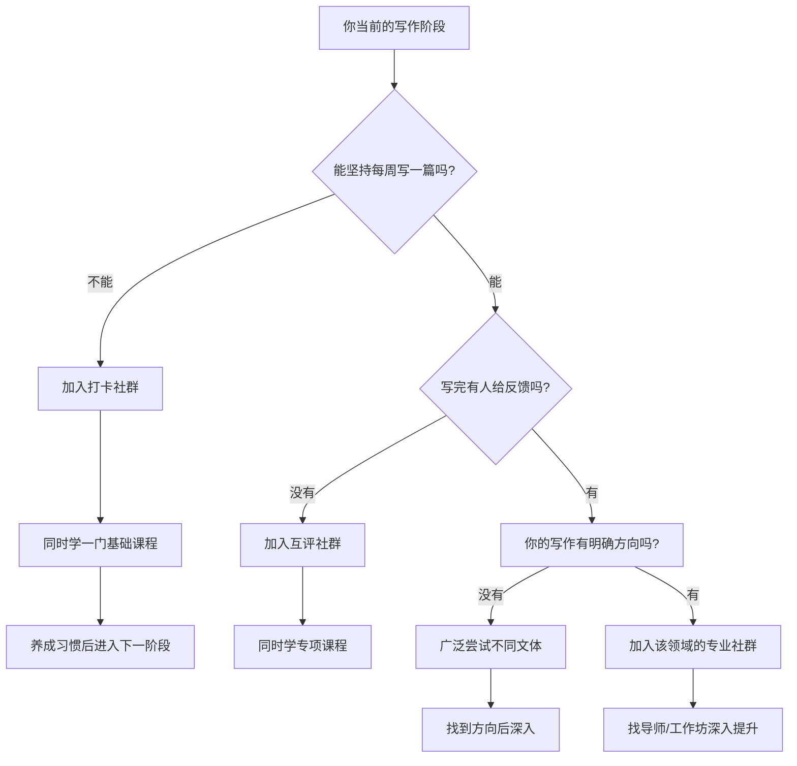

## 三、推荐课程与社群

书籍提供系统知识，但写作能力的真正提升离不开两样东西：**结构化的课程指导**和**同伴驱动的反馈回路**。课程帮你建立正确的认知框架，社群帮你度过"写了没人看、看了没人说"的孤独期。本节从线上课程、线下工作坊、写作社群三个维度，帮你找到最适合自己的学习和成长环境。

### 3.1 线上课程：系统学习的快车道

线上课程的核心价值不在于"学完就变强"，而在于**用最短时间建立正确的写作心智模型**。一本好书需要你花10小时消化，一门好课程可能用3小时帮你抓住核心框架——然后带着框架去读书，效率完全不同。

#### 3.1.1 英语写作课程（免费/低成本）

| 平台 | 课程 | 开设机构 | 时长 | 费用 | 核心收获 |
|------|------|---------|------|------|---------|
| Coursera | English Composition | 华盛顿大学 | 4周×5模块 | 免费旁听 | 学术写作的结构化方法，论点-论据-论证的完整链条 |
| edX | English for Media Literacy | 杜兰大学 | 4周 | 免费旁听 | 媒体语境下的批判性阅读与写作 |
| Coursera | Good with Words: Writing and Editing | 密歇根大学 | 4模块×4周 | 免费旁听 | 从选词、造句到段落构建的完整写作技能树 |
| Coursera | Writing in the Sciences | 斯坦福大学 | 8周 | 免费旁听 | 科技写作的清晰表达，学术论文的修改技巧 |
| Skillshare | Various creative writing courses | 多位作家 | 单课1-2h | 免费试用/会员制 | 短平快的创意写作技巧，适合碎片学习 |

**为什么推荐这些英文课程？** 即使你的目标是中文写作，英文写作课程在**逻辑训练**上的价值远超多数中文课程。英文写作教育有数百年历史，其对"清晰思维→清晰表达"的方法论沉淀极为深厚。学完后把这些方法迁移到中文写作中，你会发现自己的文章质量有质的提升。

**使用建议：**
- 不需要全部学完。选择1-2门与自己当前阶段最匹配的课程集中攻克
- 重点不是"刷完"，而是**每学一个概念就立刻在自己的写作中练习**
- Coursera的旁听模式完全免费，只有需要证书时才付费
- 建议开启英文字幕而非中文字幕，同时锻炼阅读能力

#### 3.1.2 中文写作课程

**得到App：系统性写作知识库**

得到App的写作相关内容是中文领域最成体系的付费内容之一。以下是值得重点关注的资源：

- **《华杉讲透写作》**：华杉是中国顶尖的品牌营销人，他从商业写作的角度切入，讲的不是"怎么写得美"，而是"怎么写得有效"。核心理念是**用消费者听得懂的语言说清楚价值**。适合做品牌、营销、商业文案的人
- **《熊逸讲透<资治通鉴>》**：虽然不是写作课，但熊逸的叙事拆解能力是顶级的。学习一个历史事件如何被不同史学家写成不同版本，是理解"叙事视角"最好的实战教材
- **《刘润·5分钟商学院》中的沟通写作模块**：商业场景下的写作方法论，篇幅短但每篇都有具体场景和可复用的模板

**得到的使用策略：**
- 先听"每天听本书"里的写作相关书目（如《风格的要素》《写作法宝》的解读），快速建立全景认知
- 再选1-2门专栏深入学习
- 笔记功能要善用——边听边记录触发自己灵感的点，而非照搬原文

**知乎知学堂：平台导向型写作**

知乎知学堂的写作课程最大特点是**与知乎平台深度绑定**。如果你的写作目标是在知乎建立影响力，这类课程有直接的实用价值：

- **知乎写作变现训练营**：教你如何写知乎回答、如何选题、如何追热点、如何用知乎的推荐算法获得更多曝光
- **盐选专栏写作课**：如果你想在知乎上写付费专栏，这门课会教你专栏的选题策略、章节结构和定价方法

**知乎课程的局限性：** 知乎课程偏重"流量思维"——教你如何获得更多的阅读量和互动。但写作的本质价值是**思想的深度和表达的精确**，过度关注流量容易让你写出"讨好算法"但内容空洞的文章。建议把知乎课程当作"渠道运营课"而非"写作课"来学。

**混沌大学：内容创业视角**

混沌大学（现已更名混沌学园）的写作相关课程侧重**内容创业和自媒体商业化**：

- **内容创业课程**：从商业模式角度理解内容创作，教你如何把写作能力转化为可持续的收入
- **增长思维课程**：理解内容的传播机制，如何让好内容被更多人看到

**适合人群：** 已经有一定写作基础，想要通过写作创业或做自媒体的人。不建议写作新手从这里起步——先学会写，再学会赚钱。

#### 3.1.3 国际知名写作课程平台

**MasterClass：大师级写作课**

MasterClass平台上有多位世界级作家开设的写作课程，虽然价格较高（年费约180美元），但质量极高：

- **尼尔·盖曼（Neil Gaiman）的创意写作课**：25课时，从故事构思到出版全流程。盖曼的讲课风格温暖而富有洞察力，他会分享自己从未公开过的创作手稿和修改过程
- **玛格丽特·阿特伍德（Margaret Atwood）的创意写作课**：23课时，侧重叙事结构和文学技巧。阿特伍德是《使女的故事》的作者，她对叙事张力的控制堪称教科书级别
- **亚伦·索金（Aaron Sorkin）的编剧课**：35课时，《社交网络》《白宫风云》的编剧教你如何写对白和场景。对白写作的技巧可以直接迁移到任何类型的写作中
- **马尔科姆·格拉德威尔（Malcolm Gladwell）的写作课**：24课时，《引爆点》作者教你如何把复杂的思想变成引人入胜的故事

**MasterClass的价值不在于"学技术"，而在于"学审美"。** 这些大师会教你他们如何看待世界、如何捕捉灵感、如何在平凡中发现不平凡。这些认知层面的提升，是技术性课程无法给予的。

**Udemy：性价比之选**

Udemy上有大量写作课程，价格通常在50-100元（促销时甚至更低）。值得推荐的包括：

- **Complete Creative Writing Course**：从零开始的创意写作完整课程，涵盖短篇小说、长篇小说、诗歌、剧本
- **Writing with Flair: How to Become an Exceptional Writer**：专注于提升文章的可读性和吸引力，实用性强
- **Secret Sauce of Great Writing**：华盛顿邮报前编辑开设，教你"好文章到底好在哪里"

**Udemy课程的筛选方法：**
- 评分低于4.5的不要买
- 学生数低于1000的谨慎选择
- 先看课程大纲，确认覆盖你需要的知识点
- 善用30天无条件退款政策

#### 3.1.4 专项写作课程

**学术写作**

- **Coursera: Academic Writing**（多所大学开设）：学术论文的结构、引用规范、文献综述写法
- **Purdue OWL（在线写作实验室）**：不是课程但比课程更有用——普渡大学的免费写作资源库，涵盖APA/MLA/Chicago等所有引用格式，是学术写作的标准参考工具

**技术写作**

- **Google Technical Writing Courses**：Google免费提供的技术写作课程，分为"基础"和"进阶"两部分。虽然是英文的，但其方法论对中文技术文档同样适用。课程内容包括：文档结构、信息架构、步骤式写作、术语一致性
- **Coursera: Technical Writing**（莫斯科物理技术学院）：系统的技术写作方法论

**文案写作**

- **Copyhackers**：英文世界最权威的文案写作学习资源，提供了大量免费的文章和付费的课程。核心理念是"用数据驱动的测试方法优化文案"，而非凭直觉写作
- **知乎Live/得到中关于文案写作的内容**：中文领域的文案写作资源较分散，建议通过搜索具体主题（如"标题写作""转化文案""品牌故事"）来找到对应内容

### 3.2 写作社群：从"一个人写"到"一群人写"

写作是孤独的，但成长不必是。社群的核心价值在于三个方面：**反馈**（别人告诉你写得怎么样）、**激励**（看到别人在写，你也不好意思偷懒）、**连接**（认识志同道合的人，打开意想不到的机会）。

#### 3.2.1 打卡驱动型社群

**007写作社群**

007是中国最知名的写作打卡社群之一，核心规则很简单：**7天写一篇，不写就出局**。

运作机制：
- 加入时缴纳保证金（通常几百元），如果7天内没有交作业，保证金会被扣除分给其他成员
- 每篇文章需要至少3位战友互评
- 社群定期组织主题写作活动和线上分享
- 以班级制运作，每班77人，形成小圈子

**适合人群：** 写作新手、需要外力驱动才能坚持的人。007的最大价值不是教你写作技巧，而是帮你**建立写作习惯**。当你连续写了3个月、6个月、1年，写作就会从"需要意志力的事"变成"不写就难受的事"。

**注意事项：**
- 007的商业模式包含推荐奖励（类似分销），加入前要清楚自己是为了写作还是为了推广
- 互评质量参差不齐，不要期望每条反馈都有价值
- 如果你已经能自律地坚持写作，007的驱动力价值会递减

**弘丹写作成长社**

弘丹是中文写作教育领域的知名IP，她的社群特点：
- 每日写作打卡，主题相对自由
- 定期举办写作训练营（通常21天或30天一个周期）
- 提供写作模板和修改建议
- 社群氛围温和，适合写作新手

**趁早写作100天**

趁早品牌的写作社群，强调"100天写作计划"：
- 每天写300-500字，门槛极低
- 有配套的写作提示（writing prompts）帮你克服"不知道写什么"的问题
- 适合完全零基础、想要开始写作习惯的人

#### 3.2.2 反馈驱动型社群

**简书写作社群**

简书曾经是中国最大的写作社区之一，虽然近年热度下降，但其"专题投稿+编辑推荐"的机制仍然有价值：
- 文章发布后可以投稿到相关专题，获得编辑审核和推荐
- 评论区的互动相对深入，能获得有建设性的反馈
- 适合散文、随笔、故事类写作

**豆瓣写作小组**

豆瓣上有多个活跃的写作小组：
- **"写作者的房间"**：高质量的写作讨论和互评
- **"创意写作"**：侧重创意写作技法的交流
- **"每天写点什么"**：低门槛的写作打卡

**豆瓣小组的特点是"去功利化"**——这里的成员写作不是为了变现，而是纯粹出于热爱。如果你厌倦了"写作变现""流量为王"的论调，豆瓣小组是一片净土。

**Reddit写作社区（英文）**

- **r/Writing**：最大的英文写作讨论社区，涵盖各种写作问题的讨论
- **r/WritingPrompts**：写作提示社区，每天发布大量创意写作提示，你可以根据提示创作短篇故事，获得社区反馈
- **r/DestructiveReaders**：高质量的互评社区，规则是"你要批评别人的文章，必须先贡献自己的文章被批评"。反馈极其直接和深入，适合心理承受能力强的写作者

#### 3.2.3 专业领域写作社群

**自媒体写作**

- **各平台的创作者社群**：微信公众号、知乎、小红书、B站等平台都有官方或非官方的创作者社群。这些社群的核心价值在于**了解平台规则和算法**——什么时候发、标题怎么写、标签怎么加，这些细节直接影响你的内容能被多少人看到
- **新榜社群**：新榜是中国领先的新媒体数据服务平台，其社群和报告对理解内容行业趋势非常有价值
- **即刻App的写作相关圈子**：即刻上有多个写作相关的小圈子，用户质量较高，讨论深度好于多数平台

**技术写作**

- **Write the Docs**：全球最大的技术写作社区，有年度大会、Slack频道和本地聚会。如果你从事技术文档写作，这是必加的社区
- **中国技术写作社区**：规模较小但质量不低，可以通过知乎搜索"技术写作"找到相关从业者

**学术写作**

- **科研写作互助群**：通常以微信群形式存在，由在读博士或青年教师自发组建。核心功能是论文互改和写作经验分享
- **研之成理、小木虫等学术社区**：提供学术写作的讨论和资源分享

#### 3.2.4 付费写作社群的选择标准

市面上付费写作社群从几百元到几千元不等，选择时需要关注以下维度：

| 评估维度 | 具体标准 | 红线信号 |
|---------|---------|---------|
| 创始人背景 | 有实际的写作成果和从业经验 | 只有"写作教练"头衔但没有公开发表的作品 |
| 社群规模 | 50-300人为宜 | 超过500人的大群容易变成信息噪音 |
| 互动质量 | 有定期的作业批改和一对一反馈 | 只有群公告和课程回放，没有互动 |
| 学员作品 | 能看到往期学员的真实作品和进步 | 只有"学员好评截图"但看不到实际作品 |
| 课程内容 | 有系统的教学计划，不是东拼西凑 | 课程大纲逻辑混乱，想到什么讲什么 |
| 退出机制 | 有试听期或不满意退款政策 | 一次性付全款，没有退出机制 |

**一个判断社群质量的简单方法：看社群里"沉默的大多数"。** 任何社群都有活跃分子，他们通常会发出正面的声音。真正能反映社群质量的，是那些不太说话的人——他们是否在持续写作？他们的作品是否在进步？如果你能找到往期学员（而非社群推荐的"优秀学员"），直接问问他们的真实体验。

### 3.3 线下写作工作坊与研修班

线下工作坊的核心优势是**即时反馈和深度互动**。线上课程是单向输出，社群是异步反馈，只有线下工作坊能做到"你写一段，当场就有专业的眼睛帮你审视"。

#### 3.3.1 国内写作工作坊

**创意写作工作坊（各大学文学院）**

中国多所大学的文学院或创意写作中心会举办面向社会的写作工作坊：
- **中国人民大学创造性写作研究生班**：由著名作家阎连科等人授课，面向有一定写作基础的人
- **北京师范大学国际写作中心**：不定期举办写作讲座和工作坊
- **复旦大学创意写作MFA**：全日制学位项目，但也有一些短期公开课程

**独立写作工作坊**

- **各地的独立书店/咖啡馆写作活动**：豆瓣同城上经常有小型写作工作坊的发布，通常免费或低价，适合体验
- **写作马拉松（Writing Marathon）**：模仿NaNoWriMo（全国小说写作月）的国内版本，通常是线下集中写作+互相鼓励的形式

#### 3.3.2 国际知名写作项目

**Iowa Writers' Workshop（爱荷华作家工作坊）**

全球最负盛名的创意写作项目，培养了多位普利策奖和诺贝尔文学奖获得者。虽然正式项目是全日制MFA学位，但其方法论——**工作坊批评法（Workshop Critique）**——已经被广泛借鉴到各种写作培训中。

工作坊批评法的核心流程：
1. 作者提交作品，**在讨论期间保持沉默**
2. 其他成员从读者角度讨论：哪些地方有效、哪些地方困惑、哪些地方打动了自己
3. 作者最后发言，回应问题和提出新的疑问

这个方法的精髓在于**让作者听到读者的真实反应，而非为自己的意图辩护**。即使不参加正式项目，你也可以在自己的写作小组中使用这个方法。

**Bread Loaf Writers' Conference（面包山作家会议）**

美国历史最悠久的写作会议之一，每年8月在佛蒙特州举行。为期10天，参与者与知名作家面对面交流，参加工作坊和讲座。费用较高（约2000美元），但对于想要深入了解美国文学出版生态的人来说，是一次难得的体验。

### 3.4 如何选择适合自己的学习路径

面对这么多选项，选择困难是正常的。以下是基于不同阶段的推荐路径：

**分阶段学习策略：**

| 阶段 | 特征 | 推荐组合 | 预算建议 |
|------|------|---------|---------|
| 入门期（0-6个月） | 写作习惯未建立，不知道写什么 | 免费课程 + 打卡社群 | 0-500元/年 |
| 成长期（6-18个月） | 能坚持写，但质量不稳定 | 专项课程 + 互评社群 | 500-2000元/年 |
| 进阶期（1-3年） | 有明确方向，需要深度突破 | 高质量工作坊 + 专业社群 | 2000-5000元/年 |
| 成熟期（3年以上） | 形成个人风格，需要高端交流 | 国际会议 + 大师课程 | 按需投入 |

### 3.5 课程与社群的使用误区

**误区一：囤课不学**

很多人买了大量课程和社群会员，但实际学习时间不到10%。这是典型的"用消费行为代替学习行为"——购买的瞬间获得了"我在变强"的虚假满足感。

**纠正方法：** 同一时间段只学一门课程、只参加一个社群。学完/到期后再选下一个。宁可少而精，不可多而废。

**误区二：只学不写**

听了很多课、看了很多书、进了社群只潜水不发言——这些都是"输入型努力"的变体。写作能力只有通过**写**才能提升，听100小时的课程不如写100小时的文章。

**纠正方法：** 学一个知识点就立刻用一篇文章来实践。课程学到"标题的五种写法"，马上写5个标题。社群看到别人分享的修改技巧，立刻拿自己最近的一篇文章来改。

**误区三：过度依赖外部反馈**

在社群里发布文章后，如果没有收到反馈就感到焦虑；收到负面反馈就想要放弃。这说明你把自我评价的权力交给了别人。

**纠正方法：** 外部反馈是参考，不是标准。建立自己的写作标准——每篇文章是否比上一篇有进步？是否达到了自己设定的目标？如果你自己都不满意，别人的夸奖没有意义；如果你自己满意了，别人的批评也只是另一种视角。

**误区四：把社群当社交场**

有些人加入写作社群后，花大量时间聊天、点赞、维护关系，但真正用来写作的时间反而减少了。社群的社交功能是副产品，不是主产品。

**纠正方法：** 先写完当天的写作任务，再去社群互动。把社群当作"加油站"而非"目的地"。

**误区五：只选免费资源**

免费资源当然好，但有些付费课程和社群能提供的**结构化指导和深度反馈**，是免费资源无法替代的。如果你已经写了半年以上，写作遇到瓶颈，适当投资付费资源是值得的。

**纠正方法：** 根据自己的阶段和需求决定。入门期免费资源足够，成长期开始考虑付费资源，进阶期大胆投资高质量的工作坊和导师指导。

### 3.6 自建写作学习小组

如果现有的社群都不满意，你可以自己组建一个。一个高效的写作学习小组通常有以下特征：

**人员构成（4-8人为最佳）**
- 不要太多人，否则每人分到的反馈时间太少
- 成员水平相近但各有侧重（比如一个擅长叙事、一个擅长分析、一个擅长文案）
- 至少有一个比你强的人——如果所有人水平都低于你，你学不到新东西

**运作机制**
- 固定时间见面（线上或线下），建议每两周一次
- 每次2小时：前30分钟分享近两周的写作心得，中间1小时讨论2-3位成员的作品，最后30分钟定下两周的写作计划
- 使用"工作坊批评法"——作者先不说话，其他人从读者角度讨论

**工具推荐**
- 文档协作：飞书文档、腾讯文档或Notion（用于分享和批注作品）
- 日常沟通：微信群（但要约定不在群里闲聊）
- 写作提示：可以用WritingPrompts或自己轮流提供主题

**持续运营的关键**
- 有人负责推动——每次聚会前发提醒，准备好讨论材料
- 有规则但不死板——缺席3次自动退出，但生病/出差可以请假
- 定期注入新血液——每半年邀请1-2个新成员加入，保持新鲜感
- 庆祝里程碑——有人发表了第一篇付费文章、有人签了出版合同，都值得庆祝

***
