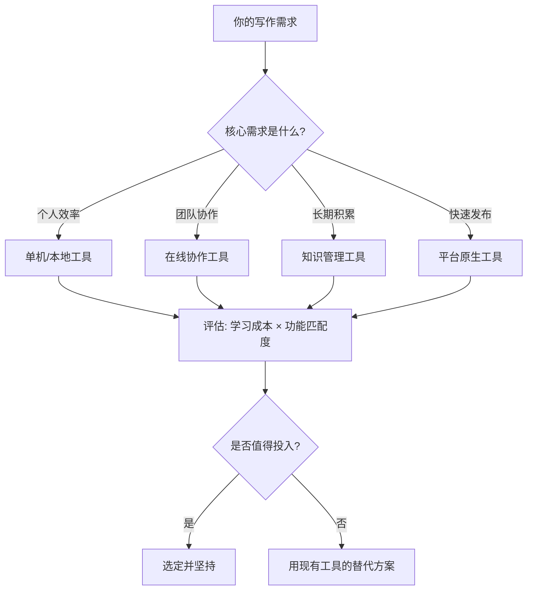
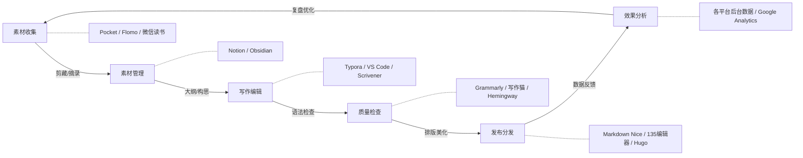
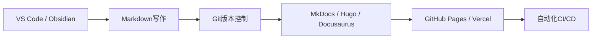
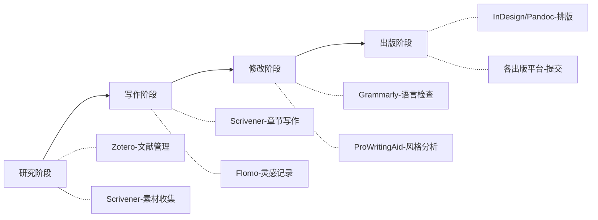
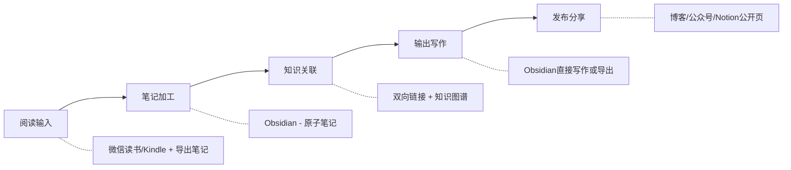
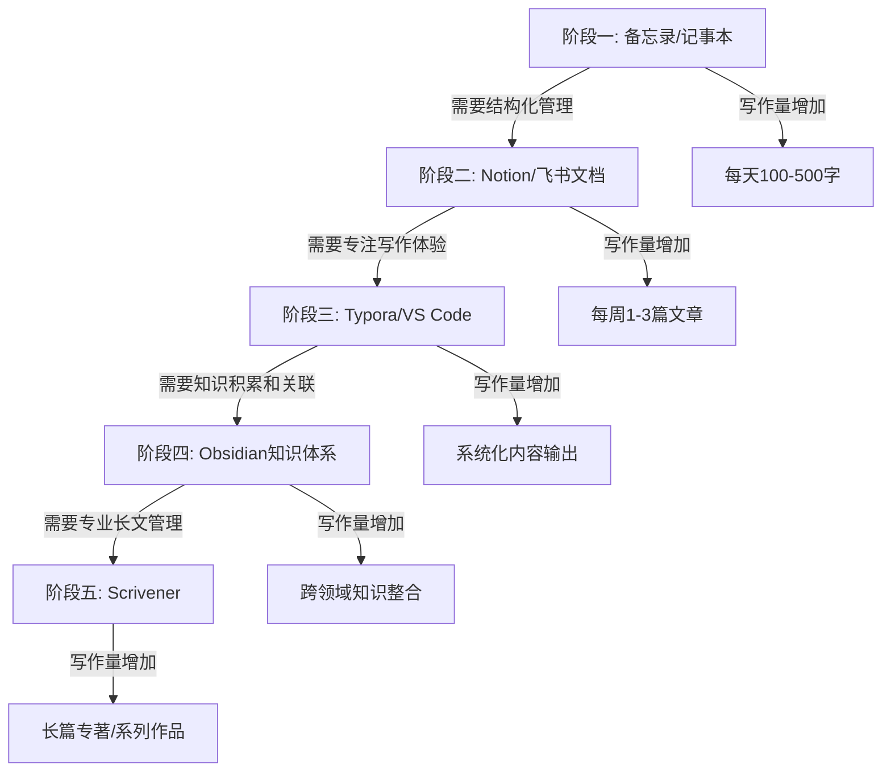
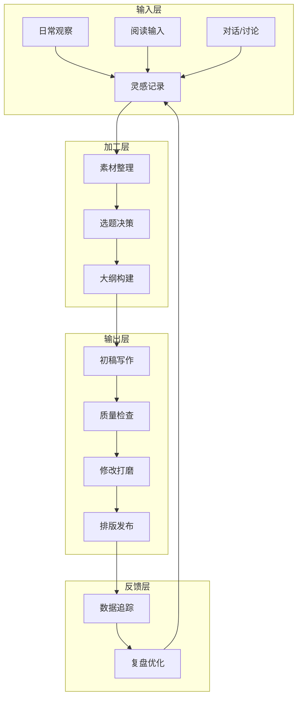
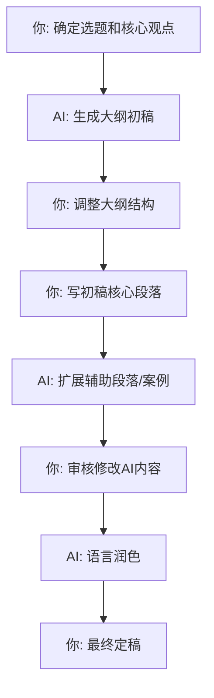

## 四、工具选择建议

前面的章节介绍了各种写作工具和它们的功能，但一个更关键的问题是：**面对几十种工具，你到底该选哪些？** 很多人在工具选择上花了大量时间——反复比较、频繁切换、追求完美——结果工具用了不少，写作本身反而被耽搁了。本章提供一套系统化的工具选择框架，帮你快速找到最适合自己的工具组合，然后把精力放回写作本身。

### 4.1 工具选择的底层逻辑

#### 选工具不是选"最好的"，而是选"最合适的"

每款写作工具都有自己的设计哲学和目标用户。Notion的设计哲学是"全能工作空间"，适合需要把写作和项目管理结合在一起的人；Typora的设计哲学是"纯粹的写作体验"，适合需要沉浸式写作的人；Obsidian的设计哲学是"知识网络"，适合需要长期积累和关联知识的人。没有哪个工具是绝对最好的，只有在你的具体场景下最合适的。

**一个判断标准：** 如果你花在配置工具上的时间超过了实际写作的时间，说明你选错了工具，或者你正在用错误的方式选择工具。

#### 工具选择的核心公式

工具选择的本质是一个**成本收益分析**：学习一款新工具需要投入时间成本，而它带来的效率提升是收益。只有当收益明显大于成本时，换工具才值得。

### 4.2 五维评估框架

选择任何一款写作工具，都可以从以下五个维度进行系统评估：

#### 维度一：匹配度——它能解决你的核心问题吗？

这是最重要的维度。先明确你的核心写作场景，再看工具是否针对这个场景做了优化。

| 写作场景 | 核心需求 | 优先考虑的功能 | 典型工具 |
|---------|---------|--------------|---------|
| 商务报告/方案 | 结构清晰、逻辑严密 | 大纲视图、模板、协作批注 | 飞书文档、石墨文档 |
| 自媒体内容 | 排版美观、发布便捷 | 一键排版、多平台分发 | Markdown Nice、135编辑器 |
| 技术文档 | 版本管理、代码展示 | Git集成、代码高亮、Markdown | Typora、Obsidian |
| 长篇创作 | 素材管理、进度追踪 | 卡片视图、大纲、章节管理 | Scrivener |
| 知识积累 | 关联检索、长期沉淀 | 双向链接、标签、全文搜索 | Obsidian、Notion |
| 学术论文 | 引用管理、格式规范 | LaTeX、引用管理器集成 | Overleaf、Typora+Zotero |

**匹配度判断方法：** 列出你日常写作中最常遇到的3个痛点，然后看工具是否能直接解决这些痛点。如果一款工具的功能列表很华丽，但没有命中你的痛点，它的匹配度就很低。

#### 维度二：学习成本——你需要花多少时间才能上手？

学习成本包括三个层面：

- **上手成本：** 从安装到能完成基本写作任务需要多长时间？
- **熟练成本：** 从基本使用到高效使用需要多长时间？
- **迁移成本：** 从现有工具切换过来需要多少时间来迁移数据和习惯？

| 工具类型 | 上手时间 | 熟练时间 | 迁移难度 | 适合人群 |
|---------|---------|---------|---------|---------|
| 在线文档（飞书/石墨） | 30分钟 | 1-2天 | 低（复制粘贴即可） | 任何水平 |
| Markdown编辑器（Typora） | 2-4小时 | 1-2周 | 中（需学习Markdown语法） | 有一定技术基础 |
| 知识管理（Obsidian） | 1-2天 | 1-3个月 | 高（需重建知识结构） | 愿意长期投入的深度用户 |
| 专业写作（Scrivener） | 3-7天 | 2-6个月 | 高（功能复杂，需系统学习） | 专业作家/学术研究者 |

**务实建议：** 如果你每周的写作时间不超过5小时，选择上手成本低于1天的工具。把学习工具的时间用来写作，回报率更高。

#### 维度三：数据安全——你的内容安全吗？

写作内容是你的智力资产，数据安全不容忽视。需要从以下几个角度评估：

**存储方式对比：**

| 存储方式 | 代表工具 | 优势 | 风险 | 适合场景 |
|---------|---------|------|------|---------|
| 纯本地存储 | Typora、Obsidian | 完全掌控数据，无需联网 | 硬盘损坏可能丢失 | 个人敏感内容、长期知识库 |
| 云端存储 | 飞书、石墨、Notion | 多端同步，不担心硬件 | 平台可能关停、数据泄露 | 团队协作、非敏感内容 |
| 混合存储 | Obsidian+同步、Notion+导出 | 兼顾安全和便捷 | 配置复杂 | 重要但需要多端访问的内容 |

**必须执行的数据保护措施：**

1. **3-2-1备份原则：** 至少保留3份副本，使用2种不同存储介质，其中1份存放在异地。对于写作内容，最简单的方案是：本地硬盘一份 + 云盘（如坚果云、iCloud）一份 + 定期导出一份到移动硬盘。
2. **定期导出：** 无论使用什么工具，至少每月导出一次完整的Markdown或Word备份。不要假设云端工具永远不会出问题——2023年就有多个笔记应用突然关停或大幅修改服务条款。
3. **格式可迁移性：** 优先选择支持Markdown、纯文本等开放格式的工具。如果工具使用私有格式（如某些笔记应用），一旦工具关停，迁移数据将非常痛苦。

#### 维度四：生态与扩展——它能和其他工具配合吗？

没有一款工具能满足所有需求。好的工具应该有良好的扩展性，能和其他工具无缝配合。

**一个理想写作工具链的生态关系：**

**评估生态的关键问题：**

- **导入能力：** 它能方便地从其他工具导入内容吗？支持哪些格式？
- **导出能力：** 它能导出为通用格式吗？如果它明天关停，你能顺利迁移吗？
- **插件/集成：** 它有插件生态吗？能和你常用的其他工具（如日历、任务管理、云盘）连接吗？
- **API支持：** 如果你有自动化需求（如批量处理、定时发布），它提供API吗？

#### 维度五：成本——显性和隐性成本都要算

**显性成本：**

| 成本类型 | 免费方案 | 付费方案 | 注意事项 |
|---------|---------|---------|---------|
| 订阅制 | Notion免费版、Obsidian个人版 | Notion Pro（$10/月）、Scrivener（$49买断） | 订阅制累计成本高，买断制更划算 |
| 一次性购买 | Typora（$14.99买断） | Scrivener（$49买断） | 注意升级是否另收费 |
| 完全免费 | VS Code、Markdown Nice | — | 功能可能受限，但对大多数人够用 |

**隐性成本（容易被忽视）：**

- **时间成本：** 配置、学习、维护工具所需的时间。如果一款工具需要每周花1小时维护配置，一年就是52小时——这些时间可以写10-20篇高质量文章。
- **注意力成本：** 工具界面的复杂程度直接影响你的注意力。功能越多的工具，干扰往往也越多。如果你发现自己在写作时经常被工具的各种功能分心，说明这款工具的注意力成本太高。
- **心理成本：** 频繁切换工具带来的决策疲劳。每次换工具都意味着重新适应，这个过程消耗的心理能量远超你的想象。

### 4.3 按写作场景的工具组合方案

基于上面的五维评估框架，下面给出几种典型的工具组合方案。这些不是唯一的正确答案，而是经过验证的高效组合，你可以在此基础上调整。

#### 方案一：商务写作工具链

**适用人群：** 职场白领、管理层、咨询顾问、需要频繁撰写报告/方案/邮件的人

**推荐组合：**

| 环节 | 工具 | 作用 | 替代方案 |
|------|------|------|---------|
| 写作平台 | 飞书文档 | 协作编辑、版本管理、评论批注 | 石墨文档、腾讯文档 |
| 结构辅助 | 金字塔结构模板 | 确保逻辑清晰、结论先行 | Notion模板 |
| 中文校对 | 写作猫 | 检查错别字、语病、标点 | 秘塔写作猫 |
| 英文校对 | Grammarly | 语法、风格、语气检查 | LanguageTool |
| 排版导出 | 工具内置导出 | 一键导出PDF/Word | WPS |

**关键原则：** 商务写作的核心是效率和准确性，不需要花哨的功能。飞书/石墨的协作功能已经足够，关键是建立一套标准化的文档模板（项目提案模板、周报模板、分析报告模板），然后反复使用。

**实操建议：** 在飞书中创建一个"写作模板库"文件夹，把常用文档类型（周报、项目提案、会议纪要、分析报告）各做一个标准模板。每次写新文档时直接复制模板，填写内容即可。这能节省30-50%的写作时间，因为最难的部分——结构设计——已经提前完成了。

#### 方案二：自媒体内容工具链

**适用人群：** 公众号作者、知乎/小红书/头条创作者、内容创业者

**推荐组合：**

| 环节 | 工具 | 作用 | 替代方案 |
|------|------|------|---------|
| 灵感捕捉 | Flomo | 随时记录碎片想法，微信直接输入 | 备忘录、锤子便签 |
| 素材管理 | Notion | 分类存储案例、数据、金句、图片 | Obsidian |
| 正文写作 | Typora | 专注写作，Markdown所见即所得 | VS Code、Obsidian |
| 质量检查 | 写作猫 + Hemingway | 中文校对 + 可读性检查 | 秘塔写作猫 |
| 排版美化 | Markdown Nice | 一键转换为公众号排版 | 135编辑器、秀米 |
| 发布分发 | 各平台后台 | 手动发布（保证质量） | 蚁小二（多平台分发） |

**关键原则：** 自媒体写作的核心是内容质量和发布效率的平衡。不要在排版上花太多时间——135编辑器和秀米的模板虽然好看，但过度排版会分散读者对内容本身的注意力。Markdown Nice的极简风格反而更适合深度内容。

**实操建议：** 建立一个Notion内容日历数据库，字段包括：选题、目标平台、写作状态（构思/初稿/修改/待发布/已发布）、预计发布日期、实际数据（阅读量/点赞/评论）。每周回顾一次数据，找出你的读者最感兴趣的内容方向，然后调整下周的选题计划。数据驱动的内容策略比凭直觉选题有效得多。

#### 方案三：技术写作工具链

**适用人群：** 程序员、技术博主、文档工程师、开源项目维护者

**推荐组合：**

| 环节 | 工具 | 作用 | 替代方案 |
|------|------|------|---------|
| 写作编辑 | VS Code + Markdown插件 | 代码高亮、实时预览、快捷键丰富 | Obsidian、Typora |
| 版本管理 | Git + GitHub | 完整的版本历史、协作、分支管理 | GitLab |
| 静态站点 | Hugo / MkDocs | 将Markdown转换为文档网站 | Docusaurus、VuePress |
| 部署托管 | GitHub Pages | 自动部署，免费托管 | Vercel、Netlify |
| 质量检查 | Vale / markdownlint | 文档风格一致性检查 | 人工Review |

**关键原则：** 技术写作的核心是可维护性和准确性。Markdown + Git的组合让你可以像管理代码一样管理文档——版本控制、分支协作、自动化构建部署。不要用富文本编辑器写技术文档，格式混乱和版本丢失是最大的隐患。

**实操建议：** 如果你在维护一个项目，把文档和代码放在同一个仓库里（docs/目录），这样每次代码更新时可以同步更新文档，避免文档和代码脱节。使用GitHub Actions设置自动化：每次push到main分支时自动构建文档网站并部署。

#### 方案四：长篇创作工具链

**适用人群：** 小说作者、非虚构写作者、学术研究者、博士生

**推荐组合：**

| 环节 | 工具 | 作用 | 替代方案 |
|------|------|------|---------|
| 素材收集 | Scrivener研究区 + Zotero | 集中管理参考资料、图片、笔记 | Notion、Obsidian |
| 章节写作 | Scrivener | 卡片视图、大纲管理、进度追踪 | Obsidian长文插件 |
| 碎片记录 | Flomo | 随时记录灵感，同步到Scrivener | 手机备忘录 |
| 语言检查 | Grammarly + ProWritingAid | 语法检查 + 风格深度分析 | Hemingway |
| 最终排版 | Pandoc / InDesign | 转换为出版格式（EPUB/PDF） | Sigil、Calibre |

**关键原则：** 长篇创作的核心是管理复杂度。一部10万字的作品，不可能在脑子里同时装下所有章节的结构和细节。Scrivener的价值就在于它帮你把一个庞大的项目拆解成可管理的小块——每个场景一个卡片，每个章节一个文件夹，随时可以鸟瞰全局也可以聚焦细节。

**实操建议：** 在Scrivener中使用"项目目标"功能设定每日字数目标（建议300-1000字），并在每天结束时查看进度条。进度条的视觉反馈会给你持续写作的动力。不要在写作阶段反复修改——把修改留到专门的修改阶段，初稿阶段的目标只有一个：把故事讲完。

#### 方案五：知识积累型写作工具链

**适用人群：** 研究者、终身学习者、需要长期积累知识体系的人

**推荐组合：**

| 环节 | 工具 | 作用 | 替代方案 |
|------|------|------|---------|
| 阅读标注 | 微信读书 / Kindle | 标注、笔记、导出 | MarginNote、PDF Expert |
| 笔记加工 | Obsidian | 原子笔记、双向链接、标签体系 | Notion、Logseq |
| 知识关联 | Obsidian知识图谱 | 可视化知识之间的关联 | Roam Research |
| 输出写作 | Obsidian + Pandoc | 直接在知识库中写作并导出 | Typora |

**关键原则：** 知识积累型写作的核心是**长期复利**。你今天写的一条笔记，可能在半年后和另一条笔记产生意想不到的关联，触发一篇全新的文章。这种复利效应只有在笔记之间建立了链接之后才会出现。Obsidian的双向链接和知识图谱就是为这个目的设计的。

**实操建议：** 采用"原子笔记法"——每条笔记只记一个概念，用你自己的话写，不超过500字。在每条笔记末尾加上`相关笔记`链接，指向和它有关的其他笔记。每周末花30分钟浏览知识图谱，你会发现很多孤立的笔记之间出现了意想不到的关联，这些关联就是你下一篇文章的素材。

### 4.4 工具选择的常见陷阱

#### 陷阱一：工具收集癖

**症状：** 不断尝试新工具，收藏了十几个"神器推荐"帖子，安装了七八个写作应用，但每个都只用了几天。

**本质原因：** 用"选工具"的快感替代了"写作"的焦虑。尝试新工具给你一种"我在进步"的错觉，但实际上你只是在拖延真正需要做的事——坐下来写。

**破解方法：** 给自己一个规则——**90天锁定期**。选定一套工具后，90天内不换工具，不尝试新工具。90天之后再评估是否需要更换。大多数人会发现，90天之后他们已经完全适应了现有工具，根本没有换的必要。

#### 陷阱二：功能过度追求

**症状：** 选择功能最多的工具，花大量时间研究各种高级功能，但日常写作只用到20%的功能。

**本质原因：** 把"工具能做什么"和"你需要什么"混淆了。一款工具有100个功能，但你可能只需要其中10个。剩下90个功能不仅对你没用，还会增加界面复杂度，分散你的注意力。

**破解方法：** 问自己一个问题——**"我过去一个月的写作中，遇到过哪些问题是现有工具解决不了的？"** 如果答案是"没有"，那你就不需要新工具。如果答案是"有"，具体是什么问题？有没有简单的方法绕过去（比如用两个工具配合）？

#### 陷阱三：配置完美主义

**症状：** 花几天时间把Notion/Obsidian的模板、标签体系、工作流配置得尽善尽美，然后只写了两篇文章就不再用了。

**本质原因：** 配置工具的过程本身就有一种"完成感"，让你误以为自己做了有价值的事。但配置只是准备工作，不是写作本身。

**破解方法：** **先写后配**。不要在开始写作之前花时间配置工具。先用最简单的方式开始写——哪怕是用记事本。等你写了一个月，积累了足够的使用经验之后，你自然会知道需要什么配置，这时候再有针对性地调整。

#### 陷阱四：跨平台执念

**症状：** 坚持要求所有设备（手机、平板、电脑）上的写作体验完全一致，为此选择了功能受限的跨平台工具。

**本质原因：** 混淆了"写作"和"记录"。在手机上的主要需求是快速记录灵感和想法，不需要完整的写作功能。在电脑上才是真正的写作。

**破解方法：** **按场景选工具，不要强求统一**。手机上用Flomo或备忘录快速记录灵感，电脑上用Typora或Obsidian深度写作，两者之间通过云同步（如坚果云）连接。接受不同设备有不同工具，反而能获得更好的体验。

#### 陷阱五：免费至上主义

**症状：** 只用免费工具，拒绝为工具付费，即使付费工具能显著提升效率。

**本质原因：** 低估了自己时间的价值。假设你的时间价值是每小时100元，一款50元/月的工具每周能帮你节省1小时，那它的投资回报率是800%——没有哪个理财产品能给你这个回报。

**破解方法：** 计算**小时成本**。把你的月收入除以月工作小时数，得到你的小时成本。然后看工具的价格是否值得。如果一款工具每月50元，但每月帮你节省2小时以上，它就值得购买。反过来，如果免费工具能满足你的需求，当然没必要花钱。

#### 陷阱六：忽视数据锁定风险

**症状：** 把所有内容存放在单一平台上，没有考虑过如果这个平台关停或大幅修改服务条款怎么办。

**本质原因：** 短期便利压倒了长期安全。云端平台的便利性让人容易忽视数据主权的问题。

**破解方法：** **定期导出 + 开放格式**。无论使用什么云端工具，至少每月导出一次完整备份。优先选择支持Markdown、纯文本等开放格式导出的工具。如果你现在使用的是私有格式的工具（如某些笔记应用不支持批量导出），立即制定迁移计划——你的写作内容值得更好的保护。

### 4.5 工具使用的核心原则

无论你最终选择哪套工具，以下原则都适用。它们不是空话，而是无数写作者用时间和教训换来的经验。

#### 原则一：工具服务于写作，而非相反

写作者最常见的错误是把大量时间花在"准备写作"上——选工具、配模板、调界面、看教程——但迟迟不动笔。这些准备工作给你一种"我在做事"的错觉，实际上你在逃避最难的部分：把想法变成文字。

**检验标准：** 每周回顾一下，你在工具上花了多少时间？在写作上花了多少时间？如果前者超过了后者的20%，说明工具正在消耗你而非服务你。

**执行方案：** 设定一个"写作优先"规则——每次想打开工具做配置之前，先写200字。200字不多，但它能帮你从"准备模式"切换到"创作模式"。

#### 原则二：从简单开始，按需升级

不要一开始就选最复杂的工具。你的写作需求会随着时间自然增长，工具应该随之升级，而不是提前过度配置。

**升级路径参考：**

每个阶段的持续时间因人而异，关键是**不要跳级**。在备忘录阶段没写出稳定习惯的人，切换到Obsidian也不会写出更多——工具换了，但习惯没变。

#### 原则三：一致性大于完美性

选定一套工具后，坚持使用它，不要频繁切换。每次切换工具都有隐性成本：

- **数据迁移成本：** 格式转换、内容整理、标签重建
- **习惯重建成本：** 快捷键、操作逻辑、工作流的重新适应
- **心理决策成本：** "要不要换"的反复纠结消耗心理能量

**90天规则的具体操作：**

1. 花1-2天时间调研，选出2-3款候选工具
2. 每款工具试用1天，感受基本操作
3. 从中选一款最顺手的，锁定90天
4. 90天后评估：是否满足需求？有哪些痛点？是否值得更换？
5. 如果痛点可以通过配置解决，继续用；如果根本性不匹配，再换

#### 原则四：备份是写作的最后一道防线

你的写作内容是不可再生的智力资产。一次数据丢失可能让你损失几个月甚至几年的积累。

**最低备份标准：**

| 保护级别 | 措施 | 执行频率 | 适用场景 |
|---------|------|---------|---------|
| 基础保护 | 使用有版本历史的工具（飞书/Notion） | 自动 | 个人日常写作 |
| 标准保护 | 本地+云端双备份，Markdown格式 | 每周 | 重要内容积累 |
| 最高保护 | 3-2-1备份（本地+云盘+移动硬盘），开放格式 | 每月 | 书籍/论文/商业内容 |

**具体操作：**

- **Obsidian用户：** 使用Obsidian Sync或坚果云同步vault文件夹，同时每周将vault复制一份到移动硬盘
- **Notion用户：** 每月通过Settings → Export导出全部内容为Markdown
- **飞书用户：** 每月批量导出重要文档为Word格式
- **Typora用户：** 将写作文件夹放在坚果云同步目录中，自动实现多端同步

#### 原则五：定期审计你的工具栈

每季度花30分钟审计一次你的工具栈，回答以下问题：

1. **过去3个月，哪些工具我每周都在用？** → 核心工具，保留
2. **哪些工具我安装了但很少用？** → 评估是否需要，不需要就卸载
3. **哪些工具之间有功能重叠？** → 选择一个，砍掉另一个
4. **有没有新的痛点是现有工具解决不了的？** → 有针对性地寻找新工具
5. **工具的订阅费用是否值得？** → 如果连续2个月没用到付费功能，降级或取消

### 4.6 从工具到系统：构建你的写作工作流

工具只是零件，真正提升效率的是把工具串联成一个完整的工作流。下面给出一个通用的写作工作流模板，你可以根据自己的工具组合进行调整。

#### 完整写作工作流

**每个环节的操作要点：**

| 环节 | 操作 | 频率 | 推荐工具 |
|------|------|------|---------|
| 灵感记录 | 随时记下碎片想法，不要求完整 | 随时 | Flomo、手机备忘录 |
| 素材整理 | 将灵感归类，补充背景信息 | 每日 | Notion、Obsidian |
| 选题决策 | 评估选题的价值和可行性 | 每周 | Notion内容日历 |
| 大纲构建 | 用金字塔结构组织内容框架 | 写作前 | 飞书大纲、Scrivener |
| 初稿写作 | 快速输出，不纠结细节 | 按计划 | Typora、Scrivener |
| 质量检查 | 语法校对、可读性检查 | 初稿完成后 | 写作猫、Grammarly |
| 修改打磨 | 精简语言、优化结构、补充案例 | 检查后 | Typora |
| 排版发布 | 转换格式、美化排版、发布到平台 | 修改后 | Markdown Nice、平台后台 |
| 数据追踪 | 记录阅读量、互动率等指标 | 发布后3天/7天/30天 | 平台后台、Notion |
| 复盘优化 | 分析数据，总结经验教训 | 每月 | Notion、个人笔记 |

### 4.7 AI时代的工具选择新考量

2023年以来，AI写作工具迅速发展，给工具选择带来了新的维度。你需要理解AI工具的定位，才能做出正确的选择。

#### AI工具的正确定位：辅助而非替代

AI工具（如ChatGPT、文心一言、通义千问）在写作流程中的最佳定位是**特定环节的加速器**，而非全流程的替代者。

**AI擅长的环节：**

- **头脑风暴：** 快速生成多个选题方向或文章大纲，供你筛选
- **素材扩展：** 基于你的关键词扩展相关案例、数据、类比
- **语言润色：** 改写冗长句子、调整语气风格、翻译对照
- **格式转换：** 将Markdown转换为其他格式，批量处理

**AI不擅长的环节（需要你亲自做的）：**

- **原创观点：** AI生成的内容本质上是已有信息的重组，真正的原创洞见只能来自你的思考和经验
- **个人风格：** AI可以模仿任何风格，但不能创造"你的"风格——风格来自长期的写作实践和个人阅历
- **情感真实性：** 读者能感受到文字背后是否有真实的情感和体验，AI生成的内容在这方面天然欠缺
- **事实核查：** AI会产生"幻觉"（编造不存在的数据和引用），所有AI生成的具体事实都必须人工核实

#### AI辅助写作的推荐工作流

**关键原则：** 核心观点和关键段落必须自己写，AI只用来处理扩展性、重复性的工作。这样既能利用AI的效率，又能保持内容的原创性和个人风格。

### 4.8 工具迁移指南

如果你决定从当前工具切换到新工具，以下是一个系统化的迁移流程，避免数据丢失和效率断崖。

#### 迁移四步法

**第一步：盘点（1-2小时）**

- 导出现有工具中的所有内容
- 按类型分类：已完成的文章、草稿、素材笔记、模板
- 评估总量和格式

**第二步：测试（1-2天）**

- 将一小部分内容迁移到新工具
- 测试核心工作流是否顺畅
- 记录遇到的问题和解决方法

**第三步：并行（1-2周）**

- 新旧工具同时使用
- 新内容在新工具中创建
- 旧内容逐步迁移（优先迁移活跃内容）
- 验证新工具能满足所有需求

**第四步：切换（1天）**

- 确认所有重要内容已迁移
- 停止使用旧工具
- 保留旧工具的数据备份至少3个月

#### 常见迁移场景的操作要点

| 迁移路径 | 主要挑战 | 解决方案 |
|---------|---------|---------|
| Word → Markdown | 格式转换可能丢失样式 | 用Pandoc批量转换：`pandoc -f docx -t markdown *.docx -o output/` |
| Notion → Obsidian | 数据库结构差异 | 用Obsidian Importer插件或Notion导出Markdown后导入 |
| 本地文件 → Notion | 大量文件的批量导入 | Notion支持拖拽文件夹导入，但需手动调整结构 |
| 腾讯文档 → 飞书文档 | 格式兼容性 | 逐篇复制粘贴（最可靠），或导出Word再导入 |
| 纸质笔记 → 数字工具 | 手写识别和整理 | 用OCR工具（如全能扫描王）数字化，然后分类整理 |

### 4.9 速查表：30秒找到你的工具组合

如果上面的内容太长，这里给你一个极简速查表。根据你的**主要写作场景**，直接选择推荐方案：

| 你的情况 | 核心工具 | 辅助工具 | 月成本 | 学习投入 |
|---------|---------|---------|--------|---------|
| 职场白领，偶尔写报告 | 飞书文档 | 写作猫 | 免费 | 30分钟 |
| 自媒体创作者，周更2-3篇 | Typora + Markdown Nice | Flomo + 写作猫 | ≈15元 | 2-4小时 |
| 程序员，写技术文档 | VS Code + Git | Hugo/MkDocs | 免费 | 1-2天 |
| 小说/长篇作者 | Scrivener | Flomo + Grammarly | ≈350元 | 3-7天 |
| 终身学习者，积累知识 | Obsidian | 坚果云 + 微信读书 | ≈20元/月 | 1-2天 |
| 学术研究者 | Overleaf + Zotero | Obsidian | 免费-30元/月 | 1-3天 |

**记住：** 工具只是手段，写作才是目的。选定工具之后，把全部精力投入到写作中去。最好的工具是你已经熟练到不需要思考"怎么操作"的工具——它应该像握笔一样自然，让你完全专注于思想的表达。

***
