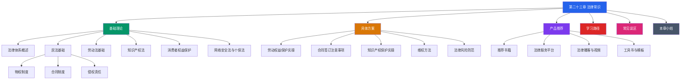

# 第二十三章 法律常识

## 章节概览

### 为什么要学习法律常识

在中国，每年有超过 300 万件民事纠纷进入法院，其中绝大多数源于普通人缺乏基本法律常识。一个打工人因为不懂试用期规定被公司"合法"压榨半年工资；一个消费者因为不知道"七天无理由退货"的适用范围而错失维权机会；一个自由职业者因为没有签订书面合同，追讨 5 万元劳务费花了两年时间——这些不是极端案例，而是每天都在发生的日常。

法律常识的价值不是让你成为律师，而是让你在关键时刻不做"法盲决定"。具体来说，法律常识能帮你做到三件事：

**第一，事前预防风险。** 签劳动合同时，你能看出"工资按公司制度执行"这句话埋了什么坑；签租房合同时，你知道押金条款怎样写才能真正保护自己；签服务协议时，你能识别哪些格式条款是无效的。

**第二，事中把握主动。** 权益受到侵害时，你知道 12315 投诉通常比找商家理论有效 10 倍；你知道劳动仲裁免费且一裁终局，比直接打官司高效得多；你知道拍照、录音、保存聊天记录这些"小事"在法律上有多重要。

**第三，事后正确止损。** 你知道诉讼时效是 3 年而不是"随时可以告"；你知道精神损害赔偿不是想提就能提的；你知道有些纠纷请律师反而不划算——这些判断能力直接决定你的时间和金钱成本。

一个常见的误解是"我又不打官司，学法律干什么"。事实上，法律常识最重要的作用恰恰在"不打官司"——它让你能识别风险、规避纠纷、在问题升级前就解决掉。据中国司法大数据研究院统计，超过 60% 的民事纠纷如果当事人事先了解基本法律规定，完全可以避免。

### 本章核心内容

本章围绕公民日常生活中最常接触的六大法律领域展开，从理论到实操、从入门到进阶，构建完整的法律常识体系：

#### 第一板块：法律体系与民法基础

在进入具体法律领域之前，你需要先建立一个"法律地图"——知道中国法律体系是怎么分层的（宪法→法律→行政法规→地方性法规），知道遇到不同类型的问题该去找哪部法律。这部分还会系统讲解《民法典》的核心内容：

- **民事主体制度**：自然人、法人、非法人组织各自的权利能力和行为能力，直接影响你签的合同是否有效
- **物权制度**：房屋产权、善意取得、居住权等与你的财产直接相关的规则
- **合同制度**：要约与承诺、合同效力、违约责任——这是后续所有合同类知识的根基
- **侵权责任**：产品缺陷、交通事故、医疗损害、高空抛物等场景的责任划分
- **诉讼时效**：3 年普通时效、20 年最长保护期，以及哪些情况不适用时效

#### 第二板块：劳动法基础

劳动关系是大多数人一生中最重要的法律关系。中国现行《劳动法》和《劳动合同法》对劳动者保护力度较强，但前提是你知道自己享有哪些权利。这部分覆盖：

- **劳动合同签订**：必备条款、试用期上限、无固定期限合同的触发条件
- **工资与工时**：最低工资保障、加班费 150%/200%/300% 的计算规则、标准工时制度
- **社会保险**：五险一金的缴费比例、享受条件、断缴影响
- **劳动合同解除**：劳动者预告解除（30 天书面通知）、即时解除的法定情形、经济补偿金的计算
- **特殊保护**：女职工孕期/产期/哺乳期保护、工伤认定与赔偿

#### 第三板块：知识产权法

在数字经济时代，知识产权不再只是企业的事。你拍的照片、写的代码、画的图、甚至你的社交媒体昵称，都可能涉及知识产权。这部分讲解：

- **著作权**：自动取得原则、人身权与财产权的区分、保护期限、合理使用的边界
- **专利权**：发明/实用新型/外观设计三种类型、新颖性/创造性/实用性三要件
- **商标权**：注册流程、先申请原则、十年保护期与续展

#### 第四板块：消费者权益保护

作为消费者，你每天都在行使"消费行为"，但你可能不知道自己在法律上享有的九项基本权利。这部分重点讲解：

- **消费者九大权利**：安全权、知情权、选择权、公平交易权、求偿权等
- **惩罚性赔偿**：一般欺诈"退一赔三"（最低 500 元）、食品药品领域"退一赔十"
- **维权途径**：协商→投诉 12315→消协调解→行政投诉→仲裁→诉讼的完整链条
- **格式条款识别**：哪些"最终解释权归本店所有"之类的声明是无效的

#### 第五板块：网络安全法与个人信息保护

这是最容易被忽视但与每个人息息相关的领域。你在 APP 里填的手机号、上传的身份证照片、留下的浏览记录，都受法律保护。这部分讲解：

- **个人信息保护法**：知情同意原则、最小必要原则、删除权和更正权
- **网络安全法**：网络运营者的安全保障义务、个人信息泄露后的法律后果
- **日常防护义务**：公民在网络安全中的法律责任边界

### 学习目标

通过本章的学习，你将能够：

**初级目标——知道"是什么"：**

1. 了解中国法律体系的基本层级结构，知道遇到问题时该找哪一层级的法律依据
2. 掌握《民法典》中民事主体、物权、合同、侵权责任的核心规则
3. 熟悉劳动法中关于劳动合同、工资、社保、解除合同的基本规定
4. 知道著作权、专利权、商标权各自保护什么、保护多久
5. 了解消费者享有的九项基本权利和五种维权途径

**中级目标——知道"怎么做"：**

6. 能够独立审查一份劳动合同或租赁合同的关键条款
7. 遇到消费纠纷时，知道选择最高效的维权路径
8. 能够判断自己的作品或他人的作品是否受著作权保护
9. 知道在什么情况下需要保留哪些证据（聊天记录、录音、转账凭证等）
10. 能够识别常见的法律陷阱和霸王条款

**高级目标——知道"为什么"：**

11. 理解法律条文背后的立法逻辑，做到举一反三
12. 能够评估法律纠纷的成本收益，做出理性的维权决策
13. 知道哪些情况必须请律师、哪些情况可以自行处理
14. 建立持续学习法律知识的习惯和路径

### 本章知识地图

### 章节详细结构

| 小节 | 核心内容 | 你将获得的能力 | 预计阅读时间 |
|------|----------|----------------|-------------|
| **01-基础理论** | 法律体系概述、民法典核心（物权/合同/侵权）、劳动法六大领域理论知识 | 能看懂法律条文，理解法律关系 | 60-90 分钟 |
| **02-具体方案** | 劳动权益实操、合同审查清单、知识产权保护、维权流程、风险防范 | 能独立处理日常法律事务 | 45-60 分钟 |
| **03-产品推荐** | 法律入门书籍、在线法律平台、法律播客/视频、工具书与模板 | 有持续学习的资源和工具 | 15-20 分钟 |
| **04-学习路径** | 从零开始的法律学习计划，分阶段递进 | 有清晰的学习路线图 | 10-15 分钟 |
| **05-常见误区** | 十大常见法律误区，配真实案例解析 | 避免常见的"想当然"错误 | 20-30 分钟 |
| **06-本章小结** | 核心要点回顾、行动清单、延伸学习建议 | 一份可执行的法律常识行动指南 | 10 分钟 |

### 法律常识速查表

以下是你在日常生活中最可能遇到的法律问题和关键数字，建议保存备用：

| 场景 | 关键法律规定 | 来源 |
|------|------------|------|
| 公司不签劳动合同 | 入职超 1 个月未签，应付双倍工资 | 《劳动合同法》第 82 条 |
| 试用期被随意辞退 | 试用期辞退需证明"不符合录用条件" | 《劳动合同法》第 21 条 |
| 加班不给加班费 | 工作日 150%、休息日 200%、法定假日 300% | 《劳动法》第 44 条 |
| 买到假货 | 可要求"退一赔三"，最低赔偿 500 元 | 《消费者权益保护法》第 55 条 |
| 买到问题食品 | 可要求"退一赔十"，最低赔偿 1000 元 | 《食品安全法》第 148 条 |
| 房东不退押金 | 属于合同纠纷，可向法院起诉或申请调解 | 《民法典》合同编 |
| 网购商品不满意 | 七天无理由退货（定制/鲜活/数字商品除外） | 《消费者权益保护法》第 25 条 |
| 借钱不还 | 诉讼时效 3 年，从约定还款日起算 | 《民法典》第 188 条 |
| 被高空抛物砸伤 | 可能加害的建筑物使用人给予补偿 | 《民法典》第 1254 条 |
| 个人信息被泄露 | 可要求删除，严重者可索赔 | 《个人信息保护法》第 47 条 |

### 阅读建议

**如果你时间充裕（推荐）：** 按照 01→02→03→04→05→06 的顺序完整阅读。先用 01 建立理论框架，再用 02 学习实操方法，03 和 04 帮你建立长期学习习惯，05 帮你纠正错误认知，06 做总结收尾。完整阅读大约需要 3-4 小时。

**如果你只有 1 小时：** 直接读 02-具体方案中的"劳动权益保护实操方案"和"合同签订注意事项"，再翻一下上面的速查表。这两部分覆盖了你日常生活中 80% 的法律需求。

**如果你遇到了具体问题：** 直接翻到对应的小节。劳动纠纷看 01 的第三章和 02 的第一章，合同问题看 01 的第二章和 02 的第二章，消费维权看 01 的第五章和 02 的第四章。

**通用建议：**

- **边读边代入自己的经历。** 想想自己签过的合同、遇到过的消费纠纷、工作中碰到的问题，对照法律规定看自己有没有吃过亏。
- **建立自己的法律笔记。** 把关键法条和维权流程记录下来，建一个"法律速查手册"。遇到问题时不用从头翻书。
- **定期回顾。** 法律知识不像数学公式，它需要在实际场景中反复应用才能内化。建议每季度花 30 分钟回顾一次核心内容。
- **关注法律动态。** 法律法规会修订更新，新法会出台。关注"中国普法"公众号或"北大法宝"等平台，保持信息更新。

> ⚠️ **重要提示：** 本章内容基于中国大陆现行法律法规编写（截至 2024 年）。部分规则可能因地区、行业或具体情况而有所不同。本章旨在帮助你建立法律常识框架，不能替代专业法律咨询。涉及具体法律问题，建议咨询当地专业律师或拨打 12348 法律服务热线。
