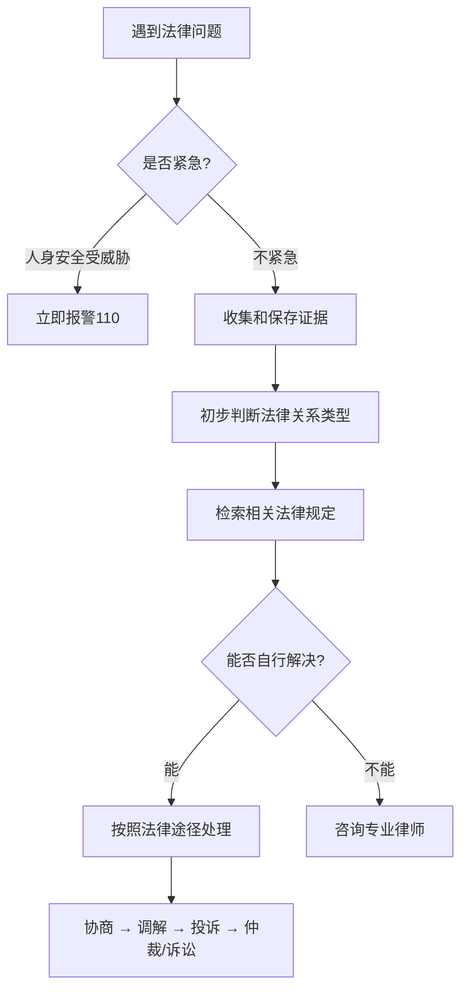
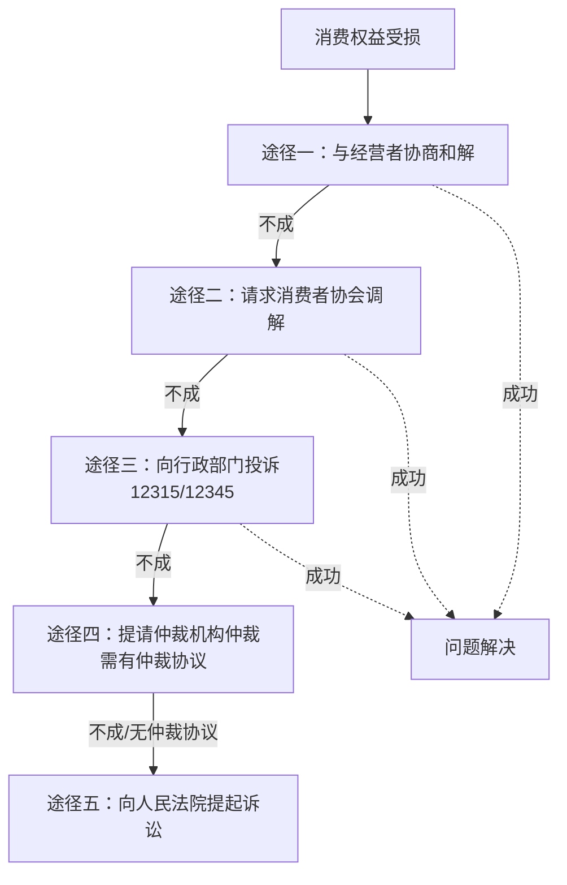
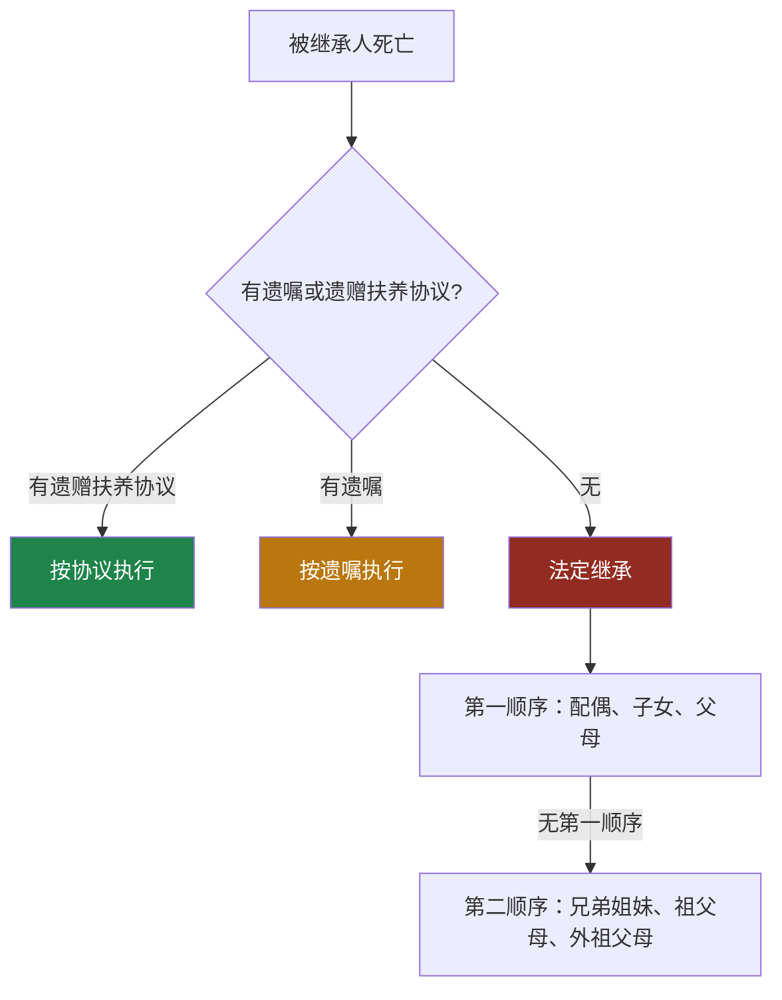

# 学习路径：从零开始的法律常识学习计划

法律不是法学院学生的专利。在这个权利意识日益觉醒的时代，每一个普通人都需要具备基本的法律素养——不是为了打官司，而是为了在签订合同时不被坑、在遭遇侵权时知道怎么办、在日常决策中能够预判法律风险。

本章提供一份完整的、可执行的法律常识学习路径。它不是一份书单，而是一份包含目标设定、知识节点、实操任务、效果评估的系统化学习方案。无论你是刚毕业的大学生、工作多年的职场人、还是经营小生意的创业者，都能从中找到适合自己的起点和节奏。

## 一、学习路径总览

### 1.1 设计理念

法律常识的学习目标不是成为法律专家，而是达成三个核心能力：

| 能力层级 | 描述 | 具体表现 |
|---------|------|---------|
| **识别能力** | 能判断"这里有法律问题" | 看到合同中的不合理条款能意识到风险 |
| **理解能力** | 能理解"法律规定了什么" | 知道试用期最长多久、加班费怎么算 |
| **应用能力** | 能做到"用法律保护自己" | 能写投诉书、能走仲裁流程、能做合同审查 |

这三个能力是递进的。很多人学了法律知识却不会用，问题出在只停留在第二层，没有进入第三层的实操训练。本路径的四个阶段正是围绕这三层能力设计的。

### 1.2 路径全景图

```mermaid
graph TD
    A[第一阶段：法律启蒙<br/>第1-3周] --> B[第二阶段：核心知识构建<br/>第4-8周]
    B --> C[第三阶段：专题深入学习<br/>第9-12周]
    C --> D[第四阶段：实践与巩固<br/>第13-16周]
    
    A --> A1[法律基本概念]
    A --> A2[法律体系认知]
    A --> A3[法律权利意识]
    
    B --> B1[劳动法]
    B --> B2[合同法]
    B --> B3[消费者权益保护法]
    B --> B4[知识产权基础]
    
    C --> C1[租房法律]
    C --> C2[借贷与金融]
    C --> C3[婚姻家庭]
    C --> C4[合同审查实务]
    
    D --> D1[法律风险自查]
    D --> D2[工具应用]
    D --> D3[模拟维权演练]
    D --> D4[知识体系整理]
    
    style A fill:#1a5276,color:#fff
    style B fill:#1e8449,color:#fff
    style C fill:#b9770e,color:#fff
    style D fill:#922b21,color:#fff
```

### 1.3 时间规划

整个路径设计为12-16周，每周投入3-6小时。不同时间预算的学习者可以按以下节奏调整：

| 学习者类型 | 每日学习时间 | 完成周期 | 策略调整 |
|-----------|------------|---------|---------|
| 全职备考/待业 | 2-3小时 | 8-10周 | 压缩启蒙阶段，加大实操比重 |
| 时间充裕型 | 1-1.5小时 | 12周 | 按标准路径执行，深入每个专题 |
| 标准型（推荐） | 30-45分钟 | 16周 | 系统学习，适当精简阅读量 |
| 时间紧张型 | 15-20分钟 | 20周 | 聚焦核心知识点，跳过进阶内容 |
| 碎片化学习型 | 见缝插针 | 24周 | 以卡片学习为主，周末集中实操 |

---

## 二、第一阶段：法律启蒙（第1-3周）

### 2.1 阶段目标

这一阶段的核心任务不是背法条，而是建立"法律思维"——让你的大脑从"觉得法律离我很远"转变为"原来法律就在我身边"。

完成这一阶段后，你应该能够：
- 用自己的话解释"法律是什么"以及"法律为什么重要"
- 画出中国法律体系的基本框架图
- 列举至少10个与自己日常生活直接相关的法律权利
- 知道遇到法律问题时应该去哪里找答案

### 2.2 第1周：法律是什么

**核心知识点：**

**法律的定义与本质。** 法律是由国家制定或认可、以国家强制力保证实施的行为规范的总和。这个定义包含三个关键要素：（1）制定主体是国家（全国人大及其常委会制定法律，国务院制定行政法规）；（2）实施保障是国家强制力（违法有后果）；（3）功能是规范行为（告诉你什么能做、什么不能做、应该怎么做）。

**中国法律体系的层级结构。** 中国的法律体系是一个金字塔形的层级结构，效力从高到低依次为：

宪法（根本大法，最高法律效力）
  └── 法律（全国人大及其常委会制定）
       ├── 基本法律（全国人大制定，如民法典、刑法）
       └── 一般法律（全国人大常委会制定，如消费者权益保护法）
            └── 行政法规（国务院制定，如《工伤保险条例》）
                 └── 地方性法规（省级人大及其常委会制定）
                      └── 规章（国务院各部委/地方政府制定）

理解这个层级很重要：下位法不得与上位法冲突。如果你发现某个地方规定与国家法律矛盾，以国家法律为准。

**法律与道德的区别。** 很多人分不清法律和道德的边界。核心区别在于：

| 维度 | 法律 | 道德 |
|------|------|------|
| 产生方式 | 国家制定或认可 | 社会自然形成 |
| 实施保障 | 国家强制力 | 内心信念和社会舆论 |
| 表现形式 | 成文的法律文件 | 不成文的社会规范 |
| 调整范围 | 人的外部行为 | 行为+思想 |
| 违反后果 | 法律责任（罚款、拘留、判刑） | 舆论谴责、内心不安 |

举个例子：婚内出轨在道德上受到谴责，但单纯出轨本身不违法（不构成犯罪或行政违法）；而重婚则是违法行为。又比如，见死不救在道德上不可接受，但一般情况下不构成犯罪（除非你有法定救助义务，如警察、消防员、先行行为人）。

**公民的基本权利。** 根据《宪法》第二章，公民享有以下基本权利：平等权、政治权利和自由（选举权和被选举权、言论出版集会结社游行示威的自由）、宗教信仰自由、人身自由权（人身自由、人格尊严、住宅不受侵犯、通信自由和通信秘密）、监督权（批评建议权、申诉控告检举权）、社会经济权利（劳动权、休息权、社会保障权、物质帮助权）、文化教育权利（受教育权、科学研究文艺创作自由）。这些权利是你的"底牌"，任何组织和个人都不能非法剥夺。

**学习方式：**
- 阅读《法治的细节》（罗翔著）前3章，约200页，该书用通俗语言讲解法律原理，适合零基础读者
- 观看B站罗翔刑法课的前5讲（搜索"罗翔说刑法"），重点理解法律思维而非具体法条
- 浏览"中国普法网"（www.legalinfo.gov.cn）的普法课堂板块
- 学习时长：约3-4小时

### 2.3 第2周：民法基础概念

**核心知识点：**

**民事主体。** 民事主体是指在民事法律关系中享有权利、承担义务的人。分为三类：

- **自然人**：即生物学上的人。从出生到死亡，都具有民事权利能力。但民事行为能力分三种：（1）完全民事行为能力人——18周岁以上（16-18周岁以自己劳动收入为主要生活来源的视为完全民事行为能力人）；（2）限制民事行为能力人——8-18周岁，以及不能完全辨认自己行为的成年人；（3）无民事行为能力人——不满8周岁，以及不能辨认自己行为的成年人。
- **法人**：法律上拟制的"人"，如公司、事业单位、社会团体。法人独立承担民事责任。
- **非法人组织**：不具有法人资格但可以以自己名义从事民事活动的组织，如个人独资企业、合伙企业。

**民事法律行为的效力。** 不是所有的民事行为都有效。效力分为四种：

| 效力类型 | 条件 | 后果 | 举例 |
|---------|------|------|------|
| 有效 | 主体适格、意思真实、内容合法、不违背公序良俗 | 产生法律约束力 | 正常签订的买卖合同 |
| 无效 | 违反法律强制性规定、恶意串通损害他人利益、违背公序良俗等 | 自始无效、当然无效 | 赌债协议 |
| 可撤销 | 重大误解、欺诈、胁迫、显失公平 | 撤销权人可选择撤销或维持 | 被欺诈签订的合同 |
| 效力待定 | 限制民事行为能力人超出能力范围的行为、无权代理 | 等待追认 | 15岁孩子擅自购买手机 |

**诉讼时效。** 这是很多人忽视但极其重要的概念。诉讼时效是指权利人在法定期间内不行使权利，就丧失请求法院保护其民事权利的制度。普通诉讼时效期间为3年（《民法典》第188条）。从"知道或者应当知道权利受到损害以及义务人之日"起计算。

举个例子：2024年1月1日，张三借给李四10万元，约定2024年6月1日还款。到期后李四未还，张三也从未催要。到2027年6月2日，张三的债权就超过了诉讼时效。虽然债权本身不消灭，但如果张三起诉，李四以诉讼时效抗辩，法院将驳回张三的诉讼请求。所以，**到期不还钱，一定要在3年内主张权利**（发催款函、起诉、申请仲裁等都能中断时效）。

**学习方式：**
- 阅读《民法典与日常生活》（陈甦主编）第1-2章
- 在"国家法律法规数据库"（flk.npc.gov.cn）中搜索《民法典》总则编，通读第一至四章
- 学习时长：约3-4小时

### 2.4 第3周：法律与日常生活

**核心知识点：**

**日常生活中常见的法律关系。** 你每天都在与法律打交道，只是自己没有意识到：

- 早上买早餐——买卖合同关系（消费者权益保护法、食品安全法）
- 骑共享单车——租赁合同关系（合同法、侵权责任法）
- 到公司上班——劳动关系（劳动法、劳动合同法）
- 午餐点外卖——网络购物合同关系（电子商务法、消费者权益保护法）
- 收到快递——运输合同关系（邮政法、快递暂行条例）
- 晚上租房回去——房屋租赁合同关系（民法典合同编）
- 刷手机——个人信息保护关系（个人信息保护法）

**遇到法律问题时的应对思路。** 遇到法律问题时，不要慌张，按照以下步骤处理：

**法律信息查找方法。** 遇到法律问题时，第一反应不应该是"找个律师"，而是先自己查一查。以下是可靠的法律信息来源：

| 信息类型 | 推荐来源 | 网址 | 用途 |
|---------|---------|------|------|
| 法律法规全文 | 国家法律法规数据库 | flk.npc.gov.cn | 查法条原文 |
| 裁判文书 | 中国裁判文书网 | wenshu.court.gov.cn | 查类似案例判决 |
| 法律咨询 | 12348中国法网 | www.12348.gov.cn | 免费法律咨询 |
| 消费维权 | 全国12315平台 | www.12315.cn | 消费投诉举报 |
| 企业信息 | 国家企业信用信息公示系统 | www.gsxt.gov.cn | 查公司资质 |
| 律师信息 | 中国律师网 | www.acla.org.cn | 找正规律师 |

**何时需要寻求专业法律帮助。** 以下情况建议直接找律师，不要试图自己处理：
- 涉及刑事犯罪（被刑事拘留、收到起诉书）
- 涉及金额较大的民事纠纷（一般超过5万元）
- 涉及人身伤害（交通事故、医疗纠纷、工伤）
- 涉及房产交易（二手房买卖、拆迁补偿）
- 涉及婚姻家庭重大事项（离婚财产分割、子女抚养权争议）
- 企业经营中的重大合同、股权、融资事项

### 2.5 阶段检验任务

- [ ] 用自己的话向一个朋友解释"法律和道德的区别"（5分钟内讲清楚）
- [ ] 画出中国法律体系层级图（手绘或电子版均可）
- [ ] 在国家法律法规数据库中找到《民法典》总则编，通读第一章"基本规定"
- [ ] 在12348中国法网注册账号，浏览法律知识板块
- [ ] 列出自己日常生活中涉及的10种法律关系，并标注对应的法律名称

---

## 三、第二阶段：核心知识构建（第4-8周）

### 3.1 阶段目标

这一阶段是整个学习路径的核心。四个与日常生活最密切相关的法律领域——劳动法、合同法、消费者权益保护法、知识产权法——将在这里被系统地讲解。

完成这一阶段后，你应该能够：
- 审查自己的劳动合同，识别不合理条款
- 理解合同的核心要素和常见陷阱
- 知道消费维权的具体途径和操作方法
- 了解知识产权的基本规则，避免侵权风险

### 3.2 第4周：劳动法（上）

**劳动合同的签订。** 根据《劳动合同法》第10条，建立劳动关系应当订立书面劳动合同。已建立劳动关系未同时订立书面劳动合同的，应当自用工之日起一个月内订立。超过一个月不满一年未订立的，用人单位应当向劳动者每月支付二倍的工资（第82条）。超过一年不订立的，视为已订立无固定期限劳动合同。

**试用期的法定规则。** 试用期不是用人单位想定多久就多久的，有严格的法律限制：

| 劳动合同期限 | 试用期上限 | 备注 |
|-------------|----------|------|
| 不满3个月（或以完成一定工作任务为期限） | 不得约定试用期 | — |
| 3个月以上不满1年 | 最长1个月 | — |
| 1年以上不满3年 | 最长2个月 | — |
| 3年以上固定期限和无固定期限 | 最长6个月 | — |

同一用人单位与同一劳动者只能约定一次试用期。试用期工资不得低于本单位相同岗位最低档工资的80%，或者不得低于劳动合同约定工资的80%，并不得低于用人单位所在地的最低工资标准。

**加班费的计算。** 这是最实用的劳动法知识之一：

| 加班类型 | 加班费倍数 | 法律依据 |
|---------|----------|---------|
| 工作日延长工作时间 | 1.5倍 | 《劳动法》第44条第1项 |
| 休息日安排工作且不能补休 | 2倍 | 《劳动法》第44条第2项 |
| 法定节假日安排工作 | 3倍 | 《劳动法》第44条第3项 |

计算基数：按照劳动合同约定的劳动者本人工资标准确定；没有约定的，按照集体合同约定的标准确定；都没有约定的，按照劳动者本人正常劳动应得的工资确定。

**五险一金。** 五险一金是用人单位必须为劳动者缴纳的法定福利，不缴纳是违法行为：

| 项目 | 单位缴费比例（参考） | 个人缴费比例（参考） | 用途 |
|------|-------------------|-------------------|------|
| 养老保险 | 16% | 8% | 退休后领取养老金 |
| 医疗保险 | 8-10% | 2% | 看病报销 |
| 失业保险 | 0.5-1% | 0.5% | 失业后领取失业金 |
| 工伤保险 | 0.2-1.9% | 0 | 工伤赔偿 |
| 生育保险 | 0.5-1% | 0 | 生育医疗和津贴 |
| 住房公积金 | 5-12% | 5-12% | 购房、租房 |

*注：各地缴费比例有差异，以当地社保局公布的标准为准。*

**学习方式：**
- 阅读《劳动法实务精要》第1-4章
- 在国家法律法规数据库中查阅《劳动合同法》全文
- 实践任务：拿出自己的劳动合同，对照上述法律规定逐项审查——合同期限、试用期约定、工资标准、工作时间、社保缴纳情况是否合法

### 3.3 第5周：劳动法（下）

**各类假期规定。** 以下是法定假期的完整清单：

| 假期类型 | 天数 | 适用条件 | 法律依据 |
|---------|------|---------|---------|
| 年休假 | 5-15天 | 工作满1年 | 《职工带薪年休假条例》 |
| 婚假 | 3天（基础） | 登记结婚 | 各地规定不同，部分地方有延长 |
| 产假 | 98天（基础） | 生育 | 《女职工劳动保护特别规定》 |
| 陪产假 | 各地不同 | 配偶生育 | 各省人口与计划生育条例 |
| 病假 | 根据工龄 | 患病或非因工负伤 | 《企业职工患病或非因工负伤医疗期规定》 |
| 丧假 | 1-3天 | 直系亲属去世 | 《关于国营企业职工请婚丧假和路程假问题的通知》 |

**年休假计算：**
- 工作满1年不满10年：5天
- 工作满10年不满20年：10天
- 工作满20年：15天

国家法定节假日、休息日不计入年休假。用人单位确因工作需要不能安排职工年休假的，应当按照该职工日工资收入的300%支付年休假工资报酬。

**经济补偿金与赔偿金。** 这是劳动争议中最常涉及的金钱计算：

**经济补偿金（N）：** 按劳动者在本单位工作的年限，每满一年支付一个月工资的标准向劳动者支付。六个月以上不满一年的，按一年计算；不满六个月的，支付半个月工资。月工资高于当地上年度职工月平均工资三倍的，按三倍标准支付，且补偿年限最高不超过十二年。

**违法解除赔偿金（2N）：** 用人单位违法解除或终止劳动合同的，应当按照经济补偿标准的二倍支付赔偿金。

**常见误区：** 很多人以为"N+1"是法定标准。实际上，"N+1"中的"+1"是"代通知金"，仅适用于《劳动合同法》第40条规定的三种情形（医疗期满不能工作、不能胜任工作、客观情况重大变化），且用人单位选择额外支付一个月工资代替提前三十天通知时才需要支付。协商解除支付N，违法解除支付2N，用人单位单方合法解除且未提前30天通知的支付N+1。

**劳动争议解决途径。** 发生劳动争议后，解决途径为：

**重要提示：** 劳动争议实行"仲裁前置"——必须先申请劳动仲裁，不能直接起诉。仲裁时效为一年，从当事人知道或者应当知道其权利被侵害之日起计算。劳动关系存续期间因拖欠劳动报酬发生争议的，不受一年仲裁时效的限制；但劳动关系终止的，应当自劳动关系终止之日起一年内提出。

**学习方式：**
- 阅读《劳动法实务精要》第5-8章
- 实践任务：（1）计算自己的年休假天数；（2）计算自己应缴的社保金额，与工资条上实际扣除的金额对比；（3）假设自己被违法辞退，计算应得的赔偿金

### 3.4 第6周：合同法

合同是日常生活中最常见的法律文件。你签的每一份合同——租房、买东西、办健身卡、注册APP时勾选的用户协议——都是合同。理解合同法的基本规则，能让你在签字之前就识别风险。

**合同的成立与生效。** 合同成立和合同生效是两个不同的概念。合同成立是指双方当事人就合同的主要条款达成合意；合同生效是指合同产生法律约束力。一般情况下，依法成立的合同自成立时生效。但有些合同需要满足特定条件才生效（如需要审批的外商投资合同、附生效条件的合同）。

**合同的主要条款。** 一份完整的合同应当包含以下要素：

| 条款类型 | 内容 | 不约定的后果 |
|---------|------|------------|
| 当事人信息 | 名称/姓名、地址、联系方式 | 无法确定合同主体 |
| 标的 | 交易的对象（货物、服务、权利等） | 合同不成立 |
| 数量 | 标的的数量 | 无法确定交易规模 |
| 质量 | 标的的质量标准 | 按照国家标准、行业标准或通常标准履行 |
| 价款/报酬 | 交易对价 | 按照订立时的市场价格履行 |
| 履行期限、地点、方式 | 何时何地如何履行 | 适用法律的补充规定 |
| 违约责任 | 违约后的处理方式 | 适用法定违约责任 |
| 争议解决方式 | 协商、仲裁还是诉讼 | 可以起诉到法院 |

**格式条款的识别与应对。** 格式条款是当事人为了重复使用而预先拟定、并在订立合同时未与对方协商的条款。你日常遇到的大部分合同——保险合同、银行合同、APP用户协议、物业合同——都包含大量格式条款。

法律规定：（1）提供格式条款的一方应当遵循公平原则确定当事人之间的权利和义务；（2）提供格式条款的一方应当采取合理的方式提示对方注意免除或者减轻其责任等与对方有重大利害关系的条款，按对方要求对该条款予以说明；（3）对格式条款有两种以上解释的，应当作出不利于提供格式条款一方的解释；（4）格式条款中不合理地免除或减轻其责任、加重对方责任、限制对方主要权利的，该条款无效。

**常见合同类型的核心知识点：**

**买卖合同：** 标的物毁损、灭失的风险，在标的物交付之前由出卖人承担，交付之后由买受人承担（法律另有规定或当事人另有约定的除外）。买受人收到标的物时应当在约定的检验期间内检验，没有约定检验期间的应当及时检验。

**租赁合同：** 租赁期限不得超过二十年，超过部分无效。出租人应当按照约定将租赁物交付承租人，并在租赁期限内保持租赁物符合约定的用途。承租人未经出租人同意转租的，出租人可以解除合同。

**借款合同：** 自然人之间的借款合同，自贷款人提供借款时成立（实践合同）。禁止高利放贷，借款的利率不得违反国家有关规定。目前民间借贷利率的司法保护上限为合同成立时一年期贷款市场报价利率（LPR）的四倍。

**学习方式：**
- 阅读《民法典与日常生活》合同编相关内容
- 在国家法律法规数据库中查阅《民法典》合同编第一分编"通则"
- 实践任务：找到一份自己签过的合同（租房合同、劳动合同、购买协议等），按照上述框架进行逐条审查，记录发现的问题

### 3.5 第7周：消费者权益保护法

**消费者的九项基本权利。** 根据《消费者权益保护法》第二章，消费者享有以下权利：

| 权利名称 | 含义 | 实际应用场景 |
|---------|------|------------|
| 安全保障权 | 购买使用商品或接受服务时人身财产安全不受损害 | 食品中毒、产品缺陷致伤 |
| 知悉真情权 | 有权知悉商品或服务的真实情况 | 商家虚假宣传、隐瞒产品缺陷 |
| 自主选择权 | 自主选择商品或服务，进行比较鉴别 | 强制搭售、捆绑消费 |
| 公平交易权 | 获得质量保障、价格合理、计量正确等公平交易条件 | 缺斤短两、价格欺诈 |
| 依法求偿权 | 因购买使用商品或接受服务受到人身财产损害的，有权要求赔偿 | 产品致伤索赔 |
| 依法结社权 | 依法成立维护自身合法权益的社会组织 | — |
| 获得知识权 | 获得消费和消费者权益保护方面的知识 | — |
| 受尊重权 | 购买使用商品或接受服务时人格尊严、民族风俗习惯得到尊重 | 搜身、歧视 |
| 监督批评权 | 对商品和服务以及保护消费者权益工作进行监督 | 举报违法行为 |

**惩罚性赔偿制度。** 这是消费者维权中最有力的武器：

- **欺诈行为的三倍赔偿：** 经营者提供商品或服务有欺诈行为的，应当按照消费者的要求增加赔偿其受到的损失，增加赔偿的金额为消费者购买商品的价款或者接受服务的费用的三倍；增加赔偿的金额不足五百元的，为五百元（第55条）。
- **缺陷产品的惩罚性赔偿：** 明知产品存在缺陷仍然生产、销售，造成消费者死亡或健康严重损害的，受害人有权要求所受损失二倍以下的惩罚性赔偿（第55条第2款）。
- **食品安全的十倍赔偿：** 生产不符合食品安全标准的食品或销售明知不符合食品安全标准的食品，消费者除要求赔偿损失外，还可以向生产者或销售者要求支付价款十倍的赔偿金（《食品安全法》第148条）。

**消费维权的五种途径：**

**网购维权的特殊规则：**
- **七天无理由退货：** 网购商品（除定作、鲜活易腐、数字商品、报纸期刊等外）消费者有权自收到商品之日起七日内退货，且无需说明理由（第25条）。
- **平台责任：** 网络交易平台提供者不能提供销售者或服务者的真实名称、地址和有效联系方式的，消费者可以向网络交易平台提供者要求赔偿（第44条）。
- **举证责任倒置：** 机动车、计算机、电视机、电冰箱、空调器、洗衣机等耐用商品或者装饰装修等服务，消费者自接受商品或者服务之日起六个月内发现瑕疵，发生争议的，由经营者承担有关瑕疵的举证责任（第23条）。

**学习方式：**
- 阅读《一看就懂的法律常识》消费维权章节
- 在12315平台上注册账号，了解投诉流程
- 实践任务：整理自己过去一年的消费纠纷经历，按照法律框架分析——当时应该如何依法维权

### 3.6 第8周：知识产权基础

**著作权。** 著作权自作品创作完成之日起自动产生，不需要申请或登记。著作权包括人身权（发表权、署名权、修改权、保护作品完整权）和财产权（复制权、发行权、出租权、展览权、表演权、放映权、广播权、信息网络传播权、改编权、翻译权等）。著作权保护期限：人身权中除发表权外的其他权利永久保护；财产权保护期限为作者终身及其死亡后50年。

**日常生活中最常遇到的著作权问题：**
- 网上找的图片不能随便用——图片有版权，商业使用需要获得授权或购买
- 转载文章需要注明出处——未经许可的全文转载构成侵权
- 使用字体需要注意授权——部分字体（如方正字体）商用需要付费
- 软件破解版是侵权——使用盗版软件侵犯软件著作权

**商标权。** 商标需要向国家知识产权局申请注册。注册商标的有效期为十年，自核准注册之日起计算，期满可以续展。注册商标的专用权以核准注册的商标和核定使用的商品为限。未经商标注册人的许可，在同一种商品上使用与其注册商标相同的商标的，构成侵犯注册商标专用权。

**专利权。** 专利分为三种：

| 专利类型 | 保护对象 | 保护期限 | 授权条件 |
|---------|---------|---------|---------|
| 发明专利 | 产品、方法或其改进 | 20年 | 新颖性、创造性、实用性 |
| 实用新型专利 | 产品的形状、构造 | 10年 | 新颖性、创造性、实用性 |
| 外观设计专利 | 产品的外观设计 | 15年 | 新颖性、不属于现有设计 |

**学习方式：**
- 阅读《知识产权法》入门章节或相关科普文章
- 浏览中国知识产权局官网（www.cnipa.gov.cn）的知识产权知识板块
- 实践任务：检查自己日常使用的图片素材来源（如PPT配图、社交媒体图片），确认是否有合法授权

### 3.7 阶段检验任务

- [ ] 完成一份劳动合同审查报告，至少发现3个需要关注的条款
- [ ] 完成一份租房合同或买卖合同的审查，记录发现的风险点
- [ ] 整理一份"我的法律权利清单"，涵盖劳动者、消费者、公民三个维度
- [ ] 在中国裁判文书网上搜索2-3个与自己工作相关的劳动争议案例，阅读判决书并总结要点
- [ ] 向家人或朋友讲解"经济补偿金N和赔偿金2N的区别"

---

## 四、第三阶段：专题深入学习（第9-12周）

### 4.1 阶段目标

这一阶段针对特定生活场景进行深入学习。不是每个专题都要学——根据自己的实际需求选择2-3个重点学习，其余作为参考了解即可。

### 4.2 第9周：租房法律知识

**租赁合同签订要点。** 签订租房合同时，务必确认以下事项：

1. **房东身份验证：** 要求房东出示房产证原件和身份证原件，核对房产证上的产权人与签约人是否一致。如果是二房东转租，必须要求出示原房东的书面同意转租证明。
2. **房屋状况确认：** 在合同中详细列明房屋内设施和物品清单，最好拍照留证。入住时共同检查房屋状况并签字确认。
3. **租金与押金条款：** 明确租金金额、支付方式、支付时间、押金金额和退还条件。特别注意：押金应当在租赁关系终止且租客搬离、房屋验收合格后退还，扣除押金需要有正当理由和凭证。
4. **维修责任划分：** 一般而言，房屋及其附属设施的自然损耗由房东负责维修，租客使用不当造成的损坏由租客负责。
5. **合同解除条件：** 明确提前退租的通知期限和违约金标准。房东提前收回房屋也需要提前通知并给予合理补偿。

**常见租房纠纷及应对：**

| 纠纷类型 | 法律规定 | 应对方法 |
|---------|---------|---------|
| 房东不退押金 | 无正当理由不得扣押金 | 协商→12345投诉→法院起诉 |
| 房东提前赶人 | 需提前通知，否则构成违约 | 要求继续履行或赔偿损失 |
| 房屋设施损坏 | 区分自然损耗和人为损坏 | 入住时拍照留证，争议时申请鉴定 |
| 二房东跑路 | 转租需原房东同意 | 签约前验证转租授权 |
| 租金随意涨价 | 合同期内不得单方涨价 | 按合同约定执行 |

**公租房和廉租房政策。** 公租房（公共租赁住房）面向中低收入住房困难家庭，租金低于市场价。申请条件各地不同，一般要求：本地户籍或稳定就业、无房或住房面积低于标准、收入低于规定标准。廉租房面向最低收入家庭，租金更低甚至免租。具体申请流程和条件可查询当地住建部门官网。

### 4.3 第10周：民间借贷与金融消费

**民间借贷的法律规定。** 民间借贷是指自然人、法人和非法人组织之间进行的资金融通行为。核心规则：

- **利率上限：** 民间借贷利率的司法保护上限为合同成立时一年期贷款市场报价利率（LPR）的四倍。以2024年的LPR 3.45%为例，四倍即13.8%。超过此利率的部分，法院不予保护。
- **砍头息禁止：** 预先在本金中扣除利息的，人民法院应当将实际出借的金额认定为本金。例如，借10万但到手只有9万（1万被作为利息预先扣除），则本金按9万计算。
- **举证责任：** 出借人向人民法院提起民间借贷诉讼时，应当提供借据、收据、欠条等债权凭证以及其他能够证明借贷法律关系存在的证据。

**借条与欠条的区别：**

| 对比维度 | 借条 | 欠条 |
|---------|------|------|
| 法律关系 | 直接证明借贷关系 | 可能基于多种法律关系（买卖、劳务、侵权等） |
| 诉讼时效 | 注明还款日期的，从到期日起3年；未注明的，从主张权利之日起3年 | 从出具之日起3年 |
| 证据效力 | 直接证明借款事实 | 需要其他证据证明基础法律关系 |
| 举证难度 | 较低 | 较高 |

**规范借条的必备要素：**
1. 借款人和出借人的全名及身份证号
2. 借款金额（大小写一致）
3. 借款日期和还款日期
4. 借款利率（如有）
5. 借款用途
6. 还款方式
7. 借款人亲笔签名和手印
8. 如有担保人，担保人也需要签名

**信用卡和网贷的法律知识：**
- 信用卡透支不还可能构成信用卡诈骗罪（恶意透支型），经发卡银行两次催收后超过三个月仍不归还的，可追究刑事责任
- 网贷平台的利率同样受法律限制，超过LPR四倍的部分不受保护
- 遭遇暴力催收（电话轰炸、骚扰家人、公开个人信息）可以报警，催收人员可能涉嫌寻衅滋事罪、侵犯公民个人信息罪

### 4.4 第11周：婚姻家庭法律知识

**结婚的法定条件：**
- 男不得早于22周岁，女不得早于20周岁
- 双方自愿
- 非直系血亲或三代以内旁系血亲
- 双方均无配偶（一夫一妻制）
- 到婚姻登记机关办理登记

**夫妻财产制度。** 这是婚姻法律中最实用的知识：

| 类型 | 范围 | 法律依据 |
|------|------|---------|
| 夫妻共同财产 | 工资奖金、生产经营收益、知识产权收益、继承或赠与所得（遗嘱或赠与合同未明确归一方的）、其他应当归共同所有的财产 | 《民法典》第1062条 |
| 夫妻一方个人财产 | 一方婚前财产、一方因身体伤害获得的赔偿、遗嘱或赠与合同中明确归一方的财产、一方专用的生活用品、其他应当归一方的财产 | 《民法典》第1063条 |

**离婚的两种方式：**

| 方式 | 条件 | 程序 | 时间 |
|------|------|------|------|
| 协议离婚 | 双方自愿且对子女抚养、财产分割协商一致 | 到婚姻登记机关申请→30天冷静期→领取离婚证 | 最快31天 |
| 诉讼离婚 | 一方不同意或无法协商一致 | 向法院起诉→调解→判决 | 简易程序3个月，普通程序6个月 |

**离婚财产分割原则：**
1. 协议优先：双方协商处理
2. 照顾子女、女方和无过错方权益
3. 一方因抚育子女、照料老年人、协助另一方工作等付出较多义务的，有权向另一方请求补偿
4. 一方生活困难的，另一方应从其住房等个人财产中给予适当帮助

**子女抚养权：**
- 不满两周岁的子女，以由母亲直接抚养为原则
- 已满两周岁的子女，协议不成由法院根据双方具体情况判决
- 已满八周岁的子女，应当尊重其真实意愿
- 不直接抚养的一方应当负担部分或全部抚养费

**遗产继承的基本规则：**

遗嘱的法定形式（《民法典》第1134-1139条）：自书遗嘱（亲笔书写、签名、注明年月日）、代书遗嘱（两个以上见证人在场、代书人和其他见证人签名）、打印遗嘱（两个以上见证人在场、每页签名注明年月日）、录音录像遗嘱（两个以上见证人在场）、口头遗嘱（危急情况下、两个以上见证人在场，危急情况消除后能用其他形式的口头遗嘱无效）、公证遗嘱（经公证机构办理）。

### 4.5 第12周：合同审查实务

**合同审查的方法论。** 审查合同不是从头读到尾，而是有一个系统化的检查框架：

**第一步：主体审查。** 核实签约对方的身份和资质——是自然人还是法人？是否有签约的权限？如果是代理人，是否有授权委托书？如果是公司，经营范围是否涵盖合同标的？

**第二步：标的审查。** 合同标的是否明确具体？数量、质量标准是否清晰？是否存在歧义？

**第三步：权利义务审查。** 双方的权利义务是否对等？是否存在只约束一方的不公平条款？付款条件、交付条件、验收标准是否合理？

**第四步：违约责任审查。** 违约责任是否对双方都适用？违约金比例是否合理（一般不超过实际损失的30%）？是否有单方面加重一方责任的条款？

**第五步：争议解决审查。** 争议解决方式是仲裁还是诉讼？仲裁机构或管辖法院是否明确？是否对自己有利？

**第六步：其他风险条款。** 是否有不合理的免责条款？是否有竞业限制或排他性条款？保密条款的范围是否合理？知识产权归属是否明确？

**常见合同陷阱清单：**

| 陷阱类型 | 表现形式 | 防范方法 |
|---------|---------|---------|
| 主体陷阱 | 假冒他人名义签约、超越权限签约 | 核实营业执照、身份证、授权委托书 |
| 标的陷阱 | 标的描述模糊、质量标准不清 | 详细约定规格型号、质量标准、验收方法 |
| 价格陷阱 | 价格构成不透明、隐藏费用 | 要求列明价格构成明细 |
| 履行陷阱 | 履行期限模糊、交付条件不清 | 明确时间节点、交付地点、验收程序 |
| 违约陷阱 | 违约金只约束一方、违约金过高 | 要求对等约定、控制违约金比例 |
| 管辖陷阱 | 约定在对方所在地法院管辖 | 争取在己方所在地或中立地点管辖 |
| 附件陷阱 | 关键内容放在附件中且附件不完整 | 确认附件齐全并签字盖章 |

**电子合同的法律效力。** 根据《电子签名法》和《民法典》的规定，数据电文形式的合同与书面合同具有同等法律效力。但需要注意：电子合同的举证难度更大，建议保存好电子签约平台的签约记录、邮件往来记录、聊天记录等电子证据。重要的合同建议选择有资质的电子签约平台（如e签宝、法大大、上上签等），这些平台采用的电子签名技术能够确保签名的真实性和合同的不可篡改性。

### 4.6 阶段检验任务

- [ ] 审查一份租房合同（自己的或网上的模板），按照签订要点逐项检查
- [ ] 写一份规范的借条模板，注明所有必备要素
- [ ] 整理婚姻家庭法律知识要点清单，重点关注夫妻财产制度
- [ ] 对3种不同类型的合同进行模拟审查（租房合同、买卖合同、服务合同各一份），输出审查报告
- [ ] 用大白话向家人解释"遗嘱的六种法定形式及各自的优缺点"

---

## 五、第四阶段：实践与巩固（第13-16周）

### 5.1 阶段目标

这一阶段的核心是"动手"。前三个阶段学到的所有知识，都要在这一阶段转化为实际操作能力。纸上谈兵不如实际操作一遍——只有真正走一遍流程，你才能在需要的时候从容应对。

### 5.2 第13周：个人法律风险自查

**自查清单：**

**劳动合同方面：**
- [ ] 是否签订了书面劳动合同？
- [ ] 试用期约定是否合法？（对照第4周的试用期规则）
- [ ] 工资标准是否明确写在合同中？
- [ ] 社保和公积金是否正常缴纳？（可到当地社保局官网或APP查询）
- [ ] 加班费是否按法定标准支付？
- [ ] 是否存在竞业限制条款？是否合理？

**合同方面：**
- [ ] 目前在履行的合同有哪些？（租房合同、健身卡、保险合同等）
- [ ] 这些合同中的关键条款是否了解？
- [ ] 是否存在不合理条款？
- [ ] 合同到期日是否清楚？

**知识产权方面：**
- [ ] 自己的原创作品（文章、设计、代码）是否有版权保护意识？
- [ ] 日常使用的图片、字体、软件是否有合法授权？
- [ ] 是否存在被侵权的风险？

**个人信息保护方面：**
- [ ] 是否过度授权手机APP权限？
- [ ] 快递单、外卖单上的个人信息是否妥善处理？
- [ ] 是否在不安全的网站上填写过个人信息？

**输出：** 完成一份《个人法律风险自查报告》，记录发现的风险点和整改计划。

### 5.3 第14周：法律工具实战

**工具一：12348中国法网（www.12348.gov.cn）**

这是司法部建设的公共法律服务平台，提供免费的法律咨询服务。使用步骤：
1. 注册账号并实名认证
2. 选择咨询类型（民事、刑事、行政等）
3. 描述法律问题，尽量包含时间、地点、人物、事件经过、证据情况
4. 等待律师回复（一般24小时内）
5. 查看回复后可以进一步追问

**工具二：国家法律法规数据库（flk.npc.gov.cn）**

搜索技巧：
- 按法律名称搜索：输入关键词如"劳动合同"
- 按效力层级筛选：选择"法律""行政法规""地方性法规"等
- 按时效性筛选：注意选择"现行有效"，避免查阅已废止的法规
- 使用目录导航：进入具体法律后，利用左侧目录快速定位到相关章节

**工具三：中国裁判文书网（wenshu.court.gov.cn）**

案例检索技巧：
- 关键词搜索：输入法律关系关键词如"劳动争议 经济补偿金"
- 按法院层级筛选：如只看最高法或高级法院的文书
- 按案件类型筛选：民事、刑事、行政
- 按时间范围筛选：近3年的案例参考价值更高
- 阅读重点：看"本院认为"部分，这是法官的裁判说理

**工具四：12315消费者投诉平台（www.12315.cn）**

投诉操作流程：
1. 注册并登录
2. 选择"我要投诉"或"我要举报"
3. 填写被投诉方信息（企业名称、统一社会信用代码等）
4. 填写投诉内容（购买时间、商品/服务信息、问题描述、诉求）
5. 上传证据（订单截图、聊天记录、照片等）
6. 提交后可在"我的投诉"中查看处理进度

**输出：** 制作一份《法律工具使用手册》，包含上述四个工具的操作截图和使用心得。

### 5.4 第15周：模拟维权演练

**演练一：模拟消费投诉。** 选择一个你最近遇到的消费不满意经历（真实的或假设的），完成以下步骤：

1. 整理事实经过（时间线）
2. 收集和整理证据（订单、聊天记录、照片等）
3. 确定法律依据（具体到法条）
4. 撰写投诉书（格式规范、事实清楚、诉求明确）
5. 在12315平台上完成模拟投诉操作

**消费投诉书模板：**

投诉书

投诉人：[姓名]，[身份证号]，[联系电话]，[地址]
被投诉人：[商家名称]，[地址/网址]

投诉事项：
[简述投诉事由]

事实与理由：
[详细描述购买经过、问题发现过程、与商家沟通情况]

证据清单：
1. [证据名称及内容]
2. [证据名称及内容]
...

法律依据：
《消费者权益保护法》第X条：[条文内容]

投诉请求：
1. [具体诉求]
2. [具体诉求]

投诉人：[签名]
日期：[年月日]

**演练二：模拟劳动仲裁申请。** 选择一个常见的劳动争议场景（如被违法辞退），完成以下步骤：

1. 整理劳动关系的基本事实（入职时间、岗位、工资标准、离职经过）
2. 收集证据（劳动合同、工资条、社保记录、辞退通知、聊天记录等）
3. 计算经济补偿金或赔偿金
4. 撰写仲裁申请书
5. 了解当地劳动仲裁委的地址和立案材料要求

**劳动仲裁申请书模板：**

劳动仲裁申请书

申请人：[姓名]，[性别]，[出生日期]，[身份证号]，[住址]，[联系电话]
被申请人：[公司全称]，[统一社会信用代码]，[住所地]，[法定代表人姓名]

仲裁请求：
1. 请求裁决被申请人支付违法解除劳动合同赔偿金人民币XX元；
2. 请求裁决被申请人支付XX年X月至XX年X月未签劳动合同双倍工资差额人民币XX元；
...

事实和理由：
[详细叙述入职时间、岗位、工资标准、劳动合同签订情况、争议经过等]

证据清单：
1. 劳动合同
2. 工资银行流水
3. 辞退通知/聊天记录
...

此致
[XX市劳动人事争议仲裁委员会]

申请人：[签名]
日期：[年月日]

### 5.5 第16周：知识体系整理

**建立法律知识卡片库。** 将16周学到的法律知识整理成结构化的知识卡片。每张卡片包含：

- **标题：** 知识点名称（如"试用期法定上限"）
- **核心规则：** 用一句话概括（如"3年以上合同试用期最长6个月"）
- **法条依据：** 具体法律名称和条文号
- **实际案例：** 一个简短的应用场景
- **常见误区：** 关于这个知识点的错误认知
- **标签：** 分类标签（如#劳动法 #试用期）

**推荐的知识管理工具：**
- 语雀（yuque.com）：支持表格、思维导图、知识库功能
- Notion：灵活的数据库和模板功能
- Obsidian：本地化、支持双向链接的知识管理工具
- 飞书文档：支持协作，适合团队使用

**制定持续更新计划：**
- 每周花15分钟浏览法律新闻（关注"最高人民法院""中国普法"等公众号）
- 每月阅读1-2篇法律科普文章
- 每季度回顾一次核心法律条文（特别是与自己生活直接相关的）
- 每年进行一次个人法律风险自查

---

## 六、学习方法论

### 6.1 四种高效学习方法

**案例学习法——从真实故事中理解法律。**

法律条文是抽象的，案例是具体的。学习每一个法律知识点时，都去找一个真实的法院判决来辅助理解。例如，学习"竞业限制"时，在裁判文书网上搜索"竞业限制 经济补偿"，阅读几个案例，你会发现法律规定在实践中是如何被适用的。

操作步骤：
1. 学习一个知识点后，在裁判文书网搜索相关关键词
2. 选择2-3个有代表性的案例
3. 重点阅读"本院认为"部分（法官的裁判说理）
4. 总结：什么情况下法院支持了原告？什么情况下驳回了？
5. 将案例要点记录到知识卡片中

**对比学习法——在差异中辨清概念。**

法律中有大量容易混淆的概念。将它们放在一起对比，是消除混淆最有效的方法：

| 对比项 | 概念A | 概念B | 核心区别 |
|-------|-------|-------|---------|
| 劳动关系 vs 劳务关系 | 受劳动法保护，用人单位缴纳社保 | 受民法调整，按劳务报酬纳税 | 人身从属性 |
| 定金 vs 订金 | 有担保效力，违约双倍返还或没收 | 无担保效力，一般可退 | 法律效力不同 |
| 借条 vs 欠条 | 直接证明借贷关系 | 证明欠款关系（原因多样） | 基础法律关系 |
| 经济补偿金 vs 赔偿金 | N（合法解除/终止） | 2N（违法解除/终止） | 用人单位是否有过错 |
| 仲裁 vs 诉讼 | 一裁终局（劳动仲裁除外） | 两审终审 | 审级制度不同 |

**输出倒逼学习法——教是最好的学。**

费曼学习法的核心是：如果你不能用简单的语言向别人解释清楚一个概念，说明你自己还没有真正理解它。学完一个知识点后，尝试用大白话向家人或朋友解释。如果解释不清楚，说明你还需要回去重新学习那个部分。

具体做法：
- 每学完一周的内容，写一篇300-500字的学习总结
- 在社交媒体上分享一个法律小知识
- 找一个学习伙伴，互相讲解和提问
- 在知乎或小红书上回答法律相关的基础问题（注明"仅供参考，不构成法律意见"）

**间隔重复法——对抗遗忘曲线。**

法律知识点多且容易遗忘。利用艾宾浩斯遗忘曲线的原理，在学习后的特定时间点进行复习：

学习当天 → 第1天复习 → 第3天复习 → 第7天复习 → 第14天复习 → 第30天复习

将知识卡片导入Anki等间隔重复软件，利用碎片时间（通勤、排队、等电梯）进行复习。每次复习时间5-10分钟即可，关键是坚持。

### 6.2 学习资源精选

**免费资源：**

| 资源名称 | 类型 | 推荐理由 | 获取方式 |
|---------|------|---------|---------|
| 罗翔说刑法 | 视频课 | 通俗易懂，培养法律思维 | B站搜索"罗翔说刑法" |
| 12348中国法网 | 在线平台 | 免费法律咨询+法律知识库 | www.12348.gov.cn |
| 国家法律法规数据库 | 法条查询 | 最权威的法规原文 | flk.npc.gov.cn |
| 中国裁判文书网 | 案例检索 | 真实判决，学习法律适用 | wenshu.court.gov.cn |
| 中国普法网 | 普法教育 | 官方普法内容 | www.legalinfo.gov.cn |
| 各法学院公开课 | 视频课 | 系统化学习 | 中国大学MOOC、网易公开课 |

**付费资源（精选推荐）：**

| 资源名称 | 类型 | 适用阶段 | 参考价格 |
|---------|------|---------|---------|
| 《法治的细节》（罗翔） | 书籍 | 入门 | 40-60元 |
| 《民法典与日常生活》 | 书籍 | 入门-进阶 | 50-80元 |
| 《一看就懂的法律常识》 | 书籍 | 入门 | 30-50元 |
| 《劳动法实务精要》 | 书籍 | 进阶 | 60-90元 |
| 《合同审查的思维与方法》 | 书籍 | 进阶 | 50-80元 |
| 法律职业资格考试真题 | 练习 | 检验学习成果 | 免费/30元 |

### 6.3 常见学习障碍及应对

| 障碍 | 典型表现 | 深层原因 | 具体应对策略 |
|------|---------|---------|------------|
| 法律语言难懂 | 读法条像读天书，一段话反复看还是不明白 | 法律术语有特定含义，与日常用语不同 | 先读通俗读物建立概念→再对照法条→遇到不懂的术语单独查解释 |
| 知识量太大 | 面对庞大的法律体系感到无从下手 | 没有聚焦，试图一次学完所有法律 | 聚焦与自己最相关的3-5个领域，先学劳动法和消费者权益保护法 |
| 学了记不住 | 学了后面忘了前面，知识点零散不成体系 | 缺少复习和实际应用 | 使用间隔重复法+知识卡片+案例分析 |
| 学了不会用 | 考试能答对但遇到实际问题不知道怎么办 | 学的是知识而非能力 | 每学一个知识点就做一个实操练习（查案例、写文书、做审查） |
| 半途而废 | 前两周热情高涨，第三周开始懈怠 | 目标太模糊、缺乏反馈 | 设定每周小目标+找学习伙伴+每完成一个阶段奖励自己 |
| 信息过时 | 学的法律知识可能已经更新 | 法律法规会修订 | 以国家法律法规数据库的现行有效版本为准 |

---

## 七、持续学习与进阶方向

### 7.1 法律知识更新渠道

法律不是一成不变的。《民法典》2021年才生效，每年都有新的司法解释出台，地方性法规更是频繁更新。完成基础学习后，需要建立持续更新的习惯：

**日常更新（每周15分钟）：**
- 关注微信公众号："最高人民法院""中国普法""法律读库""每天学点法律知识"
- 浏览今日头条/知乎的法律热点话题
- 订阅"北大法宝"或"威科先行"的法规更新推送

**定期回顾（每季度2小时）：**
- 回顾与自己生活最相关的法律条文是否有更新
- 检查是否有新的司法解释影响自己关注的领域
- 更新知识卡片库中的过时内容

**年度体检（每年1天）：**
- 进行一次全面的个人法律风险自查
- 检查所有在履行的合同
- 审查个人信息保护状况
- 更新遗产规划（如已立遗嘱）

### 7.2 进阶学习方向

完成16周的基础学习后，你可以根据个人需求选择深入方向：

| 方向 | 适合人群 | 核心学习内容 | 推荐进阶资源 |
|------|---------|------------|------------|
| 劳动法 | 职场人士 | 劳动争议处理、竞业限制、股权激励 | 《劳动争议司法解释》系列 |
| 知识产权法 | 创作者、技术人员 | 版权保护、专利申请、商业秘密 | 国家知识产权局培训课程 |
| 房产法 | 有购房需求者 | 二手房交易、房产继承、物业管理 | 《房地产法律实务》 |
| 公司法 | 创业者 | 公司设立、股权架构、融资、并购 | 《公司法实务精要》 |
| 婚姻家庭法 | 有婚恋计划者 | 婚前财产、离婚财产、子女抚养 | 《婚姻家庭法实务》 |
| 刑法基础 | 所有人 | 正当防卫、紧急避险、常见罪名 | 罗翔刑法课完整版 |

### 7.3 学习成效评估标准

完成本路径后，你可以用以下标准自评：

**初级标准（基本达标）——你已经具备了基本的法律意识：**
- 能够解释劳动法、合同法、消费者权益保护法的核心概念
- 能够识别合同中常见的不合理条款
- 知道消费维权的基本途径和12315的使用方法
- 能够在国家法律法规数据库中查找法条

**中级标准（良好）——你已经具备了基本的法律应用能力：**
- 能够独立审查常见合同（劳动合同、租房合同、买卖合同）
- 能够计算经济补偿金、加班费、年休假天数
- 能够撰写基本的法律文书（投诉书、仲裁申请书）
- 能够在裁判文书网检索案例并提炼裁判规则

**高级标准（优秀）——你已经成为一个有法律素养的公民：**
- 能够在日常决策中预判法律风险
- 能够为家人和朋友提供初步的法律建议（并知道何时转介给专业律师）
- 能够独立处理常见的法律纠纷（消费维权、劳动争议、合同纠纷）
- 建立了完善的个人法律知识管理体系，能持续跟踪法律动态
