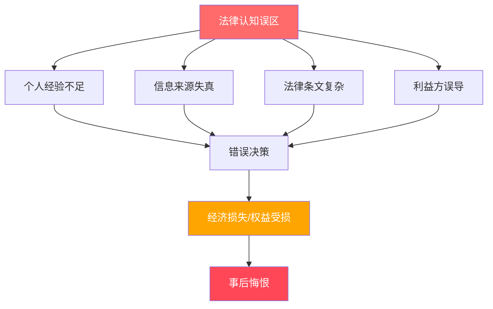
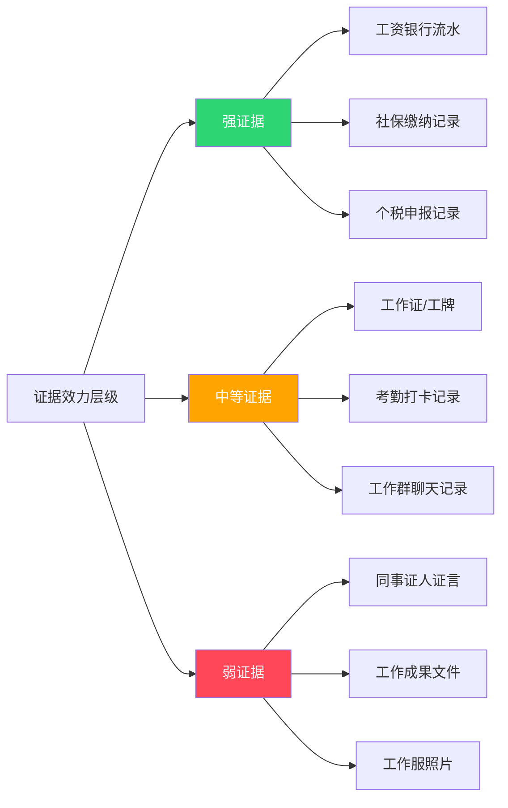
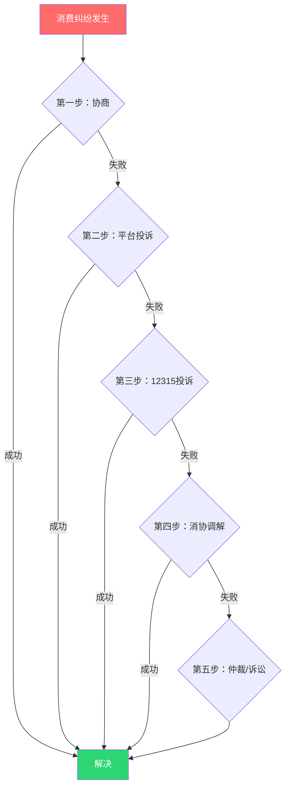
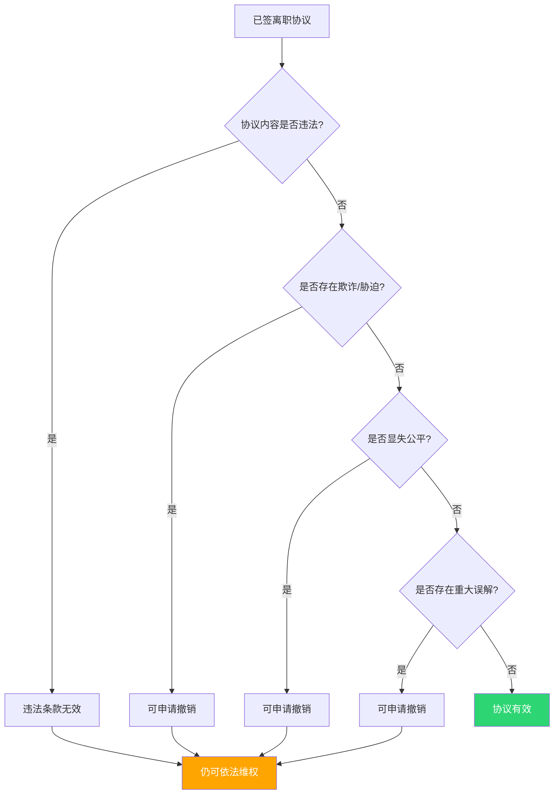
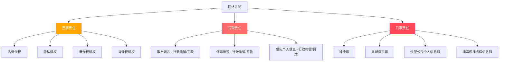

# 常见误区：十大法律认知误区深度解析

法律认知误区是普通人最容易踩的"隐形地雷"——你以为自己懂法，但实际认知与法律真实规定之间存在偏差。这种偏差在平时无感，一旦遇到纠纷就会让人付出真金白银的代价。本章系统拆解十个最高频的法律认知误区，每个误区都按照"错误认知→法律真相→底层逻辑→实操指南→避坑清单"的完整链条展开，让你不仅知道"是什么"，更理解"为什么"。

## 为什么法律误区如此普遍

法律误区的产生有深层的社会心理根源，理解这些根源有助于我们主动审视自己的法律认知：

| 误区来源 | 典型表现 | 示例 |
|---------|---------|------|
| **经验主义** | 用日常生活经验推断法律规则 | "我签字了就一定得认" |
| **道听途说** | 把个案当通则，把传言当法律 | "打了人就要坐牢" |
| **影视剧误导** | 把戏剧化的法律情节当真实程序 | "律师在法庭上慷慨陈词就能翻盘" |
| **历史遗留** | 法律已修订但旧观念仍在流传 | "分居两年自动离婚" |
| **利益驱动** | 有利一方故意传播错误信息 | "试用期可以随便辞退" |
| **信息过载** | 看过法律条文但理解片面 | "民间借贷利率不受限制" |

---

## 误区一：试用期可以随意辞退员工

### 错误认知

很多劳动者和用人单位都认为，试用期内用人单位可以随意解除劳动合同，不需要任何理由。用人单位觉得"试用期就是考察期，不满意就走人"；劳动者也默认"试用期没有保障，被辞退只能认栽"。

### 法律真相

《劳动合同法》第二十一条明确规定：在试用期中，除劳动者有本法第三十九条和第四十条第一项、第二项规定的情形外，用人单位不得解除劳动合同。用人单位在试用期解除劳动合同的，应当向劳动者说明理由。

这意味着试用期辞退的法定条件非常严格，用人单位必须同时满足以下全部要件：

| 要件 | 具体要求 | 常见违规情形 |
|------|---------|-------------|
| **录用条件事先告知** | 必须在入职前或入职时书面告知，不能事后补设 | 只口头说了大概要求，没有书面文件 |
| **考核标准客观明确** | 不能用"态度不好""感觉不行"等主观评价 | 考核表全是主观打分，没有客观指标 |
| **不符合条件的证据充分** | 需要具体的事实和记录支撑 | 没有日常工作记录，辞退时临时拼凑 |
| **辞退时间在试用期内** | 必须在试用期届满前作出并送达 | 试用期过了才说不合格 |
| **告知工会（如有）** | 用人单位建有工会的应当事先通知工会 | 直接通知员工，跳过工会程序 |

### 底层逻辑

试用期的法律本质是"附条件的正式劳动关系"，而不是"无保障的临时用工"。立法者设计试用期制度的目的是让双方互相了解，但这种了解必须建立在合法、公平的基础上。用人单位享有解除权的前提是——你事先告诉了人家标准是什么，然后用证据证明人家确实没达到。

### 赔偿计算

如果用人单位违法辞退试用期员工，劳动者有两个选择：

1. **要求继续履行合同**：恢复劳动关系，补发期间工资
2. **要求支付赔偿金**：经济补偿金的二倍

赔偿金计算公式：

赔偿金 = 月工资 × 工作年限（不满半年按0.5年算）× 2

例如：试用期3个月被违法辞退，月工资8000元：

赔偿金 = 8000 × 0.5 × 2 = 8000元

### 避坑清单

**劳动者端**：
- [ ] 入职时索要书面录用条件和考核标准
- [ ] 试用期内保留工作成果、沟通记录
- [ ] 被辞退时要求书面通知并写明具体理由
- [ ] 不要在任何"自愿离职"文件上签字
- [ ] 收到辞退通知后一年内申请劳动仲裁

**用人单位端**：
- [ ] 在offer或劳动合同中明确录用条件
- [ ] 建立试用期考核表，包含量化指标
- [ ] 考核过程中及时记录并让员工签字确认
- [ ] 辞退决定需要在试用期届满前作出
- [ ] 有工会的需事先通知工会并保留通知记录

---

## 误区二：没签劳动合同就没有劳动关系

### 错误认知

许多劳动者认为，如果没有签订书面劳动合同，自己和公司之间就不存在劳动关系，权益不受保护。一些用人单位也利用这种误解故意不签合同，以为这样可以规避用工责任。

### 法律真相

《劳动合同法》第七条规定：用人单位自用工之日起即与劳动者建立劳动关系。劳动关系的建立以**实际用工**为准，而不是以签订劳动合同为准。即使没有签订书面劳动合同，只要存在实际用工事实，劳动关系就已经成立。

更关键的惩罚性条款——《劳动合同法》第八十二条：

用人单位自用工之日起超过一个月不满一年未与劳动者订立书面劳动合同的，
应当向劳动者每月支付二倍的工资。

也就是说，不签合同对用人单位来说不是"省事"，而是"赔钱"。

### 举证策略

没有书面合同时，需要通过其他证据构建"证据链"来证明劳动关系。证据效力有高低之分：

**关键技巧**：单一证据的证明力有限，建议至少收集3类以上不同类型的证据形成证据链。例如：银行流水（证明工资发放）+ 工作群聊天记录（证明接受管理）+ 考勤记录（证明日常工作），三者相互印证，形成完整的证据闭环。

### 二倍工资的计算规则

| 情形 | 法律后果 |
|------|---------|
| 入职1个月内未签 | 合法宽限期，无赔偿 |
| 入职1-12个月未签 | 应付二倍工资（最多11个月） |
| 入职满1年仍未签 | 视为已订立无固定期限劳动合同 |
| 入职超1年才主张 | 超过仲裁时效，可能丧失部分月份的赔偿权 |

**重要时效提醒**：二倍工资的仲裁时效为一年，从劳动者知道或应当知道权利被侵害之日起算。实践中，很多地方按"逐月起算"的方式计算时效，意味着你每晚一天主张，就可能多丧失一个月的赔偿。入职后应尽快主张权利。

### 避坑清单

- [ ] 入职当天就要求签书面劳动合同
- [ ] 合同签好后自己保留一份原件
- [ ] 如果公司拖延不签，立即开始收集工作证据
- [ ] 用手机拍摄工资条、工牌、工作群等证据
- [ ] 注意仲裁时效，别拖到超期

---

## 误区三：合同签字了就必须遵守

### 错误认知

很多人认为，合同一旦签字就具有完全的法律效力，无论合同内容如何都必须遵守。"白纸黑字你签了名，就得认"——这句话只说对了一半。

### 法律真相

合同的效力取决于内容是否合法。《民法典》建立了一套完整的合同效力评价体系：

| 效力状态 | 法律后果 | 典型情形 |
|---------|---------|---------|
| **有效** | 对双方有约束力 | 正常的买卖、租赁合同 |
| **无效** | 自始无效，无需履行 | 违反强制性法律规定、违背公序良俗 |
| **可撤销** | 可以选择撤销或继续履行 | 欺诈、胁迫、重大误解、显失公平 |
| **效力待定** | 需要追认才生效 | 无权代理、限制行为能力人签订 |

**无效合同/条款的具体类型**：

1. 违反法律、行政法规的强制性规定
2. 违背公序良俗
3. 恶意串通损害他人合法权益
4. 提供格式条款一方不合理地免除或减轻其责任、加重对方责任、限制对方主要权利
5. 无民事行为能力人实施的民事法律行为

**可撤销合同的具体类型**：

1. 因重大误解订立的合同
2. 一方以欺诈手段使对方在违背真实意思的情况下订立的合同
3. 一方利用对方处于危困状态、缺乏判断能力等致使合同显失公平
4. 一方或第三人以胁迫手段使对方在违背真实意思的情况下订立的合同

### 高频无效条款一览

以下是日常生活中最容易遇到的无效条款，即使你签了字也可以主张无效：

| 无效条款类型 | 常见表述 | 无效原因 |
|-------------|---------|---------|
| 放弃社保 | "员工自愿放弃缴纳社保" | 违反社保法强制性规定 |
| 放弃工伤赔偿 | "工伤自负，公司概不负责" | 排除劳动者法定权利 |
| 限制怀孕 | "入职三年内不得怀孕" | 违反妇女权益保障法 |
| 无限竞业限制 | "离职后终身不得从事同行业" | 竞业限制期限不得超过2年 |
| 高额违约金 | "提前离职赔偿10万" | 除培训费和竞业限制外不得约定违约金 |
| 免除人身损害责任 | "本活动风险自担，组织者免责" | 人身损害免责条款无效 |

### 诉讼时效提醒

撤销权有时间限制：
- 重大误解：自知道或应当知道之日起90日内
- 欺诈/胁迫：自知道或应当知道之日起1年内
- 显失公平：自合同成立之日起1年内
- 最长保护期：自合同成立之日起5年

### 避坑清单

- [ ] 签合同前逐条阅读，重点关注免责条款和违约金条款
- [ ] 格式合同中的加粗、加黑条款要特别注意
- [ ] 发现不合理条款当面提出修改，不要"先签了再说"
- [ ] 签字后保留一份合同原件
- [ ] 已签的有问题的合同，在法定时效内主张撤销

---

## 误区四：民间借贷利息随便约定

### 错误认知

很多人认为，民间借贷的利息可以由双方自由约定，只要双方同意就行。出借人觉得"利息高低是我的自由"，借款人觉得"我签了字就认了"。

### 法律真相

民间借贷利率受法律严格限制。最高人民法院《关于审理民间借贷案件适用法律若干问题的规定》明确：

民间借贷利率上限 = 合同成立时一年期LPR × 4

以2024年一年期LPR（3.45%）为例，利率上限约为13.8%。超过部分的利息不受法律保护。

### 利率红线对照表

| 利率区间 | 法律效力 | 后果 |
|---------|---------|------|
| 0 ~ LPR×4（约13.8%） | 合法有效 | 约定利率受法律保护 |
| LPR×4以上 | 超过部分无效 | 已付的超额利息可抵扣本金或要求返还 |
| 无约定利率 | 视为无息借款 | 出借人主张利息不予支持 |
| 约定不明 | 视为无息借款 | 自然人之间借贷推定为无息 |

### 民间借贷合同无效的情形

以下情形下，整个借贷合同无效（不只是利息无效）：

1. **套取金融机构贷款转贷**：用信用卡套现、银行贷款等转借给他人
2. **非法资金转贷**：用向其他营利法人借贷、向本单位职工集资、向公众非法吸收存款等方式取得的资金转贷
3. **非法放贷**：未依法取得放贷资格的出借人，以营利为目的向社会不特定对象提供借款
4. **违法犯罪目的**：出借人事先知道或应当知道借款人借款用于违法犯罪活动仍然提供借款

### 利息计算实操

**案例**：张三借给李四10万元，约定年利率24%，借期1年。

约定利息 = 100,000 × 24% = 24,000元
合法利息 = 100,000 × 13.8% = 13,800元
超出部分 = 24,000 - 13,800 = 10,200元（不受法律保护）

如果李四已经支付了24,000元利息，李四可以向法院起诉要求返还10,200元超出部分。

**注意**：LPR每月公布一次，利率上限会随之浮动。签订借贷合同时应查看当月LPR数值。可在"中国人民银行官网"查询最新LPR。

### 避坑清单

- [ ] 借款前查询当月LPR，计算合法利率上限
- [ ] 借条上明确写清利率、还款期限、还款方式
- [ ] 不要用信用卡套现或银行贷款转借他人
- [ ] 已付超额利息可以主张抵扣本金
- [ ] 保留转账记录，现金交付需有见证人

---

## 误区五：消费者维权一定要打官司

### 错误认知

很多消费者认为，遇到消费纠纷只能通过打官司来解决，而打官司费时费钱，所以选择忍气吞声。这种"维权恐惧症"让消费者放弃了本应得到的赔偿。

### 法律真相

消费维权有多种途径，诉讼只是最后的手段。实际上，80%以上的消费纠纷在投诉调解阶段就能解决。

### 各维权渠道详解

| 渠道 | 适用场景 | 响应时效 | 成本 | 成功率 |
|------|---------|---------|------|--------|
| **商家协商** | 一般性售后问题 | 即时~3天 | 零 | 高（正规商家） |
| **平台投诉** | 网购纠纷 | 1~7天 | 零 | 较高 |
| **12315投诉** | 所有消费纠纷 | 7~60天 | 零 | 中高 |
| **消协调解** | 复杂纠纷 | 30~60天 | 零 | 中等 |
| **行政举报** | 违法经营行为 | 不定 | 零 | 取决于违法程度 |
| **仲裁** | 有仲裁协议的纠纷 | 30~90天 | 低 | 较高 |
| **诉讼** | 其他途径均失败 | 3~6个月 | 中高 | 取决于证据 |

### 惩罚性赔偿制度

消费者权益保护法中最有力的武器是惩罚性赔偿制度：

| 情形 | 赔偿标准 | 最低金额 |
|------|---------|---------|
| 一般欺诈行为 | 退一赔三 | 500元 |
| 食品安全问题 | 退一赔十 | 1,000元 |
| 药品安全问题 | 退一赔十 | 1,000元 |
| 明知缺陷仍销售 | 实际损失×2以下 | 无最低限制 |

**实操计算示例**：

买到假货（一般商品欺诈），花费300元：
退款：300元
赔偿：300 × 3 = 900元（但不低于500元）
总计获赔：300 + 900 = 1,200元

买到过期食品，花费50元：
退款：50元
赔偿：50 × 10 = 500元（但不低于1000元）
总计获赔：50 + 1,000 = 1,050元

### 12315投诉实操指南

**线上投诉流程**：
1. 微信搜索"12315"小程序，或登录www.12315.cn
2. 注册并实名认证
3. 选择投诉类型（商品/服务）
4. 填写被投诉方信息（营业执照上的企业名称）
5. 详细描述问题，附上证据材料
6. 提交等待受理

**投诉成功率提升技巧**：
- 提供完整的购买凭证（发票、订单截图）
- 拍照保留商品问题的证据
- 描述问题要具体、客观，避免情绪化表达
- 引用具体法条增加专业性
- 明确诉求（退款、赔偿、道歉等具体金额）

### 避坑清单

- [ ] 购物时养成索要发票的习惯
- [ ] 发现问题第一时间拍照、录视频保留证据
- [ ] 先协商再投诉，逐级升级
- [ ] 善用12315小程序，比电话投诉更方便
- [ ] 了解惩罚性赔偿制度，大胆依法维权

---

## 误区六：口头承诺没有法律效力

### 错误认知

很多人认为，只有白纸黑字的书面承诺才有法律效力，口头承诺不算数。"口说无凭"成了很多人放弃维权的理由。

### 法律真相

《民法典》第四百六十九条规定：当事人订立合同，可以采用书面形式、口头形式或者其他形式。口头合同与书面合同在法律上具有同等效力。只要能证明口头承诺的存在和内容，它就具有法律约束力。

但"有效"和"能证明"是两回事。口头承诺最大的风险在于**举证困难**。

### 口头合同 vs 书面合同对比

| 对比维度 | 口头合同 | 书面合同 |
|---------|---------|---------|
| 法律效力 | 有效 | 有效 |
| 举证难度 | 极高 | 极低 |
| 争议发生率 | 高 | 低 |
| 适用场景 | 小额交易、即时清结 | 重要交易、长期关系 |
| 法律风险 | 难以证明具体内容 | 清晰明确 |

### 必须采用书面形式的合同

以下合同法律明确要求采用书面形式，口头约定不受保护或效力受限：

1. 借款合同（自然人之间另有约定的除外）
2. 租赁期限六个月以上的租赁合同
3. 建设工程合同
4. 技术开发合同
5. 融资租赁合同
6. 担保合同
7. 保证合同
8. 物业服务合同
9. 建设工程监理合同

### 口头承诺的证据保全策略

即使口头承诺本身无法改变，但可以通过以下方式固定证据：

| 方法 | 操作要点 | 证据效力 |
|------|---------|---------|
| **事后书面确认** | 口头谈好后发短信/微信确认："刚才我们说好的是XXX，对吧？" | 高（对方回复确认即形成书面证据） |
| **录音取证** | 征得同意后录音（一方同意即可，不需双方同意） | 中高 |
| **第三方见证** | 请无利害关系的人在场见证 | 中 |
| **即时通讯记录** | 微信/短信中的承诺本身就是电子证据 | 高 |
| **交易习惯佐证** | 证明双方此前一直按照某种方式交易 | 中 |

**录音取证的注意事项**：
- 录音者本人参与对话即可，不需要对方同意录音
- 录音不能通过窃听、偷录等非法方式获取
- 录音内容要清晰可辨，不能剪辑篡改
- 录音要保存原始载体（录音的手机/设备）

### 避坑清单

- [ ] 重要事项（金额超过1000元或涉及长期利益）一定要签书面合同
- [ ] 口头协商后立即用文字确认（微信/短信）
- [ ] 对方做出承诺时，自然地引导对方在文字中确认
- [ ] 保留所有聊天记录，不要删除对话
- [ ] 涉及重大利益的口头承诺，考虑录音备份

---

## 误区七：法律援助只给穷人

### 错误认知

许多人认为法律援助只是为极度贫困的人提供的服务，自己"不够穷"所以不符合条件，遇到法律问题只能自己扛。这种误解让大量中低收入群体错过了免费的法律帮助。

### 法律真相

《法律援助法》（2022年1月1日施行）大幅扩大了法律援助的覆盖范围。法律援助不只面向"极度贫困"的人，而是覆盖了大量中低收入群体和特定弱势群体。

### 法律援助覆盖范围

**经济困难公民可申请的事项**（需要符合当地经济困难标准）：

| 事项类型 | 具体内容 |
|---------|---------|
| 国家赔偿 | 依法请求国家赔偿 |
| 社保与救助 | 请求给予社会保险待遇或社会救助 |
| 抚恤金 | 请求发给抚恤金 |
| 赡养/抚养/扶养 | 请求给付赡养费、抚养费、扶养费 |
| 劳动权益 | 请求确认劳动关系或支付劳动报酬 |
| 民事行为能力 | 请求认定公民无民事行为能力或限制民事行为能力 |
| 人身损害 | 工伤事故、交通事故、食品药品安全事故、医疗事故人身损害赔偿 |
| 环境损害 | 请求环境污染、生态破坏损害赔偿 |

**不受经济困难条件限制的情形**（不需要证明穷就可以申请）：

1. 英雄烈士近亲属维护英烈人格权益
2. 因见义勇为行为主张民事权益
3. 再审改判无罪请求国家赔偿
4. 遭受虐待、遗弃或家庭暴力的受害人
5. 刑事案件中的犯罪嫌疑人、被告人（盲聋哑、未成年人、可能被判无期/死刑的必须有法律援助）

### 经济困难标准

各地的经济困难标准不同，通常是当地最低生活保障标准的1.5~2倍。以北京为例，2024年法律援助经济困难标准为家庭人均月收入低于2120元。但很多地区已经大幅放宽：

- 部分地区将标准提高到当地最低工资的2倍
- 军人军属、老年人、残疾人、未成年人等特殊群体有额外优待
- 部分省份对特定事项（如劳动争议、家暴）免审经济条件

### 获取法律帮助的全部渠道

| 渠道 | 费用 | 门槛 | 适用场景 |
|------|------|------|---------|
| **12348热线** | 免费 | 无门槛 | 法律咨询、了解援助条件 |
| **法律援助中心** | 免费 | 符合经济条件和事项范围 | 代理诉讼、仲裁 |
| **公共法律服务中心** | 免费 | 无门槛 | 现场法律咨询 |
| **村居法律顾问** | 免费 | 无门槛 | 基层法律问题 |
| **公益律师** | 免费/低价 | 一般无门槛 | 部分律所的公益服务 |
| **法律诊所** | 免费 | 一般无门槛 | 高校法学院的法律服务 |
| **法律服务所** | 低价 | 无门槛 | 基层法律服务工作者代理 |
| **律师咨询费** | 按次付费 | 无门槛 | 只咨询不代理，费用远低于全程委托 |

### 避坑清单

- [ ] 遇到法律问题第一时间拨打12348咨询
- [ ] 了解当地法律援助的经济困难标准
- [ ] 家暴、劳动争议等特定事项可能不需要审查经济条件
- [ ] 不符合条件法律援助的，还可以寻求公益律师帮助
- [ ] 善用公共法律服务中心的免费咨询

---

## 误区八：签了离职协议就不能维权

### 错误认知

许多劳动者在离职时被要求签署"离职协议"或"放弃一切权利声明"，认为签了这些文件就完全丧失了维权的可能。用人单位往往利用信息不对称和紧迫感，让劳动者在不公平的条件下签字。

### 法律真相

离职协议的效力不是绝对的。根据《民法典》和《劳动合同法》的规定，以下情形下的离职协议可以被认定为无效或可撤销：

| 情形 | 法律依据 | 效果 |
|------|---------|------|
| **显失公平** | 补偿金额明显低于法定标准 | 可撤销 |
| **欺诈** | 隐瞒真实情况诱导签字 | 可撤销 |
| **胁迫** | 以不签字就不发工资等相威胁 | 可撤销 |
| **重大误解** | 对协议内容存在重大误解 | 可撤销 |
| **违法条款** | 放弃社保、放弃工伤赔偿等 | 无效 |
| **排除主要权利** | "放弃一切权利"的笼统条款 | 可能无效 |

### 离职协议效力判断流程

### "放弃一切权利"条款的效力

很多用人单位喜欢在离职协议中写"员工放弃一切权利主张"这种笼统条款。司法实践中的主流观点是：

- **有效的部分**：双方在知情、自愿的基础上就已知权利达成的和解
- **无效的部分**：劳动者当时不可能知道的权利（如未发现的职业病、未发现的被侵权事实）
- **需审查的部分**：补偿金额是否明显低于法定标准

### 离职补偿的法定标准

判断离职协议是否"显失公平"，需要知道法定标准：

| 解除情形 | 经济补偿标准 | 赔偿金（违法解除） |
|---------|------------|-----------------|
| 协商解除（单位提出） | N个月工资 | 不适用 |
| 经济性裁员 | N个月工资 | 不适用 |
| 违法解除 | — | 2N个月工资 |
| 合同到期不续签（单位原因） | N个月工资 | 不适用 |

> N = 工作年限（不满半年按0.5计算，满半年不满一年按1计算）

**示例**：工作5年3个月，月工资10000元，被违法辞退：

法定赔偿金 = 10000 × 5.5 × 2 = 110,000元

如果离职协议只补偿了30,000元，明显低于法定标准，可以主张显失公平。

### 避坑清单

- [ ] 离职前了解自己应得的法定补偿标准
- [ ] 不要在压力下当场签字，要求带回家考虑
- [ ] 离职协议中有"放弃一切权利"等笼统表述的要警惕
- [ ] 金额较大的离职协议，签字前咨询律师
- [ ] 签字后保留一份协议原件
- [ ] 即使签了协议，如发现无效或可撤销情形，仍可在法定时效内申请仲裁

---

## 误区九：网络发言不受法律约束

### 错误认知

很多人认为，在网络上发表言论是匿名的、自由的，不需要承担法律责任。"网上骂人又不犯法""反正是虚拟世界"——这些想法在互联网法治时代已经完全过时。

### 法律真相

网络空间不是法外之地。网络言论可能触发三个层面的法律责任：

### 网络侵权的民事责任

| 侵权类型 | 典型行为 | 责任承担 |
|---------|---------|---------|
| **名誉侵权** | 发布不实信息损害他人名誉、公开指责他人但无证据 | 停止侵害、消除影响、赔礼道歉、赔偿损失（含精神损害赔偿） |
| **隐私侵权** | 公开他人住址、电话、照片、病历等私人信息 | 停止侵害、赔偿损失 |
| **著作权侵权** | 未经授权转载他人文章、图片、视频 | 停止侵害、赔偿损失 |
| **肖像权侵权** | 未经同意使用他人照片做表情包或商业用途 | 停止侵害、赔偿损失 |

### 行政处罚的法律依据

《治安管理处罚法》第四十二条：

公然侮辱他人或者捏造事实诽谤他人的，
处五日以下拘留或者五百元以下罚款；
情节较重的，处五日以上十日以下拘留，可以并处五百元以下罚款。

《网络安全法》和《个人信息保护法》对散布谣言、侵犯个人信息等行为也有明确的行政处罚规定。

### 刑事责任的边界

| 罪名 | 构成要件 | 量刑 |
|------|---------|------|
| **诽谤罪** | 捏造事实诽谤他人，情节严重 | 三年以下有期徒刑（告诉才处理） |
| **寻衅滋事罪** | 在网络上散布谣言起哄闹事 | 五年以下有期徒刑 |
| **侵犯公民个人信息罪** | 非法获取、出售、提供个人信息 | 三年以下或三至七年有期徒刑 |
| **编造传播虚假信息罪** | 编造虚假险情、疫情、灾情、警情 | 三年以下有期徒刑 |

**重要变化**：2023年最高法、最高检明确，网络诽谤"严重危害社会秩序"的，可以由公安机关立案侦查（公诉），不再需要被害人自诉。这意味着严重网络诽谤行为可能直接被追究刑事责任。

### "人肉搜索"的法律风险

"人肉搜索"不是正义行为，而是多重违法：

1. **侵犯隐私权**：公开他人个人信息
2. **侵犯名誉权**：往往伴随着侮辱性评价
3. **侵犯个人信息权**：违反《个人信息保护法》
4. **可能构成犯罪**：组织化的人肉搜索可能构成侵犯公民个人信息罪

### 避坑清单

- [ ] 发表言论前问自己：能证明这是真的吗？
- [ ] 不转发、不传播未经证实的消息
- [ ] 不公开任何人的私人信息（包括截图中的个人信息）
- [ ] 批评指名道姓的个人时要特别谨慎，必须有证据
- [ ] 转载他人作品需注明出处并尽可能获得授权
- [ ] 被网络侵权时及时截图保全证据

---

## 误区十：打官司一定要请律师

### 错误认知

很多人认为，打官司一定要请律师，而律师费高昂，所以普通人"打不起官司"，有理也不敢去法院。

### 法律真相

中国的法律制度下，聘请律师代理诉讼并非强制性要求。当事人完全有权自行参加诉讼（法律术语叫"自行诉讼"）。法院的诉讼程序设计也考虑了普通人的可操作性。

### 哪些情况可以不请律师

| 案件类型 | 不请律师的理由 | 难度评级 |
|---------|--------------|---------|
| 小额债务纠纷 | 事实简单，证据直观 | ★☆☆☆☆ |
| 简单交通事故赔偿 | 责任明确，赔偿标准明确 | ★★☆☆☆ |
| 劳动争议案件 | 程序相对简单，劳动仲裁委有指导 | ★★☆☆☆ |
| 消费者维权案件 | 事实清楚，法律适用简单 | ★★☆☆☆ |
| 小额诉讼程序案件 | 标的额小，一审终审 | ★☆☆☆☆ |
| 简单离婚案件（无财产争议） | 当事人直接表达意愿即可 | ★★☆☆☆ |

### 哪些情况必须请律师

| 案件类型 | 请律师的理由 | 风险评级 |
|---------|-------------|---------|
| 刑事案件 | 后果严重，程序复杂 | ★★★★★ |
| 涉及大额财产的案件 | 金额越大，请律师越划算 | ★★★★☆ |
| 复杂的合同纠纷 | 法律关系复杂，证据多 | ★★★★☆ |
| 对方有律师的案件 | 法庭上的信息不对称 | ★★★☆☆ |
| 知识产权案件 | 专业性强，技术性高 | ★★★★☆ |
| 公司股权纠纷 | 公司法与合同法交叉 | ★★★★☆ |

### 自行诉讼实操指南

**第一步：了解管辖法院**
一般规则：被告住所地法院
合同纠纷：合同履行地或被告住所地法院
侵权纠纷：侵权行为地或被告住所地法院

**第二步：准备起诉材料**
- 起诉状（原告、被告信息，诉讼请求，事实与理由）
- 证据材料（复印件）
- 原告身份证明
- 如委托代理人，需要授权委托书

**第三步：网上立案**
- 登录"人民法院在线服务"小程序或当地法院网上立案系统
- 按提示填写信息、上传材料
- 等待法院审核通知

**第四步：参加庭审**
- 准时到庭，带好身份证和证据原件
- 遵守法庭纪律
- 如实陈述事实，不要夸大或隐瞒
- 法官提问时直接回答，不懂可以问

### 降低法律服务成本的六种方法

| 方法 | 费用范围 | 适用场景 |
|------|---------|---------|
| **法律援助** | 完全免费 | 符合经济困难条件 |
| **12348热线咨询** | 免费 | 了解法律问题、获取初步建议 |
| **律师咨询费** | 200~500元/次 | 只需咨询意见，自己参加诉讼 |
| **法律服务所** | 低于律所50%以上 | 基层简单案件 |
| **风险代理** | 胜诉后按比例收费 | 经济纠纷案件（当事人暂时无力支付律师费） |
| **律师调解** | 费用低于诉讼 | 双方有调解意愿的案件 |

**风险代理的注意事项**：
- 不是所有案件都能风险代理（刑事诉讼、行政诉讼、国家赔偿等不适用）
- 风险代理的收费比例有上限（标的额的30%以内）
- 要签订书面的风险代理合同
- 仔细阅读合同中关于"败诉"情况下的费用承担条款

### 避坑清单

- [ ] 先评估案件复杂度，简单案件可以自行诉讼
- [ ] 即使自行诉讼，也建议在起诉前咨询律师
- [ ] 善用网上立案系统，减少跑法院的次数
- [ ] 经济困难的优先申请法律援助
- [ ] 请律师前货比三家，了解收费标准
- [ ] 签律师委托合同前仔细阅读费用条款

---

## 总结：法律认知升级路线图

以上十个误区涵盖了劳动法、合同法、消费者权益保护法、网络法、诉讼程序等普通人最常接触的法律领域。纠正这些误区不是一次性的事，而是一个持续的认知升级过程。

### 遇到法律问题的决策框架

当你遇到法律问题时，按照以下框架决策：

1. 冷静评估：这件事涉及什么法律关系？（劳动/合同/消费/侵权/...）
2. 基础查询：先搜索相关法律规定，了解自己的权利义务
3. 证据收集：立即固定和保全所有相关证据
4. 专业咨询：拨打12348或咨询律师，获取专业意见
5. 路径选择：根据案件情况选择协商→投诉→调解→仲裁→诉讼的合适层级
6. 行动执行：不要拖延，注意诉讼时效

> 💡 **核心原则**：法律保护的是懂法且积极维权的人。学习法律常识不是为了成为法律专家，而是为了在需要时知道如何保护自己。知道有哪些误区存在，就是避免踩坑的第一步。
