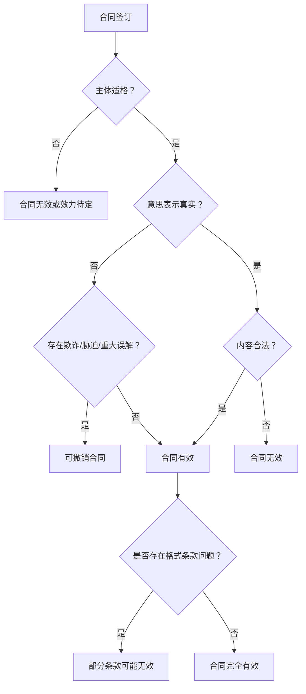
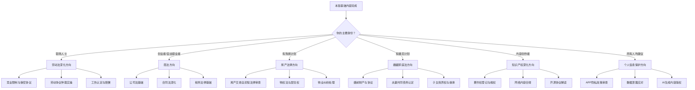

# 本章小结：法律常识核心要点与行动清单

本章从法律体系概述到具体维权实操，系统覆盖了公民日常生活中最常接触的六大法律领域。本小结不是简单的重复，而是将全章内容提炼为可执行的知识框架——帮助你把"学过"变成"能用"。

## 一、六大法律领域核心要点

### 1. 法律体系与民法基础

法律体系是所有具体法律知识的底座。理解法律的层级结构，才能在遇到问题时快速定位该适用哪部法律。

**知识体系层次：**

宪法（最高法律效力）
  ├── 法律（全国人大及其常委会制定）
  │     ├── 民法典 → 物权、合同、人格权、婚姻家庭、继承、侵权
  │     ├── 劳动法 / 劳动合同法
  │     ├── 消费者权益保护法
  │     ├── 知识产权法（著作权法、专利法、商标法）
  │     └── 网络安全法 / 个人信息保护法
  ├── 行政法规（国务院制定）
  └── 地方性法规（地方人大制定）

**民法典核心要点回顾：**

| 制度 | 核心规则 | 日常应用场景 |
|------|---------|------------|
| 民事主体 | 自然人权利能力始于出生终于死亡；8周岁以上为限制行为能力人 | 未成年人签合同效力问题 |
| 物权制度 | 不动产登记生效，动产交付生效；善意取得需支付合理对价 | 购房、二手车交易 |
| 合同制度 | 要约+承诺=合同成立；生效需主体适格+意思真实+不违法 | 任何合同签订场景 |
| 侵权责任 | 过错责任为原则，无过错责任为法定 | 交通事故、产品缺陷 |
| 诉讼时效 | 普通3年，最长20年；时效届满不消灭权利但丧失胜诉权 | 债务追讨、损害赔偿 |

**关键数字速查：**

- 民事行为能力年龄线：8周岁（限制行为能力）、18周岁（完全行为能力）
- 普通诉讼时效：3年
- 最长权利保护期：20年
- 诉讼时效中止：最后6个月内发生不可抗力等事由
- 诉讼时效中断：权利人主张权利、义务人同意履行、提起诉讼或仲裁

### 2. 劳动法核心要点

劳动关系是大多数人一生中持续时间最长、影响最深的法律关系。劳动法的核心逻辑是倾斜保护——在劳动者与用人单位的力量不对等关系中，法律向劳动者一方倾斜。

**劳动合同签订要点：**

| 事项 | 法律规定 | 违规后果 |
|------|---------|---------|
| 签订时间 | 用工之日起1个月内 | 超期未签，用人单位支付双倍工资（最多11个月） |
| 试用期上限 | 合同期<1年：1个月；1-3年：2个月；≥3年或无固定：6个月 | 超出部分按转正工资补差 |
| 试用期工资 | ≥约定工资的80% 且 ≥当地最低工资标准 | 补足差额 |
| 合同形式 | 书面形式，双方各执一份 | 劳动者可要求补签 |

**加班费计算公式：**

日工资 = 月工资 ÷ 21.75
时工资 = 日工资 ÷ 8

工作日加班 = 时工资 × 加班小时数 × 150%
休息日加班 = 时工资 × 加班小时数 × 200%（不能补休时）
法定节假日加班 = 时工资 × 加班小时数 × 300%（不能以补休替代）

**经济补偿金计算：**

经济补偿 = 工作年限 × 月平均工资

规则：
- 每满1年 → 支付1个月工资
- 6个月以上不满1年 → 按1年计算
- 不满6个月 → 支付半个月工资
- 月工资上限：当地职工月平均工资3倍
- 补偿年限上限：最高不超过12年（高收入者）

**劳动者可即时解除合同并获得经济补偿的法定情形：**

1. 用人单位未按约定提供劳动保护或劳动条件
2. 用人单位未及时足额支付劳动报酬
3. 用人单位未依法缴纳社会保险费
4. 用人单位规章制度违法，损害劳动者权益
5. 用人单位以欺诈、胁迫手段或乘人之危订立劳动合同
6. 用人单位以暴力、威胁或非法限制人身自由强迫劳动

**社保与公积金：**

| 险种 | 个人缴费比例（约） | 单位缴费比例（约） | 关键说明 |
|------|-------------------|-------------------|---------|
| 养老保险 | 8% | 16% | 累计缴满15年可领养老金 |
| 医疗保险 | 2% | 8-10% | 断缴次月起无法报销（各地政策不同） |
| 失业保险 | 0.5% | 0.5% | 缴满1年非自愿失业可领取 |
| 工伤保险 | 0 | 0.2-1.9% | 全部由单位承担 |
| 生育保险 | 0 | 0.5-1% | 全部由单位承担（已并入医保） |
| 住房公积金 | 5-12% | 5-12% | 双方比例一致，最高12% |

> **重要提醒：** "自愿放弃社保"协议无效，这是法律的强制性规定。即使劳动者签字同意，用人单位仍有缴纳义务，劳动者可随时要求补缴。

### 3. 合同法核心要点

合同是民事活动中最重要的法律工具。合同法的核心不是"签字画押"，而是理解合同从成立到履行到违约的完整生命周期。

**合同效力判定流程：**

**格式条款审查清单：**

签订任何含有格式条款的合同（如银行协议、保险合同、APP用户协议、培训合同），重点检查以下内容：

- [ ] 是否存在不合理免除己方责任的条款
- [ ] 是否存在加重对方责任的条款
- [ ] 是否存在排除对方主要权利的条款
- [ ] 是否以显著方式提请注意（加粗、加大字号、单独页面）
- [ ] 违约金是否明显过高（超过实际损失的30%可请求法院调低）
- [ ] 争议解决条款是否约定在己方所在地管辖

**违约责任四种形式：**

| 形式 | 适用条件 | 注意事项 |
|------|---------|---------|
| 继续履行 | 有履行可能且有必要 | 法律上或事实上不能履行的除外 |
| 采取补救措施 | 质量不符合约定 | 可要求修理、更换、重作、退货、减价 |
| 赔偿损失 | 存在实际损失 | 赔偿额=实际损失+可预见的可得利益 |
| 支付违约金 | 合同有约定 | 过高可请求调低，过低可请求调高 |

### 4. 消费者权益保护要点

消费者权益保护法是每个消费者都应该了解的法律——因为你每天都在消费。

**消费者九大权利速查表：**

| 权利 | 核心含义 | 典型侵害场景 |
|------|---------|------------|
| 安全权 | 人身、财产安全不受损害 | 产品缺陷导致人身伤害 |
| 知情权 | 知悉商品/服务的真实情况 | 虚假宣传、隐瞒重要信息 |
| 自主选择权 | 自主选择商品/服务 | 强制搭售、限定交易 |
| 公平交易权 | 获得质量保障、价格合理等 | 价格欺诈、缺斤短两 |
| 求偿权 | 受到损害时获得赔偿 | 商家拒绝退换问题商品 |
| 结社权 | 依法成立消费者组织 | — |
| 获得知识权 | 获得消费和权益保护知识 | — |
| 受尊重权 | 人格尊严、民族习惯受尊重 | 搜身、歧视性服务 |
| 个人信息权 | 个人信息受保护 | 泄露消费者个人信息 |

**惩罚性赔偿制度：**

一般商品欺诈 → 退一赔三（赔偿金额不足500元的按500元计算）
食品药品欺诈 → 退一赔十（赔偿金额不足1000元的按1000元计算）
食品药品缺陷 → 可向生产者或经营者要求赔偿损失 + 惩罚性赔偿

**维权途径成本-效果对比：**

| 途径 | 成本 | 效果 | 适用场景 | 时效 |
|------|------|------|---------|------|
| 与商家协商 | 最低 | 不确定 | 金额小、证据充分 | 随时 |
| 12315投诉 | 低 | 高（有行政压力） | 大多数消费纠纷 | 2年 |
| 消协调解 | 低 | 中 | 双方愿意调解 | 随时 |
| 行政投诉 | 低 | 高 | 经营者违法行为 | 2年 |
| 仲裁 | 中 | 高（一裁终局） | 合同有仲裁条款 | 1年 |
| 诉讼 | 高 | 最高（强制执行） | 金额大、对方不配合 | 3年 |

**网购特殊规则：**

- 七天无理由退货：自收到商品之日起7天内，无需说明理由即可退货
- 不适用七天无理由退货的商品：定制商品、鲜活易腐商品、在线下载或拆封的数字商品、交付的报纸期刊
- 退款时限：经营者应在收到退回商品之日起7日内退还货款

### 5. 知识产权要点

在数字经济时代，你既是知识产权的消费者，也可能随时成为知识产权的创造者。了解基本规则，既能保护自己的创作成果，也能避免无意侵权。

**三种知识产权对比：**

| 维度 | 著作权 | 专利权 | 商标权 |
|------|--------|--------|--------|
| 保护对象 | 文学、艺术、科学作品 | 发明创造 | 商品/服务标识 |
| 取得方式 | 自动取得（创作完成即享有） | 申请授权 | 申请注册 |
| 保护期限 | 人身权永久；财产权：作者终生+死后50年 | 发明20年，实用新型10年，外观设计15年 | 10年，可续展 |
| 合理使用 | 个人学习研究欣赏、适当引用等 | 非商业目的的科学研究 | — |
| 登记效力 | 非必要但有证据效力 | 必须申请 | 必须注册 |

**著作权自动取得的常见场景：**

- 你拍的每一张照片（包括手机随拍）
- 你写的每一篇文章、博客、朋友圈长文
- 你写的每一段代码
- 你画的每一幅画、做的每一个设计
- 你录制的视频、音频
- 你编写的软件

> **注意：** 创意和想法不受著作权保护，只有以某种形式表达出来的作品才受保护。"我想到了一个绝妙的APP点子"——这个想法本身不受保护；但你写出来的商业计划书、设计稿、代码，都受著作权保护。

**避免知识产权侵权的实用建议：**

1. **图片使用**：不要从搜索引擎直接下载图片使用。使用免费商用图库（如Unsplash、Pexels、Pixabay）或购买正版图片
2. **字体使用**：微软雅黑只能用于屏幕显示，商业印刷需购买授权。推荐使用开源字体（思源黑体、思源宋体）
3. **音乐使用**：短视频配乐使用平台自带曲库，或使用无版权音乐网站
4. **代码使用**：注意开源协议类型（MIT、Apache、GPL等），GPL协议要求衍生作品也开源
5. **文章转载**：转载需获得作者授权并注明出处，部分平台有"禁止转载"声明

### 6. 网络安全与个人信息保护

随着《个人信息保护法》的实施，个人信息保护已成为公民的重要法律权利。

**个人信息处理的基本原则：**

- 合法、正当、必要、诚信原则
- 目的明确原则——只能用于收集时告知的目的
- 最小必要原则——只收集实现目的所必需的信息
- 准确性原则——保证信息准确完整
- 安全保障原则——采取必要措施防止泄露

**你有权要求APP运营者做的事：**

| 权利 | 法律依据 | 操作方法 |
|------|---------|---------|
| 知情权 | 个人信息保护法第17条 | APP首次运行时应展示隐私政策 |
| 决定权 | 个人信息保护法第44条 | 可拒绝非必要权限的授权 |
| 查阅复制权 | 个人信息保护法第45条 | 向运营者申请查阅、复制个人信息 |
| 更正补充权 | 个人信息保护法第46条 | 发现信息有误时要求更正 |
| 删除权 | 个人信息保护法第47条 | 撤回同意、注销账号时要求删除 |
| 拒绝自动化决策权 | 个人信息保护法第24条 | 拒绝仅通过自动化决策作出的决定 |

## 二、关键技能矩阵

通过本章的学习，你应当具备以下六项关键法律技能。每项技能标注了掌握程度和实践建议：

| 技能 | 能力描述 | 掌握标准 | 实践建议 |
|------|---------|---------|---------|
| 劳动合同审查 | 能检查劳动合同的关键条款是否合法合理 | 逐条对照法律规定审查自己的劳动合同 | 入职或续签合同时实际操作一次 |
| 合同风险识别 | 能识别格式合同中的陷阱和不合理条款 | 能判断哪些条款可能无效或可撤销 | 用审查清单审视一份已签合同 |
| 经济补偿计算 | 能计算应得的经济补偿金、加班费、年假工资 | 准确运用公式计算且理解各项参数含义 | 用自己真实工资数据做一次计算 |
| 消费维权操作 | 知道通过正确渠道维护消费者权益 | 清楚12315投诉流程和惩罚性赔偿条件 | 在12315平台完成一次体验操作 |
| 法律信息检索 | 能查找法律法规、案例和政策 | 能在官方平台查到相关法律条文 | 检索一部与自己相关的法律 |
| 证据保全意识 | 了解哪些材料可作为法律证据并妥善保存 | 养成重要沟通留痕、关键文件备份的习惯 | 整理一份个人重要文件清单 |

## 三、法律风险防范总原则

贯穿全章的五条核心原则，是法律常识的"道"——具体的法条会修订，但这些原则不会过时：

### 原则一：事前预防优于事后救济

在问题发生之前投入10分钟审查合同，胜过问题发生后花费10个月打官司。养成以下习惯：

- 签任何合同前至少通读一遍，重点条款逐字审查
- 大额交易前查询对方企业信息（国家企业信用信息公示系统）
- 重要口头约定事后以书面（微信消息即可）确认

### 原则二：书面证据优于口头约定

口头约定在法律上有效，但举证极其困难。养成以下习惯：

- 重要对话通过微信/邮件留下文字记录
- 口头承诺事后发消息确认："刚才你说的XX，我理解是YY，对吗？"
- 借钱必须写借条，写明借款金额、利息、还款日期、借款人签字和日期
- 拍照/截图保存：合同原件、工资条、考勤记录、重要通知

### 原则三：专业咨询优于自行判断

法律常识能帮你识别问题、做初步判断，但复杂问题必须咨询专业人士：

- 劳动争议：先咨询当地劳动监察大队（免费）或12348法网
- 合同纠纷：标的额超过月收入3倍建议咨询律师
- 人身伤害：建议咨询律师，多数律师首次咨询免费
- 法律援助：经济困难者可申请法律援助（12348热线）

### 原则四：及时行动优于拖延等待

法律有时效限制，拖延可能丧失权利：

| 权利类型 | 时效期限 | 起算时间 |
|---------|---------|---------|
| 一般民事权利 | 3年 | 知道或应当知道权利被侵害之日 |
| 劳动仲裁 | 1年 | 知道或应当知道权利被侵害之日 |
| 人身损害赔偿 | 3年 | 受伤之日或确诊之日 |
| 产品缺陷损害 | 3年 | 知道或应当知道损害之日 |
| 最长保护期 | 20年 | 权利被侵害之日 |

### 原则五：持续学习优于一知半解

法律法规会修订更新（如《民法典》2021年取代了原有的多部民事法律），保持学习习惯：

- 关注"中国普法"等官方公众号获取最新法律资讯
- 重大法律修订时了解对自身的影响
- 遇到新类型的法律问题时主动学习相关知识

## 四、行动清单

### 立即行动（本周内完成）

- [ ] 检查自己是否持有劳动合同原件（没有则向公司索要）
- [ ] 登录当地社保官网或APP核实社保缴纳情况
- [ ] 查询公积金账户余额和缴纳记录
- [ ] 收藏以下网站：12348中国法网、12315平台、国家企业信用信息公示系统、中国裁判文书网
- [ ] 打开手机设置，检查已安装APP的权限设置，关闭不必要的权限

### 短期行动（一个月内完成）

- [ ] 完整审查自己的劳动合同，对照"劳动合同签订要点"表格逐项检查
- [ ] 了解所在城市当年的最低工资标准和社保缴费基数上下限
- [ ] 用自己真实工资数据计算一次：应得加班费、应缴社保金额、年休假天数
- [ ] 阅读一本法律入门书籍（推荐：罗翔《法治的细节》或《民法典与日常生活》）
- [ ] 在12348中国法网完成一次在线法律咨询体验

### 中期行动（三个月内完成）

- [ ] 整理个人重要法律文件清单并备份（劳动合同、房产证、保单、借条等）
- [ ] 审查自己签订的所有重要合同（租房合同、保险合同、贷款合同等），用格式条款审查清单逐项检查
- [ ] 建立个人法律知识卡片库（可以用备忘录、Notion等工具），将常用法条和维权流程整理存档
- [ ] 了解所在区县的法律援助中心地址和联系方式
- [ ] 了解并关注2-3个可靠的法律信息来源（公众号、网站或播客）

## 五、延伸学习路径

完成本章基础内容后，根据你的个人情况选择一个方向深入学习：

**各方向推荐学习资源：**

| 方向 | 推荐书籍 | 推荐平台 |
|------|---------|---------|
| 劳动法深化 | 《劳动法实务精要》 | 中国裁判文书网（检索劳动争议案例） |
| 商法方向 | 《创业法律手册》 | 国家企业信用信息公示系统 |
| 房产法律 | 《买房的法律常识》 | 当地住建局官网 |
| 婚姻家庭法 | 《民法典婚姻家庭编解读》 | 12348中国法网 |
| 知识产权 | 《知识产权法入门》 | 中国知识产权局官网 |
| 个人信息保护 | 《个人信息保护法解读》 | 国家互联网信息办公室官网 |

## 六、核心理念

> **法律保护的是懂法且积极行动的人。** 学习法律常识不是为了成为律师，而是为了在需要时知道如何保护自己——知道权利边界在哪里，知道维权通道怎么走，知道什么情况下该找专业人士。

> **三条铁律：** 事前预防优于事后救济，书面证据优于口头约定，专业咨询优于自行判断。这三条原则能帮你规避80%以上的法律风险。

> **保持敬畏：** 既不做违法的事，也不让自己的权益被违法侵害。法律是公民最可靠的权利盾牌，前提是你愿意拿起它。
