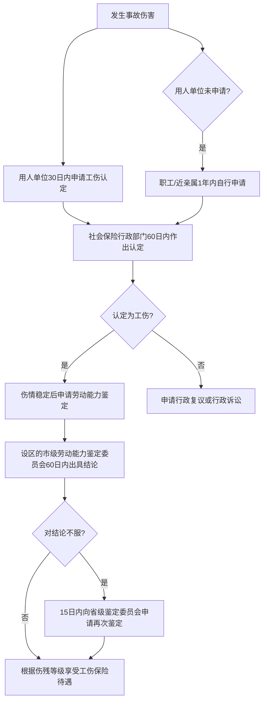
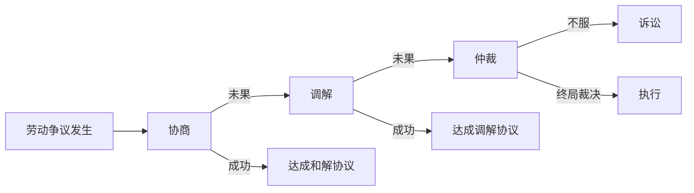
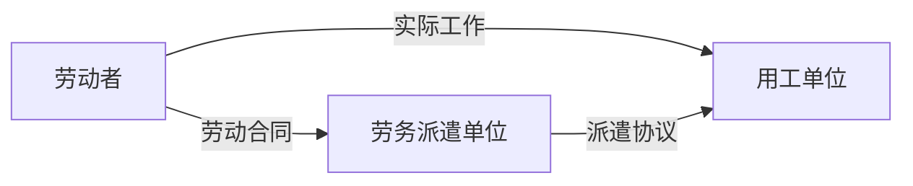

## 一、劳动权益保护实操方案

劳动关系是绝大多数人一生中最重要的法律关系之一。从拿到录用通知到最终离职，每一个环节都涉及复杂的权利义务关系。本方案按照"入职→在职→离职→争议解决"的完整生命周期，提供一套可直接执行的权益保护指南，覆盖合同签订、薪酬保障、工时休假、工伤处理、经济补偿、劳动仲裁等全部核心环节。

### 1.1 入职阶段的权益保护

入职阶段是建立劳动关系的起点，也是最容易埋下隐患的阶段。许多劳动纠纷的根源都可以追溯到入职时合同条款的疏忽。

#### 1.1.1 劳动合同签订的检查清单

《劳动合同法》第十条明确规定：建立劳动关系，应当订立书面劳动合同。已建立劳动关系、未同时订立书面劳动合同的，应当自用工之日起一个月内订立书面劳动合同。超过一个月不满一年未签的，用人单位应向劳动者每月支付二倍工资。

以下是签订劳动合同时必须逐项核查的要点：

**第一项：合同主体核实**

- 核实用人单位全称与营业执照一致，可通过"国家企业信用信息公示系统"（www.gsxt.gov.cn）查询
- 确认合同上的公司名称与实际工作单位一致，警惕"阴阳合同"——与A公司签合同、实际在B公司工作的情况
- 如果是关联公司代签，要求在合同中注明实际用工关系，并确认社保和工资由谁缴纳发放
- 核查公司经营状态：是否存续、有无行政处罚记录、有无被列入经营异常名录

**第二项：合同期限审查**

| 合同类型 | 适用场景 | 注意事项 |
|---------|---------|---------|
| 固定期限合同 | 明确起止日期 | 试用期根据合同期限确定，见下表 |
| 无固定期限合同 | 连续工作满十年/连续签两次固定期限后续签 | 劳动者有权主动要求签订 |
| 以完成一定工作任务为期限 | 项目制工作 | 不得约定试用期 |

- 如果在同一用人单位连续工作满十年，或连续订立两次固定期限劳动合同后续订的，依法可以要求签订无固定期限劳动合同
- 注意合同起始日期是否与实际入职日期一致，差异可能导致工龄计算争议

**第三项：工作内容与地点**

- 工作岗位和职责描述应当具体明确，避免"根据公司需要安排"等模糊表述
- 工作地点应精确到城市甚至办公地址，警惕"工作地点：全国"这类万能条款
- 如果合同约定了具体工作地点，用人单位单方面变更属于变更劳动合同，需与劳动者协商一致
- 建议在合同补充条款中注明：如公司调整工作地点，应提前通知并协商一致

**第四项：薪酬条款审查**

| 条款 | 审查要点 | 常见陷阱 |
|-----|---------|---------|
| 基本工资 | 明确具体数额 | "基本工资按最低工资标准"——影响加班费、补偿金计算基数 |
| 绩效工资 | 计算方式、考核标准 | 绩效工资占比过高可能导致实际收入不稳定 |
| 奖金 | 发放条件、计算公式 | "奖金由公司酌情发放"——等于没有保障 |
| 工资发放日 | 明确日期 | 每月发放不得无故拖延 |
| 薪酬调整 | 调整条件和程序 | "公司有权单方面调整薪酬"——违法条款 |

- 工资条应当逐月保留，包含基本工资、加班费、津贴、扣款等明细
- 如果用人单位通过私人账户或现金发放部分工资（"阴阳工资"），要意识到这会影响社保基数、公积金基数和未来经济补偿的计算

**第五项：试用期条款**

试用期长度与合同期限直接挂钩，法律规定如下：

| 合同期限 | 试用期上限 | 试用期工资下限 |
|---------|-----------|--------------|
| 不满3个月/以完成一定工作任务为期限 | 不得约定试用期 | — |
| 3个月以上不满1年 | 不超过1个月 | 不低于约定工资的80%且不低于当地最低工资标准 |
| 1年以上不满3年 | 不超过2个月 | 同上 |
| 3年以上/无固定期限 | 不超过6个月 | 同上 |

关键规则：
- 同一用人单位与同一劳动者只能约定一次试用期
- 试用期包含在劳动合同期限内，不能单独签"试用期合同"
- 试用期内解除劳动合同，用人单位需证明劳动者"不符合录用条件"，且录用条件需事先明确告知
- 试用期内劳动者提前3日通知即可解除劳动合同

**第六项：社会保险与住房公积金**

五险一金是法定强制缴纳项目，用人单位不得以任何理由拒绝缴纳：

| 险种 | 个人缴费比例（约） | 单位缴费比例（约） | 核心保障 |
|-----|----------------|----------------|---------|
| 养老保险 | 8% | 16% | 退休后按月领取养老金 |
| 医疗保险 | 2% | 8-10% | 门诊、住院费用报销 |
| 失业保险 | 0.5% | 0.5% | 失业后领取失业金 |
| 工伤保险 | 0 | 0.2-1.9% | 工伤医疗及补偿 |
| 生育保险 | 0 | 0.5-1% | 生育医疗及津贴 |
| 住房公积金 | 5-12% | 5-12% | 购房贷款、租房提取 |

- 缴纳基数应以劳动者上年度月平均工资为基准，而非当地最低工资标准
- 试用期内也必须缴纳社保，"试用期不缴社保"是违法的
- 住房公积金虽非"五险"之一，但同属法定强制缴存，用人单位不得拒绝
- 入职后可通过"国家社会保险公共服务平台"或当地社保APP查询缴费记录

**第七项：竞业限制与保密条款**

竞业限制是一把双刃剑——保护企业商业秘密的同时，也限制了劳动者的就业自由：

- 竞业限制期限：最长不得超过二年
- 适用人员：仅限高级管理人员、高级技术人员和其他负有保密义务的人员，不能对所有员工适用
- 经济补偿标准：用人单位需在竞业限制期间按月给予劳动者经济补偿，补偿金额不低于离职前十二个月平均工资的30%（多数地区标准），且不低于当地最低工资标准
- 违约金：劳动者违反竞业限制的，需支付违约金，但金额应合理，过高可请求法院调减
- 实操建议：如果补偿金额过低而违约金过高，可以显失公平为由请求法院调整条款

#### 1.1.2 常见入职陷阱及应对方案

| 陷阱类型 | 具体表现 | 法律依据 | 应对方法 |
|---------|---------|---------|---------|
| 扣押证件 | 要求上交身份证、学历证原件 | 《劳动合同法》第9条禁止扣押 | 明确拒绝，已扣押的可向劳动监察部门投诉 |
| 收取押金 | 以培训费、服装费、保证金等名义收取费用 | 《劳动合同法》第9条禁止收取 | 明确拒绝，已收取的应要求退还并保留收据 |
| 空白合同 | 要求在空白合同上签字 | 合同应双方协商一致填写完整 | 拒绝签字，要求填写完整后再签；如被迫签字，拍照留存空白合同作为证据 |
| 不给合同 | 签完合同后全部收走 | 《劳动合同法》第16条：双方各执一份 | 要求持有一份原件，拒绝提供的可向劳动监察部门投诉 |
| 强制加班 | 合同约定必须无条件服从加班安排 | 加班需协商且应付加班费 | 协商修改，保留加班证据后续主张加班费 |
| 试用期过长 | 一年合同约定三个月试用期 | 合同期限与试用期上限挂钩 | 指出违法并要求更正 |
| 不缴社保 | 以各种理由拒绝缴纳 | 社保为法定义务 | 向社保部门投诉，可要求补缴 |
| 口头承诺 | 面试承诺的薪资、岗位不写入合同 | 未写入合同的承诺难以举证 | 要求将所有承诺写入合同或书面offer |

#### 1.1.3 入职材料归档模板

建议在入职时建立个人"劳动权益档案"，系统保存以下材料：

劳动权益档案/
├── 录用通知书（offer letter）.pdf
├── 劳动合同（双方签字盖章版）.pdf
├── 岗位说明书/
├── 薪酬确认单/
├── 员工手册签收记录/
├── 保密协议及竞业限制协议/
├── 社保公积金缴费记录/（定期导出保存）
├── 工资条/（每月保存）
├── 考勤记录/（每月截图或导出）
└── 其他文件/
    ├── 培训协议/
    ├── 调岗通知/
    └── 绩效考核结果/

### 1.2 在职阶段的权益保护

在职期间是劳动权益最容易被侵蚀的阶段。用人单位可能通过各种方式变相侵害劳动者权益，而劳动者往往因为"怕丢工作"而选择忍让。以下内容帮助你识别并应对常见侵害。

#### 1.2.1 工时制度与加班权益

**标准工时制度**

- 每日工作时间不超过8小时，每周不超过40小时
- 每周至少休息1天
- 用人单位因生产经营需要加班的，需与工会和劳动者协商

**加班时间上限**

| 类型 | 上限 | 说明 |
|-----|-----|-----|
| 每日加班 | 一般不超过1小时 | 特殊情况不超过3小时 |
| 每月加班 | 不超过36小时 | 含工作日延长、周末和法定假日 |

**加班费计算标准**

这是劳动者最容易被少付的权益之一。法定加班费倍数如下：

| 加班类型 | 倍数 | 计算基数 |
|---------|-----|---------|
| 工作日延长 | 1.5倍 | 不低于劳动合同约定的工资 |
| 休息日加班（不能补休） | 2倍 | 同上 |
| 法定节假日加班 | 3倍 | 同上，且不能以补休替代 |

计算实例：假设月工资为8000元，当月加班情况如下：
- 工作日加班10小时，日工资 = 8000 ÷ 21.75 ÷ 8 = 45.98元/小时
- 加班费 = 45.98 × 10 × 1.5 = 689.66元
- 若周末加班8小时 = 45.98 × 8 × 2 = 735.63元
- 若法定节假日加班8小时 = 45.98 × 8 × 3 = 1103.45元

**证据保全要点**

加班权益的核心难点在于举证。以下是系统性的证据保全方法：

1. **考勤记录**：每日上下班打卡截图或拍照，使用带时间水印的方式
2. **加班审批单**：正式的加班审批流程记录，打印或截图保存
3. **工作群消息**：下班后在工作群中被安排任务的消息，注意保存完整聊天记录（包含时间戳）
4. **邮件往来**：下班后或周末发出的工作邮件，保留邮件头信息
5. **工作成果**：深夜提交的文档、代码提交记录等带有时间戳的工作产出
6. **同事证言**：与同时加班的同事互相确认
7. **监控录像**：公司门禁或监控记录的出入时间（可通过仲裁程序要求公司提供）

> ⚠️ 重要提示：根据《最高人民法院关于审理劳动争议案件适用法律问题的解释（一）》，劳动者主张加班费的，应当就加班事实的存在承担举证责任。但劳动者有证据证明用人单位掌握加班事实存在的证据而不提供的，由用人单位承担不利后果。这意味着你要尽可能收集初步证据，然后在仲裁中要求用人单位提供完整考勤记录。

#### 1.2.2 休息休假权益

**法定节假日**

全年法定节假日共11天：元旦1天、春节3天、清明1天、劳动节1天、端午1天、中秋1天、国庆3天。法定节假日加班必须支付300%工资，不得以补休替代。

**带薪年休假**

| 累计工作年限 | 年休假天数 | 说明 |
|------------|-----------|-----|
| 已满1年不满10年 | 5天 | 含在不同单位的累计工龄 |
| 已满10年不满20年 | 10天 | 需提供社保记录或离职证明佐证 |
| 已满20年 | 15天 | — |

年休假的关键规则：
- 年休假不含法定节假日和休息日
- 用人单位因工作需要不能安排年休假的，经职工本人同意，应按日工资收入的300%支付报酬（其中包含正常工资，实际额外支付200%）
- 当年未休完的年假，用人单位应按200%标准补偿
- 职工请事假累计20天以上且单位不扣工资的，不享受当年年假
- 年假计算公式：当年应休天数 =（当年剩余日历天数 ÷ 365）× 全年应享受天数

**其他假期**

| 假期类型 | 天数 | 法律依据 | 薪资待遇 |
|---------|-----|---------|---------|
| 婚假 | 3天（各地不同） | 各省人口与计划生育条例 | 带薪 |
| 产假 | 98天+各地延长 | 《女职工劳动保护特别规定》 | 生育津贴 |
| 陪产假 | 各省不同（7-30天） | 各省人口与计划生育条例 | 带薪 |
| 丧假 | 1-3天 | 《关于国营企业职工请婚丧假和路程假问题的通知》 | 带薪 |
| 病假 | 按工龄确定 | 《企业职工患病或非因工负伤医疗期规定》 | 病假工资不低于当地最低工资的80% |

#### 1.2.3 工伤认定与处理

**应当认定为工伤的法定情形**

根据《工伤保险条例》第十四条，以下七种情形应当认定为工伤：

1. 在工作时间和工作场所内，因工作原因受到事故伤害
2. 工作时间前后在工作场所内，从事与工作有关的预备性或者收尾性工作受到事故伤害
3. 在工作时间和工作场所内，因履行工作职责受到暴力等意外伤害
4. 患职业病
5. 因工外出期间，由于工作原因受到伤害或者发生事故下落不明
6. 在上下班途中，受到非本人主要责任的交通事故或者城市轨道交通、客运轮渡、火车事故伤害
7. 法律、行政法规规定应当认定为工伤的其他情形

**视同工伤的情形**

- 在工作时间和工作岗位，突发疾病死亡或者在48小时之内经抢救无效死亡的
- 在抢险救灾等维护国家利益、公共利益活动中受到伤害的
- 职工原在军队服役，因战、因公负伤致残，已取得革命伤残军人证，到用人单位后旧伤复发的

**工伤处理全流程**

**工伤待遇标准（一级至十级伤残）**

| 伤残等级 | 一次性伤残补助金（月工资） | 保留劳动关系时的待遇 |
|---------|----------------------|------------------|
| 一级 | 27个月 | 退出工作岗位，按月领取伤残津贴（工资的90%） |
| 二级 | 25个月 | 伤残津贴（工资的85%） |
| 三级 | 23个月 | 伤残津贴（工资的80%） |
| 四级 | 21个月 | 伤残津贴（工资的75%） |
| 五级 | 18个月 | 保留劳动关系，安排适当工作；难以安排的按月发70%工资 |
| 六级 | 16个月 | 同上 |
| 七级 | 13个月 | 劳动合同期满终止，或职工本人提出解除 |
| 八级 | 11个月 | 同上 |
| 九级 | 9个月 | 同上 |
| 十级 | 7个月 | 同上 |

五至十级伤残职工与用人单位解除或终止劳动关系时，还可获得：
- 一次性工伤医疗补助金（由工伤保险基金支付）
- 一次性伤残就业补助金（由用人单位支付）

具体标准由各省、自治区、直辖市人民政府规定，各地差异较大，需查阅当地规定。

**工伤期间的工资保障**

- 停工留薪期内（一般不超过12个月，特殊情况可延长12个月），原工资福利待遇不变，由用人单位按月支付
- 生活不能自理的工伤职工在停工留薪期需要护理的，由用人单位负责
- 停工留薪期满后仍需治疗的，继续享受工伤医疗待遇

#### 1.2.4 特殊群体权益保护

**女职工特殊保护**

| 保护事项 | 具体内容 |
|---------|---------|
| 禁止安排的劳动 | 矿山井下、国家规定的第四级体力劳动强度的劳动 |
| 经期保护 | 不得安排从事冷水作业和国家规定的第三级体力劳动强度的劳动 |
| 孕期保护 | 不得安排国家规定的第三级体力劳动强度的劳动和孕期禁忌劳动；怀孕7个月以上不得安排加班和夜班 |
| 产假 | 98天产假，各地有额外延长；产前可休假15天 |
| 哺乳期 | 不得安排加班和夜班；每天1小时哺乳时间（多胞胎每多一个增加1小时） |
| 解除限制 | 孕期、产期、哺乳期内不得依据《劳动合同法》第四十条、第四十一条解除劳动合同 |

**未成年工保护**

- 禁止使用童工（未满16周岁）
- 已满16周岁未满18周岁的未成年工，不得安排从事矿山井下、有毒有害、国家规定的第四级体力劳动强度的劳动
- 用人单位应对未成年工定期进行健康检查

**残疾人就业保护**

- 用人单位安排残疾人就业的比例不得低于本单位在职职工总数的1.5%（各地标准不同）
- 未达比例的需缴纳残疾人就业保障金

#### 1.2.5 职场性骚扰防治

根据《民法典》第一千零一十条，违背他人意愿，以言语、文字、图像、肢体行为等方式对他人实施性骚扰的，受害人有权依法请求行为人承担民事责任。

**性骚扰的法律界定**

- 违背受害人意愿是核心要件
- 表现形式包括：言语挑逗、黄色笑话、不必要身体接触、发送色情图片、以工作利益交换性行为等
- 不限于异性之间，同性之间同样构成性骚扰
- 不限于上下级关系，同事之间也适用

**遭遇性骚扰时的行动步骤**

1. **即时应对**：明确表达拒绝，口头或书面均可
2. **证据保全**：保存聊天记录截图、录音、监控录像、目击证人联系方式
3. **内部投诉**：向用人单位的工会、人事部门或管理层书面投诉
4. **外部求助**：如用人单位不处理或处理不力，可向公安机关报案或向人民法院起诉
5. **民事诉讼**：可要求精神损害赔偿和赔礼道歉

用人单位的法定义务：制定防治性骚扰的规章制度、建立投诉渠道、及时调查处理、保护受害人隐私。如用人单位未采取合理措施，受害人可以要求用人单位承担连带责任。

### 1.3 离职阶段的权益保护

离职是劳动关系最容易产生纠纷的阶段。无论主动离职还是被动离职，都需要清楚自己的权利边界，避免权益受损。

#### 1.3.1 主动离职的规范流程

**离职通知**

- 正式员工：提前三十日以书面形式通知用人单位
- 试用期员工：提前三日通知即可（不要求书面）
- 用人单位存在《劳动合同法》第三十八条规定的违法情形的（如未缴社保、未及时足额支付工资、规章制度违法损害劳动者权益等），劳动者可以立即解除劳动合同，不需要提前通知，且用人单位应支付经济补偿

**送达证据保全**

辞职信的送达是离职争议中的关键环节。建议采用以下方式：

1. **EMS邮寄**：将辞职信通过EMS寄送至公司注册地址和实际办公地址，快递单上注明"辞职信"字样，保留快递单号和签收记录
2. **当面递交**：要求人事部门签收，签收单上注明日期
3. **电子邮件**：发送至公司官方邮箱和个人直属领导邮箱，保留发送记录
4. **短信/微信**：发送给直属领导和人事负责人，截图保存

> ⚠️ 提醒：口头辞职难以举证，务必采用书面形式并保留送达证据。曾有案例中，员工口头提出辞职后公司否认收到辞职通知，导致后续产生"擅自离岗"的争议。

**离职时必须完成的事项**

- [ ] 要求用人单位出具解除劳动合同证明（《劳动合同法》第五十条）
- [ ] 办理工作交接，双方签字确认交接清单
- [ ] 确认社保和公积金缴纳至离职当月
- [ ] 办理社保和公积金转移手续（或封存）
- [ ] 确认竞业限制义务是否生效及补偿标准
- [ ] 索取离职证明（用于下家入职和社保转移）
- [ ] 检查是否有未结清的工资、加班费、年假补偿、报销款等
- [ ] 保留劳动合同原件（至少至离职后两年）

#### 1.3.2 被辞退时的权益保护

**用人单位合法解除劳动合同的情形**

| 解除类型 | 适用情形 | 是否需要提前通知 | 经济补偿 |
|---------|---------|---------------|---------|
| 协商解除（用人单位提出） | 双方协商一致 | 不强制 | 需支付 |
| 过失性辞退 | 试用期不符合录用条件、严重违纪、严重失职、被追究刑事责任等 | 不需要 | 无需支付 |
| 非过失性辞退 | 患病医疗期满不能工作、不能胜任工作经培训或调岗仍不能胜任、客观情况重大变化 | 提前30日或额外支付1个月工资 | 需支付 |
| 经济性裁员 | 破产重整、生产经营发生严重困难等 | 提前30日向工会或全体职工说明 | 需支付 |

**被辞退时的行动清单**

1. **要求出具书面通知**：用人单位应当出具书面的解除劳动合同通知书，载明解除理由和依据
2. **核实解除理由**：对照上表检查理由是否合法，是否有事实依据
3. **计算应得补偿**：按照经济补偿金公式计算（见下一节）
4. **保留证据**：解除通知书、工作交接单、工资条、劳动合同等
5. **决定是否维权**：如认为解除违法，可在一年内申请劳动仲裁

**不得解除劳动合同的情形（用人单位不得依据第四十条、第四十一条解除）**

- 从事接触职业病危害作业的劳动者未进行离岗前职业健康检查
- 患职业病或工伤丧失劳动能力
- 患病或非因工负伤在医疗期内
- 孕期、产期、哺乳期女职工
- 在本单位连续工作满十五年且距法定退休年龄不足五年

#### 1.3.3 经济补偿金与赔偿金

**经济补偿金计算公式**

经济补偿 = 工作年限 × 月平均工资

具体规则：

| 工作年限 | 计算标准 |
|---------|---------|
| 每满1年 | 支付1个月工资 |
| 6个月以上不满1年 | 按1年计算，支付1个月工资 |
| 不满6个月 | 支付半个月工资 |

月工资的确定：
- 指劳动者在劳动合同解除或终止前十二个月的平均工资
- 包括计时工资、计件工资、奖金、津贴和补贴、加班工资等货币性收入
- 若月工资高于当地上年度职工月平均工资三倍的，按三倍标准计算，且补偿年限最高不超过十二年
- 若月工资低于当地最低工资标准的，按最低工资标准计算

**计算实例**

小王在某公司工作了3年7个月，离职前12个月平均工资为12000元，当地上年度职工月平均工资为10000元（三倍为30000元）。

- 工作年限：3年7个月 → 按4年计算
- 月工资：12000元（未超过三倍上限）
- 经济补偿 = 4 × 12000 = 48000元

若小王月薪为35000元：
- 月工资按30000元计算（三倍上限）
- 补偿年限上限12年（此处4年未超限）
- 经济补偿 = 4 × 30000 = 120000元

**违法解除的赔偿金**

用人单位违反《劳动合同法》规定解除或终止劳动合同的，应当按照经济补偿标准的二倍支付赔偿金。

赔偿金 = 经济补偿 × 2

以小王为例（月薪12000元，工作4年）：
- 合法解除的经济补偿 = 48000元
- 违法解除的赔偿金 = 48000 × 2 = 96000元

> ⚠️ 注意：经济补偿金和赔偿金不能同时主张。劳动者可以选择要求继续履行劳动合同，或者要求支付赔偿金。

**N、N+1、2N的区别**

| 补偿类型 | 适用场景 | 计算方式 |
|---------|---------|---------|
| N | 协商解除、经济性裁员、合同期满不续签（用人单位降低条件）等 | 工作年限 × 月工资 |
| N+1 | 用人单位未提前30日通知的非过失性辞退 | N + 1个月代通知金 |
| 2N | 违法解除 | N × 2 |

#### 1.3.4 离职后的权益延续

- **竞业限制**：如合同中有竞业限制条款且用人单位在离职后按月支付补偿金，则竞业限制生效；若用人单位超过三个月未支付补偿金，劳动者可请求解除竞业限制约定
- **社保衔接**：离职后及时办理社保转移或灵活就业参保，避免断缴影响医保报销和养老金累计
- **公积金提取**：离职后符合条件的可提取住房公积金（如户籍迁出、购房、租房等）
- **失业保险金**：非因本人意愿中断就业的，且失业前累计缴费满一年的，可申领失业保险金。领取期限：缴费1-5年领12个月，5-10年领18个月，10年以上领24个月

### 1.4 劳动争议解决全流程

#### 1.4.1 争议解决的四种途径

| 途径 | 时限 | 费用 | 效力 |
|-----|-----|-----|-----|
| 协商 | 无限制 | 无 | 和解协议无强制执行力 |
| 调解 | 申请后15日内 | 无 | 调解协议可申请司法确认获得强制执行力 |
| 仲裁 | 申请后45日内（延长不超过60日） | 免费 | 裁决具有法律强制执行力 |
| 诉讼 | 一审6个月内 | 诉讼费10元 | 判决具有法律强制执行力 |

> ⚠️ 仲裁前置原则：劳动争议必须先经过劳动仲裁，对仲裁裁决不服的才能向法院起诉。这是法定的前置程序，不能跳过。

#### 1.4.2 劳动仲裁申请实操

**仲裁时效**

- 一般时效：一年，从当事人知道或应当知道权利被侵害之日起计算
- 特殊情况：拖欠劳动报酬的争议，在劳动关系存续期间不受一年时效限制；但劳动关系终止的，应自终止之日起一年内提出
- 时效中断：当事人一方向对方主张权利、向有关部门请求权利救济、对方同意履行义务的，时效中断，重新计算
- 时效中止：因不可抗力或其他正当理由不能申请仲裁的，时效中止

**管辖确定**

- 由劳动合同履行地或用人单位所在地的劳动争议仲裁委员会管辖
- 双方分别向上述两地仲裁委申请的，由劳动合同履行地的仲裁委管辖

**仲裁申请书模板**

劳动仲裁申请书

申请人：[姓名]，[性别]，[民族]，[出生日期]，
身份证号码：[号码]
住址：[详细地址]
联系电话：[手机号]

被申请人：[公司全称]
法定代表人：[姓名]
地址：[公司注册地址]
联系电话：[电话]

仲裁请求：
1. 裁决被申请人支付违法解除劳动合同赔偿金[金额]元（计算方式：[月工资] × [工作年限] × 2）
2. 裁决被申请人支付未休年假工资报酬[金额]元
3. 裁决被申请人支付[具体月份]未付加班费[金额]元
（以上合计：[总金额]元）

事实与理由：
[详细叙述入职时间、岗位、工资标准、被辞退经过、
违法事实等。要具体到日期、金额、人员，避免笼统表述。]

证据清单：
1. 劳动合同复印件
2. 工资银行流水
3. 解除劳动合同通知书
4. 加班审批记录/考勤截图
5. 工作交接单
6. 其他证据

此致
[劳动合同履行地/用人单位所在地]劳动争议仲裁委员会

申请人（签名）：
日期：    年    月    日

**仲裁所需材料清单**

- [ ] 仲裁申请书（一式两份，被申请人每多一个加一份）
- [ ] 申请人身份证复印件
- [ ] 被申请人企业信息（从国家企业信用信息公示系统打印）
- [ ] 劳动合同复印件
- [ ] 证据材料（工资流水、考勤记录、解除通知等）
- [ ] 证据清单（列明每份证据的名称、来源、证明目的）

#### 1.4.3 证据收集与保全策略

劳动争议中，证据是决定胜负的关键。以下是系统性的证据保全策略：

**证据类型与获取方式**

| 证据类型 | 具体形式 | 获取方式 |
|---------|---------|---------|
| 书面证据 | 劳动合同、工资条、考勤记录、通知书 | 入职时保存、每月保留 |
| 电子证据 | 邮件、微信聊天记录、钉钉/企业微信记录 | 截图+录屏+导出备份 |
| 音视频证据 | 通话录音、现场录像 | 合法录制（不侵犯他人隐私） |
| 第三方证据 | 银行流水、社保记录、个税记录 | 到银行/社保局/税务局打印 |
| 证人证言 | 同事的书面证言 | 请同事配合出具书面材料 |

**电子证据保全要点**

- 微信聊天记录：截图时需包含对方头像、昵称、微信号等身份信息；同时录屏展示聊天上下文
- 电子邮件：保存邮件原件（.eml格式），保留邮件头中的发送时间、收件人信息
- 钉钉/企业微信：导出考勤记录和审批记录，截图保存工作群消息
- 录音录像：不得在他人私密空间偷录，但在公开场所或自己参与的对话中录音一般合法
- 时间戳存证：可通过"可信时间戳"等电子存证平台对关键证据进行固定

**举证责任分配**

| 争议事项 | 举证责任 |
|---------|---------|
| 解除劳动合同 | 用人单位举证解除合法 |
| 加班事实 | 劳动者初步举证，用人单位掌握的证据由用人单位提供 |
| 工资标准 | 用人单位举证（工资发放记录保存两年以上） |
| 工伤认定 | 劳动者举证存在劳动关系和事故事实 |
| 调岗降薪 | 用人单位举证调岗合理 |

#### 1.4.4 劳动监察投诉

对于某些明确的违法行为，向劳动监察部门投诉比走仲裁程序更快捷：

| 适用场景 | 处理方式 | 时效 |
|---------|---------|-----|
| 拖欠工资 | 劳动监察责令限期支付 | 2年内 |
| 未缴社保 | 责令补缴 | 无时效限制 |
| 违法延长工时 | 责令改正，可处罚款 | 2年内 |
| 扣押证件/收取押金 | 责令退还，可处罚款 | 2年内 |

投诉渠道：
- 拨打12333劳动保障热线
- 到当地人力资源和社会保障局窗口投诉
- 通过当地人社局官网在线投诉

#### 1.4.5 常见争议场景应对速查表

| 场景 | 你的权利 | 法律依据 | 行动建议 |
|-----|---------|---------|---------|
| 公司口头辞退你 | 口头辞退无效，要求出具书面通知 | 《劳动合同法》第50条 | 继续正常上班打卡，保留出勤记录 |
| 公司降薪逼你走 | 不同意降薪可拒绝签确认单 | 变更合同需协商一致 | 书面表示不同意，保留原工资证据 |
| 公司调岗到偏远地点 | 可以拒绝不合理调岗 | 调岗需具有合理性和必要性 | 书面拒绝并继续原岗位工作 |
| 公司不发年终奖 | 看合同是否约定 | 合同有约定则必须发放 | 保留往年发放记录和offer承诺 |
| 公司不批年假 | 年假是法定权利 | 《职工带薪年休假条例》 | 书面申请并保留证据，未休可主张补偿 |
| 公司让你"主动辞职" | 不要签任何文件 | 主动辞职无法获得经济补偿 | 要求公司出具正式的解除通知 |
| 公司以"不能胜任"辞退 | 需经过培训或调岗程序 | 《劳动合同法》第40条 | 要求公司提供培训/调岗记录和考核证据 |

### 1.5 进阶专题

#### 1.5.1 劳务派遣与外包中的权益保护

劳务派遣是一种特殊的用工形式，涉及三方关系：

劳动者的权益保护要点：
- 劳务派遣仅适用于临时性、辅助性或替代性工作岗位
- 临时性岗位存续时间不超过6个月
- 辅助性岗位需经职工代表大会或全体职工讨论确定
- 同工同酬：被派遣劳动者享有与用工单位劳动者同工同酬的权利
- 派遣单位和用工单位不得向被派遣劳动者收取任何费用
- 跨地区派遣的，劳动者的劳动报酬和劳动条件按用工单位所在地标准执行

#### 1.5.2 灵活用工与新业态劳动者权益

随着平台经济的发展，外卖骑手、网约车司机、直播从业者等新业态劳动者的权益保护成为热点问题。

**劳动关系认定**

新业态用工中，劳动关系的认定主要看以下要素：
- 是否存在人格从属性（平台是否对工作时间、方式、内容进行控制）
- 是否存在经济从属性（收入是否主要来源于单一平台）
- 是否存在组织从属性（是否纳入平台的组织体系）

即使未签订劳动合同，只要符合上述从属性特征，仍可能被认定为事实劳动关系，享受劳动法保护。

**职业伤害保障**

多地已开展新业态从业人员职业伤害保障试点，平台企业应为从业人员参加职业伤害保障或购买商业保险。

#### 1.5.3 劳动权益保护的数字工具

| 工具/平台 | 用途 | 使用场景 |
|----------|-----|---------|
| 国家社会保险公共服务平台 | 查询社保缴费记录 | 每季度核查缴费情况 |
| 全国住房公积金小程序 | 查询公积金余额和缴存记录 | 定期核查 |
| 个人所得税APP | 查看个税缴纳和收入记录 | 每月核查 |
| 中国裁判文书网 | 查询类似劳动争议判例 | 仲裁前参考案例 |
| 12333热线 | 劳动保障政策咨询 | 有疑问时拨打 |
| 可信时间戳 | 电子证据固定存证 | 保全关键证据 |
| 国家企业信用信息公示系统 | 查询用人单位信息 | 入职前、仲裁前 |

### 1.6 误区纠正与注意事项

**常见误区**

| 误区 | 正确认知 |
|-----|---------|
| "试用期不用签合同" | 试用期必须签劳动合同，且试用期包含在合同期限内 |
| "试用期不用交社保" | 自用工之日起30日内应办理社保登记 |
| "主动辞职没有补偿" | 如因用人单位违法（未缴社保、拖欠工资等）被迫辞职，可主张经济补偿 |
| "公司说辞就辞" | 用人单位解除劳动合同必须有合法理由和法定程序 |
| "口头约定有法律效力" | 劳动合同变更应采用书面形式，口头约定难以举证 |
| "劳动仲裁很麻烦" | 劳动仲裁免费、程序相对简单，45天内出结果 |
| "过了仲裁时效就没救了" | 时效可以中断和中止，主张权利即可重新计算 |
| "签了离职协议就不能维权" | 如协议存在欺诈、胁迫或显失公平，可以申请撤销 |

**关键时间节点汇总**

| 事项 | 时限 |
|-----|-----|
| 入职后签订劳动合同 | 用工之日起1个月内 |
| 未签合同的双倍工资 | 用工之日起满1个月的次日至满1年的前一日 |
| 视为签订无固定期限合同 | 用工之日起满1年仍未签 |
| 工伤认定申请（单位） | 事故发生之日起30日内 |
| 工伤认定申请（个人） | 事故发生之日起1年内 |
| 劳动仲裁时效 | 知道或应当知道权利被侵害之日起1年 |
| 对仲裁裁决不服起诉 | 收到裁决书之日起15日内 |
| 竞业限制最长期限 | 2年 |
| 竞业限制补偿未付解除 | 用人单位超过3个月未支付 |
