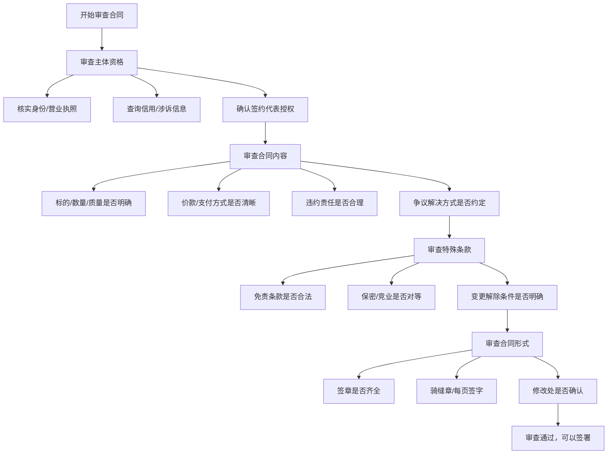
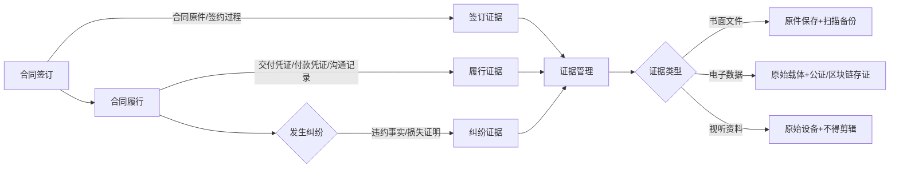
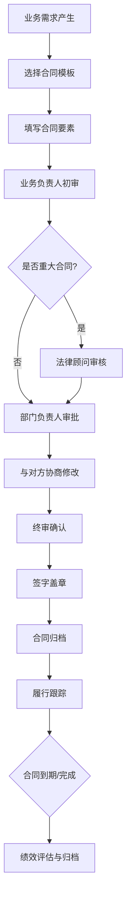
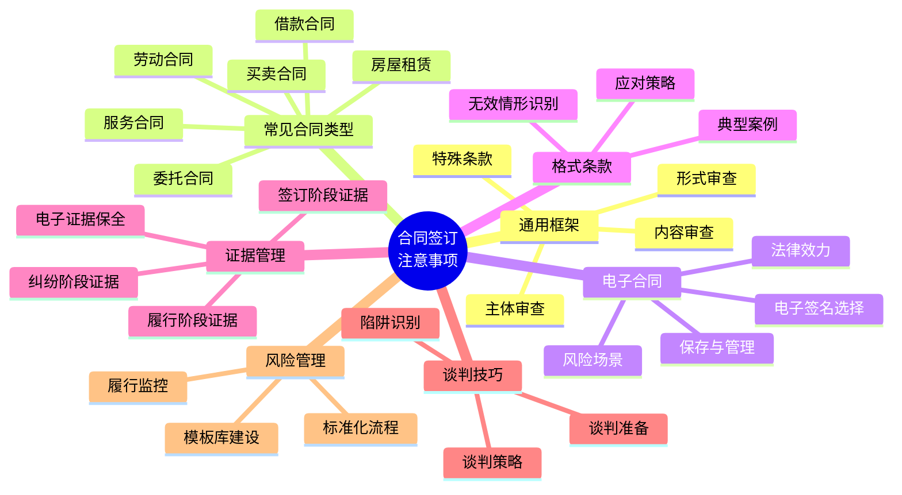

## 二、合同签订注意事项

合同是民事主体之间设立、变更、终止民事法律关系的协议。《民法典》第四百六十九条规定，当事人订立合同可以采用书面形式、口头形式或者其他形式。但在实际生活中，书面合同是保护自身权益最有力的工具。一份条款完备、表述清晰的合同，能在纠纷发生时为你省去大量的举证成本和维权时间。

本节从合同审查的通用方法论出发，逐步覆盖各类常见合同的审查要点、电子合同的特殊风险、格式条款的识别技巧，以及全生命周期的证据保存策略。

### 2.1 合同审查的通用框架

合同审查并非法律专业人士的专利。任何人在签订合同前，都可以按照以下四步框架进行系统审查，大幅降低"踩坑"概率。

#### 第一步：审查合同主体——"和谁签"

合同主体不适格是导致合同无效或难以履行的首要原因。审查要点如下：

**自然人主体**

- 核实身份证原件，确认姓名、身份证号与合同载明信息一致
- 确认对方是否具有完全民事行为能力（年满18周岁，或年满16周岁以自己的劳动收入为主要生活来源）
- 限制民事行为能力人签订的合同，需经法定代理人追认后方才有效
- 如果对方声称已婚且涉及重大财产处分（如房产），需要求其配偶出具书面同意函

**法人或非法人组织**

- 要求对方提供营业执照副本复印件并加盖公章
- 通过"国家企业信用信息公示系统"（https://www.gsxt.gov.cn）查询企业注册信息、经营范围、存续状态
- 通过"信用中国"（https://www.creditchina.gov.cn）查询是否有行政处罚记录
- 通过"中国裁判文书网"（https://wenshu.court.gov.cn）和"中国执行信息公开网"（https://zxgk.court.gov.cn）查询对方是否涉诉或为失信被执行人
- 核查签约代表的身份和授权：法定代表人可直接代表公司签署，其他人员必须持有法定代表人签署的授权委托书

**实操建议**

在签订大额合同（如房产交易、大宗采购、长期服务）前，建议至少完成以下查询：

| 查询内容 | 查询平台 | 关注重点 |
|---------|---------|---------|
| 企业基本信息 | 国家企业信用信息公示系统 | 注册资本、成立日期、经营范围、存续状态 |
| 行政处罚 | 信用中国 | 是否有重大违法记录 |
| 涉诉信息 | 中国裁判文书网 | 被告身份出现频率、案件类型 |
| 执行信息 | 中国执行信息公开网 | 是否为失信被执行人 |
| 专利/商标 | 国家知识产权局 | 核心资产是否真实存在 |

#### 第二步：审查合同内容——"签了什么"

合同内容的完备性直接决定了纠纷发生时的权利保障程度。根据《民法典》第四百七十条，合同一般应包含以下条款：

**核心条款（必备）**

1. **当事人信息**：姓名/名称、住所、联系方式，确保准确无误
2. **标的**：合同指向的对象，必须具体明确。"一批货物"不如"XX品牌XX型号产品500件"
3. **数量**：包含计量单位和允许的误差范围
4. **质量**：明确质量标准（国家标准、行业标准、企业标准或双方约定标准），约定验收方法
5. **价款或报酬**：金额大小写一致，币种明确，含税/不含税注明
6. **履行期限、地点和方式**：何时交付、何地交付、如何交付

**重要条款（强烈建议包含）**

7. **违约责任**：违约金的计算方式、赔偿范围、违约金与定金的关系
8. **争议解决**：选择诉讼还是仲裁，管辖法院或仲裁机构的具体名称
9. **合同的变更和解除**：协商变更的程序、法定解除权的行使条件

**常见遗漏条款**

10. **不可抗力条款**：不可抗力的定义（自然灾害、政府行为、社会异常事件）、通知义务、免责范围
11. **送达条款**：约定双方的通知地址和送达方式，明确"以邮件发出后第X日视为送达"
12. **保密条款**：涉及商业秘密或个人隐私时必须约定
13. **知识产权归属**：服务过程中产生的成果、作品、发明的归属
14. **合同附件**：明确附件清单及其与主合同的效力关系

#### 第三步：审查特殊条款——"有没有坑"

这一步是最容易被忽略，也最容易"踩坑"的环节。

**免责条款审查**

《民法典》第五百零六条明确规定，以下免责条款无效：
- 造成对方人身损害的
- 因故意或者重大过失造成对方财产损失的

此外，格式条款中不合理地免除或减轻己方责任的条款，也应警惕。审查时问自己："如果我是对方，我能接受这个条款吗？"

**竞业限制和保密义务审查**

- 竞业限制期限不得超过二年（《劳动合同法》第二十四条）
- 竞业限制必须约定经济补偿，否则劳动者可不受约束
- 保密义务的范围、期限和违约责任应明确

**违约金合理性审查**

- 违约金一般不超过实际损失的30%（《民法典》第五百八十五条第二款）
- 过高的违约金可请求法院或仲裁机构予以减少
- 注意区分违约金和定金：二者不能并用，守约方只能选择其一

#### 第四步：审查合同形式——"签得对不对"

合同形式的瑕疵可能导致整个合同无效或效力存疑。

- 合同应由法定代表人或授权代表签字，加盖公章或合同专用章
- 自然人签字应使用与身份证一致的姓名，最好附上身份证号
- 多页合同应加盖骑缝章或由各方在每页签字
- 合同中如有手写修改，修改处应由各方签字或盖章确认
- 合同一式多份时，各方各执一份，各份内容应完全一致

### 2.2 常见合同类型审查要点

不同类型的合同有其特有的风险点。以下针对日常生活中最常接触的六类合同，逐一说明审查要点和常见陷阱。

#### 2.2.1 买卖合同

买卖合同是最常见的合同类型，从网购一台手机到购买一套房产，本质上都是买卖合同关系。

**核心审查要点**

- **商品描述**：名称、品牌、型号、规格、颜色、数量必须精确描述，避免"同款""类似"等模糊用语
- **质量标准**：约定执行的国家标准（GB）、行业标准或双方商定的技术规格书
- **交付条款**：明确交付时间（精确到日）、交付地点、运输方式、运费承担方
- **验收条款**：验收期限（如"收货后7日内"）、验收标准、验收不合格的处理方式
- **付款方式**：预付比例、分期节点、货到付款、验收后付款的具体安排
- **风险转移**：标的物毁损灭失的风险自交付时起由买方承担（《民法典》第六百零四条），但当事人可以另行约定
- **售后与质保**：质保期限、质保范围、维修响应时间、退换货条件

**常见陷阱**

1. 样品与实际交付不符——合同中应注明"样品封存，交付物应与样品一致"
2. 验收期过短——大宗采购建议至少15天验收期
3. "概不退换"——经营者不得以格式条款排除消费者的退货权

#### 2.2.2 服务合同

服务合同涵盖咨询、设计、培训、维修、保洁等各类服务。其核心难点在于"服务质量难以量化"。

**核心审查要点**

- **服务范围**：尽可能具体、可量化。"提供品牌设计服务"不如"提供品牌LOGO设计，包含3套方案、每套2次修改、最终交付源文件"
- **服务标准**：约定客观的验收标准或行业通用标准
- **交付成果**：明确交付物的格式、数量、质量要求
- **服务期限**：起止日期、关键里程碑节点
- **服务费**：固定总价还是按工时计费，是否包含差旅费等额外开支
- **验收流程**：分阶段验收还是一次性验收，验收不通过的处理方式
- **知识产权**：服务过程中产生的著作权、专利权归属（委托创作的著作权默认归受托方所有，合同中应特别约定转让或授权）
- **保密义务**：双方在服务过程中接触到的商业秘密和机密信息的保护

**常见陷阱**

1. 服务范围笼统——导致"加量不加价"的纠纷
2. 未约定修改次数——无限制修改导致项目无限拖延
3. 知识产权默认归受托方——如未在合同中约定转让，委托方可能无法使用成果

#### 2.2.3 借款合同

民间借贷纠纷是法院受理数量最多的民事案件之一。签订借款合同时的细节，直接决定了债权能否实现。

**核心审查要点**

- **借款金额**：大小写必须一致，币种明确（人民币/美元等）
- **借款利率**：民间借贷利率上限为合同成立时一年期贷款市场报价利率（LPR）的四倍。以2024年为例，一年期LPR为3.45%，四倍即13.8%，超过此利率的利息部分法院不予保护
- **还款方式**：等额本息、等额本金、先息后本、到期一次性还本付息，应明确约定
- **还款期限**：具体还款日期或分期还款计划表
- **逾期责任**：逾期利率、违约金、罚息的计算方式，总计不得超过法定上限
- **担保条款**：保证人担保（一般保证/连带责任保证）、抵押担保、质押担保的具体约定
- **借款用途**：注明借款用途有助于在诉讼中证明借贷关系的真实性

**实操建议**

- 借款通过银行转账交付，在转账备注中写明"借款"
- 大额借款（如超过10万元）建议要求对方提供担保
- 如有保证人，保证人也应在借款合同上签字，并注明保证方式
- 保留借款合同原件、转账凭证、还款记录、催款记录

#### 2.2.4 房屋租赁合同

房屋租赁涉及金额较大、周期较长，且直接关系到居住安全和生活质量。

**核心审查要点**

- **房屋信息**：坐落地址（精确到门牌号）、面积、户型、装修状况、附属设施清单（建议附照片）
- **租赁期限**：最长不超过二十年（《民法典》第七百零五条），起止日期明确
- **租金及支付**：月租金金额、支付周期（月付/季付/年付）、支付日期、支付方式
- **押金**：金额（通常为一个月租金）、退还条件、退还时间（建议约定"退租后X日内验收合格即退还"）、可扣除押金的具体情形
- **费用分担**：水费、电费、燃气费、物业费、网络费、取暖费等各项费用由谁承担
- **维修责任**：房屋结构性问题和大型设施（如水管爆裂、电路故障）由房东承担，日常使用损坏由租客承担
- **转租条款**：是否允许转租，转租需经房东书面同意
- **涨租条款**：续租时租金涨幅的限制（如"涨幅不超过X%"）
- **提前退租**：提前退租的通知期限、违约金计算方式
- **房东进入权**：房东进入房屋检查的提前通知义务

**常见陷阱**

1. 押金退还条件模糊——"房屋无损坏"太笼统，应列明具体验收标准
2. 涨租无限制——建议约定每年涨幅上限
3. 维修责任不清——入住前拍摄房屋现状照片并双方确认，可作为退租验收的基准

**租房合同检查清单**

| 检查项 | 标准 | 常见问题 |
|-------|------|---------|
| 房产证/产权证明 | 核实房东身份与产权人一致 | 二房东无权转租 |
| 房屋现状 | 入住前拍照记录 | 退租时"损坏"争议 |
| 费用明细 | 列明各项费用及承担方 | 隐藏费用（清洁费、钥匙费） |
| 押金条款 | 明确退还条件和时限 | 无故克扣押金 |
| 违约责任 | 双方违约责任对等 | 仅约定租客违约 |
| 附属设施 | 列清单并双方确认 | 家具电器缺失或损坏 |

#### 2.2.5 劳动合同

劳动合同是劳动者权益保障的基石。虽然本章劳动权益保护实操方案中有更详细的讨论，此处仅从合同签订角度梳理关键审查点。

**核心审查要点**

- **必备条款**：用人单位信息、劳动者信息、合同期限、工作内容和地点、工作时间和休假、劳动报酬、社会保险、劳动保护和职业危害防护
- **试用期**：合同期限3个月以上不满1年的，试用期不得超过1个月；1年以上不满3年的，不得超过2个月；3年以上的，不得超过6个月。试用期工资不得低于约定工资的80%
- **竞业限制**：仅适用于高级管理人员、高级技术人员和其他负有保密义务的人员，期限不超过2年，必须约定经济补偿
- **培训与违约金**：仅在用人单位提供专项培训费用时可约定服务期和违约金，违约金不得超过培训费用
- **合同文本**：用人单位应将劳动合同文本交付劳动者一份，不交付的劳动者有权向劳动行政部门投诉

#### 2.2.6 委托合同

委托合同常见于委托律师代理诉讼、委托中介买卖房屋、委托理财等场景。

**核心审查要点**

- **委托事项**：具体、明确地界定受托人的权限范围
- **委托权限**：一般授权还是特别授权（如代为承认、变更、放弃诉讼请求，代为和解）
- **委托期限**：起止时间，或以特定事项完成为终止条件
- **报酬及费用**：报酬金额、支付方式，受托人垫付费用的报销规则
- **报告义务**：受托人应定期报告委托事务的处理情况
- **转委托**：是否允许受托人将委托事务转委托给第三人
- **解除权**：委托人可随时解除委托合同（《民法典》第九百三十三条），但应赔偿受托人因此受到的损失

### 2.3 电子合同的特殊注意事项

随着数字化转型的加速，电子合同已成为商业交易和个人消费中的常态。2020年实施的《民法典》和2019年修订的《电子签名法》共同构建了电子合同的法律框架。

#### 2.3.1 电子合同的法律效力

《民法典》第四百六十九条明确规定，以电子数据交换、电子邮件等方式能够有形地表现所载内容，并可以随时调取查用的数据电文，视为书面形式。这意味着电子合同在法律效力上与纸质合同等同，但需要满足特定条件。

**有效电子合同的构成要件**

1. **当事人身份可确认**：通过实名认证（身份证、银行卡、手机号三要素验证）
2. **意思表示真实**：电子签名或点击确认代表当事人的真实意愿
3. **合同内容可固定**：合同文本以可靠的数据电文形式存在
4. **签署时间可确定**：通过可信时间戳或第三方平台记录签署时间

#### 2.3.2 电子签名的选择

《电子签名法》第十三条规定了"可靠的电子签名"的四个条件：

- 电子签名制作数据用于电子签名时，属于电子签名人专有
- 签署时电子签名制作数据仅由电子签名人控制
- 签署后对电子签名的任何改动能够被发现
- 签署后对数据电文内容和形式的任何改动能够被发现

**各类电子签名对比**

| 签名方式 | 法律效力 | 安全等级 | 适用场景 | 成本 |
|---------|---------|---------|---------|-----|
| 手写签名扫描件 | 效力较弱，易被质疑 | 低 | 非正式文件 | 免费 |
| 短信验证码确认 | 有一定效力 | 中 | 网络服务协议 | 免费 |
| CA数字证书签名 | 与手写签名等效 | 高 | 企业间合同、政府文件 | 较高 |
| 第三方电子签章平台 | 与手写签名等效 | 高 | 各类正式合同 | 按次收费 |
| 区块链存证签名 | 效力日益被认可 | 极高 | 重要合同、跨境交易 | 中等 |

#### 2.3.3 电子合同的保存与管理

电子合同的最大风险在于存储安全——平台倒闭、服务器故障、格式过时都可能导致合同丢失。

**保存策略**

- **多份备份**：至少保存在两个不同的存储介质上（本地硬盘 + 云存储）
- **原始格式**：优先保存平台导出的原始电子文件（PDF/A格式最佳），而非截图
- **定期验证**：每半年检查一次电子合同文件是否可正常打开
- **平台备份**：在第三方电子签章平台（如e签宝、法大大、上上签）签署的合同，应同时在平台端和本地端保存
- **时间戳认证**：重要合同建议申请可信时间戳认证，固定签署时间
- **公证保全**：对于可能进入诉讼的电子合同，建议提前进行电子数据公证保全

#### 2.3.4 常见电子合同风险场景

**场景一：网购平台的服务协议**

大多数人在注册账号时会直接点击"我已阅读并同意"，但实际上平台的服务协议中可能包含限制消费者权利的格式条款。建议在首次使用前至少浏览以下内容：退款政策、争议解决条款、个人信息处理规则。

**场景二：远程签署劳动合同**

疫情后远程办公常态化，很多公司通过电子方式签署劳动合同。劳动者应注意：确认电子签名平台的资质、下载并保存合同副本、确认社保缴纳基数等关键条款无误。

**场景三：网贷平台的借款协议**

网贷合同中利率的表述方式多样（日利率、月利率、年化利率、年化费率），签订前应统一换算为年化利率进行比较，并确认是否包含各类服务费、管理费等隐性成本。

### 2.4 格式条款的深度解读与应对策略

格式条款是现代商业的基础设施，从银行开户到手机入网，从保险购买到网络购物，我们每天都在与格式条款打交道。理解格式条款的法律规则，是保护自身权益的基本功。

#### 2.4.1 格式条款的法律定义与规制体系

《民法典》第四百九十六条规定：格式条款是当事人为了重复使用而预先拟定，并在订立合同时未与对方协商的条款。

格式条款的规制体系包含三个层面：

1. **提示义务**：提供格式条款的一方应当采取合理的方式提示对方注意免除或者减轻其责任等与对方有重大利害关系的条款，并按照对方的要求对该条款予以说明
2. **解释规则**：对格式条款的理解发生争议的，应当按照通常理解予以解释；有两种以上解释的，应当作出不利于提供格式条款一方的解释
3. **无效认定**：具有法定无效情形的格式条款自始无效

#### 2.4.2 无效格式条款的识别

《民法典》第四百九十七条列举了三类无效格式条款：

1. **具有民事法律行为无效的情形**：违反法律、行政法规的强制性规定，违背公序良俗等
2. **不合理地免除或减轻己方责任**：
   - "商品售出概不退换"——排除了消费者的法定退换货权
   - "本平台对第三方服务不承担任何责任"——不合理地免除了审核义务
   - "因系统故障造成的损失由用户自行承担"——将技术风险全部转嫁给用户
3. **加重对方责任或排除对方主要权利**：
   - "用户同意平台可随时修改协议且不另行通知"——排除了用户的知情权
   - "发生争议只能通过仲裁解决，仲裁费用由用户承担"——加重了用户的维权成本

#### 2.4.3 应对格式条款的实操策略

**作为消费者**

1. 重点阅读以下章节：免责条款、争议解决条款、个人信息处理规则、退换货政策、自动续费条款
2. 对于明显不合理的条款，可以向市场监管部门（12315）投诉
3. 发生纠纷时，即使签署了包含不合理格式条款的合同，也可以主张该条款无效
4. 保留合同文本和签署过程的证据

**作为小企业主**

1. 不要直接使用网上下载的模板合同，应根据实际交易情况修改
2. 建立合同模板审核机制，定期更新以符合最新法律法规
3. 使用格式条款时，确保履行了提示和说明义务
4. 重要条款用加粗、下划线等方式突出显示

#### 2.4.4 典型格式条款纠纷案例

**案例一：健身房"会员卡不退不换"**

消费者购买了健身房年卡，因工作调动需要退卡，健身房以合同约定"会员卡一经售出概不退换"为由拒绝。法院认定该条款属于不合理地排除消费者主要权利的格式条款，判决健身房退还剩余费用。

**启示**：不要因为合同中有"不退不换"的条款就放弃维权，这类条款通常被认定为无效。

**案例二：保险公司的免责条款**

投保人在购买重大疾病保险时未仔细阅读免责条款，后因特定疾病申请理赔被拒。保险公司以"被保险人在投保前已存在的疾病属于免责范围"为由拒赔。法院审查发现，保险公司在投保时未以显著方式提示该免责条款，认定该条款对投保人不产生效力，判决保险公司理赔。

**启示**：保险公司未尽提示义务的免责条款不产生效力，投保人应要求保险代理人逐条解释免责条款。

### 2.5 合同纠纷的全生命周期证据管理

"打官司就是打证据"——这句话在合同纠纷中体现得尤为充分。很多明明占理的当事人，因为证据不足而败诉。证据管理不是事后补救，而是从合同签订那一刻就开始的持续过程。

#### 2.5.1 合同签订阶段的证据

- **合同原件**：各方签字盖章的合同正本，至少一式两份各执一份
- **签约过程**：重要合同签约时可以录音录像（需告知对方）
- **授权文件**：签约代表的授权委托书、法定代表人身份证明
- **背景材料**：招标文件、投标文件、报价单、往来邮件等能证明合同磋商过程的材料

#### 2.5.2 合同履行阶段的证据

- **交付凭证**：发货单、物流签收单、验收单（收货方签字盖章）
- **付款凭证**：银行转账记录、支付宝/微信支付截图、发票
- **沟通记录**：微信聊天记录、电子邮件、电话录音（电话录音在部分地区需双方同意方可作为证据使用，但多数法院认可单方录音的证据效力）
- **变更记录**：补充协议、变更函、口头约定的书面确认（口头约定变更书面合同的，建议在事后通过邮件或微信确认："根据今天电话沟通的内容，确认XX条款变更为XX"）
- **催告记录**：催款函、律师函（建议通过EMS邮寄并保留邮寄凭证）

#### 2.5.3 纠纷发生阶段的证据

- **违约证据**：违约事实的照片、视频、公证文书
- **损失证据**：损失计算明细、第三方评估报告、替代交易的合同和发票
- **鉴定报告**：产品质量鉴定、工程造价鉴定、资产评估等

#### 2.5.4 电子证据的保全要点

电子证据具有易篡改、易灭失的特点，保全方式直接影响其证据效力。

**自我保全**

- 微信聊天记录：截图+原始手机保留，截图应包含双方头像、昵称、对话时间
- 电子邮件：导出完整的邮件源文件（.eml格式），包含邮件头信息
- 网页内容：截图+使用公证处的网页保全工具或第三方存证平台
- 录音录像：保留原始设备和原始文件，不得剪辑

**专业保全**

- **公证保全**：到公证处对电子证据进行公证，这是证据效力最高的方式，费用通常在数百元至数千元不等
- **区块链存证**：通过司法区块链平台（如北京互联网法院"天平链"、杭州互联网法院司法区块链）进行存证，时间戳不可篡改
- **时间戳认证**：通过联合信任时间戳服务对电子文件加盖时间戳，固定文件的存在时间和完整性

### 2.6 合同谈判的实用技巧

合同签订不仅是法律行为，更是商业谈判的结果。掌握谈判技巧能帮助你在合法范围内争取更有利的合同条件。

#### 2.6.1 谈判前的准备

1. **明确底线**：在谈判前确定自己的最优目标、可接受目标和底线条件
2. **了解对手**：通过企业信用查询了解对方的经营状况、谈判实力和潜在需求
3. **准备替代方案**：有了替代方案（BATNA），谈判中就不容易被对方"绑架"
4. **起草合同**：尽量争取己方起草合同的权利——起草方可以将有利于己方的条款"埋"在合同中，对方修改的成本更高

#### 2.6.2 谈判中的策略

- **逐条确认**：不要笼统地"同意"整个合同，而是逐条讨论、逐条确认
- **留痕沟通**：谈判过程中的重要让步和承诺，及时通过邮件确认
- **先易后难**：先就双方没有异议的条款达成一致，再集中讨论争议条款
- **善用期限**：给对方一个合理的回复期限，避免谈判无限拖延
- **不急于签字**：对方催促签字时往往是条款对你不利的信号，坚持"看完再签"

#### 2.6.3 常见谈判陷阱

- **"这是标准合同，大家都这么签"**——标准合同也可以修改，关键是看条款是否对你有利
- **"这个条款不会执行的，只是走个形式"**——如果不会执行为什么要写进去？要求删除或修改
- **"今天不签就没有这个价了"**——制造紧迫感是最常见的谈判压力，冷静评估后决定
- **"口头答应你了，合同上就不用写了"**——一切以书面合同为准，口头承诺必须写入合同

### 2.7 合同风险管理的进阶策略

对于需要频繁签订合同的个人（如自由职业者、个体工商户）或小微企业主，建立系统的合同管理机制至关重要。

#### 2.7.1 建立合同模板库

- 根据自身业务场景，建立常用的合同模板库
- 每份模板由专业律师审核，定期更新以符合最新法律法规
- 模板中标注可协商的弹性条款和不可更改的核心条款
- 建立模板使用说明，确保非法律专业人员也能正确使用

#### 2.7.2 合同签署的标准化流程

#### 2.7.3 合同履行的监控机制

- 建立合同台账，记录所有在履行合同的关键节点（付款日、交付日、验收日）
- 设置关键节点的提前提醒（如付款日前7天提醒）
- 定期核对合同履行情况，及时发现违约迹象
- 对于长期合同，定期评估是否需要签订补充协议

### 2.8 本节核心要点回顾

**记住三个核心原则：**

1. **签前必查**：主体资格、信用记录、涉诉信息，一个都不能少
2. **签时必细**：每一个条款都要看懂、每一个空白都要填写、每一个修改都要确认
3. **签后必存**：合同原件、履行凭证、沟通记录，电子证据多备份并考虑公证保全

合同不是"走形式"，而是你的权益保障书。花在合同审查上的每一分钟，都可能为你省去未来数月甚至数年的维权之苦。
