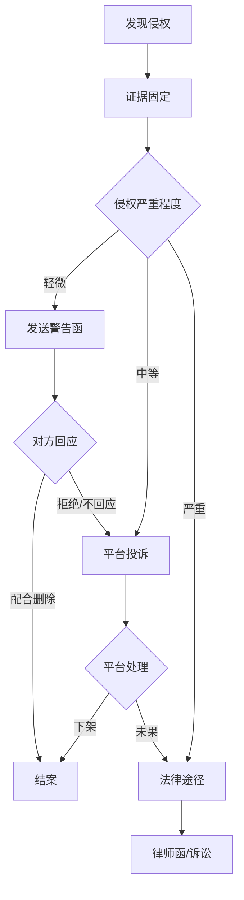
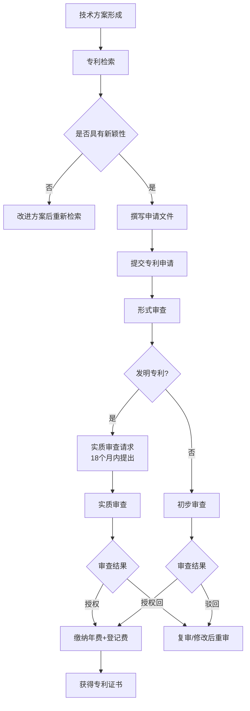
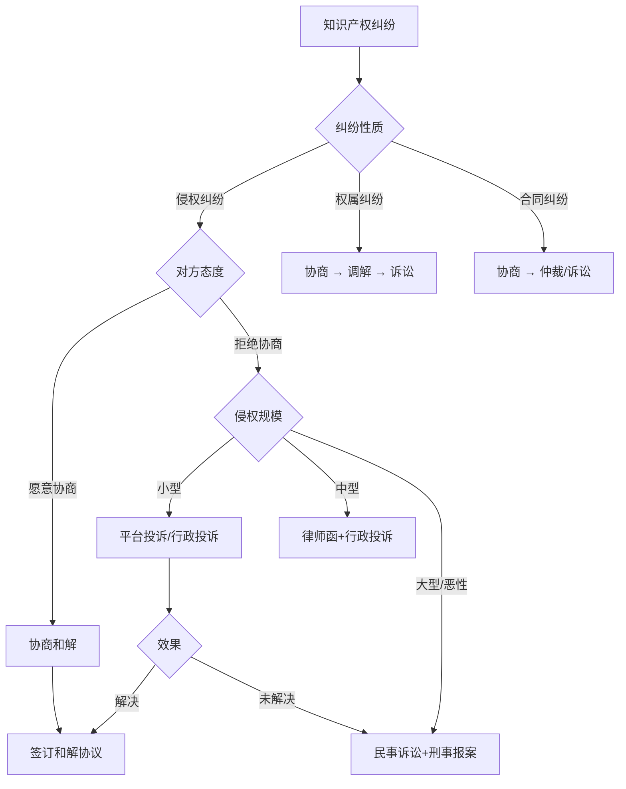

## 三、知识产权保护实操

知识产权是创新者最重要的无形资产。中国2024年知识产权保护社会满意度达到82分，但个人和中小企业的实际保护率仍然偏低——大量创作者不清楚自己拥有哪些权利，更不知道如何系统性地保护它们。本章从著作权、商标、专利三大板块出发，提供一套完整的"从确权到维权"实操方案。

### 3.1 著作权保护实操

著作权（版权）是知识产权中最容易获得、也最容易被忽视的权利类型。它自作品创作完成之日起自动产生，无需登记或审批，但**不登记≠不保护，登记了才好维权**。

#### 3.1.1 作品创作的证据保全体系

著作权纠纷的核心往往不是"谁创作了作品"，而是"谁能在法律上证明自己是第一个创作者"。以下是一套分层递进的证据保全体系：

**第一层：基础保全（零成本）**

| 方法 | 原理 | 可靠性 | 适用场景 |
|------|------|--------|----------|
| 邮件自证 | 邮件服务器时间戳不可篡改 | ★★☆☆☆ | 日常创作记录 |
| Git版本控制 | commit时间+哈希值形成时间链 | ★★★☆☆ | 代码和文档创作 |
| 社交媒体发布 | 平台记录发布时间 | ★★☆☆☆ | 文章、图片类作品 |
| 云存储自动备份 | 网盘记录上传时间 | ★★☆☆☆ | 大型文件备存 |

操作示例——邮件自证法：
1. 完成作品后，将源文件作为附件发送到自己的邮箱
2. 邮件主题格式："版权存证-作品名-20240101"
3. 邮件正文简述创作背景和完成时间
4. 永久保存该邮件，不要删除

**第二层：专业保全（推荐）**

- **版权登记**：到中国版权保护中心（www.ccopyright.com.cn）进行作品著作权登记。登记证书是法院认定著作权归属的初步证据，在举证责任分配上具有显著优势。

各类作品版权登记费用参考：

| 作品类型 | 登记费（元） | 出证周期 | 备注 |
|----------|-------------|----------|------|
| 文字作品 | 100-300 | 30个工作日 | 按字数阶梯收费 |
| 美术/摄影 | 100-300 | 30个工作日 | 系列作品可合并登记 |
| 音乐作品 | 200-500 | 30个工作日 | 含词曲分开登记 |
| 软件著作权 | 250-750 | 30-60个工作日 | 可加急，加急费另算 |
| 视听作品 | 300-800 | 30个工作日 | 短视频也可登记 |

- **时间戳认证**：通过联合可信时间戳服务中心（TSA）对作品进行认证。时间戳由国家授时中心提供基准时间，法律效力高于普通电子证据。操作流程：登录联合信任时间戳服务平台→上传作品文件→获取时间戳认证证书→保存证书编号。单次费用约10-20元。

**第三层：区块链存证（最高级别）**

区块链存证利用分布式账本的不可篡改性，为作品创建永久性时间证明。目前国内主要平台：

| 平台 | 背景 | 费用 | 特点 |
|------|------|------|------|
| 中国版权链 | 中国版权保护中心 | 50-200元/次 | 官方背景，司法对接 |
| 京东智臻链 | 京东 | 按需定价 | 电商维权场景强 |
| 蚂蚁链 | 蚂蚁集团 | 10-50元/次 | 接入互联网法院 |
| 腾讯至信链 | 腾讯 | 按需定价 | 微信生态内证据 |

操作流程：
1. 注册区块链存证平台账号并完成实名认证
2. 上传作品文件（平台自动生成哈希值）
3. 确认存证信息，支付费用
4. 获取存证证书（含区块高度、交易哈希、时间戳）
5. 将证书编号记录在案，妥善保管

> **实务建议**：对于日常创作，采用"Git+时间戳"双保险即可；对于高价值作品（如商业软件、设计作品、学术论文），建议加上区块链存证或版权登记。

#### 3.1.2 网络作品的系统性保护

网络环境下作品传播快、复制成本低、侵权发现难。需要建立一套"预防-监测-应对"的完整保护链。

**预防阶段**

1. **版权声明标注**：在所有发布的作品上添加版权声明
   - 标准格式："© [作者名] [年份]。保留所有权利。未经许可，不得转载、复制或以其他方式使用。"
   - 网页作品：在页脚和每篇文章底部均添加
   - 图片作品：将声明嵌入EXIF元数据或作为可见水印
   - 视频作品：在片头或片尾展示版权声明

2. **技术防护措施**
   - 图片：添加半透明水印（推荐工具：Photoshop批量处理、Watermarkly在线工具）
   - 文章：禁用右键复制（JS脚本）、设置防爬虫机制（robots.txt配合反爬策略）
   - 视频：平台内发布为主，源文件不外传
   - 代码：混淆处理后发布，核心代码不开源

**监测阶段**

建立定期巡查机制，频率建议：高价值作品每周一次，普通作品每月一次。

监测工具清单：
文字监测：
  - 百度搜索：将文章段落复制到搜索框，用引号精确匹配
  - 知网查重：学术文章适用
  - Copyscape（英文）：国际内容监测

图片监测：
  - Google图片搜索（以图搜图）
  - 百度识图
  - TinEye（国际图片溯源）

代码监测：
  - GitHub搜索：搜索关键函数名和注释
  - Grep.app：跨GitHub代码库全文搜索

综合监测：
  - 设定Google Alerts关键词提醒
  - 使用5118等舆情监测工具

**应对阶段**

发现侵权后的标准处理流程：

**平台投诉模板（DMCA风格）**：
致：[平台名称] 版权投诉部门

本人[姓名]，是以下作品的著作权人：
- 作品名称：[作品名]
- 首次发布时间：[日期]
- 原始发布地址：[URL]
- 版权登记号/存证编号：[编号]

贵平台用户[侵权者ID/名称]未经授权，在以下地址使用了本人作品：
- 侵权地址：[URL]

本人声明：上述投诉内容真实准确，本人有权作为该作品的著作权人提出投诉。

请贵平台在收到本通知后，依据相关法律规定，及时删除或断开链接。

联系邮箱：[邮箱]
日期：[日期]
签名：[姓名]

#### 3.1.3 软件著作权登记实操

软件著作权是程序员和创业者最应重视的知识产权之一。它不仅用于维权，还是申请高新技术企业认定、政府项目申报、税收优惠的必要条件。

**登记流程详解**：

第一步：准备材料
  ├── 软件著作权登记申请表（在线填写）
  ├── 身份证明（个人身份证/企业营业执照复印件）
  ├── 源程序代码（前30页+后30页，每页50行，共3000行）
  ├── 软件文档（选一种：用户手册、操作手册、设计说明书，前后各30页）
  └── 代理委托书（如委托代理机构）

第二步：网上填报
  ├── 登录中国版权保护中心网站
  ├── 注册账号并实名认证
  ├── 填写软件基本信息（名称、版本、开发完成日期、首次发表日期）
  └── 上传申请材料

第三步：提交审查
  ├── 普通流程：30-60个工作日，费用250元/件
  └── 加急流程：10-31个工作日，费用400-750元/件

第四步：领取证书
  └── 审核通过后领取《计算机软件著作权登记证书》

**源程序代码提交技巧**：
- 代码量不足3000行怎么办：提交全部代码，注明"本软件源程序共X页"
- 代码中含有敏感信息：可以对涉及商业秘密的部分进行脱敏处理
- 前后各30页的选择：从主程序文件开头取前30页，从末尾取后30页
- 注释规范：代码中添加适当注释，有助于审查员理解软件功能

**软件著作权的保护期限**：

| 权利人类型 | 保护期起算 | 保护期限 |
|-----------|-----------|---------|
| 自然人 | 创作完成之日起 | 作者终生+死后50年 |
| 法人/组织 | 首次发表之日起 | 50年 |
| 未发表的法人作品 | 开发完成之日起 | 50年 |

#### 3.1.4 数字时代著作权保护的新挑战

**AIGC（AI生成内容）的著作权问题**

随着ChatGPT、Midjourney等AI工具的普及，AI生成内容的著作权归属成为热点问题。目前中国的司法实践趋向于：

- 完全由AI独立生成、无人类创造性投入的内容，不受著作权保护
- 人类通过精心设计提示词、反复调整参数、后期加工处理形成的AI辅助作品，可以享有著作权
- 关键判断标准：人类是否进行了"独创性"的智力投入

实务建议：
1. 保留完整的AI交互记录（提示词、参数、迭代过程）
2. 记录人类在创作过程中的选择、修改和加工
3. 对AI生成的基础素材进行人工加工和二次创作
4. 在版权声明中注明创作工具和人类贡献
5. 关注相关司法案例的最新动态

**短视频和自媒体内容的保护**

短视频、直播切片、图文笔记等新型内容形式面临独特的保护挑战：

| 挑战 | 问题描述 | 应对策略 |
|------|---------|---------|
| 传播速度快 | 一天内可被数百次转发 | 发布即存证，快速响应 |
| 二次创作泛滥 | "搬运""洗稿""切片" | 技术水印+平台投诉 |
| 跨平台侵权 | A平台原创被搬到B平台 | 多平台监测+统一维权 |
| 维权成本高 | 单次侵权收益低 | 批量维权+平台合作 |

### 3.2 商标保护实操

商标是品牌的法律载体。没有商标保护的品牌，就像没有围墙的花园——任何人都可以踩进来。

#### 3.2.1 商标注册全流程

**注册前准备**

1. **商标检索**（最重要的一步，决定成败）

在国家知识产权局商标局官网（sbj.cnipa.gov.cn）进行免费检索，确认拟注册商标是否与在先商标冲突。

检索要点：
- 完全相同：不能注册
- 近似判断：读音近似、字形近似、含义近似均可能被驳回
- 跨类近似：驰名商标跨类保护，即使不同类别也可能冲突
- 检索范围：不仅看已注册商标，还要看申请中的商标（有3个月公告期）

推荐检索工具：
- 中国商标网（免费，官方）
- 企查查/天眼查（综合查询，含企业信息）
- 权大师/标库网（专业商标检索，提供近似分析）
- 国际检索：马德里体系商标数据库（WIPO Global Brand Database）

2. **商标设计原则**

| 原则 | 说明 | 示例 |
|------|------|------|
| 显著性 | 能让消费者区分商品来源 | "苹果"用于电子产品✓，"苹果"用于水果✗ |
| 非描述性 | 不能直接描述商品特征 | "甜蜜"用于糖果可能被驳回 |
| 非通用性 | 不能是商品通用名称 | "鼠标"不能注册为电脑配件商标 |
| 合法性 | 不违反公序良俗 | 不能使用国旗、国徽等 |

3. **类别选择策略**

中国采用《尼斯分类》，共45个类别（1-34类商品，35-45类服务）。

选择策略：
核心类别：直接相关的商品/服务类别（必注册）
关联类别：上下游产业链相关类别（建议注册）
防御类别：品牌可能延伸的领域（有条件则注册）
第35类：广告销售类，几乎所有品牌都应考虑注册

**注册流程详解**：

第一步：准备申请材料
  ├── 商标图样（JPG格式，400×400像素以上）
  ├── 申请人身份证明
  ├── 商标注册申请书
  ├── 商品/服务项目清单（按类别列出）
  └── 委托代理的需提交代理委托书

第二步：提交申请
  ├── 线上：商标局网上服务系统（推荐）
  ├── 线下：商标局注册大厅或各地受理窗口
  └── 委托：通过备案的商标代理机构

第三步：审查流程（约9-12个月）
  ├── 形式审查（1-2个月）：审查材料是否齐全
  ├── 实质审查（6-9个月）：审查是否符合注册条件
  ├── 初步审定公告（3个月）：任何人可提出异议
  └── 注册公告+发证：无异议或异议不成立

费用参考：
  ├── 官费：270元/类（10个商品/服务项目以内）
  ├── 超项费：30元/项（超出10项的部分）
  └── 代理费：500-2000元/类（各代理机构定价不同）

**商标驳回常见原因及应对**：

| 驳回原因 | 占比 | 应对方法 |
|----------|------|---------|
| 与在先商标近似 | 约60% | 修改商标设计或申请复审 |
| 缺乏显著性 | 约15% | 提交使用证据证明已获得显著性 |
| 违反禁用条款 | 约10% | 修改商标，避免使用禁用元素 |
| 商品描述不规范 | 约10% | 修正商品/服务项目描述 |
| 其他 | 约5% | 视具体情况应对 |

收到驳回通知后的15天内可以向国家知识产权局商标评审委员会申请复审（官费750元/类）。复审成功率约30-40%，建议委托专业代理机构操作。

#### 3.2.2 商标使用与维护

商标注册成功后并非一劳永逸，需要持续使用和维护。

**商标使用规范**：
- 注册商标应按核准注册的商标图样和核定使用的商品/服务项目使用
- 使用时标注"®"标记（注册商标标记），未注册商标不能使用
- 商标注册人名义或地址变更后，应及时办理变更手续
- 许可他人使用商标，应签订商标使用许可合同并报商标局备案

**商标续展**：
有效期：10年（自核准注册之日起计算）
续展期：有效期满前12个月内可申请续展
宽展期：期满后6个月内可补办续展（需额外缴纳延迟费）
续展费：500元/类（官费）
宽展费：500元+250元延迟费
注意：商标连续3年不使用，任何人可以申请撤销（"撤三"）

**防御商标管理**：

对于防御性注册的商标，需要确保每3年内至少有一次"使用"记录，防止被他人以"连续三年不使用"为由申请撤销。合法的"使用"证据包括：

- 商品包装、容器、标签上使用商标
- 商品交易文书上使用商标
- 广告宣传、展览中使用商标
- 在网站、社交媒体等数字平台使用商标

#### 3.2.3 商标侵权应对实战

**侵权识别标准**：

商标侵权的核心判断标准是"混淆可能性"——普通消费者是否可能对商品来源产生混淆。具体包括：

1. 使用与注册商标相同的商标（相同侵权）
2. 使用与注册商标近似的商标，且商品类似（近似侵权）
3. 销售侵犯注册商标专用权的商品（销售侵权）
4. 伪造、擅自制造他人注册商标标识（伪造商标）
5. 反向假冒：更换他人注册商标后将商品再次投入市场

**维权流程与费用**：

| 维权途径 | 适用场景 | 费用范围 | 处理周期 | 优势 |
|----------|---------|---------|---------|------|
| 平台投诉 | 电商侵权 | 免费 | 3-15天 | 快速、低成本 |
| 行政投诉 | 线下侵权 | 免费 | 1-3个月 | 有行政处罚权 |
| 律师函 | 中等规模侵权 | 2000-5000元 | 2-4周 | 震慑效果好 |
| 民事诉讼 | 严重侵权索赔 | 诉讼费+律师费 | 6-18个月 | 可获赔偿 |
| 刑事报案 | 假冒商标犯罪 | 免费 | 3-12个月 | 打击力度最大 |

**电商平台投诉操作流程**（以淘宝/天猫为例）：

1. 登录淘宝知识产权保护平台（ipp.alibabagroup.com）
2. 注册并完成权利人身份认证
3. 提交权利证明（商标注册证）
4. 发起投诉：
   - 填写被投诉商品链接
   - 选择侵权类型（商标侵权）
   - 提交侵权比对说明
   - 上传证据截图
5. 等待平台审核（通常3-5个工作日）
6. 平台判定成立后，删除/下架侵权商品

**赔偿金额计算参考**：

商标侵权赔偿的计算方式有四种（按优先顺序）：
1. 实际损失：因侵权导致的销量减少 × 利润
2. 侵权获利：侵权人因侵权获得的利润
3. 许可使用费的合理倍数：参照商标许可使用费的1-3倍
4. 法定赔偿：实际损失难以确定时，法院酌定500万元以下赔偿

### 3.3 专利保护实操

专利是技术领域最强的保护手段，授予发明人在一定期限内对技术方案的独占权。与著作权的"自动获得"不同，专利必须经过申请、审查、授权后才能获得。

#### 3.3.1 三种专利类型对比

| 对比项 | 发明专利 | 实用新型专利 | 外观设计专利 |
|--------|---------|-------------|-------------|
| 保护对象 | 产品、方法或其改进 | 产品的形状、构造 | 产品的外观设计 |
| 创造性要求 | 突出的实质性特点和显著进步 | 实有实质性特点和进步 | 与现有设计有明显区别 |
| 审查方式 | 实质审查（严格） | 初步审查（较快） | 初步审查（较快） |
| 审批周期 | 18-36个月 | 6-12个月 | 3-6个月 |
| 保护期限 | 20年 | 10年 | 15年 |
| 官费（申请） | 900元（可减缴85%） | 500元（可减缴85%） | 500元（可减缴85%） |
| 适用场景 | 核心技术创新 | 结构改进、小发明 | 产品外观创新 |

**费用减缴政策**：

个人申请人和小型企业可以申请专利费用减缴，最高可减缴85%。条件：
个人：上年度月均收入低于5000元（年收入低于6万元）
企业：上年度应纳税所得额低于100万元
减缴比例：单个申请人减缴85%，两个以上申请人减缴70%
可减缴费用：申请费、实质审查费、年费等

#### 3.3.2 专利申请完整流程

**专利检索详细操作**：

检索是专利申请中最关键的步骤，直接决定申请的成功率。

免费检索数据库：
  ├── 国家知识产权局专利检索系统（pss-system.cponline.cnipa.gov.cn）
  ├── 百度专利（patents.baidu.com）
  ├── Google Patents（patents.google.com）
  └── Espacenet（worldwide.espacenet.com）—— 欧洲专利局

检索步骤：
  1. 确定技术关键词（中英文）
  2. 确定IPC分类号（国际专利分类）
  3. 使用关键词+分类号组合检索
  4. 阅读相关专利的权利要求书，判断是否存在冲突
  5. 分析现有技术，确定本申请的创新点
  6. 撰写检索报告，记录最接近的对比文件

**申请文件撰写要点**：

专利申请文件的撰写质量直接决定专利的保护范围和稳定性。

1. 说明书：
   - 技术领域：简要说明所属技术领域
   - 背景技术：现有技术的不足（这是发明动机）
   - 发明内容：技术方案的详细描述
   - 附图说明：对附图的简要说明
   - 具体实施方式：至少一个完整实施例

2. 权利要求书（最核心部分）：
   - 独立权利要求：保护范围最宽的必要技术特征
   - 从属权利要求：逐步限缩，增加附加技术特征
   - 撰写原则："必要技术特征+上位概念"
   - 常见错误：保护范围过窄、缺少必要特征、技术方案不清楚

3. 摘要：技术方案的简要概括（不超过300字）
4. 附图：产品结构图、流程图、电路图等

> **重要提示**：专利申请文件的撰写是高度专业性的工作，尤其是权利要求书的撰写直接影响专利价值。对于核心专利，强烈建议委托专业专利代理师撰写。代理费用通常在3000-8000元/件（实用新型）或5000-20000元/件（发明专利）。

#### 3.3.3 专利检索实操（避免踩坑）

无论是申请专利还是开发产品，专利检索都是必做的功课。

**自由实施分析（FTO分析）**：

在将产品推向市场之前，确认产品不侵犯他人专利权：

步骤1：拆解产品的技术特征
  - 列出产品的所有技术特征
  - 区分核心技术特征和辅助技术特征

步骤2：检索相关专利
  - 使用关键词+IPC分类号检索
  - 覆盖中国专利、美国专利、欧洲专利

步骤3：对比分析
  - 将产品技术特征与专利权利要求逐一比对
  - 判断是否落入专利保护范围

步骤4：风险评估
  - 高风险：产品技术特征完全落入独立权利要求
  - 中风险：产品技术特征部分落入
  - 低风险：产品技术特征未落入或可规避

步骤5：制定应对策略
  - 规避设计：修改技术方案绕开专利保护范围
  - 专利许可：向专利权人获得使用许可
  - 专利无效：申请宣告对方专利无效
  - 等待到期：等待专利保护期届满

#### 3.3.4 专利维权实战

**专利侵权判定原则**：

全面覆盖原则：
  被控侵权产品包含了专利权利要求中的全部技术特征，则构成侵权
  （少一个技术特征都不构成侵权）

等同原则：
  被控侵权产品以基本相同的手段、实现基本相同的功能、达到基本相同的效果，
  且本领域普通技术人员无需创造性劳动就能联想到，仍构成侵权

禁止反悔原则：
  专利权人在专利申请/无效程序中放弃的技术方案，在侵权诉讼中不能重新主张

**专利维权的证据准备**：

| 证据类型 | 具体内容 | 获取方式 |
|----------|---------|---------|
| 权利证据 | 专利证书、年费缴纳记录 | 专利局查询 |
| 侵权证据 | 侵权产品实物、照片、购买凭证 | 公证购买 |
| 损害证据 | 销售数据、利润计算、市场份额 | 财务审计 |
| 技术对比 | 侵权产品与专利权利要求的技术对比 | 司法鉴定 |

**公证购买操作流程**：
1. 联系公证处，说明公证购买的目的
2. 与公证员一同前往购买侵权产品
3. 公证员对购买过程全程录像
4. 保留购买发票、收据、产品包装
5. 公证员对侵权产品进行封存
6. 出具公证书
7. 费用：1000-3000元/次

#### 3.3.5 专利年费管理

专利授权后需要每年缴纳年费维持有效，忘记缴费会导致专利失效，且不可恢复。

**年费标准**（以发明专利为例，减缴前）：

| 年度 | 年费（元） | 年度 | 年费（元） |
|------|-----------|------|-----------|
| 1-3 | 900 | 9-10 | 4000 |
| 4-6 | 1200 | 11-12 | 6000 |
| 7-8 | 2000 | 13-15 | 8000 |
| 16-20 | 10000 | | |

> 减缴85%后，发明专利前3年年费仅需135元/年。

**年费管理建议**：
- 使用专利管理系统设置缴费提醒（推荐：智慧芽、PatSnap）
- 可以预缴多年年费
- 专利年费缴纳期限：每年申请日前一个月内
- 滞纳金：超过缴费期限6个月内可补缴，按月加收5%滞纳金

### 3.4 知识产权的风险防范与合规管理

#### 3.4.1 避免侵犯他人知识产权的系统方案

**素材使用合规清单**：

| 素材类型 | 推荐来源 | 注意事项 |
|----------|---------|---------|
| 图片 | Unsplash、Pexels、Pixabay | 确认许可证类型（CC0最安全） |
| 图标 | Iconfont、Flaticon | 注意是否要求署名 |
| 字体 | 思源字体、站酷免费字体 | 商用字体（如方正）需付费授权 |
| 音乐 | Free Music Archive、Epidemic Sound | 注意同步权和机械权 |
| 代码 | MIT/Apache许可证的开源项目 | 遵守许可证要求，保留版权声明 |
| 视频素材 | Pexels Video、Mixkit | 部分限制商业使用 |

**开源许可证合规要点**：

开源≠免费随意使用，不同许可证有不同的约束：

| 许可证 | 核心要求 | 商用友好度 |
|--------|---------|-----------|
| MIT | 保留版权声明 | ★★★★★ |
| Apache 2.0 | 保留声明+标注修改 | ★★★★★ |
| BSD | 保留版权声明 | ★★★★★ |
| LGPL | 修改部分需开源 | ★★★☆☆ |
| GPL | 整个项目必须开源 | ★★☆☆☆ |
| AGPL | 网络使用也需开源 | ★☆☆☆☆ |

开源合规检查清单：
  □ 列出项目使用的所有开源依赖
  □ 确认每个依赖的许可证类型
  □ 检查是否有许可证冲突（如GPL+闭源=违规）
  □ 在项目中保留所有必要的版权声明
  □ 对于GPL/AGPL项目，准备好源码发布方案
  □ 定期更新依赖，关注许可证变更

#### 3.4.2 知识产权管理的日常习惯

建立以下习惯，让知识产权保护成为日常工作的一部分：

创作习惯：
  ✓ 完成作品即进行存证（时间戳/区块链）
  ✓ 重要作品进行版权登记
  ✓ 保留所有创作过程的记录和草稿
  ✓ 作品发布时标注版权声明

商标习惯：
  ✓ 品牌名确定后立即检索商标
  ✓ 核心品牌名称尽早注册商标
  ✓ 每年检查商标续展日期
  ✓ 保留商标使用证据（防止撤三）

专利习惯：
  ✓ 技术方案公开前先申请专利
  ✓ 建立技术交底书撰写制度
  ✓ 定期检索行业相关专利动态
  ✓ 设置年费缴纳提醒

合同习惯：
  ✓ 与员工签订知识产权归属协议
  ✓ 与合作方明确知识产权归属条款
  ✓ 外包开发合同约定知识产权归属
  ✓ 离职员工签署竞业限制和保密协议

#### 3.4.3 知识产权纠纷的解决路径

当发生知识产权纠纷时，可按以下路径选择解决方案：

**纠纷解决的费用与时间对比**：

| 解决方式 | 费用（元） | 耗时 | 适用场景 |
|----------|-----------|------|---------|
| 协商和解 | 0-5000 | 1-4周 | 双方有和解意愿 |
| 人民调解 | 免费 | 1-2个月 | 争议金额较小 |
| 行政投诉 | 免费 | 1-3个月 | 行政管辖范围内的侵权 |
| 仲裁 | 争议金额的2-4% | 3-6个月 | 合同中有仲裁条款 |
| 民事诉讼 | 诉讼费+律师费 | 6-24个月 | 严重侵权需赔偿 |
| 刑事报案 | 免费 | 3-18个月 | 假冒注册商标等犯罪 |

### 3.5 实用工具与资源汇总

#### 3.5.1 知识产权服务平台

| 平台/工具 | 功能 | 网址 | 费用 |
|-----------|------|------|------|
| 中国版权保护中心 | 版权登记 | ccopyright.com.cn | 按件收费 |
| 国家知识产权局 | 专利/商标检索 | cnipa.gov.cn | 免费 |
| 中国商标网 | 商标查询和申请 | sbj.cnipa.gov.cn | 免费查询 |
| 智慧芽 | 专利检索和分析 | zhihuiya.com | 基础免费 |
| 权大师 | 商标检索和监控 | quandashi.com | 基础免费 |
| 联合信任时间戳 | 作品时间戳认证 | tsa.cn | 10-20元/次 |
| IP360 | 区块链存证 | ip360.org.cn | 按需 |

#### 3.5.2 知识产权日历模板

建议将以下关键日期加入日历提醒：

每月提醒：
  □ 检查是否有作品被侵权（搜索监测）
  □ 确认本月是否有商标/专利缴费截止日

每季度提醒：
  □ 更新知识产权清单（新增作品/商标/专利）
  □ 检查商标使用证据收集情况
  □ 评估是否需要申请新的知识产权

每年提醒：
  □ 商标续展检查（到期前12个月）
  □ 专利年费缴纳确认
  □ 知识产权策略年度评估
  □ 竞争对手知识产权动态扫描

***

> **本章小结**：知识产权保护不是一次性行为，而是贯穿创作和经营全过程的系统工程。核心原则是"先确权，再用权，持续维权"。对于个人创作者，优先做好著作权存证和核心品牌商标注册；对于技术创业者，专利布局和开源合规是重中之重。记住：保护知识产权的成本远低于失去知识产权的代价。
