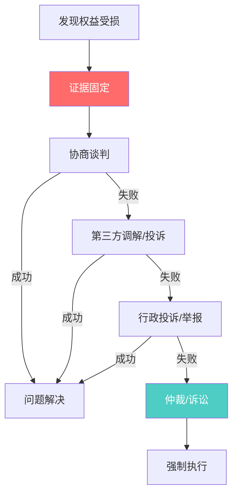
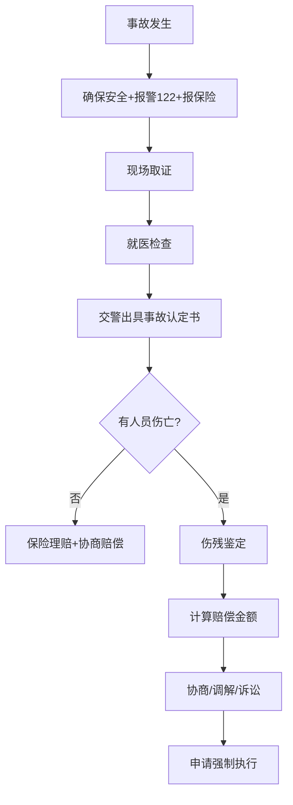

## 四、维权方法

权利写在纸上不值钱，能用出来才是真本事。本章是一本"维权作战手册"——从消费纠纷到人身损害，从房产争议到行政复议，从协商话术到法庭攻防，手把手教你把法律条文变成实实在在的赔偿和正义。

维权的本质是**博弈**。你面对的商家、房东、甚至行政机关，都有专业的法务团队。普通人维权的核心劣势不是法律不站在你这边，而是信息不对称、资源不对等、心理承受力不对称。本章要做的，就是抹平这些不对称。

### 4.1 维权总论：底层逻辑与通用方法论

#### 4.1.1 维权的"道法术器"框架

维权不是一上来就打官司。成熟的维权者遵循"阶梯式升级"原则：

**核心原则：成本递增，效力递增。** 每上一级台阶，你的时间成本、金钱成本、精力消耗都在增加，但对方承受的压力也在增加。高手维权不是一路打到底，而是在最合适的台阶上解决问题。

#### 4.1.2 证据——维权的基石

**没有证据的维权等于空谈。** 证据规则是整个维权体系的地基，必须在第一时间掌握。

**证据的"三性"要求：**

| 属性 | 含义 | 常见坑点 |
|------|------|----------|
| 真实性 | 证据必须是真实的，不能伪造、篡改 | 微信截图容易被质疑，建议用公证或区块链存证 |
| 合法性 | 取证手段必须合法 | 在他人家中偷装摄像头获取的证据不被采纳 |
| 关联性 | 证据必须与待证事实有关联 | 拍了现场照片但没拍时间、地点标识，关联性弱 |

**证据固定的时间窗口：**

- **黄金24小时**：事故发生后的24小时内是取证的最佳窗口。现场痕迹、监控录像、证人记忆都随时间迅速衰减
- **48小时规则**：消费纠纷中，商品实物在48小时内可能被商家收回或更换，务必第一时间拍照、录像、保留实物
- **7天规则**：网购七天无理由退货期内，任何质量问题都更容易主张权利

**电子证据保全方法（2020年后主流）：**

1. **公证保全**：到公证处对电子证据进行公证，法律效力最高。费用约200-500元/次
2. **区块链存证**：通过法院认可的区块链存证平台（如至信链、蚂蚁链、中国司法大数据研究院的司法链）进行存证。费用低至几元，已被最高法认可
3. **可信时间戳**：联合信任时间戳服务中心（TSA）提供的时间戳认证，单次约10元
4. **录屏+截屏双重备份**：对聊天记录、网页内容等，先录屏展示完整上下文，再截屏保存关键片段
5. **邮件自证**：将关键证据通过邮件发送给自己，利用邮件服务器的时间戳作为辅助证据

**重要提示：** 2020年修订的《最高人民法院关于民事诉讼证据的若干规定》明确将电子数据列为独立的证据类型，包括网页、博客、微博等网络平台发布的信息；手机短信、电子邮件、即时通信、通讯群组等网络应用服务的通信信息；用户注册信息、身份认证信息、电子交易记录、通信记录、登录日志等信息；文档、图片、音频、视频、数字证书、计算机程序等电子文件。电子证据的法律地位已经非常明确，关键是保全方法要规范。

#### 4.1.3 诉讼时效——维权的"保质期"

**超过诉讼时效，法院不会主动帮你驳回，但对方一旦提出时效抗辩，你就丧失胜诉权。** 这是最容易被忽视的致命问题。

| 纠纷类型 | 诉讼时效 | 起算点 | 特别注意 |
|----------|----------|--------|----------|
| 一般民事纠纷 | 3年 | 知道或应当知道权利受到损害之日 | 2017年民法总则改为3年（原为2年） |
| 人身损害赔偿 | 3年 | 伤害确诊之日（非事故发生日） | 持续治疗的，从治疗终结之日起算 |
| 产品质量缺陷 | 3年 | 知道或应当知道权益受损之日 | 产品交付之日起满10年丧失请求权（明示安全使用期除外） |
| 劳动争议 | 1年 | 知道或应当知道权利被侵害之日 | 劳动关系存续期间拖欠工资的，不受1年限制 |
| 房屋买卖合同 | 3年 | 合同约定的交房日/过户日 | 延期交房的，从约定交房日起算 |
| 行政复议 | 60日 | 知道行政行为之日起 | 逾期只能走行政诉讼（6个月） |
| 行政诉讼 | 6个月 | 知道或应当知道行政行为之日起 | 不动产案件最长20年，其他案件最长5年 |
| 国家赔偿 | 2年 | 知道或应当知道国家机关及其工作人员行使职权时的行为侵犯其人身权、财产权之日起 | 被羁押等限制人身自由期间不计算在内 |

**时效中断的三种法定事由（民法典第195条）：**

1. 权利人向义务人提出履行请求（微信催款、发律师函都算）
2. 义务人同意履行义务（对方承诺"下个月还"就中断时效）
3. 权利人提起诉讼或者申请仲裁

**实操建议：** 每隔一年半给对方发一次催款/催告信息（微信、短信、邮件均可），保留发送记录，即可反复中断时效。

#### 4.1.4 维权中的心理学与谈判策略

维权不只是法律问题，更是心理博弈。理解对方的心理，才能找到最优解。

**商家的心理模型：**

- **怕投诉**：12315投诉会影响企业信用评分，多次投诉会被列入重点监管名单
- **怕曝光**：社交媒体上的一条差评可能影响成百上千的潜在客户
- **怕诉讼**：诉讼意味着法务成本、执行风险、企业信用记录
- **怕举报**：行政处罚的力度远大于民事赔偿，且可能引发连锁调查

**谈判四步法：**

1. **锚定高点**：首次提出的赔偿金额应高于你的心理预期20%-50%，给对方"砍价"的空间，同时保护自己的底线
2. **给出理由**：每个诉求都要有法律依据，让对方知道你"懂法"。"根据《消费者权益保护法》第55条，欺诈行为三倍赔偿"比"你必须赔我"有效10倍
3. **制造紧迫感**：设定明确的答复期限，"我希望在本周五之前得到答复，否则我将通过12315平台投诉并向市场监管部门举报"
4. **留有退路**：不要把话说死，"我理解你们的难处，我们也希望能协商解决"——给对方台阶下，往往更容易达成协议

**心理学武器——锚定效应：** 行为经济学研究证明，谈判中先出价的一方会设定"锚点"，后续讨论围绕锚点展开。维权中，你应该先提出诉求金额，而不是让对方先报价。先报价的人，最终结果平均高出20%。

### 4.2 消费维权实操

#### 4.2.1 维权前的准备工作

**证据收集清单：**

| 证据类别 | 具体内容 | 保全方法 |
|----------|----------|----------|
| 购买凭证 | 发票、收据、电子订单截图、银行/支付宝/微信转账记录 | 截图+录屏，电子订单导出PDF |
| 商品证据 | 商品实物、包装、说明书、宣传资料、商品页面截图 | 拍照（含时间水印），实物封存 |
| 沟通记录 | 与商家的聊天记录、通话录音、客服工单 | 聊天记录录屏，录音需告知对方 |
| 损害证据 | 就医记录、诊断证明、医药费票据、误工证明 | 原件复印多份，电子化备份 |
| 证人信息 | 证人姓名、联系方式、证人证言 | 书面证言+证人签字+身份证复印件 |
| 其他证据 | 现场照片/视频、第三方鉴定报告、同类投诉案例 | 公证保全或区块链存证 |

**通话录音的合法性：** 根据《最高人民法院关于民事诉讼证据的若干规定》第68条，以侵害他人合法权益或者违反法律禁止性规定的方法取得的证据，不能作为认定案件事实的依据。但你与对方的通话，你作为当事人一方进行录音，不侵犯对方隐私权，属于合法证据。不过最佳实践是：通话开始时说一句"为保障双方权益，本次通话将被录音"。

#### 4.2.2 维权流程详解——五级递进

**第一级：与商家直接协商（耗时1-7天，成本为零）**

这是最快、成本最低的方式。关键在于话术和策略：

- **话术模板：** "您好，我在X月X日购买了XX商品（订单号XXX），出现了XX问题。根据《消费者权益保护法》第XX条/《产品质量法》第XX条，我要求XX（退款/换货/赔偿）。希望在X天内得到处理，否则我将通过12315平台投诉。"
- **态度：** 坚定但理性。情绪化只会让对方把你当"难缠客户"处理，而不是认真对待你的诉求
- **升级技巧：** 一线客服权限有限，必要时要求"转接主管"或"转接投诉处理部门"
- **书面化：** 重要协商内容通过文字（邮件、平台消息）确认，避免口头承诺无法追溯

**第二级：向消费者协会投诉（耗时7-30天，成本为零）**

如果协商不成，通过全国12315平台投诉：

- **线上投诉：** 登录 www.12315.cn 或使用"全国12315"微信小程序/支付宝小程序
- **电话投诉：** 拨打12315（需加拨当地区号，如北京010-12315）
- **投诉要点：** 被投诉方信息要准确（公司全称、地址、联系方式）；诉求要具体明确；附上所有证据材料
- **处理机制：** 市场监管部门收到投诉后7个工作日内决定是否受理，受理后60日内完成调解（复杂案件可延长30日）

**消协调解的局限性：** 消协没有行政执法权，调解结果不具有强制力。如果商家拒绝调解，消协只能终止调解并告知你其他途径。但消协投诉的记录会影响企业的信用评分，是施压的有效手段。

**第三级：向行政部门投诉/举报（耗时30-90天，成本为零）**

投诉和举报是两个不同的概念：

| 维度 | 投诉 | 举报 |
|------|------|------|
| 目的 | 解决你个人的消费纠纷 | 请求查处商家的违法行为 |
| 身份 | 需要实名，你是当事人 | 可以匿名，你是线索提供者 |
| 效果 | 行政部门介入调解 | 行政部门立案调查、行政处罚 |
| 赔偿 | 有可能通过调解获得赔偿 | 不直接给你赔偿，但行政处罚可以作为诉讼证据 |

**实操建议：投诉+举报双管齐下。** 对同一个商家，既提交投诉（解决你个人的赔偿），又提交举报（请求查处其违法行为）。行政处罚决定书在后续诉讼中是极有力的证据。

**各部门投诉指南：**

| 问题类型 | 投诉部门 | 投诉渠道 | 处理时限 |
|----------|----------|----------|----------|
| 产品质量问题 | 市场监督管理局 | 12315平台 | 60日 |
| 食品安全问题 | 市场监督管理局（食品科） | 12315 + 12345市长热线 | 60日 |
| 价格欺诈 | 市场监督管理局（价监科） | 12315 + 12358价格举报 | 60日 |
| 虚假广告 | 市场监督管理局（广告科） | 12315 | 60日 |
| 电信服务问题 | 工业和信息化部 | 12300 + 工信部申诉网站 | 15-30日 |
| 金融/银行问题 | 国家金融监督管理总局 | 12378 + 银行保险投诉热线 | 60日 |
| 物业/房产问题 | 住建局 | 12345 + 住建局投诉电话 | 60日 |
| 教育培训问题 | 教育局 + 市场监管局 | 12345 + 12315 | 60日 |
| 医疗问题 | 卫生健康委员会 | 12320卫生热线 | 60日 |

**第四级：申请仲裁（耗时2-6个月，成本较低）**

仲裁适用于双方有仲裁协议的情况（如合同中的仲裁条款）。特点：

- **一裁终局**：不像诉讼有二审，仲裁裁决做出即生效
- **保密性强**：不公开审理，保护商业秘密
- **效率较高**：普通程序4个月，简易程序2个月
- **费用：** 按争议金额比例收费，通常低于诉讼费
- **执行效力：** 仲裁裁决与法院判决具有同等法律效力

**注意：** 仲裁需要双方事先有仲裁协议（合同中的仲裁条款或事后达成的仲裁协议），单方不能申请仲裁。

**第五级：提起诉讼（耗时3-12个月，成本最高）**

诉讼是最终的救济途径，也是最具威慑力的维权手段。详见4.6节诉讼实操指南。

#### 4.2.3 网购维权特别指南

网购是当下最高频的消费场景，也是维权纠纷的重灾区。

**七天无理由退货的完整规则：**

根据《消费者权益保护法》第25条和《网络购买商品七日无理由退货暂行办法》：

- **适用范围：** 网络、电视、电话、邮购等远程购物方式
- **起算时间：** 自收到商品之日起7日（以签收时间为准）
- **退货条件：** 商品应当完好。"完好"指商品本身、配件、赠品（包括包装）齐全，不影响二次销售
- **运费承担：** 因消费者个人原因退货的，运费由消费者承担；因商品质量问题退货的，运费由经营者承担

**不适用七天无理由退货的商品：**

1. 消费者定作的商品（定制家具、刻字商品等）
2. 鲜活易腐的商品（生鲜、鲜花等）
3. 在线下载或拆封的音像制品、计算机软件等数字化商品
4. 交付的报纸、期刊
5. 其他根据商品性质并经消费者在购买时确认不宜退货的商品

**重要提示：** 商家不能以"已拆封"为由拒绝退货。2022年最高法明确：商品拆封查验不影响"商品完好"的认定，除非拆封导致商品价值贬损较大。

**平台责任：**

- 电商平台有义务提供商家真实信息（名称、地址、联系方式等），否则平台需先行赔付
- 平台知道或应当知道商家侵害消费者权益而未采取措施的，与商家承担连带责任
- 平台做出更有利于消费者的承诺（如"假一赔十"）的，应当履行

**跨境电商维权：** 跨境电商的商品同样适用中国消费者权益保护法。但实际操作中，跨境维权成本高、周期长。建议：优先通过平台投诉机制解决；必要时向平台所在地市场监管部门投诉；保留所有中文客服沟通记录。

#### 4.2.4 食品药品维权——惩罚性赔偿的"富矿"

食品药品领域的惩罚性赔偿力度最大，也是职业打假人最活跃的领域。

**赔偿标准（《食品安全法》第148条）：**

- 生产不符合食品安全标准的食品或经营明知不符合食品安全标准的食品
- 消费者可以要求：**支付价款十倍或损失三倍的赔偿金**
- 赔偿金额不足1000元的，按1000元计算
- 食品的标签、说明书存在不影响食品安全且不会对消费者造成误导的瑕疵除外

**实操中的关键判断标准：**

"不符合食品安全标准"如何认定？主要看是否违反以下标准：

1. 食品中混有异物（虫子、头发、金属碎片等）
2. 超过保质期
3. 超范围、超限量使用食品添加剂
4. 腐败变质、油脂酸败、霉变生虫
5. 掺假掺杂（如以鸭肉冒充牛肉）
6. 无标签或标签不合规（缺少生产日期、成分表等关键信息）
7. 未经检验检疫的肉类

**诉讼中的举证技巧：**

- 保留购买小票/发票，证明购买事实和价格
- 拍照/录像保留食品状态（异物位置、变质情况、过期标签等）
- 必要时申请第三方检测机构检验（费用约500-2000元，胜诉后可要求被告承担）
- 同批次商品可以多次购买以固定证据（但法院对"知假买假"的态度正在收紧）

**案例参考：** 某消费者在超市购买到过期食品，价款38元。消费者依据《食品安全法》第148条起诉，法院判决超市赔偿1000元（十倍价款380元不足1000元，按1000元计算）。

#### 4.2.5 预付卡消费维权

预付卡（健身房、美容院、教育培训等）消费纠纷是近年来增长最快的消费投诉类型之一。

**常见陷阱：**

- 办卡后商家跑路（占预付卡投诉的40%以上）
- 服务缩水：承诺的内容与实际不符
- 转让受限：商家单方面设置"不可转让""不可退款"条款
- 有效期限制：卡内余额过期作废

**维权路径：**

1. **收集证据：** 保留合同/协议、收据/转账记录、宣传单页/朋友圈广告截图、与商家的沟通记录
2. **查询商家信息：** 通过"国家企业信用信息公示系统"查询商家是否注销、是否被列入经营异常名录
3. **向市场监管部门投诉：** 同时向商务部门投诉（预付卡管理归商务部门主管）
4. **申请支付令：** 如果金额明确（卡内余额清楚），可以向法院申请支付令，比起诉更快（法院15日内审查，债务人15日内无异议即可执行）
5. **商家跑路后的应对：** 向公安机关报案（涉嫌合同诈骗或非法吸收公众存款）；联合其他受害消费者集体维权

**法律依据：** 《单用途商业预付卡管理办法（试行）》规定，记名卡不得设有效期，不记名卡有效期不得少于3年。超过有效期但尚有余额的，发卡企业应提供激活、换卡等配套服务。

### 4.3 人身损害维权

#### 4.3.1 交通事故维权

交通事故是最常见的人身损害类型，每年全国发生约25万起涉及人员伤亡的交通事故。

**事故发生后的"黄金操作流程"：**

**第一步：事故现场处理**

- 立即停车，开启危险报警闪光，在车后方50-150米处放置警告标志
- 有人员受伤的，立即拨打120急救电话
- 拨打122报警（即使轻微事故也建议报警，事故认定书是后续索赔的核心证据）
- 拨打保险公司报案电话（一般要求48小时内报案）
- 拍照取证：全景照（车辆位置、道路标线）、近景照（碰撞部位、损坏程度）、细节照（刹车痕迹、散落物），照片要包含时间水印

**第二步：事故认定**

交警部门在勘查现场后出具《道路交通事故认定书》，这是确定各方责任的核心文件。

| 责任类型 | 含义 | 赔偿影响 |
|----------|------|----------|
| 全部责任 | 一方过错导致事故 | 全责方承担100%赔偿 |
| 主要责任 | 一方过错较大 | 主责方承担70%-80%赔偿 |
| 同等责任 | 双方过错相当 | 各承担50%赔偿 |
| 次要责任 | 一方过错较小 | 次责方承担20%-30%赔偿 |
| 无责任 | 无过错 | 机动车无责仍承担不超过10%赔偿（无过错责任原则） |

**对事故认定不服怎么办？** 可以在收到认定书之日起3日内，向上一级公安交管部门申请复核（只能复核一次）。复核结论为最终结论。

**第三步：赔偿项目详解**

交通事故赔偿项目分为人身损害和财产损失两大类：

**人身损害赔偿项目：**

| 项目 | 计算标准 | 举证材料 |
|------|----------|----------|
| 医疗费 | 实际发生的合理费用 | 医疗费票据、诊断证明、用药清单 |
| 误工费 | 有固定收入按实际减少计算；无固定收入按最近3年平均收入或当地上年度职工平均工资 | 工资流水、纳税证明、劳动合同、误工证明 |
| 护理费 | 参照当地护工同等级别劳务报酬标准 | 护理协议、护理费票据 |
| 交通费 | 实际发生的合理费用 | 交通费票据（注意保留就医往返的票据） |
| 住院伙食补助费 | 当地国家机关一般工作人员出差伙食补助标准 | 住院记录 |
| 营养费 | 根据伤残情况参照医疗机构意见确定 | 医嘱（"加强营养"四字就值钱） |
| 残疾赔偿金 | 受诉法院所在地上一年度城镇居民人均可支配收入×20年×伤残系数 | 伤残鉴定报告 |
| 残疾辅助器具费 | 按照普通适用器具的合理费用 | 器具配置机构意见 |
| 被扶养人生活费 | 受诉法院所在地上一年度城镇居民人均消费性支出×扶养年限 | 被扶养人身份证明、扶养关系证明 |
| 精神损害抚慰金 | 法院酌定（一般每级伤残5000-50000元） | 构成伤残即可主张 |
| 后续治疗费 | 实际发生后另行起诉或鉴定机构评估 | 后续治疗费鉴定意见 |

**关键提示：** 2022年5月1日起，最高法修改了人身损害赔偿司法解释，统一按"城镇居民人均可支配收入"标准计算残疾赔偿金和死亡赔偿金，取消了城乡差异。这意味着农村户口的受害者也能按城镇标准获得赔偿。

**第四步：伤残鉴定**

伤残鉴定是确定赔偿金额的关键环节：

- **鉴定时机：** 一般在治疗终结后（通常为受伤后3-6个月，骨折类需6-12个月）进行
- **鉴定机构：** 由法院委托或双方协商确定的具有资质的司法鉴定机构
- **鉴定标准：** 适用《人体损伤致残程度分级》（2017年1月1日实施），分为1-10级，1级最重
- **费用：** 约2000-5000元，由申请方预付，最终由败诉方承担

**伤残等级对应的赔偿系数：**

| 伤残等级 | 赔偿系数 | 残疾赔偿金举例（按年人均可支配收入5万元、20年计算） |
|----------|----------|------------------------------------------------------|
| 一级（100%） | 1.0 | 5万×20×1.0 = 100万元 |
| 五级（50%） | 0.5 | 5万×20×0.5 = 50万元 |
| 十级（10%） | 0.1 | 5万×20×0.1 = 10万元 |

#### 4.3.2 医疗纠纷维权

医疗纠纷维权难度大、专业性强，但掌握正确方法可以大幅提高成功率。

**第一步：封存病历（最紧急！）**

病历是医疗纠纷中最重要的证据。根据《医疗纠纷预防和处理条例》：

- 患者有权复印客观病历（入院记录、体温单、医嘱单、检验报告、手术同意书等）
- 患者有权要求封存主观病历（病程记录、疑难病例讨论、上级医师查房记录等）
- **封存时限：** 在医患双方在场的情况下进行封存和启封
- **关键操作：** 封存的病历由医疗机构保管，但封存袋上必须有医患双方签字和封存时间

**病历封存的实战要点：**

- 发生纠纷后**第一时间**书面申请封存病历，最好在24小时内
- 先复印全部客观病历（这是你的法定权利，医院不能拒绝），再申请封存主观病历
- 封存时逐页核对页码，拍照记录封存过程
- 如果医院拒绝封存或拖延，立即向卫生行政部门投诉，并录音录像记录拒绝过程

**第二步：选择维权路径**

| 路径 | 适用场景 | 耗时 | 成本 |
|------|----------|------|------|
| 协商 | 责任明确、金额较小 | 1-3个月 | 低 |
| 人民调解 | 医调委介入调解 | 1-3个月 | 免费 |
| 行政投诉 | 医院存在明显违规 | 1-6个月 | 免费 |
| 司法诉讼 | 责任争议大、金额高 | 6-24个月 | 较高 |

**第三步：医疗损害鉴定**

医疗损害鉴定是确定医院是否存在过错及过错参与度的核心程序：

- **鉴定机构：** 由法院委托医学会或司法鉴定机构进行
- **鉴定内容：** 医疗行为是否存在过错、过错与损害之间是否存在因果关系、过错参与度
- **费用：** 约8000-15000元，由申请方预付，最终按责任比例分担
- **鉴定时限：** 一般3-6个月

**医疗纠纷赔偿项目：** 除一般人身损害赔偿项目外，还包括：后续治疗费、康复费、护理依赖费用（完全护理依赖、大部分护理依赖、部分护理依赖分别按100%、80%、50%计算）。

#### 4.3.3 工伤维权

工伤维权在劳动权益保护实操方案中有详细论述，此处补充几个关键的维权节点：

**工伤认定申请时限：**

- 用人单位：事故发生之日起30日内申请
- 职工本人或近亲属：事故发生之日起1年内申请
- 用人单位未在30日内申请的，在此期间发生的工伤费用由用人单位承担

**工伤维权的常见陷阱：**

- 用人单位未缴纳工伤保险：全部工伤保险待遇由用人单位支付
- 用人单位否认劳动关系：先申请劳动仲裁确认劳动关系，再申请工伤认定
- 工伤等级鉴定不服：可在收到鉴定结论之日起15日内向省级劳动能力鉴定委员会申请再次鉴定

### 4.4 房产纠纷维权

房产是大多数家庭最大的资产，房产纠纷的标的额往往很大，维权必须精准有力。

#### 4.4.1 常见房产纠纷及维权策略

**延期交房维权：**

延期交房是最常见的商品房买卖纠纷。

- **第一步：查阅合同** — 找到合同中关于交房时间和违约责任的条款
- **第二步：发送催告函** — 以书面形式（EMS邮寄，保留邮寄凭证）催告开发商在合理期限内交房
- **第三步：主张违约金** — 逾期交房违约金一般按已付房款的日万分之一至日万分之三计算
- **第四步：解除合同** — 如果逾期超过合同约定期限（通常90天），购房者有权解除合同并要求退还全部房款及利息，同时主张违约金

**违约金计算示例：** 假设购房款200万元，合同约定逾期交房违约金为日万分之二，逾期180天。违约金 = 200万 × 0.0002 × 180 = 72,000元。

**房屋质量问题维权：**

| 质量问题类型 | 维权依据 | 维权路径 |
|-------------|----------|----------|
| 主体结构质量不合格 | 合同法/民法典 | 可退房+赔偿损失 |
| 严重影响正常居住使用 | 最高法商品房买卖司法解释 | 可退房+赔偿损失 |
| 一般质量问题（渗水、裂缝等） | 质量保证书 | 要求开发商维修+赔偿损失 |
| 装修标准缩水 | 合同约定 | 要求补差价或赔偿 |

**精装修"货不对板"维权：**

精装修交付的房屋是最容易出现质量纠纷的。维权要点：

1. 保存开发商的宣传资料（样板间照片、精装修标准说明、销售人员承诺等）
2. 收房时仔细核对装修标准，逐项比对合同约定的品牌和规格
3. 对不达标的地方拍照录像，形成书面验收记录并要求开发商签字确认
4. 可以委托第三方验房机构出具验房报告（费用约300-800元/套）

**二手房交易纠纷：**

| 常见纠纷 | 应对策略 |
|----------|----------|
| 卖方隐瞒房屋缺陷（凶宅、漏水、违建等） | 构成欺诈，可撤销合同并要求赔偿 |
| 买方贷款未获批 | 看合同中是否有"贷款不成可解除"的条款 |
| 中介吃差价 | 违反中介如实报告义务，可要求返还差价+赔偿 |
| 户口未迁出 | 合同约定违约金，或起诉要求迁出 |
| 阴阳合同 | 阳合同（低价备案）无效，以阴合同（真实价格）为准 |

#### 4.4.2 租房维权

**押金不退——最常见的租房纠纷：**

1. 入住时拍照记录房屋状态（墙面、地板、家具、电器），形成入住交接清单，双方签字
2. 退房时再次拍照记录，与入住时对比
3. 如果房东无正当理由扣押金：先协商→向当地住建部门投诉→向法院起诉（小额诉讼程序，标的额5万以下一审终审，诉讼费仅需50元）

**租金贷风险防范：**

部分长租公寓以"押一付一"为诱饵，实际让租客签订租金贷款合同。一旦公寓跑路，租客仍需继续还贷。防范措施：

- 仔细阅读合同，拒绝签署任何金融/贷款相关的协议
- 如果已经被办理了租金贷：立即联系贷款机构协商解除贷款合同，同时向银保监会投诉

**群租房举报：** 如果你居住的小区存在群租房（如三居室被隔成六间出租），可以向当地住建部门或城管部门举报。群租房不仅违法，还存在严重的消防安全隐患。

### 4.5 行政维权——"民告官"实操指南

行政维权是普通公民最容易忽视、也最不敢尝试的维权方式。但实际上，行政复议和行政诉讼的胜诉率并不低——2023年全国行政复议案件纠错率约为15%，行政诉讼案件中行政机关败诉率约为10%-15%。法律面前，政府也会犯错。

#### 4.5.1 行政复议——纠错的"快速通道"

行政复议是公民对行政机关的具体行政行为不服时，向上一级行政机关或同级政府申请复查的制度。

**适用场景：**

- 行政处罚不服（如交警罚款、城管处罚、税务处罚）
- 行政许可被拒（如营业执照被拒、建房申请被拒）
- 行政强制措施不服（如扣押财产、查封场所）
- 行政征收补偿不合理
- 政府信息公开申请被拒

**行政复议的优势：**

| 对比维度 | 行政复议 | 行政诉讼 |
|----------|----------|----------|
| 申请期限 | 知道行政行为之日起60日 | 知道行政行为之日起6个月 |
| 审理期限 | 60日（延长不超过30日） | 6个月（一审） |
| 费用 | 免费 | 诉讼费50-100元 |
| 审查范围 | 合法性+合理性 | 主要审查合法性 |
| 专业性 | 行政机关内部审查，了解业务 | 法院审查，更中立 |

**行政复议申请书模板要素：**

1. 申请人基本信息（姓名、身份证号、住址、联系方式）
2. 被申请人信息（做出行政行为的机关全称、地址）
3. 复议请求（撤销/变更行政行为，或确认行政行为违法）
4. 事实和理由（行政行为的事实认定错误、适用法律错误、程序违法等）
5. 证据材料（行政决定书、相关证据等）

**行政复议的申请渠道：**

- 当面递交：到复议机关（上一级行政机关或同级人民政府）的服务窗口
- 邮寄递交：以挂号信或EMS邮寄，以邮戳日期为申请日期
- 线上申请：部分省市已开通行政复议在线申请平台（如"行政复议服务平台"）

#### 4.5.2 行政诉讼——司法审查的最后防线

如果行政复议未能解决问题，或者你直接选择走司法途径，可以提起行政诉讼。

**行政诉讼的核心要点：**

- **被告举证责任：** 行政诉讼中，由行政机关对其行政行为的合法性承担举证责任。这意味着行政机关必须证明它做出的行政行为有事实依据和法律依据，而不是你来证明它违法
- **不适用调解：** 行政诉讼原则上不适用调解（行政赔偿、补偿及行政机关行使自由裁量权的案件除外）
- **一审终审例外：** 对国务院部门或县级以上地方政府做出的行政行为提起的诉讼，由中级人民法院管辖

**行政诉讼的常见胜诉理由：**

1. 主要证据不足（事实认定不清）
2. 适用法律、法规错误
3. 违反法定程序（如未告知听证权利、未给陈述申辩机会）
4. 超越职权（越权执法）
5. 滥用职权
6. 明显不当（行政处罚畸轻畸重）

#### 4.5.3 政府信息公开——行政维权的"利器"

政府信息公开申请是一种低成本、高效率的行政维权工具。当你需要获取政府掌握的信息用于其他维权时，这是一个极其有效的手段。

**可以申请公开的信息：**

- 行政机关的机构设置、职能、联系方式
- 行政法规、规章和规范性文件
- 国民经济和社会发展规划、专项规划、区域规划
- 财政预算、决算报告
- 行政事业性收费的项目、依据、标准
- 行政许可的事项、依据、条件、数量、程序、期限等

**申请流程：**

1. 确定信息的制作/保存机关
2. 向该机关提交信息公开申请（书面或在线）
3. 机关应在收到申请之日起20个工作日内答复
4. 对答复不服的，可以申请行政复议或行政诉讼

**实战应用举例：** 你所在小区的开发商声称已通过消防验收，但你怀疑造假。你可以向消防部门申请公开该楼盘的消防验收文件。如果消防部门答复"不存在该信息"，说明开发商可能涉嫌造假，这个答复本身就是诉讼中的重要证据。

### 4.6 诉讼实操指南

#### 4.6.1 起诉前的准备

**诉讼成本评估：**

在决定起诉前，先算一笔账：

| 费用项目 | 金额范围 | 说明 |
|----------|----------|------|
| 诉讼费 | 50-争议金额×0.5%-2.5% | 败诉方承担，可申请减免 |
| 律师费 | 3000-数万元 | 一般由各方自行承担（合同约定或法律规定的除外） |
| 鉴定费 | 2000-15000元 | 根据鉴定类型而定 |
| 保全费 | 5000元以下50元，5000-10万按1% | 申请财产保全时需要 |
| 时间成本 | 3-12个月 | 一审普通程序6个月，简易程序3个月 |

**诉讼费速算表（财产案件）：**

| 诉讼标的额 | 诉讼费 |
|------------|--------|
| 1万元以下 | 50元 |
| 1万-10万 | 标的额×2.5%-200元 |
| 10万-20万 | 标的额×2%+300元 |
| 20万-50万 | 标的额×1.5%+1300元 |
| 50万-100万 | 标的额×1%+3800元 |
| 100万-200万 | 标的额×0.9%+4800元 |

**小额诉讼程序——快速维权通道：**

如果你的案件标的额在当地上年度就业人员年平均工资30%以下（各地标准不同，一般为3-5万元），可以适用小额诉讼程序：

- 一审终审，不得上诉
- 审理期限：立案之日起2个月内审结
- 诉讼费减半收取
- 可以在工作日、非工作时间开庭

#### 4.6.2 起诉状的撰写

起诉状是诉讼的起点，写好起诉状直接影响案件的走向。

**起诉状基本结构：**

民事起诉状

原告：[姓名]，[性别]，[民族]，[出生日期]，[身份证号]，
      住址：[详细地址]，联系电话：[手机号]

被告：[公司全称/个人姓名]，[统一社会信用代码/身份证号]，
      住所地：[详细地址]，联系电话：[电话]

诉讼请求：
1. 判令被告退还原告购物款人民币XXX元；
2. 判令被告赔偿原告人民币XXX元（按X倍计算）；
3. 本案诉讼费由被告承担。

事实与理由：
[客观叙述事情经过，包括时间、地点、经过、结果]
[引用法律条文，说明被告行为违法的法律依据]
[论述原告的诉求为什么应该得到支持]

证据清单：
1. 购物发票/订单截图——证明购买事实
2. 商品照片/鉴定报告——证明商品存在问题
3. 与被告沟通记录——证明协商过程
4. ......

此致
[有管辖权的人民法院名称]

具状人：[签名]
[日期]

**起诉状的写作技巧：**

- 诉讼请求要具体明确，金额要精确到元
- 事实部分用"时间轴"叙述法，按时间顺序客观陈述
- 理由部分先列法律规定，再结合事实分析
- 不要在起诉状中使用情绪化语言（"无良商家""黑心公司"等），法官看的是事实和证据
- 证据清单列明每份证据的证明目的

#### 4.6.3 管辖法院的选择

**"原告就被告"是基本原则：** 一般向被告住所地法院起诉。但以下情况可以向原告住所地法院起诉：

- 对被监禁的人提起的诉讼
- 追索赡养费、抚养费、扶养费案件
- 合同纠纷中合同履行地在原告所在地

**消费者维权的管辖优势：** 因商品质量问题提起的诉讼，可以选择被告住所地、合同履行地或侵权行为地法院。网购纠纷中，收货地（即你的住所地）法院有管辖权。这意味着你不需要跑到商家所在地起诉。

#### 4.6.4 财产保全——防止对方转移资产

如果你担心对方在诉讼期间转移财产（如银行存款、房产、车辆），可以申请诉前财产保全或诉中财产保全。

- **诉前保全：** 在起诉前申请，法院48小时内裁定。必须在保全后30日内起诉，否则解除保全
- **诉中保全：** 在诉讼过程中申请
- **担保要求：** 一般需要提供相当于保全金额的担保（可以是现金、房产或保全保险）
- **保全保险：** 诉讼保全责任保险，保费约为保全金额的0.5%-2%，大幅降低保全门槛

#### 4.6.5 开庭审理

**庭审流程：**

1. 开庭准备（核实当事人身份、宣布法庭纪律）
2. 法庭调查（原告陈述→被告答辩→举证质证→法庭询问）
3. 法庭辩论（原告发表辩论意见→被告发表辩论意见→互相辩论）
4. 最后陈述（原告、被告分别作最后陈述）
5. 法庭调解（法官会尝试调解，调解不成则判决）
6. 宣判（当庭宣判或择日宣判）

**庭审注意事项：**

- 提前30分钟到达法庭
- 带齐身份证原件、证据原件
- 发言时面向法官，不要和对方争吵
- 对方的证据要认真质证，不要轻易认可
- 法官问什么答什么，不要主动暴露对自己不利的信息
- 调解时不要急于妥协，可以要求"庭后考虑"

#### 4.6.6 判决后的执行

**判决生效后对方不履行怎么办？**

1. 判决生效后（一审判决送达后15日内未上诉即生效），向做出判决的法院申请强制执行
2. 申请执行的期限：判决生效后2年内
3. 法院可以采取的执行措施：查封、扣押、冻结被执行人的财产；划扣银行存款；拍卖房产、车辆；限制高消费（不能坐飞机、高铁商务座、住星级酒店等）；纳入失信被执行人名单（"老赖"黑名单）；拘留（拒不执行判决、裁定的，可处15日以下拘留）

**执行难的破解方法：**

- 提供被执行人的财产线索（银行账户、房产地址、车辆信息、工作单位等）
- 申请法院通过网络执行查控系统查询被执行人财产
- 申请将被执行人纳入失信被执行人名单（限制高消费）
- 被执行人有能力执行而拒不执行的，情节严重的可以追究刑事责任（拒不执行判决、裁定罪，最高7年有期徒刑）

### 4.7 法律援助与公益诉讼

#### 4.7.1 法律援助

法律援助是国家为经济困难的公民和特殊案件的当事人提供的免费法律服务。

**法律援助的范围：**

根据《法律援助法》（2022年1月1日实施），以下事项可以申请法律援助：

- 依法请求国家赔偿
- 请求给予社会保险待遇或者社会救助
- 请求发给抚恤金
- 请求给付赡养费、抚养费、扶养费
- 请求确认劳动关系或者支付劳动报酬
- 请求认定公民无民事行为能力或者限制民事行为能力
- 请求工伤事故、交通事故、食品药品安全事故、医疗事故人身损害赔偿
- 请求环境污染、生态破坏损害赔偿
- 法律、法规、规章规定的其他情形

**法律援助的条件：**

- 经济困难标准：各地不同，一般参照当地最低工资标准或低保标准的1.5-2倍
- 特殊案件免审经济条件：英雄烈士近亲属维护人格权益的案件；因见义勇为行为主张民事权益的案件；再审改判无罪请求国家赔偿的案件等
- 刑事案件中的特殊群体：盲、聋、哑人，未成年人，可能被判处无期徒刑、死刑的人

**申请法律援助的渠道：**

1. **线下申请：** 到当地法律援助中心（一般设在司法局）
2. **电话咨询：** 12348公共法律服务热线（7×24小时）
3. **线上申请：** 中国法律服务网（www.12348.gov.cn）在线申请
4. **值班律师：** 法院、看守所等场所设有法律援助值班律师，可以现场咨询

#### 4.7.2 公益诉讼

公益诉讼是检察机关为保护国家利益和社会公共利益而提起的诉讼。普通公民虽然不能直接提起公益诉讼，但可以向检察机关举报线索。

**公益诉讼的类型：**

- **民事公益诉讼：** 生态环境和资源保护、食品药品安全领域侵害众多消费者合法权益的案件
- **行政公益诉讼：** 生态环境和资源保护、食品药品安全、国有财产保护、国有土地使用权出让等领域行政机关违法行使职权或不作为的案件

**如何向检察机关提供线索：**

- 拨打12309检察服务热线
- 登录12309中国检察网（www.12309.gov.cn）
- 到当地人民检察院12309检察服务中心当面举报

### 4.8 维权工具箱

#### 4.8.1 在线维权平台汇总

| 平台名称 | 用途 | 网址/渠道 |
|----------|------|----------|
| 全国12315平台 | 消费投诉/举报 | www.12315.cn / 微信小程序 |
| 12345市民服务热线 | 综合投诉/求助 | 12345电话 / 各地小程序 |
| 12348法律服务热线 | 法律咨询/法援申请 | 12348电话 / www.12348.gov.cn |
| 12333人社服务热线 | 劳动保障咨询 | 12333电话 |
| 12309检察服务热线 | 检察举报/公益诉讼线索 | 12309电话 / www.12309.gov.cn |
| 中国裁判文书网 | 查询司法判例 | wenshu.court.gov.cn |
| 国家企业信用信息公示系统 | 查询企业信息 | www.gsxt.gov.cn |
| 中国执行信息公开网 | 查询失信被执行人 | zxgk.court.gov.cn |
| 信用中国 | 查询企业和个人信用 | www.creditchina.gov.cn |
| 全国法院诉讼服务网 | 网上立案/查询案件 | ssfw.court.gov.cn |

#### 4.8.2 维权信函模板

**催告函模板：**

催告函

致：[对方全称]

本人[姓名]，身份证号[XXX]，于[日期]通过[渠道]购买/接受了
贵方[商品/服务名称]（订单号/合同号：XXX），价款人民币XXX元。

[具体描述问题：商品存在XX质量问题/服务未按约定提供/延期交房XX天等]

根据《[相关法律名称]》第XX条规定，[说明对方应承担的法律责任]。

现正式催告贵方于收到本函之日起[X]日内：
1. [具体诉求一]
2. [具体诉求二]

如贵方逾期未予处理，本人将依法通过12315投诉/向[相关部门]举报/
向人民法院提起诉讼等途径维护自身合法权益，届时由此产生的一切
法律后果和费用由贵方承担。

特此函告。

催告人：[签名]
日期：[年月日]
联系地址：[详细地址]
联系电话：[手机号]

#### 4.8.3 律师选择指南

**什么时候需要请律师？**

- 争议金额超过5万元
- 对方有律师代理
- 案件涉及复杂的法律关系（如多方当事人、跨地域）
- 需要调查取证（律师有调查权）
- 你没有时间和精力亲自处理

**如何选择律师？**

1. **专业对口：** 找专攻相关领域的律师（消费纠纷找消费者权益律师，房产纠纷找房产律师）
2. **查看执业信息：** 在"全国律师综合服务管理系统"查询律师执业证号和执业状态
3. **面谈评估：** 免费咨询时观察律师的专业能力、沟通风格和收费透明度
4. **收费方式：** 一般有固定收费、按标的额比例收费（一般5%-15%）、风险代理（胜诉后按比例收费，一般10%-30%）三种方式

**风险代理的注意事项：**

风险代理意味着律师在案件胜诉后才收费，看似"零风险"，但要注意：

- 风险代理的收费比例通常高于固定收费
- 婚姻、继承案件、请求给予社会保险待遇或最低生活保障待遇的案件、请求给付赡养费/抚养费/扶养费/抚恤金/救济金/工伤赔偿的案件禁止风险代理
- 签订风险代理合同前，仔细阅读"收费基数"条款——是按实际到手金额还是判决金额计算

#### 4.8.4 维权时间线管理

复杂维权往往持续数月甚至数年，建议用表格跟踪每个节点：

| 时间 | 事项 | 状态 | 截止日期 | 备注 |
|------|------|------|----------|------|
| [日期] | 收集证据 | 已完成 | - | 证据已公证 |
| [日期] | 发送催告函 | 已完成 | - | EMS回执已保留 |
| [日期] | 12315投诉 | 进行中 | [受理截止日] | 已提交，等待受理 |
| [日期] | 行政部门调解 | 待开始 | [调解截止日] | - |
| [日期] | 准备起诉材料 | 待开始 | [诉讼时效截止日] | - |

### 4.9 维权常见误区

#### 误区一："打12315就能解决一切"

12315是投诉渠道，不是执法机关。消协调解不具有强制力，商家有权拒绝调解。12315的作用在于：留下官方投诉记录（影响企业信用）、调解成功的具有合同效力、投诉记录可作为诉讼证据。

#### 误区二："打官司太贵了，普通人打不起"

诉讼费远没有想象中高。1万元以下的消费纠纷诉讼费仅50元；符合条件的还可以申请法律援助（免费律师）。诉讼费由败诉方承担，律师费在特定条件下也可以要求对方承担。

#### 误区三："没签合同就没法维权"

没有书面合同不等于没有合同关系。口头合同、事实合同关系（如已经实际交付商品、提供服务）同样受法律保护。关键是举证：付款记录、聊天记录、收据、证人证言都可以证明合同关系的存在。

#### 误区四："对方不执行判决就没办法了"

强制执行的手段非常多样：查封冻结财产、拍卖不动产、限制高消费、纳入失信名单、拘留乃至追究刑事责任。关键是你要向法院提供被执行人的财产线索，并积极配合法院的执行工作。

#### 误区五："维权就是吵架、闹事"

过激行为不仅不能解决问题，还可能让你自己陷入法律风险。在商家门口拉横幅可能涉嫌寻衅滋事，在网上发布不实信息可能构成名誉侵权。理性维权、依法维权才是最有效的方式。

#### 误区六："小金额不值得维权"

小金额纠纷可以通过小额诉讼程序快速解决（一审终审、2个月审结、诉讼费减半）。而且，维权不只是为了眼前的几百块钱，更是为了让违法经营者付出代价，维护整个消费环境。

***

