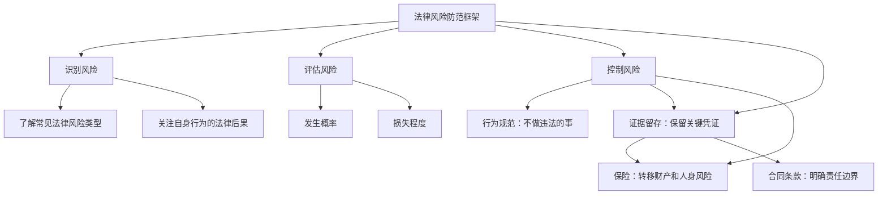
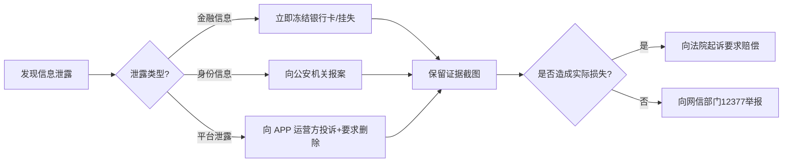
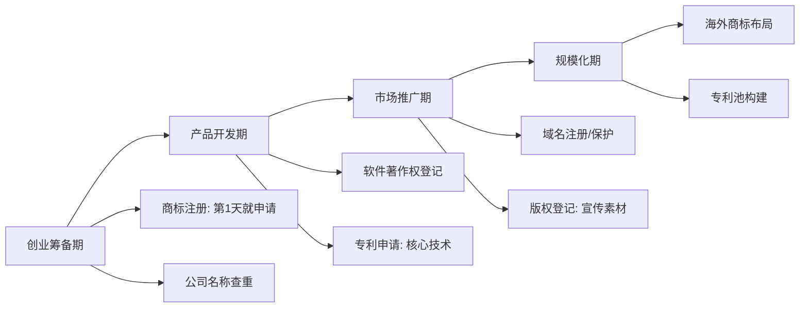

## 五、法律风险防范

法律风险防范的核心理念是"预防优于补救"。一场诉讼的时间成本、经济成本和精神消耗，远远超过事前做好风险防控的代价。以劳动争议为例，仲裁阶段平均耗时 45-60 天，如果进入诉讼程序则可能长达 6-12 个月；而一份完善的劳动合同或协议，签订时只需要几个小时。法律风险防范不是让每个人成为法律专家，而是建立一套**日常可用的风险识别和应对框架**，在问题萌芽阶段就将其化解。

### 5.1 风险防范的底层逻辑

在展开具体领域之前，先理解法律风险防范的通用思维框架：

**风险防范三原则：**

1. **留痕原则**——任何重要沟通、交易、承诺，都要有书面记录。口头约定在法律上虽然有效，但举证极其困难。微信聊天记录、电子邮件、短信都可以作为电子证据，但需要保存原始载体。
2. **核实原则**——对任何涉及金钱、个人信息、法律责任的事项，先核实对方身份、资质和真实性，再做决定。
3. **时效原则**——法律程序有严格的时限要求。错过诉讼时效、仲裁时效、异议期限，可能导致权利丧失。

---

### 5.2 个人信息与网络安全风险防范

#### 5.2.1 个人信息保护的法律框架

《个人信息保护法》（2021年11月1日施行）是我国个人信息保护的基本法律。该法明确了个人信息处理的"合法、正当、必要"原则，并赋予个人知情权、决定权、查阅复制权、更正补充权、删除权、解释说明权等多项权利。

**个人信息的法律分级：**

| 信息类型 | 举例 | 泄露风险等级 | 保护重点 |
|---------|------|------------|---------|
| 敏感个人信息 | 身份证号、银行账号、生物识别、医疗健康、行踪轨迹 | 极高 | 加密存储，最小化收集，单独同意 |
| 一般个人信息 | 姓名、手机号、邮箱、住址 | 高 | 限制公开范围，定期清理 |
| 公开信息 | 公开社交媒体内容、企业工商信息 | 中 | 注意信息聚合风险 |

**实操保护清单：**

- **快递面单处理**：收到快递后，用记号笔涂抹或撕毁面单上的姓名、电话、地址。更安全的做法是使用快递柜或驿站代收，避免面单进入垃圾桶。
- **手机 APP 权限管理**：定期（建议每季度一次）检查手机应用权限。进入"设置-隐私-权限管理"，关闭非必要权限。特别关注：位置信息、通讯录、相册、麦克风、摄像头。一个天气 APP 不需要读取你的通讯录。
- **二维码扫描**：不要扫描来源不明的二维码。恶意二维码可能直接跳转钓鱼网站，或触发恶意程序下载。商业场所的二维码也要注意是否被替换覆盖。
- **社交媒体隐私设置**：微信朋友圈设置"三天可见"或"半年可见"；抖音、微博等平台关闭"允许通过手机号找到我"；不在社交平台公开身份证、机票、钥匙照片（机票上有身份证号，钥匙照片可被 3D 打印复制）。
- **公共 WiFi 安全**：不在公共 WiFi 下登录网银、支付宝等金融应用。如必须使用，开启 VPN 或使用手机流量。公共 WiFi 可能是"钓鱼热点"，攻击者可以截获你的账号密码。
- **废旧设备处理**：出售或丢弃旧手机前，恢复出厂设置后还应存储大文件（如电影）再删除，反复 2-3 次，防止数据恢复。电脑硬盘建议使用 DBAN 等工具进行数据擦除。

**个人信息泄露后的应对流程：**

#### 5.2.2 网络安全的纵深防御

网络安全不是单一措施，而是多层防御体系。以下是按优先级排列的个人网络安全措施：

**第一层：密码安全（最重要）**

密码是最基础也是最容易被攻破的防线。常见错误是"一个密码走天下"——一旦某个平台数据库泄露，你的所有账号都会面临风险。

- 使用密码管理器（如 1Password、Bitwarden、KeePass）为每个平台生成独立的强密码
- 强密码标准：长度 ≥ 12 位，包含大小写字母、数字、特殊字符，不包含个人信息
- 主密码（密码管理器的主密码）必须牢记且绝不记录在电子设备上，可以写在纸上锁在保险柜里
- 定期更换关键账号密码（银行、邮箱、社交媒体），建议每 6 个月一次

**第二层：多因素认证（MFA）**

开启双因素认证（2FA）后，即使密码泄露，攻击者也无法登录。推荐优先级：

1. **硬件安全密钥**（如 YubiKey）——最安全，物理设备不可远程复制
2. **认证器 APP**（如 Google Authenticator、Microsoft Authenticator）——比短信安全
3. **短信验证码**——比没有好，但存在 SIM 卡劫持风险

**第三层：防钓鱼意识**

90% 以上的网络攻击从钓鱼开始。识别钓鱼的关键技巧：

- 检查发件人邮箱域名：`service@bank-of-china.com` ≠ `service@bank0fchina.com`（数字0替换字母o）
- 银行、政府机构**不会**通过短信/邮件要求你提供密码、验证码
- 任何要求你"立即操作否则账户冻结"的消息都值得怀疑
- 不确定时，通过官方渠道（官网电话、APP 内客服）核实，不要点击消息中的链接

**第四层：设备安全**

- 操作系统和软件保持最新版本，安全补丁及时安装
- 安装可靠的杀毒软件（Windows Defender 已经足够日常使用）
- 不下载来路不明的软件，优先从官方应用商店下载
- 重要数据定期备份，遵循 3-2-1 原则：3 份备份、2 种介质、1 份异地

---

### 5.3 财务活动中的法律风险防范

#### 5.3.1 民间借贷全流程风控

民间借贷是最常见的民事法律纠纷之一。根据最高人民法院数据，民间借贷纠纷案件常年位居民事案件收案量前列。做好风险防范，关键在**借前审查、借中留证、借后跟踪**三个阶段。

**借前审查——你是否应该借出这笔钱？**

在决定借出资金前，必须做以下评估：

1. **借款用途**：了解借款人的真实资金用途。用于合法经营活动的风险相对可控；用于赌博、还债（以债养债）的坚决不借。
2. **还款能力**：评估借款人的收入来源、负债情况、资产状况。借款人月收入 5000 元却要借 20 万，这本身就是一个危险信号。
3. **人品信用**：借款人此前是否有逾期记录？是否向多人借款？是否有赌博等不良嗜好？
4. **底线原则**：借出去的钱，要做好"可能收不回来"的心理准备。如果这笔钱的损失会严重影响你的生活，那就不要借。

**借中留证——借款合同的关键要素**

一份规范的借款合同/借条应包含以下要素：

| 要素 | 说明 | 常见错误 |
|-----|------|---------|
| 借款人信息 | 姓名、身份证号、住址、联系方式 | 只写姓名不写身份证号，导致无法确认身份 |
| 出借人信息 | 同上 | 同上 |
| 借款金额 | 大小写一致 | 大小写不一致产生争议 |
| 借款利率 | 明确年利率，不超过 LPR 的 4 倍 | 只写"月息几分"未换算为年利率 |
| 借款期限 | 起止日期 | 没写还款期限，变成"随时可要求还" |
| 借款用途 | 明确约定 | 不写用途，借款人挪用资金 |
| 交付方式 | 银行转账/电子支付 | 现金交付无法留下凭证 |
| 违约责任 | 逾期利率、违约金 | 没有违约条款，催款缺乏依据 |
| 担保条款 | 抵押/保证人（大额必须） | 大额借款无任何担保 |
| 签字+日期 | 双方签字按手印 | 只签字不按手印，或代签字 |

**关键提醒**：借款必须通过银行转账或电子支付方式交付，**绝对不要用现金**。转账记录是证明借款实际发生的最有力证据。转账时备注"借款"二字。

**利率红线**：根据《最高人民法院关于审理民间借贷案件适用法律若干问题的规定》，民间借贷利率不得超过合同成立时一年期贷款市场报价利率（LPR）的四倍。以 2024 年 LPR 3.45% 为例，四倍即 13.8%。超过部分的利息约定无效，借款人已支付的超额利息可以要求返还或抵扣本金。

**诉讼时效管理**：

- 普通诉讼时效：3 年（自还款期限届满之日起算）
- 未约定还款期限：自出借人要求还款之日起算
- **中断时效的方法**：向借款人发送催款通知（保留送达证据）、借款人部分还款、借款人重新确认债务
- 切记：超过诉讼时效不代表债权消灭，只是丧失了胜诉权。如果借款人自愿还款，法律仍然保护

**担保的正确使用**：

大额借款（建议 5 万元以上）必须要求担保：

- **房产抵押**：最可靠的担保方式。必须到不动产登记中心办理抵押登记，否则抵押权不成立。仅在借条上写"用房产做抵押"不办理登记的，抵押无效。
- **保证人担保**：保证人应当具有足够的偿还能力。注意区分一般保证和连带责任保证——连带责任保证对出借人更有利，可以直接要求保证人还款。
- **质押**：动产质押（如车辆）需要实际交付质押物；权利质押（如存单、股权）需要办理相应登记。

#### 5.3.2 投资理财风险识别

**非法集资的识别特征**

非法集资案件层出不穷，但核心特征始终是"四不"：

| 特征 | 具体表现 | 识别方法 |
|-----|---------|---------|
| 不合法 | 未经金融监管部门批准 | 在银保监会/证监会官网查询牌照 |
| 不真实 | 编造虚假项目 | 要求查看底层资产，无法提供的大概率是骗局 |
| 不公开 | 在亲友间口口相传 | 正规金融产品可以在公开渠道购买 |
| 不正常 | 承诺高息回报 | 年化收益超过 10% 且"保本保息"的基本可以判定为骗局 |

**具体风险识别清单**：

- **P2P 网贷**：2020 年全行业清退，任何仍在运营的 P2P 平台均为非法
- **虚拟货币**：2021 年 9 月起，境内虚拟货币交易被全面禁止。任何声称合法的国内虚拟货币项目都是骗局
- **原始股骗局**：声称公司即将上市，现在购买原始股可以暴富。真正的原始股不会向普通公众推销
- **养老投资骗局**：以"投资养老院""养老床位预售"为名收取资金，承诺高额回报。养老领域非法集资案件高发
- **消费返利**：承诺消费多少返多少，实际上用后来者的钱补贴先行者，本质是庞氏骗局

**查验金融机构资质的方法**：

1. 银行、保险、信托：登录国家金融监督管理总局官网（原银保监会），查询金融机构许可证
2. 证券、基金、期货：登录中国证监会官网或中国证券投资基金业协会官网查询
3. 第三方支付：登录中国人民银行官网查询支付业务许可证

#### 5.3.3 信用卡与贷款使用规范

**信用卡使用的核心风险点**：

- **套现风险**：信用卡套现属于违法行为。情节严重的，可能构成非法经营罪。银行大数据风控系统可以识别套现行为，后果包括降额、封卡、上报征信。
- **逾期后果**：逾期 1 天可能产生罚息；逾期超过 30 天将上报央行征信系统；逾期超过 90 天可能被起诉；逾期超过 180 天可能被认定为恶意透支，数额较大的构成信用卡诈骗罪。
- **最低还款陷阱**：选择最低还款看似减轻压力，但剩余未还部分会产生循环利息（日利率万分之五，折合年化约 18.25%），远高于普通贷款利率。
- **不要外借**：将信用卡借给他人使用，所有消费责任由持卡人承担。他人恶意透支不还款，银行追讨的对象是你。

**网贷平台注意事项**：

- 核实平台是否持有网络小贷牌照或消费金融牌照
- 看清实际年利率（IRR），而非日利率或月利率。很多平台宣传"日息万分之二"看似很低，实际年化约 7.3%；但加上各种手续费、服务费后实际年化可能超过 20%
- 不要在多个平台同时借贷（"以贷养贷"），这会让债务呈指数增长
- 遭遇暴力催收（威胁、恐吓、骚扰家人、爆通讯录），保留证据后向公安机关报案，同时向国家金融监督管理总局投诉

---

### 5.4 职业活动中的法律风险防范

#### 5.4.1 竞业限制的深度解析

竞业限制是近年来劳动争议的高发领域。很多劳动者在签署竞业协议时并未认真阅读条款，离职后才发现自己被严格限制了就业选择。

**竞业限制的法律要件**：

- **适用对象**：仅限高级管理人员、高级技术人员和其他负有保密义务的人员。企业不得对全体普通员工设置竞业限制。
- **最长期限**：离职后不得超过 2 年。约定超过 2 年的部分无效。
- **经济补偿**：用人单位必须按月支付竞业限制补偿金。标准为劳动者离职前 12 个月平均工资的 30%，且不低于当地最低工资标准。
- **解除权**：用人单位超过 3 个月未支付经济补偿的，劳动者可以请求法院解除竞业限制协议。
- **违约后果**：违反竞业限制的，应当按约定支付违约金，并继续履行竞业限制义务。

**实操建议**：

| 场景 | 建议做法 |
|-----|---------|
| 入职时被要求签竞业协议 | 仔细阅读条款，关注限制范围、期限、补偿标准。范围过宽（如"互联网行业所有公司"）可以要求修改 |
| 离职时用人单位要求执行竞业 | 确认补偿金是否按月到账。3 个月未收到可以书面通知解除 |
| 已签竞业但想跳槽到竞争公司 | 咨询律师评估风险。如果新公司与原公司不属于竞争关系，竞业限制不适用 |
| 被前公司起诉违反竞业 | 立即聘请专业律师应诉，收集新工作内容与原公司业务不重叠的证据 |

#### 5.4.2 商业秘密保护的法律责任

**什么是商业秘密？** 根据《反不正当竞争法》，商业秘密是指不为公众所知悉、具有商业价值并经权利人采取相应保密措施的技术信息和经营信息。三个要件缺一不可：秘密性、价值性、保密性。

**劳动者可能触犯的情形**：

- 离职时拷贝公司技术文档、客户资料、源代码
- 在新工作中使用前公司的技术方案、客户信息
- 将前公司的经营数据、价格策略透露给竞争对手
- 在社交媒体上晒工作内容，无意中泄露了公司内部信息

**法律后果**：

- **民事责任**：赔偿损失（包括实际损失和侵权获利），赔偿数额可达数百万元
- **行政责任**：监督检查部门可处以 10 万-500 万元罚款
- **刑事责任**：情节严重的构成侵犯商业秘密罪，处三年以下有期徒刑或拘役；情节特别严重的，处三年以上十年以下有期徒刑

**自我保护措施**：

1. 离职前不主动收集或复制公司资料
2. 离职时认真完成交接，归还所有公司物品（包括门禁卡、笔记本电脑、U 盘）
3. 离职后删除个人设备上所有公司相关文件
4. 到新公司后，使用公开渠道获得的知识和技能，不要直接搬运前公司的方案
5. 如果前公司有保密协议，定期回顾条款内容

#### 5.4.3 创业法律风险全景

创业涉及的法律风险远超多数创业者的预期。很多创业者在初期忽视法律问题，等到出了问题才追悔莫及。

**企业组织形式选择**：

| 形式 | 注册资本要求 | 税务处理 | 债务责任 | 适用场景 |
|-----|------------|---------|---------|---------|
| 个体工商户 | 无 | 经营所得税（5%-35%） | 无限责任 | 小型零售、餐饮、自由职业 |
| 个人独资企业 | 无 | 经营所得税（5%-35%） | 无限责任 | 小型工作室、咨询 |
| 合伙企业（普通） | 无 | 先分后税 | 无限连带责任 | 律所、会计所、投资基金 |
| 合伙企业（有限） | 无 | 先分后税 | GP 无限责任，LP 有限责任 | 风投基金 |
| 有限责任公司 | 认缴制 | 企业所得税 25% + 个税 20% | 以出资额为限 | 大多数创业项目 |

**合伙创业的关键协议条款**：

合伙创业失败的案例中，超过 60% 是因为合伙人之间缺乏明确的书面协议。一份完善的合伙协议应包括：

1. **出资条款**：各方出资金额、出资方式（现金/技术/实物）、出资时间
2. **股权分配**：初始股权比例、是否预留期权池（建议 10%-20%）
3. **决策机制**：哪些事项需要全体同意、哪些可以简单多数决定、谁有最终决定权
4. **利润分配**：分红时间、分红比例、是否强制分红
5. **退出机制**：合伙人退出时的股权回购价格计算方式、优先购买权、竞业禁止
6. **竞业禁止**：合伙人在合伙期间和退出后一定期限内不得从事竞争业务
7. **争议解决**：协商、调解、仲裁或诉讼的优先顺序

**知识产权保护时间线**：

**税务合规要点**：

- 从公司成立之日起，无论是否有收入，都需要按时进行纳税申报（零申报也要报）
- 了解可以享受的税收优惠政策：小规模纳税人增值税减免、小微企业所得税优惠、研发费用加计扣除等
- 公私分明：公司的钱和个人的钱严格分开，不要用公司账户支付个人消费（否则可能被认定为挪用资金或偷逃个税）
- 聘请专业会计或代账公司处理税务问题，不要自己盲目操作

**劳动用工合规**：

- 员工入职一个月内必须签订书面劳动合同，否则需支付双倍工资
- 依法缴纳五险一金（养老、医疗、失业、工伤、生育保险 + 住房公积金）
- 制定并公示员工手册和规章制度（涉及劳动者切身利益的制度需要经职工代表大会或全体职工讨论）
- 解雇员工需要有合法理由和充分证据，否则可能构成违法解除，需支付双倍经济补偿

---

### 5.5 网络活动中的法律风险防范

#### 5.5.1 网络言论的法律边界

互联网不是法外之地。近年来因网络言论引发的法律纠纷快速增长。了解言论的法律边界，既能保护自己的表达权利，也能避免无意中触犯法律。

**网络言论的法律风险等级：**

| 风险等级 | 行为 | 可能后果 | 法律依据 |
|---------|------|---------|---------|
| 高风险 | 捏造事实诽谤他人，造成严重后果 | 诽谤罪：三年以下有期徒刑 | 《刑法》第 246 条 |
| 高风险 | 编造虚假险情、疫情、灾情、警情并传播 | 编造、故意传播虚假信息罪 | 《刑法》第 291 条之一 |
| 高风险 | 公开他人私密信息（人肉搜索） | 侵犯公民个人信息罪/侮辱罪 | 《刑法》第 253 条之一 |
| 中风险 | 发布侮辱性言论（不涉及捏造事实） | 名誉侵权：赔偿+道歉+删除 | 《民法典》第 1024 条 |
| 中风险 | 未经同意公开他人私人生活 | 隐私权侵权 | 《民法典》第 1032 条 |
| 中风险 | 未经许可转载他人文章/图片 | 著作权侵权 | 《著作权法》 |
| 低风险 | 基于事实的批评评论（主观评价） | 一般不构成侵权（合理评论） | 司法实践 |

**安全表达的实操原则**：

1. **事实与观点分开**：可以说"我认为这家餐厅服务态度差"（观点），但不能说"这家餐厅使用地沟油"（事实，除非有证据）
2. **截图 ≠ 证据**：截图可以被篡改，法律效力有限。重要证据应通过公证处或电子存证平台（如"可信时间戳"）固定
3. **"转发"也要负责**：转发谣言同样可能承担法律责任。最高法司法解释明确，编造、故意传播虚假信息，以及明知是虚假信息仍然传播的，都可能构成违法
4. **评论区不是"法外区"**：在别人帖子下面的评论同样适用上述所有规则

#### 5.5.2 电子商务的法律合规

无论是全职电商还是副业卖货，只要从事电子商务经营，就需要注意以下法律合规要求：

**必须履行的法定义务**：

- **工商登记**：除个人销售自产农副产品、家庭手工业产品和个人利用自己的技能从事依法无须取得许可的便民劳务活动和零星小额交易活动外，电子商务经营者都应当依法办理市场主体登记
- **税务登记**：依法纳税是法定义务。平台经营者需要向税务部门报送平台内经营者的身份信息和纳税相关信息
- **信息公示**：在店铺首页显著位置公示营业执照信息、与其经营业务有关的行政许可信息
- **消费者权益保护**：遵守七天无理由退货规定；不得以格式条款做出对消费者不公平、不合理的规定

**直播带货的法律风险**：

直播带货领域是近年来监管重点，主要风险包括：

- **虚假宣传**：夸大产品功效、使用绝对化用语（"最好""第一""国家级"），违反《广告法》
- **产品质量**：销售假冒伪劣商品，可能触犯《产品质量法》《消费者权益保护法》，情节严重的构成销售伪劣产品罪
- **数据造假**：刷单刷量、虚构交易数据，违反《反不正当竞争法》和《电子商务法》
- **税务风险**：直播收入未如实申报纳税，可能面临税务处罚。薇娅等头部主播偷逃税被罚的案例应当引以为戒

---

### 5.6 交通事故与保险法律风险

#### 5.6.1 交通事故处理流程

交通事故是日常生活中最可能遇到的法律事件之一。正确的处理流程可以最大限度保护自身权益：

**事故现场处理四步法**：

1. **确保安全**：开启双闪灯，在车后方 50-150 米处放置三角警示牌（高速公路 150 米以上）。如有人员受伤，立即拨打 120。
2. **报警和报保险**：拨打 122（交通事故报警）和保险公司报案电话。即使事故很小也要报警和报保险，私了后对方反悔索赔的案例屡见不鲜。
3. **固定证据**：用手机全方位拍摄现场照片——车辆位置、碰撞部位、道路标线、交通信号灯、对方车牌。如有行车记录仪，保存视频。记录对方姓名、电话、身份证号、车牌号、保险公司。
4. **撤离现场**：轻微事故拍照后即可撤离（避免造成交通拥堵），到交通事故快速处理中心办理。

**责任认定的关键规则**：

- **追尾**：后车全责（前车溜车除外）
- **变道**：变道车辆全责
- **闯红灯**：闯红灯方全责
- **无信号灯路口**：让右方道路来车先行，未让行的负主要责任
- **酒驾/醉驾**：酒驾方承担全部或主要责任，且保险公司商业险拒赔

**赔偿范围和标准**：

交通事故赔偿项目包括：医疗费、误工费、护理费、交通费、住院伙食补助费、营养费、残疾赔偿金（如有伤残）、死亡赔偿金（如致死）、精神损害抚慰金、财产损失。具体标准各省市有差异，建议咨询当地律师。

#### 5.6.2 保险配置的法律视角

保险不仅是理财工具，更是法律层面的风险转移机制。合理的保险配置可以在意外发生时提供经济保障。

**基础保险配置建议**：

| 保险类型 | 优先级 | 功能 | 注意事项 |
|---------|-------|------|---------|
| 医保（社保） | 最高 | 基础医疗保障 | 必须参加，断缴影响报销 |
| 百万医疗险 | 高 | 补充大病医疗费 | 注意免赔额、续保条件 |
| 意外险 | 高 | 意外伤残/身故保障 | 关注伤残赔付比例 |
| 重疾险 | 中 | 确诊即赔，弥补收入损失 | 越早买越便宜，注意等待期 |
| 定期寿险 | 中 | 身故赔付，保障家人 | 家庭经济支柱优先配置 |
| 车险 | 强制 | 交强险+商业三者险 | 三者险建议 200 万以上 |

**理赔注意事项**：

- 如实告知既往病史，否则保险公司可以解除合同并拒赔
- 就医时告诉医生有商业保险，避免病历中出现可能影响理赔的描述
- 保留所有就医发票、诊断证明、检查报告原件
- 注意理赔时效：人寿保险为 5 年，其他保险为 2 年

---

### 5.7 建立个人法律档案

法律档案不是"有备无患"的空话，而是实际诉讼和维权中的"弹药库"。很多本应胜诉的案件，因为当事人无法提供关键证据而败诉。

#### 5.7.1 法律档案的分类体系

**第一类：身份与资质文件**

| 文件 | 保管方式 | 备份数量 | 特别提醒 |
|-----|---------|---------|---------|
| 身份证 | 原件安全存放 | 复印件标注"仅供XX用途" | 身份证复印件必须标注用途，防止被冒用 |
| 户口本 | 原件安全存放 | 高清扫描件 | 办理很多业务都需要 |
| 学历学位证书 | 原件安全存放 | 学信网可查 | 原件丢失补办非常麻烦 |
| 职业资格证书 | 原件安全存放 | 电子扫描件 | 部分证书可在官网查验 |
| 护照 | 原件安全存放 | 信息页扫描件 | 过期护照也要保留 |

**第二类：合同与协议**

所有签署过的合同和协议都应保留原件，同时制作电子扫描件备份。重点文件包括：

- 劳动合同及补充协议（保留到离职后至少 2 年，涉及竞业限制的保留到限制期满）
- 房屋买卖/租赁合同（保留到房产处置完毕后 5 年以上）
- 借款合同与借条（保留到债务清偿后 3 年以上——诉讼时效）
- 保险合同（保险期间 + 理赔时效期满）
- 购房贷款合同（还完贷款后仍需保留 5 年）
- 与装修公司、婚庆公司等签订的服务合同

**第三类：财务凭证**

- 工资条或工资流水（可作为劳动争议中的收入证明）
- 社保缴费记录（在社保局官网或 APP 可查询打印）
- 个人所得税纳税记录（在个税 APP 可下载）
- 重要消费的发票和收据（家电、数码产品——涉及三包和维修）
- 银行转账记录（特别是涉及借贷、投资的转账）

**第四类：医疗与健康文件**

- 体检报告（按年份归档）
- 住院病历、手术记录
- 医疗费用发票和费用清单（保险理赔需要原件）

**第五类：其他重要文件**

- 房产证/不动产权证
- 车辆登记证书和行驶证
- 结婚证/离婚证
- 遗嘱（建议在律师见证下订立，并保管在安全处）
- 重要的微信/短信聊天记录截图（涉及交易、承诺、约定的内容）

#### 5.7.2 法律档案的管理方法

**电子化管理方案**：

1. **扫描存档**：使用扫描 APP（如"扫描全能王"）将纸质文件扫描为 PDF，文件名按"日期-文件类型-关键词"格式命名（如"20240101-劳动合同-XX公司"）
2. **多地备份**：至少存储在 3 个位置——电脑硬盘、移动硬盘/U 盘、云盘（建议加密后上传）
3. **分类目录**：按上述五大类建立文件夹结构，方便快速检索
4. **定期更新**：每半年检查一次档案完整性，补充新文件，清理过期文件

**证据保全的特殊技巧**：

对于可能涉及纠纷的重要证据（如对方的承诺、威胁、违约行为），仅截图保存不够，建议：

- 使用公证处进行网页证据保全公证
- 使用电子存证平台（如"可信时间戳""权利卫士"APP）进行区块链存证
- 重要聊天记录不要删除原始对话，保持手机和聊天软件的完整性
- 如果可能，将重要对话进行录音（录音时告知对方正在录音效果最佳；未告知的录音在不侵犯他人隐私权的前提下也可以作为证据使用）

---

### 5.8 何时需要请律师以及如何选择

#### 5.8.1 必须请律师的情形

以下情形必须聘请专业律师，自行处理的风险远大于律师费的支出：

- **刑事案件**：无论是被害人还是被告人，刑事案件的程序复杂、后果严重，必须有专业律师参与。被告人可能被判处三年以上有期徒刑的，法院会指定法律援助律师。
- **重大合同**：涉及金额 50 万元以上的合同签订，建议律师审查。合同中的一个条款疏漏可能造成数十万损失。
- **房产交易**：特别是二手房交易，涉及产权调查、贷款审批、过户登记、税费计算等多个环节，每个环节都有法律风险。
- **公司设立与股权**：股权结构设计影响公司未来治理、融资和创始人控制权。初创期的一个错误可能在后续融资中被放大。
- **知识产权申请与维权**：专利申请需要专业的权利要求书撰写，商标注册需要专业的类别选择和近似判断。
- **遗产继承纠纷**：涉及多份遗嘱的效力认定、法定继承与遗嘱继承的冲突、遗产范围的确定等复杂问题。
- **离婚与子女抚养**：涉及财产分割、子女抚养权、探视权等问题时，律师可以帮助争取最大权益。

#### 5.8.2 如何选择靠谱的律师

**选择律师的五看原则**：

1. **看资质**：在"中国律师网"或当地司法局官网查询律师执业资格。确认律师执业证号真实有效，执业状态为"正常"。
2. **看专业**：法律领域广泛，没有万能律师。找处理过同类案件的律师。一个优秀的刑事律师可能完全不懂知识产权。
3. **看经验**：问律师处理过多少类似案件、结果如何。执业 5 年以上、在相关领域有丰富实战经验的律师更可靠。
4. **看沟通**：好律师能用通俗语言解释法律问题，而不是堆砌法律术语让你更糊涂。如果律师在初次咨询时就不耐心、不清晰，后续合作大概率也不会愉快。
5. **看收费**：律师收费方式主要有三种——计时收费（200-3000 元/小时不等）、计件收费（按案件阶段收费）、风险代理（按胜诉金额比例收费，通常 10%-30%）。明确收费方式和标准，要求签订书面委托代理合同。

**免费法律资源**：

- **12348 法律服务热线**：全国统一的公共法律服务热线，提供免费法律咨询
- **法律援助中心**：经济困难的公民可以申请免费法律援助（到当地司法局办理）
- **中国法律服务网**（12348.gov.cn）：在线法律咨询和法律知识查询
- **法院诉讼服务中心**：提供诉讼指导和法律咨询
- **高校法律诊所**：部分高校法学院开设法律诊所，由法学教授指导学生提供免费法律服务

---

### 5.9 法律风险防范的常见误区

**误区一："我没有违法，不需要了解法律"**

法律风险不仅来自自己的行为，也来自他人的侵害。不了解法律，你可能在不知不觉中放弃了应有的权利。例如，不知道劳动法关于加班费的规定，可能白白损失数万元加班费。

**误区二："签了字的合同就必须遵守"**

违反法律强制性规定的合同条款无效。例如，"工伤自负"条款、"试用期不缴社保"条款都是无效的。不要因为签了字就认为所有条款都有法律效力。

**误区三："打官司太麻烦，算了吧"**

维权的门槛没有想象中那么高。劳动争议仲裁免费；小额诉讼（标的额各省当年就业人员年平均工资 30% 以下的）一审终审、程序简单；网上立案已经在全国法院普及。放弃维权不仅是经济损失，也是对违法行为的纵容。

**误区四："找关系比找律师管用"**

"找关系"不仅可能无效，还可能涉嫌行贿。司法公正水平在不断提高，法院裁判文书网上公开、庭审直播等制度让暗箱操作的空间越来越小。花钱找关系不如花钱请好律师。

**误区五："对方人多势众，我肯定赢不了"**

法律面前人人平等不是一句空话。诉讼中的举证责任分配、程序规则都是为了保障公平。即便对方有律师团队，只要你有充分的证据和合理的诉求，完全可以胜诉。法律援助制度也为经济困难的当事人提供了保障。

**误区六："等到出了问题再请律师"**

事后补救的成本远高于事前预防。签合同前花 500 元请律师审查，可以避免日后 50 万元的纠纷。投资前花 1000 元做法律尽调，可以避免血本无归。法律风险防范是一项回报率极高的投资。
