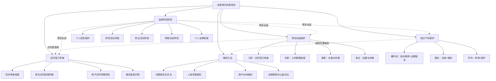

## 本节总结

本节围绕劳动权益、合同审查、知识产权、维权方法和法律风险防范五大板块，构建了一套从"知道权利"到"保护权利"的完整实操体系。这不是一份法律教科书的缩写，而是一套可以直接拿来用的行动指南——每个知识点都对应着具体的场景、操作步骤和工具。

### 核心框架回顾

五节内容的逻辑关系如下：

### 一、劳动权益保护：贯穿职业生涯的完整防线

劳动关系是普通人一生中最重要、持续时间最长的法律关系。本节按照"入职→在职→离职→争议解决"四个阶段，覆盖了劳动权益保护的全部核心环节。

**入职阶段**的关键是合同签订。一份劳动合同必须核查七大要素：合同主体（与谁签）、合同期限（签多久）、工作内容与地点（做什么、在哪做）、薪酬条款（拿多少钱）、试用期（试多久）、社保公积金（五险一金）、竞业限制（离职后能不能去竞争对手）。试用期长度与合同期限直接挂钩——3年以上合同试用期最长6个月，且同一用人单位只能约定一次试用期。入职时还需要警惕八大陷阱：扣押证件、收取押金、空白合同、不给合同副本、强制加班、试用期过长、不缴社保、口头承诺不落纸面。

**在职阶段**最容易被侵蚀的权益是加班费和社保。法定加班费倍数是铁律：工作日1.5倍、休息日2倍、法定节假日3倍。社保缴纳基数应以实际工资为基准，而非最低工资标准。此外，带薪年假、工伤认定、职场性骚扰防治等都是在职期间需要关注的重要权益。

**离职阶段**的核心是经济补偿金的计算和竞业限制的处理。经济补偿按工作年限计算，每满一年支付一个月工资；违法解除则双倍赔偿。辞职信务必以书面形式送达并保留证据——EMS邮寄是最稳妥的方式，快递单上注明"辞职信"字样。

**争议解决**阶段，劳动仲裁是首选途径：免费、一裁终局、审理周期短（一般45天内）。证据是决定胜负的关键——劳动合同、工资流水、考勤记录、聊天截图、录音录像都可能成为关键证据。举证责任在不同事项上有不同分配：解除劳动合同的合法性由用人单位举证，而加班事实需要劳动者初步举证。

### 二、合同签订审查：四步框架识别九成风险

合同审查并非律师的专利。本节提供了一套任何普通人都能执行的四步审查框架：

**第一步：审查主体——"和谁签"。** 通过国家企业信用信息公示系统查企业注册信息，通过中国裁判文书网查涉诉记录，通过中国执行信息公开网查是否为失信被执行人。大额交易前，这三项查询缺一不可。

**第二步：审查内容——"签了什么"。** 核心条款六项（当事人、标的、数量、质量、价款、履行方式）必须完备，重要条款三项（违约责任、争议解决、变更解除）强烈建议包含，常见遗漏条款五项（不可抗力、送达地址、保密、知识产权归属、合同附件）需要主动补充。

**第三步：审查特殊条款——"有没有坑"。** 免责条款不能免除人身损害责任和故意/重大过失的财产损失；违约金一般不超过实际损失的30%；格式条款中不合理免除己方责任的，可主张无效。

**第四步：审查形式——"签得对不对"。** 多页合同盖骑缝章，手写修改处各方签字确认，合同一式多份各执一份。

本节还逐类拆解了租赁合同、借款合同、买卖合同、服务合同、劳动合同的审查要点，并特别分析了电子合同的法律效力、数字签名的可靠性、格式条款的识别技巧。一个关键的实操建议：所有合同签订后，保留原件至少三年（普通诉讼时效），涉及不动产的保留更久。

### 三、知识产权保护：从确权到维权的完整链路

知识产权保护的核心逻辑是"不登记≠不保护，但登记了才好维权"。

**著作权**自创作完成之日起自动产生，但举证是关键。本节提供了三层递进的证据保全体系：第一层是零成本的邮件自证、Git版本控制、社交媒体发布；第二层是推荐的版权登记（中国版权保护中心，费用100-800元）和时间戳认证（联合可信时间戳服务中心，单次10-20元）；第三层是最高级别的区块链存证（中国版权链、蚂蚁链等，50-200元/次）。对于日常创作，"Git+时间戳"双保险即可；对于高价值作品，建议加上版权登记。

网络作品保护需要建立"预防→监测→应对"的完整链条。预防阶段包括版权声明标注和技术防护（水印、防爬虫）；监测阶段利用搜索引擎以图搜图、代码全文搜索等工具定期巡查；应对阶段按照侵权严重程度分级处理——轻微的发警告函、中等的走平台投诉、严重的走法律途径。

**商标保护**的核心是"先注册先得"，注册流程约12-18个月，保护期10年可续展。**专利保护**分发明、实用新型、外观设计三种类型，需要满足新颖性、创造性、实用性三要件。

### 四、维权方法：分场景的高效维权路径

维权不是"打官司"的同义词。本节针对三大高频场景提供了完整的维权路径。

**消费维权**遵循五步递进法：与商家协商（3-7天期限）→12315平台投诉→向行政部门投诉→申请仲裁→提起诉讼。网购有七天无理由退货权，食品药品领域可主张"退一赔十"（最低1000元）。维权前必须做好六项证据准备：购买凭证、商品实物、沟通记录、损害证据、证人信息、其他证据。

**人身损害维权**覆盖交通事故、医疗纠纷两大场景。交通事故的核心是保留现场证据、及时就医、获取交通事故认定书。医疗纠纷的核心是第一时间复印并封存病历资料，申请医疗损害鉴定。

**房产纠纷维权**按纠纷类型分类处理：延期交房按合同主张违约金，房屋质量问题要求维修或赔偿，中介违规向住建部门投诉，房东不退押金走协商→投诉→起诉的递进路径。

法律援助是经济困难公民的兜底保障——通过12348热线或当地法律援助中心即可申请，覆盖劳动报酬、工伤赔偿、赡养费等事项。

### 五、法律风险防范：四个维度的日常防线

法律风险防范的核心理念是"事前预防优于事后救济"。本节从四个维度构建了日常防线：

**个人信息保护**——不随意填写敏感信息、涂抹快递包装、不连公共WiFi做敏感操作、定期检查APP权限、发现泄露向网信部门举报。《个人信息保护法》赋予了个人删除权和更正权。

**财务活动风险**——民间借贷必须签书面借条、通过银行转账交付、利率不超过LPR四倍。投资理财警惕"高收益零风险"承诺，信用卡不要外借、不要轻易为他人担保。

**职业活动风险**——竞业限制期限最长二年，用人单位超三个月未支付补偿可请求解除协议。创业需要选择合适的企业组织形式，签订合伙协议，注册商标，依法缴纳社保。

**网络活动风险**——不发布侮辱诽谤内容、不传播未经证实的谣言、不泄露他人隐私、转发他人作品注明出处。

最后，本节强调了建立个人法律档案的重要性：个人证件类、合同协议类、财务凭证类、其他重要文件四大类，建议电子化备份并加密存储。

### 六条黄金法则

贯穿本节全部内容的核心原则可以提炼为六条：

| 序号 | 法则 | 含义 | 实操意义 |
|-----|------|------|---------|
| 1 | 事前预防优于事后救济 | 养成法律风险防范意识，在问题发生前做好预防 | 签合同前做审查，比打官司省100倍成本 |
| 2 | 书面证据优于口头约定 | 所有重要约定都落实到书面上 | 口头承诺在法庭上几乎无法举证 |
| 3 | 专业咨询优于自行判断 | 复杂法律问题及时寻求专业律师帮助 | 涉及金额较大或刑事风险时，律师费是最划算的投资 |
| 4 | 及时行动优于拖延等待 | 注意诉讼时效（一般3年），及时主张权利 | 过了时效，再有理也丧失胜诉权 |
| 5 | 持续学习优于一知半解 | 法律法规不断更新，保持学习习惯 | 2021年《民法典》生效后，大量旧规定被修改 |
| 6 | 分级应对优于一刀切 | 根据纠纷严重程度选择合适的解决路径 | 小额消费投诉12315比起诉高效10倍 |

### 快速行动清单

如果你现在就想开始实践本节内容，以下是最优先的五件事：

1. **今天就做**：检查手头的劳动合同，确认七大要素是否完备；建立"劳动权益档案"文件夹，开始归档工资条和社保记录
2. **本周做**：下载"国家社会保险公共服务平台"APP，查询自己的社保缴费记录是否与实际工资匹配
3. **本月做**：建立个人法律档案，将身份证、户口本、学历证书、房产证、保险合同等重要文件电子化备份
4. **养成习惯**：每签一份合同前，用四步审查框架过一遍；每次消费保留发票和电子订单截图
5. **存好号码**：12315（消费维权）、12333（劳动保障）、12348（法律咨询）、12345（政务服务热线）——这四个号码值得存在手机通讯录里

### 常见误区纠正

本节内容学习后，需要特别注意避免以下认知误区：

**误区一："试用期可以随意辞退"。** 试用期内用人单位辞退劳动者，必须证明"不符合录用条件"，且录用条件需事先明确告知并写入合同。没有明确的录用条件标准，试用期辞退就是违法解除。

**误区二："口头约定也有法律效力"。** 口头合同在法律上确实有效，但问题在于举证。没有书面记录的口头约定，在纠纷中几乎等于没有约定。

**误区三："不签劳动合同对劳动者更灵活"。** 恰恰相反——未签劳动合同超过一个月的，用人单位需支付双倍工资；满一年未签的，视为已订立无固定期限劳动合同。

**误区四："作品不登记就没有著作权"。** 著作权自创作完成之日起自动产生，不需要任何登记或审批。但登记证书是法院认定归属的初步证据，能大幅降低维权成本。

**误区五："诉讼时效过了就不能起诉"。** 诉讼时效过了仍然可以起诉，只是对方可以提出时效抗辩从而免除义务。如果对方不提抗辩，法院不会主动适用时效规定。此外，催告、起诉等行为可以中断时效重新计算。

**误区六："打官司一定要请律师"。** 对于简单的消费纠纷、小额劳动争议，完全可以自行处理。12348法律援助热线和各地法律援助中心可以提供免费咨询。律师费通常按标的额比例收取，小额案件请律师可能不划算。

### 从知识到行动

法律常识的终极价值不在于"知道多少条文"，而在于"关键时刻能不能做出正确判断"。一个记得保留工资条的打工人，比一个背熟《劳动合同法》全文但从不保留证据的人，在劳动仲裁中胜算大得多。

本节提供的不是理论知识的罗列，而是一套可以直接嵌入日常生活的行动系统。把合同审查变成签合同前的本能反应，把证据保存变成日常工作的一部分，把12315和12348的号码存在手机里——这些微小的习惯，比任何法律条文都更能保护你的权益。

在日常生活中养成良好的法律意识和证据保存习惯，是保护自身权益的最佳策略。不要等到出了问题才去翻法条，而要在问题发生之前，就已经做好了准备。
