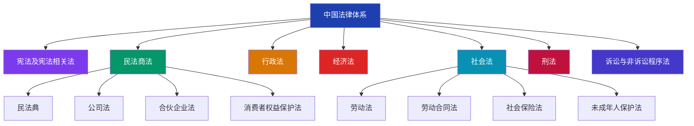
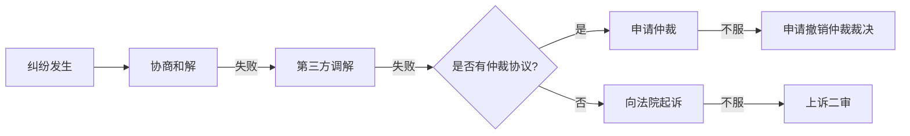
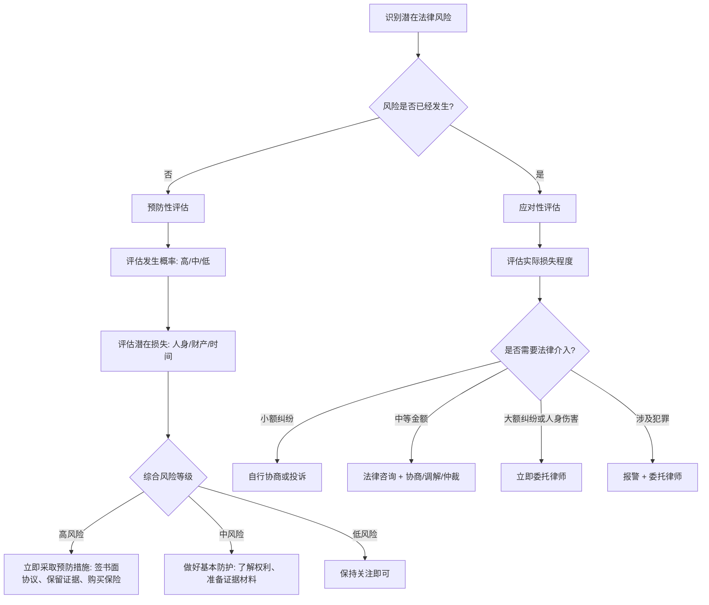

## 一、法律体系概述

在学习任何具体法律领域之前，你需要先建立一张"法律地图"——知道中国法律体系是怎么组织的、不同层级的法律规范之间是什么关系、遇到不同类型的问题该去哪里找答案。这张地图是你后续所有法律知识的坐标系：没有它，你学劳动法不知道它和民法的关系，学消费者权益保护不知道该援引哪部法律，遇到纠纷时也不知道该找哪个机构。

### 1.1 什么是法律体系

法律体系（Legal System）是一个国家现行全部法律规范按照不同的法律部门分类组合而形成的有机统一整体。通俗地说，法律体系就是"法律的分类收纳系统"——它告诉你这个国家有哪些法律、这些法律之间是什么关系、它们分别管什么事。

理解法律体系的核心价值在于两点：

**第一，快速定位法律依据。** 当你遇到一个法律问题时，比如公司拖欠工资，你需要知道应该去找《劳动法》还是《民法典》；当你网购到假货时，应该援引《消费者权益保护法》还是《产品质量法》。法律体系帮你建立这种"问题→法律"的映射能力。

**第二，理解法律之间的关系。** 法律不是孤立存在的。《劳动合同法》是《劳动法》的特别法，《民法典》合同编是一般合同规则的基础，《电子商务法》在消费者权益保护方面是对《消费者权益保护法》的补充。理解这些关系，你才能在复杂场景中找到最有利的法律武器。

### 1.2 法律渊源：法律规范的效力层级

法律渊源是指法律规范的表现形式，也就是法律"长什么样"。中国的法律渊源按照效力等级从高到低排列，形成一个金字塔结构。这个金字塔不是摆设——当不同层级的规定发生冲突时，上位法自动优先适用。

#### 1.2.1 宪法：最高法律效力

《中华人民共和国宪法》是国家的根本法，具有最高法律效力。宪法规定了国家的根本制度、公民的基本权利和义务、国家机构的组织和职权等根本性问题。

宪法的特殊地位体现在三个方面：

- **一切法律、行政法规和地方性法规都不得同宪法相抵触。** 如果某部法律的某个条款被认定违反宪法，该条款无效。
- **宪法是其他法律的立法依据。** 《民法典》第一条明确写明"根据宪法，制定本法"。
- **宪法的修改程序最严格。** 需要全国人大全体代表的三分之二以上多数通过，而普通法律只需要过半数。

对普通人来说，宪法虽然不直接用于日常诉讼，但它是所有权利的最终来源。你享有言论自由、人身自由、受教育权、劳动权等基本权利，根源于宪法的规定。

#### 1.2.2 法律：全国人大及其常委会制定

法律分为两类：

- **基本法律**：由全国人民代表大会制定和修改，如《民法典》《刑法》《民事诉讼法》。这些法律涉及国家和社会生活中带有根本性、全局性的问题。
- **一般法律**：由全国人大常委会制定和修改，如《劳动法》《消费者权益保护法》《个人信息保护法》。常委会每两个月开一次会，立法效率更高，是日常立法的主要力量。

截至 2024 年，中国现行有效的法律约 305 件，涵盖了社会生活的方方面面。

#### 1.2.3 行政法规：国务院制定

行政法规是国务院根据宪法和法律制定的规范性文件，通常以"条例""规定""办法"命名。行政法规的效力低于法律，高于地方性法规和部门规章。

常见示例：

- 《劳动合同法实施条例》——对《劳动合同法》的细化和补充
- 《工伤保险条例》——工伤认定和赔偿的具体操作规则
- 《不动产登记暂行条例》——房产登记的具体程序
- 《保障中小企业款项支付条例》——保护中小企业不被大企业拖欠款项

行政法规在日常生活中的实际作用：当法律条文比较原则性时，行政法规会给出具体的操作标准。比如《劳动法》规定了加班费标准，但具体的计算基数怎么确定，要看《劳动合同法实施条例》的规定。

#### 1.2.4 地方性法规：地方人大制定

地方性法规包括两类：

- **省级地方性法规**：由省、自治区、直辖市人大及其常委会制定，在本行政区域内有效。
- **设区的市地方性法规**：由设区的市人大及其常委会制定，限于城乡建设与管理、环境保护、历史文化保护三个方面。

地方性法规的意义在于因地制宜。比如北京有《北京市生活垃圾管理条例》、上海有《上海市生活垃圾管理条例》，同一个问题各地规定可能不同。

#### 1.2.5 部门规章和地方政府规章

- **部门规章**：由国务院各部委、各委员会、中国人民银行、审计署等制定，如市场监管总局的《网络交易监督管理办法》、人社部的《企业职工带薪年休假实施办法》。
- **地方政府规章**：由省级人民政府和设区的市人民政府制定，效力低于地方性法规。

#### 1.2.6 司法解释

司法解释不是严格意义上的"法律"，但在司法实践中具有接近法律的约束力。最高人民法院和最高人民检察院对审判、检察工作中具体应用法律的问题进行解释，各级法院和检察院必须遵照执行。

司法解释在日常法律生活中的重要性：

- 《最高人民法院关于审理民间借贷案件适用法律若干问题的规定》明确了民间借贷利率的司法保护上限（合同成立时一年期贷款市场报价利率的四倍）
- 《最高人民法院关于适用〈中华人民共和国民法典〉婚姻家庭编的解释（一）》细化了离婚财产分割、子女抚养等实务操作
- 最高人民检察院、公安部联合发布的立案追诉标准，决定了哪些行为会被追究刑事责任

#### 1.2.7 效力层级总表

| 层级 | 制定主体 | 效力等级 | 命名规律 | 常见示例 |
|------|---------|---------|---------|---------|
| 宪法 | 全国人民代表大会 | 最高法律效力 | 《XX宪法》 | 《中华人民共和国宪法》 |
| 基本法律 | 全国人民代表大会 | 仅次于宪法 | 《XX法》 | 《民法典》《刑法》 |
| 一般法律 | 全国人大常委会 | 与基本法律同级 | 《XX法》 | 《劳动法》《消费者权益保护法》 |
| 行政法规 | 国务院 | 低于法律 | 《XX条例》《XX办法》 | 《工伤保险条例》 |
| 地方性法规 | 省级/设区的市人大 | 本行政区域内有效 | 《XX省/市XX条例》 | 《上海市食品安全条例》 |
| 部门规章 | 国务院各部委 | 低于行政法规 | 《XX办法》《XX规定》 | 《网络交易监督管理办法》 |
| 地方政府规章 | 省级/设区的市政府 | 低于地方性法规 | 《XX办法》《XX规定》 | 各地政府令 |
| 司法解释 | 最高法/最高检 | 指导审判/检察工作 | 《关于XX的解释/规定》 | 民法典各编司法解释 |

### 1.3 法律适用的基本规则

当法律规范之间发生冲突或者对同一问题有不同规定时，按照以下规则确定适用的法律：

#### 规则一：上位法优于下位法

这是最基本的原则。效力等级高的法律规范优先于效力等级低的。比如某市政府规章的规定与国务院行政法规矛盾，必须适用行政法规。

**实际应用场景：** 某地社保局依据部门规章拒绝你的工伤认定申请，但行政法规《工伤保险条例》的条文支持你的主张，你可以主张适用上位法，行政法规的效力高于部门规章。

#### 规则二：特别法优于一般法

同一机关制定的法律中，针对特定事项的特别规定优先于一般规定。比如《劳动合同法》相对于《民法典》是劳动领域的特别法，在劳动关系问题上优先适用《劳动合同法》。

**实际应用场景：** 你和公司的劳动纠纷同时涉及合同违约和劳动权益侵害。虽然《民法典》有合同违约的一般规定，但《劳动合同法》对劳动者有特殊保护，应当优先适用《劳动合同法》。

#### 规则三：新法优于旧法

同一机关制定的法律对同一事项有新旧不同规定的，适用新的规定。这反映了法律随着社会发展而更新的规律。

**实际应用场景：** 2021 年 1 月 1 日《民法典》施行后，《合同法》《物权法》《侵权责任法》等九部法律同时废止。如果你的纠纷涉及 2021 年之前签订的合同，原则上适用合同签订时的旧法，但 2021 年之后新签的合同必须适用《民法典》。

#### 规则四：法律不溯及既往（附例外）

法律一般不适用于其生效前发生的事件和行为。但有两个重要例外：

- **有利追溯**：新法对当事人更有利时可以适用新法。比如刑法中的"从旧兼从轻"原则——新法处罚更轻时适用新法。
- **程序从新**：程序法（诉讼法）通常适用起诉时的新规定，不区分行为发生时间。

### 1.4 七大法律部门详解

中国法律体系由七大法律部门组成，每个部门管一类社会关系。你不需要记住所有法律部门，但需要知道不同类型的问题属于哪个"部门"——这决定了你该去找哪部法律。

#### 1.4.1 宪法及宪法相关法

这是法律体系的基石，规定国家根本制度和公民基本权利。

**核心法律：** 《宪法》《立法法》《选举法》《国务院组织法》《民族区域自治法》《香港特别行政区基本法》《澳门特别行政区基本法》等。

**与普通人的关系：** 虽然宪法条文不直接用于诉讼，但宪法权利是所有权利的源头。当你的基本权利受到侵害，而普通法律没有明确规定时，宪法原则可以作为论证依据。此外，《立法法》规定了哪些事项只能由法律来规定（法律保留事项），行政机关无权自行设定。

#### 1.4.2 民法商法

这是与普通人关系最密切的法律部门，规范平等主体之间的人身关系和财产关系。"平等主体"意味着双方不存在管理与被管理的关系，而是平等协商。

**核心法律：**

- 《民法典》——中国法律体系中条文最多的法律（1260 条），涵盖总则、物权、合同、人格权、婚姻家庭、继承、侵权责任七编
- 《公司法》——公司设立、运营、治理的规则
- 《合伙企业法》——合伙企业的设立和管理
- 《消费者权益保护法》——保护消费者在消费活动中的合法权益

**关键概念——民事法律行为的效力：**

| 效力状态 | 含义 | 典型情形 | 法律后果 |
|---------|------|---------|---------|
| 有效 | 合法成立，具有法律约束力 | 双方自愿签订的合同 | 各方必须履行 |
| 无效 | 自始无效，从未产生法律效力 | 违反法律强制性规定、恶意串通损害他人利益 | 返还财产、赔偿损失 |
| 可撤销 | 一方有权请求撤销 | 重大误解、欺诈、胁迫、显失公平 | 撤销后自始无效 |
| 效力待定 | 效力取决于第三人追认 | 限制民事行为能力人签订的合同 | 追认后有效，拒绝则无效 |

#### 1.4.3 行政法

行政法规范行政机关的组织、职权和行使行政权力的程序，是"民告官"的法律依据。

**核心法律：** 《行政处罚法》《行政许可法》《行政强制法》《行政复议法》《行政诉讼法》《国家赔偿法》。

**与普通人的关系：** 行政法是你对抗公权力侵害的武器。当政府部门违法作出行政决定（如不合理罚款、违法拆除、拒绝办理许可）时，你可以通过行政复议或行政诉讼维护自己的权益。

**行政复议 vs 行政诉讼对比：**

| 维度 | 行政复议 | 行政诉讼 |
|------|---------|---------|
| 受理机关 | 上一级行政机关或同级政府 | 人民法院 |
| 审查范围 | 合法性 + 合理性 | 主要审查合法性 |
| 费用 | 免费 | 需缴纳诉讼费（50 元） |
| 审理期限 | 60 日内作出决定 | 6 个月内一审判决 |
| 对结果不服 | 可再提起行政诉讼 | 可上诉至上级法院 |
| 特点 | 程序简便、速度快、不伤"关系" | 独立性强、权威性高、可公开审理 |

#### 1.4.4 经济法

经济法是国家对经济活动进行宏观调控和市场规制的法律，主要保护的是市场经济秩序。

**核心法律：** 《反垄断法》《反不正当竞争法》《价格法》《广告法》《食品安全法》《药品管理法》《税收征收管理法》《个人所得税法》。

**与普通人的关系：** 经济法虽然看起来"高大上"，但直接影响你的日常生活。《食品安全法》保护你买到的食品是安全的；《广告法》禁止虚假广告误导你消费；《个人所得税法》决定你的工资要交多少税；《反不正当竞争法》打击虚假宣传和商业贿赂。

#### 1.4.5 社会法

社会法以保护社会弱势群体的利益为宗旨，重点保障劳动者、老年人、未成年人、残疾人等群体的权益。

**核心法律：**

- 《劳动法》《劳动合同法》——劳动者权益保护的双保险
- 《社会保险法》——五险（养老、医疗、失业、工伤、生育）的法律基础
- 《未成年人保护法》——保护未满 18 周岁的未成年人
- 《老年人权益保障法》——保护 60 周岁以上的老年人
- 《残疾人保障法》——保障残疾人的合法权益
- 《妇女权益保障法》——保障妇女在政治、经济、文化等各方面的平等权利
- 《慈善法》——规范慈善活动，保护捐赠人和受益人的权益

#### 1.4.6 刑法

刑法是最严厉的法律，规定了什么行为构成犯罪以及应当处以什么刑罚。刑法的基本原则是"罪刑法定"——法律没有明文规定为犯罪行为的，不得定罪处刑。

**与普通人的关系：** 你不需要精通刑法，但需要知道一些"红线"：

- 故意伤害他人身体达到轻伤以上，构成故意伤害罪（3 年以下有期徒刑）
- 诈骗公私财物价值 3000 元以上，构成诈骗罪
- 醉酒驾驶机动车，构成危险驾驶罪（处拘役并处罚金）
- 在网络上散布谣言造成严重后果，可能构成编造、故意传播虚假信息罪
- 非法获取、出售公民个人信息 5000 条以上，构成侵犯公民个人信息罪

#### 1.4.7 诉讼与非诉讼程序法

程序法规定了解决纠纷的步骤和方式，是"怎么打官司"的法律。

**核心法律：**

| 法律 | 适用场景 | 关键特点 |
|------|---------|---------|
| 《民事诉讼法》 | 平等主体之间的民事纠纷 | 两审终审制，简易程序 3 个月内审结 |
| 《刑事诉讼法》 | 犯罪行为的追诉和审判 | 国家追诉为主，自诉案件可直接起诉 |
| 《行政诉讼法》 | 公民对行政行为不服 | 民告官，被告负举证责任 |
| 《仲裁法》 | 合同纠纷和其他财产权益纠纷 | 一裁终局，不能上诉 |
| 《人民调解法》 | 民间纠纷的调解 | 免费、快速、不伤和气 |
| 《劳动争议调解仲裁法》 | 劳动纠纷 | 劳动仲裁前置，不收费 |

### 1.5 如何查找和理解法律条文

很多人遇到法律问题时的第一反应是"百度一下"，但搜索引擎上的法律信息良莠不齐，很多是过时的、片面的甚至错误的。掌握查找和理解法律条文的正确方法，是法律意识的基本功。

#### 1.5.1 权威法律查询渠道

| 渠道 | 网址 | 特点 | 适用场景 |
|------|------|------|---------|
| 国家法律法规数据库 | flk.npc.gov.cn | 官方权威，全国人大常委会维护 | 查询法律、行政法规、司法解释的正式文本 |
| 北大法宝 | pkulaw.com | 专业法律数据库，有法条关联和案例 | 深度研究，查找法条关联案例 |
| 中国裁判文书网 | wenshu.court.gov.cn | 全国法院裁判文书公开 | 查找类似案件的判决结果 |
| 12348 中国法网 | 12348.gov.cn | 司法部官方平台，提供免费法律咨询 | 在线法律咨询、找律师 |
| 中国普法网 | legalinfo.gov.cn | 普法宣传为主 | 了解法律常识和法治动态 |

#### 1.5.2 阅读法律条文的基本方法

法律条文有自己独特的语言结构，初学者常常看不懂。以下是理解法条的核心方法：

**第一步：看"条"号定位。** 法律条文以"第X条"编号，这是最精确的引用方式。比如"《民法典》第 188 条"就比"民法典关于诉讼时效的规定"准确得多。

**第二步：区分"总则"和"分则"。** 总则规定一般原则和通用规则，分则针对具体事项。遇到问题时，先看分则的具体规定，再用总则的原则来补充理解。

**第三步：注意"但书"条款。** 法条中"但是"后面的内容是对前面规定的例外或限制。比如"当事人应当按照约定全面履行自己的义务，但是法律另有规定的除外"——"但是"后面的内容往往才是实际操作中的关键。

**第四步：结合"款"和"项"理解。** 一条法律可能包含多款（用数字编号），一款可能包含多项（用括号数字编号）。第 X 条第 X 款第 X 项是最精确的法条引用格式。

**第五步：查看关联条文和司法解释。** 一个法律问题往往涉及多条法律规定。先找到核心法条，然后查看该法条引用的其他条文，再查找是否有司法解释对该条文进行细化。

### 1.6 公民日常最常接触的五大法律领域

作为普通公民，你日常生活中最常接触的法律领域可以归纳为以下五个。这五个领域覆盖了绝大多数日常法律需求，也是本章后续各节的重点内容。

#### 领域一：民法——"万法之母"

民法规范平等主体之间的人身关系和财产关系。你签合同、买房子、结婚、继承遗产、借钱给朋友、被人侵权要求赔偿——所有这些都属于民法的范畴。

2021 年 1 月 1 日施行的《民法典》被称为"社会生活的百科全书"，共 7 编 1260 条，是你日常生活中最可能用到的法律。

#### 领域二：劳动法——"打工人的护身符"

劳动法保护劳动者在劳动关系中的合法权益。你入职签合同、加班要加班费、被辞退要补偿金、受了工伤要赔偿——这些都由劳动法保障。

#### 领域三：消费者权益保护法——"花钱人的底气"

消费者权益保护法保护你在购买商品和接受服务过程中的合法权益。你买到假货可以要求"退一赔三"、网购可以"七天无理由退货"、格式条款中的"霸王条款"无效——这些都是消费者权益保护法赋予你的权利。

#### 领域四：知识产权法——"创作者的武器"

知识产权法保护智力劳动成果。你写的代码、拍的照片、录的视频、设计的 Logo、注册的品牌名称——都可能受到著作权、专利权或商标权的保护。

#### 领域五：个人信息保护法——"数字时代的隐私盾牌"

个人信息保护法规范个人信息的收集、使用和保护。APP 要获取你的位置信息必须经过你同意、你有权要求平台删除你的个人信息、企业泄露你的信息要承担法律责任——这是数字时代最重要的法律保障之一。

### 1.7 法律意识的核心要素

法律意识不是让你背法条，而是让你在日常生活中养成几个关键思维习惯。这些习惯能帮你在问题发生之前预防风险，在问题发生之后正确应对。

#### 1.7.1 权利意识：知道自己享有哪些合法权利

很多人吃亏不是因为法律不保护他们，而是因为他们根本不知道自己有权利。以下是几个最容易被忽视的权利：

- **知情权：** 你有权知道商品的真实信息、公司规章制度的全部内容、政府部门作出对你不利决定的理由。
- **选择权：** 你有权自主选择商品和服务，任何人不得强制交易。捆绑销售、强制搭售都是违法的。
- **公平交易权：** 你有权获得质量保障、价格合理、计量正确的商品或服务。
- **个人信息权：** 你有权知道谁在收集你的信息、收集了什么、用来干什么，并有权要求删除。
- **劳动报酬权：** 你有权按时足额获得劳动报酬，任何人不得克扣或无故拖欠。

#### 1.7.2 规则意识：了解行为的法律边界

法律不只保护你的权利，也规定了你的义务和行为边界。规则意识的核心是知道"什么事不能做"：

- 不要在网络上随意转发未经证实的信息，可能构成名誉侵权甚至刑事犯罪
- 不要未经他人同意录音录像，可能侵犯隐私权（但在自己家中录制、或者为保护自己合法权益的录音通常合法）
- 不要在劳动关系中擅自"自离"，可能被公司追究培训费等损失
- 不要在没有书面协议的情况下大额转账或出借款项

#### 1.7.3 证据意识：在日常交易中注意保留证据

证据意识可能是法律意识中最重要的一个。很多人明明有理，却因为没有证据而败诉。你需要养成的习惯：

- **保留书面文件：** 合同、协议、收据、发票、银行转账记录——纸质或电子版都行，但必须保存。
- **保留电子记录：** 微信聊天记录、短信、电子邮件、APP 下单记录——这些都可以作为电子证据。关键是要保留原始载体（原始手机、原始电脑），截图的证明力弱于原始记录。
- **及时固定证据：** 发现权益受侵害时，第一时间拍照、录像、截图。网页内容可能被删除，聊天记录可能被对方撤回。
- **善用公证保全：** 对于容易灭失的证据（如网页内容、现场状况），可以到公证处做证据保全公证，增强证据的证明力。

#### 1.7.4 时效意识：知道维权的时间限制

法律不保护"躺在权利上睡觉的人"。超过时效再维权，虽然你的实体权利还在，但法院可能不再支持你。

| 权利类型 | 时效期间 | 起算时间 | 法律依据 |
|---------|---------|---------|---------|
| 一般民事权利（合同纠纷、侵权等） | 3 年 | 知道或应当知道权利受侵害之日 | 《民法典》第 188 条 |
| 人身损害赔偿 | 3 年 | 知道或应当知道受到损害之日 | 《民法典》第 188 条 |
| 最长保护期 | 20 年 | 权利受侵害之日 | 《民法典》第 188 条 |
| 劳动争议仲裁 | 1 年 | 知道或应当知道权利受侵害之日 | 《劳动争议调解仲裁法》第 27 条 |
| 劳动报酬争议 | 特殊：劳动关系存续期间不受 1 年限制 | 离职之日起 1 年内 | 《劳动争议调解仲裁法》第 27 条 |
| 产品质量缺陷造成损害 | 2 年 | 知道或应当知道权益受损之日 | 《产品质量法》第 45 条 |
| 国家赔偿 | 2 年 | 知道或应当知道国家机关及其工作人员行使职权时的行为侵犯其权利之日 | 《国家赔偿法》第 39 条 |

**时效中断的三种法定事由（中断后重新计算 3 年）：**

1. **向义务人提出履行请求：** 比如你向欠钱的朋友发微信催款，时效从催款之日起重新计算 3 年。注意保留催款记录作为证据。
2. **义务人同意履行义务：** 比如对方回复"我下个月还你"，时效重新计算。
3. **提起诉讼或仲裁：** 你向法院起诉或向仲裁机构申请仲裁，时效中断。

#### 1.7.5 程序意识：了解维权的法定途径和步骤

知道自己有权利是一回事，知道怎么实现权利是另一回事。不同类型的纠纷有不同的维权路径，选错路径会浪费大量时间和金钱。

**民事纠纷的维权路径（从简到繁）：**

**劳动纠纷的维权路径（必须先仲裁）：**

**消费者纠纷的维权路径：**

### 1.8 法律风险评估框架

法律风险评估不是律师的专利，每个公民都可以用一个简单的框架来评估自己面临的法律风险。这个框架的核心思路是：识别风险→评估严重性→决定应对策略。

#### 1.8.1 风险识别的四个维度

在日常生活中，法律风险主要来自以下四个维度：

**人身风险：** 可能造成人身伤害或健康损害的场景。比如交通事故、医疗事故、食品安全问题、高空抛物等。这类风险的核心法律依据是《民法典》侵权责任编和《刑法》。

**财产风险：** 可能造成财产损失的场景。比如合同违约、投资诈骗、租房纠纷、借贷风险等。这类风险的核心法律依据是《民法典》合同编和物权编。

**劳动风险：** 与劳动关系相关的风险。比如被违法辞退、工资被拖欠、工伤未认定、社保未缴纳等。这类风险的核心法律依据是《劳动法》和《劳动合同法》。

**信息风险：** 个人信息泄露、隐私被侵犯、网络诈骗等。这类风险的核心法律依据是《个人信息保护法》和《网络安全法》。

#### 1.8.2 风险评估决策流程

#### 1.8.3 维权成本收益分析

不是所有的法律纠纷都值得诉诸法律。在决定是否维权之前，做一个简单的成本收益分析：

| 评估维度 | 需要考虑的因素 |
|---------|---------------|
| 金钱成本 | 诉讼费（财产案件按标的额 2.5%-0.5% 递减计算）、律师费（通常 5000-50000 元不等）、鉴定费、公证费 |
| 时间成本 | 一审通常 3-6 个月，二审再加 3 个月，执行可能更久 |
| 精力成本 | 收集证据、出庭应诉、应对对方反诉或拖延策略 |
| 胜诉概率 | 证据是否充分、法律依据是否明确、对方是否有履行能力 |
| 预期收益 | 经济赔偿金额、精神损害赔偿（通常 1000-100000 元）、恢复名誉等非金钱利益 |

**经验法则：** 标的额在 5000 元以下的纠纷，优先选择协商、投诉（12315、12345 等）或调解，诉讼的综合成本可能超过收益。标的额在 5000 元至 5 万元之间的纠纷，可以考虑先咨询律师评估胜诉概率，再决定是否诉讼。标的额在 5 万元以上的纠纷，建议委托律师处理。

### 1.9 常见认知误区

#### 误区一："我又不打官司，学法律干什么"

**事实：** 法律常识最重要的作用恰恰在"不打官司"。知道合同怎么签才有效、知道什么情况下可以拒绝公司的不合理要求、知道遇到消费纠纷该找谁投诉——这些知识能帮你预防 80% 的法律纠纷。据中国司法大数据研究院统计，超过 60% 的民事纠纷如果当事人事先了解基本法律规定，完全可以避免。

#### 误区二："口头约定不算数"

**事实：** 根据《民法典》，口头合同和书面合同具有同等法律效力。但问题是口头约定难以证明——"说了"和"没说"在法庭上几乎无法区分。所以正确的认知是：口头约定有法律效力，但难以举证。涉及金钱往来，一定要有书面记录（哪怕只是一条微信消息确认）。

#### 误区三："法律离我很远"

**事实：** 你每天都在和法律打交道。早上叫外卖（电子商务法、食品安全法、消费者权益保护法），上班签到（劳动法、劳动合同法），午休刷手机（个人信息保护法、网络安全法），下班打车（民法典运输合同、消费者权益保护法），晚上网购（电子商务法、消费者权益保护法）。法律不是"出事了才用"的工具，而是嵌入在你每一天的生活中的行为准则。

#### 误区四："找关系比找法律管用"

**事实：** 在全面依法治国的推进下，"关系"的作用在持续缩小，而法律的确定性在不断增强。更关键的是，"找关系"本身可能涉及行贿受贿的法律风险。与其花钱找关系，不如花时间学法律——法律是可预期的、可验证的、可救济的，而"关系"是不确定的、不可靠的、可能违法的。

#### 误区五："法律条文太复杂，普通人学不会"

**事实：** 你不需要学会所有法律条文，就像你不需要学会所有医学知识也能做好日常健康管理一样。你需要掌握的是核心规则和思维方法——知道什么情况去找什么法律、知道自己的基本权利有哪些、知道维权的基本流程。本章后续各节正是围绕这个目标设计的。

### 1.10 本节小结

法律体系是所有法律知识的坐标系。通过本节的学习，你需要建立以下认知框架：

**层级框架：** 宪法→法律→行政法规→地方性法规→部门规章→司法解释，效力从高到低，冲突时上位法优先。

**部门框架：** 七大法律部门分别管不同类型的法律关系——民法管平等主体之间的关系、行政法管"民与官"的关系、刑法管犯罪、劳动法管劳动关系等。

**维权框架：** 不同纠纷有不同的最优维权路径——民事纠纷可以协商→调解→仲裁/诉讼，劳动纠纷必须先仲裁，消费者纠纷可以先投诉 12315。

**风险框架：** 识别风险→评估等级→决定策略→保留证据→定期复查。

建立这些框架之后，后续各节的内容就有了"挂靠"的骨架。学民法基础时你知道它是七大法律部门之一、效力低于宪法但高于行政法规；学劳动法时你知道劳动纠纷必须先走仲裁程序；学消费者权益保护时你知道"退一赔三"的法律依据在哪部法律的第几条——这就是法律地图的价值。
