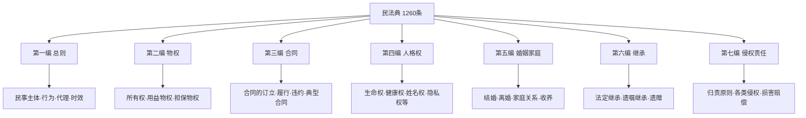
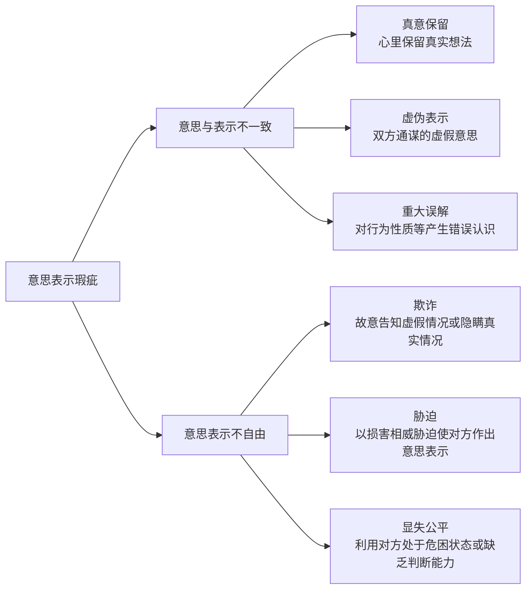
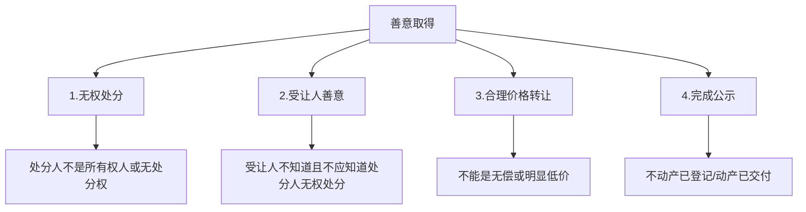
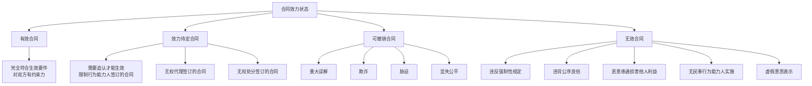
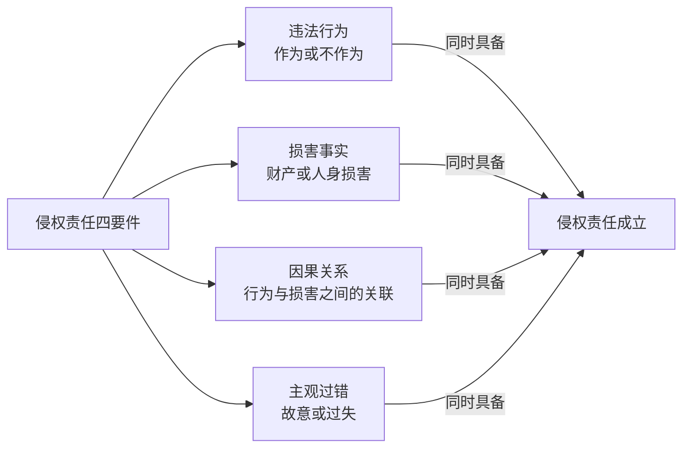
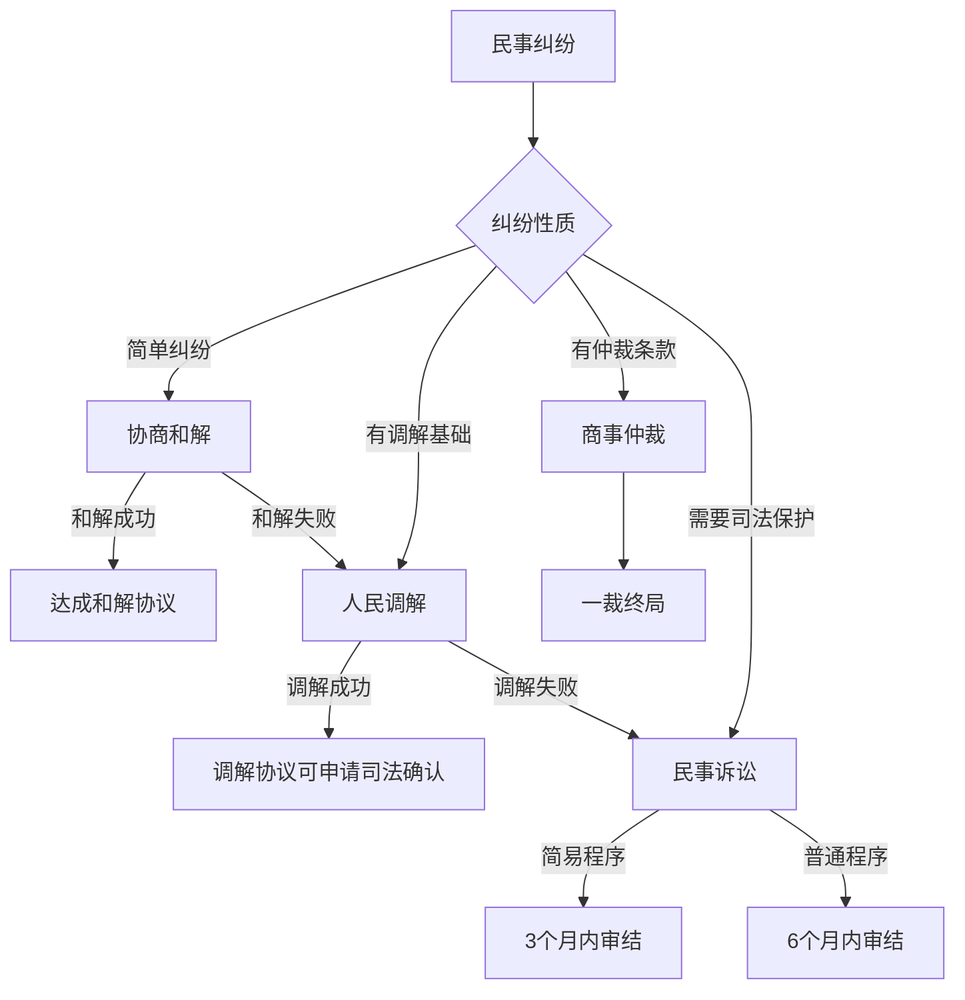

## 二、民法基础

民法是调整平等主体之间人身关系和财产关系的法律规范的总称。它与每个人的日常生活息息相关——从你买一杯咖啡、租一间房、签一份劳动合同，到结婚、继承、维权，背后都有民法在起作用。2021年1月1日起施行的《中华人民共和国民法典》是新中国第一部以"法典"命名的法律，共7编1260条，被称为"社会生活的百科全书"。

### 2.1 民法总则

民法总则是民法典的"总纲"，规定了民事活动的基本原则和一般性规则，对后续各编具有统领和指导作用。

#### 2.1.1 民事主体

民事主体是指能够参与民事法律关系、享有民事权利和承担民事义务的当事人。我国民法规定了三类民事主体：

| 主体类型 | 定义 | 典型举例 | 民事行为能力 |
|---------|------|---------|------------|
| 自然人 | 基于自然出生而取得民事主体资格的人 | 你、我、每一个公民 | 按年龄和精神状态分三档 |
| 法人 | 具有民事权利能力和行为能力，依法独立享有民事权利和承担民事义务的组织 | 公司、事业单位、社会团体 | 自成立时起享有，至终止时消灭 |
| 非法人组织 | 不具有法人资格，但能以自己名义从事民事活动的组织 | 个人独资企业、合伙企业、不具有法人资格的专业服务机构 | 以自己的名义独立参与民事活动 |

**自然人的民事行为能力分档：**

自然人的行为能力直接决定了其签订合同、处分财产等行为的法律效力，这是日常生活中最容易忽略也最容易踩坑的地方。

| 类别 | 年龄/条件 | 行为效力 | 生活场景举例 |
|-----|----------|---------|------------|
| 完全民事行为能力人 | 18周岁以上；16-18周岁以自己劳动收入为主要生活来源的视为完全 | 独立实施的民事法律行为有效 | 自己签租房合同、办理银行业务 |
| 限制民事行为能力人 | 8-18周岁；不能完全辨认自己行为的成年人 | 纯获利益的行为有效；与其年龄、智力相适应的行为有效；其他行为需法定代理人同意或追认 | 12岁孩子用压岁钱买文具有效，但买手机需要家长同意 |
| 无民事行为能力人 | 不满8周岁；完全不能辨认自己行为的成年人 | 由法定代理人代理实施民事法律行为 | 5岁孩子"购买"游戏皮肤，家长可主张无效要求退款 |

> **常见误区**：很多家长不知道8周岁是一条重要法律分界线。8周岁以下孩子的一切民事行为均需法定代理人代理；8-18周岁为限制行为能力人，可以独立实施与其年龄、智力相适应的行为，但大额消费（如打赏主播、充值游戏）通常可追回。2020年最高人民法院明确：限制民事行为能力人未经监护人同意的大额网络打赏，监护人可以请求返还。

**法人的分类：**

法人
├── 营利法人（以取得利润并分配给出资人为目的）
│   ├── 有限责任公司
│   ├── 股份有限公司
│   └── 其他企业法人
├── 非营利法人（为公益或其他非营利目的）
│   ├── 事业单位（如公立学校、医院）
│   ├── 社会团体（如行业协会、学术团体）
│   ├── 基金会
│   └── 社会服务机构
└── 特别法人
    ├── 机关法人（政府机关）
    ├── 农村集体经济组织法人
    ├── 城镇农村合作经济组织法人
    └── 基层群众性自治组织法人（居委会、村委会）

> **实操要点**：与企业做生意时，务必核实对方的法人主体资格。可以通过"国家企业信用信息公示系统"（https://www.gsxt.gov.cn）查询企业的注册信息、经营状态、法定代表人等关键信息。如果对方已经被吊销营业执照或注销，其签订的合同可能无法正常履行。

#### 2.1.2 民事法律行为

民事法律行为是民事主体通过意思表示设立、变更、终止民事法律关系的行为。这是民法中最核心的概念之一，因为绝大多数民事活动都是通过民事法律行为完成的。

**有效民事法律行为的四要件：**

| 要件 | 含义 | 违反后果 | 典型例子 |
|-----|------|---------|---------|
| 行为人具有相应行为能力 | 签约人必须有足够的法律资格 | 效力待定或无效 | 8岁孩子卖房，监护人不追认则无效 |
| 意思表示真实 | 内心意愿与外在表达一致 | 可撤销 | 被欺诈签订的合同，受害方可申请撤销 |
| 不违反强制性规定 | 不违反法律和行政法规中的效力性强制性规定 | 无效 | 赌博借款合同因违反法律而无效 |
| 不违背公序良俗 | 不违反公共秩序和善良风俗 | 无效 | "代孕协议"因违背公序良俗而被认定无效 |

**意思表示的瑕疵类型：**

> **生活案例**：张三急需用钱，李四趁机以远低于市价的价格购买张三的房产。张三事后发现交易价格仅为市价的30%，可以"显失公平"为由请求法院撤销该合同。但需注意，撤销权的行使有期限——知道或应当知道撤销事由之日起一年内，超过五年未行使则消灭。

#### 2.1.3 代理制度

代理是代理人在代理权限内，以被代理人名义实施的民事法律行为，对被代理人发生效力。在日常生活中，代理无处不在——委托律师打官司、授权中介卖房、公司员工代表公司签合同等。

| 代理类型 | 特征 | 适用场景 | 风险提示 |
|---------|------|---------|---------|
| 委托代理 | 基于被代理人的委托授权 | 委托律师、房产中介代签合同 | 授权范围要明确，越权代理可能不被追认 |
| 法定代理 | 基于法律直接规定 | 父母代理未成年子女 | 代理人损害被代理人利益的，可撤销其资格 |
| 表见代理 | 无权代理但相对人有理由相信有代理权 | 员工离职后仍持有公司公章签订合同 | 被代理人需承担责任，事后可向代理人追偿 |

> **实操提醒**：委托他人代理时，一定要出具书面的《授权委托书》，明确写明代理事项、权限和期限。口头授权在发生纠纷时难以举证。特别注意"全权委托"的法律风险——授权范围过大可能导致代理人滥用权利。建议根据具体事项分别授权。

#### 2.1.4 诉讼时效

诉讼时效是权利人在法定期间内不行使权利，即丧失请求法院保护其权利的制度。通俗地说，就是"法律不保护躺在权利上睡觉的人"。

| 时效类型 | 期限 | 起算时间 | 典型适用场景 |
|---------|------|---------|------------|
| 普通诉讼时效 | 3年 | 权利人知道或应当知道权利受损及义务人之日 | 借款合同纠纷、买卖合同违约 |
| 特殊诉讼时效 | 1年 | 同上 | 身体受到伤害要求赔偿（注意：民法典已统一为3年） |
| 最长保护期 | 20年 | 权利受到损害之日 | 不论是否知道，超过20年法院不再保护 |
| 国际货物买卖合同 | 4年 | 同上 | 涉外合同纠纷 |

**诉讼时效的中断与中止：**

- **中断**（重新起算3年）：权利人向义务人提出履行请求、义务人同意履行义务、权利人提起诉讼或申请仲裁、与提起诉讼具有同等效力的其他情形。中断后，时效期间重新计算。
- **中止**（暂停计算）：在时效期间的最后六个月内，因不可抗力或其他障碍不能行使请求权的，时效中止。自中止时效的原因消除之日起满六个月，时效期间届满。

> **关键实操**：诉讼时效是日常生活中最容易被忽略的法律风险。很多人借钱给朋友不好意思催，结果过了3年时效，法院不再支持。应对方法：(1)定期发送书面催款通知（短信、微信均可，注意保留记录）；(2)让对方在借条上重新签字确认或出具新的还款承诺书；(3)必要时直接起诉。每催一次，时效就重新起算3年。

**不适用诉讼时效的情形：**

以下请求权不适用诉讼时效的规定，即无论过多长时间都可以主张：
- 请求停止侵害、排除妨碍、消除危险
- 不动产物权和登记的动产物权的权利人请求返还财产
- 请求支付抚养费、赡养费或者扶养费
- 依法不适用诉讼时效的其他请求权

### 2.2 物权法基础

物权是权利人依法对特定的物享有直接支配和排他的权利。如果说债权是"请求别人做事的权利"，物权就是"直接支配某个东西的权利"。物权法的核心功能是定分止争——明确财产归属，保护合法财产权。

#### 2.2.1 物权的基本原则

| 原则 | 含义 | 实际意义 |
|-----|------|---------|
| 物权法定原则 | 物权的种类和内容由法律规定，当事人不得自行创设 | 你不能约定"这个房子我享有永久居住权"而不通过法定的居住权设立程序 |
| 公示公信原则 | 物权的变动应当向社会公开，使第三人能够知悉 | 不动产看登记，动产看占有；善意第三人可以信赖公示的内容 |
| 一物一权原则 | 一个物上只能有一个所有权 | 一套房子不能同时卖给两个人（都办了产权证的以先登记为准） |

#### 2.2.2 所有权

所有权是最完整的物权，包括占有、使用、收益和处分四项权能。

**所有权的取得方式：**

| 取得方式 | 类型 | 含义 | 典型例子 |
|---------|------|------|---------|
| 生产制造 | 原始取得 | 通过自己的劳动创造新物 | 木匠用木材制作家具取得家具所有权 |
| 先占 | 原始取得 | 以所有的意思占有无主物 | 捡拾他人丢弃的废品（注意：野生动植物受保护，不能先占） |
| 添附 | 原始取得 | 不同所有人的物结合在一起 | 装修材料附合于房屋，材料所有人不能拆走 |
| 善意取得 | 原始取得 | 善意受让人依法取得所有权 | 详见下文专题 |
| 买卖 | 继受取得 | 通过交易行为取得 | 购买商品 |
| 赠与 | 继受取得 | 无偿取得 | 朋友赠送礼物 |
| 继承 | 继受取得 | 依法或依遗嘱继承遗产 | 继承父母遗产 |

**不动产与动产的区分：**

这是物权法中最基础也最重要的区分。不动产和动产在权利变动规则上完全不同：

| 比较维度 | 不动产 | 动产 |
|---------|-------|------|
| 定义 | 土地及其上的定着物（房屋、桥梁等） | 不动产以外的物（汽车、手机、家具等） |
| 权利变动方式 | 登记生效（自记载于不动产登记簿时发生效力） | 交付生效（自交付时发生效力） |
| 公示方式 | 不动产登记簿 | 占有（谁拿着就是谁的） |
| 典型例子 | 房屋、土地使用权 | 手机、汽车、珠宝 |
| 重要提示 | 买房一定要办理过户登记，仅签合同不取得所有权 | 贵重动产建议保留购买凭证和交付记录 |

> **买房必读**：买了房子但没办过户，法律上你不是房子的主人。原房主如果欠债，法院可以查封拍卖这套房子。正确做法是：签合同→付款→尽快办理过户登记。如果暂时不能过户（如限购），至少要做预告登记，预告登记后未经预告登记权利人同意的处分不发生物权效力。

#### 2.2.3 善意取得制度

善意取得是物权法中非常重要的制度，它解决了"交易安全"与"原权利人保护"之间的冲突。

**善意取得的四个构成要件：**

| 要件 | 具体要求 | 举例说明 |
|-----|---------|---------|
| 无权处分 | 处分人对标的物没有处分权 | 借用朋友的手表后将其出卖 |
| 受让人善意 | 受让人在受让时不知道也不应当知道转让人无处分权 | 买家在正规商场购买，不知道手表是借来的 |
| 合理价格 | 交易价格合理，不能是无偿或明显偏低 | 二手表市价5000元，以4500元成交属合理 |
| 完成公示 | 不动产已登记，动产已交付 | 手表已实际交付给买家 |

**善意取得的法律效果**：受让人取得所有权，原所有权人丧失所有权，但可以向无权处分人请求赔偿损失。

> **生活场景**：张三将借用李四的手表在二手平台以合理价格出售给不知情的王五，王五已收到手表。此时李四不能直接找王五要回手表，因为王五善意取得。李四只能找张三赔偿。但如果是赃物（如盗窃的手表），原则上不适用善意取得，失主有权追回。

#### 2.2.4 用益物权

用益物权是对他人所有的不动产或动产依法享有占有、使用和收益的权利。我国的用益物权制度主要针对土地，因为土地归国家或集体所有，个人只能取得用益物权。

| 用益物权类型 | 设立依据 | 权利内容 | 期限 | 实际意义 |
|------------|---------|---------|------|---------|
| 土地承包经营权 | 承包合同 | 占有、使用农村集体土地从事农业生产 | 耕地30年，草地30-50年，林地30-70年 | 农民的基本土地权益保障 |
| 建设用地使用权 | 出让或划拨 | 在国有土地上建造建筑物、构筑物及其附属设施 | 居住用地70年，工业用地50年，商业用地40年 | 商品房的土地权利基础 |
| 宅基地使用权 | 审批取得 | 在集体所有的土地上建造住宅及其附属设施 | 无期限限制（以户为单位享有） | 农村建房的权利基础 |
| 居住权（民法典新增） | 合同约定或遗嘱设立 | 对他人住宅享有占有、使用的权利 | 约定期限或至居住权人死亡 | 保障老年人"以房养老"等需求 |

> **居住权实战要点**：居住权是民法典的重大创新，它让"房子的所有权和使用权可以分离"。典型场景：老人将房屋过户给子女，同时约定自己享有终身居住权，确保晚年有房住。设立居住权需要向登记机构申请居住权登记，居住权自登记时设立。设立居住权的房屋可以正常出售，但居住权不受影响——买家买了房也必须让居住权人继续住。

#### 2.2.5 担保物权

担保物权是为了确保债务履行而设立的物权，当债务人不履行到期债务时，债权人可以就担保财产优先受偿。

| 担保类型 | 担保物是否转移占有 | 常见担保物 | 设立方式 | 典型场景 |
|---------|----------------|----------|---------|---------|
| 抵押权 | 不转移占有 | 房屋、土地使用权、车辆、设备等 | 不动产登记，动产合同生效 | 房屋按揭贷款——房子仍由你住，但银行享有抵押权 |
| 质权 | 转移占有 | 动产（如存单、珠宝）或权利（如股权、知识产权中的财产权） | 动产交付，权利质押登记 | 用存单质押向银行贷款 |
| 留置权 | 已经合法占有 | 债务人的动产 | 法定取得，无需约定 | 修车厂修好车后车主不付修理费，修车厂可以扣留车辆 |

> **贷款买房的法律解析**：你向银行贷款买房，房产证上虽然写着你的名字，但银行对这套房子享有抵押权。在贷款还清之前，未经银行同意你不能卖房或再次抵押。还清贷款后，需要到不动产登记中心办理抵押权注销登记，房子才真正"自由"。

### 2.3 合同法基础

合同法是民法典中与日常生活联系最紧密的部分。你每天都在"签合同"——点外卖是餐饮服务合同，打车是运输合同，网购是买卖合同，只是大多数时候没有书面形式而已。

#### 2.3.1 合同法的基本原则

| 原则 | 核心含义 | 实际意义 | 违反后果 |
|-----|---------|---------|---------|
| 平等原则 | 当事人法律地位平等 | 甲方不能凌驾于乙方之上 | 格式条款中排除对方主要权利的，该条款无效 |
| 自愿原则 | 任何人不得非法干预他人缔约自由 | 不能强迫别人签合同 | 胁迫签订的合同可撤销 |
| 公平原则 | 权利义务要对等 | 不能只享受权利不承担义务 | 显失公平的合同可撤销 |
| 诚实信用原则 | 行使权利、履行义务应诚实守信 | 不能坑蒙拐骗 | 欺诈签订的合同可撤销 |
| 公序良俗原则 | 不违反公共秩序和善良风俗 | 合同内容不能违反社会基本道德 | 违背公序良俗的合同无效 |

#### 2.3.2 合同的订立

合同的订立要经过"要约—承诺"两个阶段。

**要约与要约邀请的区别：**

| 比较项 | 要约 | 要约邀请 |
|-------|------|---------|
| 含义 | 希望与他人订立合同的意思表示 | 希望他人向自己发出要约的表示 |
| 法律效力 | 一经承诺即成立合同 | 没有法律约束力 |
| 内容要求 | 内容具体确定 | 内容可以不完整 |
| 典型例子 | 超市货架上标明价格的商品 | 商业广告、拍卖公告、招标公告 |

> **生活实例**：超市货架上标价10元的矿泉水是要约，你拿到收银台结算是承诺，买卖合同成立。但如果超市标错了价（如标成0.1元），超市可以主张"重大误解"撤销合同。网上商城的商品展示一般认为是要约邀请，你下单是要约，商家确认发货是承诺——所以商家在你下单后说"没货了"一般不构成违约（但平台规则可能有不同约定）。

**合同的形式：**

| 形式 | 要求 | 适用场景 | 证据效力 |
|-----|------|---------|---------|
| 书面形式 | 合同书、信件、电报、电传、传真、电子数据交换、电子邮件 | 大额交易、重要事项 | 强，纠纷时举证最容易 |
| 口头形式 | 双方口头约定 | 小额交易、日常消费 | 弱，纠纷时举证困难 |
| 其他形式 | 行为推定 | 乘坐公交（行为构成承诺） | 中，需要结合具体行为判断 |

> **关键提醒**：《民法典》第490条明确规定，法律、行政法规规定或者当事人约定合同应当采用书面形式，当事人未采用书面形式但一方已经履行主要义务，对方接受时，该合同成立。这意味着即使没签书面合同，只要双方已经实际履行了（如供货、付款），合同关系也是成立的。

#### 2.3.3 合同的效力

**合同效力的层次：**

**无效合同的五种法定情形：**

1. **无民事行为能力人实施的民事法律行为无效**：如5岁孩子签订的合同无效。
2. **虚假意思表示实施的民事法律行为无效**：如为逃避债务而与朋友签订虚假的房屋买卖合同。
3. **违反法律、行政法规的强制性规定的民事法律行为无效**：如买卖毒品的合同。注意仅限于"效力性强制性规定"，"管理性强制性规定"不一定导致无效。
4. **违背公序良俗的民事法律行为无效**：如代孕协议、"包二奶"协议。
5. **恶意串通损害他人合法权益的民事法律行为无效**：如债务人与第三人串通转移财产。

**可撤销合同与撤销权的行使期限：**

| 撤销事由 | 撤销权人 | 行使期限 | 起算时点 |
|---------|---------|---------|---------|
| 重大误解 | 误解方 | 90日 | 知道或应当知道撤销事由之日 |
| 欺诈 | 受欺诈方 | 1年 | 知道或应当知道撤销事由之日 |
| 胁迫 | 受胁迫方 | 1年 | 胁迫行为终止之日 |
| 显失公平 | 受损害方 | 1年 | 知道或应当知道撤销事由之日 |

> **重要提示**：无论何种撤销事由，自民事法律行为发生之日起五年内没有行使撤销权的，撤销权消灭。这意味着即使你不知道被骗了，五年后也不能再申请撤销。

#### 2.3.4 合同的履行

合同签订后，核心问题就是"怎么履行"。民法典规定了全面履行原则和诚实信用原则作为履行的基本准则。

**三大抗辩权——合同履行中的自我保护工具：**

| 抗辩权类型 | 适用条件 | 行使方式 | 生活场景举例 |
|-----------|---------|---------|------------|
| 同时履行抗辩权 | 双方互负债务，无先后顺序 | 一方未履行时，另一方可以拒绝履行 | 你和朋友约定"一手交钱一手交货"，对方不给钱你就可以不交货 |
| 先履行抗辩权 | 双方互负债务，有先后顺序 | 先履行方未履行时，后履行方可以拒绝 | 合同约定对方先发货你再付款，对方不发货你可以不付款 |
| 不安抗辩权 | 应先履行的一方有确切证据证明对方存在经营恶化、转移财产、丧失信誉等情形 | 先履行方可以中止履行并通知对方 | 你向某公司预付货款前发现对方已被大量起诉、法定代表人跑路，可以中止付款 |

> **实操技巧**：行使不安抗辩权时，必须有"确切证据"，不能仅凭猜测。中止履行后应当及时通知对方。对方提供适当担保的，应当恢复履行。如果没有确切证据就中止履行，反而可能构成违约。

#### 2.3.5 合同的变更与转让

| 情形 | 规则 | 注意事项 |
|-----|------|---------|
| 债权转让 | 债权人可以将债权的全部或部分转让给第三人，但需通知债务人 | 未通知债务人的，该转让对债务人不发生效力 |
| 债务转移 | 债务人将债务全部或部分转移给第三人，需经债权人同意 | 未经债权人同意的债务转移无效 |
| 合同变更 | 当事人协商一致可以变更合同 | 变更内容不明确的，推定为未变更 |

> **典型案例**：你的朋友欠你10万元，他可以将这个债权转让给第三人（让第三人来向你追债），但必须通知你。如果你没收到通知就还给了原来的朋友，你的还款是有效的。

#### 2.3.6 合同的终止与违约责任

**合同终止的五种情形：**

1. **债务已经履行**：合同目的实现，自然终止。
2. **合同解除**：双方协商解除或符合法定解除条件。
3. **债务相互抵销**：双方互负同类债务且都已到期。
4. **债务人依法将标的物提存**：债权人无正当理由拒绝受领时，债务人可以将标的物交给提存机关。
5. **债权人免除债务**：债权人自愿放弃债权。

**法定解除权的五种情形：**

| 解除情形 | 具体含义 | 典型例子 |
|---------|---------|---------|
| 不可抗力致使合同目的不能实现 | 因自然灾害、疫情等原因合同无法履行 | 演唱会场地因地震毁损，演出合同无法履行 |
| 预期违约 | 履行期届满前一方明确表示或以行为表明不履行 | 开发商在交房前明确告知无法交房 |
| 迟延履行经催告后仍未履行 | 一方迟延履行主要义务，经催告后合理期限内仍未履行 | 装修公司拖延工期，催告后仍不施工 |
| 迟延履行或其他违约致使合同目的不能实现 | 违约行为导致合同目的无法实现 | 中秋节前订购的月饼节后才到，节日意义已失 |
| 法律规定的其他情形 | 如不定期合同的随时解除 | 不定期租赁合同，双方均可随时解除但需合理通知 |

**违约责任的承担方式：**

| 方式 | 含义 | 适用场景 | 计算标准 |
|-----|------|---------|---------|
| 继续履行 | 强制违约方按合同约定继续履行 | 违约方有能力履行且有必要 | 按合同约定 |
| 采取补救措施 | 修理、更换、重作、退货、减少价款等 | 质量不符合约定 | 以恢复到合同约定标准为准 |
| 赔偿损失 | 赔偿因违约造成的损失 | 所有违约情形 | 包括直接损失和可得利益损失（但不超过违约方订立合同时可预见的损失） |
| 支付违约金 | 按合同约定支付违约金 | 合同有违约金条款 | 约定过高可请求减少，过低可请求增加 |

> **违约金调整规则**：违约金超过造成损失的30%一般可以认定为"过分高于造成的损失"，法院可以适当减少。反之，违约金低于实际损失的，可以请求增加。这就是为什么合同中写"违约金100万"并不一定真能拿到100万——法院会根据实际损失进行调整。

#### 2.3.7 常见典型合同速查表

民法典规定了19种典型合同，以下是日常生活中最常见的几种：

| 合同类型 | 核心特征 | 关键条款 | 常见纠纷 |
|---------|---------|---------|---------|
| 买卖合同 | 转移标的物所有权 | 价格、数量、质量、交付方式、违约责任 | 质量问题、迟延交货、虚假宣传 |
| 租赁合同 | 转移标的物使用权 | 租期、租金、维修责任、转租限制 | 押金纠纷、提前退租、维修义务 |
| 借款合同 | 借款人到期返还借款并支付利息 | 借款金额、利率、还款期限、担保方式 | 利率过高（超过LPR4倍不受保护）、未约定利息 |
| 赠与合同 | 赠与人无偿给予 | 赠与物、交付时间 | 赠与撤销（一般赠与可任意撤销，公证赠与或公益赠与不可任意撤销） |
| 承揽合同 | 承揽人按要求完成工作 | 工作内容、材料提供、报酬、验收标准 | 质量不合格、定作人任意解除权 |
| 物业服务合同 | 物业服务人提供物业服务 | 服务内容和标准、物业费 | 物业费争议、服务质量不达标 |

> **借款合同特别提醒**：民间借贷的利率保护上限为合同成立时一年期贷款市场报价利率（LPR）的四倍。超过部分的利息约定无效。2024年6月的LPR为3.45%，四倍即13.8%。如果有人以年化24%甚至更高利率向你借款，超出法律保护上限的部分你可以不还。

### 2.4 人格权基础

人格权编是民法典的一大亮点，它独立成编体现了对人的尊严和价值的高度重视。

#### 2.4.1 人格权的类型

| 人格权类型 | 保护客体 | 主要内容 | 典型侵权场景 |
|-----------|---------|---------|------------|
| 生命权 | 自然人的生命安全和生命尊严 | 禁止非法剥夺他人生命 | 交通肇事致人死亡 |
| 身体权 | 自然人的身体完整和行动自由 | 禁止非法搜查、非法侵害身体 | 未经同意剪掉他人头发 |
| 健康权 | 自然人的身心健康 | 禁止侵害他人身心健康 | 食品安全问题导致食物中毒 |
| 姓名权 | 自然人的姓名 | 决定、使用、变更、许可他人使用自己的姓名 | 盗用他人姓名签订合同 |
| 肖像权 | 自然人的肖像 | 制作、使用、公开、许可他人使用自己的肖像 | 商家未经同意使用明星照片做广告 |
| 名誉权 | 自然人的名誉 | 禁止以侮辱、诽谤等方式侵害他人名誉 | 网络造谣、恶意差评 |
| 荣誉权 | 自然人的荣誉 | 禁止非法剥夺他人荣誉称号 | 非法撤销他人劳动模范称号 |
| 隐私权 | 自然人的隐私 | 禁止窥探、泄露、公开他人私密信息 | 偷拍、非法获取他人通话记录 |
| 个人信息权益 | 自然人的个人信息 | 禁止非法收集、使用、加工、传输他人个人信息 | APP过度收集用户信息 |

> **肖像权的重要变化**：民法典扩大了肖像权的保护范围——任何组织或者个人不得以丑化、污损，或者利用信息技术手段伪造等方式侵害他人的肖像权。AI换脸、深度伪造等技术的滥用现在有了明确的法律规制。

### 2.5 侵权责任法基础

侵权责任编是民法典的最后一编，规定了当你的合法权益被侵害时如何获得赔偿。理解侵权责任，就是在学习"被人欺负了怎么办"。

#### 2.5.1 一般侵权责任的四要件

一般侵权责任的成立需要同时满足四个要件，缺一不可：

| 要件 | 含义 | 举证责任 | 实操要点 |
|-----|------|---------|---------|
| 违法行为 | 行为人实施了违反法律规定的作为或不作为 | 受害人举证 | 保留侵权行为的证据（照片、视频、录音等） |
| 损害事实 | 受害人遭受了实际的人身或财产损害 | 受害人举证 | 及时就医、保留票据、做伤残鉴定 |
| 因果关系 | 违法行为与损害事实之间存在因果关系 | 受害人举证 | 保留因果链条的完整证据 |
| 主观过错 | 行为人存在故意或过失 | 受害人举证（过错推定除外） | 过错包括故意和过失两种 |

> **举证难度提示**：对普通人来说，"因果关系"往往是最难证明的。例如吃了某餐馆的食物后生病，如何证明生病就是因为这家餐馆的食物？建议：(1)保留剩余食物和包装；(2)及时就医并保存病历；(3)如有条件做食物检测。

#### 2.5.2 三种归责原则

| 归责原则 | 是否需要证明过错 | 适用范围 | 对受害人的保护程度 |
|---------|----------------|---------|-----------------|
| 过错责任原则 | 需要（受害人证明加害人有过错） | 一般侵权 | ★★★ |
| 过错推定原则 | 推定有过错，加害人需自证清白 | 建筑物脱落坠落、动物园动物伤人、医疗损害（部分） | ★★★★ |
| 无过错责任原则 | 无需证明过错，依法担责 | 产品责任、环境污染、高度危险作业、饲养动物 | ★★★★★ |

**无过错责任的典型适用场景：**

| 场景 | 法律依据 | 具体规则 | 例外/减轻事由 |
|-----|---------|---------|-------------|
| 产品缺陷致人损害 | 产品责任 | 生产者承担无过错责任 | 未将产品投入流通；投入流通时缺陷不存在；投入流通时的科技水平不能发现缺陷 |
| 环境污染致人损害 | 环境污染责任 | 污染者承担无过错责任 | 不可抗力+已采取合理措施；受害人故意；第三人过错（可向第三人追偿） |
| 高度危险作业致人损害 | 高度危险责任 | 经营者承担无过错责任 | 受害人故意；不可抗力（部分情形） |
| 饲养动物致人损害 | 饲养动物责任 | 饲养人或管理人承担无过错责任 | 受害人故意（免责）；受害人重大过失（减轻） |

> **养狗咬人的法律后果**：你养的狗咬了人，无论你是否有过错（即使你拴了绳、关了门），你都要承担赔偿责任。唯一的免责事由是受害人故意逗狗被咬，可以免除你的责任；如果是受害人重大过失（如明知狗凶还去摸），可以减轻你的责任。禁止饲养的烈性犬伤人，没有任何免责事由。

#### 2.5.3 常见侵权类型详解

**（一）产品责任**

消费者因产品缺陷受到损害时的维权路径：

| 维权对象 | 责任类型 | 适用条件 | 典型例子 |
|---------|---------|---------|---------|
| 生产者 | 无过错责任 | 产品存在缺陷 | 手机电池爆炸伤人，找手机厂商 |
| 销售者 | 过错责任 | 因销售者过错导致缺陷 | 运输中损坏导致缺陷，找销售商 |
| 运输者、仓储者 | 过错责任 | 第三方在运输仓储中造成缺陷 | 生产者赔偿后可向运输者追偿 |

> **消费者维权技巧**：买到缺陷产品造成损害，可以直接找生产者赔偿，不需要先找销售者。这是无过错责任——你不需要证明厂家有过错，只需要证明产品有缺陷、你受到了损害、损害与缺陷之间有因果关系。保留好购买凭证、缺陷产品实物、就医记录。

**（二）机动车交通事故责任**

交通事故是最常见的侵权类型，其责任承担规则相对复杂：

| 情形 | 责任承担 | 保险赔偿顺序 |
|-----|---------|------------|
| 机动车之间发生事故 | 过错方承担赔偿责任 | 交强险→商业险→责任人自付 |
| 机动车与非机动车/行人发生事故 | 机动车一方承担无过错责任（除非证明非机动车/行人有过错可减轻） | 同上 |
| 机动车逃逸 | 交强险在限额内赔偿；未投保交强险的由道路交通事故社会救助基金先行垫付 | — |

> **关键提醒**：发生交通事故后的处理流程：(1)立即停车、保护现场、抢救伤员；(2)报警（有人受伤必须报警）；(3)拍照取证（全景、近景、细节）；(4)交换双方信息；(5)48小时内向保险公司报案。切记不要离开现场，否则可能被认定为"肇事逃逸"，保险公司拒赔。

**（三）医疗损害责任**

| 归责方式 | 适用情形 | 举证责任 |
|---------|---------|---------|
| 过错责任 | 一般诊疗损害 | 患者证明医疗机构有过错 |
| 过错推定 | 三种法定情形：违反法律法规规定的诊疗规范；隐匿或拒绝提供病历；遗失、伪造、篡改或违法销毁病历 | 推定医疗机构有过错，由医疗机构自证清白 |
| 无过错责任 | 医疗产品缺陷（如药品、医疗器械有缺陷） | 适用产品责任的无过错责任 |

> **患者权利**：患者有权查阅、复制自己的病历资料（包括门诊病历、住院志、体温单、医嘱单、化验单、医学影像检查资料、手术及麻醉记录、病理资料等）。如果医院拒绝提供，可以向卫生行政部门投诉。

**（四）网络侵权责任**

在互联网时代，网络侵权越来越常见：

| 侵权主体 | 责任规则 | 典型场景 |
|---------|---------|---------|
| 网络用户 | 直接侵权人承担赔偿责任 | 网络造谣、人肉搜索、网暴 |
| 网络服务提供者（知道+不作为） | 明知或应知用户侵权而不采取措施的，承担连带责任 | 平台明知有人发布侵权内容仍不删除 |
| 网络服务提供者（通知+不作为） | 被侵权人通知后未及时采取必要措施的，对损害扩大部分承担连带责任 | 发函通知平台删除侵权内容后平台不处理 |

> **维权路径**：发现网络侵权后，(1)截图/录屏保存证据（可用可信时间戳服务固定证据）；(2)向平台投诉举报要求删除；(3)如平台不处理，可以发律师函；(4)严重情形直接起诉，可以要求平台提供侵权用户的真实身份信息。

#### 2.5.4 精神损害赔偿

精神损害赔偿是侵权责任中容易被忽略但非常重要的赔偿项目。

| 条件 | 要求 | 说明 |
|-----|------|------|
| 侵害客体 | 人身权益或具有人身意义的特定物 | 生命权、健康权、名誉权、隐私权等；或具有特殊纪念意义的物品（如遗照、骨灰） |
| 损害程度 | 造成严重精神损害 | 一般性的不愉快不够，需要达到"严重"程度 |
| 请求权人 | 被侵权人本人 | 被侵权人死亡的，其近亲属可以请求精神损害赔偿 |
| 赔偿数额 | 综合因素确定 | 侵权人的过错程度、侵权行为的具体情节、后果和影响、侵权人获利情况、当地生活水平等 |

> **注意**：法人和非法人组织不能请求精神损害赔偿，只有自然人才能主张。

### 2.6 民法典中的数字时代新规

民法典回应了数字时代的新问题，以下是与普通人关系最密切的几项：

| 新规 | 条文 | 内容要点 | 生活影响 |
|-----|------|---------|---------|
| 个人信息保护 | 第1034-1039条 | 自然人的个人信息受法律保护；处理个人信息应遵循合法、正当、必要原则 | APP不能强制索要与服务无关的权限 |
| 数据和虚拟财产 | 第127条 | 法律对数据、网络虚拟财产的保护有规定的，依照其规定 | 游戏账号、虚拟货币等受法律保护 |
| 电子合同 | 第469条、491条 | 电子合同与书面合同具有同等法律效力 | 网购订单具有合同效力 |
| AI换脸等深度伪造 | 第1019条 | 不得利用信息技术手段伪造等方式侵害他人肖像权 | DeepFake恶搞他人可被追究侵权责任 |

### 2.7 常见民法误区与纠正

| 误区 | 正确理解 | 法律依据 |
|-----|---------|---------|
| "欠债还钱天经地义，过了多少年都要还" | 诉讼时效3年，超过时效丧失胜诉权（债权仍在，但法院不再强制保护） | 民法典第188条 |
| "婚前买的房加了对方名字就是共同财产" | 加名视为赠与，房产变为共同共有；但离婚分割时不一定各半，会考虑出资来源等因素 | 民法典第308条、婚姻编相关 |
| "签了合同就必须执行，不能反悔" | 可撤销合同在法定期限内可以申请撤销；合同也可以协商解除或符合法定解除条件时解除 | 民法典第147-151条、563条 |
| "打伤人赔医药费就行了" | 除医疗费外还需赔偿误工费、护理费、营养费、交通费、残疾赔偿金、精神损害赔偿等 | 民法典第1179条 |
| "我养的狗咬人是因为别人先惹它" | 饲养动物致人损害适用无过错责任，受害人故意才免责，重大过失才减轻 | 民法典第1245条 |
| "网上骂人不算侵权" | 网络空间不是法外之地，网络侮辱诽谤同样构成名誉权侵权 | 民法典第1024条 |
| "租房合同到期自动续期" | 不会自动续期，只是租赁期满后承租人继续使用、出租人没有异议的，变为不定期租赁 | 民法典第734条 |

### 2.8 民事纠纷解决的实操路径

当民事权益受到侵害时，可以通过以下途径解决：

| 解决途径 | 优点 | 缺点 | 适用场景 |
|---------|------|------|---------|
| 协商和解 | 成本最低、效率最高、维护关系 | 无强制力 | 邻里纠纷、小额争议 |
| 人民调解 | 免费、专业、有调解协议 | 无强制执行力（需司法确认才有） | 婚姻家庭、邻里、小额债务 |
| 商事仲裁 | 一裁终局、保密性强 | 费用较高、需有仲裁协议 | 商事合同纠纷 |
| 民事诉讼 | 有强制执行力、有上诉权 | 耗时长、费用高、公开审理 | 复杂纠纷、对方不配合 |

> **诉讼费用参考**：财产案件根据诉讼请求的金额按比例交纳——不超过1万元的，每件交纳50元；超过1万元至10万元的部分，按照2.5%交纳。胜诉后诉讼费由败诉方承担。

### 2.9 小结

民法基础是法律常识中内容最多、与生活联系最紧密的部分。掌握以下核心要点：

1. **民事主体**：搞清楚谁有资格签合同、谁的行为有效。
2. **物权**：不动看登记，动产看占有；善意取得保护交易安全。
3. **合同**：签前看清条款，签后按时履行，违约有救济途径。
4. **侵权**：四要件、三种归责原则，保留证据是维权基础。
5. **时效**：3年诉讼时效是铁律，定期催款保持时效。

遇到具体法律问题时，建议咨询专业律师。本章内容旨在帮助你建立民法知识框架，在面对法律问题时能够"知道自己不知道什么"，从而做出更明智的决策。
