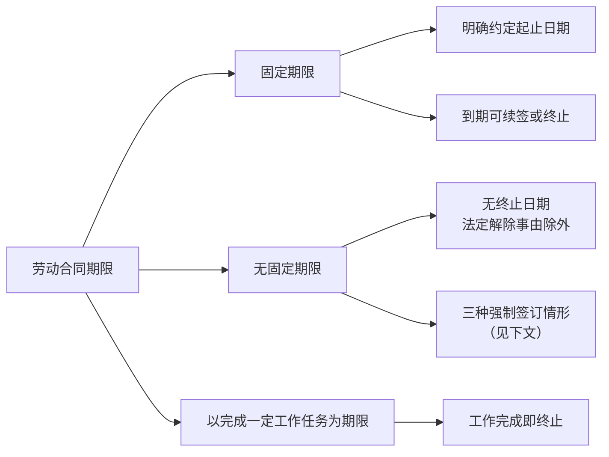
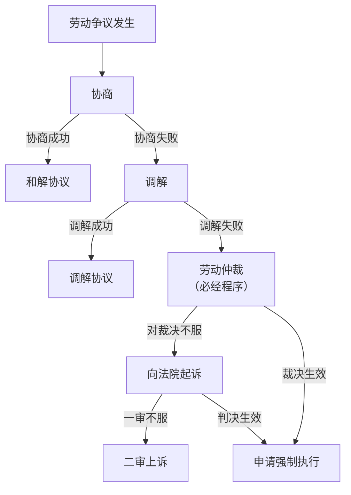
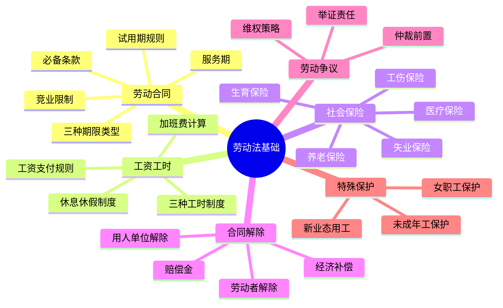

## 三、劳动法基础

劳动法是每一位劳动者和用人单位都必须了解的基础法律。它直接关系到你的工资、工时、休假、社保、解雇补偿等切身利益。很多人在职场中吃亏，不是因为法律不保护他们，而是因为他们根本不知道自己享有哪些权利。本章将系统梳理劳动法的核心知识，让你在职场中做到心中有数、维权有据。

### 3.1 劳动法的体系与适用范围

#### 3.1.1 核心法律法规体系

中国劳动法是一个多层次的法律体系，核心文件包括：

| 法律层级 | 文件名称 | 施行/修订时间 | 核心内容 |
|---------|---------|-------------|---------|
| 法律 | 《劳动法》 | 1995年施行 | 劳动关系的基本法，确立基本原则 |
| 法律 | 《劳动合同法》 | 2008年施行，2012年修订 | 劳动合同的订立、履行、变更、解除 |
| 法律 | 《劳动争议调解仲裁法》 | 2008年施行 | 劳动争议的调解和仲裁程序 |
| 法律 | 《社会保险法》 | 2011年施行 | 社会保险的权利义务 |
| 行政法规 | 《工伤保险条例》 | 2004年施行，2010年修订 | 工伤认定、劳动能力鉴定、工伤待遇 |
| 行政法规 | 《职工带薪年休假条例》 | 2008年施行 | 年休假天数与补偿 |
| 司法解释 | 最高法劳动争议司法解释（一）| 2021年施行 | 劳动争议案件的裁判规则 |
| 部门规章 | 《劳务派遣暂行规定》 | 2014年施行 | 劳务派遣的岗位限制和比例限制 |

**理解要点**：当不同层级的规定发生冲突时，上位法优先于下位法。但实务中，地方性法规和规章往往有更具体的操作细则（如各地最低工资标准、社保缴费比例），需要结合当地规定理解。

#### 3.1.2 适用范围：哪些关系受劳动法保护

劳动法的适用范围决定了你能否享受劳动法的保护。关键在于判断你与用人单位之间是否构成**劳动关系**。

**受劳动法调整的关系**：

- 企业、个体经济组织、民办非企业单位与劳动者之间的劳动关系
- 国家机关、事业单位、社会团体与建立劳动关系的劳动者之间的关系
- 会计师事务所、律师事务所等合伙组织与劳动者之间的关系
- 用人单位依法设立的分支机构与劳动者之间的关系

**不受劳动法调整的关系**：

- **劳务关系**：个人之间的雇佣（如请保姆、找装修师傅），适用民法典而非劳动法
- **承揽关系**：承揽人按照定作人的要求完成工作并交付成果，双方无从属关系
- **实习关系**：在校学生的实习通常不认定为劳动关系（但毕业前签订三方协议的就业实习有争议）
- **退休返聘**：已享受养老保险待遇的退休人员再就业，一般按劳务关系处理

**劳动关系与劳务关系的核心区别**：

| 区别维度 | 劳动关系 | 劳务关系 |
|---------|---------|---------|
| 主体资格 | 用人单位须为组织或个体工商户 | 双方可以都是自然人 |
| 人身从属性 | 劳动者接受用人单位管理，遵守规章制度 | 双方地位平等，无管理从属关系 |
| 报酬性质 | 工资，受最低工资标准保护 | 劳务报酬，双方协商确定 |
| 社会保险 | 用人单位必须依法缴纳 | 无强制缴纳义务 |
| 争议解决 | 先仲裁后诉讼（劳动仲裁前置） | 直接向法院起诉 |
| 解除保护 | 受劳动合同法保护，解雇需法定理由 | 按合同约定，相对自由 |

> **实务提示**：有些用人单位故意将劳动关系包装为"劳务关系""合作关系""承揽关系"来逃避劳动法义务。判断标准不是合同名称，而是实际用工形式——是否存在人身从属性、是否接受用人单位的管理和指挥、报酬是否具有工资性质。即使签了"劳务协议"，只要实质上构成劳动关系，法院仍然会按劳动关系处理。

### 3.2 劳动合同的签订

#### 3.2.1 劳动合同的必备条款

根据《劳动合同法》第十七条，劳动合同应当具备以下条款：

1. **用人单位信息**：名称、住所和法定代表人或者主要负责人
2. **劳动者信息**：姓名、住址和居民身份证或者其他有效身份证件号码
3. **劳动合同期限**：固定期限、无固定期限或以完成一定工作任务为期限
4. **工作内容和工作地点**：岗位名称、职责范围和具体工作地点
5. **工作时间和休息休假**：标准工时制、综合计算工时制或不定时工作制
6. **劳动报酬**：工资数额、支付方式和支付时间
7. **社会保险**：养老、医疗、失业、工伤、生育五险
8. **劳动保护、劳动条件和职业危害防护**：针对特殊行业的保护措施

除了必备条款外，用人单位与劳动者还可以约定试用期、培训与服务期、竞业限制、保密义务、补充保险和福利待遇等事项。

**未签订书面劳动合同的法律后果**：

- 用工之日起超过一个月不满一年未签订的：用人单位应当向劳动者每月支付**二倍的工资**
- 超过一年未签订的：视为用人单位与劳动者已订立**无固定期限劳动合同**
- 这里的二倍工资最多支持11个月（从用工满一个月的次日起算至满一年的前一日）

> **实务提示**：入职后一定要拿到自己签字的劳动合同原件。如果用人单位以"需要盖章""统一保管"为由拒绝给你一份，这本身就是违规的。建议保留入职通知、录用邮件、工资条、考勤记录等能证明劳动关系的证据。

#### 3.2.2 劳动合同的三种期限类型

**无固定期限劳动合同的强制签订情形**：

《劳动合同法》第十四条规定，有下列情形之一，劳动者提出或者同意续订劳动合同的，应当订立无固定期限劳动合同：

1. **十年规则**：劳动者在该用人单位连续工作满十年的
2. **二次续签规则**：连续订立二次固定期限劳动合同，且劳动者没有过失性解除和非过失性解除的第一项、第二项规定的情形，续订劳动合同的
3. **事实劳动一年规则**：用人单位自用工之日起满一年不与劳动者订立书面劳动合同的，视为已订立无固定期限劳动合同

**"连续工作满十年"的计算要点**：

- 计算的是实际用工年限，不是合同签订年限
- 非因劳动者原因被安排到新用人单位的，工作年限连续计算
- 劳动合同期满后未及时续签但继续用工的，工作年限连续计算
- 劳动者因个人原因离职后再入职的，年限重新计算

#### 3.2.3 试用期的详细规定

试用期是用人单位和劳动者相互考察的期间，但法律对试用期有严格的限制：

| 劳动合同期限 | 试用期上限 | 试用期工资下限 |
|-------------|-----------|--------------|
| 不满三个月（含以完成一定工作任务为期限） | 不得约定试用期 | — |
| 三个月以上不满一年 | 不超过一个月 | 约定工资的80%或同岗位最低档工资（取高者），且不低于当地最低工资标准 |
| 一年以上不满三年 | 不超过二个月 | 同上 |
| 三年以上固定期限和无固定期限 | 不超过六个月 | 同上 |

**试用期的核心规则**：

1. **只能约定一次**：同一用人单位与同一劳动者只能约定一次试用期。这意味着续签合同、调岗都不能再约定试用期
2. **试用期包含在合同期限内**：不能先约定试用期、试用期满再签合同
3. **试用期解除的限制**：用人单位在试用期解除劳动合同的，应当向劳动者说明理由。不能以"试用期不合格"为由随意辞退，必须有明确的考核标准和不符合录用条件的证据
4. **仅约定试用期的合同无效**：劳动合同仅约定试用期的，试用期不成立，该期限为劳动合同期限

> **常见陷阱**：有些公司反复约定试用期（如签一年合同约定两个月试用期，到期后续签又约定试用期），或者试用期工资远低于法定标准。这些都是违法行为，劳动者可以要求补发差额。

#### 3.2.4 服务期与竞业限制

**服务期协议**：

用人单位为劳动者提供专项培训费用（通常需要有培训协议、培训费票据等证据），可以与劳动者约定服务期。劳动者违反服务期约定的，应当按照约定向用人单位支付违约金。但违约金的数额不得超过用人单位提供的培训费用，且不得超过服务期尚未履行部分所应分摊的培训费用。

**竞业限制**：

| 要素 | 规定 |
|-----|------|
| 适用对象 | 高级管理人员、高级技术人员和其他负有保密义务的人员 |
| 期限 | 不得超过解除或终止劳动合同后**二年** |
| 经济补偿 | 用人单位须在竞业限制期限内按月给予劳动者经济补偿。未约定补偿金额的，一般按离职前12个月平均工资的**30%**计算，且不低于当地最低工资标准 |
| 违约金 | 劳动者违反竞业限制约定的，应支付违约金（金额需合理） |
| 用人单位未支付补偿的后果 | 超过三个月未支付经济补偿的，劳动者可以请求解除竞业限制约定 |

> **实务提示**：不是所有员工都需要签竞业限制。如果公司要求所有员工（包括普通岗位）签署竞业限制协议，这种约定可能因缺乏商业秘密保护的必要性而被认定无效。另外，竞业限制必须有经济补偿，没有补偿的竞业限制条款对劳动者没有约束力。

### 3.3 工资与工时制度

#### 3.3.1 工资支付规则

**工资支付的基本要求**：

- 以**货币形式**按月支付给劳动者本人，不得以实物或有价证券替代
- 至少**每月支付一次**，实行周、日、小时工资制的可按周、日、小时支付
- 不得**克扣**或者**无故拖欠**劳动者的工资
- 工资支付日遇法定节假日或休息日的，应当**提前**在最近的工作日支付

**工资构成解析**：

| 工资组成部分 | 说明 | 是否计入加班费基数 |
|------------|------|----------------|
| 基本工资 | 固定发放的基础报酬 | 是 |
| 岗位工资 | 按岗位确定的工资 | 通常计入 |
| 绩效工资 | 根据考核结果浮动 | 有争议，各地规定不同 |
| 津贴和补贴 | 高温津贴、夜班津贴、交通补贴等 | 部分计入，需看性质 |
| 加班工资 | 加班劳动的额外报酬 | 否 |
| 奖金 | 年终奖、季度奖等 | 一般不计入 |

> **关键点**：加班费的计算基数非常重要。有些企业将工资拆分为"基本工资+绩效+补贴"，然后仅以很低的基本工资为基数计算加班费，这是违法的。加班费基数应当以劳动者正常工作时间的工资为准，但各地对"正常工作时间工资"的界定有差异。

**最低工资标准**：

最低工资标准由各省、自治区、直辖市人民政府确定，一般每两年调整一次。最低工资标准分为月最低工资标准和小时最低工资标准。需要注意的是，以下项目不作为最低工资的组成部分：加班加点工资；中班、夜班、高温、低温、井下、有毒有害等特殊工作环境和条件下的津贴；法律、法规和国家规定的劳动者福利待遇等。

#### 3.3.2 工作时间制度

**三种工时制度对比**：

| 工时制度 | 适用条件 | 核心规则 | 审批要求 |
|---------|---------|---------|---------|
| 标准工时制 | 一般岗位 | 每日不超过8小时，每周不超过40小时（原规定44小时，实务中已普遍执行40小时），每周至少休息1天 | 无需审批 |
| 综合计算工时制 | 因工作性质需连续作业的岗位（如交通、铁路、邮电、水运等） | 以周、月、季、年为周期综合计算，平均日/周工时不超法定标准 | 须经劳动行政部门审批 |
| 不定时工作制 | 高级管理人员、外勤人员、推销人员、长途运输人员等 | 无固定工时限制，不受日/周工时标准约束 | 须经劳动行政部门审批 |

**关于"996"的法律分析**：

"996"工作制（早9点到晚9点，每周6天）意味着每天工作12小时、每周72小时，远远超过法定的每周40小时标准。即使企业声称实行不定时工作制，未经劳动行政部门审批的不定时工作制不具有法律效力。2021年最高人民法院和人力资源社会保障部联合发布超时加班典型案例，明确"996"工作制严重违反法律关于延长工作时间上限的规定，应认定为无效。

#### 3.3.3 加班工资标准

| 加班类型 | 工资标准 | 能否用补休替代 |
|---------|---------|--------------|
| 工作日延长工作时间 | 不低于工资的**150%** | 不能，必须支付加班费 |
| 休息日安排工作 | 不低于工资的**200%** | 可以优先安排补休，不能补休的支付200% |
| 法定休假日安排工作 | 不低于工资的**300%** | 不能，必须支付加班费，且不能用补休替代 |

**加班费计算公式**：

- 月计薪天数 = (365天 - 104天) ÷ 12月 = 21.75天
- 日工资 = 月工资 ÷ 21.75
- 小时工资 = 日工资 ÷ 8
- 工作日加班费 = 小时工资 × 加班小时数 × 150%
- 休息日加班费 = 日工资 × 加班天数 × 200%
- 法定假日加班费 = 日工资 × 加班天数 × 300%

> **实务提示**：用人单位安排加班应当与工会和劳动者协商。如果公司强制要求加班且不支付加班费，劳动者有权拒绝（危及公共利益的紧急情况除外），并可以向劳动监察部门投诉或申请劳动仲裁。

#### 3.3.4 休息休假制度

**法定休假类型一览**：

| 假期类型 | 天数/条件 | 工资待遇 | 法律依据 |
|---------|----------|---------|---------|
| 法定节假日 | 11天（春节3天、国庆3天、元旦1天、清明1天、劳动节1天、端午1天、中秋1天） | 带薪，加班300% | 《全国年节及纪念日放假办法》 |
| 带薪年休假 | 工作满1年不满10年：5天；满10年不满20年：10天；满20年：15天 | 带薪，未休补偿300% | 《职工带薪年休假条例》 |
| 病假（医疗期） | 根据工龄和本单位工龄确定，3个月到24个月不等 | 不低于当地最低工资标准的80% | 《企业职工患病或非因工负伤医疗期规定》 |
| 婚假 | 通常3天（各地可能有延长） | 带薪 | 各地人口与计划生育条例 |
| 产假 | 女方98天+各地延长（通常30-60天）；男方陪产假各地不同（通常15-30天） | 带薪，生育津贴或工资 | 《女职工劳动保护特别规定》 |
| 丧假 | 1-3天（直系亲属） | 带薪 | 《关于国营企业职工请婚丧假和路程假问题的通知》 |
| 探亲假 | 未婚每年20天（探父母），已婚每4年20天（探父母） | 带薪 | 《国务院关于职工探亲待遇的规定》 |

**年休假的计算细节**：

- 年休假天数根据**累计工作年限**计算，不是在本单位的工作年限
- 国家法定节假日、休息日不计入年休假假期
- 用人单位确因工作需要不能安排年休假的，经职工本人同意后，按日工资收入的**300%**支付未休年休假工资报酬（其中包含正常工资，即额外补偿200%）
- 用人单位已安排年休假但职工因本人原因且书面提出不休的，只支付正常工资

**医疗期的详细规定**：

| 实际工作年限 | 本单位工作年限 | 医疗期 | 计算周期 |
|------------|--------------|--------|---------|
| 不满10年 | 不满5年 | 3个月 | 6个月内 |
| 不满10年 | 5年以上 | 6个月 | 12个月内 |
| 10年以上 | 不满5年 | 6个月 | 12个月内 |
| 10年以上 | 5年以上不满10年 | 9个月 | 15个月内 |
| 10年以上 | 10年以上不满15年 | 12个月 | 18个月内 |
| 10年以上 | 15年以上不满20年 | 18个月 | 24个月内 |
| 10年以上 | 20年以上 | 24个月 | 30个月内 |

医疗期内，用人单位不得解除劳动合同（过失性解除除外）。医疗期满后，劳动者不能从事原工作也不能从事另行安排的工作的，用人单位可以解除合同，但需要支付经济补偿和不低于6个月工资的医疗补助费。

### 3.4 社会保险制度

#### 3.4.1 五险概述

社会保险是国家通过立法强制实施的社会保障制度。用人单位和劳动者必须依法参加社会保险、缴纳社会保险费。用人单位不缴纳社保属于违法行为，劳动者可以据此解除劳动合同并要求经济补偿。

**五险一金缴费比例参考**（各地比例有所不同，以下为常见区间）：

| 险种 | 单位缴费比例 | 个人缴费比例 | 基数确定方式 | 核心待遇 |
|-----|-----------|-----------|-----------|---------|
| 养老保险 | 16% | 8% | 上年度月平均工资（有上下限） | 累计缴费满15年，达法定退休年龄后按月领取养老金 |
| 医疗保险 | 6%-10% | 2% | 上年度月平均工资 | 门诊、住院费用报销；个人账户可用于药店购药 |
| 失业保险 | 0.5%-1% | 0.2%-0.5% | 上年度月平均工资 | 非因本人意愿中断就业，缴费满1年可领取失业金 |
| 工伤保险 | 0.2%-1.9%（行业差别费率） | 0 | 上年度月平均工资 | 工伤医疗、伤残补助、工亡补助 |
| 生育保险 | 0.5%-1%（已并入医保） | 0 | 上年度月平均工资 | 生育医疗费报销、生育津贴 |
| 住房公积金 | 5%-12% | 5%-12%（与单位同比例） | 上年度月平均工资 | 购房贷款、租房提取 |

#### 3.4.2 养老保险

**养老金的计算**：基本养老金由**基础养老金**和**个人账户养老金**两部分组成。

- 基础养老金 = (当地上年度在岗职工月平均工资 + 本人指数化月平均缴费工资) ÷ 2 × 缴费年限 × 1%
- 个人账户养老金 = 个人账户储存额 ÷ 计发月数（60岁退休为139个月，55岁为170个月，50岁为195个月）

**关键知识点**：

- 累计缴费满15年是领取养老金的最低门槛，但缴得越多、缴得越久，退休后领得越多
- 个人账户的钱可以继承，不会"充公"
- 达到法定退休年龄但缴费不满15年的，可以延长缴费至满15年，或者转入城乡居民养老保险
- 2024年起，法定退休年龄将逐步延迟（男职工从60岁逐步延迟到63岁，女职工从50/55岁逐步延迟到55/58岁）

#### 3.4.3 医疗保险

**医保报销的基本逻辑**：

1. 起付线以下的费用由个人承担
2. 起付线以上、封顶线以下的费用按比例报销（在职一般报销70%-90%，退休更高）
3. 封顶线以上的费用可以通过大病保险或商业保险解决
4. 医保目录外的药品和项目不在报销范围内

**医保的连续性**：

- 医保断缴后，次月起无法享受医保报销待遇（各地缓冲期不同，通常为3个月）
- 断缴超过一定期限（各地3-6个月不等），重新缴纳后有等待期
- 累计缴费年限达到当地规定（男性一般25年，女性一般20年），退休后可终身享受医保待遇

#### 3.4.4 失业保险

**领取失业金的条件**：

1. 失业前用人单位和本人已经缴纳失业保险费**满一年**
2. **非因本人意愿中断就业**（被辞退、合同到期不续签、用人单位破产等）
3. 已经进行**失业登记**，并有求职要求

**失业金的领取期限和标准**：

| 累计缴费年限 | 最长领取期限 |
|------------|-----------|
| 满1年不足5年 | 最长12个月 |
| 满5年不足10年 | 最长18个月 |
| 10年以上 | 最长24个月 |

失业金标准一般为当地最低工资标准的70%-90%。领取失业金期间，由失业保险基金代缴基本医疗保险费，个人不缴纳。

> **重要提示**：如果是**主动辞职**（个人原因离职），不能领取失业金。但在实务中，如果用人单位存在违法行为（如拖欠工资、未缴社保），劳动者据此提出解除合同的，可以认定为"非因本人意愿中断就业"，有资格领取失业金。

#### 3.4.5 工伤保险

**工伤认定的法定情形**：

根据《工伤保险条例》第十四条，以下情形应当认定为工伤：

1. 在工作时间和工作场所内，因工作原因受到事故伤害的
2. 工作时间前后在工作场所内，从事与工作有关的预备性或者收尾性工作受到事故伤害的
3. 在工作时间和工作场所内，因履行工作职责受到暴力等意外伤害的
4. 患职业病的
5. 因工外出期间，由于工作原因受到伤害或者发生事故下落不明的
6. 在上下班途中，受到非本人主要责任的交通事故或者城市轨道交通、客运轮渡、火车事故伤害的
7. 法律、行政法规规定应当认定为工伤的其他情形

**视同工伤的情形**：

- 在工作时间和工作岗位，突发疾病**死亡**或者在48小时之内经抢救无效**死亡**的
- 在抢险救灾等维护国家利益、公共利益活动中受到伤害的
- 职工原在军队服役，因战、因公负伤致残，已取得革命伤残军人证，到用人单位后旧伤复发的

**工伤认定的时效**：

- 用人单位应当自事故发生之日起**30日内**提出工伤认定申请
- 用人单位未按规定提出的，工伤职工或其近亲属、工会可以在事故发生之日起**1年内**直接向社保行政部门提出申请
- 超过1年未申请的，丧失工伤认定的申请权

**工伤待遇概览**：

| 伤残等级 | 一次性伤残补助金（月工资×月数） | 伤残津贴（月） | 其他 |
|---------|---------------------------|-------------|------|
| 一级 | 27个月 | 本人工资的90% | 保留劳动关系，退出工作岗位 |
| 二级 | 25个月 | 本人工资的85% | 同上 |
| 三级 | 23个月 | 本人工资的80% | 同上 |
| 四级 | 21个月 | 本人工资的75% | 同上 |
| 五级 | 18个月 | 本人工资的70% | 保留劳动关系或解除（解除时另付一次性工伤医疗补助金和就业补助金） |
| 六级 | 16个月 | 本人工资的60% | 同上 |
| 七级 | 13个月 | 无津贴 | 劳动合同期满终止或解除 |
| 八级 | 11个月 | 无津贴 | 同上 |
| 九级 | 9个月 | 无津贴 | 同上 |
| 十级 | 7个月 | 无津贴 | 同上 |

工亡待遇：丧葬补助金为6个月的统筹地区上年度职工月平均工资；供养亲属抚恤金按职工本人工资一定比例按月发放；一次性工亡补助金为上一年度全国城镇居民人均可支配收入的20倍（2024年标准约为100余万元）。

### 3.5 特殊劳动保护

#### 3.5.1 女职工劳动保护

| 保护事项 | 具体规定 |
|---------|---------|
| 禁止安排的劳动 | 矿山井下作业、国家规定的第四级体力劳动强度的劳动 |
| 经期保护 | 不得安排从事高处、低温、冷水作业和第三级体力劳动强度的劳动 |
| 孕期保护 | 不得安排第三级体力劳动强度的劳动和孕期禁忌劳动；怀孕7个月以上不得安排加班和夜班；产前检查时间计入劳动时间 |
| 产假 | 98天产前假+产后假（可提前15天休）；难产增加15天；多胞胎每多一个增加15天 |
| 哺乳期 | 不得安排加班和夜班；每天1小时哺乳时间（多胞胎每多一个增加1小时） |
| 解雇保护 | 孕期、产期、哺乳期内不得适用非过失性解除和经济性裁员 |

#### 3.5.2 未成年工保护

禁止用人单位招用未满16周岁的未成年人（文艺、体育和特种工艺单位除外）。已满16周岁未满18周岁的未成年工，不得安排从事矿山井下、有毒有害、第四级体力劳动强度的劳动，且须定期进行健康检查。

#### 3.5.3 残疾人就业保障

用人单位安排残疾人就业的比例不得低于本单位在职职工总数的1.5%。未达到比例的，应当缴纳残疾人就业保障金。

### 3.6 劳动合同的解除与终止

#### 3.6.1 劳动者单方解除

**预告解除（无理由辞职）**：

- 正式员工提前**30日**以**书面形式**通知用人单位
- 试用期内提前**3日**通知（无需书面形式）
- 通知期满后，无论用人单位是否同意，劳动合同即解除
- 注意：30天是"通知期"不是"审批期"，用人单位无权"不批准"辞职

**即时解除（被迫辞职）**：

根据《劳动合同法》第三十八条，用人单位有下列情形之一的，劳动者可以解除劳动合同，并有权要求经济补偿：

1. 未按照劳动合同约定提供劳动保护或者劳动条件的
2. 未及时足额支付劳动报酬的（包括拖欠工资、克扣工资、低于最低工资标准）
3. 未依法为劳动者缴纳社会保险费的
4. 用人单位的规章制度违反法律、法规的规定，损害劳动者权益的
5. 因以欺诈、胁迫的手段或者乘人之危致使劳动合同无效的
6. 以暴力、威胁或者非法限制人身自由的手段强迫劳动者劳动的
7. 违章指挥、强令冒险作业危及劳动者人身安全的

> **实务提示**：被迫辞职需要有证据证明用人单位存在上述违法情形。建议在辞职前收集好相关证据（工资条、社保缴费记录、工作条件照片等），并在辞职通知中明确写明解除原因是用人单位的违法行为。如果只写"个人原因辞职"，可能丧失要求经济补偿的权利。

#### 3.6.2 用人单位单方解除

**过失性辞退（第三十九条，无经济补偿）**：

劳动者有下列情形之一的，用人单位可以解除劳动合同：

1. 在试用期间被证明不符合录用条件的
2. 严重违反用人单位的规章制度的
3. 严重失职，营私舞弊，给用人单位造成重大损害的
4. 劳动者同时与其他用人单位建立劳动关系，对完成本单位的工作任务造成严重影响的，或者经用人单位提出，拒不改正的
5. 因以欺诈、胁迫的手段或者乘人之危致使劳动合同无效的
6. 被依法追究刑事责任的

**非过失性辞退（第四十条，须支付经济补偿）**：

有下列情形之一的，用人单位提前30日以书面形式通知劳动者本人或者额外支付一个月工资后，可以解除劳动合同：

1. 劳动者患病或者非因工负伤，在规定的医疗期满后不能从事原工作，也不能从事由用人单位另行安排的工作的
2. 劳动者不能胜任工作，经过培训或者调整工作岗位，仍不能胜任工作的
3. 劳动合同订立时所依据的客观情况发生重大变化，致使劳动合同无法履行，经用人单位与劳动者协商，未能就变更劳动合同内容达成协议的

**经济性裁员（第四十一条，须支付经济补偿）**：

需要裁减人员20人以上或者裁减不足20人但占企业职工总数10%以上的，用人单位提前30日向工会或者全体职工说明情况，听取工会或者职工的意见后，可以裁减人员。法定情形包括：

1. 依照企业破产法规定进行重整的
2. 生产经营发生严重困难的
3. 企业转产、重大技术革新或者经营方式调整，经变更劳动合同后仍需裁减人员的
4. 其他因劳动合同订立时所依据的客观经济情况发生重大变化，致使劳动合同无法履行的

**裁员时应当优先留用的人员**：与本单位订立较长期限固定期限劳动合同的；与本单位订立无固定期限劳动合同的；家庭无其他就业人员，有需要扶养的老人或者未成年人的。

**用人单位不得解除劳动合同的情形（第四十二条）**：

1. 从事接触职业病危害作业的劳动者未进行离岗前职业健康检查的
2. 在本单位患职业病或者因工负伤并被确认丧失或者部分丧失劳动能力的
3. 患病或者非因工负伤，在规定的医疗期内的
4. 女职工在孕期、产期、哺乳期的
5. 在本单位连续工作满15年，且距法定退休年龄不足5年的
6. 法律、行政法规规定的其他情形

#### 3.6.3 经济补偿与赔偿金

**经济补偿的计算**：

- 每满一年支付**一个月工资**
- 六个月以上不满一年的，按一年计算
- 不满六个月的，支付**半个月工资**
- 月工资高于当地上年度职工月平均工资三倍的，按三倍计算，且补偿年限最高不超过**十二年**
- 月工资低于当地上年度职工月平均工资三倍的，补偿年限不受十二年限制

**"月工资"的定义**：指劳动者在劳动合同解除或者终止前十二个月的平均工资，包括计时工资、计件工资、奖金、津贴和补贴等货币性收入。

**赔偿金（违法解除的后果）**：

用人单位违法解除或者终止劳动合同的，应当按照经济补偿标准的**二倍**向劳动者支付赔偿金。赔偿金和经济补偿不能同时主张——主张赔偿金后不再支付经济补偿。

**常见需要支付经济补偿的情形**：

- 用人单位提出并与劳动者协商一致解除的
- 劳动者因用人单位违法而被迫辞职的（第三十八条）
- 用人单位非过失性辞退的（第四十条）
- 经济性裁员的（第四十一条）
- 劳动合同期满用人单位降低条件续签而劳动者拒绝的
- 用人单位被依法宣告破产、吊销营业执照、责令关闭的

**不需要支付经济补偿的情形**：

- 劳动者主动辞职（提前30天通知）
- 劳动者在试用期内被证明不符合录用条件被辞退
- 劳动者严重违反规章制度被辞退
- 劳动合同期满用人单位维持或提高条件续签而劳动者拒绝的

### 3.7 劳动争议的解决

#### 3.7.1 争议解决的基本流程

劳动争议实行**仲裁前置**制度，即必须先经过劳动仲裁，对仲裁裁决不服的才能向法院提起诉讼。

#### 3.7.2 劳动仲裁

**仲裁时效**：

- 一般时效：**一年**，从当事人知道或者应当知道其权利被侵害之日起计算
- 劳动关系存续期间因**拖欠劳动报酬**发生争议的，不受一年时效限制；但劳动关系终止的，应当自劳动关系终止之日起一年内提出
- 时效中断：当事人一方向对方主张权利、向有关部门请求权利救济、对方同意履行义务的，时效中断并重新计算

**管辖**：

劳动争议由**劳动合同履行地**或者**用人单位所在地**的劳动争议仲裁委员会管辖。双方分别向上述两地申请仲裁的，由劳动合同履行地的仲裁委管辖。

**举证责任**：

- 一般原则："谁主张，谁举证"
- 特殊规则：与争议事项有关的证据属于用人单位掌握管理的（如考勤记录、工资发放记录、规章制度等），由用人单位举证。用人单位不提供的，承担不利后果
- 用人单位作出的开除、减薪、辞退、解除劳动合同等决定发生争议的，由用人单位举证

**仲裁费用**：劳动仲裁不收费。

**一裁终局的情形**：

下列劳动争议的仲裁裁决为终局裁决（用人单位不得起诉，但劳动者对裁决不服的可以起诉）：

1. 追索劳动报酬、工伤医疗费、经济补偿或者赔偿金，不超过当地月最低工资标准十二个月金额的争议
2. 因执行国家的劳动标准在工作时间、休息休假、社会保险等方面发生的争议

#### 3.7.3 诉讼

对仲裁裁决不服的，可以自收到裁决书之日起**15日内**向人民法院提起诉讼。逾期不起诉的，裁决书发生法律效力。劳动争议案件的诉讼费用为10元。

#### 3.7.4 实用维权策略

**证据收集清单**：

| 证据类型 | 具体内容 | 获取方式 |
|---------|---------|---------|
| 劳动关系证明 | 劳动合同、工牌、工服、名片、录用通知 | 入职时保留 |
| 工资收入证明 | 工资条、银行流水、工资确认单 | 定期保存，银行可打印 |
| 工时记录 | 考勤记录、加班审批单、打卡截图 | 截图保存、申请查阅 |
| 社保记录 | 社保缴费明细 | 社保局或网上查询 |
| 沟通记录 | 微信聊天记录、邮件、录音 | 及时备份，注意完整性 |
| 规章制度 | 员工手册、奖惩制度 | 入职时索取签字版本 |
| 解除通知 | 辞退通知、离职证明 | 要求书面通知并保留原件 |

**维权的合理顺序**：

1. **协商**：先与用人单位直接沟通，成本最低
2. **投诉**：向劳动监察部门投诉（12333热线），适用于明显违法行为（拖欠工资、不缴社保等）
3. **调解**：通过企业劳动争议调解委员会或基层人民调解组织调解
4. **仲裁**：向劳动争议仲裁委员会申请仲裁，这是诉讼的前置程序
5. **诉讼**：对仲裁裁决不服的，向法院起诉

**法律援助**：经济困难的劳动者可以申请法律援助，劳动争议案件属于法律援助的受理范围。拨打12348法律援助热线或到当地法律援助中心咨询。

### 3.8 劳务派遣与灵活用工

#### 3.8.1 劳务派遣

劳务派遣是指劳务派遣单位与被派遣劳动者签订劳动合同后，将劳动者派遣到用工单位工作的一种用工形式。

**劳务派遣的法律限制**：

| 限制事项 | 具体规定 |
|---------|---------|
| 岗位限制 | 只能用于**临时性、辅助性、替代性**岗位。临时性岗位存续时间不超过6个月；辅助性岗位为主营业务岗位提供服务的非主营业务岗位；替代性岗位指用工单位劳动者因脱产学习、休假等原因无法工作的一定期间内的替代岗位 |
| 比例限制 | 使用的被派遣劳动者数量不得超过其用工总量的**10%** |
| 同工同酬 | 被派遣劳动者享有与用工单位的劳动者同工同酬的权利 |
| 合同期限 | 劳务派遣单位与被派遣劳动者的合同期限不得少于**2年** |
| 退回机制 | 被派遣劳动者有劳动合同法第三十九条和第四十条第一项、第二项规定情形的，用工单位可以退回 |

> **实务提示**：很多企业滥用劳务派遣来降低用工成本和规避劳动法义务。如果你的工作岗位是用人单位的主营业务核心岗位，且长期从事该工作，即使签的是劳务派遣合同，也可以主张与用工单位存在事实劳动关系。

#### 3.8.2 非全日制用工

非全日制用工是指以小时计酬为主，劳动者在同一用人单位一般平均每日工作时间不超过4小时，每周工作时间不超过24小时的用工形式。

**与全日制用工的区别**：

| 维度 | 全日制用工 | 非全日制用工 |
|-----|----------|------------|
| 工时 | 每日不超8小时，每周不超40小时 | 每日不超4小时，每周不超24小时 |
| 合同形式 | 必须书面 | 可以口头 |
| 试用期 | 可以约定 | 不得约定 |
| 社保 | 五险必须缴纳 | 仅需缴纳工伤保险 |
| 终止 | 需依法解除 | 任何一方可随时通知终止，无经济补偿 |
| 兼职 | 一般不允许双重劳动关系 | 可以与多个用人单位建立劳动关系 |

### 3.9 新业态用工与前沿问题

#### 3.9.1 平台用工的劳动关系认定

随着外卖骑手、网约车司机、直播主播等新业态从业者大量出现，平台用工的劳动关系认定成为热点问题。

**认定劳动关系的三要素**：

1. **人格从属性**：是否接受平台的指挥和管理（如派单机制、接单要求、考核标准）
2. **经济从属性**：收入是否主要来源于该平台（而非独立经营）
3. **组织从属性**：工作是否是平台业务的组成部分

**实务中的趋势**：

2021年人社部等八部门联合发布《关于维护新就业形态劳动者劳动保障权益的指导意见》，引入了**"不完全符合确立劳动关系"**的概念，即对于不完全符合劳动关系认定标准但企业对劳动者进行一定劳动管理的情形，要求企业合理承担保障劳动者权益的责任（如支付不低于当地最低工资标准的报酬、购买人身意外伤害保险等）。

#### 3.9.2 远程办公的法律问题

疫情后远程办公日益普遍，带来了一些新的法律问题：

- **工时认定**：远程办公的工作时间难以监控，加班认定存在困难。建议通过工作日志、即时通讯记录等方式记录工作时间
- **工伤认定**：在家中工作期间受伤是否属于工伤，存在争议。关键在于是否在"工作时间"因"工作原因"受伤
- **劳动纪律**：用人单位可以通过规章制度对远程办公进行管理，但不能因此克扣工资或变相降低待遇
- **数据安全**：远程办公涉及的企业数据安全问题，用人单位可以与劳动者签订保密协议

### 3.10 常见误区与避坑指南

**误区一："试用期可以随意辞退"**

纠正：试用期辞退需要证明劳动者"不符合录用条件"，且用人单位需要有明确的录用条件和考核标准。没有证据的辞退属于违法解除，需要支付赔偿金。

**误区二："主动辞职就没有经济补偿"**

纠正：如果用人单位存在未缴社保、拖欠工资等违法行为，劳动者被迫辞职的，有权要求经济补偿。关键是在辞职通知中写明辞职原因是用人单位的违法行为。

**误区三："签了劳务合同就是劳务关系"**

纠正：合同名称不是决定因素。如果实际用工形式符合劳动关系的特征（人格从属性、经济从属性、组织从属性），即使签的是"劳务合同"，法院也会认定为劳动关系。

**误区四："公司不交社保是行业惯例，没办法"**

纠正：缴纳社会保险是法定义务，不因行业惯例而免除。劳动者可以向社保部门投诉补缴，也可以据此解除劳动合同并要求经济补偿。

**误区五："加班是自愿的，公司不用付加班费"**

纠正：只要有证据证明确实加班了（考勤记录、工作邮件时间戳、监控录像等），用人单位就应当支付加班费。公司制度中的"自愿加班不付加班费"条款无效。

**误区六："被辞退只能认命"**

纠正：用人单位违法解除劳动合同的，劳动者可以要求继续履行合同，或者要求支付二倍经济补偿标准的赔偿金。不要轻易在"自愿离职协议"上签字。

**误区七："劳动仲裁很麻烦，算了"**

纠正：劳动仲裁免费、程序简便、审理期限短（一般45天内结案），是劳动者维权的高效渠道。很多地方还支持网上立案和在线庭审。

### 3.11 本节要点回顾

劳动法是保护劳动者权益的重要法律武器。核心要点是：了解自己的权利，保留相关证据，在权益受到侵害时敢于依法维权。用人单位和劳动者之间的关系不是"老板说了算"，而是受法律严格规范的契约关系。掌握本节内容，你就拥有了在职场中保护自己的基本能力。
