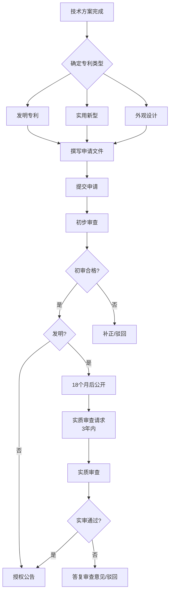

## 四、知识产权法

### 4.1 知识产权概述

#### 4.1.1 什么是知识产权

知识产权（Intellectual Property，简称IP）是指公民、法人或者其他组织对其在科学技术、文学艺术等领域中创造的智力活动成果依法享有的专有权利。与物权保护有形财产不同，知识产权保护的是无形的智力成果——一首歌、一项发明、一个品牌标识，都是知识产权的客体。

理解知识产权的核心在于把握一个基本逻辑：**智力劳动创造价值，法律赋予权利人排他性的控制权**。这种控制权不是永久的（著作权有期限、专利有年限），也不是绝对的（存在合理使用、强制许可等限制），而是在权利人利益和公共利益之间寻找平衡。

#### 4.1.2 知识产权的体系构成

中国知识产权法律体系主要由以下法律法规构成：

| 法律法规 | 核心内容 | 施行/修订时间 |
|---------|---------|-------------|
| 《著作权法》 | 保护文学、艺术、科学作品 | 2021年6月1日（第三次修订） |
| 《专利法》 | 保护发明创造 | 2021年6月1日（第四次修订） |
| 《商标法》 | 保护注册商标 | 2019年11月1日（第四次修正） |
| 《反不正当竞争法》 | 保护商业秘密等 | 2019年4月23日修正 |
| 《植物新品种保护条例》 | 保护植物新品种 | 2014年修订 |
| 《集成电路布图设计保护条例》 | 保护芯片布图设计 | 2001年10月1日 |

在国际层面，中国加入了《巴黎公约》（工业产权）、《伯尔尼公约》（著作权）、《TRIPS协定》（WTO框架下的知识产权保护）、《专利合作条约》（PCT，国际专利申请）、《马德里协定》（国际商标注册）等主要国际条约。

#### 4.1.3 知识产权的四大特征

**无形性**：知识产权的客体是智力成果，不占据物理空间。你买一本书，书的所有权属于物权；但书中文字内容的著作权属于作者。同一首歌可以被无数人同时"拥有"（购买了数字拷贝），但著作权只属于创作者。

**专有性**：未经权利人许可，他人不得擅自使用。这种专有性是法律赋予的，与占有无关。你偷不走一首歌的著作权，但你未经授权复制传播就构成侵权。

**地域性**：知识产权只在授权国或地区有效。在中国获得的专利权，在美国不受保护；想在美国获得保护，需要在美国另行申请专利。这是知识产权和物权的根本区别——物权随物而走，知识产权随法律管辖而定。

**时间性**：知识产权有保护期限，期限届满后进入公共领域，任何人都可以自由使用。发明专利保护20年，实用新型保护10年，著作权中的财产权保护到作者死后50年。这种期限限制体现了知识产权制度的根本目的——通过有限期的垄断激励创新，最终让全社会受益。

### 4.2 著作权（版权）

#### 4.2.1 著作权的产生与登记

著作权自作品创作完成之日起自动产生，无需申请、登记或审批。这是著作权与专利权、商标权最大的区别——后两者都需要向行政机关申请并经审查授权。

**那为什么还要做著作权登记？** 登记虽然不是取得著作权的前提条件，但在维权时具有重要作用：

- **举证便利**：发生纠纷时，登记证书是证明著作权归属的初步证据。没有登记，你需要提供创作手稿、邮件记录、时间戳等证据来证明"我先创作的"，成本很高。
- **交易基础**：著作权转让、许可、质押时，登记有助于确认权利状态。
- **海关备案**：著作权登记后可以向海关总署备案，海关发现侵权货物进出口时会主动扣留。

**登记途径**：中国版权保护中心（https://www.ccopyright.com.cn/）是国家认定的著作权登记机构。登记费用通常为几百元，审查周期约30个工作日。各省版权局也有登记服务。

#### 4.2.2 作品的类型

《著作权法》第三条规定了受保护的作品类型：

1. **文字作品**：小说、诗歌、散文、论文、剧本等
2. **口述作品**：即兴演讲、授课、法庭辩论等
3. **音乐、戏剧、曲艺、舞蹈、杂技艺术作品**
4. **美术、建筑作品**：绘画、书法、雕塑、建筑设计图等
5. **摄影作品**
6. **视听作品**：电影、电视剧、短视频等（2021年修订后用"视听作品"取代了"电影作品和以类似摄制电影的方法创作的作品"）
7. **工程设计图、产品设计图、地图、示意图等图形作品和模型作品**
8. **计算机软件**：源代码和文档
9. **符合作品特征的其他智力成果**：这是一个兜底条款

**不受著作权保护的对象**：

- 法律法规、国家机关的决议、命令和其他具有立法、行政、司法性质的文件及其官方正式译文
- 时事新闻（单纯事实消息）
- 历法、通用数表、通用表格和公式
- 思想、方法、系统、操作方法本身（只保护表达，不保护思想——这是著作权法最基本的原则之一，称为"思想/表达二分法"）

#### 4.2.3 著作权的权利内容

著作权包含人身权和财产权两部分，这是著作权区别于其他知识产权的重要特征——专利权和商标权主要是财产权。

**人身权（不可转让、不可继承）：**

| 权利名称 | 内容 | 保护期限 |
|---------|------|---------|
| 发表权 | 决定作品是否公之于众的权利 | 作者终生+死后50年 |
| 署名权 | 表明作者身份，在作品上署名的权利 | 永久保护 |
| 修改权 | 修改或者授权他人修改作品的权利 | 永久保护 |
| 保护作品完整权 | 保护作品不受歪曲、篡改的权利 | 永久保护 |

**财产权（可转让、可继承、可许可）：**

| 权利名称 | 内容 |
|---------|------|
| 复制权 | 以印刷、复印、拓印、录音、录像、翻录、翻拍、数字化等方式将作品制作一份或者多份的权利 |
| 发行权 | 以出售或者赠与方式向公众提供作品的原件或者复制件的权利 |
| 出租权 | 有偿许可他人临时使用视听作品、计算机软件的原件或者复制件的权利 |
| 展览权 | 公开陈列美术作品、摄影作品的原件或者复制件的权利 |
| 表演权 | 公开表演作品，以及用各种手段公开播送作品的表演的权利 |
| 放映权 | 通过放映机、幻灯机等技术设备公开再现美术、摄影、视听作品等的权利 |
| 广播权 | 以无线方式公开广播或者传播作品，以有线传播或者转播的方式向公众传播广播的作品，以及通过扩音器或者其他传送符号、声音、图像的类似工具向公众传播广播的作品的权利 |
| 信息网络传播权 | 以有线或者无线方式向公众提供作品，使公众可以在其个人选定的时间和地点获得作品的权利 |
| 改编权 | 改变作品，创作出具有独创性的新作品的权利 |
| 翻译权 | 将作品从一种语言文字转换成另一种语言文字的权利 |
| 汇编权 | 将作品或者作品的片段通过选择或者编排，汇集成新作品的权利 |

> **实务提醒**：信息网络传播权是互联网时代最重要的财产权之一。任何人未经授权将他人作品上传到网络供公众下载、在线阅读、在线播放，都侵犯了信息网络传播权。微信公众号转载文章、网站收录他人文章、App提供电子书下载，都涉及这项权利。

#### 4.2.4 合理使用与法定许可

**合理使用**（不经许可、不付报酬，但应指明作者和作品名称）：

1. 为个人学习、研究或者欣赏，使用他人已经发表的作品
2. 为介绍、评论某一作品或者说明某一问题，在作品中适当引用他人已经发表的作品
3. 为报道新闻，在报纸、期刊、广播电台、电视台等媒体中不可避免地再现或者引用已经发表的作品
4. 除著作权人声明不许刊登、播放的以外，报纸、期刊、广播电台、电视台等媒体刊登或者播放其他报纸、期刊、广播电台、电视台等媒体已经发表的关于政治、经济、宗教问题的时事性文章
5. 报纸、期刊、广播电台、电视台等媒体刊登或者播放在公众集会上发表的讲话（作者声明不许刊登、播放的除外）
6. 为学校课堂教学或者科学研究，翻译、改编、汇编、播放或者少量复制已经发表的作品，供教学或者科研人员使用（不得出版发行）
7. 国家机关为执行公务在合理范围内使用已经发表的作品
8. 图书馆、档案馆、纪念馆、博物馆、美术馆、文化馆等为陈列或者保存版本的需要，复制本馆收藏的作品
9. 免费表演已经发表的作品（未向公众收取费用，也未向表演者支付报酬且不以营利为目的）
10. 对设置或者陈列在公共场所的艺术作品进行临摹、绘画、摄影、录像
11. 将中国公民、法人或者非法人组织已经发表的以国家通用语言文字创作的作品翻译成少数民族语言文字作品在国内出版发行
12. 以阅读障碍者能够感知的无障碍方式向其提供已经发表的作品

> **重要变化**（2021年修订新增）：增加了"兜底条款"——法律、行政法规规定的其他情形。这为适应新技术发展提供了灵活性。

**法定许可**（不经许可，但应付报酬）：

- 为实施义务教育和国家教育规划而编写出版教科书
- 录音制作者使用他人已合法录制的音乐作品制作录音制品
- 广播电台、电视台播放他人已发表的作品
- 报刊转载其他报刊刊登的作品（著作权人声明不得转载的除外）

#### 4.2.5 著作权的保护期限

| 权利类型 | 保护期限 |
|---------|---------|
| 署名权、修改权、保护作品完整权 | 永久保护 |
| 发表权和财产权（自然人作品） | 作者终生及其死亡后第50年的12月31日 |
| 发表权和财产权（法人/非法人组织作品） | 作品首次发表后第50年的12月31日（创作完成后50年内未发表的，不再保护） |
| 视听作品 | 首次发表后第50年的12月31日（创作完成后50年内未发表的，不再保护） |
| 摄影作品 | 首次发表后第50年的12月31日 |

#### 4.2.6 计算机软件著作权

计算机软件作为特殊类型的作品，有专门的保护规则：

- **保护对象**：计算机程序（源代码和目标代码）及其有关文档
- **权利人**：软件开发者（自然人创作归自然人，法人主持、代表法人意志创作归法人）
- **登记**：中国版权保护中心负责软件著作权登记，登记是软件著作权纠纷中的重要证据
- **保护期限**：自然人为终生+死后50年；法人为首次发表后50年

**软件著作权的特殊问题**：

- **开源软件**：开源不等于放弃著作权。开源协议（如GPL、MIT、Apache）是著作权人通过许可协议授权他人在特定条件下使用，著作权仍然存在。
- **借鉴代码**：独立编写的代码即使功能相同也不侵权，但如果实质性复制了他人的代码结构和表达，则构成侵权。
- **AI生成代码**：这是一个前沿问题。目前主流观点认为，完全由AI独立生成的代码不享有著作权（因为著作权要求"人的创作"），但人使用AI工具辅助编写、经过大量人工修改和选择的代码，可以享有著作权。

### 4.3 专利权

#### 4.3.1 专利制度的基本逻辑

专利制度的本质是一种"以公开换保护"的社会契约：发明人将自己的技术方案完整公开，作为交换，国家授予其一定期限的独占权。这个制度解决了两个问题：一是激励创新（没有保护就没有动力投入研发），二是促进技术传播（公开的技术方案可以被后来者学习和改进）。

#### 4.3.2 专利的类型

| 专利类型 | 保护期限 | 保护对象 | 审查方式 | 授权周期 |
|---------|---------|---------|---------|---------|
| 发明专利 | 20年 | 产品、方法或其改进所提出的新的技术方案 | 实质审查 | 通常2-4年 |
| 实用新型专利 | 10年 | 产品的形状、构造或其结合所提出的适于实用的新的技术方案 | 初步审查 | 通常6-12个月 |
| 外观设计专利 | 15年 | 对产品的整体或者局部的形状、图案或其结合以及色彩与形状、图案的结合所作出的富有美感并适于工业应用的新设计 | 初步审查 | 通常4-8个月 |

> **实务建议**：对于技术创新性较强的发明，建议同时申请发明专利和实用新型专利。实用新型先授权，提供初步保护；发明专利经过实质审查后授权，保护力度更强。2021年修订的《专利法》还新增了**局部外观设计**保护和**外观设计专利的国内优先权**。

#### 4.3.3 授予专利权的条件

**发明和实用新型的三性要求：**

**新颖性**：不属于现有技术，也没有任何单位或者个人就同样的发明或者实用新型在申请日以前向国务院专利行政部门提出过申请，并记载在申请日以后公布的专利申请文件或者公告的专利文件中。

- **现有技术**：申请日以前在国内外为公众所知的技术（包括出版物公开、使用公开、其他方式公开）
- **宽限期**：申请日以前6个月内，在中国政府主办或者承认的国际展览会上首次展出的、在规定的学术会议或者技术会议上首次发表的、他人未经申请人同意而泄露其内容的，不丧失新颖性

**创造性**：与现有技术相比：
- 发明——具有突出的实质性特点和显著的进步
- 实用新型——具有实质性特点和进步

**实用性**：能够制造或者使用，并且能够产生积极效果。

**外观设计的条件**：
- 不属于现有设计
- 与现有设计或者现有设计特征的组合相比，应当具有明显区别
- 不得与他人在申请日以前已经取得的合法权利相冲突
- 不属于对平面印刷品的图案、色彩或者二者的结合作出的主要起标识作用的设计

#### 4.3.4 不授予专利权的对象

以下内容不能获得专利保护：

1. **科学发现**：发现万有引力定律不能申请专利，但利用万有引力定律制造的装置可以
2. **智力活动的规则和方法**：纯数学算法、游戏规则、商业方法本身
3. **疾病的诊断和治疗方法**：但药品、医疗器械可以获得专利
4. **动物和植物品种**：但生产动植物品种的非生物学方法可以获得专利（植物新品种受《植物新品种保护条例》保护）
5. **原子核变换方法以及用原子核变换方法获得的物质**
6. **对平面印刷品的图案、色彩或者二者的结合作出的主要起标识作用的设计**

#### 4.3.5 专利申请流程

**申请文件的组成**：

- **请求书**：写明发明名称、发明人、申请人信息等
- **说明书**：对技术方案的详细描述，应当充分公开技术方案，使所属领域技术人员能够实现
- **权利要求书**：以技术特征的形式界定要求保护的范围——这是专利的核心文件，决定了保护范围的大小
- **说明书摘要**：技术方案的简要说明（不超过300字）
- **附图**：必要的时候提供

> **关键提醒**：专利申请的时机至关重要。中国采用先申请原则，同一发明只授予最先申请的人。如果你的发明已经公开（比如发表了论文、在展会上展出了），在6个月宽限期内必须提交申请，否则丧失新颖性。**永远在公开之前申请专利。**

#### 4.3.6 专利权人的权利与限制

**专利权人的权利**：

- **独占实施权**：制造、使用、许诺销售、销售、进口其专利产品或者使用其专利方法
- **许可权**：许可他人实施专利（独占许可、排他许可、普通许可）
- **转让权**：将专利权转让给他人
- **标记权**：在其专利产品或者该产品的包装上标明专利标识
- **质押权**：以专利权出质

**专利权的限制**：

- **权利用尽**：专利产品经专利权人许可售出后，他人再次销售、使用该产品不侵权（国内用尽）
- **先用权**：在专利申请日前已经制造相同产品、使用相同方法或者已经作好制造、使用的必要准备的，可以在原有范围内继续制造、使用
- **临时过境**：临时通过中国领土、领水、领空的外国运输工具，依照其所属国同中国签订的协议或者共同参加的国际条约，或者依照互惠原则，为运输工具自身需要而在其装置和设备中使用有关专利
- **科研使用**：专为科学研究和实验而使用有关专利
- **强制许可**：国家在特定情况下（未充分实施、紧急状态、公共利益、反竞争行为）可以不经专利权人同意强制许可他人实施专利

### 4.4 商标权

#### 4.4.1 商标的功能与分类

商标是区分商品或服务来源的标志。从功能角度看，商标具有：

- **识别功能**：让消费者区分不同经营者的商品或服务
- **质量功能**：商标承载着商品质量的信誉
- **广告功能**：商标是品牌传播的核心载体
- **财产功能**：商标是企业的无形资产，可以转让、许可、质押

**商标的类型**：

| 类型 | 说明 | 示例 |
|-----|------|-----|
| 商品商标 | 用在商品上的商标 | 华为手机上的"HUAWEI" |
| 服务商标 | 用在服务上的商标 | 阿里云的"阿里云"标识 |
| 集体商标 | 以团体、协会或者其他组织名义注册，供该组织成员在商事活动中使用 | "安溪铁观音" |
| 证明商标 | 由对某种商品或者服务具有监督能力的组织所控制，由该组织以外的单位或者个人使用于其商品或者服务 | "绿色食品"标志 |

#### 4.4.2 商标注册的条件

**积极条件——显著性**：

商标应当具有显著特征，便于识别。显著性是商标注册的核心要求。

- **固有显著性**：臆造词（如"Kodak"）、任意性词汇（如"苹果"用于电脑）、暗示性词汇（如"微软"暗示微型软件）
- **获得显著性**：原本不具有显著性的标志，通过长期使用获得了识别商品来源的第二含义（如"五粮液"描述了原料，但通过长期使用获得了显著性）

**消极条件——不得作为商标使用或注册的标志**：

不得作为商标使用的：
- 同中华人民共和国的国家名称、国旗、国徽、国歌、军旗、军徽、军歌、勋章等相同或者近似的
- 同外国的国家名称、国旗、国徽、军旗等相同或者近似的（该国政府同意的除外）
- 同政府间国际组织的名称、旗帜、徽记等相同或者近似的（该组织同意的除外）
- 与表明实施控制、予以保证的官方标志、检验印记相同或者近似的
- 带有民族歧视性的
- 带有欺骗性，容易使公众对商品的质量等特点或者产地产生误认的
- 有害于社会主义道德风尚或者有其他不良影响的

不得作为商标注册的：
- 仅有商品的通用名称、图形、型号的
- 仅直接表示商品的质量、主要原料、功能、用途、重量、数量及其他特点的
- 其他缺乏显著特征的
- 以三维标志申请注册的，仅由商品自身的性质产生的形状、为获得技术效果而需有的商品形状或者使商品具有实质性价值的形状

> **特别注意**：县级以上行政区划的地名或者公众知晓的外国地名，不得作为商标。但地名具有其他含义或者作为集体商标、证明商标组成部分的除外。已经注册的使用地名的商标继续有效。

#### 4.4.3 商标注册流程

**尼斯分类**：商标注册采用国际通行的尼斯分类（Nice Classification），将商品和服务分为45个类别（1-34类为商品，35-45类为服务）。一个商标申请指定一个类别的，为一件商标；指定多个类别的，需要按类别数量缴纳费用。

**基本流程**：

1. **商标查询**：在中国商标网（https://sbj.cnipa.gov.cn/）查询在先商标，评估注册风险
2. **准备申请材料**：商标图样、申请人身份证明、商品/服务项目清单
3. **提交申请**：自行到国家知识产权局商标局办理，或委托商标代理机构
4. **形式审查**：审查申请文件是否齐全、是否符合格式要求（约1个月）
5. **实质审查**：审查是否违反禁用条款、是否与在先商标冲突（约6-9个月）
6. **初步审定公告**：审查通过后公告3个月（异议期）
7. **注册公告**：无人异议或异议不成立的，核准注册，颁发商标注册证

**商标注册的有效期为十年**，自核准注册之日起计算。期满需要继续使用的，应当在期满前十二个月内办理续展手续；在此期间未能办理的，可以给予六个月的宽展期。每次续展有效期为十年，续展次数不限。

#### 4.4.4 商标侵权行为

**侵犯注册商标专用权的行为**：

1. 未经商标注册人的许可，在同一种商品上使用与其注册商标相同的商标的
2. 未经商标注册人的许可，在同一种商品上使用与其注册商标近似的商标，或者在类似商品上使用与其注册商标相同或者近似的商标，容易导致混淆的
3. 销售侵犯注册商标专用权的商品的
4. 伪造、擅自制造他人注册商标标识或者销售伪造、擅自制造的注册商标标识的
5. 未经商标注册人同意，更换其注册商标并将该更换商标的商品又投入市场的（反向假冒）
6. 故意为侵犯他人商标专用权行为提供便利条件，帮助他人实施侵犯商标专用权行为的
7. 给他人注册商标专用权造成其他损害的

**驰名商标的特殊保护**：

驰名商标享受跨类保护——即使他人在不相同或不类似的商品上使用与驰名商标相同或近似的标志，如果会误导公众、致使驰名商标注册人的利益受到损害，也会被禁止。但需要注意，驰名商标的认定是个案认定、被动保护，不能在广告中宣称"驰名商标"。

### 4.5 其他知识产权

#### 4.5.1 商业秘密

商业秘密是指不为公众所知悉、具有商业价值并经权利人采取相应保密措施的技术信息、经营信息等商业信息。

**构成要件**（三个缺一不可）：

- **秘密性**：不为公众所知悉（不是行业常识、不是容易获得的信息）
- **价值性**：具有商业价值，能为权利人带来竞争优势
- **保密性**：权利人采取了合理的保密措施（如签订保密协议、限制访问权限、标注保密标识等）

**与专利的区别**：

| 对比维度 | 商业秘密 | 专利 |
|---------|---------|------|
| 是否需要申请 | 不需要 | 需要申请并经审查 |
| 保护期限 | 无期限（只要保持秘密） | 有限期限 |
| 保护范围 | 不得通过不正当手段获取 | 排他性强，即使独立开发也构成侵权 |
| 风险 | 一旦泄露即丧失保护 | 公开但享有法定保护 |
| 维权成本 | 较高（需证明秘密性和侵权行为） | 较低（有专利证书） |

**常见的商业秘密侵权行为**：

- 以盗窃、贿赂、欺诈、胁迫、电子侵入或者其他不正当手段获取权利人的商业秘密
- 披露、使用或者允许他人使用以上述手段获取的权利人的商业秘密
- 违反保密义务或者违反权利人有关保守商业秘密的要求，披露、使用或者允许他人使用其所掌握的商业秘密
- 教唆、引诱、帮助他人违反保密义务或者违反权利人有关保守商业秘密的要求，获取、披露、使用或者允许他人使用权利人的商业秘密

> **实务建议**：对于个人开发者和小企业来说，商业秘密保护往往比专利保护更实用。核心算法、客户名单、定价策略、供应商信息等，做好保密措施（NDA、权限管控、离职审计）比申请专利更经济有效。

#### 4.5.2 集成电路布图设计

集成电路布图设计是指集成电路中至少有一个是有源元件的两个以上元件和部分或者全部互连线路的三维配置，或者为制造集成电路而准备的上述三维配置。

- **保护期限**：10年，自布图设计登记申请之日或者在世界任何地方首次投入商业利用之日起计算（以较前日期为准）
- **登记机构**：国家知识产权局
- **特殊规则**：对自己独立创作的布图设计进行复制或投入商业利用不构成侵权（独立创作抗辩）

#### 4.5.3 植物新品种

植物新品种是指经过人工培育的或者对发现的野生植物加以开发，具备新颖性、特异性、一致性和稳定性并有适当命名的植物品种。

- **保护期限**：藤本植物、林木、果树和观赏树木为20年，其他植物为15年
- **审批机构**：农业农村部（农作物）、国家林业和草原局（林木）

### 4.6 知识产权的管理与运用

#### 4.6.1 知识产权的许可

知识产权许可是权利人授权他人在一定范围内使用其知识产权的行为，权利人保留所有权。

**许可类型对比**：

| 许可类型 | 许可人自己能否使用 | 能否再许可第三方 | 排他程度 |
|---------|------------------|----------------|---------|
| 独占许可 | 不能 | 不能 | 最高 |
| 排他许可 | 能 | 不能 | 中等 |
| 普通许可 | 能 | 能 | 最低 |

#### 4.6.2 知识产权的转让

知识产权转让是指权利人将其知识产权的全部或部分财产权转移给受让人，转让后原权利人丧失相应权利。

- **著作权转让**：应当订立书面合同，包括转让权利种类、地域范围、转让价金、交付转让价金的方式和日期、违约责任等
- **专利权转让**：应当向国务院专利行政部门登记，自登记之日起生效
- **商标权转让**：应当向国家知识产权局商标局提出转让申请，经核准后公告

#### 4.6.3 知识产权的质押融资

知识产权可以作为质押物向银行等金融机构融资。2023年中国专利和商标质押融资金额超过8000亿元，已经成为中小企业融资的重要渠道。

**质押登记机构**：
- 专利权质押：国家知识产权局
- 商标权质押：国家知识产权局商标局
- 著作权质押：中国版权保护中心

### 4.7 知识产权侵权的法律救济

#### 4.7.1 民事救济

**停止侵害**：请求法院判令侵权人立即停止侵权行为。

**赔偿损失**：赔偿数额按照以下顺序确定：
1. 实际损失（权利人因侵权所受到的实际损失）
2. 侵权获利（侵权人因侵权所获得的利益）
3. 许可使用费的合理倍数
4. 法定赔偿（著作权：500元-500万元；专利权：3万元-500万元；商标权：参照上述标准）

**惩罚性赔偿**（2021年修订后）：
- 著作权：故意侵权且情节严重的，可以判处1-5倍惩罚性赔偿
- 专利权：故意侵权且情节严重的，可以判处1-5倍惩罚性赔偿
- 商标权：恶意侵权且情节严重的，可以判处1-5倍惩罚性赔偿

#### 4.7.2 行政救济

- **市场监督管理部门**：处理专利侵权纠纷、商标侵权案件
- **著作权行政管理部门**：查处著作权侵权行为
- **海关**：知识产权海关保护（依申请保护和依职权保护）

#### 4.7.3 刑事救济

严重的知识产权侵权行为构成犯罪：

| 罪名 | 要件 | 刑罚 |
|-----|------|-----|
| 假冒注册商标罪 | 未经许可在同一种商品上使用相同商标，情节严重 | 3年以下有期徒刑或拘役；情节特别严重3-10年 |
| 销售假冒注册商标的商品罪 | 销售明知是假冒注册商标的商品，违法所得数额较大 | 3年以下有期徒刑或拘役；数额巨大3-10年 |
| 非法制造、销售非法制造的注册商标标识罪 | 伪造、擅自制造他人注册商标标识 | 3年以下有期徒刑；情节特别严重3-10年 |
| 假冒专利罪 | 假冒他人专利，情节严重 | 3年以下有期徒刑或拘役 |
| 侵犯著作权罪 | 以营利为目的侵犯著作权，违法所得数额较大或有其他严重情节 | 3年以下有期徒刑；特别严重3-10年 |
| 侵犯商业秘密罪 | 侵犯商业秘密，情节严重 | 3年以下有期徒刑；情节特别严重3-10年 |

### 4.8 数字时代的知识产权新问题

#### 4.8.1 AI生成内容的著作权

这是当前最具争议的前沿问题。关键争议在于：

- **AI生成的文本/图片/音乐是否构成作品？** 中国法院在"Dreamwriter案"（2019年）中认定，AI自动生成的新闻文章如果体现了使用者的选择和安排，可以构成作品。但在"AI文生图第一案"（2023年北京互联网法院）中，法院认定原告通过输入提示词、设置参数、选择图片等方式进行了"智力投入"，AI生成的图片构成作品。
- **AI训练使用他人作品是否侵权？** 目前法律未明确，但主流观点认为，未经许可大规模抓取他人作品用于AI训练，可能侵犯复制权和信息网络传播权。

#### 4.8.2 NFT与数字藏品的知识产权

购买NFT并不等于购买了作品的著作权。NFT的买方获得的是数字资产的所有权凭证，但除非著作权人明确转让著作权，否则著作权仍然归创作者所有。

#### 4.8.3 短视频的著作权问题

短视频（如抖音、快手平台上的内容）同样受著作权保护。以下行为可能构成侵权：
- 影视剧剪辑/解说（未获得授权的"X分钟看完一部电影"）
- 翻唱/翻跳他人作品（未获授权且不符合合理使用）
- 搬运他人原创视频

### 4.9 常见误区与避坑指南

| 误区 | 正确理解 |
|------|---------|
| 网上的图片可以随便用 | 不可以。网络上的图片受著作权保护，需要获得授权或使用CC0等开放许可的图片 |
| 自己开发的软件不需要做著作权登记 | 建议登记。虽然自动取得著作权，但登记是维权的重要证据 |
| 公司名称注册了就等于商标受保护 | 不是。企业名称登记和商标注册是两套体系，需要分别办理 |
| 专利申请了就万事大吉 | 不是。专利需要每年缴纳年费维持有效，未按时缴费会导致专利权终止 |
| 改编他人作品属于致敬不算侵权 | 不一定。如果改编行为超出了合理使用的范围，仍然构成侵权 |
| 只要不用来卖就不算侵权 | 不对。著作权侵权不以营利为构成要件，但合理使用中"个人学习研究欣赏"有范围限制 |
| 商标注册一次就永久有效 | 不是。商标有效期10年，需要到期续展，连续3年不使用可能被撤销 |
| 用了别人的发明只要不赚钱就不侵权 | 不对。专利侵权不以营利为要件，未经许可的制造、使用都可能构成侵权 |
| 只要标明出处就可以随意转载 | 不对。合理引用和全文转载是不同的概念，全文转载需要授权 |
| 开源代码可以随便用不需要遵守协议 | 不对。开源代码受著作权保护，必须遵守对应开源协议的条款 |

### 4.10 个人知识产权保护实操建议

#### 4.10.1 创作者必做的事

1. **保留创作证据**：保留创作过程的草稿、修改记录、邮件往来，使用可信时间戳服务（如联合信任时间戳）固定创作时间
2. **及时进行著作权登记**：重要作品在发布前进行登记
3. **使用水印和版权声明**：在图片、文档中加入版权声明和水印
4. **签订书面合同**：与合作方、客户、平台签订书面协议，明确著作权归属
5. **监控侵权行为**：使用图片搜索（如百度识图、TinEye）定期检查作品是否被盗用

#### 4.10.2 创业者必做的事

1. **商标先行**：在确定品牌名称后第一时间查询并申请商标注册，不要等到产品上线
2. **专利布局**：对核心技术申请专利，对产品外观申请外观设计专利
3. **商业秘密保护**：与员工签订保密协议和竞业限制协议，做好信息安全管控
4. **开源合规**：使用开源软件前仔细阅读开源协议，建立开源组件清单
5. **知识产权尽职调查**：在融资、并购、上市前清理知识产权风险

#### 4.10.3 普通人的注意事项

1. **不购买假冒商品**：购买假冒商品虽不直接构成商标侵权，但支持了侵权行为
2. **谨慎转发内容**：微信转发文章时不要删除来源信息，不要将付费内容免费分享
3. **尊重知识产权**：使用正版软件、正版音乐、正版影视资源
4. **维权意识**：如果自己的作品被侵权，可以通过平台投诉、发送律师函、提起诉讼等方式维权
