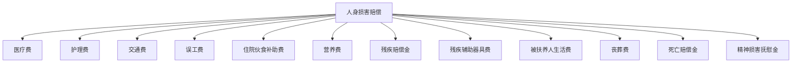
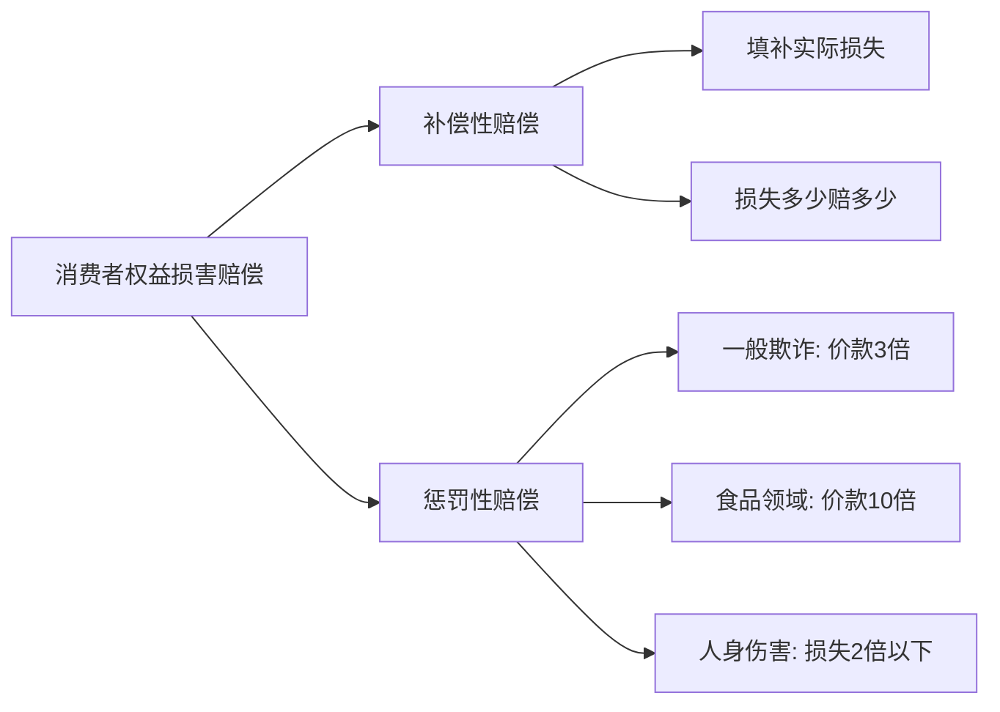
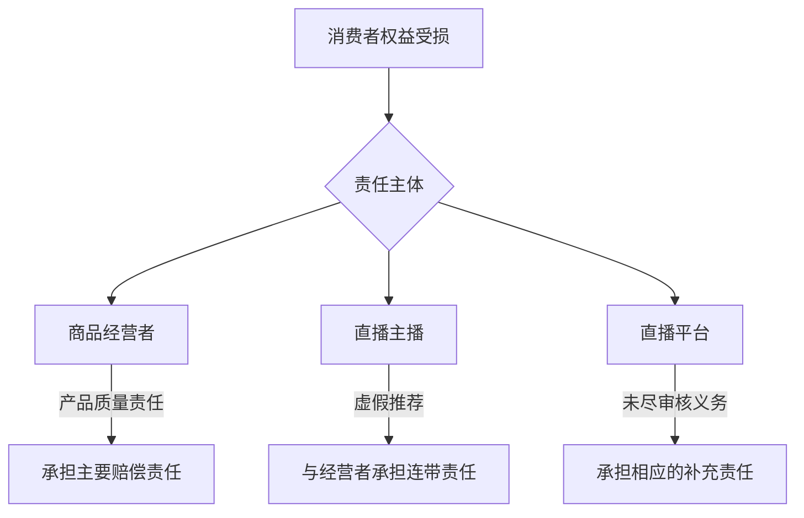
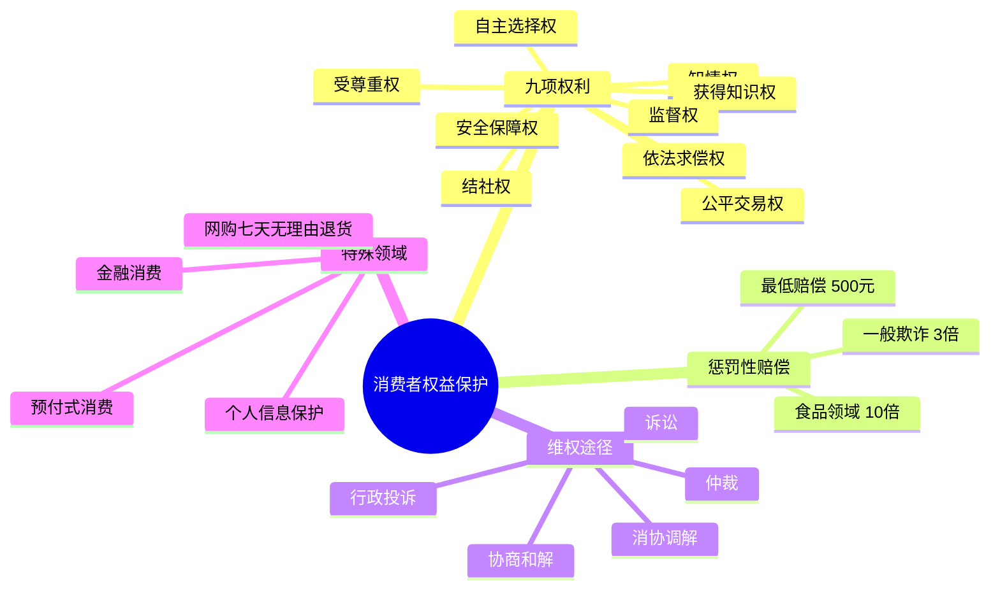

## 五、消费者权益保护

消费者权益保护是每个公民日常生活中最常接触的法律领域之一。从网购一件衣服到签订健身会籍合同，从餐厅就餐到购买房产，消费行为无处不在。当权益受损时，很多人选择"算了"——不是因为不想维权，而是不知道怎么维权。本章将系统梳理消费者权益保护的法律框架，从权利认知到实操维权，帮助你在每一次消费中都能有效保护自己。

### 5.1 消费者权益保护法概述

#### 5.1.1 立法沿革与核心定位

《中华人民共和国消费者权益保护法》（以下简称《消法》）于1993年首次颁布，2013年进行了重大修订，2024年进一步完善。该法的核心定位是**矫正信息不对称和地位不平等**——消费者相对于经营者，天然处于弱势地位，法律通过赋予消费者特殊权利、对经营者施加严格义务来实现平衡。

与《消法》配套的重要法规包括：

| 法规名称 | 主要规制领域 | 与《消法》的关系 |
|---------|------------|----------------|
| 《食品安全法》 | 食品生产、流通、餐饮 | 食品消费领域的特别法，赔偿标准更高 |
| 《产品质量法》 | 产品质量责任 | 产品缺陷致损的专门规定 |
| 《电子商务法》 | 网络购物、平台责任 | 线上消费的特别规制 |
| 《广告法》 | 虚假广告、误导宣传 | 经营者信息披露义务的补充 |
| 《价格法》 | 价格欺诈、哄抬物价 | 公平交易权的价格维度保障 |

#### 5.1.2 消费者的法律定义

《消法》第二条规定：消费者为生活消费需要购买、使用商品或者接受服务，其权益受本法保护。这个定义包含三个关键要素：

- **主体**：自然人（个人），不包括法人或非法人组织的经营性采购
- **目的**：生活消费需要，而非生产经营需要
- **行为**：购买、使用商品或接受服务（包括赠品使用场景）

**实务要点**：职业打假人是否属于"消费者"存在争议。最高人民法院在多个案例中倾向于支持知假买假者的消费者身份，特别是在食品药品领域。但2023年最高法相关意见对非食品药品领域的"职业打假"进行了限制，要求"合理生活消费需要范围内"才适用惩罚性赔偿。

### 5.2 消费者的九项基本权利详解

《消法》第七至第十五条系统规定了消费者享有的九项基本权利。下面逐一展开，每项权利配合真实场景说明。

#### 5.2.1 安全保障权（第七条）

**权利内容**：消费者在购买、使用商品和接受服务时享有人身、财产安全不受损害的权利。

**权利层次**：
- **人身安全**：商品或服务不得对消费者的身体健康和生命安全造成威胁。例如餐厅提供的食物导致食物中毒，电器漏电导致触电。
- **财产安全**：商品或服务不得对消费者的财产造成损害。例如手机充电器质量不合格导致手机烧毁。

**经营者的对应义务**：
- 对可能危及人身、财产安全的商品和服务，应当向消费者作出真实的说明和明确的警示
- 发现商品或服务存在缺陷时，应立即采取停止销售、警示、召回等措施
- 宾馆、商场、银行、车站、机场、体育场馆、娱乐场所等经营场所的经营者，应当对消费者尽到安全保障义务

**典型案例**：消费者在商场因地面湿滑摔倒受伤。商场未设置警示标志、未及时清理地面，违反了安全保障义务，应赔偿消费者的医疗费、误工费、护理费等损失。

**维权要点**：
- 保留就医记录、诊断证明、费用发票
- 拍摄现场照片（地面湿滑状态、缺失警示标志的情况）
- 确认商场监控录像是否保存（可申请法院调取）

#### 5.2.2 知情权（第八条）

**权利内容**：消费者享有知悉其购买、使用的商品或者接受的服务的真实情况的权利。

知情权是消费者做出正确消费决策的基础。消费者有权要求经营者提供以下信息：

- 商品的**价格、产地、生产者、用途、性能、规格、等级、主要成份、生产日期、有效期限、检验合格证明、使用方法说明、售后服务**等
- 服务的**内容、规格、费用**等

**实务中的知情权侵害场景**：

| 侵害类型 | 具体表现 | 法律后果 |
|---------|---------|---------|
| 虚假标注 | 将国产商品标注为进口 | 欺诈行为，适用三倍赔偿 |
| 隐瞒信息 | 二手车交易隐瞒事故记录 | 欺诈行为，可撤销合同并索赔 |
| 误导宣传 | "纯天然""零添加"无依据 | 虚假宣传，行政处罚+民事赔偿 |
| 格式条款 | 未显著提示限制消费者权利的条款 | 该条款不成为合同内容 |

#### 5.2.3 自主选择权（第九条）

**权利内容**：消费者享有自主选择商品或者服务的权利。

具体包括：
- 自主选择经营者
- 自主选择商品品种或服务方式
- 自主决定购买或不购买、接受或不接受
- 进行比较、鉴别和挑选

**常见侵害自主选择权的行为**：
- **强制搭售**：购买汽车时被要求必须在店内购买保险或加装配置
- **强制消费**：景区内强制乘坐观光车、强制使用导游服务
- **限制选择**：餐厅设置"最低消费"或"谢绝自带酒水"（2014年商务部已明确餐饮企业不得设最低消费）

**应对策略**：
- 遇到强制搭售，明确拒绝并录音留证
- 向市场监督管理局（12315）投诉
- 注意区分"捆绑销售"和"套餐优惠"——后者通常不违法，因为消费者仍有选择权

#### 5.2.4 公平交易权（第十条）

**权利内容**：消费者在购买商品或者接受服务时，有权获得质量保障、价格合理、计量正确等公平交易条件，有权拒绝经营者的强制交易行为。

**三个核心维度**：
- **质量保障**：商品应符合国家、行业标准，或经营者承诺的质量标准
- **价格合理**：明码标价，不得价格欺诈；特殊时期不得哄抬物价
- **计量正确**：不得短斤少两，计量器具应经检定合格

**价格欺诈的常见形式**（依据《禁止价格欺诈行为的规定》）：
- 虚构原价、虚假优惠折价：标"原价999，现价199"但从未以999元销售
- 低价招徕高价结算：货架标价与收银价格不符
- 不履行价格承诺：宣传"全场五折"但实际排除大部分商品
- 虚假满减：先提价再满减，实际优惠幅度远低于宣传

#### 5.2.5 依法求偿权（第十一条）

**权利内容**：消费者因购买、使用商品或者接受服务受到人身、财产损害的，享有依法获得赔偿的权利。

**人身损害赔偿范围**：

**财产损害赔偿范围**：
- 直接损失：商品本身的损失、维修费用
- 间接损失：因商品缺陷导致的其他财产损失（如漏水家电损坏地板）
- 合理的维权费用：鉴定费、律师费（部分法院支持）

#### 5.2.6 结社权（第十二条）

**权利内容**：消费者享有依法成立维护自身合法权益的社会组织的权利。

这项权利的实际意义在于：
- 消费者可以组建行业协会或消费者组织
- 通过集体力量增强与经营者的谈判能力
- 中国消费者协会（中消协）及各地消协是最主要的消费者保护组织

**如何有效利用消协**：
- 拨打12315热线或登录全国12315平台（www.12315.cn）
- 消协会进行调解，调解不成可出具调解不成告知书，消费者可据此向法院起诉
- 消协还可以代表众多消费者提起公益诉讼

#### 5.2.7 获得知识权（第十三条）

**权利内容**：消费者享有获得有关消费和消费者权益保护方面的知识的权利。

这项权利常被忽视，但它意味着：
- 国家和社会有义务普及消费知识和权益保护知识
- 学校教育应包含消费者权益保护内容
- 经营者有义务告知消费者正确的使用方法和注意事项

**实用建议**：关注"中国消费者报"公众号、各地消协官网，定期了解消费警示和维权案例，提升自我保护能力。

#### 5.2.8 受尊重权（第十四条）

**权利内容**：消费者在购买、使用商品和接受服务时，享有人格尊严、民族风俗习惯得到尊重的权利，个人信息依法得到保护。

2013年修订时新增了**个人信息保护**的内容，这在大数据时代尤为重要：

- 经营者收集、使用消费者个人信息，应当遵循合法、正当、必要的原则
- 经营者不得泄露、出售或者非法向他人提供消费者个人信息
- 未经消费者同意或请求，不得发送商业性信息

**个人信息保护的实操要点**：
- 注册账号时注意隐私协议中的信息共享条款
- 快递单等含有个人信息的单据应撕毁或涂抹后再丢弃
- 发现信息泄露可向网信部门或公安机关举报

#### 5.2.9 监督权（第十五条）

**权利内容**：消费者享有对商品和服务以及保护消费者权益工作进行监督的权利，有权检举、控告侵害消费者权益的行为，有权对消费者权益保护工作提出批评、建议。

**监督渠道**：
- **行政投诉**：12315（市场监管）、12345（政务服务热线）
- **媒体曝光**：消费者报、央视3·15晚会等
- **司法途径**：向法院起诉
- **网络平台**：黑猫投诉、聚投诉等第三方投诉平台
- **公益诉讼**：消协可以代表消费者提起公益诉讼

### 5.3 经营者的义务体系

#### 5.3.1 法定义务概览

《消法》第十六至第二十九条详细规定了经营者的义务，可归纳为以下几类：

| 义务类别 | 具体内容 | 违反后果 |
|---------|---------|---------|
| 安全保障义务 | 保证商品和服务符合安全标准 | 承担损害赔偿责任，严重的承担行政/刑事责任 |
| 信息披露义务 | 提供商品的真实信息，不得虚假宣传 | 欺诈行为适用三倍赔偿 |
| 质量保证义务 | 在正常使用期限内保证商品质量 | 修理、更换、退货及赔偿 |
| 公平交易义务 | 不得强制交易，公平定价 | 行政处罚+民事赔偿 |
| 格式条款限制义务 | 不得以格式条款排除消费者权利 | 该条款无效 |
| 三包义务 | 修理、更换、退货 | 承担违约责任 |
| 个人信息保护义务 | 妥善保管消费者个人信息 | 行政处罚+民事赔偿 |

#### 5.3.2 "三包"规定的实操要点

"三包"是指修理、更换、退货，是消费者最常使用的维权手段。2022年实施的新版《部分商品修理更换退货责任规定》扩大了三包适用范围：

**三包时间的一般规则**：

| 阶段 | 时间范围 | 消费者权利 |
|------|---------|-----------|
| 7天 | 自售出之日起7日内 | 出现性能故障可退货 |
| 15天 | 自售出之日起15日内 | 出现性能故障可换货 |
| 三包有效期内 | 因产品类别不同，一般1-3年 | 修理两次仍不能正常使用的，可换货 |

**注意事项**：
- "三包"自开具发票之日起计算，**保留好购物凭证至关重要**
- 换货后三包期重新计算
- 以下情况不适用三包：消费者使用不当造成损坏、自行拆动、无有效发票、三包凭证与实物不符

#### 5.3.3 格式条款的法律规制

格式条款（也称"霸王条款"）是消费者权益保护中的高频问题。《消法》第二十六条规定：

**格式条款无效的情形**：
- 排除或者限制消费者权利
- 减轻或者免除经营者责任
- 加重消费者责任

**常见的无效格式条款举例**：

| 条款内容 | 为何无效 |
|---------|---------|
| "特价商品概不退换" | 排除消费者依法享有的退货权 |
| "最终解释权归本店所有" | 排除消费者对合同条款的解释权 |
| "赠品不享受三包" | 赠品同样适用三包规定 |
| "逾期未提货视为放弃" | 不能免除经营者保管义务 |
| "充值卡过期余额不退" | 属于预付款，消费者有权要求退还余额 |
| "定制商品不支持七天无理由退货" | 需要区分情况，非定制部分仍应支持退货 |

### 5.4 惩罚性赔偿制度

惩罚性赔偿是《消法》最具威慑力的制度设计，它突破了传统民事赔偿的"填平原则"，让经营者在违法成本上付出数倍代价。

#### 5.4.1 一般欺诈行为的三倍赔偿

**法律依据**：《消法》第五十五条第一款

**构成要件**：
1. 经营者实施了欺诈行为（故意告知虚假信息或隐瞒真实信息）
2. 消费者因此陷入错误认识
3. 消费者基于错误认识作出了消费决定
4. 消费者遭受了损失

**赔偿计算**：

> 赔偿金额 = 购买商品价款或服务费用 × 3
> 若计算结果不足500元，按500元赔偿

**示例**：你花150元买了一件标注"100%纯羊绒"的毛衣，后经检测发现含绒量为0。经营者构成欺诈，你可以要求：退还150元货款 + 赔偿150×3=450元。因450元不足500元，实际赔偿为500元，加上退款共获得650元。

**注意**：2023年最高法相关意见明确，对于"知假买假"的行为，在食品药品以外的领域，法院可以综合考虑消费者的购买频次、数量等因素，对超出"合理生活消费需要"部分不支持惩罚性赔偿。

#### 5.4.2 食品药品领域的十倍赔偿

**法律依据**：《食品安全法》第一百四十八条第二款

**赔偿计算**：

> 赔偿金额 = 食品价款 × 10（或损失的3倍，取高者）

**适用条件**：
- 生产不符合食品安全标准的食品
- 经营明知是不符合食品安全标准的食品
- 食品的标签、说明书存在不影响食品安全且不会对消费者造成误导的瑕疵除外

**示例**：你花80元买了某品牌面包，食用后发现已过保质期。你可以要求：退还80元 + 赔偿80×10=800元，共880元。

#### 5.4.3 惩罚性赔偿与补偿性赔偿的区别

### 5.5 维权途径与实操指南

#### 5.5.1 五种维权途径

消费者与经营者发生权益争议时，可以通过以下五种途径解决（《消法》第三十九条）：

**途径一：与经营者协商和解**

这是成本最低、效率最高的方式。操作建议：
- 保留所有消费凭证（发票、收据、电子订单截图）
- 通过书面方式（微信、邮件）沟通，保留聊天记录
- 明确提出你的诉求（退货、换货、赔偿的具体金额）
- 给对方合理的处理期限（一般3-7天）

**途径二：请求消费者协会调解**

协商不成时的首选途径：
- 拨打12315热线（工作时间有人工服务）
- 登录"全国12315平台"（www.12315.cn）在线投诉
- 微信搜索"12315"小程序
- 消协收到投诉后会在7个工作日内决定是否受理
- 受理后一般在60日内完成调解

**途径三：向行政部门投诉**

可以向以下部门投诉：
- **市场监督管理局**（12315）：产品质量、价格欺诈、虚假宣传
- **文旅部门**：旅游消费纠纷
- **银保监会**（12378）：银行、保险消费纠纷
- **工信部**（12300）：电信服务纠纷
- **网信办**：网络消费、个人信息保护

**途径四：提请仲裁**

适用条件：双方必须达成仲裁协议（通常在合同中约定）。仲裁裁决具有法律效力，一裁终局，不能上诉。

**途径五：向人民法院提起诉讼**

最后的法律救济途径：
- **管辖法院**：可以选择被告住所地、合同履行地、侵权行为地法院
- **小额诉讼**：标的额较小的案件可以适用小额诉讼程序（一审终审）
- **举证责任倒置**：部分情况下由经营者承担举证责任（如机动车、电视机等耐用商品六个月内发现瑕疵的，由经营者承担举证责任）

#### 5.5.2 网络购物的特殊维权规则

网络购物已成为消费的主流方式，《消法》和《电子商务法》为此设定了特殊规则：

**七天无理由退货（《消法》第二十五条）**：

自收到商品之日起七天内可以无理由退货，但以下商品除外：
- 消费者定作的商品
- 鲜活易腐的商品
- 在线下载或消费者已拆封的音像制品、计算机软件等数字化商品
- 交付的报纸、期刊

**网络交易平台的责任**：
- 平台不能提供销售者真实信息的，消费者可以向平台要求赔偿
- 平台知道或应当知道经营者侵害消费者权益而未采取措施的，承担连带责任
- 平台应建立消费者权益保护制度，包括争议处理机制

**网购维权的证据保全**：
- 截图保存商品页面描述、价格、优惠信息
- 保存订单详情、物流信息
- 与卖家的聊天记录要完整保存（不要只截图部分）
- 收到商品后立即拍照/录视频开箱
- 如有质量问题，保留相关鉴定报告

#### 5.5.3 维权的时间线与策略

Day 0: 发现问题
  ↓
Day 1-3: 收集证据（拍照、录像、保留凭证）
  ↓
Day 3-7: 与经营者协商（书面沟通）
  ↓
Day 7-14: 协商不成，向12315投诉
  ↓
Day 14-60: 等待行政调解/消协调解
  ↓
Day 60+: 调解不成，考虑诉讼
  ↓
诉讼时效: 一般为3年（自知道权益受损之日起计算）

### 5.6 特殊领域的消费者保护

#### 5.6.1 预付式消费

健身房、美容院、教育培训等领域的预付式消费纠纷频发。2024年最高法发布的《关于审理预付式消费民事纠纷案件适用法律若干问题的解释》明确了以下规则：

- **经营者迁址**：经营者变更经营场所导致消费者接受服务明显不便的，消费者有权解除合同并要求退还预付款余额
- **转让经营**：经营者将预付消费合同义务转让给第三人的，应经消费者同意，否则消费者有权解除合同
- **退费计算**：已消费部分按实际折扣计算（不能按原价扣减），未消费部分应退还
- **资金安全**：鼓励建立预付资金存管制度，经营者应将预收资金存入专用账户

**实操建议**：
- 预付金额不宜过大，尽量选择短期套餐
- 签订书面合同，明确服务内容、期限、退费规则
- 保留每次消费记录
- 经营者出现异常（频繁更换教练、设备维修）时及时退费

#### 5.6.2 个人信息保护

《消法》第二十九条配合《个人信息保护法》构建了完整的个人信息保护框架：

**经营者的义务**：
- 收集信息应明示目的、方式和范围，并经消费者同意
- 不得收集与提供服务无关的个人信息
- 不得泄露、出售或非法提供消费者个人信息
- 应采取技术措施确保信息安全

**消费者的权利**：
- 知情权：了解个人信息被收集和使用的情况
- 同意权：对信息收集说"不"
- 删除权：要求经营者删除已收集的个人信息
- 更正权：要求更正不准确的个人信息

#### 5.6.3 金融消费保护

金融消费的特殊性在于信息不对称更为严重。2023年国家金融监督管理总局成立后，金融消费者保护体系进一步完善：

- **适当性义务**：金融机构应将合适的产品推荐给合适的消费者
- **告知义务**：应充分披露风险，不得隐瞒或误导
- **冷静期**：部分保险产品设有一犹豫期（一般15-20天），期内可无条件退保
- **投诉渠道**：12378银行保险消费者投诉维权热线

### 5.7 常见维权误区与避坑指南

#### 误区一：没有发票就不能维权

**真相**：发票是重要证据但不是唯一证据。电子订单截图、支付记录、银行流水、收据等都可以作为消费凭证。证人证言在特定情况下也可以使用。

#### 误区二：过了七天就不能退了

**真相**：七天无理由退货仅适用于网购等远程购物方式。线下购物适用三包规定，7天内可退，15天内可换，三包期内可修。商品存在质量问题的，在三包有效期内都可以主张权利。

#### 误区三：商品质量问题只能找商家

**真相**：消费者可以向销售者要求赔偿，也可以向生产者要求赔偿。属于生产者责任的，销售者赔偿后有权向生产者追偿；属于销售者责任的，生产者赔偿后有权向销售者追偿。消费者可以选择对自己最有利的一方主张权利。

#### 误区四：维权金额太小不值得

**真相**：对于小额纠纷，可以选择以下低成本维权方式：
- 12315投诉（免费）
- 消协调解（免费）
- 小额诉讼（诉讼费低，一审终审）
- 部分平台（如淘宝、京东）有内置的争议处理机制

#### 误区五：口头承诺不算数

**真相**：口头承诺也是合同的一部分，但难点在于举证。建议：
- 重要的口头承诺要求对方书面确认（微信消息即可）
- 消费时全程录音（在公共场所录音合法）
- 保留宣传材料（传单、海报等）

### 5.8 维权工具箱

#### 5.8.1 常用投诉平台

| 平台 | 适用场景 | 使用方式 |
|------|---------|---------|
| 全国12315平台 | 产品质量、价格、虚假宣传 | www.12315.cn / 微信小程序 |
| 黑猫投诉 | 各类消费纠纷 | tousu.sina.com.cn |
| 12345政务热线 | 综合性投诉 | 电话拨打12345 |
| 银保监投诉 | 金融消费纠纷 | 12378热线 |
| 工信部投诉 | 电信服务纠纷 | 12300热线 |

#### 5.8.2 投诉信模板

投诉人：[姓名]，联系电话：[手机号]
被投诉人：[经营者名称]，地址：[经营地址]

投诉事项：
[时间]，本人在[地点/平台]购买了[商品/服务名称]，价格[金额]。
[具体描述问题，包括时间、地点、经过]
[说明经营者的态度和处理情况]

投诉请求：
1. [明确诉求，如退货退款/赔偿损失/道歉等]
2. 赔偿金额：[金额及计算依据]

附件：
1. 购物凭证/发票
2. 商品照片/问题截图
3. 沟通记录
4. 其他证据材料

投诉人签名：
日期：

#### 5.8.3 诉讼准备清单

如果你决定走诉讼途径，需要准备以下材料：

- [ ] 起诉状（按法院格式模板撰写）
- [ ] 原告身份证明（身份证复印件）
- [ ] 被告信息（经营者名称、地址、统一社会信用代码）
- [ ] 购物凭证（发票、订单截图、支付记录）
- [ ] 商品/服务存在问题的证据（照片、视频、鉴定报告）
- [ ] 与经营者协商的记录（聊天截图、通话录音）
- [ ] 损失证明（医疗费发票、维修费收据、误工证明）
- [ ] 诉讼费缴纳凭证

### 5.9 新趋势与前瞻

#### 5.9.1 算法歧视与大数据杀熟

平台利用算法对老用户收取更高价格（大数据杀熟）已引发广泛关注。《个人信息保护法》第二十四条对此作出规制：

- 通过自动化决策方式向个人进行信息推送、商业营销，应提供不针对其个人特征的选项
- 通过自动化决策方式作出对个人权益有重大影响的决定，个人有权要求说明，并有权拒绝

**应对策略**：
- 对比不同账号（新号/老号）的价格
- 使用比价工具
- 保留价格截图作为证据
- 向市场监管部门举报

#### 5.9.2 直播带货的责任分配

直播带货涉及多方主体，责任分配如下：

#### 5.9.3 人工智能与消费者保护

AI技术在消费领域的应用带来了新的挑战：
- **AI生成内容的虚假宣传**：AI生成的"用户好评"是否构成虚假宣传
- **算法推荐的透明度**：平台推荐算法是否应向消费者公开
- **AI客服的责任归属**：AI客服给出错误建议导致损失，责任由谁承担

这些问题目前尚无明确立法，但已有司法案例在探索中。消费者在此类场景中应特别注意保留交互记录，以便在发生争议时有据可查。

### 5.10 本节要点回顾

消费者权益保护不仅是一部法律，更是一种生活能力。掌握这些知识，你就能在面对消费纠纷时不再忍气吞声，而是有理有据地维护自己的合法权益。记住：每一次认真的维权，不仅是在保护自己，也是在推动整个消费环境的改善。
