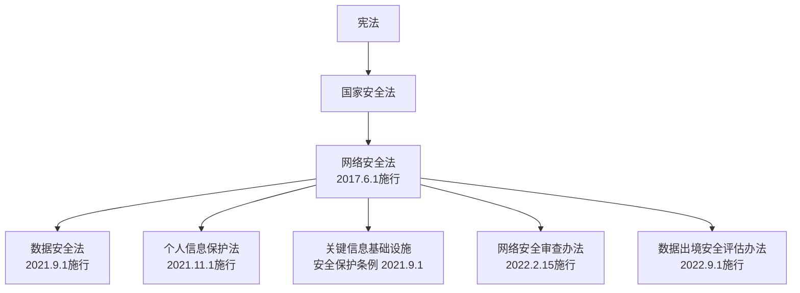
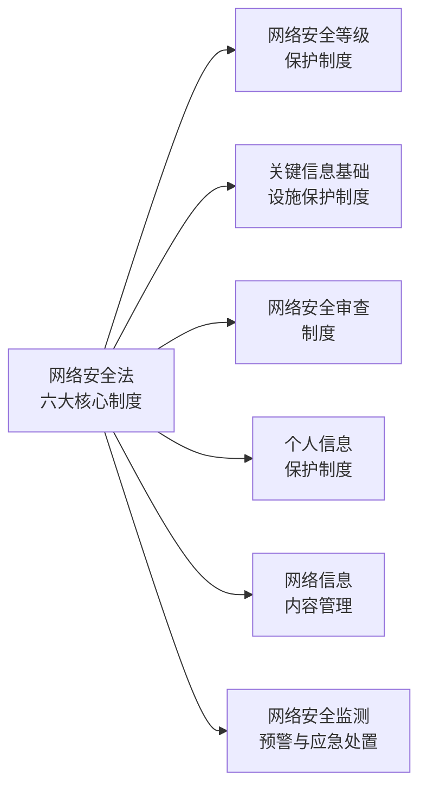
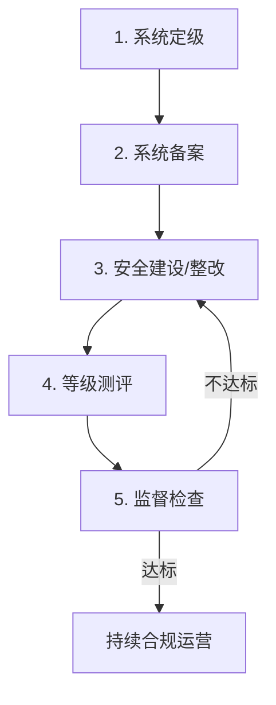

## 六、网络安全法

### 6.1 为什么每个人都需要了解网络安全法

2017年6月1日，《中华人民共和国网络安全法》（以下简称《网安法》）正式施行。这是我国第一部全面规范网络空间安全管理的基础性法律，标志着网络安全从"技术问题"上升为"国家安全战略"。

对于普通公民而言，了解网络安全法不是"可选项"而是"必修课"——你每天使用的微信支付、外卖下单、短视频浏览，背后都受到这部法律的保护和约束。对于企业和开发者而言，不合规的代价可能是真金白银的罚款甚至刑事责任。

#### 6.1.1 立法背景与法律体系定位

《网安法》的出台有明确的时代背景。2013年"棱镜门"事件曝光美国大规模监控计划，2014年中央网络安全和信息化领导小组成立，2015年《国家安全法》将网络安全纳入国家安全体系。《网安法》正是在这一背景下应运而生。

从法律体系来看，《网安法》处于网络安全法律体系的"母法"地位：

三部核心法律的关系：

| 法律 | 核心关注点 | 侧重点 | 适用对象 |
|------|-----------|--------|---------|
| 网络安全法 | 网络运行安全 | 基础设施保护、等级保护、网络运行安全 | 网络运营者、网络产品/服务提供者 |
| 数据安全法 | 数据安全与利用 | 数据分类分级、数据安全审查、数据出境 | 数据处理活动的组织、个人 |
| 个人信息保护法 | 个人权益保护 | 个人信息处理规则、个人权利、跨境传输 | 个人信息处理者 |

### 6.2 网络安全法的核心制度框架

《网安法》确立了六大核心制度，构成完整的网络安全治理框架：

#### 6.2.1 网络安全等级保护制度

等级保护制度（简称"等保"）是《网安法》最核心、最具实操性的制度。其基本逻辑是：不同重要程度的网络系统，面临不同的安全风险，需要实施不同级别的安全保护措施。

**五个等级的具体含义：**

| 等级 | 名称 | 受侵害对象 | 损害程度 | 典型场景 |
|------|------|-----------|---------|---------|
| 第一级 | 用户自主保护级 | 公民、法人合法权益 | 一般损害 | 个人博客、小型展示网站 |
| 第二级 | 系统审计保护级 | 公民、法人合法权益 | 严重损害；或社会秩序和公共利益一般损害 | 企业OA系统、一般电商网站、地市级政府网站 |
| 第三级 | 安全标记保护级 | 社会秩序和公共利益 | 严重损害；或国家安全一般损害 | 省级政务平台、大型电商平台、银行网上银行系统 |
| 第四级 | 结构化保护级 | 社会秩序和公共利益 | 特别严重损害；或国家安全严重损害 | 国家电力调度系统、铁路票务核心系统 |
| 第五级 | 访问验证保护级 | 国家安全 | 特别严重损害 | 国防、军事核心网络系统 |

**等保合规的实操流程：**

**第一步：系统定级。** 网络运营者根据系统受到破坏后可能造成的损害范围和严重程度，初步确定安全保护等级。定级需要编写《定级报告》，包含系统描述、业务分析、安全需求分析等内容。

**第二步：系统备案。** 第二级以上系统需要在系统上线后30个工作日内，到所在地设区的市级以上公安机关办理备案手续。备案时需提交：营业执照副本复印件、法人身份证复印件、系统拓扑结构图、定级报告等材料。

**第三步：安全建设/整改。** 根据《信息安全技术 网络安全等级保护基本要求》（GB/T 22239-2019），从安全物理环境、安全通信网络、安全区域边界、安全计算环境、安全管理中心、安全管理制度、安全管理机构、安全管理人员、安全建设管理、安全运维管理等十个方面进行安全建设。

**第四步：等级测评。** 委托具有测评资质的测评机构进行测评。测评内容包括技术测评和管理测评两大部分。测评结论分为优、良、中、差四个等级。

**第五步：监督检查。** 公安机关定期对已备案系统的安全保护情况进行监督检查。

**等保2.0的变化要点：** 2019年发布的等保2.0标准（GB/T 22239-2019）相比1.0版本有重大升级：新增了云计算、移动互联、物联网、工业控制系统等新场景的安全扩展要求；从被动防御转向主动防御；增加了对可信计算技术的要求。

#### 6.2.2 关键信息基础设施保护制度

关键信息基础设施（Critical Information Infrastructure，CII）是指公共通信和信息服务、能源、交通、水利、金融、公共服务、电子政务、国防科技工业等重要行业和领域的网络设施和信息系统。一旦遭到破坏、丧失功能或数据泄露，可能严重危害国家安全、国计民生和公共利益。

CII运营者需要承担比一般网络运营者更严格的义务：

| 义务类型 | 具体要求 |
|---------|---------|
| 安全管理机构 | 设置专门安全管理机构，对该机构负责人和关键岗位人员进行安全背景审查 |
| 安全培训 | 定期对从业人员进行网络安全教育、技术培训和技能考核 |
| 容灾备份 | 对重要系统和数据库进行容灾备份，确保在遭受攻击时可以快速恢复 |
| 应急演练 | 每年至少进行一次网络安全检测和风险评估，定期开展应急演练 |
| 供应链安全 | 采购网络产品和服务时，应通过国家安全审查；签订安全保密协议 |
| 数据境内存储 | 个人信息和重要数据应当在境内存储，确需出境的须通过安全评估 |

#### 6.2.3 网络安全审查制度

网络安全审查针对的是关键信息基础设施运营者采购网络产品和服务的行为。审查重点关注产品和服务的安全性、可控性，防范因使用产品和服务带来的国家安全风险。

2022年修订后的《网络安全审查办法》新增了对"掌握超过100万用户个人信息的网络平台运营者赴国外上市"的审查要求。这一规定直接导致了大量中国科技企业调整上市策略。

### 6.3 个人信息保护：从网安法到个保法

#### 6.3.1 网安法中的个人信息保护框架

《网安法》第40条至第45条构建了个人信息保护的基础框架：

**合法收集三要素：**
1. **合法性基础**：必须具有明确、合理的目的，并遵循合法、正当、必要的原则
2. **知情同意**：必须公开收集、使用规则，明示目的、方式和范围，并经被收集者同意
3. **最小必要**：不得收集与所提供服务无关的个人信息

**存储与传输安全：**
- 网络运营者不得泄露、篡改、毁损其收集的个人信息
- 未经被收集者同意，不得向他人提供个人信息（经过处理无法识别特定个人且不能复原的除外）
- 应当采取技术措施和其他必要措施，确保其收集的个人信息安全

**个人权利保障：**
- **删除权**：发现违反法律规定或约定收集使用的，有权要求删除
- **更正权**：发现个人信息有错误的，有权要求更正
- **投诉权**：可以向有关主管部门投诉、举报

#### 6.3.2 《个人信息保护法》的全面升级

2021年11月1日施行的《个人信息保护法》（简称《个保法》）将个人信息保护提升到了全新高度：

**处理个人信息的七项合法基础：**

《个保法》第13条列举了在未取得个人同意的情况下，也可以处理个人信息的其他合法基础：

| 序号 | 合法基础 | 典型场景 |
|------|---------|---------|
| 1 | 取得个人同意 | 注册账号时勾选隐私协议 |
| 2 | 为订立、履行合同所必需 | 网购填写收货地址 |
| 3 | 为履行法定职责或法务义务 | 银行按反洗钱法收集客户信息 |
| 4 | 应对突发公共卫生事件 | 疫情期间收集行程信息 |
| 5 | 为公共利益实施新闻报道、舆论监督 | 新闻媒体披露涉及公共利益的信息 |
| 6 | 在合理范围内处理公开的个人信息 | 对已公开的信息进行统计分析 |
| 7 | 法律、行政法规规定的其他情形 | — |

**敏感个人信息的特殊保护：**

《个保法》首次定义了"敏感个人信息"并设置了更高的保护标准。敏感个人信息是指一旦泄露或非法使用，容易导致自然人的人格尊严受到侵害或者人身、财产安全受到危害的个人信息：

- 生物识别信息：人脸、指纹、虹膜、声纹
- 宗教信仰、特定身份
- 医疗健康信息
- 金融账户信息
- 行踪轨迹信息
- 不满14周岁未成年人的个人信息

处理敏感个人信息的额外要求：
1. 必须具有特定目的和充分必要性
2. 必须取得个人的**单独同意**（不同于一般同意）
3. 需要进行个人信息保护影响评估
4. 应当向个人告知处理的必要性以及对个人权益的影响

**个人信息保护影响评估（PIA）：**

以下场景必须进行PIA：
- 处理敏感个人信息
- 利用个人信息进行自动化决策
- 委托处理个人信息、向第三方提供个人信息、公开个人信息
- 向境外提供个人信息
- 其他对个人权益有重大影响的活动

**自动化决策的规制：**

《个保法》第24条对"大数据杀熟"等问题作出回应：
- 利用个人信息进行自动化决策，应当保证决策的透明度和结果公平、公正
- 不得对个人在交易价格等交易条件上实行不合理的差别待遇
- 通过自动化决策方式向个人进行信息推送、商业营销时，应提供不针对个人特征的选项，或提供便捷的拒绝方式
- 通过自动化决策方式作出对个人权益有重大影响的决定，个人有权要求说明，并有权拒绝仅通过自动化决策的方式作出的决定

#### 6.3.3 个人信息处理者的核心义务清单

| 义务 | 具体要求 | 违反后果 |
|------|---------|---------|
| 制定内部管理制度 | 建立个人信息处理流程、权限管理、安全培训等制度 | 警告、罚款 |
| 采取安全技术措施 | 加密存储、去标识化、访问控制、安全审计 | 罚款、暂停业务 |
| 指定个人信息保护负责人 | 处理达到规定数量的，应指定负责人 | 罚款 |
| 合规审计 | 定期对个人信息处理活动进行合规审计 | 罚款 |
| 影响评估 | 在法定场景下进行PIA并保存记录至少三年 | 罚款 |
| 安全事件通知 | 发生或可能发生泄露时，立即采取补救措施并通知监管和个人 | 罚款、吊销执照 |

### 6.4 网络运行安全：企业的合规红线

#### 6.4.1 网络运营者的法定义务

《网安法》第21条至第37条详细规定了网络运营者的安全义务：

**技术措施义务：**
- 制定内部安全管理制度和操作规程，确定网络安全负责人
- 采取防范计算机病毒和网络攻击、网络侵入等危害网络安全行为的技术措施
- 采取监测、记录网络运行状态、网络安全事件的技术措施，并按照规定留存相关网络日志**不少于六个月**
- 采取数据分类、重要数据备份和加密等措施

**日志留存义务（重点）：**

网络日志留存不少于六个月是网安法的硬性要求。日志范围包括：

| 日志类型 | 记录内容 | 留存要求 |
|---------|---------|---------|
| 网络访问日志 | 源IP、目的IP、访问时间、访问内容、协议类型 | ≥6个月 |
| 用户操作日志 | 用户登录/注销、关键操作（增删改查） | ≥6个月 |
| 网络安全事件日志 | 攻击事件、异常访问、安全告警 | ≥6个月 |
| DNS查询日志 | 域名解析请求、解析结果 | ≥6个月 |

**违法后果：** 未留存日志的，由有关主管部门责令改正，给予警告；拒不改正的，处一万元以上十万元以下罚款，并对直接负责的主管人员处五千元以上五万元以下罚款。

#### 6.4.2 网络产品和服务的安全要求

《网安法》第22条对网络产品和服务提出四项强制性要求：

1. **安全可信**：不得设置恶意程序；发现安全缺陷、漏洞等风险时，应立即采取补救措施，按照规定及时告知用户并向有关主管部门报告
2. **持续维护**：应当持续提供安全维护服务，在承诺期限内不得终止
3. **禁止后门**：不得为其产品和服务提供者提供专门用于从事侵入网络、干扰网络正常功能及防护措施、窃取网络数据等危害网络安全活动的程序、工具
4. **信息告知**：应向用户作出安全提示，告知其网络安全风险

#### 6.4.3 网络信息内容管理

《网安法》第12条和第47条规定了网络信息内容管理的基本框架：

**禁止传播的信息（"七条底线"）：**
- 反对宪法所确定的基本原则的
- 危害国家安全，泄露国家秘密，颠覆国家政权，破坏国家统一的
- 损害国家荣誉和利益的
- 歪曲、丑化、亵渎、否定英雄烈士事迹和精神的
- 宣扬恐怖主义、极端主义或者煽动实施恐怖活动、极端主义活动的
- 煽动民族仇恨、民族歧视，破坏民族团结的
- 破坏国家宗教政策，宣扬邪教和封建迷信的
- 散布谣言，扰乱经济秩序和社会秩序的
- 散布淫秽、色情、赌博、暴力、凶杀、恐怖或者教唆犯罪的
- 侮辱或者诽谤他人，侵害他人名誉、隐私和其他合法权益的
- 法律、行政法规禁止的其他内容

**平台的内容管理义务：**
- 建立健全信息发布审核、公共信息巡查、应急处置等制度
- 发现违法违规信息，应立即停止传输，采取消除等处置措施，保存有关记录，并向有关主管部门报告
- 配合有关部门进行监督检查

### 6.5 网络安全违法行为的法律后果

#### 6.5.1 行政处罚

《网安法》规定的行政处罚分为多个层级：

| 违法行为 | 处罚措施 | 法律依据 |
|---------|---------|---------|
| 未履行安全保护义务 | 警告 + 罚款1万-10万 | 第59条 |
| 设置恶意程序/未报告安全漏洞 | 罚款1万-10万；情节严重的10万-50万 | 第60条 |
| 违反个人信息保护规定 | 罚款1万-10万；情节严重的10万-100万 | 第64条 |
| 拒不配合公安机关调查 | 罚款5万-50万；情节严重的5万-50万 + 停业整顿/吊销执照 | 第69条 |
| 违反关键信息基础设施保护 | 罚款10万-100万；直接负责人1万-10万 | 第59条 |
| 网络运营者未配合网信部门 | 警告 + 罚款1万-10万 | 第68条 |

**2021年后罚款力度大幅升级：**《个保法》和《数据安全法》的罚款上限远超《网安法》。《个保法》第66条规定，情节严重的，可处5000万元以下或上一年度营业额5%以下罚款，并可对直接负责的主管人员和其他直接责任人员处10万-100万元罚款。

#### 6.5.2 真实执法案例

**案例一：滴滴出行网络安全审查案（2022年）**

2021年7月，"滴滴出行"App因严重违法违规收集使用个人信息被下架。2022年7月，国家互联网信息办公室依据《网安法》《数据安全法》《个保法》，对滴滴全球股份有限公司处以80.26亿元罚款，对两名主要负责人各处100万元罚款。

违法行为包括：
- 违法收集用户手机相册中的截图信息1196.39万条
- 过度收集用户剪切板信息、应用列表信息83.23亿条
- 过度收集乘客人脸识别信息1.07亿条、年龄段信息5350.92万条、职业信息1633.56万条等
- 违法处理个人信息达647.09亿条

**案例二：某酒店集团数据泄露案（2020年）**

国际酒店集团万豪（Marriott）因其旗下喜达屋酒店预订系统自2014年起被黑客入侵，约3.39亿条客人记录泄露，被英国信息专员办公室（ICO）罚款1840万英镑。在国内，多家酒店集团也因数据泄露被网信部门约谈整改。

**案例三：人脸识别第一案（2021年）**

杭州野生动物世界因强制要求年卡客户激活人脸识别，被消费者郭兵起诉。法院认定：未经消费者同意，不得强制收集人脸识别信息。该案入选最高人民法院"弘扬社会主义核心价值观"典型案例。

#### 6.5.3 刑事责任

严重违反网络安全法律的行为可能构成刑事犯罪：

| 罪名 | 适用情形 | 刑罚 |
|------|---------|------|
| 非法侵入计算机信息系统罪 | 侵入国家事务、国防建设、尖端科学技术领域的计算机信息系统 | 3年以下有期徒刑 |
| 破坏计算机信息系统罪 | 后果严重的 | 5年以下；后果特别严重的5年以上 |
| 拒不履行信息网络安全管理义务罪 | 经监管部门责令采取改正措施而拒不改正 | 3年以下有期徒刑 |
| 非法获取计算机信息系统数据罪 | 违反国家规定，获取计算机信息系统中存储、处理或传输的数据 | 3年以下；情节特别严重3-7年 |
| 帮助信息网络犯罪活动罪 | 明知他人利用信息网络实施犯罪，提供技术支持、广告推广、支付结算等帮助 | 3年以下有期徒刑 |
| 侵犯公民个人信息罪 | 违反规定，出售或提供公民个人信息 | 3年以下；情节严重3-7年 |

### 6.6 公民的网络安全权利与义务

#### 6.6.1 你享有的权利

作为网络用户，法律赋予你以下权利：

1. **个人信息控制权**：你有权知道谁在收集你的信息、收集了什么、用于什么目的，以及有权要求删除和更正
2. **知情权**：网络运营者应当以显著方式、清晰易懂的语言向你告知个人信息处理规则
3. **拒绝权**：有权拒绝提供非必要的个人信息，有权拒绝自动化决策
4. **查阅复制权**：有权向个人信息处理者查阅、复制你的个人信息
5. **可携带权**：有权请求将个人信息转移至你指定的个人信息处理者（条件是符合国家网信部门规定条件）
6. **投诉举报权**：有权向网信部门、公安机关等投诉举报
7. **损害赔偿权**：因个人信息权益受到侵害的，有权要求赔偿

#### 6.6.2 你承担的义务

权利与义务对等，网络用户也需要承担相应义务：

- **守法义务**：不得利用网络从事危害国家安全、荣誉和利益的活动
- **不侵权义务**：不得利用网络实施诈骗、传授犯罪方法、制作或者销售违禁物品
- **尊重隐私义务**：不得利用网络发布涉及他人隐私和个人信息的内容（人肉搜索、网络暴力均可能违法）
- **报告义务**：发现网络安全漏洞等风险时，应当及时向有关部门报告
- **配合义务**：配合公安机关依法维护网络安全和侦查犯罪活动
- **实名义务**：办理网络接入、域名注册、电话卡入网等服务时，应当提供真实身份信息

### 6.7 日常生活中的网络安全法应用

#### 6.7.1 个人信息保护实操指南

**日常习惯清单：**

| 场景 | 正确做法 | 常见错误 |
|------|---------|---------|
| APP注册 | 使用最小必要信息注册，非必填项不填 | 填写真实生日、家庭地址等冗余信息 |
| 权限授权 | 按需授权，拒绝不必要的权限（如手电筒APP要通讯录权限） | 一律"允许"所有权限请求 |
| WiFi连接 | 优先使用蜂窝数据；公共WiFi不进行敏感操作 | 随意连接免费WiFi并登录银行APP |
| 链接点击 | 不点击不明来源链接；通过官方渠道验证信息 | 随意点击"中奖""罚款""账户异常"短信链接 |
| 旧设备处理 | 恢复出厂设置 + 存储空间覆写 | 简单删除文件后出售/转让 |
| 密码管理 | 使用密码管理器，不同平台使用不同强密码 | 所有平台使用同一密码 |
| 隐私政策 | 花2分钟了解核心条款（收集范围、共享对象、数据存储位置） | 直接跳过不看 |
| 社交媒体 | 关闭位置标签；定期审查好友列表和隐私设置 | 实时分享位置和行程 |

**当你的个人信息被泄露时：**

1. **固定证据**：截图保存泄露信息、记录泄露来源、保存相关通信记录
2. **向平台投诉**：要求平台删除泄露信息、采取补救措施
3. **向监管部门举报**：可向以下部门举报——
   - 中央网信办违法和不良信息举报中心：www.12377.cn
   - 工信部电信用户申诉受理中心：12300
   - 公安机关：拨打110或到当地派出所报案
   - 消费者协会：12315
4. **诉讼维权**：向人民法院提起民事诉讼，主张侵权损害赔偿

#### 6.7.2 企业合规快速自查清单

对于中小企业和开发者，以下是最低限度的合规自查项：

□ 是否已完成网络安全等级保护备案？（二级以上系统）
□ 网络日志是否留存了至少6个月？
□ 隐私政策是否已更新？是否符合《个保法》的告知要求？
□ 是否已建立个人信息收集使用的同意机制？
□ 是否已指定个人信息保护负责人？（处理达到规定数量）
□ 是否已完成个人信息保护影响评估（PIA）？（敏感信息、自动化决策等场景）
□ 是否已制定网络安全应急预案？
□ 是否已进行年度网络安全检测和风险评估？
□ 第三方SDK和插件是否已纳入个人信息保护管理？
□ 数据跨境传输是否已通过安全评估？（如有境外业务）

### 6.8 网络安全法的前沿发展与趋势

#### 6.8.1 人工智能治理

随着ChatGPT等大语言模型的爆发，2023年国家网信办等部门发布了《生成式人工智能服务管理暂行办法》，对AI服务提供者提出要求：
- 训练数据来源须合法，不得侵犯知识产权
- 生成内容须真实准确，采取措施防止生成虚假信息
- 不得收集非必要个人信息
- 应当对生成的图片、视频等内容进行标识

#### 6.8.2 数据出境新规

2022年9月1日施行的《数据出境安全评估办法》规定，以下情形必须通过国家网信部门组织的安全评估：
- 关键信息基础设施运营者向境外提供个人信息
- 处理100万人以上个人信息的数据处理者向境外提供个人信息
- 自上年1月1日起累计向境外提供10万人个人信息或1万人敏感个人信息的数据处理者

#### 6.8.3 开发者特别注意事项

对于软件开发者和系统运维人员，以下领域需要特别关注：

1. **日志系统设计**：从架构设计阶段就考虑6个月日志留存要求，规划足够的存储容量
2. **隐私设计（Privacy by Design）**：在产品设计阶段就嵌入隐私保护机制，而非事后补救
3. **最小权限原则**：代码层面实施最小权限访问控制，避免过度收集
4. **安全开发生命周期（SDL）**：在需求分析、设计、编码、测试、部署各阶段嵌入安全要求
5. **第三方组件管理**：建立软件物料清单（SBOM），跟踪第三方组件的安全漏洞
6. **数据加密**：传输层使用TLS 1.2+，存储层使用AES-256等强加密算法
7. **漏洞披露机制**：建立安全漏洞接收和响应流程，避免因未及时修复漏洞被追责

### 6.9 常见误区与纠正

| 误区 | 正确认知 |
|------|---------|
| "网络安全法只管大公司" | 任何网络运营者，包括个人站长、小商家，都受网络安全法约束 |
| "我注册的是虚拟信息，不涉及个人信息保护" | 手机号、设备ID、IP地址、浏览记录等均可关联到特定个人，属于个人信息 |
| "用户同意了就可以随便用" | 同意不等于"无限授权"，仍需遵守合法、正当、必要的原则 |
| "日志留6个月太贵，存储成本太高" | 这是法定义务，不留存日志的罚款远高于存储成本 |
| "数据在国内就安全，不需要额外保护" | 网安法要求的是数据安全保护水平，而非仅仅物理位置在国内 |
| "开源软件不用管安全" | 使用开源软件的组织仍是网络运营者，需承担安全保护义务 |
| "泄露数据只要不严重就没事" | 即便未造成实际损害，泄露事件本身也需要向监管部门报告 |

### 6.10 本章小结

《网络安全法》不是一部"与我无关"的技术法律。它保护你每一次扫码支付的安全，守护你每一条聊天记录的隐私，规范每一个APP对你数据的使用行为。理解这部法律，你就能知道自己的信息权利边界在哪里，知道当权益被侵害时如何维权，知道在数字时代如何保护自己。

作为数字时代的公民，我们需要做到三点：**了解自己的权利**（信息知情权、删除权、更正权）、**履行自己的义务**（守法用网、配合监管、报告风险）、**掌握维权的工具**（举报渠道、证据固定、诉讼途径）。网络安全法为我们提供了在数字世界中安全、有序、有尊严地生活的法律基石。
