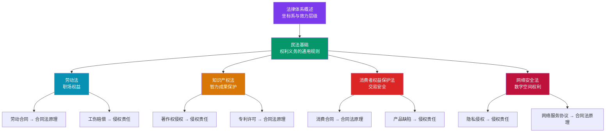

## 小结

### 知识体系全景图

基础理论部分从宏观到微观，依次讲解了六大核心法律领域。这六个领域并非孤立存在，而是构成了一个层层关联的知识网络——法律体系是坐标系，民法是地基，劳动法、知识产权法、消费者权益保护法和网络安全法分别解决不同生活场景的具体问题。

这张图揭示了一个重要规律：**民法是所有私法领域的通用底层**。无论你遇到的是劳动纠纷、版权争议、消费维权还是个人信息泄露，最终都会回到民法的基本框架——合同效力怎么认定、侵权责任怎么划分、诉讼时效怎么计算。这也是为什么本节用最大篇幅讲解民法基础的原因。

### 六大领域核心要点回顾

#### 一、法律体系概述：建立法律坐标系

中国法律体系按照效力等级形成金字塔结构，从上到下依次为：宪法→法律→行政法规→地方性法规→部门规章。这个层级体系的实用价值在于三个关键判断：

| 判断场景 | 核心规则 | 实例 |
|---------|---------|------|
| 法律冲突 | 上位法优先于下位法 | 某地方规定与国务院行政法规冲突，以行政法规为准 |
| 新旧法律 | 新法优先于旧法 | 《民法典》（2021年）生效后，之前分散的合同法、物权法等同时废止 |
| 一般与特别 | 特别法优先于一般法 | 劳动合同纠纷优先适用《劳动合同法》，而非《民法典》合同编 |

**关键认知**：法律渊源不是学术概念，而是实用工具。当你遇到一个法律问题，第一反应应该是"这个问题属于哪个法律部门"，而不是直接百度搜索具体条文。前者帮你建立正确的法律思维，后者容易导致断章取义。

#### 二、民法基础：六根支柱撑起整个私法大厦

民法基础是本节的核心内容，涵盖六个子领域，每个子领域解决一类根本问题：

| 子领域 | 解决的核心问题 | 最关键的知识点 | 日常应用场景 |
|-------|-------------|-------------|-----------|
| 民事主体 | 谁能参与法律行为 | 完全民事行为能力（18周岁以上、精神正常）；限制民事行为能力（8-18周岁） | 未成年人签的合同效力待定 |
| 物权 | 财产归谁、怎么变动 | 不动产看登记，动产看交付；善意取得四要件 | 买房必须过户登记 |
| 合同 | 交易怎么成立、怎么履行 | 要约与承诺；合同效力四要件；格式条款无效情形 | 识别合同中的"坑" |
| 侵权 | 损害谁来赔、怎么赔 | 过错责任为主，无过错责任为法定；举证责任分配 | 产品缺陷致损的索赔 |
| 诉讼时效 | 权利保护的期限 | 普通时效3年；最长保护期20年；中断重新起算 | 定期催款保留证据 |
| 代理 | 谁能替你做法律行为 | 委托代理需书面授权；表见代理的风险 | 授权范围要明确 |

**民法中的三个"关键时刻"**：

1. **合同签订时**：检查四个要件——行为人有没有行为能力、意思表示是否真实、是否违反强制性规定、是否违背公序良俗。任何一个要件缺失，合同就可能被认定无效或可撤销。

2. **权利被侵害时**：立即做两件事——固定证据（拍照、录音、保存聊天记录）和启动时效管理（书面催告、保留送达记录）。诉讼时效是你权利的"保质期"，过了就失效。

3. **财产变动时**：区分动产和不动产的规则完全不同。不动产靠登记（房产证），动产靠交付（拿到手）。买车要过户，买房更要过户，仅签合同不产生物权变动效力。

#### 三、劳动法基础：职场权益的法律底线

劳动法是保护劳动者权益的核心法律武器。掌握劳动法基础，能帮你避免在职场中被"合法压榨"。

**劳动关系的全生命周期管理**：

| 阶段 | 核心规则 | 关键数字 | 常见陷阱 |
|------|---------|---------|---------|
| 入职 | 用工之日起1个月内签书面劳动合同 | 超过1个月不满1年未签，支付双倍工资 | "先试用再签合同"违法 |
| 试用期 | 合同期限决定试用期上限 | 1年合同→最多1个月；3年→最多6个月 | 重复约定试用期违法 |
| 工资 | 不低于当地最低工资标准 | 加班费：工作日150%、休息日200%、法定假日300% | "包薪制"不能规避加班费 |
| 社保 | 用人单位必须为劳动者缴纳五险一金 | 养老保险单位缴16%、个人缴8% | "自愿放弃社保"协议无效 |
| 离职 | 劳动者提前30天书面通知可解除 | 经济补偿金：每工作1年支付1个月工资 | 主动辞职一般无经济补偿 |

**核心原则**：劳动法对劳动者的保护是强制性的，用人单位不能通过合同约定排除劳动者的法定权利。任何"自愿放弃社保""同意无偿加班"之类的条款，均因违反法律强制性规定而无效。

#### 四、知识产权法：保护你的智力成果

在数字经济时代，知识产权与每个人息息相关。你发的朋友圈照片、写的工作报告、设计的logo、甚至是你的网名，都可能涉及知识产权。

**三种知识产权的对比**：

| 对比维度 | 著作权 | 专利权 | 商标权 |
|---------|-------|-------|-------|
| 保护对象 | 文学、艺术、科学作品 | 发明创造（技术方案） | 商业标识（品牌名称、logo等） |
| 取得方式 | 自动取得（创作完成即享有） | 申请注册（需审查批准） | 申请注册（先申请原则） |
| 保护期限 | 作者终身+死后50年 | 发明20年，实用新型/外观设计10年（均自申请日起算） | 10年（自核准注册日起算），可续展 |
| 核心权利 | 复制权、发行权、信息网络传播权等 | 独占实施权 | 独占使用权、禁止他人使用 |
| 日常关联 | 你拍的照片被商家盗用 | 你发明的新技术方案 | 你设计的品牌logo |

**最容易被忽视的权利**：著作权中的署名权和保护作品完整权是永久性的，不受保护期限限制。这意味着即使作品已过保护期（进入公有领域），你仍然有权要求注明作者身份和禁止歪曲作品。

#### 五、消费者权益保护：交易中的法律盾牌

消费者权益保护法赋予消费者九项基本权利，其中最常用、最有力的是三项：

1. **知情权**：商家必须如实告知商品或服务的真实信息，虚假宣传构成欺诈。
2. **公平交易权**：拒绝强制搭售、拒绝"最低消费"、拒绝不合理的格式条款。
3. **求偿权**：商品缺陷导致人身或财产损害的，消费者有权要求赔偿。

**最有力的维权武器——惩罚性赔偿**：

| 情形 | 赔偿标准 | 最低保障 | 法律依据 |
|------|---------|---------|---------|
| 一般欺诈（如虚假宣传、以次充好） | 退一赔三 | 500元 | 《消费者权益保护法》第55条 |
| 食品药品安全问题 | 退一赔十 | 1,000元 | 《食品安全法》第148条 |
| 明知缺陷仍销售造成死亡或健康严重损害 | 2倍以下惩罚性赔偿 | 无最低限制 | 《消费者权益保护法》第55条第2款 |

**维权路径选择**：协商（最快但成功率最低）→ 12315投诉（成功率高、免费）→ 消协调解 → 向市场监管部门举报 → 仲裁或诉讼（最后手段）。实务中，12315投诉是最高效的维权方式，监管部门介入后商家通常会主动和解。

#### 六、网络安全法：数字空间的权利边界

网络安全法是与数字生活关系最密切的法律，但也是最容易被忽视的领域。

**两个核心制度**：

1. **网络安全等级保护制度**：网络运营者必须按照等级保护要求履行安全义务，包括制定安全管理制度、采取技术防护措施、留存网络日志不少于六个月等。违反者可被处以一万元以上十万元以下罚款。

2. **个人信息保护制度**：收集个人信息必须遵循合法、正当、必要的原则，经被收集者同意，且不得收集与服务无关的信息。违反个人信息保护规定情节严重的，可处五十万元以上一百万元以下罚款。

**公民的双重身份**：在网络安全法下，你既是受保护的权利主体（你的个人信息受法律保护），也是承担义务的主体（不得利用网络从事违法活动、发现安全漏洞应及时报告）。

### 跨领域的核心法律思维

掌握了六个领域的具体知识后，更重要的是提炼出贯穿所有法律领域的底层思维模式：

#### 思维一：权利意识——"我有什么权利"

遇到任何法律问题，第一反应应该是"我在这个场景下享有什么法定权利"，而不是"我应该怎么办"。权利意识是法律素养的基础。比如：

- 签合同时，你有权要求对方充分告知合同条款的含义（知情权）
- 工作中，你有权拒绝违法的加班要求（劳动权）
- 消费时，你有权要求商家提供发票（消费者权利）
- 上网时，你有权要求APP说明收集个人信息的目的（个人信息权）

#### 思维二：证据意识——"怎么证明"

法律世界遵循"谁主张谁举证"的基本原则（部分特殊侵权案件除外）。你认为自己有权利，就必须能证明权利被侵害了。日常生活中最容易忽视的证据保全工作包括：

| 场景 | 应保全的证据 | 保全方式 |
|------|-----------|---------|
| 借款给朋友 | 借条、转账记录、聊天记录 | 微信截图+银行流水+纸质借条 |
| 网购纠纷 | 商品照片、订单截图、聊天记录 | 截图+录屏+保留快递包装 |
| 劳动纠纷 | 劳动合同、工资条、考勤记录、工作邮件 | 拍照+备份+导出 |
| 交通事故 | 现场照片、行车记录仪、报警记录 | 立即拍照+报警+就医保留病历 |
| 消费欺诈 | 购买凭证、商品实物、宣传材料 | 保留发票+拍照+录像 |

#### 思维三：时效意识——"还有多久"

诉讼时效是权利的"保质期"。超过时效，你的权利并没有消灭，但法院不再强制保护——对方如果主张时效抗辩，你就丧失了胜诉权。

关键时效节点：

- **普通诉讼时效**：3年（适用于绝大多数民事纠纷）
- **最长保护期**：20年（从权利被侵害之日起算，不论是否知道）
- **劳动仲裁时效**：1年（从知道或应当知道权利被侵害之日起算）
- **消费者投诉**：无时效限制，但越早投诉效果越好

**时效管理的实操方法**：在诉讼时效期间内，每催一次款、每发一次书面通知，时效就重新起算3年。建议养成定期催告的习惯——不是不信任对方，而是保护自己的法律底线。

#### 思维四：救济意识——"找谁解决"

不同的法律纠纷有不同的最优解决路径。选错路径不仅浪费时间和金钱，还可能错过最佳维权时机。

| 纠纷类型 | 最优路径 | 原因 |
|---------|---------|------|
| 劳动纠纷 | 劳动仲裁→法院诉讼 | 劳动仲裁是前置程序，免费且一裁终局 |
| 消费纠纷 | 12315投诉→消协调解 | 行政介入效率高，不收费 |
| 合同纠纷 | 协商→调解→仲裁或诉讼 | 看合同是否有仲裁条款 |
| 侵权纠纷 | 协商→诉讼 | 侵权责任需要法院认定 |
| 邻里纠纷 | 人民调解→诉讼 | 调解不伤和气，成功率高 |
| 网络侵权 | 平台投诉→行政举报→诉讼 | 平台有义务处理侵权投诉 |

### 从理论到实践的桥梁

基础理论部分为你建立了法律知识的框架，但仅有理论远远不够。法律的生命在于实践——知道"合同效力四要件"不等于能在签合同时看出问题，知道"惩罚性赔偿"不等于能在消费纠纷中成功维权。

下一节"具体方案"将围绕本节的理论基础，提供可直接落地的实操指南：

1. **劳动权益保护实操方案**：从入职到离职的全流程自我保护清单
2. **合同签订注意事项**：逐条审查合同的标准化方法和常见"坑"
3. **知识产权保护实操**：如何保护自己的作品、如何避免侵犯他人权利
4. **维权方法**：不同类型纠纷的维权步骤、证据清单、文书模板
5. **法律风险防范**：日常生活中的法律风险识别与预防策略

理论是地图，实操是路线。有了地图才能选对路线，有了路线才能到达目的地。
