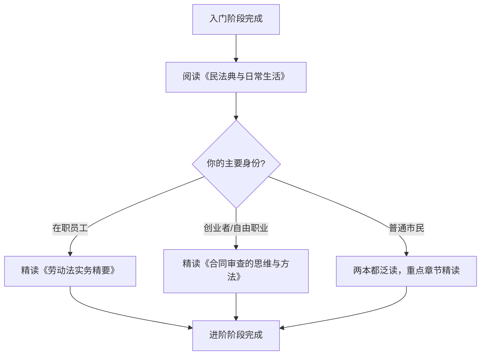
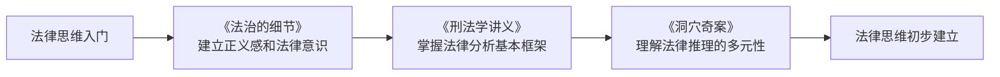

## 一、推荐书籍

法律书籍浩如烟海，选对书比多读书更重要。本节按照**从入门到精通**的学习路径，精选每个阶段最值得投入时间的书籍，并给出具体的阅读方法和学习建议。选书遵循三个原则：**权威性**（作者或出版社在法律界有公认地位）、**实用性**（内容能直接指导日常生活决策）、**可读性**（非法律专业读者也能读懂）。

### 1.1 入门级读物：建立法律直觉

入门阶段的核心目标不是背法条，而是建立"法律意识"——遇到问题时能意识到"这可能涉及法律"，并知道去哪里找答案。

#### 《法律常识全知道》

- **作者**：法宝网
- **出版社**：中国法制出版社
- **字数**：约40万字
- **适合人群**：法律零基础的普通读者
- **内容特色**：以问答形式组织，全书收录300余个常见法律问题，覆盖婚姻家庭、劳动就业、消费维权、房产纠纷、交通事故、民间借贷等日常生活场景。每个问题都配有真实案例和法条依据，读完相当于做了一次全面的法律体检。
- **阅读建议**：不必从头读到尾。先浏览目录，挑出与自己当前生活阶段相关的章节精读。建议重点阅读：劳动合同签订与解除、租房合同注意事项、民间借贷风险、交通事故处理流程这四个章节，它们覆盖了普通人80%的法律需求。
- **局限性**：由于覆盖面广，单个话题深度有限。遇到具体问题时需要配合更专业的书籍或咨询律师。

#### 《一看就懂的法律常识》

- **作者**：李启来
- **出版社**：中国法制出版社
- **字数**：约25万字
- **适合人群**：视觉型学习者、阅读耐心有限的读者
- **内容特色**：大量使用漫画图解和流程图来讲解法律概念，将抽象的法律条文转化为直观的视觉信息。比如用"合同签订流程图"展示要约→承诺→成立→生效的全过程，用"婚姻财产分割示意图"区分共同财产和个人财产。
- **阅读建议**：适合在通勤、碎片时间阅读。建议配合思维导图工具，将每章的核心概念整理成自己的知识框架。漫画类书籍的优势是入门快，但要注意不要停留在"看懂了"的层面，还需要通过实际案例来巩固。
- **局限性**：图解简化了部分法律概念的复杂性，遇到实际问题时可能需要回归法条原文。

#### 《写给年轻人的法律课》

- **作者**：陈少文
- **出版社**：中国法制出版社
- **字数**：约20万字
- **适合人群**：18-35岁的年轻人，尤其是刚步入社会的职场新人
- **内容特色**：以年轻人的真实生活场景为主线，涵盖求职陷阱识别、租房合同防坑、网贷风险防范、职场性骚扰应对、社交媒体侵权边界等年轻人高频遇到的法律问题。案例鲜活，语言贴近年轻人的表达习惯。
- **阅读建议**：建议在以下时间节点重读相关章节：第一次签劳动合同前、第一次租房前、第一次借款给朋友前、第一次网购维权时。每个时间节点对应书中的具体章节，带着问题读效果最好。
- **局限性**：聚焦年轻人场景，对中老年读者关心的遗产规划、退休权益等内容涉及较少。

#### 入门阶段阅读策略

| 阅读顺序 | 书籍 | 预计时间 | 核心收获 |
|:---:|------|:---:|------|
| 第1本 | 《一看就懂的法律常识》 | 1周 | 建立法律全景认知，消除"法律恐惧" |
| 第2本 | 《写给年轻人的法律课》 | 1周 | 了解与自己直接相关的法律风险 |
| 第3本 | 《法律常识全知道》 | 2周 | 系统查漏补缺，建立问题索引 |

**入门阶段完成后，你应该能做到**：识别日常生活中80%的法律风险点，知道遇到问题时该查哪部法律，能看懂基本的合同条款。

### 1.2 进阶级读物：掌握核心法律工具

进阶阶段的目标是从"知道有这回事"升级到"能自己处理"。这个阶段需要深入理解民法典、劳动法、合同法的核心逻辑，具备初步的法律分析能力。

#### 《民法典与日常生活》

- **作者**：彭诚信
- **出版社**：上海人民出版社
- **字数**：约35万字
- **适合人群**：有一定法律基础，希望系统了解民法典的读者
- **内容特色**：2021年《民法典》实施后最权威的民法典解读读物之一。按照民法典七编制（总则、物权、合同、人格权、婚姻家庭、继承、侵权责任）逐一讲解，每个章节都结合最新司法解释和真实判例。特别值得阅读的是"人格权编"部分，详细讲解了隐私权、个人信息保护、名誉权等与数字生活密切相关的权利。
- **阅读建议**：重点精读合同编和侵权责任编，它们与日常生活关系最密切。建议准备一本民法典原文（口袋本即可），读到关键法条时对照原文理解。每读完一编，尝试用自己的话总结该编的核心原则和关键规则。
- **延伸阅读**：配合最高人民法院发布的《民法典理解与适用》系列，可以了解法官在审判中如何具体适用民法典条文。

#### 《劳动法实务精要》

- **作者**：北京市劳动和社会保障法学会
- **出版社**：法律出版社
- **字数**：约40万字
- **适合人群**：在职员工、HR从业者、创业者
- **内容特色**：这是目前国内劳动法领域最全面的实务指南。系统讲解了劳动合同的订立、履行、变更、解除和终止全流程，工资支付与加班费计算、年休假制度、社会保险与公积金、工伤认定与赔偿、劳动争议仲裁与诉讼等核心内容。书中收录了200余个真实劳动争议案例，每个案例都附有裁判要旨和实务要点。
- **阅读建议**：建议按照以下顺序精读：①劳动合同签订与试用期（第一章），②工资与加班费（第三章），③劳动合同解除与经济补偿（第五章），④工伤认定与赔偿（第七章）。这四章覆盖了劳动争议的80%。建议边读边对照自己的劳动合同，检查是否存在不合理条款。
- **实用价值**：读完这本书，面对常见的劳动纠纷（被辞退、拖欠工资、不缴社保、强迫加班），你能清楚知道自己的权利边界、维权途径和预期结果。

#### 《合同审查的思维与方法》

- **作者**：张海燕
- **出版社**：法律出版社
- **字数**：约30万字
- **适合人群**：需要经常签订合同的职场人士、创业者、自由职业者
- **内容特色**：从合同审查的基本原则出发，系统讲解了合同主体审查、条款合法性审查、权利义务平衡审查、违约责任审查、争议解决条款审查等核心环节。书中提供了十余种常见合同（买卖合同、租赁合同、劳动合同、服务合同、借款合同等）的审查清单和风险点提示。
- **阅读建议**：先读前三章掌握合同审查的基本框架，然后根据自己最常接触的合同类型选择性精读。建议将书中的审查清单打印出来，每次签合同前对照检查。对于自由职业者和创业者，重点阅读服务合同和租赁合同两章。
- **实操练习**：拿一份自己之前签过的合同，按照书中的方法重新审查一遍，往往会发现之前忽略的风险点。

#### 进阶阶段阅读策略

**进阶阶段完成后，你应该能做到**：看懂合同中的关键条款和潜在陷阱，了解劳动争议的完整处理流程，能用民法典的基本原则分析简单的民事纠纷，具备初步的"法律思维"——用权利义务框架分析问题。

### 1.3 专业级读物：构建法律知识体系

专业级读物适合以下人群：法律相关行业从业者、准备法考的考生、对法律有浓厚兴趣并愿意投入大量时间的深度学习者。

#### 《民法学》（第六版）

- **作者**：王利明
- **出版社**：中国人民大学出版社
- **字数**：约80万字
- **适合人群**：法学专业学生、法律从业者、对民法有深度兴趣的读者
- **内容特色**：中国民法领域的权威教材，系统讲解了民法的基本原则、民事主体制度、民事法律行为、代理制度、时效制度、物权法、债权法、合同法、侵权责任法等全部民法体系。第六版根据《民法典》进行了全面修订，反映了最新的立法成果和学术观点。
- **阅读建议**：这是一本大部头，不建议通读。建议采用"问题驱动"的阅读方式——遇到具体法律问题时，查阅相关章节深入理解。重点阅读以下章节：①民事法律行为（理解合同效力的基础），②物权变动（理解房产交易的法律逻辑），③合同通则（理解合同法的核心框架），④侵权责任（理解赔偿的法律依据）。
- **学习方法**：建议配合王利明教授在中国大学MOOC上的民法课程同步学习，视频讲解配合教材阅读，理解效率更高。

#### 《知识产权法》（第六版）

- **作者**：吴汉东
- **出版社**：法律出版社
- **字数**：约50万字
- **适合人群**：创意产业从业者、科技行业从业者、自媒体创作者
- **内容特色**：全面介绍了著作权法、专利法、商标法的基本制度、最新发展和实务操作。特别值得关注的是著作权法部分，详细讲解了作品的认定标准、著作权的权利内容、合理使用的边界、网络环境下的著作权保护等与数字生活密切相关的问题。
- **阅读建议**：根据自己的职业选择重点阅读章节——自媒体创作者重点读著作权法编，科技从业者重点读专利法编，创业者重点读商标法编。建议边读边检查自己的作品、技术成果、品牌标识是否存在知识产权风险。
- **实用价值**：了解知识产权基础知识后，你能正确处理以下场景：自媒体内容被抄袭如何维权、使用他人图片是否构成侵权、商标注册的基本流程、专利申请的条件和程序。

#### 专业阶段阅读策略

专业级读物不需要全部读完，根据自身需求选择1-2本精读即可。建议的判断标准：

| 你的情况 | 推荐精读书籍 | 理由 |
|------|------|------|
| 准备法考 | 《民法学》 | 民法是法考分值最高的科目 |
| 自媒体/创作者 | 《知识产权法》 | 著作权是创作行业的核心法律问题 |
| 创业者 | 《民法学》+《知识产权法》 | 合同+商标+专利构成创业法律基础 |
| 普通职场人 | 都不需要精读 | 进阶阶段的书籍已经足够 |

### 1.4 法律思维培养类：从"知法"到"懂法"

法律思维是一种分析问题的框架，它强调**权利义务思维**（任何关系都可以用权利义务来分析）、**程序正义思维**（过程合法比结果合理更重要）、**证据思维**（主张权利需要证据支撑）。以下书籍帮助你从"知道法律规定"升级到"像法律人一样思考"。

#### 《法治的细节》

- **作者**：罗翔
- **出版社**：云南人民出版社
- **字数**：约20万字
- **适合人群**：所有对法律有兴趣的读者
- **内容特色**：中国政法大学教授罗翔的法律随笔集，通过热点案件（如于欢案、江歌案、货拉拉跳车案等）和经典案例，引导读者思考法律背后的公平与正义。书中不仅讲解法律知识，更探讨法律与道德的关系、法律的局限性、司法公正的实现路径等深层问题。
- **阅读建议**：这本书适合慢读，每篇文章读完后花5-10分钟思考：如果我是当事人，我会怎么做？如果我是法官，我会怎么判？这种代入式阅读能有效培养法律思维。
- **核心收获**：理解法律不是万能的，但法律是维护社会秩序的底线。学会区分"道德评判"和"法律判断"——一件事在道德上可以被谴责，但在法律上可能无法追究。

#### 《刑法学讲义》

- **作者**：罗翔
- **出版社**：云南人民出版社
- **字数**：约25万字
- **适合人群**：对刑法有兴趣的读者、想了解犯罪边界的普通公民
- **内容特色**：虽然是刑法领域的入门读物，但其价值远超刑法本身。罗翔教授用大量真实案例和思想实验，讲解了犯罪构成要件、正当防卫、紧急避险、共同犯罪、刑罚制度等核心概念。这些概念背后蕴含的"比例原则""罪刑法定""无罪推定"等法律原则，是整个法律体系的基石。
- **阅读建议**：重点理解三个核心概念——①犯罪构成四要件（主体、客体、主观方面、客观方面），这是分析一切法律问题的基本框架；②正当防卫的条件和限度，这是每个公民都应该了解的自我保护知识；③罪刑法定原则，理解"法无明文规定不为罪"的深层含义。
- **延伸价值**：读完这本书后，面对社会热点事件中的刑事案件，你能看懂法律分析的逻辑，不会被情绪化的舆论带偏。

#### 《洞穴奇案》

- **作者**：萨伯（Peter Suber）
- **出版社**：生活·读书·新知三联书店
- **字数**：约12万字
- **适合人群**：对法律哲学有兴趣的深度读者
- **内容特色**：这本书围绕一个虚构案件——四名探险者被困洞穴，在极端情况下杀死并食用了其中一人以求生存——展示了十四位法官截然不同的法律推理。自然法学派认为应考虑人性和道德，法律实证主义认为应严格适用法条，法律现实主义关注判决的社会效果，法经济学派用成本收益分析来判断。
- **阅读建议**：这本书不厚，但信息密度极高。建议每读完一位法官的意见，暂停并写下自己的立场和理由，然后继续阅读下一位法官的意见，看自己的想法是否会被动摇。这种"思维对练"是培养法律思维最有效的方法。
- **核心收获**：理解法律问题往往没有唯一正确答案，不同的法律哲学会导致截然不同的判决。这种认知能让你在面对争议时保持开放和理性。

#### 法律思维培养阅读策略

### 1.5 专题领域推荐：按需选读

除了上述按学习路径推荐的书籍外，以下按专题领域推荐各领域最值得阅读的书籍。**不要试图全部阅读**，根据自己的实际需求选择1-2本即可。

#### 房产与不动产

**《房产纠纷法律实务》**
- **作者**：王忠
- **出版社**：法律出版社
- **适用场景**：买房、卖房、租房、房产继承、物业纠纷
- **核心内容**：系统讲解商品房买卖、二手房交易、房屋租赁、物业管理、房产继承等全流程法律问题，每个环节都附有风险提示和防范建议。特别推荐"商品房买卖合同审查"章节，详细列出了20余个需要重点关注的合同条款。

#### 婚姻与家庭

**《婚姻家庭法实务》**
- **作者**：最高人民法院民事审判第一庭
- **出版社**：人民法院出版社
- **适用场景**：结婚、离婚、财产分割、子女抚养、遗产继承
- **核心内容**：基于最高法院的司法解释和指导案例，系统讲解婚姻家庭领域的法律实务。重点推荐以下章节：①婚前财产协议的签订，②离婚时房产分割的计算方法，③子女抚养权的判定标准，④遗产继承的顺序和份额。

#### 网络与数字经济

**《数字经济法律实务》**
- **作者**：刘权
- **出版社**：法律出版社
- **适用场景**：网购纠纷、个人信息保护、网络侵权、数字资产、平台经济
- **核心内容**：围绕数字经济中的新型法律问题，讲解个人信息保护法、数据安全法、电子商务法的核心制度，以及网购纠纷、网络诽谤、直播带货责任、虚拟财产保护等热点问题的法律处理方式。

#### 投资与理财

**《金融消费者权益保护》**
- **作者**：中国银行保险监督管理委员会
- **出版社**：中国金融出版社
- **适用场景**：银行理财、基金投资、保险购买、P2P维权、非法集资识别
- **核心内容**：从金融消费者的角度，讲解理财产品的风险等级、信息披露要求、投资者适当性管理、金融纠纷的投诉和诉讼途径。特别推荐"非法集资识别"章节，帮助读者识别高收益理财骗局的常见套路。

### 1.6 电子资源与免费获取途径

除了纸质书籍，以下电子资源可以帮助你更高效地学习法律知识：

#### 免费法律数据库

| 平台名称 | 网址 | 核心功能 | 推荐理由 |
|------|------|------|------|
| 北大法宝 | pkulaw.com | 法律法规检索、案例检索、法学期刊 | 国内最权威的法律数据库，高校学生可免费使用校园版 |
| 中国裁判文书网 | wenshu.court.gov.cn | 裁判文书公开查询 | 查询真实判决，了解法律在实践中的具体适用 |
| 国家法律法规数据库 | flk.npc.gov.cn | 官方法律法规全文 | 查阅法律法规原文的官方渠道，数据最准确 |
| 中国法院网 | chinacourt.org | 法律资讯、司法解释 | 及时了解最新的司法解释和典型案例 |

#### 法律类公众号推荐

- **罗翔说刑法**：以案说法，通俗易懂，适合培养法律思维
- **法律读库**：法律实务文章精选，覆盖各法律领域
- **劳动法库**：专注劳动法领域，案例分析深入透彻
- **法律先生**：法律科普，语言风趣，适合法律入门
- **知识产权那点事**：知识产权领域资讯和案例分析

#### 有声资源

- **得到APP《民法典200讲》**：杨立新教授主讲，系统解读民法典，适合通勤时听
- **喜马拉雅《罗翔讲刑法》**：罗翔教授的刑法课程录音，比书籍更生动
- **知乎Live法律系列**：各领域律师的专题讲座，针对性强

### 1.7 如何高效阅读法律书籍

法律书籍与一般书籍不同，有其独特的阅读方法。以下是经过验证的高效阅读策略：

#### SQ3R阅读法的法律化改良

**Survey（浏览）**：拿到一本书后，先花15分钟浏览目录、前言和每章小结，建立全书的知识框架。用思维导图画出各章之间的逻辑关系。

**Question（提问）**：对每个章节，先问自己"我在这个领域遇到过什么问题？"或"我想解决什么具体问题？"带着问题读，效率提升3倍以上。

**Read（精读）**：精读时重点关注三种内容：①法律条文引用（理解法条原文），②案例分析（理解法条的实际适用），③实务要点（理解操作层面的注意事项）。

**Recite（复述）**：读完一个章节后，合上书用自己的话复述核心内容。如果某个部分说不清楚，说明没有真正理解，需要重读。

**Review（复习）**：读完一本书后一周内，重新翻阅标记的重点内容和笔记。法律知识需要反复强化才能形成长期记忆。

#### 建立个人法律知识库

建议用以下结构建立自己的法律知识库：

法律知识库/
├── 劳动法/
│   ├── 核心条文.md          # 最常用的法条原文
│   ├── 常见问题.md          # Q&A格式的知识点
│   └── 案例积累.md          # 真实案例及裁判要旨
├── 合同法/
│   ├── 核心条文.md
│   ├── 审查清单.md          # 合同审查的检查要点
│   └── 案例积累.md
├── 消费者权益/
├── 婚姻家庭/
├── 房产相关/
└── 维权指南/
    ├── 劳动仲裁流程.md
    ├── 消费投诉流程.md
    └── 诉讼基本流程.md

每读完一本书或处理完一个法律问题，将关键信息整理到对应的文件中。这个知识库会成为你终身受用的法律参考手册。

#### 阅读中常见的三个误区

**误区一：只读不练**。读完一本劳动法的书，却没有对照自己的劳动合同检查一遍。法律知识必须通过实践来巩固。

**误区二：追求全面覆盖**。试图读完所有推荐书籍，结果每本都浅尝辄止。正确做法是根据自己的生活阶段和需求，选择最相关的2-3本精读。

**误区三：只看结论不看推理**。法律书籍中的结论（如"经济补偿金按N+1计算"）会随法律修订而变化，但推理方法（如何查找和适用法条）是不变的。学会"渔"比得到"鱼"更重要。
