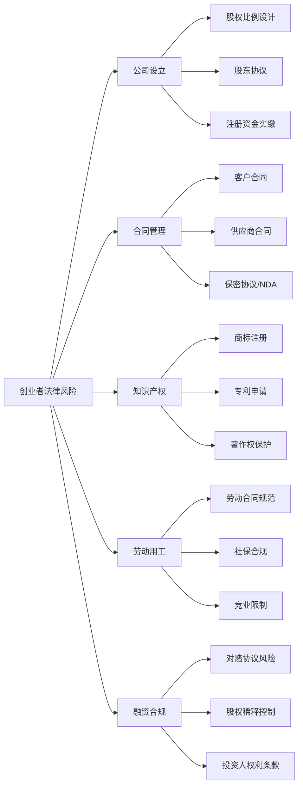
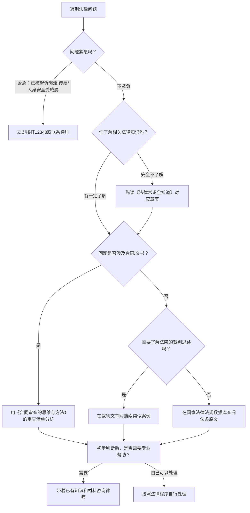

## 选择建议

前面四节推荐了大量法律学习资源——书籍、平台、音视频、工具模板。资源多是好事，但如果不知道从哪里下手，反而会陷入"选择焦虑"：买了一堆书没翻开，收藏了一堆视频没看完，注册了一堆平台没用过。本节的核心目标只有一个：**帮你用最少的时间，找到最适合自己的资源组合，建立可执行的学习路径**。

选择资源不是"越多越好"，而是"越准越好"。一份精准匹配你当前需求的资源清单，价值远超一份面面俱到但无从下手的百科全书式推荐。

### 5.1 按身份定位：找到你的起点

不同身份的人面对的法律问题截然不同，学习重点也应有所区分。以下根据最常见的六种身份给出定制化的资源组合建议。

#### 职场新人（工作0-3年）

**你的核心法律需求**：劳动合同签订与解除、试用期权益、加班费与年假、社保公积金、租房合同。

**为什么这个阶段最容易踩坑**：根据中国裁判文书网的公开数据，劳动争议案件中，工作年限在3年以内的劳动者败诉率比工作5年以上的高出约23%。主要原因不是法律不保护新人，而是新人不知道自己有哪些权利，更不知道如何留存证据。

**推荐资源组合**：

| 资源类型 | 具体推荐 | 用途 | 优先级 |
|---------|---------|------|-------|
| 书籍 | 《写给年轻人的法律课》 | 建立劳动权益意识，了解求职陷阱 | ⭐⭐⭐⭐⭐ |
| 书籍 | 《劳动法实务精要》精读前三章 | 掌握劳动合同签订和试用期的核心规则 | ⭐⭐⭐⭐ |
| 平台 | 12348中国法网 | 遇到问题时免费咨询 | ⭐⭐⭐⭐⭐ |
| 平台 | 国家企业信用信息公示系统 | 入职前核实公司信息 | ⭐⭐⭐⭐ |
| 视频 | B站"劳动仲裁实操"系列 | 了解维权全流程 | ⭐⭐⭐ |
| 工具 | 经济补偿金计算器、社保公积金计算器 | 了解自己的权益数额 | ⭐⭐⭐ |

**入职前的法律检查清单**：

在签劳动合同之前，逐项对照以下要点，发现任何异常立即提出或咨询12348：

1. **合同主体**：甲方名称是否与offer letter一致？是否与实际用工单位一致？（警惕"劳务派遣"伪装成"正式员工"）
2. **试用期时长**：合同期限1年的，试用期不得超过1个月；合同期限3年的，试用期不得超过6个月。试用期工资不得低于合同约定工资的80%。
3. **工作内容与地点**：岗位描述是否具体？工作城市是否明确？模糊的"根据公司需要安排"意味着公司可以随意调岗。
4. **薪资结构**：基本工资、绩效工资、补贴分别多少？绩效工资占比过高的薪资结构意味着公司可以通过调整绩效考核来变相降薪。
5. **竞业限制**：是否约定了竞业限制？补偿标准是多少？如果公司要求签竞业限制但不支付补偿金，该条款在离职后不具有约束力。
6. **违约金条款**：除培训服务期和竞业限制外，用人单位不得约定由劳动者承担违约金。如果你的合同中出现了其他违约金条款，这是违法的。

**执行建议**：入职第一周，先读完《写给年轻人的法律课》中求职和劳动合同相关章节，然后逐条对照自己的劳动合同检查。如果发现不合理条款，不要当场翻脸——先到12348中国法网咨询，确认问题后再与HR沟通。沟通时保持"确认理解"的姿态（"我想确认一下这个条款的意思是……"），而不是对抗姿态（"你这个条款是违法的"）。

#### 在职员工（工作3年以上）

**你的核心法律需求**：被辞退时的经济补偿、竞业限制条款、调岗降薪的合法性、年假与加班费的精确计算、职场性骚扰投诉渠道。

**为什么3年是个关键节点**：工作满3年以上的员工，如果被违法辞退，经济赔偿金（注意是"赔偿金"而非"补偿金"，标准是补偿金的2倍）的金额已经相当可观。以月薪1万元、工作4年为例：合法辞退的经济补偿金为4万元（N×月工资），违法辞退的赔偿金为8万元（2N×月工资）。这笔钱值不值得你花两周时间认真学习劳动法？答案显而易见。

**推荐资源组合**：

| 资源类型 | 具体推荐 | 用途 | 优先级 |
|---------|---------|------|-------|
| 书籍 | 《劳动法实务精要》系统精读 | 全面掌握劳动法知识体系 | ⭐⭐⭐⭐⭐ |
| 平台 | 中国裁判文书网 | 查询与自己情况相似的判例 | ⭐⭐⭐⭐ |
| 播客 | 《劳动法也疯狂》《职场法律课》 | 通勤时间持续学习 | ⭐⭐⭐⭐ |
| 视频 | B站"法山叔"职场法律分析 | 跟踪最新热点案例 | ⭐⭐⭐ |

**经济补偿金速算公式**：

| 项目 | 公式 | 说明 |
|------|------|------|
| 工作年限（N） | 每满1年按1个月计算；6个月以上不满1年按1年算；不满6个月按0.5个月算 | 《劳动合同法》第47条 |
| 月工资标准 | 离职前12个月的平均工资（含奖金、补贴、加班费） | 不是基本工资，是实际到手的全部收入 |
| 经济补偿金 | N × 月工资 | 合法解除时适用 |
| 违法赔偿金 | 2 × N × 月工资 | 违法解除时适用 |

**执行建议**：花两周时间精读《劳动法实务精要》，重点读"劳动合同解除与经济补偿"和"工资与加班费"两章。读完后做一件事：**计算一下如果明天被公司辞退，按法定标准你能拿到多少经济补偿金**，做到心里有数。然后检查自己的工资条——很多公司在计算社保和公积金时按最低基数缴纳，导致你的"月工资标准"在纸面上被压低，这会直接影响经济补偿金的金额。

#### 创业者与自由职业者

**你的核心法律需求**：公司注册与股权架构、合同审查与风险控制、知识产权保护、劳动用工管理、融资法律问题。

**创业者的法律风险全景**：



**推荐资源组合**：

| 资源类型 | 具体推荐 | 用途 | 优先级 |
|---------|---------|------|-------|
| 书籍 | 《合同审查的思维与方法》 | 掌握合同审查的核心方法 | ⭐⭐⭐⭐⭐ |
| 书籍 | 《民法典与日常生活》合同编 | 理解合同法的基本框架 | ⭐⭐⭐⭐ |
| 平台 | 天眼查/企查查 | 合作方背景调查 | ⭐⭐⭐⭐⭐ |
| 播客 | 《创业法律指南》《商业法实务》 | 了解创业过程中的法律风险 | ⭐⭐⭐⭐ |
| 工具 | 法律文书模板（找法网） | 快速起草各类合同和协议 | ⭐⭐⭐ |

**执行建议**：创业者最常犯的错误是"先做事后补合同"。在正式开展业务之前，先花一周时间精读《合同审查的思维与方法》前三章，建立合同审查的基本框架。之后每一份合同都用书中的审查清单过一遍，这个习惯能帮你避免80%以上的合同风险。

**股权架构的三条红线**（必须在公司设立时就解决，事后修改成本极高）：

1. **绝对控制线（67%以上）**：持有2/3以上股权的股东可以修改公司章程、增减注册资本、合并/分立/解散公司。如果创始团队持股低于67%，就意味着重大决策需要投资人同意。
2. **相对控制线（51%以上）**：持有半数以上股权的股东可以决定公司日常经营事项。
3. **一票否决线（34%以上）**：持有1/3以上股权的股东可以否决需要2/3多数通过的事项，相当于拥有"一票否决权"。

#### 家庭主妇/主夫或全职照顾者

**你的核心法律需求**：婚姻财产保护、离婚时的财产分割与子女抚养、遗产继承、家庭暴力维权、日常消费纠纷。

**为什么这个群体特别需要法律知识**：全职照顾者在婚姻中处于信息不对称的弱势一方——通常不掌握家庭财务全貌，不了解配偶的收入和资产状况，一旦婚姻出现变故，在财产分割中极易吃亏。《民法典》第1088条明确规定了"家务劳动补偿制度"：夫妻一方因抚育子女、照料老年人、协助另一方工作等负担较多义务的，离婚时有权向另一方请求补偿。但很多人不知道这条法律的存在，更不知道如何举证。

**推荐资源组合**：

| 资源类型 | 具体推荐 | 用途 | 优先级 |
|---------|---------|------|-------|
| 书籍 | 《法律常识全知道》婚姻家庭章节 | 了解婚姻家庭领域的基本法律知识 | ⭐⭐⭐⭐⭐ |
| 书籍 | 《婚姻家庭法实务》 | 深入了解财产分割和抚养权问题 | ⭐⭐⭐⭐ |
| 平台 | 12348中国法网 + 当地法律援助中心 | 遇到问题时寻求专业帮助 | ⭐⭐⭐⭐⭐ |
| 视频 | B站"李叔凡律师"婚姻家事系列 | 通过真实案例了解法律适用 | ⭐⭐⭐⭐ |

**婚姻财产的四种常见情形及法律后果**：

| 情形 | 财产归属 | 法律依据 | 关键提醒 |
|------|---------|---------|---------|
| 一方婚前全款购房 | 属于购房方个人财产 | 《民法典》第1063条 | 加名不等于共有，需看是否有赠与协议 |
| 一方婚前首付、婚后共同还贷 | 房产归登记方，共同还贷部分及增值部分需补偿另一方 | 《民法典》婚姻家庭编司法解释 | 保留还贷记录至关重要 |
| 婚后双方共同购房 | 属于夫妻共同财产 | 《民法典》第1062条 | 无论登记在谁名下 |
| 一方父母出资购房 | 需看登记在谁名下、是否有明确赠与意思表示 | 婚姻家庭编司法解释第29条 | 最易产生争议的情形 |

**执行建议**：即使没有面临婚姻危机，也建议提前了解婚姻财产的基本法律规则——婚前财产和婚后共同财产的区分标准、房产在不同出资情况下的归属、全职照顾者在离婚时如何争取经济补偿。了解这些不是为了"防备"伴侣，而是为了在任何情况下都能保护自己和孩子的基本权益。

#### 大学生

**你的核心法律需求**：实习权益保护、兼职合同陷阱、网贷与校园贷防范、网络侵权与个人信息保护、知识产权（论文、创作）。

**大学生法律风险的三个高频场景**：

1. **实习受伤谁来赔**：在校学生实习期间受伤，不适用《工伤保险条例》（因为不存在劳动关系），但可以依据《民法典》侵权责任编要求实习单位承担赔偿责任。关键是保留实习协议和受伤时的证据（照片、就医记录、证人联系方式）。
2. **兼职被拖欠工资**：大学生兼职通常构成劳务关系而非劳动关系，不受《劳动法》保护，但仍受《民法典》合同编保护。维权路径是：先协商→向劳动监察部门投诉（部分地区接受劳务纠纷投诉）→向法院起诉（标的额小的走小额诉讼程序，一审终审）。
3. **网贷的真实年化利率**：很多校园贷产品宣称"日利率万分之五"听起来很低，但换算成年化利率是18.25%。根据最高人民法院的规定，民间借贷利率的司法保护上限为一年期LPR的4倍（2024年约为14.8%），超过此标准的利息不受法律保护。

**推荐资源组合**：

| 资源类型 | 具体推荐 | 用途 | 优先级 |
|---------|---------|------|-------|
| 书籍 | 《写给年轻人的法律课》 | 覆盖大学生最常见的法律风险 | ⭐⭐⭐⭐⭐ |
| 书籍 | 《一看就懂的法律常识》 | 建立法律全景认知 | ⭐⭐⭐⭐ |
| 视频 | 罗翔说刑法系列 | 培养法律思维，了解刑事边界 | ⭐⭐⭐⭐⭐ |
| 平台 | 中国大学MOOC法学课程 | 系统学习法律知识（免费） | ⭐⭐⭐⭐ |

**执行建议**：利用大学期间的空闲时间，通过中国大学MOOC系统学习一门法学课程（推荐"民法学"或"劳动与社会保障法"）。这种系统性的学习比碎片化的短视频更有价值，而且完全免费。

#### 老年人（60岁以上）

**你的核心法律需求**：遗产规划与遗嘱订立、房产过户与继承、防诈骗（电信诈骗、保健品骗局、投资骗局）、赡养纠纷、医疗纠纷。

**针对老年人的诈骗数据**：根据公安部公布的数据，2023年全国电信网络诈骗案件中，60岁以上受害人的平均损失金额为8.7万元，是所有年龄段中最高的。主要原因不是老年人"贪小便宜"，而是诈骗分子利用了老年人对权威的信任（冒充公检法）、对健康的焦虑（保健品骗局）、对孤独的恐惧（情感诈骗）。

**推荐资源组合**：

| 资源类型 | 具体推荐 | 用途 | 优先级 |
|---------|---------|------|-------|
| 书籍 | 《法律常识全知道》继承章节 | 了解遗嘱订立和遗产继承的基本规则 | ⭐⭐⭐⭐⭐ |
| 平台 | 12348热线（电话咨询） | 最方便的免费法律咨询渠道 | ⭐⭐⭐⭐⭐ |
| 平台 | 当地法律援助中心 | 符合条件可获得免费律师服务 | ⭐⭐⭐⭐ |
| 视频 | 央视"社会与法"频道节目 | 权威、易懂的法律案例讲解 | ⭐⭐⭐⭐ |

**三种遗嘱形式的对比**：

| 遗嘱类型 | 要求 | 优点 | 缺点 | 费用 |
|---------|------|------|------|------|
| 自书遗嘱 | 亲笔书写全文、签名、注明年月日 | 零成本、随时可写 | 容易因形式瑕疵被认定无效 | 免费 |
| 代书遗嘱 | 两个以上见证人在场，其中一人代书，注明年月日，代书人、其他见证人和遗嘱人签名 | 不会写字也能立遗嘱 | 依赖见证人的配合和诚信 | 免费 |
| 公证遗嘱 | 到公证处办理 | 法律效力最强，不易被推翻 | 需要亲自到场，费用较高 | 200-500元 |

**执行建议**：老年人最重要的两件事是"防骗"和"立遗嘱"。关于防骗，记住一个原则：**任何要求你转账、汇款、提供验证码的电话和信息，都先挂断，然后拨打12348或110核实**。关于遗嘱，建议通过12348咨询当地法律援助中心，了解自书遗嘱、公证遗嘱的规范格式，确保遗嘱合法有效。

### 5.2 按场景匹配：遇到问题该找谁

身份定位是长期学习路径的起点，但很多时候你需要的是"我现在遇到了一个具体问题，应该用什么资源"。以下按最常见的法律场景，给出即查即用的资源推荐。

#### 场景速查表

| 你的需求 | 首选资源 | 辅助资源 | 说明 |
|---------|---------|---------|------|
| 快速了解法律常识 | 《法律常识全知道》 | 12348中国法网 | 遇到不确定是否涉及法律的问题，先翻书查目录，再上12348咨询 |
| 系统学习法律知识 | 《民法典与日常生活》 | 中国大学MOOC法学课程 | 书籍建立框架，MOOC课程补充深度，两者配合效果最佳 |
| 解决具体法律问题 | 12348热线 | 当地法律援助中心 | 先电话咨询获取初步方向，复杂问题再申请法律援助 |
| 审查合同 | 《合同审查的思维与方法》 | 天眼查核实对方信息 | 用书中的审查清单逐条检查，用天眼查核实合同相对方的信用状况 |
| 了解劳动权益 | 《劳动法实务精要》 | 劳动仲裁委员会咨询 | 书籍提供知识框架，仲裁委提供程序指导 |
| 日常法律信息查询 | 国家法律法规数据库 | 中国裁判文书网 | 数据库查法条原文，裁判文书网查类似判例 |
| 培养法律思维 | 《法治的细节》 | 罗翔说刑法视频 | 书籍适合深度思考，视频适合碎片时间 |
| 租房纠纷 | 《法律常识全知道》租赁章节 | 12348 + 当地住建部门 | 小额纠纷先协商，协商不成走法律途径 |
| 网购维权 | 12315消费者投诉热线 | 平台客服 + 《消费者权益保护法》 | 先向平台投诉，平台不处理再向12315投诉 |
| 交通事故 | 12348法律咨询 | 交警事故认定 + 保险公司理赔 | 事故认定书是核心证据，务必妥善保管 |
| 网络侵权（名誉、隐私） | 《民法典与日常生活》人格权编 | 公证处证据保全 | 发现侵权第一时间截图+公证保全证据 |

#### 消费维权的三步递进法

消费纠纷是最常见的法律场景之一。以下是一个经过验证的三步递进维权法，成功率远高于直接投诉：

**第一步：平台内部投诉（1-3天）**
- 在电商平台的售后/投诉通道提交申请
- 上传订单截图、聊天记录、商品照片等证据
- 明确诉求：退款、换货、赔偿，金额要具体

**第二步：12315投诉（3-7天）**
- 拨打12315热线或登录全国12315平台（www.12315.cn）
- 需要提供：商家名称、地址、消费时间、金额、问题描述、已有证据
- 12315会在7个工作日内决定是否受理，受理后会在60日内处理完毕

**第三步：司法途径（30-90天）**
- 向经营者所在地或合同履行地的人民法院起诉
- 标的额在各省上年度就业人员年平均工资30%以下的，可适用小额诉讼程序（一审终审，审理周期通常在30天以内）
- 起诉费用：标的额不超过1万元的，诉讼费仅50元

**关键提示**：很多人在第一步就放弃了，觉得"为了几十块钱不值得折腾"。但根据消费者权益保护法第55条，经营者提供商品或服务有欺诈行为的，消费者可以要求增加赔偿——赔偿金额为消费者购买商品价款或接受服务费用的**三倍**，增加赔偿金额不足500元的按500元计算。也就是说，哪怕你买的东西只有30元，如果商家存在欺诈行为，你至少能获得500元赔偿。

#### 使用场景决策流程

面对一个具体的法律问题，你可能不确定应该用哪个资源。以下流程帮你快速判断：



#### 证据留存的通用原则

无论遇到什么法律场景，证据都是维权的基础。以下是适用所有场景的证据留存原则：

1. **及时性**：发现问题后第一时间保存证据，不要等到需要维权时才发现证据已消失（聊天记录被清理、监控录像被覆盖、网页内容被修改）。
2. **完整性**：截图要包含完整上下文，不要只截对你有利的部分。断章取义的证据在法庭上可能被对方律师质疑可信度。
3. **原始性**：尽量保留原始载体（原件、原始聊天记录），截图和复印件的证明力低于原件。
4. **公证保全**：对于可能被篡改或删除的电子证据（网页内容、社交媒体帖子），建议到公证处做证据保全公证，费用通常在300-800元，但能让证据的法律效力大幅提升。
5. **时间戳**：拍摄的照片和视频要确保设备时间准确，有条件的可以使用"可信时间戳"服务（www.tsa.cn）为电子证据加盖时间戳。

### 5.3 按预算分级：免费也能学好法律

法律学习不需要花很多钱。以下按预算从零到高，给出不同档位的资源组合方案。

#### 零预算方案（完全免费）

完全不花钱也能获得高质量的法律学习资源，关键是要知道哪些是免费的：

| 资源 | 说明 | 访问方式 |
|------|------|---------|
| 12348中国法网 | 免费法律咨询，司法部官方运营 | www.12348.gov.cn |
| 国家法律法规数据库 | 法律法规全文免费查阅 | flk.npc.gov.cn |
| 中国裁判文书网 | 真实裁判文书免费查询 | wenshu.court.gov.cn |
| 中国大学MOOC法学课程 | 顶尖高校法学课程免费旁听 | www.icourse163.org |
| B站法律UP主 | 罗翔说刑法、法山叔等免费视频 | www.bilibili.com |
| 公共图书馆 | 借阅法律书籍，零成本 | 当地图书馆 |
| 12348热线 | 电话咨询免费 | 拨打12348 |
| 法律援助中心 | 符合条件者获得免费律师服务 | 当地司法局查询地址 |

**执行建议**：零预算方案的唯一成本是时间。建议每天花30分钟，坚持3个月，就能建立远超普通人的法律知识基础。

**零预算方案的每日学习计划模板**：

| 时间段 | 活动 | 时长 | 说明 |
|-------|------|------|------|
| 通勤时间 | 听法律播客 | 20-30分钟 | 选择与自己最相关的主题 |
| 午休时间 | 读法律书籍 | 15-20分钟 | 每天读5-10页，不贪多 |
| 晚上睡前 | 浏览裁判文书网 | 10-15分钟 | 每周看2-3个案例，重点看"法院认为"部分 |
| 周末 | 系统学习MOOC课程 | 1-2小时 | 每周完成1-2个视频课程 |

#### 小额预算方案（100-500元/年）

| 支出项 | 费用 | 价值 |
|--------|------|------|
| 3-5本核心书籍 | 200-300元 | 系统学习的基础设施 |
| 小宇宙/喜马拉雅播客 | 免费-30元/月 | 碎片时间高效利用 |
| 天眼查/企查查VIP | 100-200元/年 | 企业信息深度查询 |

**执行建议**：优先把预算花在书籍上。3本核心书籍（《法律常识全知道》《写给年轻人的法律课》《民法典与日常生活》）的投入产出比最高。如果预算有限，先买第一本，其余通过公共图书馆借阅。

**省钱购书技巧**：
- **多抓鱼/孔夫子旧书网**：二手书价格通常为新书的3-5折，法律类书籍的时效性要求不像科技类那么高，上一版通常仍然可用。
- **微信读书/得到电子书会员**：月费19-25元，可以无限阅读大量法律书籍，适合阅读量大的用户。
- **公共图书馆的数字资源**：很多城市的公共图书馆提供免费的电子书和数据库访问权限，凭读者证即可使用。

#### 中等预算方案（500-2000元/年）

在小额预算的基础上增加：

| 支出项 | 费用 | 价值 |
|--------|------|------|
| 更多专业书籍 | 200-500元 | 深入特定领域 |
| 在线课程证书 | 100-300元 | 系统学习+证书背书 |
| 法律咨询（首次免费后） | 200-500元 | 专业律师针对具体问题的建议 |
| 证据保全公证 | 300-800元/次 | 关键时刻提升证据效力 |

#### 什么时候值得花钱请律师

有些情况下，自学和免费资源就够了；有些情况下，花钱请律师是必要的投资。判断标准：

**不需要请律师的情况**：
- 了解一般性法律知识（书籍和免费资源足够）
- 简单的消费纠纷（平台客服+12315即可解决）
- 小额劳动争议（劳动仲裁流程相对简单，可以自己申请）

**建议请律师的情况**：
- 涉及金额超过5万元的纠纷
- 面临刑事指控或被刑事调查
- 离婚涉及复杂的财产分割（房产、股权、公司）
- 重大合同的起草或审查（融资合同、股权协议）
- 知识产权侵权诉讼
- 不确定自己的行为是否合法（事前咨询远比事后补救便宜）

**请律师的性价比提示**：律师咨询费通常在200-500元/小时，看起来不便宜，但一次专业的法律咨询可能帮你避免数万元甚至数十万元的损失。把它看作一种"法律保险"——平时觉得没必要，出事时才知道值。

**如何选择靠谱的律师**：
1. **看专业领域**：律师和医生一样有专长，找劳动法律师处理劳动纠纷，找婚姻家事律师处理离婚案件。不要找"什么都做"的万金油律师。
2. **看执业年限**：至少5年以上执业经验，太年轻的律师可能缺乏庭审经验。
3. **看裁判文书网**：在裁判文书网上搜索该律师的名字，看看他代理过的案件类型和结果。
4. **看首次咨询态度**：好的律师在首次咨询时会认真倾听、详细提问、给出初步分析，而不是急于让你签委托合同。
5. **问清楚收费方式**：是按小时收费、按阶段收费还是风险代理（胜诉后按比例提成）？不同方式适合不同的案件类型。

### 5.4 按学习阶段：循序渐进的路径规划

法律学习是一个循序渐进的过程，不同阶段需要不同的资源。试图一步到位只会导致消化不良。

#### 阶段一：扫盲期（第1-2周）

**目标**：消除"法律恐惧"，建立基本的法律意识——遇到问题时能意识到"这可能涉及法律"。

**推荐资源**：
- 《一看就懂的法律常识》（快速翻阅，建立全景认知）
- B站罗翔说刑法（选看5-10个最感兴趣的视频）
- 12348中国法网（收藏网址，知道遇到问题去哪里）

**里程碑**：能列出10个以上"原来这也是法律问题"的生活场景。

**典型"原来这也是法律问题"的场景**：
- 邻居装修噪音扰民（相邻权纠纷）
- 朋友借钱不还（民间借贷纠纷）
- 网购收到假货（消费者权益纠纷）
- 快递丢失或损坏（运输合同纠纷）
- 被公司无故降薪（劳动合同变更纠纷）
- 路上被狗咬伤（饲养动物侵权纠纷）
- 网上被人造谣诽谤（名誉权纠纷）
- 买到烂尾楼（房屋买卖合同纠纷）
- 父母遗产分配不公（继承纠纷）
- 手机APP过度收集个人信息（个人信息保护纠纷）

#### 阶段二：入门期（第3-6周）

**目标**：了解与自己最相关的法律知识，能看懂基本的合同条款。

**推荐资源**：
- 《写给年轻人的法律课》或《法律常识全知道》（按需精读相关章节）
- 对照自己的劳动合同、租房合同逐条检查
- 关注2-3个法律类公众号，保持日常法律信息摄入

**里程碑**：能看懂自己签署过的所有合同的核心条款，知道哪些条款对自己有利、哪些有风险。

**合同阅读的五个关键位置**：
1. **违约责任条款**：双方的违约责任是否对等？如果只有你违约要赔钱，对方违约却没有任何责任，这是不公平条款。
2. **解除/终止条款**：在什么条件下可以解除合同？提前解除需要付出什么代价？
3. **争议解决条款**：是约定仲裁还是诉讼？约定的管辖法院或仲裁机构在哪里？这直接影响你将来维权的成本。
4. **免责条款**：对方是否用小字或附件塞入了大量免责条款？
5. **补充协议/附件**：很多关键条款藏在附件里，不要只看主合同。

#### 阶段三：进阶期（第2-3个月）

**目标**：具备初步的法律分析能力，能用法律框架分析简单的民事纠纷。

**推荐资源**：
- 《民法典与日常生活》精读合同编和侵权责任编
- 《劳动法实务精要》或《合同审查的思维与方法》（根据身份选择一本精读）
- 中国裁判文书网（每周查询2-3个与自己相关的案例）

**里程碑**：面对一个新的法律问题，能独立查找到相关法条，能初步判断自己的权利和义务。

**法律分析的四步法**：
1. **定性**：这个问题属于什么法律关系？（合同纠纷？侵权纠纷？劳动纠纷？）
2. **找法**：相关的法律条文是哪些？（先找《民法典》或特别法的具体条文）
3. **对比**：类似案例中法院是怎么判的？（裁判文书网搜索关键词）
4. **评估**：我的胜算有多大？维权成本（时间、金钱、精力）与预期收益是否匹配？

#### 阶段四：持续学习期（长期）

**目标**：保持法律知识的更新，逐步深化特定领域的理解。

**推荐资源**：
- 法律类播客（通勤时间，每周2-3期）
- 裁判文书网（每月查阅几个感兴趣的案例）
- 《法治的细节》或《洞穴奇案》（培养法律思维）
- 关注法律修订动态（新法实施前后的解读文章）

**里程碑**：法律思维成为日常思考的一部分——签合同时自动检查关键条款，看到社会新闻能用法律框架分析，遇到问题能冷静地评估维权成本和收益。

**保持法律知识更新的四个信号源**：
1. **全国人大官网**（www.npc.gov.cn）：法律修订的第一手信息来源。
2. **最高人民法院公报**：了解司法解释和指导性案例，这些直接影响法院的裁判尺度。
3. **关注的法律公众号**：选择2-3个高质量的法律公众号，它们会在新法出台或重要判例发布时第一时间解读。
4. **每年"两会"期间**：关注与民生相关的法律提案和立法动态，这是了解法律发展趋势的最佳窗口。

### 5.5 选择的常见误区

在选择法律学习资源时，以下误区最常出现，务必警惕。

#### 误区一：追求"最全"而非"最准"

很多人列了一长串书单，买了十几本书堆在桌上，结果一本都没读完。法律学习的核心不是"读了多少"，而是"用上了多少"。**先选1-2本与你当前需求最匹配的书，精读、实践、内化，再考虑扩展**。

**纠正方法**：采用"一本书原则"——在任何时候，你手上正在精读的法律书籍不超过1本。读完、做了笔记、实际应用过之后，再开始下一本。收藏夹里的其他书可以作为"待读"，但不要同时打开多本。

#### 误区二：只看书不动手

读完一本劳动法的书，却没有对照自己的劳动合同检查一遍。读完一本合同审查的书，却没有拿手边的合同实际审查一次。法律知识是"用进废退"的——只有通过实践，书本知识才能转化为你的能力。

**纠正方法**：每读完一个章节，立刻做一个"最小实践"。读完劳动合同章节？拿出自己的劳动合同逐条对照。读完合同审查章节？找一份手边的合同（手机合约、健身房会员协议都行）按书中的清单审查一遍。实践不需要完美，但必须发生。

#### 误区三：过度依赖AI法律工具

AI法律助手（通义法睿、法行宝等）能提供快速的初步参考，但存在三个致命缺陷：**信息可能过时**（法律修订后AI的训练数据未必及时更新）、**缺乏情境判断**（AI无法理解你的具体案情细节）、**无法承担法律责任**（AI给出错误建议造成的损失，没有人为你负责）。正确用法是：用AI快速获取初步方向，然后用法条原文和专业律师意见进行交叉验证。

**AI法律工具的最佳使用场景**：
- 快速了解某个法律概念的含义（"什么是不安抗辩权？"）
- 初步梳理问题的法律关系（"我和房东的纠纷属于什么类型的法律问题？"）
- 生成初步的文书草稿（随后必须人工修改和验证）
- 获取维权流程的概览（然后用官方网站确认具体程序和材料要求）

**AI法律工具的危险使用场景**：
- 直接采信AI给出的具体法条引用（可能已过时或不准确）
- 用AI的分析结果作为诉讼依据（法官不会采信AI意见）
- 依赖AI评估胜诉概率（AI没有能力做这种判断）

#### 误区四：忽视免费的官方资源

12348中国法网、国家法律法规数据库、中国裁判文书网、法律援助中心——这些都是国家投入大量资源建设的免费公共服务，质量远高于很多收费平台。很多人花冤枉钱买了收费平台的会员，却不知道这些免费资源完全能满足日常需求。

**官方免费资源 vs 收费平台的功能对比**：

| 功能 | 免费官方资源 | 收费平台 | 结论 |
|------|------------|---------|------|
| 法律法规查询 | 国家法律法规数据库（全、准、权威） | 各法律数据库 | 免费资源完全够用 |
| 裁判文书查询 | 中国裁判文书网 | 威科先行、北大法宝等 | 收费平台的检索功能更强，但日常使用免费资源足够 |
| 法律咨询 | 12348热线和在线平台 | 付费律师咨询 | 简单问题用免费资源，复杂问题才需要付费律师 |
| 企业信息查询 | 国家企业信用信息公示系统 | 天眼查、企查查 | 收费平台的信息整合度更高，但基础查询免费资源够用 |
| 法律学习 | 中国大学MOOC、B站免费课程 | 各付费法律课程 | 免费资源的学术质量反而更高 |

#### 误区五：收藏等于学会

收藏了一堆B站视频、保存了一堆公众号文章、下载了一堆APP——但从来没有系统地学习过。收藏只是"知道有这个资源"，离"掌握这个知识"还有十万八千里。**与其收藏100个资源，不如认真学完1个**。

**纠正方法**：每月清理一次收藏夹。如果某个收藏超过一个月还没看，直接删除——你大概率不会再看了。把收藏行为转化为学习行为：看到好文章，不是点"收藏"，而是花10分钟读完，把核心要点记到笔记里。

#### 误区六：忽视法律的地域差异

中国法律是全国统一的，但司法实践存在明显的地域差异。同一个案件，在北京和在西部某县城的判决结果可能截然不同。原因包括：各地经济发展水平不同导致赔偿标准不同、各地法院对同一法条的理解和适用存在差异、各地法律援助和司法服务的可及性不同。

**纠正方法**：在裁判文书网搜索案例时，优先搜索你所在省份或城市的案例。关注当地法院的微信公众号或官网，了解本地的司法动态和裁判倾向。

### 5.6 个人法律资源库建设

无论你选择哪些资源，最终都应该沉淀为一个属于你自己的法律资源库。这个库不是简单的收藏夹，而是经过筛选、加工、组织的个人知识体系。

#### 最小可行资源库

只需一个文件夹，包含以下文件：

我的法律资源库/
├── 常用法条.md           # 记录与自己最相关的法条原文
├── 合同检查清单.md        # 从书籍中提炼的合同审查要点
├── 维权流程图.md          # 劳动仲裁、消费投诉、诉讼的流程
├── 案例笔记.md           # 看到的有参考价值的案例
├── 律师联系方式.md        # 值得信赖的律师或法律援助渠道
├── 个人合同归档/          # 自己签过的所有合同的扫描件
│   ├── 劳动合同.pdf
│   ├── 租房合同.pdf
│   └── ...
└── 证据留存/             # 可能需要的证据备份
    ├── 工资条/
    ├── 聊天记录/
    └── ...

每次读完一本书、看完一个视频、处理完一个法律问题，花5分钟把关键信息整理到对应的文件中。这个习惯坚持半年，你就拥有了一个远超普通人的个人法律参考手册。

#### 常用法条笔记模板

以下是一个实用的法条笔记模板，建议用Markdown格式记录，方便搜索和整理：

```markdown
## 《劳动合同法》第47条 — 经济补偿金计算

### 条文原文
> 经济补偿按劳动者在本单位工作的年限，每满一年支付一个月工资的标准向
> 劳动者支付。六个月以上不满一年的，按一年计算；不满六个月的，向劳动者
> 支付半个月工资的经济补偿。

### 关键解读
- N = 工作年限（取整规则：≥6个月按1年，<6个月按0.5年）
- 月工资 = 离职前12个月的平均工资（含奖金、补贴）
- 月工资上限 = 当地社平工资的3倍（超过部分不计入）

### 与我的关系
- 我的工龄：X年X个月 → N = X
- 我的月均收入：XXXX元
- 如果被辞退，经济补偿金 = N × XXXX = XXXXX元

### 相关案例
- [案例1] XX诉XX公司劳动合同纠纷案（2023）XX民终XX号
  - 法院认定：月工资应包含年终奖
  - 裁判文书网链接：wenshu.court.gov.cn/...
```

#### 资源维护原则

- **每季度更新一次**：法律在修订，资源在更新。每季度花1小时检查常用法条是否有修订，关注的公众号和UP主是否还在更新有价值的内容。
- **删除不再需要的**：如果你已经度过了某个阶段（比如已经精通劳动法），可以把对应的基础入门资源从收藏中移除，避免信息冗余。
- **标记可信度**：在记录案例和法条时，标注信息来源和可信度等级（官方原文 > 裁判文书 > 专业律师文章 > 自媒体科普），避免将来引用时混淆信息质量。
- **定期实践检验**：每半年用一个真实的法律场景（可以是自己的，也可以是朋友的咨询）来检验自己的知识储备——如果能独立给出合理的初步分析和行动建议，说明你的法律资源库在发挥作用；如果还是"完全不知道从哪下手"，说明需要调整学习方法。

#### 从"资源库"到"法律直觉"

法律资源库的终极目标不是成为一个需要频繁查阅的参考手册，而是通过反复的学习和实践，将法律知识内化为一种"法律直觉"——在日常生活中自动运行的法律敏感度。

这种直觉表现为：
- 签合同时，眼睛自动扫向违约责任和争议解决条款
- 看到"免费""限时""最后机会"等营销话术时，自动想到消费者权益保护法的相关规定
- 听到朋友说"公司要辞退我"时，第一反应是"你的劳动合同还在吗？公司走的什么程序？"
- 在社交媒体发帖前，自动评估是否可能构成对他人名誉权的侵犯

这种直觉不是天生的，而是通过持续学习和刻意练习培养出来的。从今天开始，选择适合自己的资源组合，按照本节的路径规划执行——三个月后，你会发现自己看待世界的方式已经悄然改变。
