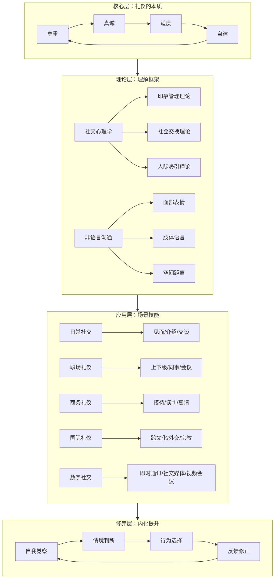
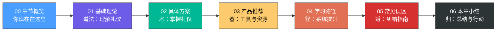
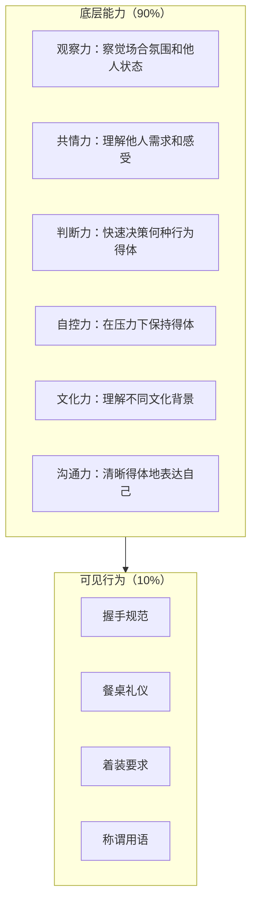

# 第二十四章：社交礼仪

## 一、开篇：一个关于礼仪的实验

2005年，加州大学洛杉矶分校的心理学家阿尔伯特·梅拉比安（Albert Mehrabian）发布了一项被引用超过万次的研究结论：在面对面沟通中，信息的传递有55%来自肢体语言，38%来自语调和语速，仅有7%来自语言内容本身。这意味着，你说"谢谢"时的眼神、姿态和语气，比这两个字本身承载了多出十几倍的信息量。

这不是一个孤立的发现。哈佛商学院2017年的一项追踪研究对MBA毕业生进行了为期10年的跟踪，发现那些在入学时"社交礼仪评估"得分最高的20%的学生，毕业后的平均收入比最低的20%高出42%。斯坦福研究中心的报告更直接：一个人赚到的钱，12.5%来自知识，87.5%来自人际关系。而人际关系的质量，很大程度上取决于礼仪素养。

社交礼仪不是"虚礼"，不是"繁文缛节"，更不是"装"。它是一种经过数千年文明演化、被现代心理学反复验证的社会技术——它的核心功能是降低人际摩擦成本、建立信任信号、提高协作效率。一个懂得社交礼仪的人，本质上是一个掌握了"低成本高效率社交"能力的人。

## 二、为什么社交礼仪是现代人的必修课

### 2.1 从进化心理学看礼仪的本质

人类是群居动物。进化心理学研究表明，在人类漫长的演化过程中，能够被群体接纳的个体拥有更高的生存概率。而"被群体接纳"的核心机制之一，就是展现出符合群体期待的行为模式——这就是礼仪的进化根源。

罗宾·邓巴（Robin Dunbar）的"社会脑假说"指出，人类大脑新皮层的大小与社交群体的规模直接相关。我们进化出了处理复杂社交信息的神经能力，而礼仪就是这些社交信息的编码系统。当你走进一个陌生的社交场合，你的大脑在几毫秒内就会启动"社交评估"程序——判断对方的地位、意图、可信度——而判断的依据，很大程度上就是对方的礼仪表现。

### 2.2 礼仪的四大核心功能

| 功能 | 机制 | 现实场景 | 影响程度 |
|------|------|----------|----------|
| **信号功能** | 通过行为传递"我是可信赖的合作者"信号 | 面试中得体的着装和握手让面试官快速建立信任 | 第一印象在7秒内形成，需要8-10次正面接触才能改变 |
| **润滑功能** | 降低社交摩擦，减少冲突概率 | 商务宴请中正确的座次安排避免了"谁坐主位"的尴尬 | 礼仪得当的团队沟通效率提升约30%（MIT人类动力学实验室数据） |
| **筛选功能** | 帮助识别对方所属的社会群体和阶层 | 通过餐桌礼仪判断一个人的教育背景和社交圈层 | 70%的高管认为礼仪素养是提拔决策的重要参考因素 |
| **保护功能** | 为社交行为提供安全边界 | 明确的社交距离规范避免了肢体接触带来的不适 | 社交焦虑症患者中，68%表示"不知道该怎么做"是最大的焦虑来源 |

### 2.3 不学礼仪的真实代价

礼仪缺失带来的后果不是抽象的"形象不好"，而是可量化的实际损失：

- **职场代价**：CareerBuilder的调查显示，41%的雇主表示不会提拔"缺乏礼仪素养"的员工。在中国，智联招聘2023年数据显示，"社交礼仪"在企业招聘软技能需求中排名第4。
- **商务代价**：国际商务中，因礼仪失误导致的合作失败案例比比皆是。英国贸易投资总署的报告指出，英国企业每年因"文化礼仪失误"损失约480亿英镑的海外订单。
- **社交代价**：人际关系中的信任一旦因失礼而受损，修复成本是建立成本的5-10倍。一项发表在《人格与社会心理学杂志》的研究表明，一个"不礼貌行为"的记忆持续时间是"礼貌行为"的3倍。
- **健康代价**：长期的社交焦虑和人际关系紧张与心血管疾病、免疫功能下降、抑郁症有显著相关性。匹兹堡大学的研究发现，社交孤立对健康的危害等同于每天吸15支烟。

## 三、社交礼仪的知识图谱

社交礼仪是一个庞大的知识体系。要系统地掌握它，首先需要建立全局视野：

这张图展示了社交礼仪的四个层次：

1. **核心层**（道）：礼仪的哲学根基——尊重、真诚、适度、自律。这是所有礼仪行为的指导原则，理解了这四点，即使遇到未知场合也能做出合理判断。
2. **理论层**（法）：解释"为什么这样行礼"的心理学和社会学原理。包括印象管理、社会交换、非语言沟通等理论框架。
3. **应用层**（术）：具体场景下的行为规范和操作指南。覆盖日常社交、职场、商务、国际交往、数字社交五大场景。
4. **修养层**（器）：将礼仪从"刻意遵守"内化为"自然流露"的持续修炼过程。

## 四、本章学习目标

完成本章学习后，你将具备以下能力：

**知识层面：**
- 准确解释社交礼仪的本质、四大核心原则及其心理学基础
- 描述礼仪从原始社会到数字时代的发展脉络
- 区分东方礼仪、西方礼仪和其他文明礼仪传统的核心差异
- 阐述印象管理、社会交换、人际吸引等关键理论在礼仪中的应用

**技能层面：**
- 在见面、介绍、交谈、用餐、商务接待、国际交往等场景中得体地运用礼仪规范
- 正确解读和运用肢体语言、面部表情、空间距离等非语言沟通要素
- 在数字社交场景（即时通讯、社交媒体、视频会议）中遵循规范
- 识别并纠正社交礼仪中的常见误区

**素养层面：**
- 建立"以尊重为核心、以真诚为灵魂"的礼仪价值观
- 具备跨文化社交的敏感性和适应能力
- 形成持续自我觉察和改进的礼仪修养习惯

## 五、章节结构与阅读地图

本章共七个部分，按照"道→法→术→用"的逻辑层层递进：

| 序号 | 部分 | 核心内容 | 阅读建议 |
|------|------|----------|----------|
| 00 | 章节概览 | 全局视野、知识图谱、学习路径 | 必读，建立框架 |
| 01 | 基础理论 | 礼仪本质、历史发展、心理学基础、非语言沟通、跨文化理论 | 重点精读，为实践打下根基 |
| 02 | 具体方案 | 日常社交、商务、餐桌、职场、国际、数字六大场景实操 | 按需查阅，场景化学习 |
| 03 | 产品推荐 | 经典书籍、优质课程、实用工具 | 按兴趣选读 |
| 04 | 学习路径 | 入门→进阶→精通的系统化学习计划 | 必读，制定个人计划 |
| 05 | 常见误区 | 十大礼仪误区的深度辨析 | 必读，避免踩坑 |
| 06 | 本章小结 | 核心要点回顾、行动计划、持续提升建议 | 必读，巩固所学 |

**三种阅读策略：**

- **通读型**（建议时间：3-4小时）：按顺序从头读到尾，适合想要系统学习的读者
- **场景型**（建议时间：按需）：直接翻到02具体方案中你需要的场景，适合有明确需求的读者
- **速查型**（建议时间：10分钟/篇）：遇到具体礼仪问题时查阅对应小节，适合临时参考

## 六、核心概念预览

在正式开始之前，理解以下五个核心概念将帮助你更快地进入学习状态：

### 6.1 礼仪的本质是"社会协作协议"

把礼仪想象成互联网的TCP/IP协议——它不是数据本身（你的想法和情感），而是确保数据能够被正确传输和理解的规则。没有协议，两台计算机无法通信；没有礼仪，两个人无法高效社交。协议的价值不在于它的形式有多复杂，而在于它降低了通信的错误率。

这意味着：学习礼仪不是背诵规则，而是理解规则背后的协作逻辑。当你理解了"为什么"，"怎么做"就成了自然而然的事。

### 6.2 礼仪是情境依赖的

不存在"放之四海而皆准"的礼仪规范。同一种行为在不同场合可能完全正确或完全错误：

| 行为 | 合适场合 | 不合适场合 |
|------|----------|------------|
| 直呼其名 | 创业公司内部、朋友聚会 | 第一次商务会面、正式晚宴 |
| 手机静音 | 剧院、会议室、教堂 | 自己家中、户外散步 |
| 主动敬酒 | 中国商务宴请 | 穆斯林商务场合 |
| 紧紧握手 | 西方商务场合 | 日本初次见面（鞠躬更合适） |

真正掌握礼仪的人，不是记住了一万条规则，而是掌握了在任何情境下快速判断"什么是得体的"核心原则。

### 6.3 礼仪的"冰山模型"

社交礼仪就像一座冰山——水面上的10%是具体的行为规范（怎么握手、怎么敬酒、怎么递名片），水面下的90%是支撑这些行为的底层能力：

只学习表面行为（水面上的10%），你会变成一个"机械执行规则"的人——在标准场合表现尚可，但遇到意外情况就手足无措。真正需要修炼的是水面下的90%——这些底层能力一旦建立，你就能在任何场合自然地做出得体的行为。

### 6.4 礼仪与真诚不矛盾

很多人抗拒学习礼仪，是因为觉得"学礼仪就是学虚伪"。这是一个根本性的误解。

打个比方：学习写作技巧不等于学会说谎，学习烹饪技法不等于制造假食物。同样，学习社交礼仪不等于学会伪装——它只是让你更好地表达你本来就有的善意和尊重。

孔子两千多年前就说过："质胜文则野，文胜质则史，文质彬彬，然后君子。"意思是：只有内在品质没有外在表达，就显得粗野；只有外在形式没有内在品质，就显得虚伪。内在的真诚与外在的礼仪完美结合，才是真正的君子。

### 6.5 礼仪是一种可以刻意练习的技能

社交礼仪不是天赋，而是技能。就像游泳、驾驶、编程一样，它可以通过系统的学习和刻意练习来掌握。

认知心理学家安德斯·艾利克森（Anders Ericsson）的"刻意练习"理论完全适用于礼仪学习：
1. **明确目标**：确定你要提升的具体礼仪领域
2. **分解任务**：将复杂的礼仪技能拆解为可练习的小单元
3. **即时反馈**：通过录像回放、朋友点评、专业教练获得反馈
4. **反复练习**：在安全环境中反复练习直到内化为习惯
5. **逐步扩展**：从简单场景逐步挑战更复杂的社交场合

## 七、学习建议

### 7.1 理论先行，实践跟进

不要跳过基础理论直接学"怎么做"。没有理论支撑的礼仪行为就像没有根基的建筑——看起来可以，但经不起考验。先理解"为什么"，"怎么做"会变得自然而然。

### 7.2 从一个场景开始突破

不要试图一次学完所有礼仪。选择你最常遇到的一个场景（比如职场社交、朋友聚会、商务宴请），先在这个场景中做到得体，再扩展到其他场景。

### 7.3 建立"社交复盘"习惯

每次重要的社交活动后，花5分钟回答三个问题：
1. 哪些行为我自己感觉得体？（继续保持）
2. 哪些时刻我感到不自在或不确定？（重点学习）
3. 如果重来一次，我会怎么做？（下次改进)

### 7.4 观察身边的"礼仪高手"

找到你身边社交能力强的人，注意观察他们在以下方面是怎么做的：
- 如何开始和结束对话
- 如何介绍两个互不认识的人
- 如何在尴尬时刻化解气氛
- 如何表达不同意见而不伤和气

### 7.5 文化敏感性

在全球化时代，你面对的社交对象可能来自完全不同的文化背景。培养文化敏感性的关键不是记住每个国家的礼仪规则（那不可能），而是掌握三个原则：
1. **提前了解**：重要场合前主动了解对方的文化背景
2. **谦逊询问**：不确定时坦诚地问"在我的文化里我们通常这样做，你们的习惯是什么？"
3. **尊重差异**：即使对方的做法与你不同，也给予理解和尊重

## 八、现在，开始你的旅程

本章将引导你从理解礼仪的本质出发，逐步掌握各类社交场合的礼仪规范，最终实现个人社交能力的全面提升。

记住：社交礼仪的终极目标不是让你成为一个"完美无缺"的人，而是让你成为一个"让人感到舒适"的人。当你能让身边的人因为你的存在而感到被尊重、被理解、被善待——你就已经掌握了社交礼仪的精髓。

让我们开始。
