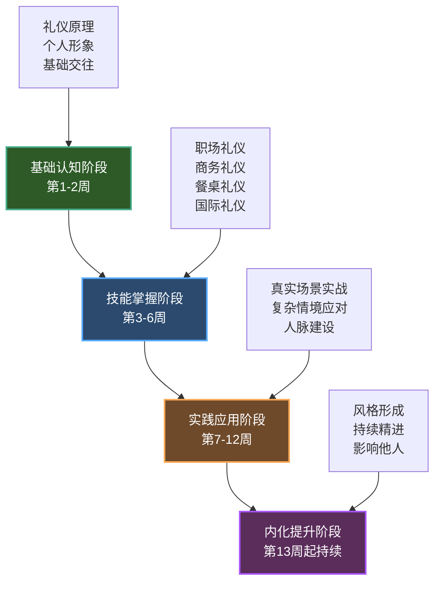
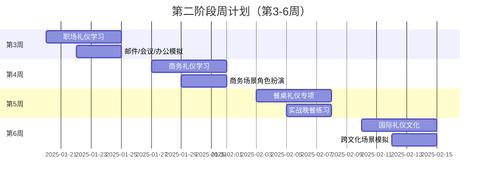
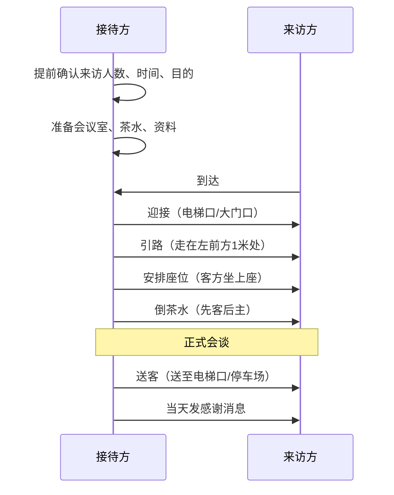
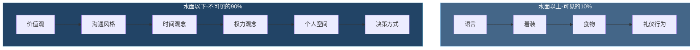
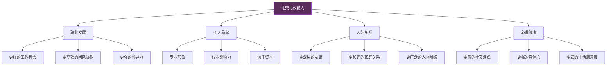

# 社交礼仪学习路径

## 一、学习路径概述

社交礼仪不是一种天赋，而是一套可以通过系统训练习得的行为模式。心理学家安德斯·埃里克森（Anders Ericsson）在"刻意练习"理论中指出：任何复杂技能的掌握都需要明确的目标、即时的反馈、专注的重复和逐步提升的难度。社交礼仪的学习完全符合这一模型。

本章提供一套经过验证的12周+持续提升学习路径，将社交礼仪从"知道"转化为"做到"，最终内化为"本能"。路径分为四个阶段，每个阶段都有明确的学习目标、具体的内容模块、可执行的实践任务和量化的评估标准。

### 1.1 学习路径全景图

### 1.2 学习目标

通过本学习路径的系统学习，你将达成以下成果：

| 能力层级 | 具体表现 | 预计达成时间 |
|---------|---------|------------|
| **认知层** | 理解礼仪背后的心理学原理和社会功能，能解释"为什么"而不只是"怎么做" | 第1-2周 |
| **技能层** | 掌握日常、职场、商务、餐桌、跨文化等核心场景的礼仪规范 | 第3-6周 |
| **应用层** | 在真实社交场合中自如运用，能根据情境灵活调整 | 第7-12周 |
| **内化层** | 礼仪成为本能反应，形成个人风格，能指导他人 | 第13周起 |

### 1.3 学习原则

**（1）刻意练习原则——不是重复，而是有针对性的突破**

盲目重复不会带来进步。每次练习都应该有明确的改进目标。例如，不是笼统地"练习握手"，而是"这次握手要控制在3秒，力度适中，配合2秒眼神接触"。练习后立即自我评估：哪里做到了？哪里需要调整？下次改进什么？

**（2）最近发展区原则——略高于当前能力的挑战**

维果茨基的"最近发展区"理论指出：最有效的学习发生在"当前能力"和"潜在能力"之间的区域。太简单的内容不会带来成长，太难的内容会导致挫败感。每个阶段的任务难度经过精心设计，确保你始终在舒适区边缘练习。

**（3）情境迁移原则——从练习室到真实世界**

在镜子前练习自我介绍和在真实社交场合做自我介绍是完全不同的体验。学习路径的设计遵循"学习→模拟→真实场景→反思"的循环，确保技能能迁移到真实环境中。

**（4）反馈驱动原则——没有反馈的练习是盲目的**

反馈来源有三种：自我观察（录像回看）、他人反馈（直接询问）、结果检验（对方的反应是否如预期）。每个实践任务都设计了具体的反馈收集方式。

**（5）个性化路径原则——根据你的起点和目标调整**

每个人的起点不同。一个内向的技术人员和一个外向的销售人员需要的学习重点完全不同。下表帮助你快速定位自己的起点：

| 你的现状 | 建议起始阶段 | 重点加强方向 |
|---------|------------|------------|
| 社交经验少，对礼仪几乎不了解 | 从第一阶段完整开始 | 基础交往技能、自信心建设 |
| 有基本社交能力，但职场/商务场景不熟悉 | 跳过第一阶段，从第二阶段开始 | 职场礼仪、商务礼仪 |
| 职场经验丰富，但跨文化交往欠缺 | 重点学习第二阶段的国际礼仪部分 | 跨文化沟通、国际商务礼仪 |
| 各方面都不错，想形成个人风格 | 直接进入第三、四阶段 | 复杂场景应对、个人品牌建设 |

***

## 二、第一阶段：基础认知阶段（第1-2周）

这一阶段的目标不是让你成为礼仪专家，而是建立正确的认知框架和基础习惯。就像盖房子要先打地基，这一阶段看似简单，却是后续所有学习的基础。

### 2.1 阶段目标

- 理解礼仪的本质——不是虚伪的客套，而是对他人的尊重和关怀
- 掌握个人形象管理的基础知识，建立得体的日常形象
- 学会最基本的社交动作：问候、握手、自我介绍
- 培养观察力——学会"看见"社交场景中的礼仪细节

### 2.2 模块一：理解礼仪的本质

#### 2.2.1 礼仪的四维定义

很多人对礼仪有误解，认为礼仪就是"装"。实际上，礼仪有四个层次，由内而外分别是：

| 层次 | 内涵 | 表现 |
|------|------|------|
| **尊重** | 承认他人的价值和尊严 | 认真倾听、不打断别人说话 |
| **真诚** | 表里如一，不虚伪 | 赞美是真心的，感谢是发自内心的 |
| **适度** | 过犹不及，恰到好处 | 热情但不让人有压迫感 |
| **自律** | 克制自我，顾及他人 | 不在公共场合大声打电话 |

**核心观点：** 礼仪的最高境界是"让人舒服"。一切形式化的规则都服务于这个目的。当你不确定某个场合该怎么做时，问自己一个问题："怎样做会让在场的人感到被尊重和舒适？"这个思考框架比任何具体规则都管用。

#### 2.2.2 礼仪的社会功能——为什么它是一种"软实力"

哈佛大学一项持续75年的"成人发展研究"（Grant Study）发现：决定人生幸福和成功的最重要因素不是智商、财富或社会地位，而是人际关系的质量。而社交礼仪正是维护和提升人际关系质量的基础工具。

从实用角度看，礼仪至少有以下功能：

- **降低社交成本：** 当双方都遵循共同的礼仪规范时，交往变得可预测、低摩擦。你不需要每次都猜测对方的期望，减少社交焦虑。
- **传递社会信号：** 得体的礼仪向他人传递"我是可信赖的、有教养的、值得交往的"这一信号。在职业场景中，这直接影响合作机会和晋升可能。
- **建立信任基础：** 心理学中的"首因效应"表明，人们在初次见面的7秒内就会形成持久印象。礼仪是这7秒中最可控的变量。
- **化解冲突缓冲：** 在矛盾和冲突中，礼仪提供了一套"安全"的沟通框架，避免冲突升级为攻击。

#### 2.2.3 阅读与学习

**必读材料：**

- **《社交礼仪大全》前3章（金正昆）**：中国礼仪教育权威金正昆教授的经典之作。前3章涵盖礼仪概述、个人礼仪和交往礼仪的基础理论。金正昆的讲解结合大量中国社会场景，比翻译著作更接地气。
- **替代选择：《你的礼仪价值百万》前2章（周思敏）**：更偏实操和案例，适合不喜欢理论阅读的读者。

**学习方法：** 不要只是"读完"，而是边读边做笔记。准备一个"礼仪笔记本"（纸质或电子均可），记录三个内容：（1）让你"原来如此"的新知识；（2）你发现自己一直在犯的错误；（3）你打算立刻改变的一个行为。

### 2.3 模块二：个人形象管理基础

#### 2.3.1 TPO着装原则——你的衣服在"说话"

TPO是三个英文单词的首字母缩写：

- **T（Time）时间：** 季节、时段、时代。冬天穿夏装会让人觉得你不靠谱，白天穿晚礼服会让人觉得你格格不入。
- **P（Place）地点：** 场合的正式程度。在律师事务所穿拖鞋，在音乐节穿三件套西装，都是地点错配。
- **O（Occasion）场合：** 事件的性质。葬礼穿红色、婚礼穿黑色（西方文化），都是场合错配。

**实操练习：** 打开你的衣柜，用TPO原则审视每件衣服。把它归类到以下场景：日常通勤、正式会议、休闲社交、运动健身、特殊场合。你会发现，很多人衣柜里80%的衣服集中在1-2个场景，另外的场景几乎没有准备。

#### 2.3.2 仪容仪表的"5-15-60"法则

人们对他人的第一印象形成遵循一个时间梯度：

- **5秒——远观轮廓：** 整体轮廓是否整洁、协调？衣服是否合身？姿态是否端正？
- **15秒——近看细节：** 发型是否整洁？面部是否干净？鞋子是否干净？配饰是否得当？
- **60秒——感知气质：** 眼神是否自信？微笑是否自然？举止是否从容？

这意味着你不需要从头到脚都是名牌，但需要在这三个层次上都过关。最低标准是：

- **轮廓层：** 衣服合身、无褶皱、无污渍、颜色协调（全身不超过3种主色）
- **细节层：** 头发整洁、指甲干净、鞋子无明显磨损、口气清新
- **气质层：** 站姿挺拔、微笑自然、目光平视（不躲闪也不咄咄逼人）

### 2.4 模块三：基础社交技能

#### 2.4.1 问候——社交的"起手式"

问候看似简单，却是所有社交互动的起点。一个得体的问候能迅速拉近距离，一个糟糕的问候可能让关系还没开始就结束。

**问候的三个要素：**

| 要素 | 正确示范 | 常见错误 |
|------|---------|---------|
| **称呼** | "王总，您好" — 知道对方身份时用尊称 | 对所有人喊"哥""姐"，过于随意 |
| **语言** | "早上好""很高兴认识您" — 简洁、正面 | "吃了吗"在正式场合不够得体 |
| **非语言** | 微笑 + 眼神接触 + 适度点头 | 低头看手机时随口说"hi" |

**不同场景的问候策略：**

- **熟人偶遇：** 微笑 + 称呼 + 简短寒暄（"李姐，好久不见，最近忙什么呢？"）
- **初次见面：** 自我介绍 + 问候（"您好，我是张明，XX公司的，很高兴认识您"）
- **正式场合：** 先向地位高的人或年长者问候，按顺序逐一问候
- **多人场合：** 先向群体打招呼再逐一握手，不要只和认识的人说话

#### 2.4.2 握手——2秒钟的信任建立

握手是商务和正式社交中最常见的身体接触。研究表明，一次得体的握手能在对方心中建立"自信、真诚、可靠"的印象。

**握手的标准流程：**

1. **起身：** 坐着时必须站起来握手，除非身体条件不允许
2. **伸手时机：** 地位高的人或年长者先伸手；平辈之间谁主动都可以
3. **手型：** 全手掌相握，虎口对虎口，不要只握指尖
4. **力度：** 中等力度，大约相当于握住一个苹果不掉的力度
5. **时间：** 2-3秒，上下摇动1-2次
6. **眼神：** 握手时看着对方的眼睛，微笑
7. **松手：** 对方松手时顺势松开，不要紧抓不放

**常见握手错误及纠正：**

| 错误类型 | 具体表现 | 为什么不好 | 纠正方法 |
|---------|---------|-----------|---------|
| 死鱼式 | 手软无力，像握一条湿毛巾 | 传递"不自信、不真诚"的信号 | 想象手中握着一个网球，保持适度张力 |
| 老虎钳式 | 用力过猛，让对方手疼 | 传递"攻击性、控制欲"的信号 | 提醒自己"握手不是掰手腕" |
| 指尖式 | 只握住对方的几个指尖 | 传递"不情愿、有距离感"的信号 | 主动向前迈半步，确保全掌相握 |
| 双手式 | 用双手包住对方的手 | 初次见面过于亲密，让人不适 | 仅在熟悉的人或表达深切感谢时使用 |
| 持久式 | 握住不放超过5秒 | 让对方感到尴尬和不自在 | 心里默数"1-2-3"后松手 |

#### 2.4.3 自我介绍——你的"个人广告"

自我介绍是社交场景中最高频使用的技能。一个好的自我介绍应该像电梯演讲（Elevator Pitch）——在极短时间内传递关键信息并引起对方兴趣。

**三个版本的自我介绍模板：**

**30秒版本（偶遇、排队、电梯等碎片场景）：**

> "你好，我是[名字]，在[公司/学校]做[职位/专业]。最近在研究/关注[一个有趣的话题]。"

核心：名字 + 身份 + 一个记忆点。让对方能在30秒内记住你是谁。

**1分钟版本（社交活动、行业聚会等）：**

> "你好，我是[名字]，目前在[公司]担任[职位]，主要负责[核心工作内容]。我在这个领域工作了[年限]年，之前在[之前的经历]。我特别关注[你的专业兴趣或独特见解]。很高兴认识你，你是做什么的？"

核心：名字 + 身份 + 经历 + 兴趣 + 反问。给出足够信息让对方找到共同话题。

**3分钟版本（面试、正式会面等）：**

> 包含完整的教育背景、职业经历、核心能力、代表项目/成就、未来方向，最后以对对方的关注或提问结尾。

核心：全面展示但不炫耀，重点突出与当前场景相关的部分。

**练习方法：**

1. 写下来：把三个版本写成文字稿，反复修改到每个字都有价值
2. 录像：用手机录下自己的自我介绍，回看时注意：语速是否适中（每分钟150-180字为宜）？表情是否自然？是否有口头禅？
3. 实战：找朋友做听众，每次练习后请他们复述"你记住了什么"，检验你的关键信息是否传达到位

### 2.5 模块四：观察力训练

#### 2.5.1 "社交显微镜"练习

从今天开始，在每次社交场合中做一个"观察者"。不是冷漠地审视别人，而是带着好奇心去发现：

- **观察谁做得好：** 那个在聚会中让每个人都感到被关注的人是怎么做到的？他的眼神、手势、说话节奏有什么特点？
- **观察谁做得不好：** 那个让全场尴尬的人做了什么？是话题选择不当、音量太大，还是忽视了某个人？
- **观察自己的反应：** 当别人对你微笑时你什么感觉？当别人打断你说话时你什么感觉？这些感觉就是"为什么要学礼仪"的最好答案。

**记录格式：** 每天记录1-2个观察，用以下格式：

> **场景：** [什么场合]
> **观察对象：** [谁]
> **行为：** [做了什么]
> **效果：** [产生了什么影响]
> **我的启发：** [我学到什么]

### 2.6 第一阶段实践任务

#### 任务1：个人形象自查与升级

**具体步骤：**

1. 拍照：穿你平时上班/上学的衣服，正面、侧面各拍一张
2. 用TPO原则评估：这套衣服适合什么场合？有没有场合不适合？
3. 找出3个可以立即改善的点（例如：熨烫衣服、擦干净鞋子、换个合适的发型）
4. 执行改善，一周后再次拍照对比

#### 任务2：每日问候挑战

**执行方案：**

- 第1-3天：每天主动向3个认识的人问候（同事、邻居、店员）
- 第4-7天：每天主动向1个不太熟的人微笑问候
- 第2周：尝试在问候后加一句简短寒暄（"今天天气不错""你这个包很好看"）

**记录要点：** 对方的反应是什么？你自己的感受是什么？有没有遇到尴尬的情况？怎么处理的？

#### 任务3：自我介绍打磨

**执行方案：**

1. 写出三个版本的自我介绍文稿
2. 对着镜子练习各5遍
3. 录视频，检查语速、表情、手势
4. 找2-3个朋友分别试讲，请他们给出反馈
5. 根据反馈修改，再练习

### 2.7 第一阶段评估标准

完成第一阶段后，用以下标准自评（每项1-5分）：

| 评估项 | 1分（未达标） | 3分（基本达标） | 5分（优秀） |
|--------|------------|---------------|------------|
| 礼仪认知 | 认为礼仪就是"装" | 理解礼仪的本质是尊重 | 能向别人解释礼仪的原理和价值 |
| 个人形象 | 不在意穿着，T恤拖鞋走天下 | 日常穿着基本得体 | 能根据场合精准搭配 |
| 问候能力 | 从不主动打招呼 | 能主动问候熟人 | 能自然地向陌生人问候 |
| 自我介绍 | 说不清自己是做什么的 | 有基本的自我介绍 | 有3个版本且表达自然流畅 |
| 观察能力 | 从不注意社交细节 | 能观察到明显的好/坏礼仪行为 | 能分析行为背后的原因和效果 |

**达标线：** 总分15分以上进入第二阶段。低于15分的项目需要额外练习一周。

### 2.8 第一阶段学习资源

| 类型 | 资源 | 用途 |
|------|------|------|
| 书籍 | 《社交礼仪大全》金正昆 | 系统理论学习 |
| 书籍 | 《你的礼仪价值百万》周思敏 | 案例补充阅读 |
| 视频 | TED: Amy Cuddy "Your body language may shape who you are" | 理解身体语言的力量 |
| 视频 | B站搜索"金正昆 礼仪"系列 | 中文讲解，场景贴合 |
| 工具 | 手机相机 | 录像自查自我介绍和姿态 |
| 工具 | 笔记本（纸质或电子） | 记录观察和反思 |

***

## 三、第二阶段：技能掌握阶段（第3-6周）

有了第一阶段的基础，现在开始系统学习各类具体场景的礼仪规范。这一阶段是"知识密度"最高的阶段，每周聚焦一个主题，深度学习 + 模拟练习。

### 3.1 阶段目标

- 系统掌握职场、商务、餐桌、跨文化四大场景的礼仪规范
- 能够在模拟场景中得体表现
- 开始形成自己的礼仪判断力——不仅知道"规则是什么"，还能判断"这个场合应该怎么做"
- 建立个人礼仪工具箱（邮件模板、名片礼仪卡、餐桌礼仪速查表等）

### 3.2 周计划安排

### 3.3 第3周：职场礼仪

#### 3.3.1 办公室日常礼仪

**物理空间礼仪：**

- **工位整洁：** 工位是你的"半公共空间"，同事经过时会看到。保持桌面整洁，私人物品控制在3件以内（一个杯子、一个相框、一个小摆件是合理的上限）。
- **噪音控制：** 接电话声音不超过正常说话音量；听音乐必须戴耳机；在开放办公区避免开扬声器开会。
- **公共区域：** 用完微波炉擦干净溅出的食物；冰箱里的食物定期清理；打印机没纸了顺手加纸。
- **气味管理：** 不在工位吃味道大的食物（螺蛳粉、榴莲、火锅外卖）；香水用量以30厘米内能闻到为上限。

**人际互动礼仪：**

- **进入他人空间：** 敲门或在工位旁轻声说"打扰一下"，确认对方方便后再开口。
- **请求帮助：** "你方便帮我看看这个吗？大概需要5分钟。"——给对方时间和预期，让对方可以说不。
- **拒绝请求：** "我手头正在赶一个deadline，明天下午可以吗？"——给出原因和替代方案，而不是直接说"不行"。
- **功劳归属：** 在汇报中主动提到"这是和小李一起完成的"，功劳不会因为分享而减少，反而会增加你的信誉。

#### 3.3.2 会议礼仪

**会议前：**

- 提前5分钟到场（线上会议提前2分钟进入）
- 提前阅读会议材料，准备好自己的意见
- 如果要迟到超过5分钟，提前通知组织者

**会议中：**

| 角色 | 职责 | 礼仪要点 |
|------|------|---------|
| 主持人 | 控制议程和时间 | 准时开始，明确每个议题的时间，确保每个人都有发言机会 |
| 发言人 | 陈述观点 | 言简意赅，控制在3分钟内；用数据和事实支撑观点 |
| 参与者 | 积极参与 | 认真倾听，不玩手机；有不同意见时说"我有一个补充视角"而不是"你错了" |
| 记录人 | 记录要点 | 记录决议和待办，会后24小时内发出会议纪要 |

**会议后：**

- 执行自己承诺的行动项
- 如有疑问，在24小时内向相关人确认
- 不在非参会人员面前议论会议内容

#### 3.3.3 电子邮件礼仪

**邮件的基本结构和规范：**

收件人（To）：需要采取行动的人
抄送（CC）：需要知晓情况的人，不需要回复
密送（BCC）：群发邮件时保护收件人隐私

主题行：[行动词] + 核心内容 + 时间节点
例如："【审批】Q2营销预算方案 - 请周五前反馈"

正文结构：
1. 称呼（正式邮件用全名+职位，内部邮件用名字即可）
2. 一句话说明邮件目的
3. 详细内容（分点列出，每点不超过3行）
4. 明确的行动请求（谁、做什么、什么时候）
5. 署名

**邮件常见错误：**

- **回复全部（Reply All）滥用：** 只有当所有人都需要知道你的回复时才用"回复全部"。一句"收到"不需要抄送20个人。
- **邮件当即时通讯：** 邮件不是微信。不要写"在吗？""看到回一下"。邮件应该一次把事情说清楚。
- **附件遗忘：** 写完邮件先检查附件再发送。一个好习惯是在写正文之前先添加附件。
- **情绪化邮件：** 如果你在生气或沮丧时写的邮件，保存为草稿，等2小时后再看。如果还想发，再发。

#### 3.3.4 电话与视频会议礼仪

**电话礼仪：**

- 拨打前确认对方是否方便接听（紧急情况除外）
- 开头自报身份："您好，我是XX公司的张明"
- 通话时间控制在5分钟内，超过的提前说"可能需要10分钟，您方便吗？"
- 结束时总结要点："那我们就确定了XX方案，我今天下午把文件发给您"

**视频会议礼仪：**

- **环境：** 背景整洁（可以用虚拟背景），光线从前方照来，避免逆光
- **静音：** 不发言时保持静音，避免键盘声、咳嗽声、宠物声打断会议
- **摄像头：** 开会时打开摄像头（除非网络不好）。关闭摄像头等于"蒙面开会"，降低信任感
- **眼神：** 看摄像头而不是屏幕上的画面，这样对方感觉你在看他
- **着装：** 上半身正式着装，不要因为只露上半身就穿睡裤——万一你需要站起来呢

### 3.4 第4周：商务礼仪

#### 3.4.1 商务接待礼仪

**接待流程的标准动作：**

**座次安排的原则：**

- **面门为上：** 面对门的位置为上座，留给客人或地位最高的人
- **以右为尊：** 主人的右手边是上座（中国传统是左手边，商务场合以国际惯例为准）
- **居中为主：** 多人时，中间位置为主位

#### 3.4.2 商务宴请礼仪

**宴请的三个阶段：**

**邀请阶段：**
- 提前3-7天发出邀请（正式宴请提前2周）
- 明确时间、地点、着装要求、参加人员
- 发出邀请后等待回复，不要追问超过两次

**用餐阶段：**
- 主人提前到达，检查场地和菜单
- 客人到达后引导入座
- 点菜时询问客人的忌口和偏好
- 敬酒时杯沿低于对方杯沿（对方地位高时）
- 不劝酒、不灌酒

**送别阶段：**
- 主人买单（提前悄悄结账，不要当着客人面算账）
- 送客人上车/打车
- 当天发消息确认对方安全到达

#### 3.4.3 商务名片礼仪

**名片递接的规范：**

| 动作 | 标准做法 | 常见错误 |
|------|---------|---------|
| 准备 | 名片放在专用名片夹中，随手可取 | 从裤兜里掏出来皱巴巴的名片 |
| 递出 | 双手递出，文字朝向对方，同时说"这是我的名片，请多指教" | 单手随意递出，文字朝向自己 |
| 接收 | 双手接过，认真看3秒，必要时读出对方姓名和职位 | 接过来直接塞进口袋 |
| 保管 | 放在名片夹或面前桌上 | 随手放在手中把玩或折叠 |
| 后续 | 当天在名片背面记录见面场景和关键信息 | 回去后想不起这个人是谁 |

#### 3.4.4 商务通讯礼仪

**微信/即时通讯：**

- 添加好友时注明身份和来由："您好，我是XX公司的张明，昨天在XX会上认识的"
- 不发语音（对方可能不方便听），除非对方先发语音
- 工作消息在工作时间发送，非紧急事务不在深夜发送
- 不要发"在吗？"，直接说事情

**短信/消息模板：**

初次联系："王总您好，我是XX公司的张明。经李总介绍，想跟您请教一下XX方面的问题。方便时能否约个时间通话？"

会议后跟进："王总您好，今天的交流收获很大。按照我们的讨论，我会在周三前把方案发给您。如有其他需要，请随时告诉我。"

感谢消息："王总您好，感谢今天百忙中的接待。XX项目我们内部会尽快推进，下周一前给您初步方案。再次感谢！"

### 3.5 第5周：餐桌礼仪

#### 3.5.1 中式餐桌礼仪

**座次安排：**

中式圆桌的座次有严格的讲究。主人坐在面对门的位置（主位），主宾坐在主人的右手边，副主宾坐在主人的左手边。其他客人按身份依次安排。如果你是客人，不要自己选座位，等主人安排。

**点菜礼仪：**

- 如果你做东，提前了解客人的口味和忌口
- 荤素搭配，一般荤菜占60%、素菜占40%
- 点菜数量比在场人数多2-3道（8人点10-11道菜）
- 询问"有没有忌口的"比问"你想吃什么"更得体

**用餐细节：**

- 等主人或长辈动筷后再开始
- 夹菜时用公筷（疫情期间这已成为共识）
- 不要在盘中翻来翻去找肉
- 咀嚼时闭嘴，不发出声音
- 骨头、鱼刺放在骨碟中，不要放在桌上

**敬酒礼仪：**

- 敬酒顺序：先主宾后其他，先长辈后同辈
- 碰杯时自己的杯沿低于对方（对方是长辈或上级时）
- 不能喝就说"我以茶代酒"，不要勉强自己也不要勉强别人
- 敬酒词简洁真诚："感谢您的指导，我敬您一杯"

#### 3.5.2 西式餐桌礼仪

**餐具使用规则——"由外而内"：**

西餐的餐具摆放遵循一个简单原则：先用最外面的餐具，依次向内。左边放叉，右边放刀和勺。甜品餐具横放在上方。

**用餐流程：**

**西餐关键细节：**

- **餐巾：** 对折放在膝盖上，不是塞在领口。用餐中需要擦手用内侧。暂时离开搭在椅背上，用餐结束放在桌上左侧。
- **面包：** 用手撕成小块吃，不要整块咬。黄油用黄油刀取，放在面包碟上再涂抹。
- **喝汤：** 汤勺由内向外舀，喝汤时用勺子的侧面送入嘴中，不要发出声音。
- **刀叉语言：** 用餐中途休息——刀叉摆成八字形放在盘上。用餐结束——刀叉并拢放在盘子右侧4点钟方向。
- **酒的顺序：** 白葡萄酒配鱼/海鲜，红葡萄酒配红肉。由侍者倒酒，不要自己倒。

#### 3.5.3 日式餐桌礼仪

如果你的工作或社交涉及日本文化，以下要点需要了解：

- 进入餐厅或日式房间可能需要脱鞋，鞋尖朝外摆放
- 坐在榻榻米上时男性盘腿坐，女性跪坐
- 用餐前说"いただきます"（我开动了），用餐后说"ごちそうさまでした"（感谢款待）
- 筷子不能竖插在饭中（这与丧葬仪式有关）
- 寿司用手或筷子都可以，但鱼肉面应蘸酱油而不是米饭面

### 3.6 第6周：国际礼仪文化

#### 3.6.1 跨文化交际的核心概念

荷兰社会心理学家吉尔特·霍夫斯泰德（Geert Hofstede）提出的"文化维度理论"是理解跨文化差异的最经典框架。以下四个维度对社交礼仪影响最大：

| 文化维度 | 高分文化特征 | 低分文化特征 | 对礼仪的影响 |
|---------|------------|------------|------------|
| **权力距离** | 中国、日本、韩国 | 北欧、美国 | 高权力距离文化更注重等级称谓和座次安排 |
| **个人主义vs集体主义** | 美国、英国 | 中国、日本 | 个人主义文化更直接表达观点，集体主义文化更注重和谐 |
| **不确定性回避** | 日本、德国 | 美国、英国 | 高回避文化礼仪规则更严格、更详细 |
| **长期导向** | 中国、日本 | 美国、英国 | 长期导向文化更重视关系建设，商务礼仪更耐心 |

#### 3.6.2 主要文化区域礼仪速查

| 文化区域 | 问候方式 | 时间观念 | 礼物文化 | 餐桌禁忌 |
|---------|---------|---------|---------|---------|
| **北美** | 握手、直呼其名 | 非常准时 | 商务场合不送贵重礼物 | 不要给小费低于15% |
| **西欧** | 握手，法国贴面礼 | 准时 | 送花注意数量（偶数不吉利） | 英国不谈论收入 |
| **日本** | 鞠躬（角度表敬意程度） | 极度准时 | 包装精美，不当面拆开 | 不要把筷子交叉放 |
| **中东** | 同性握手，异性保持距离 | 灵活，"半小时迟到"正常 | 不送酒、不送猪皮制品 | 左手不洁，用右手递物 |
| **东南亚** | 合十礼（泰国"Wai"） | 较灵活 | 不送钟（中文谐音） | 头部神圣，不要摸小孩头 |

#### 3.6.3 跨文化沟通技巧

**高语境 vs 低语境沟通：**

人类学家爱德华·霍尔（Edward Hall）提出的概念。高语境文化（中国、日本、韩国）的沟通依赖潜台词、语气、关系背景；低语境文化（美国、德国、北欧）的沟通依赖明确的语言表达。

**实际应用举例：**

- 中国客户说"我们再研究研究"——可能意味着"不太感兴趣"或者"需要时间考虑"，不要以为只是字面意思
- 美国同事说"Interesting idea"——可能真的是"有趣的想法"，也可能只是礼貌性的回应，需要追问具体意见
- 日本合作伙伴说"这有点困难"——通常意味着"不行"，但不愿直接拒绝

**应对策略：** 与高语境文化沟通时，学会"听话听音"，注意非语言信号；与低语境文化沟通时，把话说清楚，不要让对方猜。

### 3.7 第二阶段学习方法

#### 3.7.1 场景模拟练习

每周安排一次场景模拟，找一个朋友或家人扮演对手角色：

- **第3周模拟：** 你作为新员工第一天上班，如何自我介绍、如何在会议上发言、如何给上级发邮件
- **第4周模拟：** 你负责接待一个重要客户，从迎接、会议室安排、倒茶、送别全流程演练
- **第5周模拟：** 在一家西餐厅请客户吃饭，从入座、点菜、用餐到结账
- **第6周模拟：** 接待一位外国客户，注意跨文化沟通的细节

**模拟练习的反馈模板：**

我做得好的地方：_____________
我需要改进的地方：_____________
对方给了我什么反馈：_____________
下次我会这样做：_____________

#### 3.7.2 案例分析法

每周收集2-3个真实的礼仪案例（可以来自新闻、职场经历、朋友的故事），用以下框架分析：

1. **发生了什么？** （事实描述）
2. **谁做得好/不好？** （行为评判）
3. **为什么好/不好？** （原理分析）
4. **如果是我，我会怎么做？** （迁移应用）

### 3.8 第二阶段评估标准

| 评估项 | 评估方式 | 达标标准 |
|--------|---------|---------|
| 邮件撰写 | 写一封商务邮件给导师评阅 | 格式规范、目的明确、语气得体 |
| 会议发言 | 在模拟会议中发言2分钟 | 条理清晰、控制时间、尊重他人 |
| 商务接待 | 完成一次全流程模拟 | 座次正确、流程完整、细节到位 |
| 西餐用餐 | 在模拟西餐中完成完整用餐 | 餐具使用正确、无明显失误 |
| 跨文化沟通 | 解读3个跨文化场景案例 | 能识别文化差异并给出合理应对 |

**必读书目：**

- **《商务礼仪》（杰奎琳·惠特莫尔）**：国际商务礼仪的经典教材
- **《优雅的力量》**：从内到外的礼仪修养
- **《中国礼仪文化》（彭林）**：理解中国礼仪的深层文化逻辑

**在线课程：**

- **中国大学MOOC《社交礼仪》**：系统学习，有证书
- **LinkedIn Learning《Professional Networking》**：英文，适合有国际业务需求的读者

***

## 四、第三阶段：实践应用阶段（第7-12周）

前两个阶段是"学"和"练"，这一阶段是"用"。你需要把所学知识投入到真实社交场景中，在压力和不确定性中检验自己的能力。

### 4.1 阶段目标

- 在真实社交场合中自如运用礼仪，不紧张、不刻意
- 能够处理复杂和突发的社交情境
- 开始建立有价值的社交网络
- 形成初步的个人礼仪风格

### 4.2 实践内容规划

#### 4.2.1 日常社交实践（第7-8周）

**每周目标：** 参加至少1次社交活动（行业聚会、兴趣社群、朋友聚会等）

**具体练习任务：**

| 周次 | 任务 | 要点 |
|------|------|------|
| 第7周 | 主动结识3个新朋友 | 记住对方名字、职业、一个共同话题 |
| 第8周 | 维护之前认识的5个人 | 发一条有价值的消息（不是"在吗"） |

**社交破冰话题库：**

好的开场话题应该满足三个条件：（1）对方能轻松回答；（2）能引出更多信息；（3）不涉及隐私。

- **安全话题：** "你是怎么知道这个活动的？""最近在忙什么项目？""你平时有什么兴趣爱好？"
- **进阶话题：** "你对XX怎么看？""你觉得行业未来会怎样发展？""你最近读了什么好书？"
- **避免的话题：** 收入、年龄、婚姻状况、政治立场、宗教信仰（除非对方主动提起）

**倾听的艺术——比说话更重要的技能：**

卡耐基说："想成为善于交谈的人，首先要成为善于倾听的人。"有效倾听有三个层次：

1. **听内容：** 记住对方说了什么事实
2. **听情绪：** 感知对方的情绪状态（兴奋、担忧、犹豫）
3. **听需求：** 理解对方真正想表达的是什么

**倾听技巧清单：**

- 保持眼神接触（60-70%的时间看着对方）
- 用"嗯""是的""然后呢"表示你在听
- 不打断对方说完
- 适时总结："所以你的意思是……"
- 提出跟进问题："你刚才提到的XX，能再详细说说吗？"

#### 4.2.2 职场礼仪实战（第9-10周）

**实践任务：**

- **第9周：** 主动承担一个需要跨部门沟通的任务，在沟通中刻意运用礼仪技巧
- **第10周：** 观察一位你认为社交能力强的同事或领导，记录他的5个具体行为并尝试模仿

**向上管理的礼仪：**

- **汇报工作：** 先说结论，再说过程。"本周完成了XX，有3个关键进展：1...2...3..."
- **提出建议：** "我有一个想法，您看是否可行"比"我建议我们应该这样做"更得体
- **接受批评：** "您说得对，我马上改进"比"但是……"更好。先接受，有不同意见可以事后单独沟通
- **请求资源：** 说明需要什么、为什么需要、预期产出是什么

#### 4.2.3 商务场合实战（第11周）

**实践任务：**

- 参加一次正式的商务宴请（如果工作中没有机会，可以组织一次"模拟商务晚宴"）
- 参加一次行业会议或论坛，在茶歇时间主动与3位以上的人交流

**商务社交的"3×3法则"：**

每次商务社交场合，目标是建立3个有意义的连接，每个连接包含3个信息点：

- 对方是谁（姓名、公司、职位）
- 对方关心什么（业务方向、痛点、兴趣）
- 你们之间有什么连接点（共同认识的人、共同关注的领域、可以互相帮助的地方）

**后续维护：** 社交活动结束后的24小时内，给新认识的人发一条消息，提到你们交谈的具体内容。例如："李总您好，昨天在XX论坛上和您聊的数字化转型的话题很有启发。我找到了您提到的那篇报告，分享给您。"这比群发"很高兴认识你"有效100倍。

#### 4.2.4 跨文化交往实战（第12周）

**实践任务：**

- 参加一次国际交流活动或与外国同事/朋友进行一次深度交流
- 记录至少3个文化差异的亲身体验

**跨文化交往的"文化冰山模型"：**

水面以上的行为容易观察和模仿，水面以下的差异才是跨文化交往中真正导致误解的原因。例如，美国人的"直接"和日本人的"委婉"不是性格差异，而是"低语境 vs 高语境"文化维度的体现。

### 4.3 应对挑战的策略

#### 4.3.1 社交焦虑的克服

社交焦虑是这个阶段最常见的障碍。首先要认识到：适度的紧张是正常的，甚至是有益的——它让你更专注、更认真。

**渐进脱敏法（4周计划）：**

| 周次 | 挑战等级 | 具体任务 |
|------|---------|---------|
| 第7周 | ★☆☆☆☆ | 向收银员多说一句话（"今天辛苦了""这个很好吃"） |
| 第8周 | ★★☆☆☆ | 在小组讨论中主动发言一次 |
| 第9周 | ★★★☆☆ | 参加一个不太熟的聚会，主动和3个人聊天 |
| 第10周 | ★★★★☆ | 在正式场合做一次自我介绍或发言 |

**应急锦囊：** 当你在社交场合感到紧张时——

1. 深呼吸3次（4秒吸气，4秒呼气）
2. 把注意力从"别人怎么看我"转移到"我对别人有什么兴趣"
3. 准备2-3个万能话题以备冷场
4. 记住：大多数人更关注自己，没那么在意你的小失误

#### 4.3.2 礼仪失误的补救

即使是最熟练的社交高手也会犯错。关键是犯错后的处理方式。

**三步补救法：**

1. **承认：** 立即、简洁地承认错误。"抱歉，我刚才说错话了"
2. **纠正：** 做出正确的举动。"我的意思是……"
3. **继续：** 不要反复道歉，自然地继续对话。过度道歉反而让对方更尴尬

**特殊情况处理：**

- **叫错名字：** "不好意思，我记错了名字，您是XX对吧？"——立即纠正，不要假装没发生
- **打翻东西：** 立即帮助清理，不要慌张。"非常抱歉，我来处理"
- **说了不该说的话：** 如果只是小失误，轻描淡写地带过；如果确实冒犯了对方，私下道歉

#### 4.3.3 处理棘手社交情境

**情境1：有人当众让你难堪**

- 不要当场反击（这会让场面更难看）
- 保持微笑，用幽默化解："哈哈，你说得对，我确实该加强这方面"
- 如果是有意为之，私下找对方沟通

**情境2：被迫参加不想去的社交场合**

- 给自己设定一个"最低参与目标"（例如：和2个人交流，待满1小时）
- 到达后先观察，找到你最感兴趣的人或话题
- 如果实在不舒服，礼貌地提前离开："感谢邀请，我还有个安排，先走了"

**情境3：不知道该说什么的尴尬沉默**

- 准备"救场话题"：当下的环境、共同的经历、最近的新闻（非政治敏感的）
- 提问比陈述更容易破冰："你对这个活动怎么看？""你认识主办方吗？"

### 4.4 第三阶段评估标准

| 评估项 | 具体指标 |
|--------|---------|
| 社交频率 | 平均每周参加1次以上社交活动 |
| 人脉增长 | 新认识10个以上有价值的人 |
| 关系维护 | 能定期与5个以上的人保持有意义的联系 |
| 自信程度 | 在陌生场合不紧张，能主动交流 |
| 应变能力 | 遇到社交意外能冷静应对 |
| 跨文化能力 | 能识别并尊重文化差异 |

**推荐读物：**

- **《文化地图》（Erin Meyer）**：用具体案例解析8个文化维度的差异，实用性强
- **《跨文化交际》（Larry A. Samovar）**：学术性更强，适合深入研究

***

## 五、第四阶段：内化提升阶段（第13周及以后）

当礼仪从"刻意执行"变成"自然反应"，你就进入了内化阶段。这一阶段没有终点——社交能力的精进是一辈子的事。

### 5.1 阶段目标

- 礼仪成为身体记忆，不需要刻意思考就能做出得体反应
- 形成独特的个人社交风格——不是模仿别人，而是做最好版本的自己
- 能够灵活应对全新的社交场景
- 开始影响和帮助他人提升社交能力

### 5.2 从"执行者"到"创造者"

前三个阶段你是在学习和执行"规则"。到了第四阶段，你需要超越规则，学会在规则之上进行创造性应用。

**理解规则的"所以然"：**

所有礼仪规则的背后都有一个核心逻辑。当你理解了这个逻辑，就能在规则没有覆盖的新场景中自行判断。

| 规则 | 表面形式 | 深层逻辑 | 创造性应用 |
|------|---------|---------|-----------|
| 先介绍地位低的人给地位高的人 | 机械执行介绍顺序 | 尊重地位高的人，让他先知道对方是谁 | 在平等场景中，先介绍你更熟悉的一方，帮助双方建立连接 |
| 西餐刀叉由外而内 | 记住使用顺序 | 厨师按上菜顺序摆放餐具 | 面对不熟悉的餐具，观察最内侧的主餐具，判断主菜是什么 |
| 握手2-3秒 | 控制时间 | 避免让对方不适 | 对方明显热情时可以适当延长；对方冷淡时快速结束 |

### 5.3 持续精进的四个习惯

#### 5.3.1 每日反思（5分钟）

每天结束时问自己三个问题：

1. 今天的社交互动中，哪一次做得最好？为什么？
2. 有没有哪个时刻可以做得更好？具体怎么改进？
3. 明天有什么社交场景？我可以提前准备什么？

**工具推荐：** 用手机备忘录或日记本记录，不需要长篇大论，3句话即可。关键是坚持。

#### 5.3.2 每月深度复盘

每月花30分钟做一次深度复盘：

- 这个月最重要的3次社交经历是什么？
- 我学到了什么新东西？
- 我的社交圈有什么变化？
- 下个月的提升目标是什么？

#### 5.3.3 每季度学习新领域

每3个月选择一个新的相关领域深入学习：

- **第1季度：** 公众演讲/表达能力
- **第2季度：** 谈判技巧
- **第3季度：** 个人品牌建设
- **第4季度：** 领导力与影响力

#### 5.3.4 年度社交健康检查

每年年初做一次全面的"社交健康检查"：

| 检查维度 | 自问 |
|---------|------|
| 人脉质量 | 我的核心社交圈是否有质量？是否有多元化的朋友？ |
| 关系维护 | 我是否定期维护重要关系？有没有"断联"的老朋友？ |
| 社交能力 | 我在哪些场景下仍有不安或不自信？ |
| 个人品牌 | 别人怎么评价我的社交能力？我是否达到了自己期望的形象？ |
| 学习成长 | 过去一年我在社交能力上有哪些进步？还有哪些提升空间？ |

### 5.4 成为他人的礼仪导师

**指导他人的价值：**

- **巩固自身知识：** 费曼学习法的核心是"教是最好的学"。当你能向别人解释清楚一个概念时，你才真正理解了它
- **建立影响力：** 成为社交领域的"意见领袖"，增强个人品牌
- **传承文化：** 将优秀的礼仪文化传递给更多人

**指导方法：**

- 不要好为人师——在别人主动请教时才给予指导
- 用故事和案例代替说教
- 给出具体的、可执行的建议，而不是空泛的道理
- 承认自己也还在学习中

### 5.5 数字时代的社交礼仪新课题

社交礼仪不是一成不变的。随着技术发展，新的社交场景不断涌现，需要持续更新你的礼仪知识库。

#### 5.5.1 社交媒体礼仪

- **朋友圈/动态：** 不刷屏（每天不超过3条）；不在深夜发负能量内容；不炫耀（低调分享成就比高调炫耀更得体）
- **评论互动：** 赞美公开表达，批评私下沟通；不在别人的动态下争论
- **照片分享：** 发合照前征得对方同意；不发对方不好看的照片
- **转发/引用：** 注明出处，尊重原创

#### 5.5.2 AI时代的社交边界

- 使用AI辅助写邮件或消息时，确保内容是你会亲自说的话
- 不要用AI批量生成个性化的社交消息（很容易被识破）
- 在需要真诚沟通的场景（道歉、感谢、慰问），亲自写比用AI更有诚意

### 5.6 长期发展规划

将社交礼仪融入你的个人成长体系：

### 5.7 终身学习资源

| 类型 | 资源 | 适合阶段 |
|------|------|---------|
| 书籍 | 《礼仪》（Emily Post）最新版 | 持续参考 |
| 书籍 | 《高效能人士的七个习惯》（史蒂芬·柯维） | 内化提升 |
| 书籍 | 《影响力》（罗伯特·西奥迪尼） | 理解心理学原理 |
| 书籍 | 《人性的弱点》（戴尔·卡耐基） | 社交经典 |
| 书籍 | 《关键对话》（科里·帕特森等） | 复杂沟通场景 |
| 课程 | 高级商务礼仪培训 | 针对性提升 |
| 课程 | 领导力与沟通课程 | 管理者必备 |
| 课程 | 跨文化管理课程 | 国际化发展 |
| 社群 | 行业交流社群 | 持续实践 |
| 社群 | 礼仪学习社群 | 互助成长 |

***

## 六、学习路径实施指南

### 6.1 时间安排

**理想日程：**

| 时间段 | 活动 | 时长 |
|--------|------|------|
| 每日 | 阅读一篇礼仪文章或一个案例 | 10分钟 |
| 每日 | 实践一个今天学到的技巧 | 在社交中自然进行 |
| 每日 | 睡前反思今天的社交表现 | 5分钟 |
| 每周 | 系统学习一个主题（读书/看课程） | 2小时 |
| 每周 | 参加一次社交活动 | 1-2小时 |
| 每周 | 周末复盘总结 | 30分钟 |
| 每月 | 深度学习一个专题 | 半天 |
| 每月 | 收集一次反馈（向朋友/同事） | 15分钟 |

**忙碌人士的"最小可行方案"：** 如果你觉得上面的时间太多，这个最低配方案也能让你持续进步：

- 每天：5分钟反思（睡前想想今天社交中做得好和不好的）
- 每周：读1篇相关文章（通勤路上）
- 每月：1次有意识的社交实践（刻意运用所学技巧）

### 6.2 学习伙伴与导师

#### 6.2.1 找一个学习伙伴

一个人走得快，一群人走得远。找一个志同道合的学习伙伴：

- **谁适合做学习伙伴：** 有相似的提升意愿、能够坦诚反馈、有固定的时间可以交流
- **怎么找：** 在学习社群中发帖、邀请同事一起学习、和朋友约定互相监督
- **合作方式：** 每周分享学习心得、互相出场景题让对方模拟、在对方参加重要社交活动前做"预演"

#### 6.2.2 寻找导师

一个有经验的导师能帮你少走弯路：

- **谁适合做导师：** 社交能力公认的优秀、有丰富的职场或社交经验、愿意花时间指导你
- **怎么找：** 职场中观察、行业活动中结识、通过朋友介绍
- **怎么维护关系：** 不要只在需要帮助时才联系；定期分享你的进展和感谢；找到你能为导师提供价值的方式

#### 6.2.3 加入学习社群

- 线上：知乎/豆瓣/小红书的礼仪学习话题、专业社交礼仪培训社群
- 线下：Toastmasters（演讲俱乐部）、行业交流会、校友会
- 参与方式：不只是潜水，要发言、分享、提问、帮助他人

### 6.3 常见问题深度解答

#### 问题1：学习礼仪是否意味着要变得虚伪？

这是最常见的疑问，也值得认真回答。

**区分"虚伪"和"修养"：**

- **虚伪是：** 内心讨厌一个人，但表面上假装喜欢——表里不一
- **修养是：** 内心可能有不同的情绪，但选择用尊重和善意的方式对待他人——这是一种能力，不是伪装

打个比方：一个医生看到血肉模糊的伤口不会害怕吗？会。但专业的医生能控制自己的恐惧，专注于救治。这不是"装"，这是专业素养。同理，一个有礼仪修养的人可能内心不喜欢某个场合或某个人，但他选择用得体的方式应对，这是社交专业素养。

**关键原则：** 礼仪不是让你改变自己的观点和情感，而是让你用更好的方式表达和管理它们。真诚的微笑和假笑的区别，对方是能感受到的。

#### 问题2：不同文化的礼仪要求冲突时怎么办？

**通用策略：**

1. **入乡随俗：** 在别人的地盘上尊重别人的规矩。在中国的商务宴请上用筷子，在日本的寿司店用手或筷子，在法国的餐厅用刀叉。
2. **坦诚沟通：** 当你不确定时，直接问。"在你们的文化里，这个场合通常怎么做？"大多数人都乐于分享自己的文化，他们欣赏你的尊重和好奇心。
3. **遵循"最保守"原则：** 在不确定的情况下，选择最正式、最保守的做法。宁可过于礼貌也不要失礼。
4. **接受犯错：** 跨文化交往中犯错是不可避免的。重要的是态度——真诚的歉意和学习的意愿比完美的行为更重要。

#### 问题3：礼仪失误后如何有效补救？

除了前面提到的"三步补救法"之外，还有一些具体场景的补救策略：

| 失误类型 | 补救方式 | 注意事项 |
|---------|---------|---------|
| 说错话/冒犯 | 私下道歉 + 行动证明 | 不要当众道歉让对方更尴尬 |
| 忘记名字 | "不好意思，我一时想不起您的名字" | 比假装认识更体面 |
| 迟到 | 提前通知 + 到达后简洁道歉 + 不要找借口 | "抱歉让您久等了"比"路上堵车"更好 |
| 礼物不合适 | 真诚说明 + 下次注意 | 不要反复道歉，行动比语言重要 |
| 打翻/弄坏东西 | 帮助清理 + 主动赔偿 | 慌张会让场面更尴尬，冷静处理 |

#### 问题4：如何在保持礼仪的同时做真实的自己？

**找到你的"礼仪舒适区"：**

礼仪不是要求你变成另一个人。它的目标是让你成为"社交能力更强的自己"。

- **内向的人不需要变成外向者：** 你可以在社交场合中保持安静，但安静地倾听、真诚地回应，本身就是一种优秀的礼仪。
- **直接的人不需要变成拐弯抹角的人：** 你可以说话直接，但用尊重的语气和建设性的方式表达。
- **幽默的人不需要变得严肃：** 幽默是很好的社交润滑剂，但要注意场合和边界。

**"10%调整"法则：** 不要试图改变自己100%。只做10%的调整——保留你90%的本色，只在最影响社交效果的10%上下功夫。这10%通常是：眼神接触、微笑、记住别人的名字、不打断别人说话。做好这四点，你的社交效果就能提升50%以上。

#### 问题5：如何保持长期的学习动力？

**动力衰减是正常的。** 几乎所有人开始学习一项新技能时都会经历"蜜月期→枯燥期→瓶颈期→突破期→自动化"的过程。以下策略帮助你度过枯燥期：

- **设置里程碑奖励：** 完成第一阶段给自己一个小奖励，完成第二阶段给自己一个大一点的奖励
- **记录进步：** 定期回看自己的记录，看到进步会产生成就感
- **降低门槛：** 状态不好的时候，5分钟的反思也比不做好
- **切换方式：** 读书读腻了就看视频，看视频腻了就做模拟练习
- **找同行者：** 和学习伙伴互相鼓励，分享进步和心得

***

## 七、附录：实用工具包

### 7.1 社交礼仪自检清单

在重要社交场合之前，快速过一遍这个清单：

**形象检查：**
- [ ] 衣着是否整洁、得体、符合场合？
- [ ] 发型是否整洁？
- [ ] 鞋子是否干净？
- [ ] 口气是否清新？
- [ ] 手机是否静音？

**准备检查：**
- [ ] 是否了解参加人员和他们的背景？
- [ ] 是否准备了2-3个话题？
- [ ] 是否了解场合的着装和礼仪要求？
- [ ] 是否准备了名片（如果需要）？

**心态检查：**
- [ ] 是否保持开放和好奇的心态？
- [ ] 是否准备好倾听多于表达？
- [ ] 是否提醒自己"关注他人，而不是关注自己"？

### 7.2 社交场景速查表

| 场景 | 关键动作 | 注意事项 |
|------|---------|---------|
| 初次见面 | 自我介绍 + 握手 + 记住对方名字 | 眼神接触，微笑 |
| 商务宴请 | 座次安排 + 点菜照顾客人 + 不劝酒 | 提前悄悄买单 |
| 会议发言 | 先说结论 + 条理清晰 + 控制时间 | 尊重不同意见 |
| 拜访客户 | 提前预约 + 准时到达 + 带小礼物 | 不要在办公室逗留过久 |
| 拒绝请求 | 给出原因 + 提供替代方案 | 语气温和但坚定 |
| 道歉 | 承认错误 + 表达歉意 + 行动改正 | 不找借口，不过度道歉 |
| 接受赞美 | "谢谢" + 简短回应 | 不要否认贬低自己 |

### 7.3 推荐阅读书单（按优先级排序）

| 优先级 | 书名 | 作者 | 核心价值 |
|--------|------|------|---------|
| ★★★★★ | 《社交礼仪大全》 | 金正昆 | 中国礼仪的系统性入门 |
| ★★★★★ | 《人性的弱点》 | 戴尔·卡耐基 | 社交心理学的经典 |
| ★★★★☆ | 《影响力》 | 罗伯特·西奥迪尼 | 理解说服和影响的心理机制 |
| ★★★★☆ | 《文化地图》 | Erin Meyer | 跨文化交际的实用指南 |
| ★★★★☆ | 《关键对话》 | 科里·帕特森等 | 高压场景下的沟通技巧 |
| ★★★☆☆ | 《你的礼仪价值百万》 | 周思敏 | 轻松易读的实操指南 |
| ★★★☆☆ | 《高效能人士的七个习惯》 | 史蒂芬·柯维 | 从内到外的个人成长 |
| ★★★☆☆ | 《优雅的力量》 | 杰奎琳·惠特莫尔 | 国际商务礼仪 |
