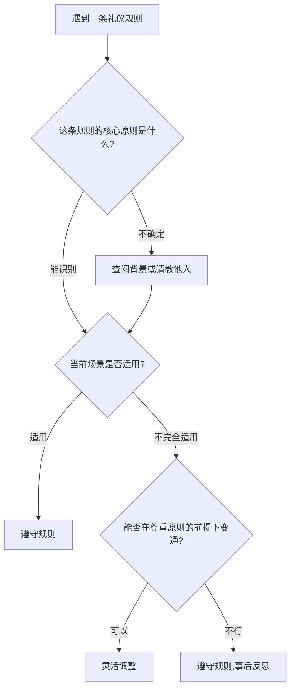
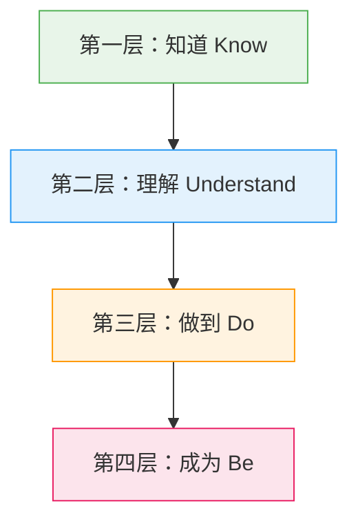

# 社交礼仪常见误区

社交礼仪的学习之路上，认知偏差比知识匮乏更危险。错误的理解不仅让你在社交场合频频踩雷，更可能让你对礼仪本身产生抵触——"学了也没用"、"太虚伪了"、"又不是古代人"。这些想法的背后，往往是一个被误解的礼仪概念在作祟。

本章梳理社交礼仪学习中最常见的十个误区，每个误区都从**认知根源**入手，通过**真实场景**还原错误行为的后果，再给出**可操作的纠正方案**。读完本章，你会发现：大多数社交尴尬，不是因为你不懂规则，而是因为你理解错了规则背后的逻辑。

---

## 误区一：礼仪就是虚伪的表演

### 这个误区是怎么来的

把礼仪等同于虚伪，是最普遍也最根深蒂固的误解。它的认知根源在于一个错误的二分法：**真诚 = 随心所欲，礼仪 = 压抑自我**。很多人在成长过程中经历过这样的场景——父母要求你在亲戚面前"表现得乖一点"，老师要求你"对客人要有礼貌"，这些被动的、外在强加的礼仪训练，很容易让人产生"礼仪是演给别人看的"这种印象。

心理学上，这叫做**外部动机驱动的行为排斥**（Deci & Ryan 的自我决定理论）：当一个行为被感知为外部强加而非自主选择时，人会产生心理抗拒，倾向于贬低这个行为的价值。"礼仪是虚伪的"这个判断，本质上是心理抗拒的合理化。

### 真实场景还原

> 张明是一家互联网公司的技术主管，性格直率。在一次跨部门会议上，他直接指出市场部的方案"逻辑不通、数据有误"。他的本意是就事论事，但在场的市场部负责人脸色铁青，后续两个月两个部门的协作陷入僵局。张明事后对朋友说："我说的都是事实，难道非要我绕弯子说才叫有礼貌？那不是虚伪吗？"
>
> 问题出在哪里？张明把"直接"等同于"真诚"，把"注意表达方式"等同于"虚伪"。但事实是：**同样的真话，可以用伤害人的方式说，也可以用建设性的方式说**。"这个方案的数据部分需要再核实一下，我这边有一些不同的数据源，会后我们可以对一下"——这句话同样传达了"数据有问题"的信息，但给对方留了面子，也给了解决问题的路径。这不是虚伪，这是**沟通能力**。

### 纠正方法

1. **区分"虚伪"和"得体"**：虚伪是表里不一——心里讨厌对方却装作喜欢；得体是表里如一但表达有度——心里尊重对方，表达时考虑对方感受。孔子说"人而不仁，如礼何"，强调的是仁心在先，礼节在后，两者是统一的而非对立的。

2. **理解礼仪的心理学基础**：哈佛商学院 Amy Cuddy 的研究（"Presence", 2015）表明，得体的社交行为不仅影响别人对你的看法，还会反过来影响你自己的心理状态——当你以尊重的态度对待他人时，你自己的自信心和掌控感也会提升。这叫做"具身认知"效应。

3. **从"表演"到"习惯"的转变路径**：任何新技能在初期都会感觉不自然。学开车时你会觉得每个动作都要刻意思考，但熟练后就变成了自动化行为。礼仪也一样——刻意练习 → 半自动化 → 自然习惯。给自己3-6个月的适应期，不要因为初期的不自然而放弃。

4. **建立内在动机**：不要为了"别人觉得我有礼貌"而学礼仪，而是为了"我想成为一个让人感到舒适的人"而学。当动机从外部转向内部，虚伪感会自然消失。

---

## 误区二：礼仪规则是固定不变的

### 这个误区是怎么来的

这个误区源于一种**权威主义思维模式**：认为规则是某个人或机构制定的"法律"，必须无条件遵守。在教育体系中，我们习惯于"标准答案"式的思维——规则就是规则，没有商量余地。这种思维模式被带入礼仪学习后，就产生了"礼仪条条框框不可变通"的错误认知。

### 礼仪演变的真实轨迹

礼仪规范从来不是静态的，它随着社会结构、技术条件和价值观的变化而持续演化：

| 时代/场景 | 过去的规范 | 现在的规范 | 变化原因 |
|-----------|-----------|-----------|---------|
| 见面礼 | 跪拜、作揖 | 握手、点头、挥手 | 平等观念普及 |
| 称呼 | 老爷、大人、先生/小姐 | 老师、哥/姐、直呼其名 | 职场文化变化 |
| 用餐 | 主人先动筷、布菜 | 各取所需、公筷公勺 | 卫生观念升级 |
| 名片 | 双手递接、仔细阅读后收好 | 扫码加微信、电子名片 | 数字化转型 |
| 婚礼 | 红包必须现金、份子钱有行情 | 微信转账、有人选择不收礼 | 年轻一代价值观变化 |
| 丧礼 | 披麻戴孝、长跪不起 | 佩戴白花、默哀致敬 | 简化繁琐流程 |

### 灵活应用的判断框架

面对"要不要遵守某条礼仪规则"的困惑时，可以用以下框架判断：

**判断的三个锚点**：
- **尊重**：我的变通是否仍然体现了对在场所有人的尊重？
- **场合**：这个场合的正式程度如何？越正式越需要遵守传统规范。
- **共识**：在场的人是否对某种规范有共同预期？如果有，遵循共识。

### 真实场景还原

> 李华参加一个商务晚宴，按传统礼仪应该等主人先动筷。但主人一直在跟旁边的人聊天，迟迟没有开始用餐的信号，其他人都面面相觑很尴尬。李华主动说："王总，这道菜看着不错，我们趁热尝尝？"一句话化解了僵局。
>
> 这就是灵活变通——他没有机械地等主人先动筷（因为主人显然忘了这个环节），而是用一种轻松的方式引导大家开始用餐，既不显得无礼，又解决了实际问题。

---

## 误区三：礼仪只适用于正式场合

### 这个误区是怎么来的

很多人把"礼仪"和"正装"、"宴会"、"商务会议"画等号，潜意识里认为日常生活不需要"端着"。这种想法的根源是**场合错位**——把"正式礼仪"等同于"全部礼仪"，忽略了礼仪本身有不同的层级和适用范围。

### 礼仪的层级体系

礼仪不是一个单一的概念，而是一个从日常到正式的连续谱系：

[日常礼仪] -------- [社交礼仪] -------- [职场礼仪] -------- [正式礼仪]
  |                    |                    |                    |
  打招呼、让路、       请客、送礼、         会议、邮件、         宴会、典礼、
  排队、不大声         回复消息、           汇报、着装、         国际交往、
  公放、电梯礼让       朋友聚会             商务接待             宗教仪式
  |                    |                    |                    |
  ★ 最常被忽视         ★ 容易踩雷           ★ 有明确规范         ★ 有专门培训

**日常礼仪被忽视的代价**：

- **电梯场景**：你进电梯后没有为后面的人按住开门键，对方是你的潜在客户或未来上司。你不知道这次"小事"会如何影响对方对你的判断。
- **排队场景**：你在咖啡店插队，后面的人恰好是你下周面试的面试官。社会比你想象的小得多。
- **公放场景**：你在地铁上公放短视频，旁边的人在用手机录播客素材，你的噪音直接毁了他一小时的工作成果。
- **让路场景**：你在人行道上并排走路挡住了后面赶路的人，没有任何让路意识。对方可能正在赶一个重要会议。

### 日常礼仪的"微习惯"清单

以下是不需要任何成本、但能显著提升你在他人眼中形象的日常微习惯：

| 场景 | 微习惯 | 心理效应 |
|------|--------|---------|
| 进出门 | 为后面的人扶住门 | "这个人很体贴" |
| 电梯 | 看到有人跑过来就按住开门键 | "这个人有同理心" |
| 超市 | 购物车不挡路，用完归位 | "这个人有公德心" |
| 电梯内 | 面朝门站立，不盯着手机屏幕到站才动 | "这个人有空间意识" |
| 公共交通 | 背包取下放身前，不占额外空间 | "这个人很周到" |
| 餐厅 | 用餐后简单整理桌面再离开 | "这个人受过良好教育" |
| 快递/外卖 | 说一声"谢谢" | "这个人尊重劳动者" |

这些微习惯的累积效应是惊人的。社会心理学中的**光环效应**（Halo Effect）告诉我们：人们会从一个积极特征推断出其他积极特征。当你在日常小事中展现出对他人的尊重和体贴，别人会自然推断你在大事上也同样可靠。

---

## 误区四：礼仪是女性的专利

### 这个误区是怎么来的

这个误区有深厚的文化根源。在传统社会分工中，女性被赋予了"照料者"、"协调者"的角色，礼仪被编码为一种"女性化"技能。媒体也在强化这一刻板印象——礼仪培训课程的广告画面通常是穿旗袍的女性在练习插花和茶道，进一步加深了"礼仪 = 女性专属"的印象。

### 数据说话

LinkedIn 2023年的一项职业发展调研显示：

- **72%** 的招聘经理表示，候选人在面试中的礼仪表现直接影响录用决定
- 在"因礼仪问题被拒"的案例中，**男性占比58%**，略高于女性的42%
- 职场中被认为"缺乏基本礼仪"的男性，晋升速度比同龄人**慢1.8倍**

这些数据表明：男性不仅同样需要礼仪，而且在职场中因为忽视礼仪而付出的代价可能更大。

### 男性特有的礼仪盲区

以下是职场和社交中男性最容易忽视的礼仪细节：

**1. 空间边界意识薄弱**

男性在公共空间中平均占用面积比女性大（研究显示约多40%），比如地铁上的"岔腿坐"、会议室里胳膊肘占满扶手。这种无意识的空间侵占会给人"不尊重他人"的印象。

**纠正方法**：在公共空间中有意识地控制自己的物理占用面积。坐下时双腿并拢或微微交叉，胳膊肘收回自己的空间范围内。这不是"不够阳刚"，这是"有教养"。

**2. 声音管理不足**

男性平均音量比女性高，在封闭空间（电梯、办公室、餐厅）中更容易产生噪音污染。大声打电话、开会时声音过大、不注意场合的音量调节，都是常见的问题。

**纠正方法**：在室内空间将音量控制在"一臂距离内能听清"的水平。打电话时如果旁边有人，压低声音或换个位置。

**3. 倾听礼仪缺失**

研究显示，在混合性别对话中，男性打断女性的频率是女性打断男性的**3倍**（Hancock & Rubin, 2015）。不等别人说完就插话、频繁看手机、眼神飘忽，这些都是倾听礼仪的缺失。

**纠正方法**：练习"3秒规则"——别人说完后，默数3秒再回应。这3秒不仅确保你不会打断对方，还给了你时间组织更有质量的回应。

**4. "哥们儿文化"中的礼节滑坡**

男性之间常见的"互损"、"毒舌"文化，容易让人在不合适的场合也放松礼仪标准。在朋友间开玩笑没问题，但把这种风格带到职场或与不熟的人交往中，就会造成问题。

**纠正方法**：学会区分"社交圈层"。对不同关系层级的人采用不同的沟通风格：密友可以随意，普通朋友需要适度，职场关系需要专业，陌生人需要礼貌。

---

## 误区五：礼仪就是记住一堆规则

### 这个误区是怎么来的

很多礼仪书籍和培训课程采用"清单式教学"——"餐巾放膝盖上"、"刀叉从外向内用"、"握手3秒"——把礼仪变成了一张需要背诵的检查表。这种方法虽然便于教学，但给学员留下了"礼仪 = 记忆负担"的印象，也导致学员在遇到清单之外的场景时手足无措。

### 从"知其然"到"知其所以然"

真正掌握礼仪的关键不是记住规则，而是理解规则背后的**底层原则**。当你理解了原则，你就能在任何场景中推导出合适的行为。

**礼仪的五个底层原则**：

| 原则 | 含义 | 应用举例 |
|------|------|---------|
| **尊重** | 承认每个人的价值和尊严 | 不论对方职位高低，都给予同等的礼貌 |
| **共情** | 站在对方的角度思考 | 说话前想一想"如果别人这样对我说，我会怎么感受？" |
| **适度** | 行为与场合匹配 | 穿着、谈吐、情绪表达都要适度 |
| **真诚** | 表里如一 | 不说违心的话，不做作的事 |
| **包容** | 接纳差异 | 不因对方的习惯与你不同而评判 |

**用原则推导规则的示例**：

场景：你和同事一起等电梯，电梯门开了，里面只有一个人。

- 用规则思维：需要查"电梯礼仪有哪些"才能知道该怎么做
- 用原则思维：尊重 + 共情 → 里面的人已经占了一定空间，我和同事进去后不能挤到对方 → 主动调整站位，给每个人留出舒适的空间

当你掌握了原则，面对任何未知场景都能推导出合理的行为。这就是"授人以鱼不如授人以渔"。

### 礼仪素养的四层模型

- **知道（Know）**：了解礼仪规则的存在——"握手要主动伸手"
- **理解（Understand）**：理解规则背后的原理——"主动伸手表达善意和自信"
- **做到（Do）**：在实际场景中能正确执行——在各种场合自然地完成得体的握手
- **成为（Be）**：礼仪成为人格的一部分——不需要刻意思考，自然而然地以尊重和得体的方式对待所有人

大多数人停留在第一层和第二层之间，从第二层到第三层需要**刻意练习**，从第三层到第四层需要**长期内化**。

---

## 误区六：礼仪就是一味迁就他人

### 这个误区是怎么来的

这个误区源于对"礼貌"的过度简化理解。在很多人的认知中，礼貌 = 不拒绝、不冲突、让别人开心。这种理解把礼仪变成了一种"讨好型人格"的借口，导致一些人在社交中过度压抑自己，最终要么身心俱疲，要么在某个时刻情绪爆发，反而造成更大的社交灾难。

### 礼仪与边界的真实关系

**礼仪不等于无底线的退让。** 真正的礼仪是在尊重他人的前提下，也尊重自己。心理学家 Nedra Glennon Tawwab 在《Set Boundaries, Find Peace》中指出：健康的人际关系建立在清晰的边界之上，而**得体地设定边界本身就是一种高级礼仪**。

一个永远说"是"的人，并不是一个有礼貌的人，而是一个没有边界的人。一个能够得体地说"不"的人，才是一个真正有修养的人。

### 如何得体地拒绝

拒绝的"三明治法则"——肯定 + 拒绝 + 替代方案：

| 步骤 | 内容 | 示例 |
|------|------|------|
| **肯定** | 表达感谢或认可对方的请求 | "谢谢你想到我" / "这个项目听起来很有意思" |
| **拒绝** | 清晰、直接地表达无法接受 | "但我这周时间已经排满了" / "这个超出了我的能力范围" |
| **替代** | 提供其他可能的方案 | "下周三之后我可以参与" / "小王在这方面比我专业，可以问问他" |

**不同场景的拒绝话术**：

**场景一：同事请你帮忙做他的工作**
> "我理解你最近压力很大（肯定），但手头这个项目我自己也需要赶进度（拒绝）。你可以看看能不能跟主管商量调整一下优先级，或者我周五之后如果空了可以帮你看看关键部分（替代）。"

**场景二：朋友借钱**
> "你遇到困难我很关心（肯定），但借钱这个事我给自己定了个规矩，朋友之间不借钱，免得伤感情（拒绝）。如果你需要，我可以帮你想想其他办法，比如看看有没有合适的周转渠道（替代）。"

**场景三：社交邀约你不想参加**
> "感谢邀请，你们的活动我一直觉得氛围很好（肯定），但这个周末我已经有安排了（拒绝）。下次有活动可以提前告诉我，我尽量安排时间（替代）。"

**场景四：被要求喝酒**
> "感谢你的好意（肯定），但我今天确实不能喝，身体原因/待会儿要开车（拒绝）。我以茶代酒敬你一杯，心意是一样的（替代）。"

### 自我边界自检表

定期用以下问题检查自己的边界状态：

- 你是否经常在答应别人的请求后感到后悔或不快？
- 你是否害怕说"不"会导致别人不喜欢你？
- 你是否经常为了维持关系而牺牲自己的需求？
- 你是否发现自己对某些人有隐性的怨恨，但从未表达过？
- 你是否觉得社交很累，因为总在"演"一个好人？

如果以上问题有3个以上回答"是"，你可能正在陷入"过度迁就"的误区。需要重新审视你的社交边界。

---

## 误区七：礼仪学习可以速成

### 这个误区是怎么来的

市面上充斥着"7天掌握商务礼仪"、"3小时学会社交技巧"的速成课程。这些课程迎合了现代人"快速获得技能"的心理需求，但创造了一个不切实际的预期。礼仪不像开关——学完就"打开"了。它更像是肌肉——需要持续训练才能增长和维持。

### 为什么礼仪不能速成

**1. 礼仪涉及身体记忆**

很多礼仪行为需要身体记忆的支持：握手的力度、走路的姿态、坐姿的端正、说话的语速和音量。这些不是"知道"就能做到的，需要反复练习才能形成肌肉记忆。神经科学研究表明，一个新的运动模式需要大约**66天**的重复才能形成自动化的习惯（伦敦大学学院 Phillippa Lally 的研究）。

**2. 礼仪需要情境判断力**

同一个行为在不同场景中可能恰当也可能失礼。比如"大声说话"在球场上完全正常，在图书馆则不合适。这种情境判断力需要大量的社交经验积累，无法通过书本或课堂速成。

**3. 礼仪需要情绪管理能力**

在压力、紧张、愤怒等情绪下仍然能保持得体，需要强大的情绪管理能力。而情绪管理能力本身就是一项需要长期修炼的技能。

### 礼仪学习的合理时间线

| 阶段 | 时间 | 目标 | 方法 |
|------|------|------|------|
| **入门期** | 第1-4周 | 了解基本规则和原则 | 阅读、观察、模仿 |
| **实践期** | 第2-3个月 | 在日常场景中刻意练习 | 每天选1-2个场景练习 |
| **内化期** | 第4-6个月 | 部分行为开始自动化 | 反思、调整、迭代 |
| **精进期** | 第7-12个月 | 应对复杂场景的能力提升 | 挑战更难的社交场景 |
| **习惯期** | 1年以上 | 礼仪成为自然行为 | 持续学习和微调 |

### 加速内化的三个方法

**1. 场景预演法**：在重要社交场合之前，提前预演可能的情境和应对方式。比如参加商务晚宴前，想象可能遇到的场景（点菜、敬酒、聊天话题），提前想好如何应对。

**2. 社交复盘法**：每次社交之后花5分钟回顾——哪些地方做得好？哪些地方可以改进？下次遇到类似场景可以怎么调整？可以用手机备忘录简单记录。

**3. 榜样观察法**：找一个你认为社交能力强的人（可以是现实中的人，也可以是公众人物），仔细观察他们在各种场景中的行为方式，分析他们的行为背后的逻辑。

---

## 误区八：不同文化之间礼仪可以通用

### 这个误区是怎么来的

这个误区的认知根源是**文化中心主义**——以自己的文化标准作为衡量一切的尺度。当一个人长期生活在单一文化环境中，很难意识到自己的行为方式只是众多可能性中的一种，而不是"正常的"或"正确的"标准。

### 跨文化礼仪差异全景图

| 维度 | 中国文化 | 日本文化 | 美国文化 | 中东文化 | 印度文化 |
|------|---------|---------|---------|---------|---------|
| **问候** | 点头/握手，关系近可以拥抱 | 鞠躬（角度表示尊重程度） | 握手，熟人可以拥抱 | 同性拥抱/贴面，异性避免身体接触 | 合十礼（Namaste） |
| **餐桌** | 主人为客人布菜，晚辈等长辈先动筷 | 不能把筷子插在饭上（丧事象征） | 自助式，AA制常见 | 不用左手递食物（左手被认为不洁） | 很多人素食，不用左手吃饭 |
| **送礼** | 不送钟（谐音"送终"）、不送伞（谐音"散"） | 礼物用双手递，不在对方面前拆 | 当面拆礼物并表示感谢 | 不送酒（穆斯林禁酒） | 不送牛皮制品（印度教中牛是神圣的） |
| **时间** | "马上到"可能意味着15分钟 | 必须准时，迟到5分钟以上需要道歉 | 准时很重要，迟到5分钟需要道歉 | 时间观念较灵活，晚到15-30分钟可接受 | 时间观念较灵活 |
| **肢体语言** | 避免过度身体接触 | 避免身体接触，不拥抱 | 常见拥抱、拍肩膀 | 避免异性间身体接触 | 避免异性间身体接触 |
| **眼神交流** | 适度，避免长时间直视长辈/上级 | 避免长时间直视（被视为挑衅） | 直接的眼神交流表示诚实 | 同性间可以，异性间避免 | 避免长时间直视长辈 |

### 跨文化社交的"观察-模仿-确认"三步法

**第一步：观察（Observe）**
到达一个新的文化环境后，先花时间观察当地人的行为方式。注意他们如何问候、如何用餐、如何表达感谢和道歉。不要急于模仿，先建立认知框架。

**第二步：模仿（Imitate）**
在了解基本规范后，开始模仿当地人的行为方式。从最安全的行为开始（比如问候方式、用餐方式），逐步扩展到更复杂的社交场景。

**第三步：确认（Confirm）**
当你不确定某个行为是否得体时，直接询问当地人。大多数人都很乐意分享自己的文化习俗，而且你的询问本身就会被视为一种尊重。可以说："我想确保我的行为在你们的文化中是得体的，你能帮我看看吗？"

### 文化冲突的缓冲策略

当你犯了文化错误时（这是不可避免的），以下策略可以帮助你化解尴尬：

1. **真诚道歉**：不需要过度解释，简单说"我意识到我刚才的行为可能在你们的文化中不太合适，我很抱歉"就够了
2. **表现出学习意愿**：说"我很想了解你们的文化，能告诉我正确的做法吗？"
3. **不要自我辩护**：不要说"在我的文化中这是正常的"——这会让对方觉得你在暗示你的文化比他们的好
4. **幽默自嘲**：在合适的情况下，用幽默化解尴尬——"看来我还有很多要学习的地方"

---

## 误区九：礼仪只是为了给他人留下好印象

### 这个误区是怎么来的

这个误区把礼仪工具化了——把礼仪当作达成社交目的的手段，而不是个人修养的自然流露。在这种思维下，礼仪变成了一种投资行为：我对你礼貌，是为了从你那里得到什么。当没有明确的"回报预期"时（比如面对服务员、清洁工、陌生人），这种人就会"切换"到不礼貌的状态。

### 礼仪的多重价值

将礼仪仅仅视为"印象管理工具"，就像把钻石仅仅当作玻璃刀使用——你只用到了它最表面的功能。礼仪的真正价值至少包含以下几个层面：

**1. 自我认同的构建**
你的行为方式会反向塑造你的自我认知。心理学中的**自我知觉理论**（Bem, 1972）指出：人会通过观察自己的行为来推断自己的态度和特质。当你持续以尊重和得体的方式对待他人，你会逐渐认同自己是一个"有修养的人"，这种自我认同会成为你人格的一部分。

**2. 信任资本的积累**
每一次得体的社交互动都是在你的"信任账户"中存款。这些存款在你需要帮助、合作或支持时会派上用场。而失礼行为则是在取款——取款过多，账户就会破产。

**3. 社会环境的改善**
礼仪是有传染性的。当你以礼貌和尊重的方式对待他人，对方更有可能以同样的方式对待下一个人。一个社区、一个公司、一个社会的礼仪水平，是由每一个个体的行为共同塑造的。

**4. 心理健康的维护**
研究表明，良好的社交关系是心理健康最重要的保护因素之一（Holt-Lunstad et al., 2010, PLOS Medicine）。而礼仪正是维护良好社交关系的基础技能。

### 检查你的"礼仪选择性"

以下场景可以帮助你检查自己是否存在"选择性礼貌"——只对有利用价值的人礼貌：

- 你对餐厅服务员的态度和对客户的态度一样吗？
- 你在电话中和面对面时的礼貌程度一样吗？
- 你对保洁阿姨和对CEO打招呼的方式有区别吗？
- 你在网上匿名评论时和现实中的表达方式一样吗？
- 当你知道不会再见到某个人时，你还会保持礼貌吗？

**真正的礼仪是"无人监督时的自律"。** 当你的礼貌不依赖于对方的身份、你是否需要从对方那里获得什么、以及是否有人在看时，你的礼仪才是真正的修养，而不是表演。

---

## 误区十：礼仪在数字时代不再重要

### 这个误区是怎么来的

数字化转型改变了社交的方式，但并没有消除社交的本质需求。这个误区的根源在于把"面对面交流减少"等同于"社交减少了"——事实上，数字技术让我们每天接触的人比以往任何时候都多，只不过交流的介质变了。而介质变了，礼仪规则也需要相应调整。

### 数字社交的礼仪盲区

数字社交中的礼仪问题比面对面社交更难察觉，因为缺少了表情、语气、肢体语言等非语言线索。以下是最常见的数字礼仪问题及其影响：

**1. 即时通讯（微信/WhatsApp）**

| 常见问题 | 为什么是问题 | 正确做法 |
|---------|-------------|---------|
| 不回复消息 | 给对方"你对我不重要"的感觉 | 即使暂时无法回复，也应在一个工作日内回复；如果需要时间，先发一条"收到，稍后回复" |
| 长语音轰炸 | 强迫对方花大量时间听你的语音，而文字只需要几秒扫描 | 能打字就不发语音；如果必须发语音，控制在30秒以内；重要信息用文字 |
| 深夜发消息 | 不考虑对方的作息时间 | 非紧急消息在工作时间发送；如果必须深夜发，加一句"不急，明天再看" |
| 群聊中@所有人 | 滥用会让人产生"狼来了"效应 | 只在真正重要的事情上@所有人；日常通知用普通消息 |
| 未读不回的追问 | "看到了吗？""怎么不回？"给对方施压 | 发送后耐心等待；如果24小时未回复，可以换一种方式联系 |
| 朋友圈/群聊公开批评 | 让对方在公开场合丢面子 | 有意见私下沟通，不在公开平台点名批评 |

**2. 电子邮件**

一封得体的邮件应该包含以下要素：

主题行：【明确关键词】具体事项描述（避免空白主题或"你好"）
称呼：  对方的正确姓名和头衔
正文：  第一句说明来意 → 中间展开细节 → 最后明确下一步行动
结尾：  感谢语 + 你的签名档
附件：  正文中提及附件内容，确保附件已实际添加

**常见邮件礼仪错误**：
- "回复所有人"中包含不应该公开的信息
- 用全大写字母写邮件（在网络语言中等同于"吼叫"）
- 邮件中使用过多感叹号和表情符号（在正式邮件中显得不专业）
- 抄送了不该抄送的人（特别是越级抄送）
- 邮件签名档过长或包含过多花哨元素

**3. 视频会议**

视频会议已成为职场常态，但很多人仍然忽视其礼仪规范：

- **会前**：提前5分钟进入会议室，测试摄像头和麦克风，确保背景整洁（或使用虚拟背景）
- **会中**：不说话时静音，保持眼神看摄像头而非屏幕（模拟眼神交流），不同时做其他事情（吃东西、看手机）
- **发言**：简明扼要，先说结论再展开，控制发言时间
- **离场**：如果需要提前离开，提前告知并在聊天框中说明

**4. 社交媒体**

- 不在他人发布的内容下进行攻击性评论
- 转发他人内容时注明出处和原作者
- 不过度分享自己的生活（刷屏会让关注者反感）
- 对他人的观点即使不同意，也以建设性的方式表达
- 不在公开平台上传播未经证实的信息

### 数字时代的"数字形象管理"清单

你的数字形象可能比你的现实形象更持久。搜索引擎会记住你说过的每一句话，社交媒体会保留你发布过的每一条动态。以下清单帮助你管理自己的数字形象：

- [ ] 检查你的社交媒体公开内容，删除不恰当的发言
- [ ] 设置合适的隐私权限，控制谁可以看到你的内容
- [ ] 在专业平台上（LinkedIn、GitHub）保持专业的个人资料
- [ ] 避免在情绪激动时发布任何内容（写完先保存，过一天再发）
- [ ] 定期搜索自己的名字，了解你的数字形象是什么样的
- [ ] 在不同的平台上保持一致的形象和价值观

---

## 总结：从误区到正途的转变路径

以上十个误区可以归纳为三类认知偏差：

| 认知偏差类型 | 涉及的误区 | 核心问题 | 纠正方向 |
|-------------|-----------|---------|---------|
| **价值否定** | 误区1（虚伪）、误区4（女性专属）、误区10（过时） | 否定礼仪的价值和必要性 | 重新认识礼仪的本质和时代价值 |
| **认知简化** | 误区2（一成不变）、误区3（仅限正式）、误区5（死记规则）、误区8（文化通用） | 把复杂事物过度简化 | 理解礼仪的层次性、灵活性和文化差异性 |
| **执行偏差** | 误区6（过度迁就）、误区7（速成）、误区9（仅留印象） | 行为方向或方法错误 | 建立正确的执行策略和预期 |

**走出误区的五个关键认知转变**：

1. **从"表演"到"修养"**：礼仪不是演给别人看的，是你内在修养的自然流露。当它成为习惯后，你甚至不会意识到自己在"行礼"。

2. **从"规则"到"原则"**：不要死记硬背规则，要理解背后的尊重、共情、适度、真诚、包容五个核心原则。掌握了原则，你可以在任何场景中推导出合适的行为。

3. **从"正式场合"到"每时每刻"**：礼仪不区分场合。在日常小事中的得体，比在正式场合的表演更能反映你的真实修养。

4. **从"讨好他人"到"尊重所有"**：包括尊重自己。得体地拒绝、清晰地设定边界，本身就是高级礼仪的体现。

5. **从"速成"到"终身修炼"**：接受礼仪是一个需要长期实践的过程。66天养成一个习惯，6个月实现初步内化，1年以上形成自然行为。

> **最终检验标准**：当你独处时（没有人在看、没有利益相关、匿名状态下），你的行为方式和有人在看时一样，那说明礼仪已经真正成为你的一部分——这就是古人所说的"慎独"。

---

**本章实践作业**：

1. 从本章中选出你最认同的一个误区，反思自己是否存在这个误区，写下三个具体的改善行动
2. 在接下来一周中，每天刻意练习一个"日常微习惯"（参考误区三中的清单）
3. 找一个跨文化场景（可以是看外国电影、和外国朋友交流、或阅读异国文化资料），用"观察-模仿-确认"三步法体验文化差异
4. 检查你的数字形象——搜索自己的名字，审视自己的社交媒体内容，完成"数字形象管理"清单
