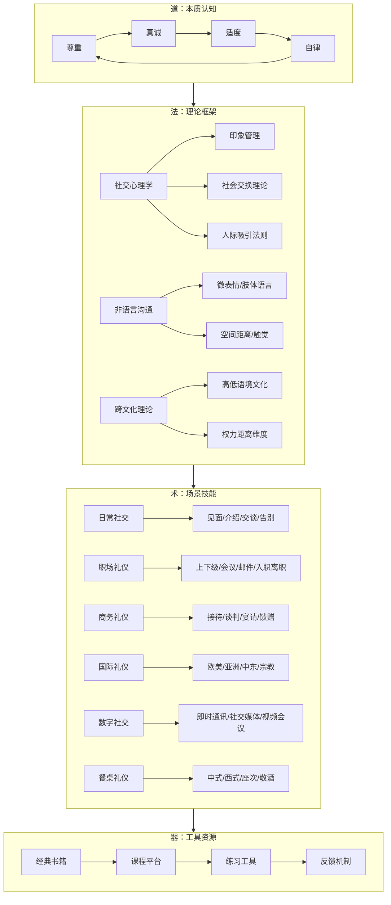

# 社交礼仪本章小结

## 一、本章知识体系总览

社交礼仪是一门融合了心理学、人类学、传播学和行为科学的综合学科。本章从"道法术器"四个层面构建了完整的知识体系，帮助读者不仅知道"怎么做"，更理解"为什么这样做"以及"如何灵活变通"。

本章共包含六大核心模块，覆盖了社交礼仪从理论到实践的完整知识图谱：

| 模块 | 核心内容 | 关键收获 |
|------|----------|----------|
| 基础理论 | 礼仪本质、历史演变、心理学基础、非语言沟通、跨文化理论、商务礼仪理论 | 理解"为什么"，建立科学认知框架 |
| 具体方案 | 日常社交、商务活动、餐桌用餐、职场工作、国际交往、数字社交 | 掌握"怎么做"，获得可执行的操作指南 |
| 学习路径 | 四阶段系统学习法：基础认知→技能掌握→实践应用→内化提升 | 知道"从哪开始"，规划个人提升路线 |
| 常见误区 | 十大典型误区的识别与纠正 | 避免"踩坑"，少走弯路 |
| 产品推荐 | 经典书籍、优质课程、实用工具 | 获取"弹药库"，持续精进 |
| 章节概览 | 全局视野、知识图谱、学习建议 | 建立"地图感"，把握学习方向 |

***

## 二、核心要点深度回顾

### 2.1 礼仪的本质：四个字的底层逻辑

本章反复强调的四个核心原则——**尊重、真诚、适度、自律**——不是四个独立的概念，而是一个层层递进的逻辑链：

**尊重是起点。** 所有礼仪行为的底层动机应该是对他人价值的认可。哈佛商学院教授艾米·卡迪（Amy Cuddy）的研究表明，人类在社交评估中首先判断的是"这个人是否值得信任"（温暖维度），其次才是"这个人是否有能力"（能力维度）。礼仪的本质功能就是传递"我尊重你、我值得信任"的信号。当你真正理解了这一点，就不会把礼仪当作"表演"，而是当作"沟通"。

**真诚是灵魂。** 没有真诚的礼仪是空壳。加州大学伯克利分校的心理学研究发现，人类对"虚假微笑"（只动嘴角的杜乡微笑vs.动用眼轮匝肌的真笑）的识别准确率高达90%以上。你的不真诚，对方大概率能感知到。孔子两千多年前就说过："人而不仁，如礼何？"——没有真心，礼就是废纸。

**适度是智慧。** 礼仪的最高境界不是"做得多"，而是"做得恰到好处"。过分的热情让人有压力，过分的谦卑让人不自在，过分的正式让人觉得疏远。意大利文艺复兴时期的廷臣卡斯蒂廖内提出了"sprezzatura"（轻松的优雅）的概念——最高级的礼仪，是让人感觉你毫不费力。这需要对场合、关系、文化的精准判断力。

**自律是保障。** 真正的礼仪修养体现在"没人看见的时候"。康德的道德哲学中有一个概念叫"绝对律令"——你的行为准则应该是你愿意它成为普遍法则的准则。礼仪也是一样：你在独处时的行为模式，最终会决定你在社交场合中的自然表现。

### 2.2 礼仪的科学基础：不只是"感觉好"

本章基础理论部分最重要的贡献，是把社交礼仪从"经验之谈"提升到了"科学认知"的层面。三个关键科学发现值得特别强调：

**第一，梅拉比安法则（7-38-55法则）。** 在面对面沟通中，信息传递55%来自肢体语言，38%来自语调，仅7%来自语言内容。这意味着你"怎么说"比"说什么"重要十倍以上。握手时的力度、眼神的方向、身体的角度——这些"微小"的非语言信号，构成了社交印象的主体。

**第二，首因效应与近因效应。** 心理学研究表明，第一印象在7秒内形成，并且需要8-10次正面接触才能改变。这解释了为什么面试的前30秒、商务会议的第一次握手、社交场合的第一句问候如此关键——它们几乎"锁定"了对方对你的基本判断。

**第三，社会交换理论。** 人际关系本质上是一种"成本-收益"的交换。礼仪的作用是降低社交成本（减少摩擦、避免冲突、建立信任），同时增加社交收益（获得好感、建立合作、拓展人脉）。从这个角度看，学习礼仪不是"浪费时间"，而是一项高回报的"社交投资"。

### 2.3 六大场景的礼仪要点速查

本章具体方案部分覆盖了六大社交场景。以下是每个场景的核心要点提炼：

**（1）日常社交礼仪**

日常社交是所有礼仪的基础训练场。核心要领：

- **见面礼**：握手力度适中（2-3秒），眼神接触但不凝视，微笑自然不夸张
- **自我介绍**：30秒版本（姓名+身份+一句话亮点），根据场合调整正式程度
- **交谈礼仪**：二八法则——80%倾听+20%表达；不打断、不抢话、适时回应
- **告别礼仪**：提前暗示（"时间不早了"），感谢对方的时间，明确下次联系意向
- **公共场所**：电梯先出后进、自动扶梯左行右立、排队保持距离

**（2）职场礼仪**

职场是礼仪投资回报率最高的场景。CareerBuilder的调查显示，41%的雇主不会提拔缺乏礼仪素养的员工。核心要领：

- **着装**：TPO原则（Time时间、Place地点、Occasion场合），宁可稍正式也不要过于随意
- **上下级关系**：尊重不谄媚，亲近不逾矩；汇报工作先结论后过程
- **会议礼仪**：提前5分钟到场，手机静音，发言简洁有条理，不抢话不插话
- **邮件礼仪**：主题明确、称呼得体、正文简练、签名完整、24小时内回复
- **入职与离职**：入职时主动学习公司文化，离职时保持专业、不烧桥

**（3）商务礼仪**

商务礼仪直接关系到商业合作的成败。英国贸易投资总署报告指出，英国企业每年因文化礼仪失误损失约480亿英镑海外订单。核心要领：

- **接待**：提前了解来宾背景，安排合适规格的接待，名片双手递接并认真阅读
- **谈判**：座次安排体现尊重，先建立关系再谈正事，注意对方的文化禁忌
- **宴请**：座次遵循"面门为上、以右为尊"，点菜考虑客人忌口，敬酒有序
- **馈赠**：了解对方文化中的送礼禁忌（如日本忌讳4件套、中东忌讳酒精），包装精美

**（4）餐桌礼仪**

餐桌是最能暴露一个人修养的场所。核心要领：

- **中式圆桌**：主位面对门，主宾在主人右侧；转盘顺时针，不翻菜不挑菜；敬酒时杯沿低于对方
- **西式长桌**：主人坐两端，男女交叉排列；刀右叉左，由外向内使用餐具；用餐完毕刀叉平行放于盘中
- **通用原则**：不发出咀嚼声，不边吃边说话（食物在口中时），不翻找食物，适量取食

**（5）国际礼仪**

全球化时代，跨文化礼仪能力是核心竞争力。霍夫斯泰德文化维度理论提供了理解文化差异的框架：

- **高语境vs.低语境**：日本、中国等高语境文化重视含蓄和面子；美国、德国等低语境文化重视直接和效率
- **权力距离**：东南亚国家等级观念较强，北欧国家更平等；要根据文化背景调整对上级/长辈的礼仪尺度
- **宗教禁忌**：穆斯林不饮酒不吃猪肉、印度教徒不吃牛肉、犹太教有洁食规定——提前了解是基本尊重
- **肢体接触**：拉丁文化拥抱亲吻常见，东亚文化保持距离，中东同性之间亲密但异性之间保守

**（6）数字社交礼仪**

数字时代创造了全新的礼仪场景。核心要领：

- **即时通讯**：工作消息在工作时间发送，不发语音（除非对方同意），重要事项用文字确认
- **社交媒体**：不刷屏、不转发未经核实的信息、评论保持善意、尊重他人隐私（发合照前征得同意）
- **视频会议**：提前测试设备、背景整洁、静音不说话时、看摄像头而非屏幕（模拟眼神接触）
- **邮件与工作群**：回复全部前想清楚是否所有人都需要看到，不深夜发工作消息（除非紧急）

### 2.4 十大误区的本质：认知偏差的纠正

本章常见误区部分揭示了阻碍礼仪学习的深层认知障碍。以下是十大误区的核心纠正逻辑：

| 误区 | 核心错误 | 正确认知 |
|------|----------|----------|
| 礼仪是虚伪的表演 | 把形式等同于本质 | 礼仪是尊重的外在表达，真诚是前提 |
| 礼仪规则固定不变 | 忽视文化与时代演变 | 原则稳定，形式灵活；礼随时变 |
| 礼仪只适用于正式场合 | 低估日常礼仪的影响 | 日常细节才是修养的真实体现 |
| 礼仪是女性的专利 | 性别偏见 | 礼仪是人的基本素养，不分性别 |
| 礼仪就是客气和忍让 | 把礼仪等同于软弱 | 礼仪有边界，尊重自己也是礼仪的一部分 |
| 学礼仪很快就能学会 | 低估内化过程 | 礼仪是终身修炼，需要持续实践和反思 |
| 有了网络就不需要面对面 | 低估面对面沟通的价值 | 非语言信号在线上大量丢失 |
| 礼仪只靠模仿就行 | 忽视理解原理 | 知其然更要知其所以然 |
| 礼仪太繁琐记不住 | 死记硬背的方法错误 | 理解原则后灵活运用，不需要背规则 |
| 礼仪和个性冲突 | 把个性与任性混为一谈 | 真正的个性是在规则框架内的创造力 |

**最核心的纠偏**：礼仪的本质不是"约束你"，而是"解放你"——当你不需要在社交场合焦虑"该怎么做"的时候，你才能真正专注于沟通本身。

***

## 三、关键行动建议

### 3.1 立即行动（今天就做）

1. **礼仪自查**：对照本章内容，诚实评估自己在日常社交、职场、餐桌三个场景中的礼仪水平，用1-10分打分
2. **确定一个重点**：选择得分最低的场景作为未来一个月的主攻方向
3. **收集真实反馈**：找一个你信任的朋友或同事，直接问："你觉得我在社交场合有什么需要改进的地方？"——真实反馈比自我评估有价值十倍

### 3.2 短期行动（1-2周）

1. **建立观察习惯**：每天花5分钟观察一个你认为"社交做得好"的人，记录他/她的具体行为（不是"很得体"这种模糊评价，而是"说话时会微微侧头表示倾听"这种具体行为）
2. **每日一练**：选择一个具体的礼仪技巧（如握手、自我介绍、餐桌礼仪），每天刻意练习一次
3. **阅读一本入门书**：从推荐书单中选择一本，两周内读完前三章

### 3.3 中期行动（1-3个月）

1. **完成一门系统课程**：从推荐的MOOC或线下课程中选择一门，系统学习
2. **专项突破**：针对自己的薄弱环节进行集中训练（如商务宴请、公众演讲、跨文化沟通）
3. **实战检验**：主动创造或参与社交场合，将所学付诸实践
4. **建立反馈循环**：每次重要的社交活动后，花3分钟反思——哪些做得好？哪些可以改进？

### 3.4 长期行动（3个月以上）

1. **内化为习惯**：当礼仪行为不再需要"刻意"去做，而是自然流露时，说明你已经内化了
2. **持续更新知识**：关注礼仪文化的新发展（如AI时代的视频会议礼仪、远程工作礼仪）
3. **分享与传承**：将你的礼仪经验分享给他人——教是最好的学
4. **培养文化敏感度**：随着阅历增长，不断加深对不同文化礼仪的理解和尊重

***

## 四、核心理念重申

### 4.1 礼仪的本质是降低社交成本

从经济学角度看，礼仪是一种"社会技术"——它的核心功能是降低人际交往中的摩擦成本。当你知道在什么场合该怎么做，你就不需要在每次社交时都耗费大量认知资源去"猜"该怎么做。礼仪提供了一套经过千年验证的"社交协议"，让陌生人之间也能快速建立信任、高效协作。

### 4.2 真诚是礼仪的唯一正确动机

所有礼仪技巧，如果脱离了真诚，就会变成操控。心理学中的"印象管理"有两种：一种是"真诚性印象管理"（你确实想展现最好的自己），另一种是"策略性印象管理"（你只是想操控对方的看法）。前者建立长期信任，后者一旦被识破，信任崩塌且极难修复。选择真诚，不是因为"道德正确"，而是因为"策略最优"。

### 4.3 礼仪能力的本质是情境判断力

真正的礼仪高手不是"规则背诵者"，而是"情境判断者"。他们能够在几秒钟内完成以下判断：这是什么场合？对方是什么背景？我们的关系到什么程度？当前的文化语境是什么？然后根据判断选择最合适的行为。这种判断力无法通过死记硬背获得，只能通过大量的实践、观察和反思来培养。

### 4.4 礼仪是终身修炼，不是一次性学习

社会在变化，礼仪也在演变。十年前不存在的"微信群礼仪"、"视频会议礼仪"、"AI助手交互礼仪"，今天已经成为必备知识。把礼仪当作终身学习的课题，保持开放心态和持续学习的习惯，才能在不断变化的社交环境中始终保持得体和自信。

***

## 五、本章核心数据速览

本章引用了多项权威研究数据，以下是最关键的几个数字，建议牢记：

| 数据 | 来源 | 含义 |
|------|------|------|
| 55% | 梅拉比安法则 | 面对面沟通中55%的信息来自肢体语言 |
| 7秒 | 心理学研究 | 第一印象形成的时间窗口 |
| 8-10次 | 社会心理学 | 改变第一印象所需的正面接触次数 |
| 42% | 哈佛商学院 | 社交礼仪评估最高分组vs最低分组的收入差距 |
| 41% | CareerBuilder | 不会提拔缺乏礼仪素养员工的雇主比例 |
| 3倍 | 《人格与社会心理学杂志》 | 不礼貌行为的记忆持续时间是礼貌行为的3倍 |
| 87.5% | 斯坦福研究中心 | 人际关系在财富创造中的贡献比例 |
| 30% | MIT人类动力学实验室 | 礼仪得当的团队沟通效率提升幅度 |

***

## 六、结语

社交礼仪的学习之旅，本质上是一段自我认知和自我提升的旅程。它不是让你变成一个"没有棱角的圆滑之人"，而是让你成为一个"在任何场合都能让他人感到舒适、同时保持自我"的人。

本章从理论到实践，从历史到未来，从东方到西方，为你构建了一个完整的社交礼仪知识体系。但知识本身没有力量——只有当你把知识转化为行动，把行动转化为习惯，把习惯转化为性格，社交礼仪才能真正成为你的人生资本。

最后，用一句话概括本章的核心信息：

**礼仪不是束缚你的规则，而是解放你的工具。当你不再需要焦虑"该怎么做"的时候，你才能真正享受人与人之间连接的美好。**

从今天开始，选择一个具体的场景，选择一个具体的技巧，开始练习。每一步微小的进步，都会在未来的某一天，以你意想不到的方式回报给你。
