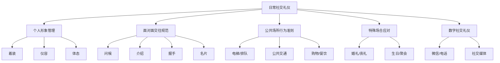
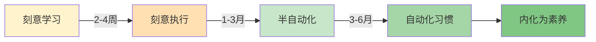

## 一、日常社交礼仪

日常社交礼仪是人与人之间非正式互动的基本规范体系。它不像商务礼仪那样严格刻板，也不像国际礼仪那样需要跨文化知识储备，但它渗透在每一天的每一次人际接触中——从清晨对邻居的一声招呼，到深夜给同事发的一条消息。掌握日常社交礼仪的核心价值在于：**降低人际摩擦成本，建立可信赖的个人形象，让每一次互动都成为关系的正向投资。**

心理学中的"首因效应"（Primacy Effect）告诉我们，人在初次接触的7秒内就会形成对对方的持久印象，而日常社交礼仪恰恰决定了这7秒的质量。社会学家欧文·戈夫曼在《日常生活中的自我呈现》中提出"印象管理"理论：每个人在社交中都在进行"表演"，而礼仪就是这场表演的剧本。掌握它，不是虚伪，而是对他人感受的尊重和对社交效率的追求。

### 1.1 个人形象礼仪

个人形象是无声的社交语言。心理学家阿尔伯特·梅拉比安（Albert Mehrabian）的研究表明，在面对面沟通中，视觉信息（外表、体态）占信息传递总量的55%，远超语言内容（7%）和语调（38%）。这意味着你的穿着打扮和体态举止，在别人开口听你说什么之前，已经"说"了绝大部分。

#### 1.1.1 着装原则

着装不是审美问题，而是**社会信号**问题。你穿什么，在向周围人传递"我是谁""我重视什么""我对这个场合的态度是什么"三重信息。

**TPO原则——着装的底层逻辑**

TPO原则是国际通行的着装决策框架，由日本时装协会于20世纪60年代系统提出：

| 维度 | 含义 | 决策要点 |
|------|------|----------|
| **T（Time）** | 时间 | 季节、时段（上午/下午/晚间）、天气 |
| **P（Place）** | 地点 | 室内/室外、城市/乡村、正式/休闲场所 |
| **O（Occasion）** | 场合 | 活动性质、参与者身份、文化背景 |

掌握TPO的关键不在于记住规则，而在于养成**到场前思考**的习惯：在出门前花30秒想清楚"今天去哪、见谁、做什么"，然后据此调整着装。这个30秒的投入，能避免90%的着装失礼。

**着装的四个层次**

| 层次 | 说明 | 典型场景 | 核心要求 |
|------|------|----------|----------|
| 正式（Formal） | 最高标准 | 颁奖典礼、高端晚宴、重要仪式 | 男士深色西装三件套/燕尾服，女士晚礼服/旗袍 |
| 商务（Business） | 专业可信 | 商务会议、客户拜访、行业论坛 | 深色西装、素色衬衫、保守配饰 |
| 商务休闲（Smart Casual） | 专业但不死板 | 日常办公、同事聚餐、行业沙龙 | 西裤+针织衫/衬衫，女士连衣裙+开衫 |
| 休闲（Casual） | 舒适自然 | 朋友聚会、家庭活动、周末出行 | 整洁得体即可，避免睡衣拖鞋出门 |

**男士着装细节指南**

西装是男士社交场合的核心装备，但大多数人对西装的细节规范并不清楚：

- **肩线**：西装的肩线应与肩膀自然齐平，肩垫不应超出肩骨。过宽显得邋遢，过窄显得局促——这是判断西装是否合身的第一个也是最重要的指标
- **扣子规则**：单排两粒扣西装只扣上面一粒，单排三粒扣只扣中间一粒（或上面两粒），双排扣全部扣上。站立时扣上，坐下时解开。这个规则的起源与英国国王爱德华七世有关——他因为体型偏胖扣不上最后一粒扣子，后来这就成了社交规范
- **衬衫**：领口应能舒适地插入一根手指，不能太松也不能太紧。袖口应露出西装袖口1.5-2.5厘米。白色和浅蓝色是最安全的商务色，粉色和淡紫色可用于商务休闲场合
- **领带**：标准长度是尖端刚好触及皮带扣上沿。宽度应与西装翻领宽度协调——窄领带配窄翻领，宽领带配宽翻领。领带夹应位于衬衫第三和第四颗扣子之间
- **裤子**：裤脚应刚好触及鞋面，形成轻微的褶皱（称为"break"）。无break适合休闲场合，quarter break适合大多数正式场合
- **袜子**：颜色与裤子一致或更深，长度应保证坐下时不会露出腿部皮肤。白色运动袜配西装是最常见的失礼搭配
- **皮鞋**：深色西装配黑色或深棕色皮鞋，浅色西装配棕色系皮鞋。德比鞋（Derby）适合日常，牛津鞋（Oxford）适合正式场合。保持鞋面清洁光亮——有研究显示，人们在判断一个人是否注重细节时，会下意识地先看鞋子

**女士着装细节指南**

女士的着装选择范围更广，但核心原则不变：得体、舒适、自信。

- **套装**：剪裁应贴合身形但不紧绷，肩线自然，裙装长度在膝盖上下5厘米为安全范围。黑色、深蓝、驼色是最百搭的商务色系
- **裙装与裤装**：正式场合中裙装和裤装均可接受，但裙装搭配丝袜更为正式。避免超短裙、低胸装、透视面料——这些在任何社交场合都容易引发不必要的关注
- **鞋子**：中跟（3-5厘米）是最安全的高度，既修饰腿型又保证长时间站立的舒适性。尖头鞋比圆头鞋更正式，露趾鞋不适合正式场合。避免在需要走很多路的场合穿全新未磨合的鞋子
- **配饰**：遵循"减法原则"——当你犹豫要不要戴某件配饰时，答案通常是不戴。正式场合的配饰总量建议不超过三件（耳环算一件、项链算一件、手镯/手表算一件）
- **包袋**：正式场合使用结构化的手提包或信封包，避免双肩包和帆布袋。包的大小应与场合匹配——参加晚宴带一个能装下手机和口红的小手包就够了

**配色的安全公式**

很多人在配色上犹豫不决，以下是经过验证的安全搭配方案：

- **全深色方案**：深色上装+深色下装+深色鞋——适合正式场合，显瘦、显沉稳
- **上深下浅**：深色上装+浅色下装+中间色鞋——适合休闲场合，视觉上轻盈
- **同色系渐变**：同一色系的深浅搭配——高级感最强，但需要一定搭配功力
- **经典对比**：黑白配、蓝白配、灰粉配——永远不会出错的经典组合
- **一个亮点原则**：全身只有一个颜色跳脱的单品（如红色领带、丝巾、胸针），其余全部中性色——既不单调又不花哨

#### 1.1.2 仪容仪表

仪容仪表是着装的延伸，也是最容易被忽视的环节。很多人花大量时间挑衣服，却忽略了头发、皮肤、指甲这些"近距离社交"中别人最先注意到的细节。

**头发管理**

- 男士建议每3-4周修剪一次，两侧和后脑勺的头发不应触及耳朵和衣领。商务场合避免过于夸张的发色和造型
- 女士长发在正式或工作场合建议扎起或半扎，避免遮挡面部。无论长短，头发的清洁度和光泽度比造型更重要
- 头皮出油是形象杀手：如果早上洗头后下午就出油，可以使用干发喷雾应急，或者调整洗发频率和产品

**面部护理**

- 男士胡须应每天修剪或选择完全剃净——半长不短的胡茬会传递"邋遢"信号而非"成熟"信号
- 女士妆容遵循"自然为上"原则：底妆遮瑕、眉毛修整、唇色提气色——这三步足以应对90%的社交场合
- 无论男女，面部清洁和基础保湿是底线。油光满面或干燥起皮都会让对方本能地产生不适感

**手部与指甲**

- 手是社交互动中暴露最多的部位——握手、递东西、拿杯子时都会被看到。指甲应修剪整齐、保持清洁，长度不超过指尖2毫米
- 女士指甲油选择裸色、豆沙色、淡粉色等安全色，避免黑色、荧光色、过于花哨的美甲——除非场合明确欢迎创意表达
- 嘴唇干裂、手部粗糙是社交中的减分项，一支润唇膏和护手霜就能解决

**气味管理**

- 香水的社交法则：**"好的香水应该被发现，而不是被宣布"**。在办公室、电梯、会议室等密闭空间，你的香水只应被距离你30厘米以内的人闻到
- 喷洒位置：耳后、手腕内侧、颈后。每个位置喷一下即可。不要在出门前的密闭房间里大量喷洒
- 口气问题比体味更影响社交：随身携带薄荷糖或口腔喷雾，避免在社交前食用大蒜、洋葱、韭菜等重口味食物

#### 1.1.3 体态语言

体态语言是一种比言语更诚实的沟通方式。人的语言可以修饰，但身体姿态往往会泄露真实的心理状态。掌握良好的体态语言，不仅让你看起来更自信，还能反过来通过"具身认知"（Embodied Cognition）效应影响你的情绪状态——哈佛大学艾米·卡迪的研究表明，保持"权力姿势"2分钟可以降低皮质醇（压力激素）水平、提高睾酮水平。

**站姿**

正确站姿的标准检查方法：背靠墙站立，后脑勺、肩胛骨、臀部、小腿肚、脚后跟五点接触墙面。这就是你日常站立时脊柱应有的自然曲度。

- 双脚与肩同宽，重心均匀分布或稍偏前脚掌
- 肩膀自然下沉，不耸肩、不含胸
- 头部正直，下巴微收，目视前方
- 双手自然垂放于身体两侧，或在身前交握。避免双手插口袋（显得随意）、双臂交叉（显得防御）、双手背后（显得傲慢）

**坐姿**

坐姿在社交场合中暴露你的教养程度比任何其他体态都多：

- 正式场合：男士双脚平放地面，膝盖与肩同宽；女士双膝并拢，双脚交叉或斜放。入座时从椅子左侧进入，坐到椅子的前2/3，不要靠满椅背
- 休闲场合：可以稍微放松，但仍需注意——不要抖腿（这是最常见的坏习惯，心理学上称为"自我安抚行为"，暴露焦虑和不耐烦）、不要瘫坐在沙发上、不要把脚翘到桌面上
- 与人交谈时：身体微微前倾5-10度表示关注，完全后仰表示漠不关心。双腿不要指向对方（脚尖方向暗示你想离开的方向）

**走姿**

走路的姿态是动态中的名片：

- 步幅适中——过大会显得急躁，过小会显得犹豫。成年人的正常步幅约为身高的45%
- 抬头挺胸，目视前方地面1.5-2米处（而非盯着手机或低头看脚）
- 手臂自然摆动，不插口袋、不背手、不抱胸
- 在人群中穿行时说"不好意思"或"借过"，不要默默挤过去

**手势**

手势是口语的辅助工具，用得好加分，用不好减分：

- 指示方向时用手掌（五指并拢，掌心向上）而非食指——食指指人在多数文化中被视为不礼貌
- 交谈中的手势应控制在"社交距离框"内——以肩膀为宽度、腰部到胸部为高度的空间
- 避免频繁摸脸、摸头发、玩弄笔或手机——这些动作传递紧张和不专注的信号
- "OK"手势在多数场合表示肯定，但在巴西和土耳其是侮辱性手势。跨文化社交时注意核查

**眼神接触的科学**

眼神是体态语言中信息密度最高的部分：

- 社交对话中，保持60-70%的时间有眼神接触是"舒适区"——低于40%显得回避，高于80%显得有压迫感
- 三角注视法：在对方的两眼和鼻尖之间形成的三角区域内移动目光，比直直盯着瞳孔更自然
- 如果直接对视让你紧张，可以看对方眉心或鼻梁的位置——对方几乎分辨不出区别
- 在群体对话中，眼神应均匀分配给所有在场者，不要只盯着一个人说话

### 1.2 日常交往礼仪

日常交往礼仪涵盖人与人之间从初见到熟识的全流程规范。每一次交往都遵循一个基本模式：**接触（问候）→ 建立连接（介绍）→ 确认关系（握手/交换信息）→ 深化（后续互动）**。掌握这个流程中每个环节的规范，就能在任何社交场合从容应对。

#### 1.2.1 问候礼仪

问候是社交互动的启动按钮。一个得体的问候能在2秒内建立积极的互动基调，而一个失礼的冷淡反应可能让你花整个社交场合都无法弥补。

**问候的心理学机制**

问候的本质是"社会认可信号"——你在告诉对方"我看到你了，我承认你的存在，我愿意与你互动"。社会心理学研究表明，被忽视（"社交冷暴力"）对人的心理伤害程度不亚于直接的言语攻击。因此，**看到熟人而不打招呼，是比打招呼不得体更严重的失礼行为。**

**问候的核心要素**

一个完整的问候应包含四个元素：称呼 + 问候语 + 非语言信号 + （可选）寒暄话题

| 元素 | 正确示例 | 错误示例 | 说明 |
|------|----------|----------|------|
| 称呼 | "王总""李姐""张老师" | "喂""那个人" | 用对方习惯的称谓，不确定时用"您好" |
| 问候语 | "早上好""最近怎么样" | （沉默点头） | 简洁但必须有语言表达 |
| 非语言信号 | 微笑+眼神接触+微微点头 | 面无表情/看手机 | 70%的信息通过非语言传递 |
| 寒暄话题 | "今天天气不错""最近忙不忙" | 沉默等待对方先开口 | 打破僵局的缓冲垫 |

**不同关系的问候策略**

- **陌生人**：微笑+点头即可。如果需要接触，先说"您好，打扰一下"再进入正题
- **点头之交**（邻居、同楼办公人员）："你好"+微笑，不需要停下来深度交流
- **普通朋友**："嗨，好久不见！最近怎么样？"——然后根据对方回应判断是否需要深入
- **亲密朋友**：可以更随意，但仍需有语言或肢体的问候动作——"嘿！"然后击掌、拥抱或拍肩
- **长辈/上级**：主动问候，使用尊称。"王老师好！""陈总，您好！"

**时间维度的问候语选择**

| 时间段 | 正式 | 半正式 | 休闲 |
|--------|------|--------|------|
| 早上（6:00-12:00） | 早上好 | 早啊 | 嗨/早 |
| 下午（12:00-18:00） | 下午好 | 下午好 | 嗨/Hey |
| 晚上（18:00-22:00） | 晚上好 | 晚上好 | 嗨/嘿 |
| 深夜（22:00以后） | — | — | 不建议主动问候，除非紧急 |

**常见问候误区**

- ❌ "吃了吗？"——这个问候在现代都市社交中已经显得过时，且如果对方刚从医院出来或者正在节食，可能造成尴尬
- ❌ 问对方"你怎么瘦了/胖了"——评价他人身体是社交雷区，无论出发点多好
- ❌ "你看起来好累啊"——你可能想表达关心，但对方听到的是"你气色很差"
- ✅ 安全的万能话题：天气、环境、共同经历（"今天电梯等了好久""这个咖啡不错"）

#### 1.2.2 介绍礼仪

介绍是将两个独立的社交圈连接起来的桥梁行为。它不仅仅是说名字，更是为双方的后续互动提供"起始信息包"。好的介绍能让双方迅速找到共同话题，差的介绍则会让两个人在尴尬中沉默。

**自我介绍的层次模型**

根据场合的正式程度，自我介绍应有不同的详略：

| 层次 | 内容 | 适用场景 | 示例 |
|------|------|----------|------|
| 基础层 | 姓名 | 所有场景 | "你好，我叫张三" |
| 标准层 | 姓名+身份 | 一般社交 | "我是张三，在腾讯做产品经理" |
| 完整层 | 姓名+身份+关联点 | 正式社交 | "我是张三，腾讯的产品经理，是王总的大学同学" |
| 专业层 | 姓名+身份+价值主张 | 商务社交 | "我是张三，专注社交产品设计10年，目前在腾讯负责微信生态的产品规划" |

自我介绍的核心原则：**简洁、相关、可接话**。你说的每一句话都应该给对方提供一个继续话题的钩子。

**为他人介绍的优先级规则**

中国文化中的介绍顺序遵循"尊者优先知情"原则——让地位较高的人先获得信息，以便他决定如何回应。

介绍顺序（从后介绍给前）：
下级 → 上级
晚辈 → 长辈
男士 → 女士
家人 → 外人
后到者 → 先到者
单人 → 多人

**为他人介绍的标准话术**

标准格式："[尊者称谓]，请允许我介绍[被介绍者身份]。[被介绍者]，这位是[尊者身份]。"

示例："王总，这是我们部门新来的同事李明，做设计的。李明，这位是我们的合作方王总，做地产开发的。"

介绍时应补充双方可能的共同点或兴趣关联："王总也是摄影爱好者，你们可以聊聊。"这能大大降低后续对话的启动成本。

**介绍后的衔接动作**

很多人在介绍完就走开了，这是最常见的错误。介绍后的30秒是决定两个人能否成功建立连接的关键窗口：

- 介绍后应稍作停留，引导话题起头
- 如果观察到双方已经自然对话，可以礼貌离开
- 如果发现冷场，应主动提供话题："你们之前见过吗？""王总刚从日本回来……"
- 离开时说："你们先聊，我去那边招呼一下。"

#### 1.2.3 握手礼仪

握手是全球最通用的身体接触礼节。它的起源可以追溯到古希腊时期——伸出右手表示手中没有武器，展示和平意图。在现代社交中，握手仍然是商务和正式场合的标准问候方式。

**握手的技术规范**

- **力度**：大约等于握住一个鸡蛋而不碎的力度。过轻显得软弱或敷衍，过重显得粗鲁或具有攻击性
- **时间**：握住后上下摆动2-3次，总时长3-5秒。超过5秒会让对方不适
- **手位**：全掌相握，不要只握对方的手指（"死鱼式握手"）或抓住对方手腕（"钳子式握手"）
- **眼神**：握手时必须看着对方的眼睛并微笑。低头握手机或看别处是严重的失礼
- **站姿**：握手时应站立。如果坐着，应起身握手——除非身体不便

**握手的发起权**

谁先伸手是一个容易犯错的细节：

| 场景 | 先伸手的人 | 原理 |
|------|-----------|------|
| 上级与下级 | 上级 | 尊者优先表达意愿 |
| 长辈与晚辈 | 长辈 | 尊老原则 |
| 女士与男士 | 女士 | 女士优先原则 |
| 主人与客人（迎接） | 主人 | 表示欢迎 |
| 主人与客人（告别） | 客人 | 表示感谢 |
| 平辈之间 | 先到者/年长者 | 时间或年龄的自然顺序 |

**握手的禁忌清单**

- ❌ 湿手握手——手心出汗时先在裤子/裙子上快速擦一下，或使用纸巾
- ❌ 戴手套握手——除非是女士的装饰性手套或极寒天气下的保暖手套
- ❌ 左手握手——在大多数文化中，左手被视为不洁。除非右手有伤，否则一律用右手
- ❌ 握手时另一只手插口袋——这传递"我不在乎"的信号
- ❌ 用双手覆盖式握手（"政客式握手"）——除非你和对方非常熟悉，否则这种亲密度的突然升级会让对方不适
- ❌ 疫情后的替代方式：如果对方明显不想握手（把手背在身后或合十），不要强行伸手。点头微笑+语言问候同样有效

#### 1.2.4 名片礼仪

虽然数字时代让名片的使用频率下降了，但在正式商务社交中，名片仍然是重要的身份确认工具和后续联系的起点。一张名片的交换过程，本质上是两个社交网络节点建立连接的仪式。

**递送名片的规范**

- 时机：在初次见面问候之后、正式交谈开始之前递出。不要在对方正在吃东西、打电话或与第三人交谈时递名片
- 姿态：起身站立，双手拇指和食指夹住名片两端，文字正面朝向对方——让对方接过来就能直接阅读
- 话术：递名片时说"这是我的名片，请多指教"或"方便的话，我们交换一下名片"
- 名片状态：保持名片整洁、无折痕、无污渍。从名片夹中取出，不要从裤兜里掏出来

**接收名片的规范**

- 双手接收，接过后认真阅读5-10秒——这是对对方身份的尊重
- 可以就名片上的内容提问或赞赏："这个公司地址是在陆家嘴吧？环境很好"——这既是寒暄也是在向对方表示"我认真看了你的名片"
- 收入名片夹或上衣口袋（西装内袋），绝对不要塞进裤后口袋（等于让对方"坐在"你的名片上）
- 在多人场合，不要把名片与其他人混在一起——按照座位顺序排列在桌上可以帮助你记住谁是谁

**数字名片的兴起**

在数字社交时代，二维码名片（微信、LinkedIn）已经成为更高效的选择：

- 微信加好友时附上一句自我介绍，而不是直接发二维码让对方扫
- 收到微信好友请求时，在备注栏写明对方的姓名、认识场合和时间，否则三个月后你将完全不记得这个人是谁
- 如果用LinkedIn等职业社交平台，个人资料的完整性比名片上的信息更重要——确保头像专业、职位描述准确

### 1.3 公共场所礼仪

公共场所是检验一个人社交修养的试金石。在没有熟人监督的情况下，你如何对待陌生人和公共环境，反映的是内化的道德水准而非外在的社交表演。

#### 1.3.1 电梯礼仪

电梯是一个极度压缩的社交空间——人们被迫共享1-2平方米的封闭空间30秒到2分钟。正因为这种被迫的亲密，电梯礼仪显得格外重要。

**进出规则**

- 先出后入：电梯到达后，让里面的人先出来，再依次进入。这一点看似简单，但在中国大城市的写字楼电梯间，每天都在上演"人堵人"的场景
- 主动按住开门键：看到有人快步赶来时，按住开门键等一下。这个3秒的举手之劳能换来对方的真诚感谢和你自己的良好心情
- 楼层近的人站门口：如果你只上一两层，应主动站在离门最近的位置，避免到达时需要别人让路

**电梯内的社交距离**

- 面向电梯门站立，不要面朝其他人——这是电梯里默认的空间分配规则
- 保持安静。电梯内不是聊天的场所，特别是有陌生人在场时。如果需要交流，降低音量
- 不要长时间盯着别人看。在密闭空间中，眼神接触会因为物理距离的缩短而被放大为侵略性
- 手机静音或振动模式。接电话时尽量简短："我现在在电梯里，稍后回你。"
- 如果你是最后进入的人且电梯超载提示响起，应主动退出——这是最基础的公德心

#### 1.3.2 排队礼仪

排队是社会文明程度的微观缩影。它考验的不是你的体力或智力，而是你的**延迟满足能力**和**公平意识**。

**基本规则**

- 自觉排队，先到先得。插队不仅是行为失当，更是对所有排队者时间的不尊重
- 保持与前方约一臂之距（75-100厘米），太近会让人不安，太远可能被误解为不是在排队
- 不催促前面的人，不表现出不耐烦——别人也有权利用和你一样的时间
- 遵守"一米线"规则：在银行柜台、医院窗口、自助取款机等涉及隐私的场所，与正在办理业务的人保持一米以上距离

**特殊情况处理**

- 如果你需要中途离开（比如去上厕所），应告知前后的人"我暂时离开一下，马上就回来"，并尽快返回。如果超过5分钟，应放弃原来的位置
- 如果前面有人让你帮忙占位，但超过10分钟还没回来，你有权不继续等待
- 外卖骑手、快递员等因工作性质需要优先时，在不影响你重大利益的前提下适当让步是一种善意

#### 1.3.3 乘坐交通工具礼仪

**公交与地铁**

这是大多数人每天都会经历的场景，也是公共礼仪最被频繁考验的场所：

- **让座**：看到老、弱、病、残、孕、抱小孩者应主动让座。让座时不需要大张旗鼓地说"您坐"——直接起身，微微示意即可。过度高调的让座反而会让被让座者感到尴尬
- **音量控制**：不外放音乐、视频、游戏音效。通话尽量简短并压低音量。这是地铁乘客投诉最多的问题
- **空间意识**：背包放在身前而不是身后（身后的大背包在拥挤车厢里会不断撞击别人）。雨天湿伞不要放在座位上。不要在车厢内吃气味浓烈的食物
- **上下秩序**：先下后上。在门口等待时，应站在门两侧让出通道，而不是堵在正中间

**私家车/出租车座次**

这是一个很多人不清楚但非常容易出错的领域：

尊卑顺序（后排 > 前排，右侧 > 左侧）：

情况一：专职司机开车
后排右座（最尊）> 后排左座 > 后排中座 > 前排副驾

情况二：主人/朋友开车
前排副驾（最尊）> 后排右座 > 后排左座 > 后排中座

上车顺序：卑者先上，尊者后上（方便尊者选择位置）
下车顺序：卑者先下，尊者后下（方便卑者为尊者开门）

坐在副驾驶还有一个重要意义：**避免让开车的人感觉像司机**。如果是朋友或同事开车，坐后排而不坐前排，会让对方感觉自己只是在"服务"你。

**高铁/飞机**

- 过道座位的人在靠窗乘客需要离开时应主动起身让路，不要只是歪腿——这会让靠窗的人非常为难
- 调节座椅靠背前应先回头看一下后方乘客是否正在使用小桌板
- 使用耳机，音量调到不影响邻座的程度（通常音量的40-50%即可）
- 中间座位的乘客拥有两侧扶手的优先使用权——这是对"最差座位"的补偿礼节
- 脱鞋可以，但必须确保没有异味。长途航班中带一双干净的袜子和拖鞋是对邻座的基本尊重

#### 1.3.4 购物与餐饮场所礼仪

**购物场景**

- 试穿/试用后放回原处或交给店员，不要随意丢在其他货架上
- 在结账时准备好支付方式，不要到你了才开始翻包找手机
- 对服务人员说"谢谢"不是可选的——它是最基本的社交素养。有研究表明，经常对服务人员说谢谢的人，在职场中也更容易获得同事的支持

**餐厅场景**

- 进入餐厅后不要自行换桌，先和服务员沟通
- 手机扣放在桌上（屏幕朝下）表示"我专注于和你们的对话"——这是现代社交中的一个重要信号
- 不要用筷子敲碗、不要把筷子竖插在饭里（在中国文化中与祭祀有关）、不要用筷子指着别人
- 吃到异物时冷静处理——叫服务员过来，低声说明情况，而不是大声嚷嚷吸引全场注意。你的处理方式会成为同伴评判你修养的标准
- 剩菜打包不丢人，浪费才丢人

### 1.4 特殊社交场合礼仪

特殊场合是指有明确主题、特定着装要求和行为预期的社交活动。在这些场合中，你的行为不仅要符合一般社交礼仪，还要顾及活动的情感基调和文化含义。

#### 1.4.1 婚礼礼仪

婚礼是人生中最重要也最复杂的社交活动之一。作为宾客，你的角色是：**真诚地祝福、配合流程、不抢风头。**

**收到邀请后**

- 在24-48小时内回复是否出席（RSVP）。不要让新人反复追问——筹备婚礼已经够累了
- 了解着装要求。中式婚礼通常喜庆热闹，西式婚礼可能更注重仪式感。如果是少数民族婚礼或宗教婚礼，提前了解特殊禁忌
- 准备红包或礼物。红包金额参照当地习俗和与新人的亲疏关系。一般同事200-500元，好友500-1000元，至亲1000元以上。数字应为偶数，避免带4的金额，带6和8的金额最受欢迎

**婚礼当天**

- **提前15-20分钟到场**，不要迟到——婚礼流程是精确编排的，你的迟到可能影响整体安排
- 着装得体但不抢新娘风头。**绝对不要穿白色**（西方传统中白色是新娘专属色），也避免穿全黑色（在中国婚礼中黑色不吉利）。粉色、蓝色、淡紫、米色都是安全的选择
- 仪式进行中保持安静，手机静音。不要在新郎新娘说话时交头接耳
- 拍照发朋友圈之前先确认新人是否介意——有些新人不希望婚礼照片被提前公开
- 控制饮酒量。婚礼上的醉酒宾客是新人最头疼的问题之一
- 如果安排了互动游戏或节目，积极参与。如果你被邀请上台发言，准备一个简短（2-3分钟）的真诚祝福，不要长篇大论

#### 1.4.2 丧礼礼仪

丧礼是所有社交场合中情感强度最高、行为规范最严格的场景。在这里，你的每一个动作都在向逝者家属传递"我和你们站在一起"的信号。

**核心原则：尊重、肃穆、陪伴**

- 穿着深色、素色服装（黑色、深蓝、深灰）。避免鲜艳色彩、花哨图案、浓烈香水
- 到场后先向家属表达哀悼。标准话术："请节哀顺变"或"我对XX的离去深感悲痛，他/她是一位非常好的人"。不要说"我理解你的感受"——除非你真的经历过类似的丧失
- 不要询问去世原因（除非家属主动提起），不要发表"他终于不痛苦了"之类的评价——即使出于好意也可能造成二次伤害
- 在灵堂或告别仪式中保持肃静，手机关机或静音。不要拍摄灵堂或遗体照片
- 事后1-2周内主动联系家属，邀请他们出来散心或帮忙处理一些力所能及的事务。丧礼当天的慰问是礼节，丧礼后的持续关怀才是真正的支持

#### 1.4.3 生日聚会与私人聚会礼仪

**生日聚会**

- 准备一份礼物。不需要昂贵，但需要体现你的用心——了解寿星的兴趣和需求比花多少钱更重要
- 定时到达（准时或迟到5分钟以内）。太早会让主人措手不及，太晚会错过重要环节
- 参与蛋糕环节时一起唱生日歌、一起许愿吹蜡烛——不要在这个时候玩手机
- 帮助主人收拾是加分项，但不要帮倒忙——如果主人说"不用了"，就真的不用了

**一般私人聚会**

- 带一份伴手礼（水果、甜点、酒水），空手登门是大忌
- 不要翻动主人家的私人物品，不要未经允许进入卧室或书房
- 主人开始收拾碗碟、打哈欠、说"今天真开心"时，就是你应该告辞的信号。不要做最后一个离开的人
- 离开时当面感谢，回家后再发一条感谢消息——这会让主人觉得自己的付出被看见了

### 1.5 日常社交中的高频雷区

以下是最常见、最容易犯但杀伤力最大的社交失误。每个都是真实场景中高频出现的问题：

| 雷区 | 为什么是雷区 | 正确做法 |
|------|-------------|----------|
| 当众指出别人的错误 | 让对方在众人面前丢脸 | 私下提醒 |
| 过度自我中心 | 交谈变成独角戏 | 遵循"40说60听"原则 |
| 打断别人说话 | 传递"我不尊重你的表达权" | 等对方说完再回应 |
| 手机不离手 | 传递"你不重要"的信号 | 重要对话时手机扣放 |
| 不分场合开玩笑 | 幽默变冒犯 | 评估对方接受度再决定 |
| 背后议论他人 | 传到当事人耳中不可挽回 | 人前人后一致 |
| 过度追问私人问题 | 侵犯个人边界 | 等对方主动分享 |
| 收到好意不说谢谢 | 让施善者觉得不被珍惜 | 即时、具体地表达感谢 |

**"40说60听"原则的实操方法**

社交能力强的人不是"会说话"的人，而是"会听话"的人。具体做法：

1. **提问优先于陈述**："你觉得呢？"比"我觉得……"更能建立连接
2. **复述确认**："所以你的意思是……"——这表明你在认真听
3. **跟进细节**：对方提到周末去爬山了，问"去的哪座山？风景怎么样？"——而不是立刻切换到自己的话题
4. **不做评判**：听到不同观点时，先说"有道理"再表达自己的看法，而不是直接反驳

### 1.6 日常社交礼仪的内化路径

知道规则和做到之间有一条鸿沟。以下是将社交礼仪从"刻意执行"转化为"自然习惯"的路径：

**阶段一：刻意学习期（2-4周）**

- 选择3-5个最需要改进的领域，每周专注练习一个
- 每天社交结束后花5分钟回顾：今天有没有失礼的地方？下次可以怎么改进？
- 观察身边社交能力强的人是怎么做的——他们的问候方式、坐姿、交谈节奏

**阶段二：刻意执行期（1-3个月）**

- 在真实社交场景中有意识地应用规则
- 这个阶段你会觉得"好累""好做作"——这很正常，任何新习惯的建立都需要经过不适区
- 接受自己会偶尔犯错。社交礼仪不是100分的考试，而是持续优化的过程

**阶段三：半自动到自动化（3-6个月）**

- 大部分规则已经不需要刻意思考
- 开始能根据场景灵活调整，而不是机械执行
- 从"遵守规则"升级到"理解规则背后的精神"——这是质变的起点

**最终阶段：内化为素养**

- 礼仪不再是外在约束，而是自然而然的行为方式
- 你能在陌生场合迅速判断合适的社交行为
- 从"不犯错"升级到"让别人感到舒服"——这才是社交礼仪的真正境界

> **核心提醒**：社交礼仪的终极目标不是让自己显得"有教养"，而是让身边的每一个人因为你的存在而感到舒适和被尊重。规则是工具，共情才是内核。当你不确定某个场合应该怎么做时，问自己一个问题：**"如果我是对方，我希望别人怎么做？"**——这个朴素的问题，几乎总能给你正确的答案。
